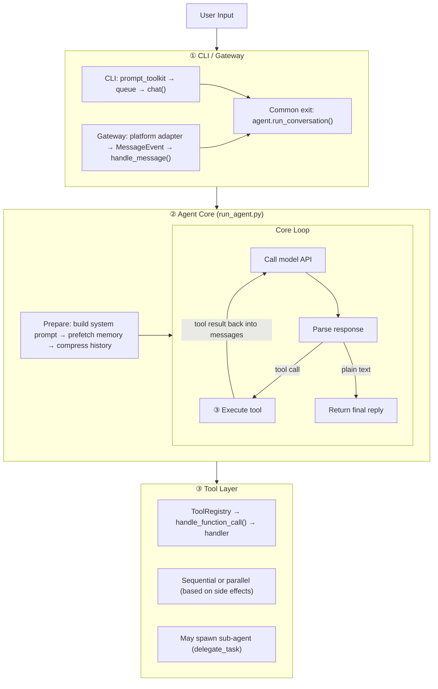
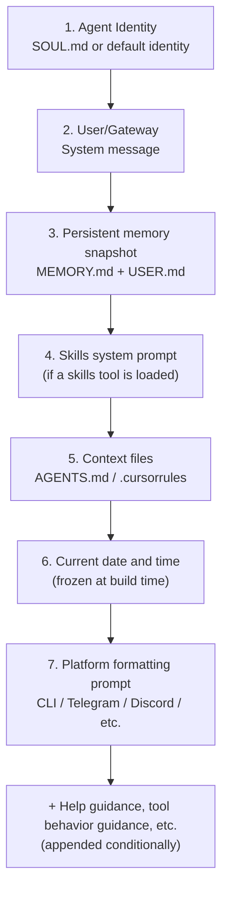
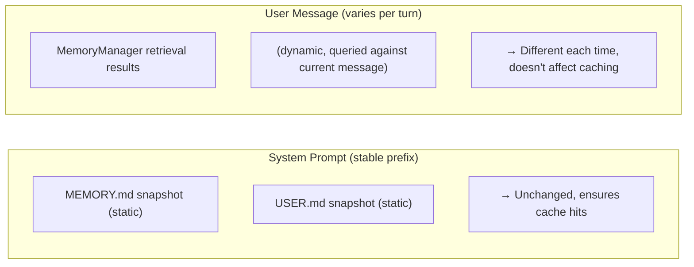
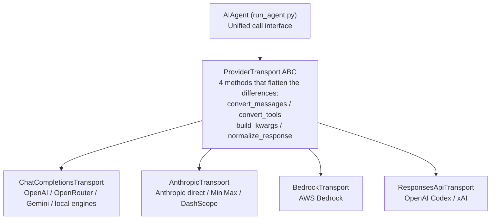
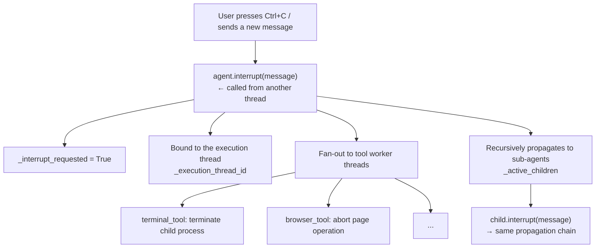

# 01 - A Message's Journey: Deep Dive into Hermes Architecture

[中文](../zh/01-架构分析.md) | English


> **Chapter scope**: Cross-module architectural analysis, tracing a message's complete path from input to output.
> **Code covered**: `cli.py` (11,395 lines), `run_agent.py` (13,293 lines), `agent/` (52 files, 29,201 lines), `tools/` (82 files, 54,531 lines), `gateway/` (53 files, 64,729 lines).

## Starting with a Question

Suppose you type this into the terminal: "Search for recent Python security vulnerabilities and organize them into a table." How does Hermes handle this message?

This isn't a simple "call an API, return text" operation. Between pressing Enter and seeing a result, the message passes through at least five layers of processing: input capture, prompt assembly, model invocation, tool execution, and result synthesis — with the last three repeating multiple times. Understanding this flow means understanding Hermes's entire architecture.

### The Full Request Picture

**Figure: Three processing layers a message passes through from user input to final reply (CLI/Gateway → Agent Loop → Tool Execution)**



Let's step through each stage.

## Stage 1: CLI Captures Your Input

Everything starts in `cli.py`'s main loop. The `HermesCLI` class uses `prompt_toolkit` (a Python terminal UI library) to build a fixed-input-area REPL (Read-Eval-Print Loop). User input is captured by `prompt_toolkit`'s TextArea and placed into a thread-safe queue, `_pending_input`.

The main thread's `process_loop()` (`cli.py:10819`) polls this queue every 100ms:

```python
while not self._should_exit:
    user_input = self._pending_input.get(timeout=0.1)
```

Once input arrives, it does one of three things: checks whether the input is a dragged-in file path, checks whether it's a slash command (e.g., `/model`, `/new`), or — for ordinary messages — calls `self.chat()` (`cli.py:8404`).

The `chat()` method launches the Agent call in a **background daemon thread** (`cli.py:8664`) rather than on the main thread. Why? Because the main thread needs to stay responsive — the user might press Ctrl+C to interrupt, or type a new message to override the current task. If the Agent call blocked the main thread, neither would be possible.

In the background thread, `chat()` calls the Agent core's entry method (`cli.py:8636`):

```python
result = self.agent.run_conversation(
    user_message=agent_message,
    conversation_history=self.conversation_history[:-1],
    stream_callback=stream_callback,
)
```

At this point, control passes from the CLI layer to the Agent core.

## Stage 2: Agent Core — A Loop That Keeps Spinning

`AIAgent.run_conversation()` (`run_agent.py:9627`) is the heart of the whole system. It takes the user message and conversation history, and returns the final reply. But what it does is far more complex than "make one API call."

### A Loop, Not a Single Call

The core of the Agent is a **while loop** (`run_agent.py:9993`):

```python
while (api_call_count < self.max_iterations
       and self.iteration_budget.remaining > 0) or self._budget_grace_call:
```

Why a loop? Because a model's response may not be the final answer — it might say "I need to search the web first" or "let me read that file." These are **tool calls**. The Agent loop works like this:

1. Call the model → get a response
2. If the response contains tool calls → execute the tools → put the results back into message history → go to step 1
3. If the response is plain text (`finish_reason == "stop"`) → exit the loop and return the final reply

The default maximum is 90 iterations (`max_iterations`, `run_agent.py:851`). There's also a second constraint — `iteration_budget` — a budget object shared between parent and child agents (`run_agent.py:951`). If your Agent spawns sub-agents, they share the same budget pool, preventing any sub-agent from consuming all remaining iterations uncontrolled.

### Before the Loop Starts

Before entering the loop, `run_conversation()` performs several preparatory steps:

**System prompt construction** (`run_agent.py:4543`, `_build_system_prompt()`). This isn't a simple block of fixed text — it's a multi-layer sandwich. The source code comments (`run_agent.py:4551-4558`) identify 7 main layers:

**Figure: The seven-layer sandwich structure of the system prompt (from Agent identity to platform formatting)**



In practice there are more layers than the 7 listed in the comments (including help guidance, tool-aware behavior guidance, subscription prompts, etc.), appended conditionally.

A key design point: this system prompt is **constructed only once per session**, then cached in `_cached_system_prompt` (`run_agent.py:9814`). Why? Some providers (e.g., Anthropic) support prefix caching — if the system prompt is byte-identical across requests, the server can reuse the previous KV cache, dramatically reducing latency and cost. Even for providers that don't support prefix caching, a stable system prompt benefits local inference engines (Ollama, vLLM, etc.) through their own KV cache reuse. If the prompt were rebuilt on every turn (e.g., with an ever-changing timestamp), the cache would be invalidated every time.

**Memory prefetch** (`run_agent.py:9989`). Before the first API call, `MemoryManager` uses the user's message as a query to prefetch relevant memory fragments. But these fragments are not injected into the system prompt (that would break caching) — they're injected into the **user message** (`run_agent.py:10131-10143`). This is Hermes's "dual injection" strategy:

**Figure: The dual memory injection strategy — static snapshot in the system prompt for caching, dynamic retrieval in the user message for freshness**



Static memory goes into the system prompt to guarantee prefix cache hits; dynamic retrieval goes into the user message to ensure freshness — balancing cache efficiency against information recency.

**Context compression** (`run_agent.py:9846-9905`). If the conversation history is already long (more than 75% of the context window, threshold defined in `agent/context_engine.py:59`), up to 3 rounds of compression are performed before entering the loop. The compressor (`agent/context_compressor.py`) doesn't simply truncate — it uses a cheap auxiliary model to summarize the middle messages, leaving the first 3 and last 6 messages untouched. The summary budget is 20% of the compressed content, capped at 12,000 tokens (`context_compressor.py:55-57`).

## Stage 3: Crossing the Provider Divide

Every model call inside the loop faces the same problem: different providers have completely different API formats. Anthropic uses a `messages` array with a separate `system` parameter; OpenAI puts the system message inside the messages array; AWS Bedrock has its own Converse API; OpenAI's Codex uses the Responses API.

### The Scale of the Problem

Hermes doesn't support just "a few" providers. It supports 20+, from cloud giants (OpenAI, Anthropic, Bedrock, Gemini) to open-source inference engines (Ollama, vLLM, llama.cpp) to domestic platforms (Kimi, MiniMax, Qwen). Writing separate call logic for each would bloat `run_agent.py` beyond maintainability.

### The Transport Abstraction Layer

**Figure: The ProviderTransport abstraction layer unifies 20+ API providers into four implementations**



Hermes's solution is an abstract base class called `ProviderTransport` (`agent/transports/base.py:16`). The core idea is straightforward: regardless of what the underlying API looks like, every call from the Agent core's perspective has exactly four steps:

1. **convert_messages()** — convert OpenAI-format messages into what the provider expects
2. **convert_tools()** — convert tool definitions into the provider's format
3. **build_kwargs()** — assemble the complete API call parameters
4. **normalize_response()** — convert the provider's response into a unified `NormalizedResponse`

There are currently four Transport implementations:

| Transport | Corresponding `api_mode` | Providers Covered |
|-----------|--------------------------|------------------|
| `ChatCompletionsTransport` | `chat_completions` | OpenAI, OpenRouter, Gemini, local engines, etc. (default) |
| `AnthropicTransport` | `anthropic_messages` | Anthropic direct, third-party Anthropic-compatible endpoints |
| `BedrockTransport` | `bedrock_converse` | AWS Bedrock |
| `ResponsesApiTransport` | `codex_responses` | OpenAI Codex, xAI |

The Agent auto-detects which Transport to use during initialization (`run_agent.py:982-1013`). The detection logic is a series of if-elif checks: it first looks for an explicitly specified `api_mode`, then infers from provider name or base URL characteristics. For example, a third-party endpoint whose URL ends with `/anthropic` automatically uses `AnthropicTransport` — this supports MiniMax, DashScope, and similar domestic services that implement the Anthropic protocol.

### Why This Approach and Not Another

A simpler approach would be if-else branches in `run_agent.py` to handle each provider's differences — and in fact, that's how early Hermes worked (the Transport layer is a relatively recent extraction, visible in the v0.11.0 release notes). But as the provider count grew from a handful to 20+, the if-else branches made `run_agent.py` unmaintainable, leading to extraction into a separate Transport layer.

Another alternative would be using decorators or a plugin mechanism for auto-discovery of Transport implementations. Hermes chose the simpler registry pattern (`agent/transports/__init__.py:14`), with lazy imports — a given `api_mode` module isn't loaded until its first use, adding zero startup overhead. Adding a new provider only requires implementing four methods, with no changes to the Agent core.

If a Transport implementation has a bug (e.g., incorrect message format conversion), the blast radius is limited to providers using that Transport, without affecting others. That's the isolation value of the abstraction layer.

## Stage 4: Tool Execution — The Agent's Hands

When a model response contains tool calls, the Agent needs to actually "do things." This is handled by the tool layer.

### How Tools Get Registered

**Figure: Tool self-registration flow — AST scan discovers files, on-demand import follows, ToolRegistry assembles the schema list**

```mermaid
flowchart LR
    AST["model_tools.py<br/>discover_builtin_tools<br/>AST scan: which files have register() calls"] -->|on-demand import| Files["tools/*.py<br/>file_tools / web_tools / ..."]
    Files -->|module-level registry.register()<br/>executes automatically on import| Registry["ToolRegistry singleton<br/>66 tools"]
    Registry -->|get_tool_definitions| Schema["OpenAI-format schema list<br/>provided to AIAgent"]
```

Hermes uses a self-registration pattern. Each file (66 in total) under `tools/` calls `registry.register()` at module level when imported:

```python
registry.register(
    name="read_file",
    toolset="file",
    schema=READ_FILE_SCHEMA,
    handler=_handle_read_file,
)
```

But Hermes doesn't blindly import all tool files at startup — that would pull in heavy dependencies like Playwright, slowing down startup. `discover_builtin_tools()` (`tools/registry.py:56`) uses AST (Abstract Syntax Tree) static analysis to scan each .py file first; only files confirmed to contain `registry.register()` calls are imported. This avoids loading unnecessary dependencies — why load browser tools (which pull in Playwright) if the user only needs file operations?

### Sequential or Parallel

A single model response may contain multiple tool calls (e.g., searching three different keywords simultaneously). `_execute_tool_calls()` (`run_agent.py:8594`) determines whether the batch of calls can run in parallel:

```python
if not _should_parallelize_tool_batch(tool_calls):
    return self._execute_tool_calls_sequential(...)
return self._execute_tool_calls_concurrent(...)
```

The logic: read-only tools (like `read_file`, `web_search`) can always run in parallel; file reads and writes can only run in parallel if their target paths don't overlap; other tools with side effects run sequentially. This is a pragmatic choice — fully sequential is too slow, fully parallel risks race conditions, and classifying by side effects is a reasonable middle ground.

## Stage 5: Sub-Agents — Splitting Tasks Horizontally

Sometimes one Agent isn't enough. For "analyze these three files then write a report" — the analysis can run in parallel, but writing the report must wait for the analysis. Hermes enables the Agent to spawn sub-agents to process sub-tasks in parallel via the `delegate_task` tool (`tools/delegate_tool.py`).

Sub-agents are a recursive use of the Agent core — `delegate_tool` is the only tool that creates new `AIAgent` instances in reverse, forming an Agent → Tool Layer → Agent recursive structure. Sub-agents share the parent's iteration budget, can only use a subset of the parent's tools, and cannot nest by default. The detailed isolation mechanisms, approval handling, concurrency controls, and configurability are covered in the "Sub-Agents" section of [02-Agent Core](02-agent-core.md).

That completes the main journey of a message from input to output. Now let's look at two cross-cutting concerns — the gateway layer (where messages come from) and the interruption mechanism (how users can interrupt).

## The Gateway Layer: One Agent, Twenty Platforms

So far we've been talking about the CLI entry point. But Hermes has another important entry point: the messaging gateway — one process simultaneously connected to multiple chat platforms, letting users interact with the same Agent from Telegram, Discord, Slack, or anywhere else.

The motivation for the gateway's design was covered in the "Platform Fragmentation" section of [00-Project Overview](00-project-overview.md). Here we look at the implementation.

`GatewayRunner` (`gateway/run.py:620`) is the core controller. Between it and the Agent core sits an **Agent cache** (`run.py:709`), indexed by `session_key` (format: `"agent:main:<platform>:<type>:<chat_id>"`), reusing the same `AIAgent` instance for the same chat window. Why cache? Because creating an AIAgent is expensive — initializing clients, loading the toolset, building the system prompt, restoring session history. Creating a new one per message would add significant latency.

The cache holds up to 128 instances (`run.py:41`), evicting idle entries after 1 hour (LRU — Least Recently Used). Evicted sessions recreate the Agent and restore history from SQLite when the next message arrives — paying a one-time cold-start penalty, but without losing any conversation records.

The platform adapter pattern is similar to the Transport layer: `BasePlatformAdapter` (`gateway/platforms/base.py:1121`) defines three abstract methods (`connect()`, `disconnect()`, `send()`), and each platform implements its own version. Native platform events are converted to `MessageEvent` objects and passed through `handle_message()` (`base.py:2221`) into `GatewayRunner`, ultimately calling the same `AIAgent.run_conversation()` as the CLI.

If one platform's adapter crashes (e.g., a Telegram webhook drops), only that platform is affected — other platforms and the Agent cache are unaffected. The GatewayRunner will attempt to reconnect the failed adapter. When the Agent cache is full (128 entries), the LRU session is evicted; it recreates the Agent and restores history from SQLite the next time a message arrives.

## Interruption: When You Change Your Mind

At any point in the entire flow, the user might interrupt. Hermes has a multi-level interruption mechanism (`run_agent.py:4050-4149`):

**Figure: The multi-level recursive propagation chain of an interrupt signal, from Ctrl+C down to sub-agents**



1. Another thread calls `agent.interrupt(message)` → sets `_interrupt_requested = True`
2. Signal is bound to the Agent's execution thread
3. Propagated to all concurrent tool worker threads
4. Recursively propagated to all active sub-agents
5. The main loop checks the interrupt flag at the start of each iteration (`run_agent.py:9997-10003`); if set, break

There's also a gentler mechanism — `steer()` (`run_agent.py:4151`). Rather than interrupting the current operation, it buffers a piece of text and injects it into the results after the current tool batch completes. This is for "don't interrupt, but steer the next step in a different direction" scenarios.

## Dependencies: Strictly One-Directional

Looking back at the entire flow, module dependencies are **strictly one-directional**:

```
CLI / Gateway  →  Agent Core  →  Tool Layer
```

No reverse dependencies. Where reverse calls are needed (e.g., `delegate_tool.py` needs to create a new `AIAgent`; `gateway/run.py` needs to create an `AIAgent`), **lazy imports inside function bodies** break the cycle:

```python
# delegate_tool.py:866 (inside a function body, not at the module top)
from run_agent import AIAgent
```

This is intentional — the 13,000-line `run_agent.py` is depended upon by many modules. If it were allowed to import back from the tool layer or gateway, circular imports would form and Python would error. Lazy imports are the pragmatic solution.

## Summary of Key Design Patterns

| Pattern | Location | Problem Solved |
|---------|----------|----------------|
| Transport ABC | `agent/transports/base.py` | API differences across 20+ providers |
| Self-registering Registry | `tools/registry.py` | On-demand loading of 66 tools |
| Lazy Import | `delegate_tool.py`, `gateway/run.py` | Breaking circular dependencies |
| System prompt caching | `run_agent.py:9814` | Maximizing prefix cache hit rate (natively on Anthropic; benefits local engines too) |
| Dual memory injection | System prompt (static) + user message (dynamic) | Balancing cache efficiency against information freshness |
| Queued interruption | `cli.py:10824` | Main thread responsiveness vs. Agent thread execution |
| Sub-agent isolation | `delegate_tool.py:41-49` | Preventing concurrent write conflicts and infinite recursion |
| Agent cache | `gateway/run.py:41` | Reusing Agent instances across 128 sessions |

## What's Next

This architecture analysis traced a message's complete path from input to output. But we skipped many details — how exactly does Prompt Caching work? How does the system handle rate-limit 429s? How does the Credential Pool rotate multiple API keys? These will be explored in depth in **[02-Agent Core](02-agent-core.md)**.

---

*This document is based on analysis of hermes-agent v0.11.0 source code. All code references have been independently verified.*
