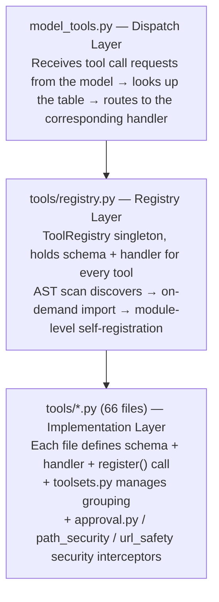
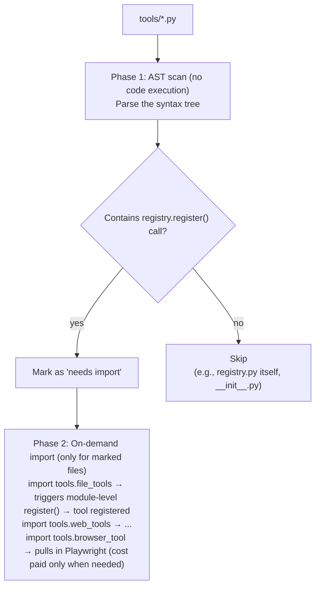
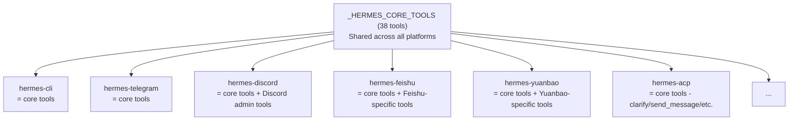
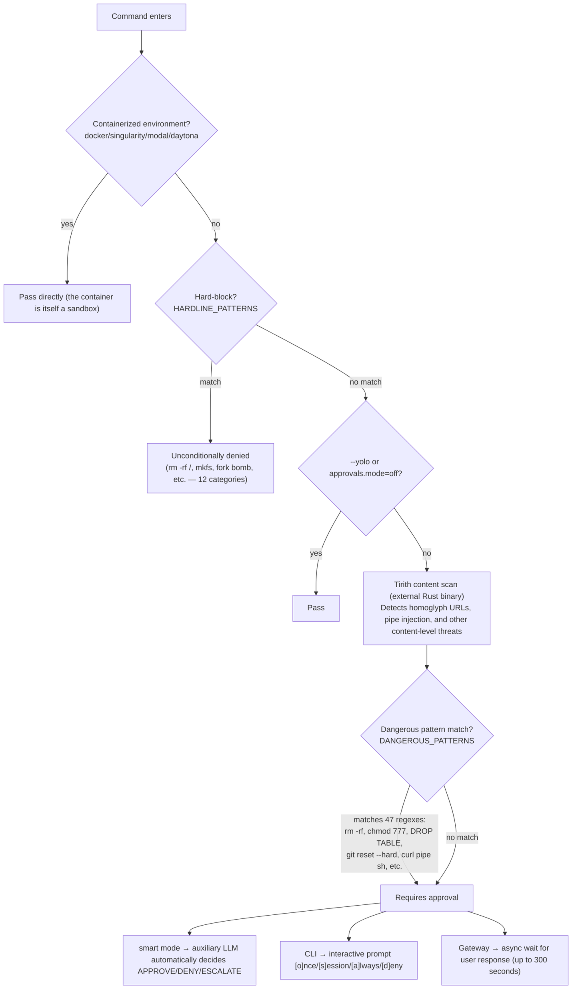
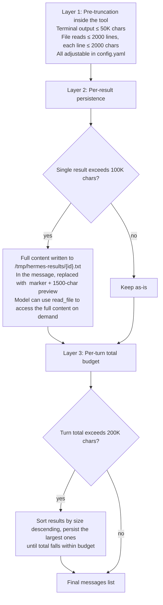

# 03 - The Tool System: The Agent's 66 Pairs of Hands

[中文](../zh/03-工具系统.md) | English


> **Chapter scope**: `tools/` directory (82 files, 54,531 lines) + `model_tools.py` (676 lines) + `toolsets.py` (784 lines). This is the tool layer — the Agent's execution capability stack.
> **Key classes**: `ToolRegistry` (`tools/registry.py:100`), `handle_function_call()` (`model_tools.py:500`).

## The Agent Can Think; Tools Let It Act

In the previous two chapters, we saw that AIAgent's core loop is "call the model → parse the response → execute tools → repeat." The model is responsible for decisions ("I should search the web"), but what actually does the searching isn't the model — it's the tool system. Without tools, the Agent is just a chatty API client.

Hermes's tool system has three layers:

**Figure: The three-layer structure of the tool system — dispatch layer, registry layer, implementation layer — with vertical dependencies**



## What a Tool Looks Like

Before understanding the overall tool system, let's look at a concrete tool definition. Take `read_file` as an example (`tools/file_tools.py`):

**Step 1: Define the Schema** (`file_tools.py:1025-1037`) — this tells the model "what this tool is called and what parameters it takes," using OpenAI's standard function-calling JSON format:

```json
{
  "name": "read_file",
  "description": "Read a text file with line numbers...",
  "parameters": {
    "type": "object",
    "properties": {
      "path": {"type": "string"},
      "offset": {"type": "integer", "default": 1},
      "limit": {"type": "integer", "default": 500, "maximum": 2000}
    },
    "required": ["path"]
  }
}
```

**Step 2: Implement the Handler** (`file_tools.py:1089-1091`) — a plain Python function that takes an `args` dict and keyword arguments, and returns a JSON string:

```python
def _handle_read_file(args, **kw):
    tid = kw.get("task_id") or "default"
    return read_file_tool(path=args.get("path", ""), ...)
```

All tool return values must be JSON strings. `registry.py` provides two helper functions (`registry.py:456-482`): `tool_result(data)` for success results and `tool_error(message)` for errors.

**Step 3: Register** (`file_tools.py:1118-1121`) — call `registry.register()` at module level:

```python
registry.register(
    name="read_file", toolset="file",
    schema=READ_FILE_SCHEMA, handler=_handle_read_file,
    check_fn=_check_file_reqs, emoji="📖",
    max_result_size_chars=float('inf')
)
```

These three steps are the pattern all 66 Hermes tools follow. Why use OpenAI's function-calling format rather than a custom format? Because it's the industry de facto standard — all major LLMs (OpenAI, Anthropic, Gemini) understand this schema. Hermes's Transport layer converts it to each provider's native format when necessary (e.g., Anthropic's `input_schema` format), but **tool definitions only need to be written once**.

## How Tools Are Discovered and Loaded

The 66 tool files aren't all imported at startup — that would pull in heavy dependencies like Playwright and faster-whisper, slowing launch. `discover_builtin_tools()` (`tools/registry.py:56`) uses a clever two-phase loading approach:

**Figure: Two-phase tool discovery — AST scan confirms necessity, then on-demand import avoids pulling in heavy dependencies**



Why use AST scanning rather than "import everything and try-except"? Because import executes module-level code, which may have side effects (like establishing database connections or starting background processes). AST only parses the syntax tree without executing code — it's a zero-side-effect discovery mechanism. If the AST scan itself fails (e.g., the file has a syntax error), that file is silently skipped with a warning logged (`registry.py:70`), without affecting other tools.

This mechanism is triggered at module level in `model_tools.py:139`, during Agent initialization.

Once tools are loaded, the next question is: should all of them be exposed to the model?

## Toolsets: The Same Tools, Different Contexts

Not every scenario needs every tool. A CLI user might need browser tools, but a Telegram group chat doesn't — and arguably shouldn't (imagine an Agent automatically opening a browser and visiting websites on behalf of a group).

`toolsets.py` addresses this. It defines a **shared core plus platform extensions** model:

**Figure: The shared-core-plus-platform-extensions model — 38 core tools shared by all platforms, each platform adding its own specialized tools**



The core tool list (`toolsets.py:31-63`) contains 38 tools: web_search, terminal, read_file, write_file, patch, search_files, browser series, memory, session_search, delegate_task, skills series, and more. This list is a **single source of truth** — change it in one place and all platforms are updated.

Each toolset supports three fields: `tools` (a direct list), `includes` (reference to other toolsets), and `description`. Recursive composition is supported — `resolve_toolset()` (`toolsets.py:529-579`) does a DFS expansion with cycle detection, preventing A includes B includes A infinite loops.

Users can override any platform's toolset via `config.yaml`'s `platform_toolsets`, or temporarily specify one via the `--toolsets` CLI argument. If a tool's dependency is unsatisfied (e.g., Playwright isn't installed), the tool's `check_fn` returns False at registration time and the tool is silently removed from the available list.

There's also a special-purpose `toolset_distributions.py` (`toolset_distributions.py:1-19`) — not for day-to-day use, but designed for `batch_runner.py`'s data generation scenarios. It defines 17 probability distributions (e.g., in the `research` distribution, web tools are activated 90% of the time and browser tools 70%) used to randomly vary tool combinations during batch trajectory generation, simulating the diversity of real-world usage patterns.

## Security: Three Lines of Defense

The most sensitive part of the tool system is security — the commands an Agent executes can delete files, modify system configuration, and make network requests. Hermes places three lines of defense on the tool invocation path.

### First Line: Command Approval (approval.py)

This is the most complex security mechanism, sitting between the tool layer and terminal execution. `check_all_command_guards()` (`approval.py:880`) is the entry point, executing the following checks in priority order:

**Figure: The six-level security check flow for command approval — from container exemption to hard-block to smart-mode LLM judgment**



Hard-block (`HARDLINE_PATTERNS`) and `--yolo` mode cannot coexist — even with `--yolo` enabled, `rm -rf /` is still denied. This is Hermes's security floor.

Approval results have four persistence levels: `once` (this invocation only), `session` (within the current session), `always` (written to config; same class of command won't prompt again), and `deny` (execution refused). The `always` level saves approval results to `config.yaml`'s `command_allowlist` (`approval.py:523-529`).

`smart` mode (`approval.py:703-747`) is an interesting design — an auxiliary LLM judges whether a command is safe, returning APPROVE, DENY, or ESCALATE (requires human intervention). This is particularly useful in Gateway scenarios — if every potentially dangerous command requires the user to reply with a confirmation on Telegram, the Agent's throughput suffers greatly. Smart mode acts like an AI security guard, automatically approving most safe operations and only bothering the user for genuinely suspicious ones.

### Second Line: Path and URL Safety

**Path safety** (`tools/path_security.py:15-34`) prevents path traversal attacks (accessing files outside the allowed directory by constructing paths like `../../etc/passwd`). `validate_within_dir()` uses Python's `path.resolve().relative_to(root)` to ensure tool operations don't escape the allowed directory. Used by skill management, cron tasks, credential file operations, and other modules.

**URL safety** (`tools/url_safety.py:1-231`) prevents SSRF (Server-Side Request Forgery). The core is `is_safe_url()` — it DNS-resolves URLs before checking the IP, **fail-closed** (DNS failure means deny). Particularly noteworthy: it permanently blocks all cloud platform metadata endpoints:

- `169.254.169.254` (AWS/GCP metadata service)
- `metadata.google.internal`
- Azure, DigitalOcean, and other metadata IPs

Even if `security.allow_private_urls: true` is set to open up private IPs, metadata endpoints remain inaccessible (`url_safety.py:162`). This means that even if the Agent is running on a cloud server, it cannot use tool calls to read the VM's IAM credentials — a real attack vector.

### Third Line: Tirith Content-Level Scanning

Tirith (`tools/tirith_security.py:1-692`) is an external Rust-based security scanner that detects content-level threats regular expressions can't catch (e.g., malicious URLs disguised with Unicode homoglyphs). It runs as an independent binary, auto-downloaded from GitHub releases on first use, with SHA-256 checksum and cosign supply chain signature verification (`tirith_security.py:282-383`) — a standard mechanism for verifying that a software package's origin hasn't been tampered with. The download runs in a background thread and doesn't block Agent startup.

Default `fail_open=true` — if Tirith is unavailable (not installed, download failed), commands proceed normally. This is a pragmatic choice: most users don't need content-level scanning, and requiring it would increase deployment complexity. For high-security scenarios, `security.tirith_fail_open: false` can be configured to switch to fail-closed.

## MCP: Making External Tools First-Class Citizens

Hermes's tools aren't limited to the 66 built-ins — through MCP (Model Context Protocol), any external service that implements the MCP protocol can register itself as a Hermes tool.

The MCP integration (`tools/mcp_tool.py`) runs on a dedicated background event loop (`mcp_tool.py:55-69`), supporting two transport modes: `stdio` (subprocess communication) and `streamablehttp` (HTTP long connection). Each MCP server's lifecycle is managed by an asyncio Task.

The key design decision is that **MCP tools use the exact same registration interface as built-in tools**. `discover_mcp_tools()` (`mcp_tool.py:2792-2838`) connects to configured MCP servers at startup, retrieves their tool lists, and registers them using the same `registry.register()`. From the Agent's perspective, MCP tools are indistinguishable from built-in tools — both are schema + handler combinations.

The distinction is in toolset naming: MCP tools' toolsets start with `mcp-` (e.g., `mcp-filesystem`), making them easy to enable or disable. Registration includes conflict protection (`registry.py:194-213`): MCP tools can overwrite each other (last registered wins), but MCP tools cannot overwrite built-in tools (and vice versa).

When an MCP server's tool list changes (e.g., a server upgrade adds new tools), the server sends a `tools/list_changed` notification, and Hermes automatically performs `deregister() + re-register` (`registry.py:229-252`), with no Agent restart needed.

Security-wise: MCP subprocesses inherit only a whitelist of environment variables (`_SAFE_ENV_KEYS`: PATH, HOME, USER, etc., `mcp_tool.py:252-267`), preventing sensitive credentials from leaking into external processes.

Security resolves "who can call what." The next governance dimension is: after a call, how large can the result be?

## Tool Result Size Governance

A practical problem: if a tool returns 1 MB of file content and all of it gets stuffed into message history, what happens? The context window explodes, API costs spike, and subsequent request latency increases.

Hermes uses a three-layer mechanism to control tool result sizes (`tools/tool_result_storage.py:1-23`):

**Figure: Three-layer mechanism for tool result size governance — pre-truncation, oversized result persistence, per-turn total budget**



The elegance of this design is that **it doesn't discard information**. The traditional approach is simply truncating oversized results (losing everything past the limit), but Hermes chooses "persist + retrieve on demand" — the complete content is saved in the sandbox filesystem, with only a preview and path in the message; if the model needs the complete content, it can fetch it with the `read_file` tool. The cost is one extra tool call; the benefit is that information is never silently lost.

There's one special case: `read_file`'s `max_result_size_chars` is hardcoded to `float('inf')` (`budget_config.py:12-14`) — because if `read_file`'s results were also persisted, the model would need to use `read_file` to read the persisted results of `read_file`, creating an infinite loop.

## What's Next

This chapter examined tool registration, dispatch, security, and result governance. The next chapter, **04-Skill System**, focuses on Hermes's learning capability — how skills are created, how they're stored, and how they self-improve through use.

---

*This document is based on analysis of hermes-agent v0.11.0 source code. All code references have been independently verified.*
