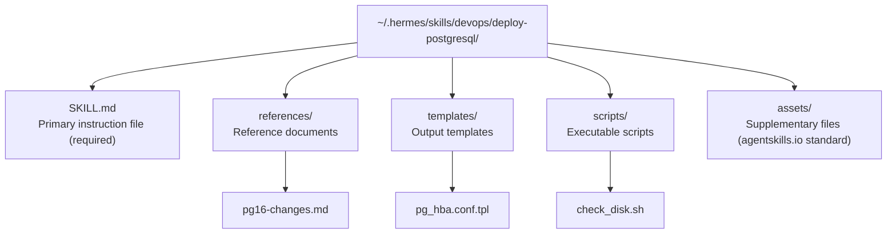
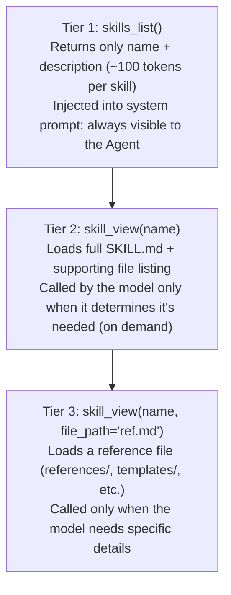

# 04 - Skills System: The Agent's Procedural Memory

[中文](../zh/04-技能系统.md) | English

> **Chapter scope**: Skills are a functional mechanism, not a standalone module. The code is spread across `tools/skills_tool.py`, `tools/skill_manager_tool.py`, `tools/skills_hub.py` (3,225 lines), `agent/skill_commands.py`, `agent/skill_preprocessing.py`, `agent/skill_utils.py`, and `agent/prompt_builder.py`. Data lives in `~/.hermes/skills/` (83 built-in skills + 58 optional skills).

## Two Kinds of Memory

In the previous two chapters we saw that Hermes has persistent memory — MEMORY.md and USER.md store user preferences and factual information ("the user prefers concise replies", "the project uses Go"). That is **declarative memory**: knowing what things are.

There is another kind of memory, though: **procedural memory** — knowing how to do something. You remember how to ride a bicycle, but you would struggle to fully describe every step in words. In Hermes, this "knowing how to do" memory is called a **Skill**.

The distinction between skills and memory (`tools/skill_manager_tool.py:7-11`) is explicit: memory is "broad and declarative" ("the user is running PostgreSQL 16"), while a skill is "narrow and actionable" ("when deploying PostgreSQL: check disk space first → run pg_upgrade → verify connections → update pg_hba.conf"). A skill is an operational runbook with concrete steps, trigger conditions, and pitfall warnings.

## What a Skill Looks Like

A skill's physical form is a directory whose centerpiece is a SKILL.md file. Using a hypothetical "deploy PostgreSQL" skill as an example:

**Figure: Skill directory structure — SKILL.md at the core, supplemented by reference docs, templates, and executable scripts**

SKILL.md follows the agentskills.io standard — an open community standard that defines the YAML frontmatter format for skills. The frontmatter contains metadata (name, description, author, version), preconditions (required environment variables and CLI tools), platform restrictions, and conditional activation rules. The body of the file is the operational instruction text that the model reads.

Skill file sizes are strictly bounded (`skill_manager_tool.py:105-208`): name up to 64 characters, description up to 1,024 characters, full text up to 100,000 characters (roughly 36K tokens). These limits exist to prevent a single skill from consuming too much of the context window — skill content is ultimately injected into the system prompt or user messages.

All skills live under `~/.hermes/skills/` (`tools/skills_tool.py:13-26`). The 83 built-in skills that ship with Hermes are synced from the `skills/` directory in the source repo via `tools/skills_sync.py`. Skills created by the Agent or the user are stored in the same location.

## Progressive Disclosure: Minimizing Token Consumption

The skills system faces a real tension: the Agent needs to know which skills are available (so it can invoke them at the right moment), but naively injecting every skill's full content into the system prompt on every turn would be prohibitively expensive — 83 skills at an average of 5K characters each is 400K+ characters.

Hermes's solution borrows the "Progressive Disclosure" principle from UI design (`tools/skills_tool.py:9-13`) and exposes information in three tiers:

**Figure: Three-tier progressive disclosure of skill information — the index lives permanently in the system prompt; full content and reference files are loaded on demand**

The skill index in the system prompt (`agent/prompt_builder.py:845-871`) uses imperative language — "you **MUST** load it with skill_view(name)" — explicitly instructing the model to load the full content when it identifies a relevant skill rather than acting on the brief description in the index alone.

This index has two levels of caching (`agent/prompt_builder.py:491-514`): an in-process LRU dict (up to 8 entries) and a disk snapshot (`~/.hermes/.skills_prompt_snapshot.json`, validated by file mtime/size). Why two levels? The in-process cache avoids re-scanning the filesystem on every system prompt build; the disk snapshot survives process restarts so the system doesn't start from scratch. In Gateway deployments, Agents on different platforms generate separate cache entries because different platforms have different available toolsets, which affects conditional activation rules.

When a skill is modified, `skill_manage` automatically invalidates both cache levels (`skill_manager_tool.py:696-700`), and the next system prompt build re-scans from disk.

## How Skills Are Created

Skills can be created through two paths:

**Model-initiated creation.** The `skill_manage` tool's schema description (`skill_manager_tool.py:719-728`) embeds guidance on when to create skills: "proactively offer to save a skill after a complex task completes successfully (5+ tool calls), after recovering from errors, or after the user corrects an approach." The system prompt contains similar instructions (`agent/prompt_builder.py:845-865`): "After difficult/iterative tasks, offer to save as a skill."

When the model calls `skill_manage(action='create')`, the tool validates the frontmatter format, name validity, and file size limits (`skill_manager_tool.py:172-208`), then writes the skill directory atomically.

**User installation via Skills Hub.** Skills Hub (`tools/skills_hub.py`, 3,225 lines) is a skill marketplace that supports searching and installing skills from 9 data sources: built-in optional skills, the Hermes official index, the skills.sh platform, the `/.well-known/skills/` standard endpoint on any domain, direct URLs, GitHub, ClawHub, Claude Marketplace, and LobeHub. Searches use a `ThreadPoolExecutor` to query all sources in parallel (`skills_hub.py:3125-3202`) with a 30-second overall timeout.

Installation goes through a security check: the skill is first downloaded to an isolated quarantine directory, and only after passing a security scan is it installed to `~/.hermes/skills/`, with its source and hash recorded in `lock.json`. Different sources carry different trust levels — built-in skills are `builtin` (highest trust), GitHub and skills.sh are `trusted`, and ClawHub is forcibly downgraded to `community`. Why the special treatment for ClawHub? The code comment records the reason (`skills_hub.py:1583-1584`): a February 2026 security incident uncovered 341 malicious skills, indicating that the platform's review mechanisms are not sufficiently reliable.

## How Skills Self-Improve

This is one of the core expressions of Hermes's "self-improving" positioning. When the Agent uses a skill to complete a task and discovers that the skill's instructions are incomplete or wrong — for example, a step that fails on a specific OS, or a missing error-handling branch — it can immediately update the skill via `skill_manage(action='patch')` (`skill_manager_tool.py:419-513`).

Patching uses the same `fuzzy_find_and_replace` engine as the file editing tools (`skill_manager_tool.py:466-468`), with whitespace normalization and indentation tolerance — which matters because SKILL.md files typically contain code blocks and YAML frontmatter, and exact matching is brittle in the face of whitespace differences.

The system prompt explicitly requires this self-improvement behavior (`agent/prompt_builder.py:864-865`): "If a skill you loaded was missing steps, had wrong commands, or needed pitfalls you discovered, **update it before finishing**." Note that this is an instruction, not a suggestion — the model is required to fix problems **immediately upon discovery**, not defer them to a future session.

After a successful `skill_manage` call, both cache levels are automatically cleared (`skill_manager_tool.py:696-700`), and the system prompt picks up the change at the next build within the current session. The `skills_list` and `skill_view` result caches may not reflect the update until the next system prompt rebuild — but in practice the lag is short, typically visible in the next conversation turn.

## Skill Preprocessing: Bringing Static Documents to Life

Before a SKILL.md is loaded, it passes through a preprocessing stage (`agent/skill_preprocessing.py`) that supports two kinds of dynamic substitution:

**Template variables** (`skill_preprocessing.py:37-60`): `${HERMES_SKILL_DIR}` is replaced with the skill directory's absolute path, and `${HERMES_SESSION_ID}` is replaced with the current session ID. This allows skills to reference scripts and templates within their own directory without hardcoding paths.

**Inline shell expansion** (`skill_preprocessing.py:63-112`): Markers like `` !`date +%Y-%m-%d` `` are executed at load time, and the model sees the actual command output (up to 4,000 characters). This lets skills dynamically capture environment information (current date, system version, installed tools list, etc.). This feature is off by default and requires `skills.inline_shell: true` to opt in — because executing arbitrary shell commands carries security risk.

Skills can also carry configuration values (`agent/skill_utils.py:258-412`): `metadata.hermes.config` entries declared in the frontmatter have their values stored under `skills.config.*` in `config.yaml`. Each time a skill is invoked (via a `/skill-name` slash command), the current values of those configuration entries are automatically injected into the message (`agent/skill_commands.py:73-109`), so the model knows the user's configuration preferences without any additional tool calls.

## Conditional Activation: Not Every Skill Should Always Appear

An Agent may have dozens of skills, but only a subset are relevant in any given context. Skill frontmatter supports conditional activation rules (`agent/skill_utils.py:241-255`):

- `requires_toolsets: [terminal]` — hidden when the terminal toolset is unavailable (terminal-operation skills are useless on platforms that cannot execute commands)
- `fallback_for_toolsets: [linear]` — hidden when the linear toolset is present (no need to wrap a native integration with a skill)
- `requires_tools` / `fallback_for_tools` — same logic, filtered by individual tools
- `platforms: [macos, linux]` — platform restrictions

These rules are applied when building the skill index for the system prompt (`agent/prompt_builder.py:619-647`), ensuring the model only sees skills that are genuinely available in the current environment.

## Optional Skills: Extensions Not Installed by Default

The `optional-skills/` directory in the repo contains 58 optional skills (`optional-skills/DESCRIPTION.md:1-25`). Unlike the skills in `skills/`, they are not copied to `~/.hermes/skills/` during `hermes setup`. There are three reasons for this:

1. **Niche integrations** — only a tiny fraction of users need them (e.g., the Solana blockchain skill)
2. **Experimental features** — not yet mature enough for general use
3. **Heavy dependencies** — require installing large additional packages

Users can discover and selectively install these skills via Skills Hub. Once installed, they are fully equivalent to any other skill and benefit from the same progressive disclosure, self-improvement, and conditional activation mechanisms.

## Security: Preventing Skills from Injecting Malicious Instructions

Skills are, at their core, natural-language instructions intended for the model — which means a malicious skill could embed a prompt injection attack. `skill_view()` performs a prompt injection scan before loading skill content (`tools/skills_tool.py:130-141`), checking for 9 common patterns (e.g., "ignore previous instructions", "you are now", "disregard", etc.).

Skills installed from Skills Hub undergo a more rigorous security scan (`tools/skills_guard.py`), with strictness proportional to the source's trust level. Path traversal protection ensures that `skill_view` and `skill_manage` operations cannot escape the permitted directory boundaries (`tools/skills_tool.py:1012-1037`).

## What's Next

The skills system answers the question of "how does the Agent learn to do things." Next, **[05 - Plugin System](05-plugin-system.md)** focuses on a different extension mechanism — how plugins register hooks, extend the toolset, and modify Agent behavior, and how they differ from the skills system.

---

*This document is based on analysis of hermes-agent v0.11.0 source code. All code references have been independently verified.*
