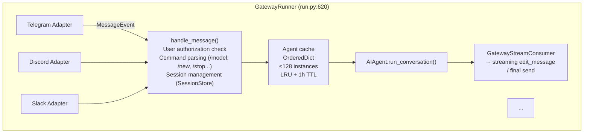
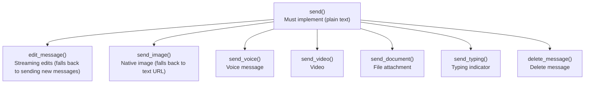
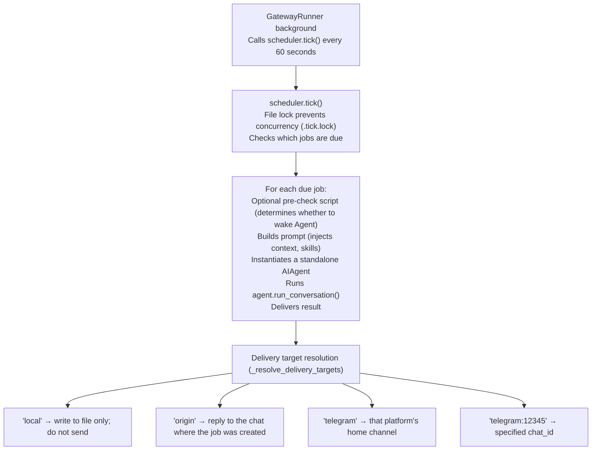

# 06 - Gateway: One Process, Twenty Platforms

[中文](../zh/06-gateway网关.md) | English

> **Chapter scope**: `gateway/` directory (53 files, 64,729 lines) — the largest module in the codebase. Contains the core controller `GatewayRunner`, 28 platform adapters, session management, streaming delivery, and Cron scheduling integration.
> **Key classes**: `GatewayRunner` (`gateway/run.py:620`), `BasePlatformAdapter` (`gateway/platforms/base.py:1121`), `SessionStore` (`gateway/session.py`).

## Why a Gateway

In CLI mode the relationship between user and Agent is one-to-one — a single terminal window, a single Agent instance, a single conversation. But what if you want the same Agent to simultaneously serve a Telegram group, a Discord channel, a Slack workspace, and a WhatsApp DM?

Each platform has its own protocol (Telegram uses Bot API + webhooks, Discord uses WebSocket, Slack uses Events API + Bolt), its own message format, its own capability set (some support message editing, others do not), and its own user identity system. Writing a separate Agent service for every platform would result in massive code duplication, and managing deployments of 20 separate services is operationally unacceptable.

The Gateway's solution is: **one process connects to all platforms simultaneously, sharing a single Agent implementation**. Platform differences are encapsulated in adapters; the Agent core has no awareness of where a message comes from.

## Gateway Architecture Overview

**Figure: GatewayRunner's overall architecture — multiple platform adapters feed into a unified processing pipeline, which executes through the Agent cache and delivers responses via streaming**

`GatewayRunner` (`gateway/run.py:620`) is the core controller. It owns all platform adapters, the Agent cache, the session store, and the delivery router. It establishes this core state during initialization (`run.py:643`) and connects to all configured platforms concurrently on startup (`run.py:2129`).

## The Full Path from Platform to Agent

When a Telegram message arrives, it follows this path:

1. **Platform adapter receives.** The Telegram adapter converts the native `Update` object into a unified `MessageEvent` (containing fields like `source`, `text`, `message_type`, `message_id`) and calls `handle_message()` (`base.py:2221`).

2. **Active session check.** If an Agent is already running for this chat, the behavior is determined by `busy_input_mode`: interrupt the current task to handle the new message (default), queue the new message, or ignore it.

3. **Plugin hook.** The `pre_gateway_dispatch` plugin hook fires (`run.py:3409`), giving plugins the opportunity to skip, rewrite, or allow the message.

4. **User authorization.** `_is_user_authorized()` checks whether the sender is permitted to use the Agent (`run.py:3452`) — Gateway supports DM pairing, allowlists, and other authorization modes.

5. **Command parsing.** The message is checked against slash commands (e.g., `/model`, `/new`, `/stop`). Some commands (e.g., `/stop`, `/restart`) can be handled while an Agent is already running (`run.py:3619-3632`).

6. **Session retrieval.** `SessionStore.get_or_create_session()` (`session.py:828`) looks up or creates a session by `session_key`, evaluating whether an automatic reset is warranted.

7. **Agent retrieval.** The `_agent_cache` is queried by `session_key`. On a cache miss, a new `AIAgent` is created and the session history is restored from SQLite.

8. **Execution.** `AIAgent.run_conversation()` runs in a thread pool (via `loop.run_in_executor`).

9. **Delivery.** `GatewayStreamConsumer` bridges the synchronous Agent callbacks with asynchronous platform delivery, either streaming message edits or sending a final result in one shot.

## Session Management: Whose Conversation Belongs to Whom

Gateway faces a problem that CLI mode never encounters: **a single chat window can contain multiple users**. In a Telegram group, user A and user B are both talking to the Agent — should their contexts be isolated or shared?

The `session_key` construction logic (`session.py:572`) answers this question:

| Scenario | session_key format | Effect |
|----------|--------------------|--------|
| Direct message | `agent:main:{platform}:dm:{chat_id}` | One session per user |
| Group chat (default) | `...:{chat_id}:{user_id}` | Each user has an independent session |
| Group chat (shared mode) | `...:{chat_id}` | All users in the group share one session |
| Thread | `...:{chat_id}:{thread_id}` | Shared within the thread |

By default, group chats are isolated per user (`group_sessions_per_user=True`, `session.py:554`). This means user A and user B each have their own conversation history, memory, and context — even though they are in the same group chat window. In shared mode, messages from multiple users enter the same conversation stream; the system prompt does not hard-code user names (to avoid breaking prefix caching), and instead each message is prefixed with `[sender name]`.

### Session Reset Policy

Sessions do not last forever. `SessionResetPolicy` (`gateway/config.py:101`) defines three reset modes:

- **idle** — automatically reset after the session has been idle for the specified duration (default: 24 hours)
- **daily** — reset at a specified time each day (default: 4:00 AM)
- **both** (default) — reset when either condition is met

A reset clears the conversation history and starts a new `session_id`, but persistent memory (MEMORY.md, USER.md) is unaffected — it survives across sessions. If the session has active background processes (e.g., a running terminal command), the reset is deferred until the process completes.

### PII Protection

Different platforms have different privacy requirements for user IDs. On WhatsApp, Signal, Telegram, and BlueBubbles, user IDs may contain sensitive information such as real phone numbers that should not be passed to the LLM. On Discord and similar platforms, user IDs need to preserve their original format to enable correct mentions. `session.py:194` hashes the IDs of sensitive platforms (`_PII_SAFE_PLATFORMS`, 4 platforms total) before injecting them into the system prompt.

## Platform Adapters: Encapsulating the Differences

`BasePlatformAdapter` (`gateway/platforms/base.py:1121`) is the base class for all platform adapters. It requires implementing three core methods:

- `connect()` → connect to the platform (`base.py:1325`)
- `disconnect()` → disconnect (`base.py:1334`)
- `send()` → send a text message (`base.py:1339`)

On top of that, it provides a set of optional methods with sensible degradation behavior:

**Figure: Platform adapter required methods vs. optional fallback methods — a new platform needs only 3 methods to be operational**

This "required + optional with graceful degradation" design means: **adding a new platform requires implementing only 3 methods to be functional**, with advanced features added incrementally. The Telegram adapter (`gateway/platforms/telegram.py`), for example, is built on `python-telegram-bot` and implements the full suite of send methods (images, voice, video, files, edit), along with platform-specific logic like MarkdownV2 escaping.

## Streaming Delivery: Showing "Typing in Progress"

The traditional approach is to wait for the Agent to generate a complete response and then send it all at once — but for long responses, the user might wait tens of seconds with no feedback. Streaming delivery lets the response appear progressively as it is generated.

`GatewayStreamConsumer` (`gateway/stream_consumer.py:57`) is the core of streaming delivery. It bridges the Agent's synchronous callbacks (`on_delta`) with the platform's asynchronous send layer:

1. The Agent thread produces a text token → placed into a `queue.Queue`
2. An async `run()` task polls the queue and accumulates text
3. When a trigger condition is met (1-second interval or 40 characters accumulated) → calls `edit_message()` to update the message
4. When the Agent completes → sends the final version

A few implementation details worth noting:

**Think block filtering** (`stream_consumer.py:183`). The model's internal reasoning tags (`<think>`, `<reasoning>`) are filtered out by a state machine during streaming — the user sees a clean reply, free of raw reasoning traces.

**Long message splitting** (`stream_consumer.py:333-379`). Different platforms have different message length limits (Telegram's 4,096-character limit, for example). Responses that exceed the limit are split into multiple messages at word and code-block boundaries, with `(1/2)` chunk indicators.

**Fresh-final mechanism.** If a streaming response takes longer than a threshold (60 seconds by default for Telegram, `gateway/config.py:206`), the final version is sent as a new message (rather than editing the existing one), so the platform timestamp reflects the actual completion time.

## Cron Integration: Scheduled Tasks for the Agent

The Gateway does not only sit passively waiting for messages — it can also proactively execute tasks. The `cron/` directory implements scheduled dispatching, letting users define recurring tasks in natural language: "summarize yesterday's GitHub issues every morning at 8 AM."

The Cron–Gateway integration works as follows:

**Figure: Complete flow of a Cron scheduled task — triggered via Gateway, executed, and delivered to the specified platform**

Each Cron job runs in a **dedicated AIAgent instance** (not reusing the Gateway's Agent cache), with its own toolset (high-consumption tools such as MoA, HomeAssistant, and RL are disabled by default, `scheduler.py:44-72`).

Delivery prefers the Gateway's live active adapter (`scheduler.py:411`) — which is important for platforms requiring end-to-end encryption (e.g., Matrix), since only an already-established encrypted session can send messages. If the Gateway is not running (e.g., when using `hermes cron run` to execute jobs standalone), it falls back to a standalone HTTP client that calls the platform API directly (`scheduler.py:457`).

One clever detail: when an Agent response begins with `[SILENT]` (`scheduler.py:115`), the output is saved to a local file but not delivered to the chat. This is useful for "checked but found nothing new" scenarios, avoiding a daily message that just says "no updates."

## Fault Recovery

As a long-running process, fault recovery is a core concern for the Gateway.

**Platform reconnection** (`run.py:2634-2748`). A single platform disconnecting does not affect others. The `_platform_reconnect_watcher()` background task applies exponential backoff reconnection to failed platforms (30s → 60s → 120s → 240s → 300s cap, up to 20 attempts).

**Hot restart** (`run.py:2112`). The `/restart` command triggers a hot restart: all active sessions are notified of the impending restart, active Agents are given time to complete (forcibly interrupted on timeout), recoverable sessions are marked `resume_pending` (preserving their `session_id`), and then the process restarts. After restart, these sessions restore their history from SQLite and continue where they left off.

**Stuck loop detection** (`run.py:2235-2268`). If the same session is active across 3 consecutive restarts, it is likely causing a crash loop — the session is automatically suspended to prevent infinite restarts.

**Zero-platform startup.** If no platform connects successfully (e.g., all tokens are expired), the Gateway still runs — because it also needs to execute Cron jobs (`run.py:2403`). Only non-retriable errors (e.g., configuration format errors) cause the Gateway to exit.

## What's Next

The Gateway answers the question of "how does the Agent serve multiple platforms." Next, **[07 - TUI and Web](07-tui-and-web.md)** covers the user interfaces — the CLI's prompt_toolkit TUI, the new React/Ink TUI, and the Web Dashboard.

---

*This document is based on analysis of hermes-agent v0.11.0 source code. All code references have been independently verified.*
