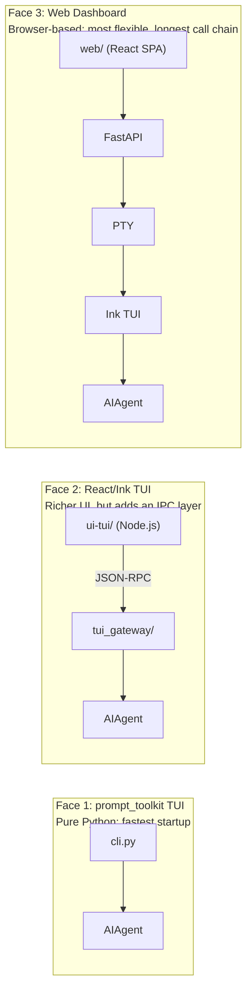
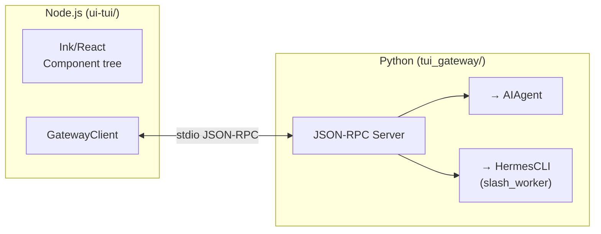
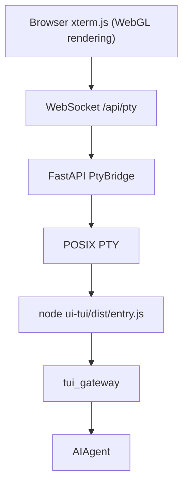

# 07 - TUI and Web: Three Faces of the Agent

[中文](../zh/07-tui与web.md) | English

> **Chapter scope**: Three interface layers — `cli.py` (11,395 lines, prompt_toolkit TUI), `ui-tui/` (Node.js/Ink TUI) + `tui_gateway/` (8 files, 5,750 lines of bridging code), `web/` (React SPA) + `hermes_cli/web_server.py` (FastAPI backend). The CLI subcommand system lives in `hermes_cli/` (58 files, 61,896 lines).

## One Agent, Three Interfaces

Hermes exposes three user interfaces, all backed by the same Agent core:

**Figure: Hermes's three user interfaces — prompt_toolkit TUI, React/Ink TUI, and Web Dashboard, all sharing a single Agent core**

These three interfaces are not a progressive replacement sequence — they coexist, each suited to different scenarios. The prompt_toolkit TUI is the default mode (launched with `hermes`), best for lightweight, fast terminal interaction. The Ink TUI is new in v0.11.0 (`hermes --tui`) and provides a more modern experience (React components, sticky composer, streaming animations). The Web Dashboard (`hermes web`) is accessible via a browser and is well-suited for remote management and visualization.

## Face 1: The prompt_toolkit TUI

`cli.py` (11,395 lines) is Hermes's original interface. It uses Python's `prompt_toolkit` library (`cli.py:44-65`) to build a fixed-bottom-input REPL: a scrollable output area at the top, a spinner status line in the middle, and a text input area at the bottom.

`HermesCLI` (`cli.py:1887`) is the controller for this interface. It directly holds an `AIAgent` instance — no intermediate layer, no inter-process communication, direct Python function calls. This is why it starts up fastest, and also why it has limitations — its UI capabilities are bounded by what the terminal can do.

Slash commands (e.g., `/model`, `/personality`, `/insights`, `/skin`) are dispatched through a large elif chain (`cli.py:6197-6333`). All command definitions are centralized in the `COMMAND_REGISTRY` in `hermes_cli/commands.py:59-179` — the single source of truth from which CLI tab completion, Gateway command dispatch, and Telegram slash commands are all derived.

## Face 2: The React/Ink TUI

v0.11.0 introduced a completely rewritten terminal interface: a Node.js application based on React/Ink (`ui-tui/` directory). Ink is "React for CLI" — it uses the React component model to build terminal UIs, with support for flexbox layout, state management, and streaming rendering.

But Hermes's Agent core is written in Python — how does Node.js call it? The answer is `tui_gateway/`, a Python-side JSON-RPC server that acts as the bridging layer:

**Figure: React/Ink TUI communicating with the Python Agent across processes via stdio JSON-RPC**

On startup, `GatewayClient` (`ui-tui/src/gatewayClient.ts:91-124`) spawns a Python subprocess running `tui_gateway.entry`, exchanging JSON-RPC frames over stdio. The Python side replaces the real stdout with stderr (`tui_gateway/server.py:158-167`), preventing print statements from polluting the protocol channel.

Slow operations (e.g., `cli.exec`, `session.branch`) are routed to a `ThreadPoolExecutor` (`server.py:141-155`) to avoid blocking the RPC dispatch loop — if the Agent is executing a long command and the RPC loop is blocked, the user cannot even press Ctrl+C.

Slash command handling has an interesting design: `slash_worker.py` maintains a persistent `HermesCLI` subprocess to execute slash commands. Why not handle them directly inside `tui_gateway`? Because many slash commands (e.g., `/model`, `/tools`) are deeply coupled to `HermesCLI`'s internal state, and extracting that logic would be prohibitively expensive.

## Face 3: The Web Dashboard

The Web Dashboard (`hermes web` or `hermes dashboard`) is a full management interface that lets users browse sessions, manage configuration, and monitor usage from a browser.

**The backend** is a FastAPI application (`hermes_cli/web_server.py`), bound by default to `http://127.0.0.1:9119`. Security mechanisms include: a random session token generated on every startup (`web_server.py:73-147`), CORS restricted to localhost only, and Host header validation to prevent DNS rebinding.

API endpoints cover essentially all management needs (`web_server.py:484-3050`) — from browsing sessions and modifying configuration to managing Cron jobs. Nearly everything the CLI can do, the Dashboard can do too.

**The frontend** is a Vite/React SPA (`web/` directory), using React Router v7, `@xterm/xterm` (terminal emulator), i18n internationalization (English + Chinese), and a plugin system (`PluginSlot`/`PluginPage`).

The most interesting part is the **Chat page** — it embeds a complete terminal experience directly in the browser:

**Figure: Web Dashboard Chat embed chain — browser xterm.js communicates via WebSocket through PTY and Ink TUI to reach AIAgent**

The Chat embed feature is disabled by default and requires either `hermes dashboard --tui` or `HERMES_DASHBOARD_TUI=1` to enable. Once enabled, talking to the Agent in the browser is identical to the terminal experience — because underneath, a real terminal TUI is running, and its output is streamed to the browser's xterm.js renderer via WebSocket.

## The Skin System: Consistent Visual Theming

All three interfaces need a unified visual style — if the user has set a dark theme in the CLI, it should not revert to a light theme in the Web Dashboard.

`hermes_cli/skin_engine.py` defines the skin configuration (`SkinConfig`, `skin_engine.py:129`), which includes 20+ color slots (banner, UI elements, status bar, etc.), spinner emoji/verb customization, and brand text (Agent name, greeting, and farewell messages). Six built-in skins ship out of the box: default (gold kawaii), ares (war-god red-bronze), mono (grayscale), slate (cool blue), daylight (light mode), and warm-lightmode.

Users can create custom skins by placing a YAML file at `~/.hermes/skins/<name>.yaml` and activating it with `/skin <name>`. Skin changes synchronize to the Ink TUI — `tui_gateway` pushes the Python-side skin configuration to the Node.js side via `GatewaySkin` events (`ui-tui/src/theme.ts`'s `ThemeColors` mirrors the Python color slot definitions).

`KawaiiSpinner` (`agent/display.py:573`) is the most distinctive element in the visual system: 9 animation styles, each with a set of kawaii emoticon faces and thinking verbs. Skins can customize these emoticons and verbs, overriding defaults such as `(｡◕‿◕｡)` and `(◔_◔)`.

## The hermes CLI Subcommand System

`hermes_cli/main.py` is the entry point for the `hermes` command, using `argparse` to dispatch subcommands:

| Subcommand | Function |
|-----------|----------|
| `hermes` (no arguments) | Launch the interactive TUI |
| `hermes gateway start/stop/status` | Manage the messaging gateway service |
| `hermes setup` | Interactive installation wizard |
| `hermes web` / `dashboard` | Launch the Web UI |
| `hermes acp` | ACP server (editor integration) |
| `hermes cron list/add/...` | Cron job management |
| `hermes sessions browse` | Interactive session browser |
| `hermes doctor` | Dependency check and diagnostics |
| `hermes update` / `version` | Version management |

The `--profile` / `-p` flag is preprocessed before all other subcommands (`main.py:100-161`), setting the `HERMES_HOME` environment variable before any module imports — which means you can run multiple Hermes instances on the same machine, each with its own independent configuration and data directory.

## What's Next

This chapter covered Hermes's three user interfaces. Next, **[08 - Cron and Protocols](08-cron-and-protocols.md)** dives into the scheduled task system and the editor integration protocol.

---

*This document is based on analysis of hermes-agent v0.11.0 source code. All code references have been independently verified.*
