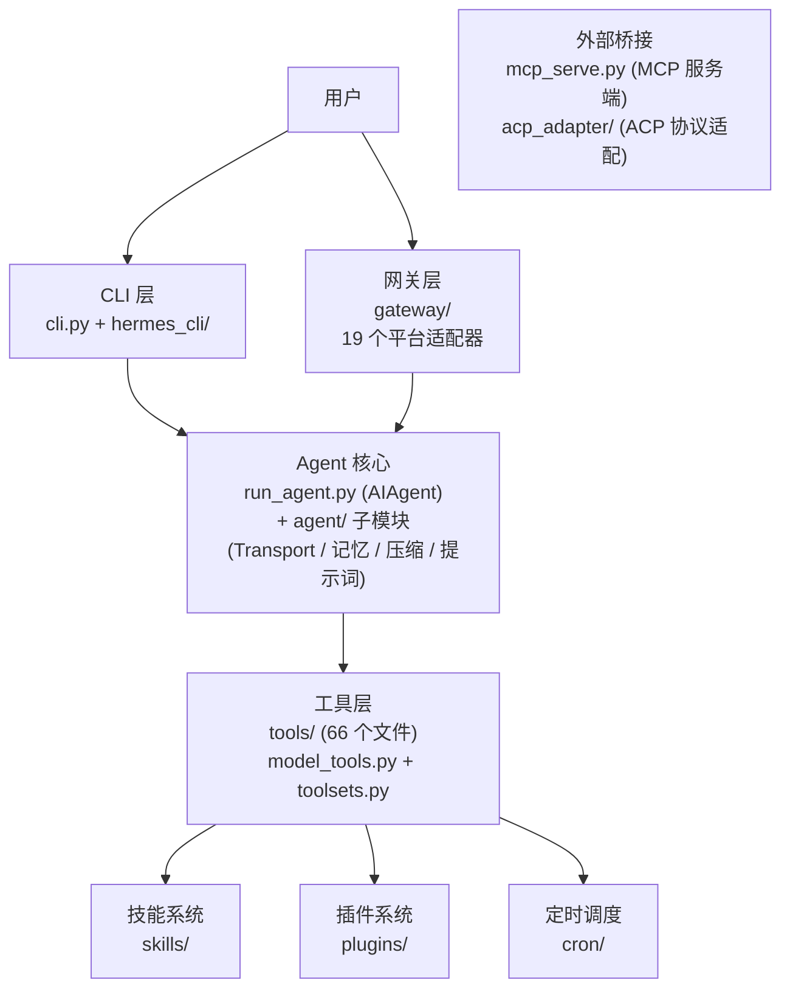

# 00 - Hermes Agent：一个试图自我进化的 AI 智能体

## 它想解决什么问题？

如果你想让一个 AI agent 不只是"接收指令 → 执行 → 返回结果"的一次性工具，而是一个能从经验中学习、跨会话记住你是谁、甚至在你不在的时候自动工作的长期伙伴——你会怎么设计它？

Nous Research 的回答是 Hermes Agent。这是一个 MIT 开源的 AI 智能体框架（当前 v0.11.0，`pyproject.toml:7`），它的野心写在一行描述里：

> "The self-improving AI agent — creates skills from experience, improves them during use, and runs anywhere."
>
> — `pyproject.toml:8`

三个关键词：**自改进**、**技能学习**、**随处运行**。但这些说法太抽象了。在深入细节之前，先建立一个全景认知。

## 模块全景

Hermes 的代码库可以分为六个大区域。下面这张图展示了它们之间的关系——箭头表示"依赖"或"调用"：

**图：Hermes 六大模块的依赖调用关系（CLI/网关 → Agent 核心 → 工具层）**

各模块一句话说明：

- **CLI 层** (`cli.py` + `hermes_cli/`) — 你在终端里看到的一切：交互式 REPL、子命令（chat/gateway/setup/cron/model）、TUI 界面。它是用户和 Agent 之间的桥梁。
- **网关层** (`gateway/`) — 让同一个 Agent 同时服务 Telegram、Discord、Slack、WhatsApp 等约 20 个平台的统一消息入口。一个进程，所有平台。
- **Agent 核心** (`run_agent.py` + `agent/`) — 整个系统的心脏。`AIAgent` 类实现了"接收消息 → 调用模型 → 解析工具调用 → 执行工具 → 循环直到完成"的核心循环。`agent/` 子目录处理模型适配、上下文压缩、提示词构建、记忆管理等支撑逻辑。
- **工具层** (`tools/` + `model_tools.py`) — Agent 的"手脚"。66 个工具文件覆盖终端执行、文件操作、Web 搜索、浏览器自动化、语音、图像生成等能力。`model_tools.py` 负责工具注册和调度。
- **技能与插件** (`skills/` + `plugins/`) — Agent 的"长期记忆和学习能力"。技能是可复用的任务模板（83 个预置 + 58 个可选），插件扩展记忆、上下文引擎等能力。
- **外部桥接** (`mcp_serve.py` + `acp_adapter/`) — 让其他系统（Claude Code、Cursor 等）通过标准协议调用 Hermes 的能力。

这些模块的依赖关系是**严格单向的**：CLI/网关 → Agent 核心 → 工具层。没有反向依赖。需要反向调用的地方（比如子代理工具需要创建新的 AIAgent），都用延迟导入（在函数内部而非文件顶部引入依赖）来避免循环导入问题。

## 五个核心问题

理解了全景之后，我们来看 Hermes 为什么要这样组织——它面临的几个核心问题决定了整个架构。

### 问题一：模型锁定

大多数 AI agent 框架绑死在一个模型提供商上——用 OpenAI 的就只能用 GPT，用 Anthropic 的就只能用 Claude。但模型市场变化极快，今天最好的模型明天可能被超越，或者价格突然翻倍。

Hermes 的选择是**完全不锁定模型**。它的配置文件 (`cli-config.yaml.example:13-43`) 列出了超过 20 种 provider：OpenRouter（200+ 模型）、Anthropic、OpenAI、Nous Portal、Gemini、NVIDIA NIM、小米 MiMo、Kimi、MiniMax……甚至支持本地运行的 Ollama、LM Studio、vLLM、llama.cpp。用户可以随时用 `hermes model` 切换，不需要改代码。

这个选择带来了一个架构后果：Hermes 必须在代码里处理各家 API 的差异——Anthropic 的消息格式和 OpenAI 的不一样，Bedrock 又有自己的协议。这就是后面会看到的 Transport 抽象层存在的原因。

### 问题二：平台碎片化

你可能在 Mac 终端里和 AI 对话，但你的用户可能在 Telegram 上。你的团队可能用 Slack。你的客户可能用 WhatsApp。如果每个平台写一套独立的 agent，维护成本是线性增长的。

Hermes 的做法是搭了一个**统一网关** (`gateway/`)：一个进程同时连接所有平台，共享同一套 agent 逻辑。Telegram 来一条消息和 CLI 打一行字，最终都走到同一个 `AIAgent.run_conversation()` 方法。网关层目前支持 Telegram、Discord、Slack、WhatsApp、Signal、飞书、钉钉、企业微信、Matrix 等约 20 个平台 (`gateway/platforms/`)。

### 问题三：一次性对话的局限

传统 chatbot 的会话是一次性的——关掉窗口，所有上下文就消失了。下次你再来，它不知道你上周让它做了什么，也不记得你偏好什么工作方式。

Hermes 试图打破这个限制，做了三件事：
- **持久记忆**：agent 会主动将重要信息写入 `MEMORY.md` 和 `USER.md`，下次会话时自动加载（`agent/memory_manager.py`）
- **会话搜索**：历史对话存入 SQLite 并建了 FTS5 全文索引，agent 可以搜索自己的过去（`hermes_state.py`）
- **技能学习**：完成一个复杂任务后，agent 会把解决方案抽象成"技能"保存下来，下次遇到类似问题直接调用（`tools/skills_tool.py`）

这不是简单的"把聊天记录存起来"。它更像是在模拟一种工作记忆 + 长期记忆的分层结构，试图让 agent 随着使用而变得更懂你。

### 问题四：对话越来越长

AI 模型有上下文窗口限制——即使是 100 万 token 的窗口，一个长时间运行的 agent 也终会撞到天花板。而且上下文越长，API 费用越高、延迟越大。

Hermes 的应对方案是一个**上下文压缩器** (`agent/context_compressor.py`)。当对话历史占满 75% 的上下文窗口时（`agent/context_engine.py:59`），它会用一个廉价的辅助模型把中间的对话摘要化，只保留头部几条（保持系统提示稳定）和尾部几条（保持最近上下文）。这不是简单截断——它是让 LLM 把中间对话压缩成摘要——像把一本书压缩成复习提纲，丢弃细节但保留关键信息。

### 问题五：Agent 不应该只待在你的笔记本上

很多 agent 框架假设你会在本地终端里使用它们。但如果你想让 agent 在云上 7×24 运行、定期执行任务、在你睡觉的时候帮你监控某个东西呢？

Hermes 提供了六种"终端后端" (`cli-config.yaml.example:148-237`)：本地执行、Docker 容器、SSH 远程机器、Daytona 云沙箱、Singularity HPC 容器、Modal Serverless。后两者特别有意思——Daytona 和 Modal 支持"休眠"：agent 的执行环境在空闲时自动暂停，有任务时再唤醒，几乎零成本。

配合内置的 cron 调度器 (`cron/`)，你可以用自然语言设置定时任务："每天早上 8 点把昨天的 GitHub issue 汇总发到 Telegram 群里"——agent 会在指定时间醒来、执行、投递结果、然后继续休眠。

## 技术选型

理解了这些问题，Hermes 的技术选型就不是随机的了：

**Python 为主** (`pyproject.toml:10`, `requires-python = ">=3.11"`)——AI agent 生态几乎全在 Python 里，各模型 SDK（OpenAI、Anthropic、boto3）都是 Python first。

**核心依赖克制**（`pyproject.toml:13-37`）。基础安装 18 个包，以模型 SDK（`openai`、`anthropic`）和交互框架（`prompt_toolkit`、`rich`）为主，其余是 HTTP 客户端、数据校验、模板引擎等基础设施。所有平台集成、语音、MCP、RL（强化学习）训练都通过 26 个 optional extras 按需安装（`pyproject.toml:39-126`）——这就是为什么它能跑在 5 美元的 VPS 上，也能跑在 GPU 集群上。

**前端用 Node.js**（`package.json`）——Web Dashboard 和 TUI 都是 npm 打包的前端应用。浏览器自动化也走 Node.js（Playwright + CamoFox 防检测浏览器）。

**Docker 多阶段构建**（`Dockerfile:1-67`，3 个 FROM）——用 `uv`（Rust 写的 Python 包管理器）代替 pip 加速安装，用 `tini` 做进程管理防止僵尸进程积累。

## 项目结构：循着问题找代码

如果你把 Hermes 的目录结构和上面五个问题对应起来，会发现它的组织逻辑很清楚：

**"怎么和模型对话？"** → `run_agent.py`（AIAgent 类，工具调用循环）+ `agent/`（Transport 适配、提示词构建、上下文压缩、记忆管理）

**"怎么和用户对话？"** → `cli.py`（终端 TUI）+ `gateway/`（多平台网关）+ `hermes_cli/`（CLI 子命令）

**"怎么做事？"** → `tools/`（66 个工具文件，覆盖终端执行、文件操作、Web 搜索、浏览器自动化等）+ `model_tools.py`（工具注册和调度）

**"怎么学习？"** → `skills/`（预置技能库）+ `plugins/`（记忆和上下文插件）

**"怎么独立运行？"** → `cron/`（定时调度）+ `docker/`（容器化）

**"怎么被其他系统调用？"** → `mcp_serve.py`（MCP 服务端，10 个工具）+ `acp_adapter/`（ACP 协议适配）

**"怎么用于研究？"** → `batch_runner.py`（批量轨迹生成）+ `trajectory_compressor.py`（轨迹压缩）+ `environments/`（RL 基准测试环境）

还有一些胶水：`hermes_constants.py` 定义共享常量（比如 HERMES_HOME 默认为 `~/.hermes`，`hermes_constants.py:17-18`）；`hermes_state.py` 管理全局状态和 SQLite 会话存储；`toolsets.py` 把工具组织成"工具集"供不同场景启用/禁用。

## 三个入口，同一个 Agent

Hermes 有三个主要入口点，但它们最终都调用同一个核心——`AIAgent.run_conversation()`：

**`hermes` 命令**（`pyproject.toml:129` → `hermes_cli.main:main`）是日常使用的入口。它是一个功能完整的 CLI，包含 chat、gateway、setup、cron、model 等子命令。输入 `hermes` 不带参数就进入交互式对话。

**`hermes-agent` 命令**（`pyproject.toml:130` → `run_agent:main`）是面向开发者和脚本的入口。它直接暴露 `AIAgent` 类，可以用 Python `fire` 库从命令行传参，也可以在代码里 `from run_agent import AIAgent` 来嵌入使用。

**`mcp_serve.py`** 把 Hermes 的消息网关能力暴露为 MCP 工具（`mcp_serve.py:8-13`），让 Claude Code、Cursor 等 MCP 客户端可以读写各平台的消息会话、管理审批权限。

## 配置哲学

Hermes 的配置遵循一个清晰的优先级链（`cli.py:1985`）：

**CLI flag > 环境变量 > yaml 配置文件 > 内置默认值**

这意味着你可以在 `cli-config.yaml` 里设好日常配置，用 `.env` 文件覆盖敏感信息（API key），用命令行参数做临时调整——三层互不干扰。

配置文件本身（`cli-config.yaml.example`，约 1000 行）覆盖面极广，从模型选择、终端后端、安全策略、上下文压缩参数、记忆行为、显示主题到 MCP 服务器接入，几乎每个行为都可以调。但核心设计原则是**零配置可用**——默认值经过精心选择，拿到 API key 就能跑。

## 项目统计

最后，一些帮助建立量感的数字：

### 代码规模

| 指标 | 数量 |
|------|------|
| Python 文件 | 1,231 个 |
| Python 总行数 | ~578,000 行 |
| JS/TS 文件 | 356 个 |
| 测试文件 | 826 个（~285,000 行） |

### 模块规模（Python 行数，按重心排序）

| 模块 | 行数 | 说明 |
|------|------|------|
| `gateway/` | 64,700 | 最大模块——28 个平台适配器的代码量 |
| `hermes_cli/` | 61,900 | CLI 子命令和 TUI 界面 |
| `tools/` | 54,500 | 66 个工具的实现 |
| `agent/` | 29,200 | Agent 核心支撑模块 |
| `plugins/` | 18,600 | 可选插件 |
| `run_agent.py` | 13,300 | 单文件——AIAgent 类，整个系统的核心循环 |
| `cli.py` | 11,400 | 单文件——交互式终端 REPL |
| `tui_gateway/` | 5,750 | TUI 网关桥接 |
| `cron/` | 2,275 | 定时调度 |
| `acp_adapter/` | 2,350 | ACP 协议适配 |

值得注意的是 `run_agent.py` 和 `cli.py` 这两个单文件——加起来近 25,000 行。这是 Hermes 的两个"上帝文件"，绝大多数核心逻辑集中在这里。

### 生态规模

| 指标 | 数量 |
|------|------|
| 支持的模型 Provider | 21+ |
| 支持的消息平台 | 约 20 个独立平台（`gateway/platforms/` 含辅助文件共 35 个 .py） |
| 内置工具 | 66 个文件 |
| 预置技能 | 83 个 |
| 可选技能包 | 58 个 |
| 核心 PyPI 依赖 | 18 个 |
| 可选 extras | 26 个 |
| 配置文件 | ~1,000 行可调参数 |

## 这些代码是人写的吗？

看完上面的数字，一个自然的问题浮现出来：578,000 行 Python，9 个月内 6,384 次提交——这些代码有多少是人写的，多少是 AI 生成的？

### 证据

**提交速度异常。** 项目始于 2025 年 7 月，但真正爆发是 2026 年 3 月（2,501 次提交）和 4 月（3,311 次提交）。主要贡献者 Teknium 在 2026 年 3-4 月期间平均每天 53 次提交，峰值达到单日 199 次（2026-03-14）。这个速度对于纯人工编码来说几乎不可能——即使是全职开发者，每天 5-10 次有意义的提交已经是高产。

**提交时间全天候分布。** Teknium 的提交在 24 小时内均匀分布，凌晨 2-5 点的提交量甚至高于白天工作时间。这更符合"AI 工具持续产出、人工间歇性审核提交"的模式，而非传统的人工开发节奏。

**显式的 AI 共创标记。** git 历史中有 131 次提交带有 Claude 的 Co-Authored-By 标记（包括 Claude Opus 4.6、Opus 4.7、Sonnet 4.6 等），另有 9 次标记 `Hermes Agent <hermes@nousresearch.com>` 为共同作者——意味着 Hermes 自己也参与了自身的开发。但这些显式标记只占总提交的 ~2%，远低于实际 AI 参与度。

**代码特征。** `run_agent.py`（13,293 行）和 `cli.py`（11,395 行）是两个"上帝文件"，注释密度约 14%，行内注释风格详尽而规整——这种"每个分支都有解释性注释"的模式是 AI 辅助编码的典型特征。人类程序员通常只在复杂逻辑处加注释，而 AI 倾向于对每个代码块都生成说明。

**项目自带 AI 编码指南。** `AGENTS.md` 文件是专门为 AI 编码助手写的开发指南，详细说明了项目结构、测试方法、代码规范。这表明 AI 编码工具是项目开发流程的正式组成部分，而非偶尔使用。

**Teknium 自己的表态。** Teknium 在 [推文](https://x.com/Teknium/status/2026760653743206502) 中称 Hermes Agent "started as a way for us to have agentic primitives for datagen and RL"，并在后续多次推文中将其与 Claude Code 对比、讨论开源 agent 的优势。考虑到 Nous Research 本身就是一家 AI 研究公司，其创始人深度使用 AI 编码工具来开发 AI agent 产品是完全合理的。

### 结论

**这个项目是一个典型的 AI 深度辅助开发产物。** 根据以上证据，合理的推测是：

- **架构设计和核心决策是人做的。** 模块划分、API 抽象设计、产品方向这些需要全局判断力的工作，是 Teknium 和核心团队的人工产出。
- **大量实现代码是 AI 生成、人工审核的。** 日均 53 次提交、全天候活跃、高度规整的注释风格，都指向大量使用 Claude Code 或类似工具来生成代码，人工做方向把控和质量审核。
- **AI 参与度估计在 60-80% 的代码行数。** 显式标记的 2% 只是冰山一角。考虑到项目节奏、代码风格和工具链证据，实际由 AI 生成的代码比例远高于此。
- **这本身就是项目理念的体现。** 一个"自改进的 AI agent"项目，用 AI 来开发自己——这不是偷懒，而是 dogfooding（用自己的产品开发自己）。一个 AI agent 项目用 AI 编码工具来构建自身，正是在践行它声称的价值。

Sources:
- [Teknium 发布推文](https://x.com/Teknium/status/2026760653743206502)
- [Teknium 关于开源 agent 的观点](https://x.com/Teknium/status/2048611867673919508)
- [The State of Hermes Agent — April 2026](https://hermesatlas.com/reports/state-of-hermes-april-2026)
- [hermes-agent GitHub](https://github.com/nousresearch/hermes-agent)

## 附录：代码库完整文件索引

`hermes-agent/` 顶层的每个文件和目录：

### 核心代码

| 路径 | 类型 | 行数 | 说明 |
|------|------|------|------|
| `run_agent.py` | 文件 | 13,293 | AIAgent 类——核心对话循环（→ [02](02-agent核心.md)） |
| `cli.py` | 文件 | 11,395 | 交互式终端 TUI（→ [07](07-tui与web.md)） |
| `model_tools.py` | 文件 | 676 | 工具注册和调度入口（→ [03](03-工具系统.md)） |
| `toolsets.py` | 文件 | 784 | 工具集定义和平台映射（→ [03](03-工具系统.md)） |
| `toolset_distributions.py` | 文件 | 364 | 数据生成用工具集概率分布（→ [11](11-批量运行与rl.md)） |
| `mcp_serve.py` | 文件 | 867 | MCP 服务端，暴露消息网关能力（→ [08](08-cron调度.md)） |
| `hermes_constants.py` | 文件 | 295 | 共享常量（HERMES_HOME 等） |
| `hermes_state.py` | 文件 | 2,094 | SQLite 会话存储（→ [12](12-工程实践.md)） |
| `hermes_logging.py` | 文件 | 389 | 三路日志分发（→ [12](12-工程实践.md)） |
| `hermes_time.py` | 文件 | 104 | 时间工具函数 |
| `utils.py` | 文件 | 271 | 原子写入等通用工具（→ [12](12-工程实践.md)） |

### 核心目录

| 路径 | 文件数 | 行数 | 说明 |
|------|--------|------|------|
| `agent/` | 52 | 29,201 | Agent 支撑模块：Transport、上下文压缩、记忆、提示词（→ [02](02-agent核心.md)） |
| `tools/` | 82 | 54,531 | 工具实现 + 安全审批（→ [03](03-工具系统.md)） |
| `gateway/` | 53 | 64,729 | 消息网关 + 平台适配器（→ [06](06-gateway网关.md)） |
| `hermes_cli/` | 58 | 61,896 | CLI 子命令 + Web 后端 + 插件管理器（→ [07](07-tui与web.md)） |
| `plugins/` | 41 | 18,603 | 内置插件（记忆/图像生成/观察性等）（→ [05](05-插件系统.md)） |
| `skills/` | 27 | 7,391 | 83 个预置技能（SKILL.md + Python 工具脚本）（→ [04](04-技能系统.md)） |
| `optional-skills/` | 18 | 8,574 | 58 个可选技能（不默认安装）（→ [04](04-技能系统.md)） |
| `cron/` | 3 | 2,275 | 定时调度系统（→ [08](08-cron调度.md)） |
| `acp_adapter/` | 9 | 2,354 | ACP 编辑器协议适配（→ [08](08-cron调度.md)） |
| `tui_gateway/` | 8 | 5,750 | Ink TUI 与 Python Agent 的 JSON-RPC 桥接（→ [07](07-tui与web.md)） |
| `environments/` | 30 | 7,306 | RL 训练环境（→ [11](11-批量运行与rl.md)） |
| `tests/` | 826 | 285,239 | 测试套件（→ [12](12-工程实践.md)） |

### 前端和 UI

| 路径 | 说明 |
|------|------|
| `ui-tui/` | React/Ink 终端 UI（Node.js，→ [07](07-tui与web.md)） |
| `web/` | Web Dashboard 前端 SPA（React/Vite，→ [07](07-tui与web.md)） |

### 研究和数据生成

| 路径 | 行数 | 说明 |
|------|------|------|
| `batch_runner.py` | 1,287 | 批量轨迹生成（→ [11](11-批量运行与rl.md)） |
| `trajectory_compressor.py` | 1,508 | 轨迹压缩（→ [11](11-批量运行与rl.md)） |
| `rl_cli.py` | 446 | RL 训练入口（→ [11](11-批量运行与rl.md)） |
| `tinker-atropos/` | — | Atropos RL 框架子模块 |
| `datagen-config-examples/` | — | 数据生成配置模板 |

### 部署和打包

| 路径 | 说明 |
|------|------|
| `Dockerfile` | Docker 三阶段构建（→ [10](10-环境与部署.md)） |
| `docker-compose.yml` | gateway + dashboard 双服务 |
| `setup-hermes.sh` | 一键安装脚本（→ [10](10-环境与部署.md)） |
| `flake.nix` + `nix/` | Nix flake 打包 |
| `packaging/` | Homebrew formula |
| `pyproject.toml` | Python 项目元数据和依赖 |
| `package.json` | Node.js 依赖 |

### 文档和元数据

| 路径 | 说明 |
|------|------|
| `README.md` | 项目 README |
| `AGENTS.md` | AI 编码助手开发指南 |
| `CONTRIBUTING.md` | 贡献指南（→ [12](12-工程实践.md)） |
| `SECURITY.md` | 安全政策（→ [12](12-工程实践.md)） |
| `RELEASE_v*.md` | 各版本 release notes |
| `acp_registry/` | ACP agent 注册元数据 |
| `docker/` | Docker entrypoint 脚本 |
| `scripts/` | 辅助脚本 |
| `plans/` | 规划文档 |
| `website/` | 文档网站源码 |

## 接下来

这篇概述回答了"Hermes 是什么、有哪些模块、为什么这样设计、谁写的、代码在哪里"。接下来的架构分析会深入"它具体怎么工作"——从一条用户消息进入系统开始，追踪它经历的每一层处理，理解每个设计选择背后的 tradeoff。

---

*本文基于 hermes-agent v0.11.0 源码分析。所有代码引用均经过独立验证。*
