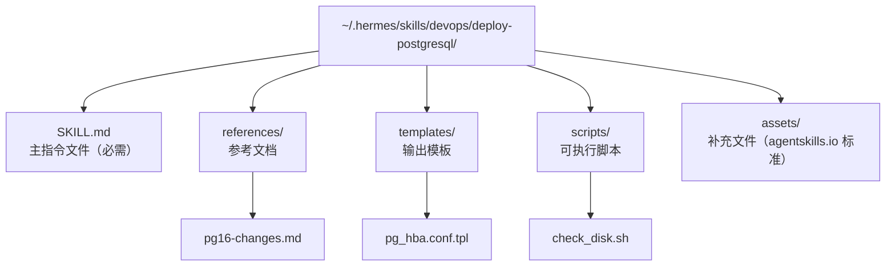
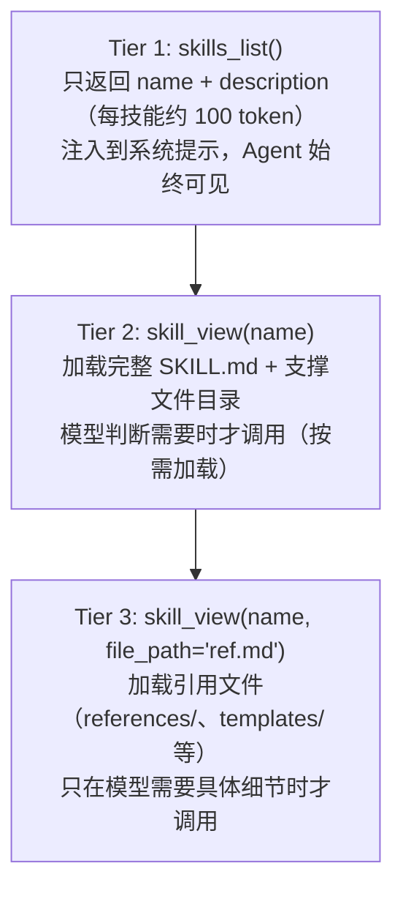

# 04 - 技能系统：Agent 的程序性记忆

> **本章定位**：技能是一种功能机制（非独立模块），代码分布在 `tools/skills_tool.py`、`tools/skill_manager_tool.py`、`tools/skills_hub.py`（3,225 行）、`agent/skill_commands.py`、`agent/skill_preprocessing.py`、`agent/skill_utils.py`、`agent/prompt_builder.py`。数据存储在 `~/.hermes/skills/`（83 个预置 + 58 个可选技能）。

## 记忆有两种

前面两篇中我们看到 Hermes 有持久记忆——MEMORY.md 和 USER.md 存储用户的偏好和事实性信息（"用户喜欢简洁的回复"、"项目用 Go 语言"）。这是**声明性记忆**：知道什么是什么。

但还有另一种记忆：**程序性记忆**——知道怎么做一件事。你记得怎么骑自行车，但你很难用语言完整描述骑自行车的每个步骤。在 Hermes 中，这种"知道怎么做"的记忆就是**技能（Skill）**。

技能和记忆的区别（`tools/skill_manager_tool.py:7-11`）很明确：记忆是"广泛的、声明性的"（"用户在用 PostgreSQL 16"），技能是"窄的、可操作的"（"部署 PostgreSQL 时，先检查磁盘空间 → 运行 pg_upgrade → 验证连接 → 更新 pg_hba.conf"）。技能是带有明确步骤、触发条件和陷阱提示的操作手册。

## 一个技能长什么样

技能的物理形态是一个目录，核心是一个 SKILL.md 文件。以一个假设的"部署 PostgreSQL"技能为例：

SKILL.md 遵循 agentskills.io 标准——一个社区开放标准，定义了技能的 YAML frontmatter 格式。frontmatter 包含元数据（名称、描述、作者、版本）、前置条件（需要哪些环境变量、哪些命令行工具）、平台限制和条件激活规则。正文是给模型看的操作指令。

技能文件的大小被严格限制（`skill_manager_tool.py:105-208`）：名称最多 64 字符、描述最多 1024 字符、全文最多 100,000 字符（约 36K token）。这些限制是为了防止一个技能消耗过多的上下文窗口——毕竟技能内容最终要注入到系统提示或用户消息中。

所有技能存放在 `~/.hermes/skills/` 下（`tools/skills_tool.py:13-26`）。Hermes 安装时自带的 83 个预置技能由 `tools/skills_sync.py` 从源码仓库的 `skills/` 目录同步过来，之后 Agent 和用户创建的技能也存放在同一位置。

## 渐进式披露：最小化 token 消耗

技能系统面临一个实际矛盾：Agent 需要知道有哪些技能可用（才能在合适的时机调用），但如果把所有技能的完整内容一次性塞进系统提示，token 消耗会爆炸——83 个技能每个平均 5K 字符，就是 400K+ 字符。

Hermes 的解决方案借鉴了 UI 设计中的"渐进式披露"（Progressive Disclosure）原则（`tools/skills_tool.py:9-13`），分三层暴露信息：

系统提示中的技能索引（`agent/prompt_builder.py:845-871`）用了强制性语言——"you **MUST** load it with skill_view(name)"——明确指示模型在发现相关技能时必须加载完整内容，而不是凭索引里的简短描述就开始操作。

这个索引有两层缓存（`agent/prompt_builder.py:491-514`）：进程内 LRU dict（最多 8 条）和磁盘快照（`~/.hermes/.skills_prompt_snapshot.json`，通过文件 mtime/size 校验有效性）。

为什么要两层？进程内缓存避免每次构建系统提示都重新扫描文件系统；磁盘快照让进程重启后也能复用，不必从零开始。Gateway 场景下多个平台的 Agent 会生成不同的缓存条目（因为不同平台的可用工具集不同，影响条件激活规则）。

当技能被修改时，`skill_manage` 自动清理两层缓存（`skill_manager_tool.py:696-700`），下一次构建系统提示会重新扫描。

## 技能怎么被创建

技能的创建有两种路径：

**模型自主创建**。`skill_manage` 工具的 schema 描述（`skill_manager_tool.py:719-728`）直接嵌入了创建时机的指引："当复杂任务成功完成（5+ 次工具调用）、从错误中恢复、用户纠正了做法时，主动提议保存为技能"。系统提示也包含类似指令（`agent/prompt_builder.py:845-865`）："After difficult/iterative tasks, offer to save as a skill."

模型调用 `skill_manage(action='create')` 后，工具会验证 frontmatter 格式、名称合法性、文件大小限制（`skill_manager_tool.py:172-208`），然后原子写入技能目录。

**用户通过 Skills Hub 安装**。Skills Hub（`tools/skills_hub.py`，3225 行）是一个技能市场，支持从 9 种数据源搜索和安装技能：内置可选技能、Hermes 官方索引、skills.sh 平台、域名的 `/.well-known/skills/` 标准端点、直接 URL、GitHub、ClawHub、Claude Marketplace、LobeHub。搜索使用 `ThreadPoolExecutor` 并行查询所有源（`skills_hub.py:3125-3202`），整体超时 30 秒。

安装经过安全检查：先下载到隔离的 quarantine 目录，安全扫描通过后才安装到 `~/.hermes/skills/`，并记录来源和 hash 到 `lock.json`。不同来源有不同的信任级别——内置技能是 `builtin`（最高信任），GitHub 和 skills.sh 是 `trusted`，ClawHub 则被强制降级为 `community`。为什么单独对待 ClawHub？代码注释记录了原因（`skills_hub.py:1583-1584`）：2026 年 2 月的一次安全事件中发现了 341 个恶意技能，表明该平台的审核机制不够可靠。

## 技能怎么自改进

这是 Hermes "self-improving" 定位的核心体现之一。当 Agent 使用一个技能完成任务时发现技能的指令有遗漏或错误——比如某个步骤在特定 OS 上会失败、缺少一个错误处理分支——它可以立即通过 `skill_manage(action='patch')` 更新技能（`skill_manager_tool.py:419-513`）。

patch 使用和文件编辑工具相同的 `fuzzy_find_and_replace` 引擎（`skill_manager_tool.py:466-468`），支持空白规范化和缩进差异处理——这很重要，因为 SKILL.md 通常包含代码块和 YAML frontmatter，精确匹配容易因空白差异失败。

系统提示明确要求这种自改进行为（`agent/prompt_builder.py:864-865`）："If a skill you loaded was missing steps, had wrong commands, or needed pitfalls you discovered, **update it before finishing**." 注意这不是建议而是指令——模型被要求在发现问题时**立即修复**，而不是等下次使用时再说。

`skill_manage` 成功后会自动清除两层缓存（`skill_manager_tool.py:696-700`），系统提示在当前会话下次构建时即可感知变化。不过 `skills_list` 和 `skill_view` 的结果缓存可能需要到下一次系统提示重建才更新——实际延迟很短，通常在下一轮对话就能看到。

## 技能的预处理：让静态文档活起来

SKILL.md 在被加载前会经过预处理（`agent/skill_preprocessing.py`），支持两种动态替换：

**模板变量**（`skill_preprocessing.py:37-60`）：`${HERMES_SKILL_DIR}` 被替换为技能目录的绝对路径，`${HERMES_SESSION_ID}` 被替换为当前会话 ID。这让技能可以引用自己目录里的脚本和模板，不需要硬编码路径。

**内联 Shell 展开**（`skill_preprocessing.py:63-112`）：`` !`date +%Y-%m-%d` `` 这样的标记会在加载时执行，模型看到的是实际命令输出（最多 4000 字符）。这让技能可以动态获取环境信息（比如当前日期、系统版本、已安装的工具列表）。默认关闭，需要 `skills.inline_shell: true` 显式开启——因为执行任意 shell 命令有安全风险。

技能还可以携带配置项（`agent/skill_utils.py:258-412`）：frontmatter 中声明 `metadata.hermes.config` 条目，值存储在 `config.yaml` 的 `skills.config.*` 路径下。每次技能被调用时（通过 `/skill-name` 斜杠命令），配置项的当前值会自动注入到消息中（`agent/skill_commands.py:73-109`），模型无需额外工具调用就知道用户的配置偏好。

## 条件激活：不是所有技能都应该出现

一个 Agent 可能有几十个技能，但在特定场景下只有部分相关。技能的 frontmatter 支持条件激活规则（`agent/skill_utils.py:241-255`）：

- `requires_toolsets: [terminal]` — 没有 terminal 工具集时隐藏（在不能执行命令的平台上，终端操作技能没用）
- `fallback_for_toolsets: [linear]` — 当 linear 工具集存在时隐藏（有原生集成就不需要技能包装了）
- `requires_tools` / `fallback_for_tools` — 同上，但按单个工具过滤
- `platforms: [macos, linux]` — 平台限制

这些规则在构建系统提示的技能索引时应用（`agent/prompt_builder.py:619-647`），确保模型只看到当前环境下真正可用的技能。

## 可选技能：不默认安装的扩展

repo 中的 `optional-skills/` 目录存放了 58 个可选技能（`optional-skills/DESCRIPTION.md:1-25`），和默认安装的 `skills/` 不同，它们不会在 `hermes setup` 时被复制到 `~/.hermes/skills/`。为什么？三个理由：

1. **利基集成**——只有极少数用户需要（比如区块链 Solana 技能）
2. **实验性功能**——还不够成熟
3. **重依赖**——需要安装额外的大型软件包

用户通过 Skills Hub 搜索发现这些技能后可以选择性安装。安装后和其他技能完全等价，享受相同的渐进式披露、自改进和条件激活机制。

## 安全：防止技能注入恶意指令

技能本质上是给模型看的自然语言指令——这意味着恶意技能可以包含 prompt injection 攻击。`skill_view()` 在加载技能内容前会做 prompt injection 扫描（`tools/skills_tool.py:130-141`），检测 9 种常见模式（如 "ignore previous instructions"、"you are now"、"disregard" 等）。

从 Skills Hub 安装的技能还会经过更严格的安全扫描（`tools/skills_guard.py`），扫描严格程度取决于来源的信任级别。路径遍历保护确保技能的 `skill_view` 和 `skill_manage` 操作不会逃逸出允许的目录范围（`tools/skills_tool.py:1012-1037`）。

## 接下来

技能系统解决了"Agent 怎么学习做事"的问题。接下来的 **05-插件系统** 会聚焦另一种扩展机制——插件是怎么注册钩子、扩展工具、修改行为的，以及它和技能系统的区别。

---

*本文基于 hermes-agent v0.11.0 源码分析。所有代码引用均经过独立验证。*
