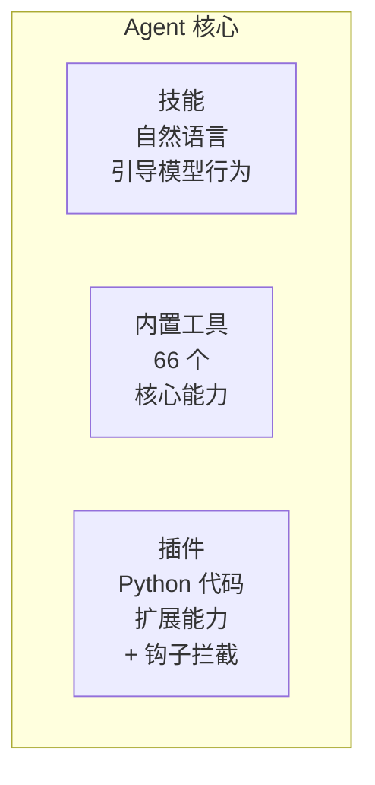
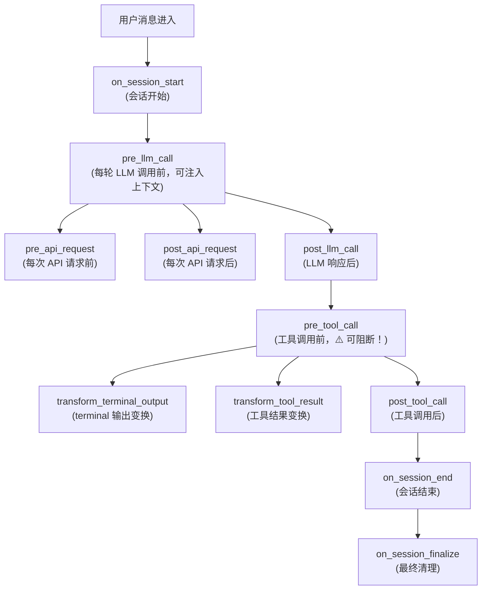
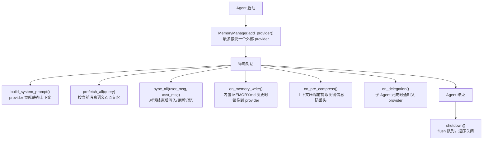

# 05 - 插件系统：用代码扩展 Agent 的能力

> **本章定位**：`plugins/` 目录（41 文件，18,603 行）+ `hermes_cli/plugins.py`（插件管理器）。插件是 Python 代码级的运行时扩展机制，与自然语言级的技能系统互补。
> **关键类**：`PluginContext`（`hermes_cli/plugins.py:210`）、`PluginManager`（`hermes_cli/plugins.py:518`）。

## 技能不够用的时候

上一篇介绍了技能系统——用自然语言指令引导模型的行为。技能强大但有一个根本限制：它只能告诉模型"怎么做"，不能改变 Agent 本身的能力。如果你想让 Hermes 对接 Spotify 播放音乐、自动追踪临时文件并清理磁盘、或者把每次 LLM 调用的 trace 发送到 Langfuse——这些需要**运行时的 Python 代码**，不是一篇 SKILL.md 能搞定的。

这就是插件系统的位置：**技能是模型层面的扩展（改变模型的行为指令），插件是运行时层面的扩展（改变 Agent 的能力集合）**。

## 插件能做什么

插件通过一个 `PluginContext` 对象（`hermes_cli/plugins.py:210-511`）注册自己的能力。这个 context 是 Agent 暴露给插件的 API 表面——插件能做的事情由 context 的方法列表严格界定。

主要能力包括：

**注册新工具**。和内置工具用同一个 `registry.register()` 接口——对模型来说，插件工具和内置工具没有任何区别。以 Spotify 插件为例（`plugins/spotify/__init__.py:56-66`），它注册了 7 个工具（播放控制、设备管理、搜索、播放列表等），模型可以像使用 `read_file` 一样使用 `spotify_search`。

**注册生命周期钩子**。这是插件最强大的能力——能在 Agent 工作流的关键节点插入自定义逻辑。系统定义了 16 种钩子（`hermes_cli/plugins.py:60-96`），覆盖了从工具调用到 LLM 请求到会话管理的完整生命周期：

整个钩子系统的执行顺序如下：

其中 `pre_tool_call` 最特殊——它可以返回 `{"action": "block", "message": "..."}` 来**阻断工具调用**（`hermes_cli/plugins.py:1085-1121`）。这意味着插件可以实现自定义的安全策略：比如一个速率限制插件可以在短时间内连续调用同一工具时自动拒绝，或者一个访问控制插件可以根据用户身份决定哪些工具可用。第一个有效的 block 指令立即生效，后续检查不执行。

每个钩子回调都包在 try/except 里（`hermes_cli/plugins.py:995-1001`），单个插件崩溃不会影响其他插件或 Agent 核心——这是插件系统的隔离保证。

**注册斜杠命令和 CLI 子命令**。插件可以注册 `/disk-cleanup` 这样的斜杠命令（CLI 和 Gateway 均可用，`hermes_cli/plugins.py:303-355`），也可以注册 `hermes spotify` 这样的终端子命令（`hermes_cli/plugins.py:278-299`）。如果命令名和内置命令冲突，注册会被拒绝。

**注册图像生成后端**。不同的 Provider 有不同的图像生成 API——OpenAI 的 gpt-image-2、xAI 的 Grok——插件通过 `ctx.register_image_gen_provider()` 注册后端（`hermes_cli/plugins.py:422-445`），`image_generate` 工具会根据当前配置选择对应后端。

**注册插件私有技能**。`ctx.register_skill()`（`hermes_cli/plugins.py:468-511`）让插件携带自己的 SKILL.md 文件，命名为 `<plugin>:<skill>`。这些技能不进入全局索引（不出现在系统提示的 `<available_skills>` 中），需要显式加载——是插件的"内部说明书"，不是公开技能。

**注入消息**。`ctx.inject_message()` 让插件可以在 Agent 运行过程中注入新消息（`hermes_cli/plugins.py:250-274`）。这用于外部事件桥接——以 Google Meet 插件为例，会议中有人说话时，插件把转录文本作为消息注入到 Agent 的对话流中。

能做这么多事的插件，本身也分成了几种——因为不同的能力需要不同的激活方式。

## 插件的三种类型

不是所有插件都一样。`plugin.yaml` 中的 `kind` 字段区分三种类型（`hermes_cli/plugins.py:161-191`）：

**`standalone`**（默认）——独立功能插件。需要用户在 `plugins.enabled` 配置中显式激活。以 disk-cleanup 插件为例（`plugins/disk-cleanup/`），它注册 `post_tool_call` 和 `on_session_end` 钩子追踪并清理临时文件，还提供 `/disk-cleanup` 斜杠命令。

**`backend`**——服务后端插件。为某个内置工具提供 Provider 实现。如果是 bundled 的（和 Hermes 一起打包的），自动加载无需 opt-in（`hermes_cli/plugins.py:633-634`）。以 `image_gen/openai` 为例（`plugins/image_gen/openai/`），它为 `image_generate` 工具提供 OpenAI gpt-image-2 后端。

**`exclusive`**——互斥插件，同一时刻只能有一个激活。记忆插件就是这种类型——你不会同时用 Honcho 和 Mem0 来管理记忆。exclusive 插件由独立的发现路径管理（不走通用 `PluginManager`），通过特定的 config key 激活（比如 `memory.provider: honcho`）。

## 记忆插件：最复杂的扩展点

记忆插件是插件系统中最复杂的扩展点——它们决定了 Agent 能记住什么、遗忘什么、以及在下一次对话开始时知道多少。

`plugins/memory/` 目录包含 8 个记忆插件（honcho、hindsight、holographic、mem0、openviking、retaindb、supermemory、byterover），但同一时刻只能激活一个。发现和加载由独立路径管理（`plugins/memory/__init__.py`），通用 `PluginManager` 会跳过这个目录（`hermes_cli/plugins.py:573-575`）。

记忆插件通过实现 `MemoryProvider` ABC（`agent/memory_provider.py:42-241`）来注册。`MemoryProvider` 定义的完整生命周期如下：

`MemoryManager`（`agent/memory_manager.py`）是运行时调度层，永远包含一个内置的 `BuiltinMemoryProvider`（基于 MEMORY.md + USER.md），最多再加一个外部 provider（`agent/memory_manager.py:207`，第二个会被拒绝）。为什么不支持多个？因为多个 provider 同时写入同一个对话历史会产生冲突和重复——它们各自的语义理解不同，合并是个未解决的难题。

以最复杂的 Honcho 插件为例（`plugins/memory/honcho/`），它实现了多轮深度记忆提取：通过反复 `.chat()` 调用（`honcho/__init__.py:949-989`），每轮有独立的推理级别（minimal → low → medium → high → max），发现强信号时提前退出。

Honcho 还有开销感知机制（`honcho/__init__.py:722-774`）——像一个只在有线索时才掏出笔记本的调查员。`context_cadence` 和 `dialectic_cadence` 控制调用频率：不是每轮对话都做深度提取，而是间隔 N 轮才触发一次。连续空结果时做线性退避（cadence 加上空结果连续次数，有上限封顶，`honcho/__init__.py:825-831`），避免在"用户只是闲聊"时反复浪费 API 调用。

## 上下文引擎插件：替换压缩策略

`plugins/context_engine/` 是另一个独立发现路径。在 [02-Agent 核心](02-agent核心.md) 中我们看到上下文压缩器（`ContextCompressor`）在对话历史过长时做 LLM 摘要压缩——这是默认实现。上下文引擎插件允许替换这个策略。

一次只能有一个 context engine 激活（`hermes_cli/plugins.py:390-418`），通过 `context.engine` config key 选择（`plugins/context_engine/__init__.py:9-10`）。默认使用内置的 `ContextCompressor`。如果有更好的压缩策略（比如基于向量检索的选择性保留），可以通过实现 `ContextEngine` ABC 来提供。

## 插件加载规则

插件不是"装上就生效"的——Hermes 对插件的加载有明确的优先级规则（`hermes_cli/plugins.py:596-656`）：

1. **显式禁用最优先**——`plugins.disabled` 列表中的插件永不加载
2. **bundled backend 自动加载**——和 Hermes 一起打包的 backend 插件（如 `image_gen/openai`）不需要 opt-in
3. **standalone 需要 opt-in**——必须在 `plugins.enabled` 中才加载
4. **exclusive 由专用 config 控制**——比如 `memory.provider: honcho`
5. **pip entry-point 插件**——通过 `hermes_agent.plugins` entry point group 发现（`hermes_cli/plugins.py:98`），适合通过 `pip install` 分发的第三方插件
6. **user/project 插件始终需要 opt-in**——从外部安装的插件，无论什么 kind

路径遍历防护（`hermes_cli/plugins_cmd.py:37-71`）确保 `hermes plugin install` 时插件名不包含 `/`、`\`、`..`，安装目标不逃逸出 plugins 目录。

## 接下来

到此为止，我们覆盖了 Hermes 的"内部"系统——Agent 核心、工具、技能、插件。接下来的 **06-Gateway 网关** 会转向"外部"——Hermes 如何同时服务 20 个消息平台，会话如何管理，消息如何投递。

---

*本文基于 hermes-agent v0.11.0 源码分析。所有代码引用均经过独立验证。*
