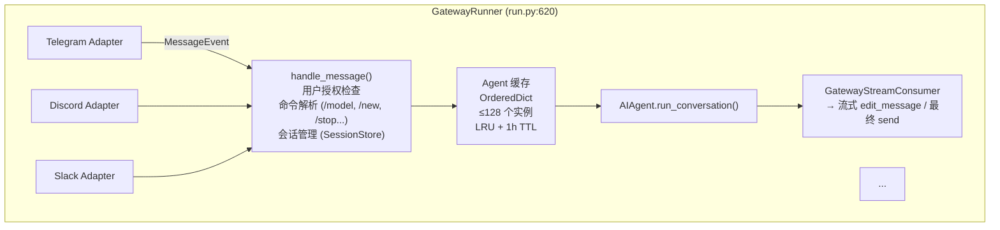
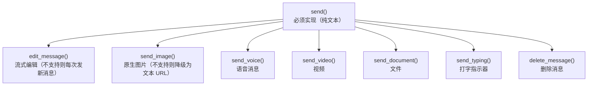
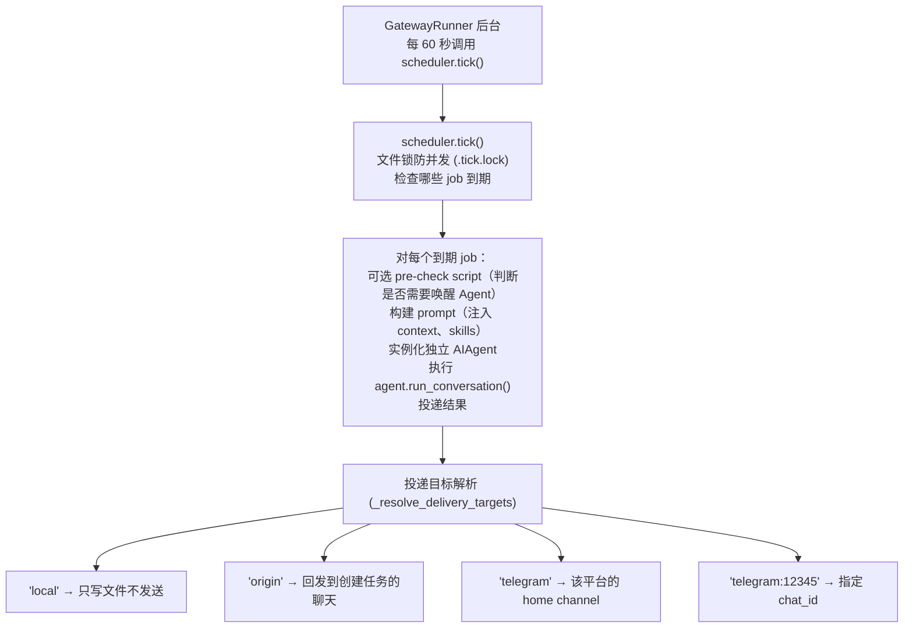

# 06 - Gateway 网关：一个进程，二十个平台

> **本章定位**：`gateway/` 目录（53 文件，64,729 行），是代码量最大的模块。包含核心控制器 `GatewayRunner`、28 个平台适配器、会话管理、流式投递和 Cron 调度集成。
> **关键类**：`GatewayRunner`（`gateway/run.py:620`）、`BasePlatformAdapter`（`gateway/platforms/base.py:1121`）、`SessionStore`（`gateway/session.py`）。

## 为什么需要网关

在 CLI 模式下，用户和 Agent 是一对一的——一个终端窗口、一个 Agent 实例、一个对话。但如果你想让同一个 Agent 同时服务 Telegram 群、Discord 频道、Slack workspace 和 WhatsApp 私聊呢？

每个平台有自己的协议（Telegram 用 Bot API + webhooks，Discord 用 WebSocket，Slack 用 Events API + Bolt），消息格式不同，能力不同（有的支持消息编辑，有的不支持），用户身份体系也不同。如果为每个平台写一套独立的 Agent 服务，代码重复度极高，而且维护 20 个服务的部署复杂度是不可接受的。

Gateway 的解决方案是：**一个进程同时连接所有平台，共享同一套 Agent 逻辑**。平台差异被封装在适配器里，Agent 核心对消息来自哪里完全无感。

## Gateway 的整体架构

`GatewayRunner`（`gateway/run.py:620`）是核心控制器。它持有所有平台适配器、Agent 缓存、会话存储和投递路由器。初始化时（`run.py:643`）建立这些核心状态，启动时（`run.py:2129`）并发连接所有已配置的平台。

## 消息从平台到 Agent 的完整路径

当一条 Telegram 消息到达时，会经历以下路径：

1. **平台适配器接收**。Telegram adapter 把原生 `Update` 对象转换为统一的 `MessageEvent`（包含 `source`、`text`、`message_type`、`message_id` 等字段），调用 `handle_message()`（`base.py:2221`）。

2. **活跃会话检查**。如果该聊天已有一个正在运行的 Agent，根据 `busy_input_mode` 配置决定行为：中断当前任务处理新消息（默认）、排队等待、或忽略。

3. **插件钩子**。`pre_gateway_dispatch` 插件钩子触发（`run.py:3409`），插件可以 skip、rewrite 或 allow 这条消息。

4. **用户授权**。`_is_user_authorized()` 检查发送者是否有权使用 Agent（`run.py:3452`）——Gateway 支持 DM 配对、白名单等授权模式。

5. **命令解析**。检查消息是否是斜杠命令（如 `/model`、`/new`、`/stop`）。部分命令（如 `/stop`、`/restart`）可以在 Agent 运行时处理（`run.py:3619-3632`）。

6. **会话获取**。`SessionStore.get_or_create_session()`（`session.py:828`）根据 `session_key` 查找或创建会话，评估是否需要自动重置。

7. **Agent 获取**。从 `_agent_cache` 中按 `session_key` 查找 Agent 实例。缓存未命中时新建 `AIAgent`，从 SQLite 恢复会话历史。

8. **执行**。`AIAgent.run_conversation()` 在线程池中运行（通过 `loop.run_in_executor`）。

9. **投递**。`GatewayStreamConsumer` 桥接同步 Agent 回调与异步平台投递，流式 edit 消息或一次性发送最终结果。

## 会话管理：谁的对话算谁的

Gateway 面临一个 CLI 不需要考虑的问题：**同一个聊天窗口可能有多个用户**。在 Telegram 群里，用户 A 和用户 B 同时和 Agent 对话，它们的上下文应该隔离还是共享？

`session_key` 的生成规则（`session.py:572`）决定了这个问题：

| 场景 | session_key 格式 | 效果 |
|------|-----------------|------|
| 私聊 | `agent:main:{platform}:dm:{chat_id}` | 一个用户一个会话 |
| 群聊（默认） | `...:{chat_id}:{user_id}` | 每个用户独立会话 |
| 群聊（共享模式） | `...:{chat_id}` | 群内共享一个会话 |
| 线程 | `...:{chat_id}:{thread_id}` | 线程内共享 |

默认群聊按用户隔离（`group_sessions_per_user=True`，`session.py:554`）。这意味着群里的用户 A 和用户 B 各有自己的对话历史、记忆和上下文——即使它们在同一个群聊窗口。共享模式下，多个用户的消息会进入同一个对话流，系统提示中不固化用户名（避免破坏 prefix cache），而是在每条消息前缀 `[sender name]`。

### 会话重置策略

会话不是永久的。`SessionResetPolicy`（`gateway/config.py:101`）定义了三种重置模式：

- **idle** — 空闲超过指定时间（默认 24 小时）后自动重置
- **daily** — 每天指定时刻（默认凌晨 4 点）重置
- **both**（默认）— 两个条件满足任一即重置

重置意味着清空对话历史、开始新的 `session_id`，但持久记忆（MEMORY.md、USER.md）不受影响——它们跨会话存活。如果会话有活跃的后台进程（比如正在执行的终端命令），重置会被推迟到进程结束。

### PII 保护

不同平台对用户 ID 的隐私要求不同。WhatsApp、Signal、Telegram 和 BlueBubbles 的 user_id 可能包含真实手机号等敏感信息，不应泄露到 LLM；Discord 等平台的 user_id 需要保留原始格式才能正确 mention。`session.py:194` 对敏感平台（`_PII_SAFE_PLATFORMS`，共 4 个平台）的 ID 做哈希脱敏后注入系统提示。

## 平台适配器：封装差异的工厂

`BasePlatformAdapter`（`gateway/platforms/base.py:1121`）是所有平台适配器的基类。它要求实现三个核心方法：

- `connect()` → 连接平台（`base.py:1325`）
- `disconnect()` → 断开（`base.py:1334`）
- `send()` → 发送文本消息（`base.py:1339`）

在此之上提供了一系列可选方法，有合理的降级行为：

这种"必须 + 可选降级"的设计意味着：**新增一个平台只需要实现 3 个方法就能基本工作**，进阶功能按需实现。以 Telegram adapter 为例（`gateway/platforms/telegram.py`），它基于 `python-telegram-bot` 库，实现了全套发送方法（图片、语音、视频、文件、编辑），还处理了 MarkdownV2 转义等平台特有逻辑。

## 流式投递：让用户看到"正在打字"

传统做法是等 Agent 生成完整回复后一次性发送——但对于长回复，用户可能等几十秒看不到任何反馈。流式投递让回复在生成的同时逐步显示。

`GatewayStreamConsumer`（`gateway/stream_consumer.py:57`）是流式投递的核心。它在 Agent 的同步回调（`on_delta`）和平台的异步发送之间架设了一座桥：

1. Agent 线程产生一个文本 token → 放入 `queue.Queue`
2. 异步 `run()` 任务轮询队列，积累文本
3. 达到触发条件（时间间隔 1 秒或积累 40 字符）时 → 调用 `edit_message()` 更新消息
4. Agent 完成后 → 发送最终版本

几个细节值得注意：

**Think block 过滤**（`stream_consumer.py:183`）。模型的内部推理标签（`<think>`、`<reasoning>`）在流式传输过程中被状态机过滤——用户看到的是干净的回复，不包含原始推理过程。

**长消息分割**（`stream_consumer.py:333-379`）。不同平台有不同的消息长度限制（以 Telegram 的 4096 字符为例），超长回复按词和代码块边界分割为多条消息，带 `(1/2)` 分块指示。

**fresh-final 机制**。如果流式响应持续超过一定时间（以 Telegram 为例默认 60 秒，`gateway/config.py:206`），最终版本会作为新消息发送（而非 edit），让平台时间戳反映实际完成时间。

## Cron 集成：Agent 的定时任务

Gateway 不只是被动等待消息——它也能主动执行任务。`cron/` 目录实现了定时调度，让用户用自然语言设置定期任务："每天早上 8 点总结昨天的 GitHub issues"。

Cron 和 Gateway 的集成是这样的：

Cron 任务执行时创建**独立的 AIAgent 实例**（不复用 Gateway 的 Agent 缓存），有自己的工具集（默认关闭高消费工具如 MoA、HomeAssistant、RL，`scheduler.py:44-72`）。

投递优先使用 Gateway 正在运行的活跃 adapter（`scheduler.py:411`）——这对需要 E2E 加密的平台（如 Matrix）很重要，因为只有已建立的加密 session 才能发送消息。如果 Gateway 没在跑（比如用 `hermes cron run` 单独执行），会回退到独立的 HTTP 客户端直接调用平台 API（`scheduler.py:457`）。

一个巧妙的细节：Agent 回复以 `[SILENT]` 开头时（`scheduler.py:115`），输出保存到本地文件但不投递到聊天——这适合"检查了但没有新内容"的场景，避免每天定时发一条"没有更新"的消息打扰用户。

## 故障恢复

Gateway 作为长期运行的进程，故障恢复是核心关切。

**平台重连**（`run.py:2634-2748`）。单个平台断开不影响其他平台。`_platform_reconnect_watcher()` 后台任务对失败平台做指数退避重连（30s → 60s → 120s → 240s → 300s 上限，最多 20 次）。

**热重启**（`run.py:2112`）。`/restart` 命令触发热重启：先通知所有活跃会话"重启中"，等待活跃 Agent 完成（超时则强制中断），标记可恢复的会话为 `resume_pending`（保留 session_id），然后重启进程。重启后这些会话会从 SQLite 恢复历史继续对话。

**Stuck loop 检测**（`run.py:2235-2268`）。如果同一个会话在连续 3 次重启时都处于活跃状态，说明它可能导致了崩溃循环——自动挂起该会话，防止无限重启。

**零平台启动**。如果没有任何平台连接成功（比如所有 token 都过期了），Gateway 仍然运行——因为它还需要执行 Cron 任务（`run.py:2403`）。只有存在不可重试的错误（如配置格式错误）时才会退出。

## 接下来

Gateway 解决了"Agent 怎么服务多个平台"的问题。下一篇 **07-TUI 与 Web** 会转向用户界面——CLI 的 prompt_toolkit TUI、新的 React/Ink TUI、以及 Web Dashboard。

---

*本文基于 hermes-agent v0.11.0 源码分析。所有代码引用均经过独立验证。*
