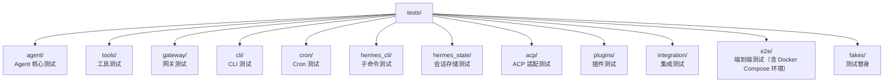

# 12 - 工程实践：578,000 行代码的维护之道

> **本章定位**：跨模块的工程基础设施——`hermes_state.py`（2,094 行 SQLite 会话存储）、`hermes_logging.py`（389 行日志系统）、`utils.py`（271 行原子写入等工具函数）、`tests/`（826 文件，285,239 行测试）、`CONTRIBUTING.md`、`SECURITY.md`。

## 大项目的基础设施

578,000 行 Python、826 个测试文件、6,384 次提交、9 个月的开发历史——维护这样规模的项目需要扎实的工程基础设施。本章不讲 Agent 怎么工作，讲的是**代码本身怎么被组织、测试、记录和保护**。

## 会话存储：SQLite 的精细使用

`hermes_state.py` 实现了 `SessionDB`——所有对话历史、token 统计、会话检索的底层存储。选择 SQLite 而非 PostgreSQL 或文件系统，是因为 Hermes 定位为单用户/单机部署——SQLite 零配置、零网络、零进程管理，`pip install` 就能用。

Schema 设计（`hermes_state.py:38-101`，当前 `SCHEMA_VERSION = 11`）值得关注：

**sessions 表**有 25+ 字段，包含完整的 token 账本（input/output/cache_read/cache_write/reasoning tokens）、成本估算和模型信息。**messages 表**支持多种推理格式（`reasoning`、`reasoning_content`、`codex_reasoning_items` 等字段），适配不同模型的输出结构。

**全文搜索**用了两个 FTS5 虚拟表（`hermes_state.py:103-156`）：一个 unicode61 tokenizer（适合西文分词），一个三元组 tokenizer（`messages_fts_trigram`，支持 CJK 子串搜索）。这意味着用户可以用 `/session_search` 搜索中文内容——很多项目会忽略这个需求。

**写入竞争**是 SQLite 在多线程场景下的经典问题。Hermes 的应对（`hermes_state.py:167-201`）：WAL 模式 + 1 秒 timeout + 应用层随机抖动重试（20-150ms，最多 15 次）。为什么用随机抖动而非固定间隔？和 API 重试的理由一样——防止多个线程同步竞争。`BEGIN IMMEDIATE` 在事务开始时就获取写锁，避免读到过期数据后再升级锁时冲突。每 50 次写入做一次 PASSIVE WAL checkpoint，防止 WAL 文件无限增长。

**Schema 迁移**采用自动化方案：`_parse_schema_columns()`（`hermes_state.py:297`）解析现有表结构，`_reconcile_columns()`（`hermes_state.py:339`）比较差异并补齐，自动执行 `ALTER TABLE ADD COLUMN`——无停机、无手动脚本。这让版本升级时的数据库兼容变得透明。

## 日志系统：三路分发与安全脱敏

`hermes_logging.py` 实现了三路日志分发：

- `agent.log` — 全量活动日志（INFO+），日常排错的主要来源
- `errors.log` — 只记录 WARNING+，快速定位问题（2MB × 2 备份轮转）
- `gateway.log` — Gateway 组件专属（通过 `_ComponentFilter` 路由 `gateway.*` 模块的日志）

Session 上下文（`hermes_logging.py:72-83`）通过线程本地存储注入到每条日志——在 `run_conversation()` 周期内，所有日志行都携带 `[session_id]` 标签，方便在多会话并发场景下追踪特定对话。

安全方面，`RedactingFormatter` 自动脱敏 API key 和 token（避免 secrets 泄露到日志文件）。NixOS 托管模式下，文件创建和轮转后自动 `chmod 0660`，确保 gateway 服务账户和交互用户可以共享日志。

## 测试策略：826 个文件背后的优先级

`tests/` 目录包含 826 个测试文件、约 285,000 行测试代码——测试代码量约为生产代码的一半。目录按模块组织：

**图：测试套件的目录组织——按模块分区并覆盖单元、集成、端到端三个层次**

从测试文件名可以看出测试关注点的优先级：

- `test_sql_injection.py` — 安全性是一等公民
- `test_subprocess_home_isolation.py` — 进程隔离验证
- `test_batch_runner_checkpoint.py` — 断点续传正确性
- `test_trajectory_compressor_async.py` — 异步逻辑的专门测试
- `test_packaging_metadata.py` — 打包元数据不出错
- `test_model_tools_async_bridge.py` — 同步/异步桥接

E2E 测试使用 Docker Compose 搭建完整环境（以 Matrix 跨服务签名引导为例），确保端到端路径在真实环境中工作。

## 工具函数：看似无聊但至关重要

`utils.py` 只有 270 行，但它的 `atomic_json_write()` 和 `atomic_yaml_write()` 被整个系统依赖——Cron 的 `jobs.json`、Profile 的 `active_profile`、批量运行的 checkpoint 都通过它写入。

"原子写入"的含义是：先写到临时文件 → `fsync` 确保落盘 → `os.replace` 替换目标文件。如果在写入过程中进程崩溃，目标文件要么是旧版本（replace 前崩溃）要么是新版本（replace 后），不会是半写的损坏状态。这对 Cron 的 `jobs.json` 尤其重要——想象 tick 执行到一半崩溃，重启后如果 `jobs.json` 是损坏的，所有定时任务就丢了。

## 安全边界：8 层纵深防御

`SECURITY.md` 定义了 Hermes 的安全边界：

- **信任模型**：单租户个人 Agent，多用户隔离由 OS 层负责
- **报告渠道**：GitHub Security Advisories 或 `security@nousresearch.com`，90 天协调披露窗口
- **不在范围内**：prompt injection（除非绕过审批）、公网暴露场景（无外部 auth）

安全层次总结（跨多篇文档）：

| 层 | 实现 | 文档 |
|----|------|------|
| 危险命令审批 | `tools/approval.py` | [03-工具系统](03-工具系统.md) |
| 路径安全 | `tools/path_security.py` | [03-工具系统](03-工具系统.md) |
| URL SSRF 防护 | `tools/url_safety.py` | [03-工具系统](03-工具系统.md) |
| Tirith 内容扫描 | `tools/tirith_security.py` | [03-工具系统](03-工具系统.md) |
| 输出脱敏 | `agent/redact.py` | 本章 |
| MCP 环境过滤 | `tools/mcp_tool.py` | [05-插件系统](05-插件系统.md) |
| 子 Agent 限制 | `tools/delegate_tool.py` | [02-Agent 核心](02-agent核心.md) |
| Cron prompt 注入扫描 | `tools/cronjob_tools.py` | [08-Cron 调度](08-cron调度.md) |

## 贡献指南：优先级明确的协作契约

`CONTRIBUTING.md` 对贡献类型有明确的优先级排序：bug fix > 跨平台兼容 > 安全加固 > 性能 > 新技能 > 新工具 > 文档。特别值得注意的是"Skill vs Tool 决策"——能用 shell 命令加已有工具实现的用 Skill，需要 API key 管理或二进制流处理的才用 Tool。这个原则有效地控制了 `tools/` 目录的膨胀。

Commit 规范使用 Conventional Commits（`fix/feat/docs/test/refactor/chore`），scope 覆盖 cli/gateway/tools/skills/agent/install/security。

## 结语

十二篇文档走完了 Hermes Agent 的完整源码。从项目概述到工程实践，我们看到了一个**野心大但根基扎实**的项目：它同时是一个可用的 AI 助手产品、一个支持 20+ 平台的消息网关、一个训练数据工厂、以及一个 RL 研究平台。578,000 行代码中有相当比例是 AI 辅助生成的（见 [00-项目概述](00-项目概述.md) 的分析），但架构设计的一致性和工程实践的严谨性表明，人工把控的质量门槛没有降低。

---

*本文基于 hermes-agent v0.11.0 源码分析。所有代码引用均经过独立验证。*
