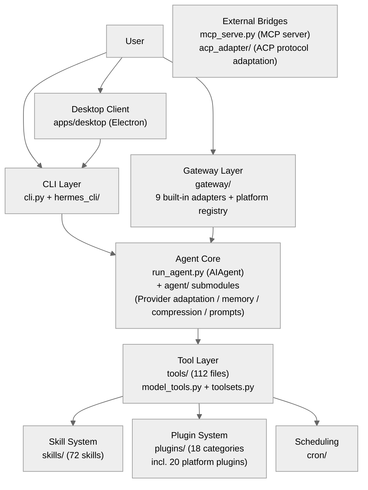
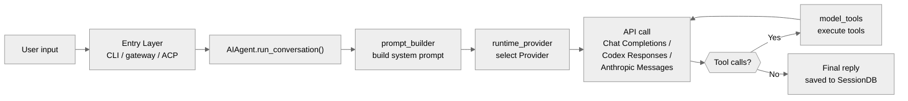
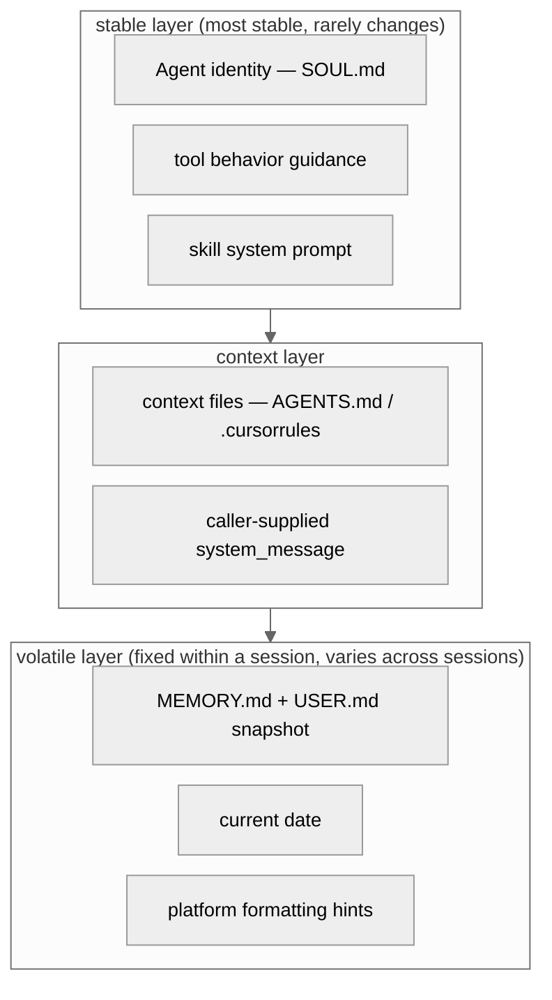
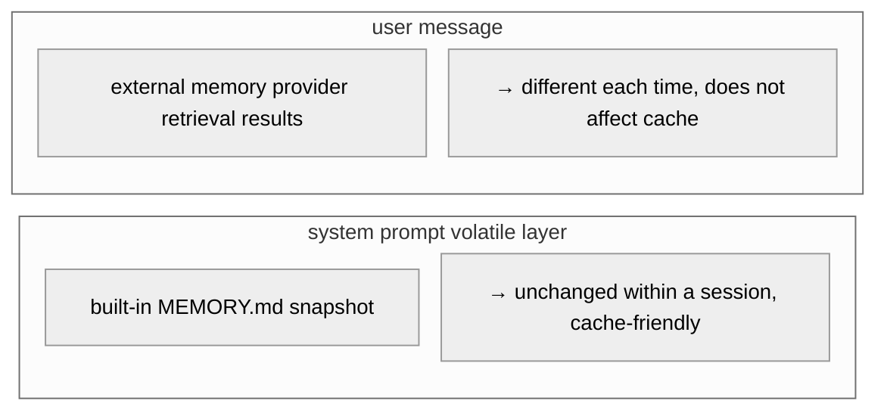
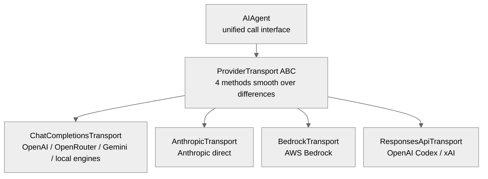
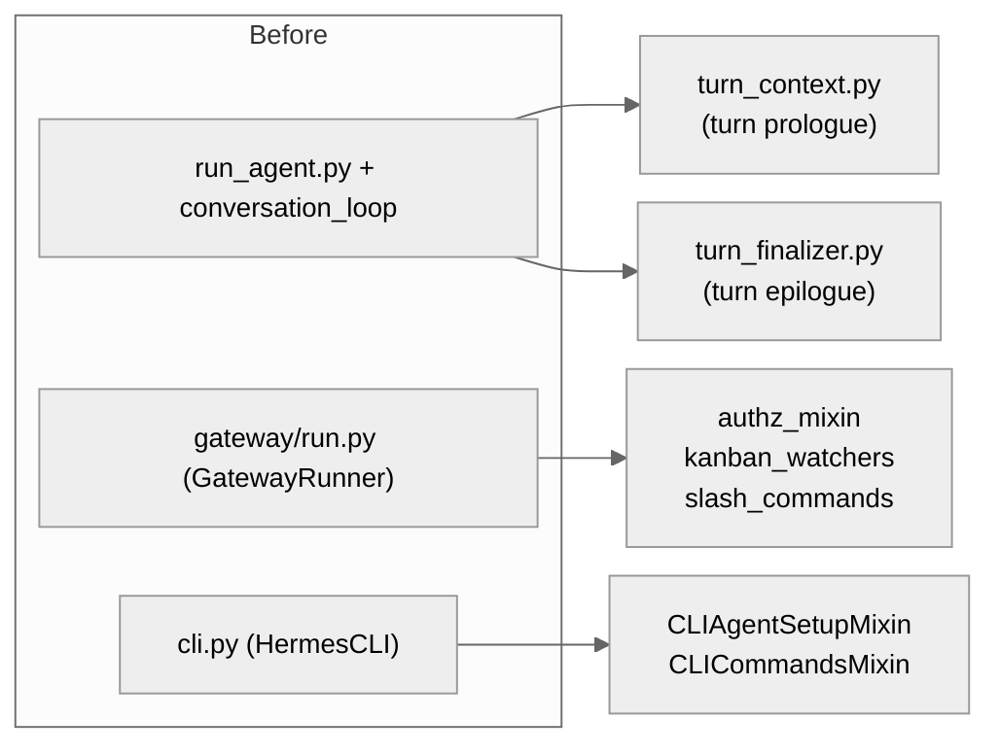

# 00 - Project Overview: An AI Agent That Tries to Evolve Itself

[中文](../zh/00-项目全景.md) | English

> **This chapter is based on hermes-agent v0.18.2 (tag [`v2026.7.7.2`](https://github.com/NousResearch/hermes-agent/releases/tag/v2026.7.7.2), commit `9de9c25f6`, 2026-07-07)**

---

## What Problem Does It Try to Solve?

If you want an AI agent that is more than a one-shot tool of "receive instruction → execute → return result" — one that learns from experience, remembers who you are across sessions, and even works on its own while you are away — how would you design it?

Nous Research's answer is Hermes Agent. It is an MIT-licensed open-source AI agent framework (currently v0.18.2, `pyproject.toml:10`), and its ambition is written in a single line of description:

> "The self-improving AI agent — creates skills from experience, improves them during use, and runs anywhere."
>
> — `pyproject.toml:11`

Three keywords: **self-improving**, **skill learning**, **runs anywhere**. But these phrases are too abstract. Let's start from the user's side — install it, talk to it — and then come back to see what this sentence means at the architectural level.

---

## Usage Guide

### Installation and Your First Conversation

Installation takes a single command:

```bash
curl -fsSL https://raw.githubusercontent.com/NousResearch/hermes-agent/main/scripts/install.sh | bash
```

The installer automatically handles dependencies like uv, Python 3.11, Node.js, ripgrep, and ffmpeg. Once installed:

```bash
source ~/.bashrc    # reload the shell
hermes              # start a conversation
```

On first launch it guides you through choosing an LLM Provider and model. The fastest path is Nous Portal — one command sets up all your API keys:

```bash
hermes setup --portal
```

This logs into Nous Portal via OAuth, automatically configures the Provider, and enables the Tool Gateway (web search, image generation, TTS, cloud browser), without you having to collect five or six API keys separately.

Of course, you can also use any OpenAI-compatible Provider. hermes-agent ships with 36 Provider presets — take OpenRouter as an example: a single key gives you access to the many vendors' models it aggregates.

### Three Entry Points, One Agent

Hermes has three main entry points (`pyproject.toml:307-310`), but they all ultimately call the same core — `AIAgent.run_conversation()`:

**The `hermes` command** (`hermes_cli.main:main`) is the entry point for everyday use. It is a full-featured CLI with subcommands like chat, gateway, setup, cron, and model. Typing `hermes` with no arguments enters an interactive conversation.

```bash
hermes              # start the interactive CLI
hermes model        # switch LLM Provider and model
hermes tools        # configure tool enable/disable
hermes gateway      # start the message gateway (Telegram, Discord, etc.)
hermes setup        # run the full configuration wizard
hermes doctor       # diagnose problems
```

**The `hermes-agent` command** (`run_agent:main`) is the entry point for developers and scripts. It directly exposes the `AIAgent` class, which you can embed in code via `from run_agent import AIAgent`.

**The `hermes-acp` command** (`acp_adapter.entry:main`) is the ACP (Agent Communication Protocol, the editor-agent communication protocol) server entry point — it lets IDEs such as VS Code, Zed, and JetBrains use hermes-agent as a coding assistant.

In addition, since v0.18 there is an entry point that does not go through the terminal: the **desktop app** (`apps/desktop`, Electron), which packages the Agent, gateway, and Dashboard into a graphical client. Its architecture is covered in Chapter 14.

### Configuration

Hermes configuration follows a clear precedence chain (the "Configuration Precedence" section of the [official configuration docs](https://hermes-agent.nousresearch.com/docs/user-guide/configuration)):

**CLI flag > `config.yaml` > `.env` (environment-variable fallback) > built-in defaults**

The division of labor is by content: secrets (API keys, bot tokens) **must** go in `.env`; everything else (model, terminal backend, compression parameters, ...) goes in `config.yaml` (`~/.hermes/config.yaml`) — when a non-secret setting is defined in both places, `config.yaml` wins. Command-line arguments are for temporary per-invocation overrides.

A minimal configuration example:

```yaml
model:
  default: "anthropic/claude-opus-4.6"
  provider: "openrouter"
  base_url: "https://openrouter.ai/api/v1"
```

The configuration file itself (`cli-config.yaml.example`, about 1,440 lines) covers an enormous surface: from model selection, terminal backend, security policy, context-compression parameters, memory behavior, and display theme to MCP server integration — nearly every behavior is tunable. But the core design principle is **works with zero configuration** — the defaults are carefully chosen, and it runs as soon as you have an API key.

### Common Scenarios

**Scenario 1: Talk to it from Telegram.** Run `hermes gateway start` on a server, configure your Telegram bot token, and then message the bot from your phone. The Agent executes tool calls on the server, and results come back through Telegram. The conversation context is continuous across platforms.

**Scenario 2: Automated scheduled tasks.** Describe a task in natural language and let the Agent create the cron schedule itself:

```
/cron "Every day at 8 AM, summarize the top five Hacker News stories and send them to Telegram"
```

Once the Agent understands the intent, it creates the scheduled task, executes it on time, and delivers the result to the specified platform.

**Scenario 3: Switching models.** Switch models mid-conversation:

```
/model openrouter:deepseek/deepseek-r1
```

No reconfiguration, no code changes. The Provider abstraction layer handles the format differences.

### Troubleshooting

| Problem | Where to look |
|---------|---------------|
| Startup failure | `hermes doctor` checks Python version, missing dependencies, and configuration errors |
| API call errors | Check `~/.hermes/agent.log`; verify the API key and Provider configuration |
| A tool is unavailable | `hermes tools` shows tool enable status; some tools need extra dependencies (Browser, for example, needs Playwright) |
| Gateway won't connect | `hermes gateway status` shows process status; check the bot token and network connectivity |

> 📖 **Further Reading (Official Docs):**
> - [Quickstart](https://hermes-agent.nousresearch.com/docs/getting-started/quickstart)
> - [CLI Guide](https://hermes-agent.nousresearch.com/docs/user-guide/cli)
> - [Configuration Reference](https://hermes-agent.nousresearch.com/docs/user-guide/configuration)
> - [Architecture Overview](https://hermes-agent.nousresearch.com/docs/developer-guide/architecture)

---

## Architecture & Implementation

### Module Landscape

The Hermes codebase can be divided into seven major areas. The diagram below shows the relationships between them — arrows indicate "depends on" or "calls":



**Figure: The dependency/call relationships among Hermes's seven major modules**

A one-line description of each module:

- **CLI Layer** (`cli.py` + `hermes_cli/`) — everything you see in the terminal: the interactive REPL, subcommands (chat/gateway/setup/cron/model), and the TUI. It is the bridge between the user and the Agent.
- **Gateway Layer** (`gateway/`) — the unified message entry point that lets a single Agent serve Telegram, Discord, Slack, WhatsApp, and other platforms at the same time. One process, all platforms. Most platform adapters (20 of them) are distributed as plugins under `plugins/platforms/`; the gateway itself keeps 9 built-in adapters and the unified platform registry.
- **Agent Core** (`run_agent.py` + `agent/`) — the heart of the whole system. The `AIAgent` class implements the core loop of "receive message → call model → parse tool calls → execute tools → loop until done." The `agent/` subdirectory handles supporting logic such as Provider adaptation, context compression, prompt building, and memory management.
- **Tool Layer** (`tools/` + `model_tools.py`) — the Agent's "hands and feet." 112 tool files cover terminal execution, file operations, web search, browser automation, voice, image generation, and more. `model_tools.py` handles tool registration and dispatch.
- **Skills and Plugins** (`skills/` + `plugins/`) — the Agent's "long-term memory and learning ability." Skills are reusable task templates (72 built in + 102 optional); plugins extend capabilities such as memory, the context engine, model Providers, and message platforms.
- **Desktop Client** (`apps/`) — the seventh area, added in v0.18: the Electron desktop app (`apps/desktop`) + the bootstrap installer (`apps/bootstrap-installer`), which connect to the backend through `hermes_cli`'s web_server. See Chapter 14.
- **External Bridges** (`mcp_serve.py` + `acp_adapter/`) — let other systems (Claude Code, Cursor, etc.) call Hermes's capabilities through standard protocols.

The dependencies among these modules are **strictly one-directional**: CLI/gateway → Agent core → tool layer. There are no reverse dependencies. Where a reverse call is needed (take the subagent tool as an example: it needs to create a new AIAgent), a deferred import (importing the dependency inside a function rather than at the top of the file) is used to avoid circular-import problems.

### Five Core Problems

That's how you use it. So why is Hermes designed this way? What's under the hood? Let's look at the core problems it faces — these problems shape the entire architecture.

#### Problem 1: Model Lock-in

Most AI agent frameworks are bound to a single model provider — use OpenAI and you're stuck with GPT; use Anthropic and you're stuck with Claude. But the model market changes fast: today's best model may be surpassed tomorrow, or its price may suddenly double.

Hermes's choice is to **not lock into any model at all**. Its Provider registry (`CANONICAL_PROVIDERS`, `hermes_cli/models.py:1030`) statically lists 36 presets: Nous Portal (the registry describes it as "300+ models, bundled tool gateway"), OpenRouter, Anthropic, OpenAI, Gemini, NVIDIA, Xiaomi, Kimi, MiniMax, Hugging Face, Arcee, Ollama Cloud, KiloCode... and it even supports locally-run Ollama, LM Studio, vLLM, and llama.cpp. Among the 36 entries there is also a special virtual provider — `moa` (Mixture of Agents, a multi-model aggregation mode, covered in Chapter 02). Users can switch at any time with `hermes model`, no code changes required.

This choice brings an architectural consequence: Hermes must handle the differences between each vendor's API in code — Anthropic's message format is different from OpenAI's, and Bedrock has its own protocol. This is why the Provider adaptation layer, which we'll see later, exists. Its solution is pragmatic: the vast majority of Providers offer an OpenAI-compatible API, so it uses the `openai` Python SDK as the single HTTP client, switching Providers by changing the `base_url` and API key. Native features of certain Providers (take Anthropic's Prompt Caching as an example) that cannot be used through the compatible interface are handled by dedicated adapters (`agent/anthropic_adapter.py`).

#### Problem 2: Platform Fragmentation

You might talk to the AI in a Mac terminal, but your users might be on Telegram. Your team might use Slack. Your customers might use WhatsApp. If you write a separate agent for each platform, maintenance cost grows linearly.

Hermes's approach is to build a **unified gateway** (`gateway/`): a single process connects to all platforms at once, sharing the same agent logic. A message arriving from Telegram and a line typed in the CLI both end up going through the same `AIAgent.run_conversation()` method. Platform adapters live in two places: **20 platforms are distributed as plugins** (`plugins/platforms/` — Telegram, Slack, Discord, Feishu, DingTalk, WeCom, Matrix, Mattermost, WhatsApp, Email, SMS, Home Assistant, etc.), while the gateway itself keeps only **9 built-in adapters** (Signal, WeChat Official Account, WhatsApp Cloud API, Tencent Yuanbao, QQ Bot, BlueBubbles, plus the three protocol entry points API Server / Webhook / MS Graph Webhook). Plugin platforms register only a "deferred loader" at startup and import each vendor's heavy SDK only on first actual use — the background of this mechanism is covered in Chapters 05/07.

#### Problem 3: The Limits of One-Shot Conversations

A traditional chatbot's session is one-shot — close the window and all the context disappears. The next time you come back, it doesn't know what you asked it to do last week, nor does it remember how you prefer to work.

Hermes tries to break this limit by doing three things:
- **Persistent memory**: the agent proactively writes important information to `MEMORY.md` and `USER.md`, which are auto-loaded in the next session (`agent/memory_manager.py`)
- **Session search**: past conversations are stored in SQLite with an FTS5 (SQLite's native full-text search extension) index built, so the agent can search its own past (`hermes_state.py`)
- **Skill learning**: after completing a complex task, the agent abstracts the solution into a "skill" and saves it, so next time it faces a similar problem it calls it directly (`tools/skill_manager_tool.py`)

This is not simply "storing chat logs." It is more like modeling a layered structure of working memory + long-term memory, trying to make the agent understand you better as you use it.

Memory solves the "who are you" problem. But as conversations grow longer, there is an engineering reality that must be faced.

#### Problem 4: Conversations Keep Getting Longer

AI models have a context-window limit — even a 1-million-token window will eventually be hit by a long-running agent. And the longer the context, the higher the API cost and the greater the latency.

Hermes's response is a **context compressor** (`agent/context_compressor.py`). When conversation history fills a certain fraction of the context window, it uses a cheap auxiliary model to summarize the middle of the conversation, keeping only the head (to keep the system prompt stable) and the tail (to keep recent context). This is not simple truncation — it first uses a cheap model to compress the middle into a summary (keeping key decisions, dropping execution details), then sandwiches the summary between the head and tail before sending it to the main model. To draw an analogy: it's like meeting minutes replacing a full recording — not aiming to reproduce every word, but keeping every key decision.

The default compression ratio is 20% (`_SUMMARY_RATIO = 0.20`, `context_compressor.py:195`), with a floor of 2000 tokens (`:193`) and a ceiling of 12000 tokens (`:197`).

#### Problem 5: An Agent Shouldn't Only Live on Your Laptop

Many agent frameworks assume you'll use them in a local terminal. But what if you want the agent to run 24/7 in the cloud, execute tasks periodically, and monitor something for you while you sleep?

Hermes offers seven execution backends (`tools/environments/`): local execution, Docker containers, remote machines via SSH, the Daytona cloud sandbox, Singularity HPC containers, and Modal Serverless (in two modes: direct SDK connection and managed proxy). The latter ones support "hibernation": the agent's execution environment automatically pauses when idle and wakes up when there's a task, at nearly zero cost. (In the v0.14 era there was also a Vercel Sandbox backend, which was removed in later versions.)

Combined with the built-in cron scheduler (`cron/`), you can set up scheduled tasks in natural language: "Every day at 8 AM, summarize yesterday's GitHub issues and send them to the Telegram group" — the agent wakes up at the specified time, executes, delivers the result, and then continues to hibernate.

### Project Structure: Finding Code by Following the Problems

If you map Hermes's directory structure onto the five problems above, its organizing logic becomes clear:

**"How does it talk to the model?"** → `run_agent.py` (the AIAgent class, the tool-call loop) + `agent/` (Provider adaptation, prompt building, context compression, memory management)

**"How does it talk to the user?"** → `cli.py` (terminal TUI) + `gateway/` (multi-platform gateway) + `hermes_cli/` (CLI subcommands) + `apps/desktop` (desktop client)

**"How does it get things done?"** → `tools/` (112 tool files, covering terminal execution, file operations, web search, browser automation, etc.) + `model_tools.py` (tool registration and dispatch)

**"How does it learn?"** → `skills/` (72 built-in skills) + `optional-skills/` (102 optional skills) + `plugins/` (memory and context plugins)

**"How does it run independently?"** → `cron/` (scheduling) + `tools/environments/` (7 execution backends) + `Dockerfile` (containerization)

**"How is it called by other systems?"** → `mcp_serve.py` (MCP server) + `acp_adapter/` (ACP protocol adaptation, IDE integration)

**"How is it used for research?"** → `batch_runner.py` (batch trajectory generation) + `trajectory_compressor.py` (trajectory compression)

There's also some glue: `hermes_constants.py` defines shared constants (`get_hermes_home()` returns `~/.hermes`, `hermes_constants.py:55`); `hermes_state.py` manages SQLite session storage and FTS5 full-text search; `toolsets.py` organizes tools into "toolsets" for different platforms to enable/disable.

### The Core Data Flow

Whether a message comes from the terminal, Telegram, or an API call, it goes through the same core processing flow:



**Figure: The complete path of a message from input to reply**

This loop looks simple, but the number of edge cases it has to handle is enormous. Let's walk through it station by station.

### The Journey of a Message

#### Station 1: The CLI Captures Your Input

Everything begins in the main loop of `cli.py`. The `HermesCLI` class builds an interactive REPL with `prompt_toolkit`. User input is captured through a TextArea (handled by the main thread's prompt_toolkit UI event loop) and placed into a thread-safe queue. A **background daemon thread** (`process_loop`, `cli.py:15071`) blocks on this queue, waking up every 100 ms on timeout (`_pending_input.get(timeout=0.1)`); once it has input, it decides whether it's a slash command or an ordinary message and starts the Agent call on that thread — while the main thread stays focused on maintaining the REPL, never blocked by Agent execution. In its idle wake-up gaps it also does two things: checking the config file for MCP server changes, and injecting background-process completion notifications into the input queue.

Why a background thread? Because the main thread needs to stay responsive — the user may press Ctrl+C at any moment to interrupt, or type a new message to override the current task. If an Agent call blocked the main thread, none of that would be possible.

#### Station 2: The Agent Core Loop

`AIAgent.run_conversation()` (`run_agent.py:5745`) is the heart of the entire system. At its core is a while loop that iterates at most 90 times by default (`max_iterations`, `run_agent.py:427`). There is also a second limit — `iteration_budget` — where each Agent instance has an independent budget counter (parent defaults to 90, subagent defaults to 50), and the subagent cap is controlled by `delegation.max_iterations`.

Before entering the loop, `run_conversation()` does three preparation steps:

**System prompt building** (`_build_system_prompt()`, `run_agent.py:3637`). This is not a fixed block of text but a three-layer structure (`agent/system_prompt.py:12-19`):



**Figure: The three-layer structure of the system prompt (stable / context / volatile) — the figure lists only the core components; the full list is in the module comment at `agent/system_prompt.py:12-19`**

Key design: this system prompt **is usually built only once within a session** (the sole exception is that context compression triggers a rebuild), after which it is cached in `_cached_system_prompt`. Why? Because Providers like Anthropic support prefix caching — if the system prompt bytes are identical on every request, the server can reuse the previous KV cache, greatly reducing latency and cost.

This raises a subtle problem: how is memory information handled? The MEMORY.md snapshot sits in the volatile layer of the system prompt, unchanged within a session; but if the user's current message needs relevant snippets retrieved from an external memory Provider (take a vector database as an example), those dynamic results cannot go into the system prompt — that would break the cache. Hermes's solution is "dual injection":



**Figure: Memory dual-injection — the built-in snapshot goes into the system prompt to preserve caching, while external retrieval goes into the user message to preserve freshness**

**Context compression**. If the history is too long, compression happens before entering the loop — the details were covered earlier under "Problem 4."

#### Station 3: Bridging the Provider Divide

Every time the loop calls the model, it faces one problem: the API formats of different Providers are completely different. Anthropic uses a separate `system` parameter; OpenAI stuffs the system message into the messages array; AWS Bedrock has its own Converse API; OpenAI Codex uses the Responses API.

Hermes's solution is the `ProviderTransport` abstract base class (`agent/transports/base.py:16`). No matter what the underlying API looks like, from the Agent's point of view each call has only four steps: `convert_messages()` → `convert_tools()` → `build_kwargs()` → `normalize_response()`.



**Figure: The Transport abstraction layer unifies the 36 Provider presets into four core implementations (plus dedicated paths such as the Gemini native adapter)**

Why not use simpler if-else branches? Hermes did exactly that early on, but as Providers grew from a few to 20+, the if-else made `run_agent.py` unmaintainable, so it was extracted into a standalone Transport layer. Adding a Provider only requires implementing four methods, with no changes to the Agent core. And if a Transport has a bug, its blast radius is limited to the Providers that use that Transport.

#### Station 4: Tool Execution

When a model response contains tool calls, `_execute_tool_calls()` (`run_agent.py:5631`) decides whether this batch of calls can run in parallel. The decision logic is in `agent/tool_dispatch_helpers.py:104` (`_should_parallelize_tool_batch`) and comes in three tiers: tools on the "never parallelize" list get a veto; file tools (`read_file`/`write_file`/`patch`) are allowed only if their target paths don't overlap — note that **reading files is on this list too**, it's not "read-only means free to parallelize"; the ones truly allowed unconditionally are read-only, non-persisting tools like `web_search`, `search_files`, and `session_search`. Fully serial is too slow and fully parallel risks races — deciding by side effects and path overlap is a pragmatic compromise.

The tool self-registration pattern was outlined earlier under "Project Structure." The finer registration flow, security defenses, and terminal backends are covered in Chapter 03.

#### Station 5: Subagents

Sometimes one Agent isn't enough. The `delegate_task` tool (`tools/delegate_tool.py`) lets an Agent spawn subagents to handle subtasks in parallel. Subagents are a recursive use of the Agent core — `delegate_tool` is the only tool that reverse-creates a new `AIAgent`. Subagents have their own iteration budget (default 50), can use only a subset of the parent's tools, and by default cannot nest further. The detailed isolation mechanism is covered in Chapter 02.

### The Gateway Layer: One Agent, All Platforms

So far we've been discussing the CLI entry point. But Hermes's other important entry point is the message gateway.

`GatewayRunner` (`gateway/run.py:2774`) is the core controller — its three blocks of logic (authorization, kanban watching, slash commands) have been split into three separate mixin files (covered in Chapter 05). Between it and the Agent sits an **Agent cache** (`_agent_cache`, `run.py:2961`), indexed by session_key, so the same chat window reuses the same `AIAgent` instance. The cache holds at most 128 entries (`_AGENT_CACHE_MAX_SIZE`, `run.py:67`), evicted by LRU, with an additional idle TTL — an Agent idle for over an hour is also evicted (`_AGENT_CACHE_IDLE_TTL_SECS`, `run.py:68`). An evicted session, on receiving its next message, re-creates the Agent and restores history from SQLite — at the cost of a slower cold start, but without losing the conversation record.

The platform adaptation pattern is similar to the Transport layer: `BasePlatformAdapter` (`gateway/platforms/base.py:2253`) defines abstract methods, and each platform implements its own version. If a platform's adapter crashes (take a Telegram webhook disconnect as an example), only that platform is affected — other platforms and the Agent cache are untouched.

### Interruption: When You Change Your Mind

At any step of the flow, the user can interrupt. When `agent.interrupt()` (`run_agent.py:2619`) is called by another thread:


**Figure: The multi-level recursive propagation of the interrupt signal**

The interrupt propagation chain works like this:

1. **Trigger**: another thread (the CLI main thread or a Gateway message-handling thread) calls `agent.interrupt(message)`
2. **Flag set**: `_interrupt_requested = True`, bound to the Agent's execution thread
3. **Tool-thread propagation**: if the Agent is executing multiple tools in parallel, the interrupt signal propagates to each tool's worker thread — the terminal tool terminates its subprocess, the browser tool interrupts the page operation
4. **Subagent recursion**: if there are active subagents (created via `delegate_task`), `interrupt()` recursively calls each subagent's `interrupt()`, forming a propagation chain
5. **Loop check**: the core loop checks `_interrupt_requested` at the top of each iteration (`conversation_loop.py:643`) and breaks if True

There is also a gentler mechanism — `steer()` (`run_agent.py:2720`). It does not interrupt the current operation; instead, it caches the text and injects it into the results once the current tool batch completes. This suits the "don't interrupt it, but have it adjust course on the next step" scenario — take the case where a user appends a message "also check for Go vulnerabilities while you're at it" on Telegram: steer can add this new requirement to the next round of tool calls without interrupting the current search.

### Key Design Patterns

| Pattern | Where | What it solves |
|---------|-------|----------------|
| Transport ABC | `agent/transports/base.py` | API differences across 36 Provider presets |
| Self-registering Registry | `tools/registry.py` | On-demand loading of 69 tools |
| Platform registry + deferred loading | `gateway/platform_registry.py` | Keeping 20 plugin platforms' heavy SDKs from slowing startup |
| Lazy Import | `delegate_tool.py`, `gateway/run.py` | Breaking circular dependencies |
| System prompt caching | `_cached_system_prompt` | Maximizing prefix cache hit rate |
| Memory dual-injection | system prompt (static) + user message (dynamic) | Balancing cache-friendliness and information freshness |
| Agent cache | `gateway/run.py:67` | Reusing Agent instances across 128 sessions |
| Interrupt propagation | `agent.interrupt()` | Multi-level recursive interruption of subagents and tool threads |

### Design Decisions

#### Decision 1: Lazy Dependency Loading

The core dependency list is deliberately kept restrained (`pyproject.toml:24-141`, 30 packages), with the inclusion rule written in a comment: "only packages that every hermes session uses belong here" — all Provider-specific dependencies (`anthropic`, `firecrawl-py`, `fal-client`, etc.) are installed via `tools/lazy_deps.py` only when the user first selects that backend.

The motivation for this design became clearer after the Mini Shai-Hulud incident on May 12, 2026: version 2.4.6 of mistralai was maliciously poisoned on PyPI. If a version range (`>=2.3.0,<3`) had been used, every new install would have pulled the poisoned version. hermes-agent therefore made two decisions (the dependency-section comment `pyproject.toml:25-38` records the full rationale):
1. **Pin exact version numbers** (`==X.Y.Z`) — every dependency upgrade requires a conscious human review. (The comment claims "all exactly pinned, no ranges," but the actual list has 5 infrastructure packages — urllib3, fastapi, uvicorn, etc. — that still use ranges; the comment has drifted slightly from reality.)
2. **Lazy-loadable dependencies don't go into the `[all]` extra** — reducing the blast radius. Take mistralai as an example: even after a clean version was restored, it was deliberately not added back to `[all]` (comment at `pyproject.toml:218-224`), so a future poisoned version won't contaminate new installs

#### Decision 2: Two "God-Files," and the Decomposition in Progress

`cli.py` (16,184 lines) and `run_agent.py` (6,013 lines) are Hermes's two giant "god-files." In most projects, files of this size would be considered technical debt. The v0.14-era stance was that it was intentional — concentrating all terminal-interaction logic in one file and containing the entire Agent loop in one class, sacrificing modularity for traceability of the execution path.

But since v0.17, the attitude has shifted: a refactor that calls itself a "god-file decomposition campaign" (shipped with v0.17.0, tag `v2026.6.19`) breaks them apart in phases:



**Figure: God-file decomposition — modules surgically extracted from the three giant files**

The prologue and epilogue of `run_conversation()` were moved into `agent/turn_context.py` and `agent/turn_finalizer.py`; `GatewayRunner`'s authorization / kanban watching / slash commands were split into three mixins; `HermesCLI` had two mixins extracted for agent construction and slash commands (the split moved 32 command handlers at the time; since then new commands are written directly into the mixin, now numbering 40). Worth noting is the manner of the split: each commit emphasizes verbatim / behavior-neutral — move first, resist rewriting along the way. When the return on "concentration for traceability" diminished with scale, the team's choice was not a rewrite but a surgical, incremental decomposition (details in Chapters 02/05/10).

#### Decision 3: Profile Isolation

hermes-agent supports multiple Profiles (`~/.hermes/profiles/<name>/`), each with its own configuration, memory, skills, and session data. The `get_hermes_home()` function in `hermes_constants.py` is the single source of all path resolution (`hermes_constants.py:55`), switching Profiles via the `HERMES_HOME` environment variable or the `active_profile` file.

This isn't just for multi-user scenarios. In a Docker deployment, the Profile directory maps to a persistent volume, so data survives container destruction. In subagent scenarios, each subagent can have its own Profile to avoid state contamination. `get_hermes_home()` will even print a warning to stderr when it detects a non-default Profile is active but `HERMES_HOME` is not set (warning block starting at `hermes_constants.py:79`), to prevent cross-Profile data from being written to the wrong location.

### Extension Points

hermes-agent provides several formal extension points — you can add functionality without modifying the source:

1. **Plugin system** (`plugins/`) — 18 categories of plugins covering memory Providers, context engines, model Providers, message platforms, image/video generation, observability, Kanban, and more. See Chapters 07-08.
2. **Skill system** (`skills/`, `optional-skills/`) — the Agent can automatically create and improve skills during use, and can also install community skills from the Skills Hub (a multi-source aggregator, 10 data sources). See Chapter 04.
3. **Tool registration** (`tools/registry.py`) — adding a tool only requires creating a .py file and calling `registry.register()`, declaring the schema, handler function, and owning toolset. See Chapter 03 (Tools).
4. **Platform adapters** — adding a message platform means implementing the `BasePlatformAdapter` interface and calling `ctx.register_platform()` in a plugin to register it. See Chapters 05/07.
5. **Terminal backends** (`tools/environments/`) — adding an execution environment only requires implementing the `BaseEnvironment` interface. See Chapter 03 (Tools).
6. **MCP servers** — integrate any MCP server via configuration to extend the Agent's tool capabilities; the repo also ships three ready-made MCP server configs (`optional-mcps/`: Linear, n8n, Unreal Engine).

That a framework can do all this is certainly worth appreciating. But by now you may have a more fundamental question: this much code, this many extension points designed in — was this planned by humans, or written by AI?

---

## Was This Code Written by Humans?

640,000 lines of Python (excluding tests), 18,000 commits — how much of this code was written by humans, and how much was generated by AI?

> The git-statistics methodology in this section: `git log --all` (all branches) + author date + counting signed-off lines one by one. Note that merging a PR appends commits carrying historical dates into the history, so these numbers "backfill" and grow over time — the same month's figure measured at different times may differ.

### The Evidence

**Anomalous commit velocity.** The project began in July 2025 and entered a sustained high-intensity phase from March 2026: 3,086 commits in March, 5,152 in April, 3,929 in May, 4,751 in June — four consecutive months of three to five thousand commits each. The lead contributor Teknium (across multiple signed identities such as `Teknium`/`teknium1`, totaling 7,356 commits, about 39% of the total) hit a single-day peak of 234 commits (2026-03-14). This pace is nearly impossible for purely manual coding — even a full-time developer making 5-10 meaningful commits a day is highly productive.

**Explicit AI co-authorship markers.** The git history has 420 commit sign-off lines marking Claude as co-author (including specific models like Claude Opus and Sonnet), plus another 69 signed by Hermes-family identities (52 of which are explicitly "Hermes Agent," the rest being variants such as Hermes subagent) — meaning Hermes participated in its own development. But these explicit markers together account for only about 3% of total commits, far below the actual level of AI involvement.

**Code characteristics.** The comment style in `run_agent.py` (6,013 lines) and `cli.py` (16,184 lines) is detailed and uniform — the "every branch has an explanatory comment" pattern is a typical signature of AI-assisted coding. Human programmers usually comment only at complex logic, whereas AI tends to generate an explanation for every code block.

**The project ships its own AI coding guide.** `AGENTS.md` (1,356 lines) is a development guide written specifically for AI coding assistants, detailing the project structure, testing methods, and coding standards, and even including design philosophy and a contribution scoring rubric. This indicates that AI coding tools are a formal part of the project's development process.

### Conclusion

**This is a typical product of heavily AI-assisted development.** The architectural design and core decisions were made by humans; a large amount of the implementation code was AI-generated and human-reviewed. A "self-improving AI agent" project using AI to develop itself — this isn't laziness but dogfooding (developing a product using the very product you're building) — a development philosophy that both validates quality and accelerates iteration.

---

## Project Statistics

### Code Size

| Metric | Count |
|--------|-------|
| Python source files (excluding tests) | 896 |
| Python source lines | ~644,000 |
| TS/TSX files (excluding apps/) | 485 (~121,000 lines) |
| TS/TSX files (apps/ desktop client) | 713 (~143,000 lines) |
| Test files | 2,017 (~720,000 lines) |

### Module Size (Python line count, sorted by weight)

| Module | Files | Lines | Notes |
|--------|-------|-------|-------|
| `hermes_cli/` | 203 | 163,148 | Largest module — CLI subcommands, config wizard, plugin loader, web_server |
| `plugins/` | 177 | 104,721 | 18 categories of plugins (incl. 20 platform plugins) |
| `agent/` | 150 | 93,837 | Agent core supporting modules |
| `tools/` | 112 | 92,364 | Implementations of 69 registered tools |
| `gateway/` | 70 | 77,883 | Gateway core + 9 built-in adapters (most platforms migrated to plugins, so line count actually dropped) |
| `cli.py` | 1 | 16,184 | Single file — interactive terminal REPL |
| `tui_gateway/` | 11 | 16,148 | TUI gateway bridge |
| `cron/` | 10 | 7,402 | Scheduling |
| `hermes_state.py` | 1 | 6,409 | SQLite session storage + FTS5 |
| `run_agent.py` | 1 | 6,013 | Single file — the AIAgent class, the core loop of the whole system |
| `acp_adapter/` | 11 | 5,288 | ACP protocol adaptation |

### Ecosystem Size

| Metric | Count |
|--------|-------|
| Model Provider presets | 36 (`CANONICAL_PROVIDERS`, incl. the moa virtual provider) |
| Message platform adapters | 20 plugin platforms + 9 gateway built-in |
| Registered tools | 69 |
| Built-in skills | 72 (17 skill categories) |
| Optional skills | 102 (19 categories) |
| Execution backends | 7 |
| Core PyPI dependencies | 30 (the vast majority exactly pinned) |
| Optional extras | 42 |
| Config file | ~1,440 lines of tunable parameters |
| Git commits | 18,610 (`--all` basis) |
| Contributors | 1,934 author sign-offs (deduplicated by raw sign-off; one person with multiple sign-offs is counted multiple times) |

---

## Appendix: Complete Codebase File Index

Below is a complete file index of the codebase, for reference as needed. You can skip it on a first read and come back to locate specific files when later chapters need them.

Each file and directory at the top level of `hermes-agent/`:

### Core Code

| Path | Lines | Notes |
|------|-------|-------|
| `run_agent.py` | 6,013 | The AIAgent class — the core conversation loop (→ Chapter 02) |
| `cli.py` | 16,184 | Interactive terminal TUI (→ Chapter 10) |
| `model_tools.py` | 1,375 | Tool discovery and dispatch entry point (→ Chapter 03) |
| `toolsets.py` | 971 | Toolset definitions and platform mapping (→ Chapter 03) |
| `toolset_distributions.py` | 358 | Toolset probability distributions for data generation (→ Chapter 12) |
| `mcp_serve.py` | 990 | MCP server, exposing message-gateway capabilities (→ Chapter 06) |
| `hermes_constants.py` | 988 | Shared constants (HERMES_HOME, Profile paths, etc.) |
| `hermes_state.py` | 6,409 | SQLite session storage + FTS5 full-text search (→ Chapter 13) |
| `hermes_logging.py` | 789 | Four-way log dispatch (incl. gui.log, → Chapter 13) |
| `hermes_time.py` | 135 | Time utility functions |
| `hermes_bootstrap.py` | 195 | Windows UTF-8 stdio bootstrap |
| `utils.py` | 546 | Common utilities such as atomic writes |
| `batch_runner.py` | 1,321 | Batch trajectory generation (→ Chapter 12) |
| `trajectory_compressor.py` | 1,574 | Trajectory compression (→ Chapter 12) |

### Core Directories

| Path | Files | Lines | Notes |
|------|-------|-------|-------|
| `agent/` | 150 | 93,837 | Agent support: Provider adaptation, context compression, memory, prompts (→ Chapter 02) |
| `tools/` | 112 | 92,364 | Tool implementations + security approval (→ Chapter 03) |
| `gateway/` | 70 | 77,883 | Message gateway + built-in platform adapters (→ Chapter 05) |
| `hermes_cli/` | 203 | 163,148 | CLI subcommands + config wizard + plugin manager + web_server (→ Chapter 01) |
| `plugins/` | 177 | 104,721 | 18 plugin categories: memory / platforms / image generation / observability / Kanban, etc. (→ Chapters 07-08) |
| `skills/` | 451 files | — | 72 built-in skills (17 categories + the index-cache infrastructure directory) (→ Chapter 04) |
| `optional-skills/` | 500 files | — | 102 optional skills (19 categories) (→ Chapter 04) |
| `cron/` | 10 | 7,402 | Scheduling system (→ Chapter 11) |
| `acp_adapter/` | 11 | 5,288 | ACP editor-protocol adaptation (→ Chapter 06) |
| `tui_gateway/` | 11 | 16,148 | JSON-RPC bridge between the Ink TUI and the Python Agent (→ Chapter 10) |
| `optional-mcps/` | 3 dirs | — | Ready-made MCP server configs: Linear / n8n / Unreal Engine |
| `tests/` | 2,017 | ~720,000 | Test suite (→ Chapter 13) |

### Frontend and UI

| Path | Notes |
|------|-------|
| `ui-tui/` | React/Ink terminal UI (Node.js, → Chapter 10) |
| `web/` | Web Dashboard frontend SPA (React/Vite, → Chapter 10) |
| `apps/` | Desktop client (878 files): `bootstrap-installer` / `desktop` (Electron) / `shared` (→ Chapter 14) |

### Research and Data Generation

| Path | Lines | Notes |
|------|-------|-------|
| `batch_runner.py` | 1,321 | Batch trajectory generation (→ Chapter 12) |
| `trajectory_compressor.py` | 1,574 | Trajectory compression (→ Chapter 12) |
| `datagen-config-examples/` | — | Data-generation config templates |

### Deployment and Packaging

| Path | Notes |
|------|-------|
| `Dockerfile` | Docker multi-stage build |
| `docker-compose.yml` | gateway + dashboard two-service setup |
| `setup-hermes.sh` | One-click install script |
| `flake.nix` + `nix/` | Nix flake packaging |
| `packaging/` | Homebrew formula |
| `pyproject.toml` | Python project metadata and dependencies |
| `package.json` | Node.js dependencies |

### Documentation and Metadata

| Path | Notes |
|------|-------|
| `README.md` | Project README |
| `AGENTS.md` | AI coding-assistant development guide (1,356 lines, incl. design philosophy and contribution scoring rubric) |
| `CONTRIBUTING.md` | Contribution guide |
| `SECURITY.md` | Security policy |
| `website/` | Docusaurus documentation site |

(In the v0.14 era the root also had a `RELEASE_v*.md` series of release notes, since moved out of the repo entirely.)

---

## Relationship to Other Chapters

This chapter is a panoramic tour; later chapters dive into each subsystem:

| Chapter | Which subsystem it dives into |
|---------|-------------------------------|
| 01 — Infrastructure Layer | The complete internal mechanics of hermes_cli |
| 02 — Agent Core | The AIAgent conversation loop, Provider adaptation, context management |
| 03 — Tool System | Tool registration, discovery, dispatch, security defenses, terminal backends |
| 04 — Skill System | SKILL.md format, self-creation and self-improvement, Skills Hub |
| 05 — Gateway Layer | Gateway architecture, platform registry, session management |
| 06 — Protocol Adaptation Layer | The integration implementations of ACP and MCP |
| 07 — Plugin Framework | PluginContext API, hook system, loading rules |
| 08 — Built-in Plugins | Memory / model Provider / platform / observability, etc. |
| 09 — Kanban System | Multi-Agent collaborative kanban scheduling |
| 10 — Interfaces & Run Modes | Three interfaces, six run modes, the rendering pipeline, skins |
| 11 — Cron Scheduling | Scheduled task creation, scheduling, delivery |
| 12 — Batch Running & Trajectory Generation | Batch Runner, trajectory compression, training-data generation |
| 13 — Engineering Practices | Testing, security, logging, deployment |
| 14 — Desktop App | Electron dual-process, the bootstrap installer, the contract for connecting to the backend |

---

*This document is based on source analysis of hermes-agent v0.18.2. All code references have been independently verified.*
