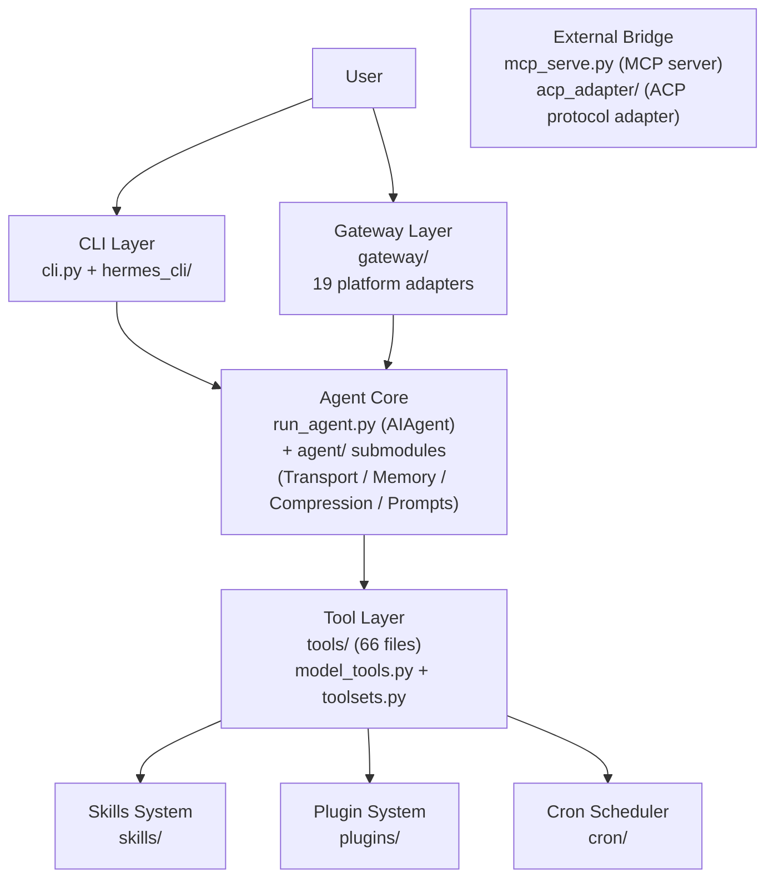

# 00 - Hermes Agent: An AI Agent That Tries to Evolve Itself

## What Problem Is It Solving?

If you want an AI agent that's more than a one-shot tool — one that learns from experience, remembers who you are across sessions, and can work autonomously while you're away — how would you design it?

Nous Research's answer is Hermes Agent. It's an MIT-licensed AI agent framework (currently v0.11.0, `pyproject.toml:7`) whose ambition is captured in a single line:

> "The self-improving AI agent — creates skills from experience, improves them during use, and runs anywhere."
>
> — `pyproject.toml:8`

Three key ideas: **self-improvement**, **skill learning**, and **run anywhere**. These are still abstract. Before diving into the details, let's establish a high-level picture.

## The Module Landscape

Hermes's codebase divides into six major areas. The diagram below shows how they relate — arrows indicate dependency or invocation:

**Figure: Dependency relationships among Hermes's six modules (CLI/Gateway → Agent Core → Tool Layer)**

A one-sentence description of each module:

- **CLI Layer** (`cli.py` + `hermes_cli/`) — Everything you see in the terminal: an interactive REPL, subcommands (chat/gateway/setup/cron/model), and a TUI. It's the bridge between the user and the Agent.
- **Gateway Layer** (`gateway/`) — A unified message ingress that lets the same Agent serve Telegram, Discord, Slack, WhatsApp, and roughly 20 other platforms simultaneously. One process, all platforms.
- **Agent Core** (`run_agent.py` + `agent/`) — The heart of the system. The `AIAgent` class implements the core loop: receive message → call model → parse tool calls → execute tools → repeat until done. The `agent/` subdirectory handles model adaptation, context compression, prompt construction, and memory management.
- **Tool Layer** (`tools/` + `model_tools.py`) — The Agent's hands. 66 tool files cover terminal execution, file operations, web search, browser automation, voice, image generation, and more. `model_tools.py` handles tool registration and dispatch.
- **Skills and Plugins** (`skills/` + `plugins/`) — The Agent's long-term memory and learning capacity. Skills are reusable task templates (83 built-in + 58 optional); plugins extend memory, context engine, and other capabilities.
- **External Bridge** (`mcp_serve.py` + `acp_adapter/`) — Exposes Hermes's capabilities to other systems (Claude Code, Cursor, etc.) via standard protocols.

The module dependencies are **strictly one-directional**: CLI/Gateway → Agent Core → Tool Layer. There are no reverse dependencies. Where reverse calls are needed (e.g., a sub-agent tool that needs to create a new `AIAgent`), deferred imports (inside function bodies rather than at the top of the file) break the cycle.

## Five Core Problems

With the big picture in place, let's look at why Hermes is organized this way. Several core problems shaped the entire architecture.

### Problem 1: Model Lock-in

Most AI agent frameworks are tied to a single model provider — OpenAI users are stuck with GPT, Anthropic users with Claude. But the model market moves fast: today's best model may be surpassed tomorrow, or its price may double overnight.

Hermes's choice is **zero model lock-in**. Its configuration file (`cli-config.yaml.example:13-43`) lists over 20 providers: OpenRouter (200+ models), Anthropic, OpenAI, Nous Portal, Gemini, NVIDIA NIM, Xiaomi MiMo, Kimi, MiniMax — even locally-running Ollama, LM Studio, vLLM, and llama.cpp. Users can switch at any time with `hermes model` without touching code.

This choice has an architectural consequence: Hermes must handle each provider's API differences in code — Anthropic's message format differs from OpenAI's, and Bedrock has its own protocol. That's why the Transport abstraction layer exists.

### Problem 2: Platform Fragmentation

You might chat with your AI in a Mac terminal, but your users might be on Telegram. Your team might use Slack. Your customers might use WhatsApp. Writing a separate agent implementation for each platform makes maintenance costs grow linearly.

Hermes's approach is a **unified gateway** (`gateway/`): one process connects to all platforms simultaneously, sharing the same agent logic. A message from Telegram and a line typed in the CLI both end up at the same `AIAgent.run_conversation()` method. The gateway currently supports Telegram, Discord, Slack, WhatsApp, Signal, Feishu, DingTalk, WeChat Work, Matrix, and roughly 20 other platforms (`gateway/platforms/`).

### Problem 3: The Disposability of Conversations

Traditional chatbot sessions are one-shot — close the window and all context is gone. The next time you come back, it doesn't know what you asked it to do last week or what your preferred working style is.

Hermes tries to break this constraint with three mechanisms:
- **Persistent memory**: the agent proactively writes important information to `MEMORY.md` and `USER.md`, which are loaded automatically at the start of the next session (`agent/memory_manager.py`)
- **Session search**: conversation history is stored in SQLite with an FTS5 full-text index, so the agent can search its own past (`hermes_state.py`)
- **Skill learning**: after completing a complex task, the agent abstracts the solution into a "skill" and saves it; next time a similar problem arises, it calls the skill directly (`tools/skills_tool.py`)

This isn't simply "storing chat logs." It more closely resembles a layered working memory + long-term memory architecture, designed to let the agent become more attuned to you over time.

### Problem 4: Conversations That Keep Growing

AI models have context window limits — even a 1-million-token window will eventually fill up for a long-running agent. And longer contexts mean higher API costs and worse latency.

Hermes's solution is a **context compressor** (`agent/context_compressor.py`). When conversation history occupies 75% of the context window (`agent/context_engine.py:59`), a cheaper auxiliary model summarizes the middle portion, preserving only the first few messages (for system prompt stability) and the last few (for recent context). This isn't simple truncation — it's using an LLM to compress the middle of a conversation into a summary, like condensing a book into study notes: the details are gone but the key information remains.

### Problem 5: Agents Shouldn't Live Only on Your Laptop

Many agent frameworks assume local terminal usage. But what if you want the agent to run 24/7 in the cloud, execute scheduled tasks, and monitor something while you sleep?

Hermes provides six "terminal backends" (`cli-config.yaml.example:148-237`): local execution, Docker containers, SSH remote machines, Daytona cloud sandboxes, Singularity HPC containers, and Modal Serverless. The last two are particularly interesting — Daytona and Modal support "hibernation": the execution environment pauses automatically when idle and wakes up when a task arrives, at near-zero cost.

Combined with the built-in cron scheduler (`cron/`), you can set up scheduled tasks in natural language: "every morning at 8 AM, summarize yesterday's GitHub issues and post them to the Telegram group" — the agent wakes at the scheduled time, executes, delivers the result, and goes back to sleep.

## Technology Choices

Given these problems, Hermes's technology decisions aren't arbitrary:

**Python-first** (`pyproject.toml:10`, `requires-python = ">=3.11"`) — the AI agent ecosystem lives almost entirely in Python; all major model SDKs (OpenAI, Anthropic, boto3) are Python-first.

**A restrained set of core dependencies** (`pyproject.toml:13-37`). The base installation requires 18 packages, primarily model SDKs (`openai`, `anthropic`) and UI frameworks (`prompt_toolkit`, `rich`), plus HTTP clients, data validation, and templating libraries. All platform integrations, voice, MCP, and RL training are available as 26 optional extras (`pyproject.toml:39-126`) — this is why it can run on a $5 VPS or a GPU cluster.

**Node.js for the frontend** (`package.json`) — the Web Dashboard and TUI are Node.js-built frontend applications. Browser automation also goes through Node.js (Playwright + CamoFox anti-detection browser).

**Multi-stage Docker build** (`Dockerfile:1-67`, 3 FROM stages) — uses `uv` (a Rust-based Python package manager) instead of pip for faster installs, and `tini` for process management to prevent zombie process accumulation.

## Project Structure: Following the Problems to the Code

If you map Hermes's directory structure to the five problems above, the organizational logic becomes clear:

**"How does it talk to models?"** → `run_agent.py` (AIAgent class, tool-calling loop) + `agent/` (Transport adapters, prompt construction, context compression, memory management)

**"How does it talk to users?"** → `cli.py` (terminal TUI) + `gateway/` (multi-platform gateway) + `hermes_cli/` (CLI subcommands)

**"How does it get things done?"** → `tools/` (66 tool files covering terminal execution, file operations, web search, browser automation, and more) + `model_tools.py` (tool registration and dispatch)

**"How does it learn?"** → `skills/` (built-in skill library) + `plugins/` (memory and context plugins)

**"How does it run independently?"** → `cron/` (cron scheduler) + `docker/` (containerization)

**"How is it called by other systems?"** → `mcp_serve.py` (MCP server, 10 tools) + `acp_adapter/` (ACP protocol adapter)

**"How is it used for research?"** → `batch_runner.py` (batch trajectory generation) + `trajectory_compressor.py` (trajectory compression) + `environments/` (RL benchmark environments)

There's also some glue code: `hermes_constants.py` defines shared constants (e.g., HERMES_HOME defaults to `~/.hermes`, `hermes_constants.py:17-18`); `hermes_state.py` manages global state and SQLite session storage; `toolsets.py` organizes tools into "toolsets" that can be enabled or disabled per scenario.

## Three Entry Points, One Agent

Hermes has three main entry points, but they all ultimately call the same core — `AIAgent.run_conversation()`:

**The `hermes` command** (`pyproject.toml:129` → `hermes_cli.main:main`) is the day-to-day entry point. It's a fully-featured CLI with subcommands including chat, gateway, setup, cron, and model. Running `hermes` without arguments starts an interactive conversation.

**The `hermes-agent` command** (`pyproject.toml:130` → `run_agent:main`) is the entry point for developers and scripts. It exposes the `AIAgent` class directly, accepting arguments via Python `fire` from the command line, or embeddable via `from run_agent import AIAgent`.

**`mcp_serve.py`** exposes Hermes's messaging gateway capabilities as MCP tools (`mcp_serve.py:8-13`), allowing MCP clients like Claude Code and Cursor to read and write platform message sessions and manage approval permissions.

## Configuration Philosophy

Hermes follows a clear configuration priority chain (`cli.py:1985`):

**CLI flag > environment variable > YAML config file > built-in defaults**

This means you can configure your daily setup in `cli-config.yaml`, override sensitive information (API keys) with a `.env` file, and make one-off adjustments via command-line arguments — three layers that don't interfere with each other.

The configuration file itself (`cli-config.yaml.example`, approximately 1,000 lines) covers an enormous range: model selection, terminal backend, security policies, context compression parameters, memory behavior, display themes, and MCP server connections — almost every behavior is tunable. But the core design principle is **zero-config usability** — defaults are carefully chosen so that having an API key is all you need to get started.

## Project Statistics

Finally, some numbers to calibrate the scale:

### Codebase Size

| Metric | Count |
|--------|-------|
| Python files | 1,231 |
| Total Python lines | ~578,000 |
| JS/TS files | 356 |
| Test files | 826 (~285,000 lines) |

### Module Size (Python lines, ordered by weight)

| Module | Lines | Notes |
|--------|-------|-------|
| `gateway/` | 64,700 | Largest module — 28 platform adapters |
| `hermes_cli/` | 61,900 | CLI subcommands and TUI |
| `tools/` | 54,500 | 66 tool implementations |
| `agent/` | 29,200 | Agent core support modules |
| `plugins/` | 18,600 | Optional plugins |
| `run_agent.py` | 13,300 | Single file — AIAgent class, the system's core loop |
| `cli.py` | 11,400 | Single file — interactive terminal REPL |
| `tui_gateway/` | 5,750 | TUI gateway bridge |
| `cron/` | 2,275 | Cron scheduler |
| `acp_adapter/` | 2,350 | ACP protocol adapter |

Worth noting: `run_agent.py` and `cli.py` are two God Objects — together nearly 25,000 lines, with most of the core logic concentrated in them.

### Ecosystem Scale

| Metric | Count |
|--------|-------|
| Supported model providers | 21+ |
| Supported messaging platforms | ~20 independent platforms (`gateway/platforms/` has 35 .py files including helpers) |
| Built-in tools | 66 files |
| Built-in skills | 83 |
| Optional skill packs | 58 |
| Core PyPI dependencies | 18 |
| Optional extras | 26 |
| Config file | ~1,000 lines of tunable parameters |

## Was This Code Written by Humans?

After looking at those numbers, a natural question surfaces: of the 578,000 lines of Python and 6,384 commits over 9 months — how much was written by humans, and how much by AI?

### The Evidence

**Abnormal commit velocity.** The project started in July 2025, but the real explosion happened in March 2026 (2,501 commits) and April 2026 (3,311 commits). The primary contributor, Teknium, averaged 53 commits per day during March–April 2026, with a peak of 199 commits in a single day (2026-03-14). That pace is nearly impossible for purely human coding — even a full-time developer producing 5–10 meaningful commits per day is considered prolific.

**Round-the-clock commit distribution.** Teknium's commits are distributed evenly across all 24 hours, with activity between 2–5 AM actually higher than during normal working hours. This pattern fits "AI tooling generating continuously, humans committing intermittently" far better than traditional human development rhythms.

**Explicit AI co-authorship markers.** The git history includes 131 commits with Claude Co-Authored-By annotations (including Claude Opus 4.6, Opus 4.7, and Sonnet 4.6), plus 9 commits marking `Hermes Agent <hermes@nousresearch.com>` as co-author — meaning Hermes itself participated in its own development. But these explicit markers represent only ~2% of total commits, far below the actual AI involvement.

**Code characteristics.** `run_agent.py` (13,293 lines) and `cli.py` (11,395 lines) are two God Objects with a comment density of roughly 14%, featuring detailed inline annotations throughout. The pattern of "explanatory comments on every branch" is characteristic of AI-assisted coding. Human programmers typically add comments only at complex logic; AI tools tend to annotate every code block.

**A built-in AI coding guide.** The `AGENTS.md` file is a development guide written specifically for AI coding assistants, detailing project structure, testing practices, and code conventions. This shows that AI coding tools are a formal part of the development workflow, not an occasional aid.

**Teknium's own words.** Teknium wrote in a [tweet](https://x.com/Teknium/status/2026760653743206502) that Hermes Agent "started as a way for us to have agentic primitives for datagen and RL," and in subsequent posts compared it to Claude Code and discussed the advantages of open-source agents. Given that Nous Research is itself an AI research company, its founder making heavy use of AI coding tools to build an AI agent product is entirely logical.

### Conclusion

**This project is a typical product of deep AI-assisted development.** Based on the evidence above, a reasonable assessment is:

- **Architecture design and core decisions are human-made.** The module decomposition, API abstraction design, and product direction — work requiring holistic judgment — are the output of Teknium and the core team.
- **A large portion of implementation code was AI-generated and human-reviewed.** 53 commits per day on average, around-the-clock activity, and highly uniform annotation style all point to heavy use of Claude Code or similar tools for code generation, with human oversight for direction and quality.
- **AI contribution is estimated at 60–80% of code lines.** The explicit 2% marker is just the tip of the iceberg. Given the project's pace, code style, and toolchain evidence, the actual proportion of AI-generated code is far higher.
- **This embodies the project's own philosophy.** A "self-improving AI agent" project built using AI — this isn't cutting corners, it's dogfooding. Using AI coding tools to build an AI agent system is exactly practicing what it preaches.

Sources:
- [Teknium's announcement tweet](https://x.com/Teknium/status/2026760653743206502)
- [Teknium on open-source agents](https://x.com/Teknium/status/2048611867673919508)
- [The State of Hermes Agent — April 2026](https://hermesatlas.com/reports/state-of-hermes-april-2026)
- [hermes-agent GitHub](https://github.com/nousresearch/hermes-agent)

## Appendix: Complete File Index

Every file and directory at the top level of `hermes-agent/`:

### Core Code

| Path | Type | Lines | Description |
|------|------|-------|-------------|
| `run_agent.py` | file | 13,293 | AIAgent class — core conversation loop (→ [02](02-agent-core.md)) |
| `cli.py` | file | 11,395 | Interactive terminal TUI (→ [07](07-tui-and-web.md)) |
| `model_tools.py` | file | 676 | Tool registration and dispatch entry point (→ [03](03-tool-system.md)) |
| `toolsets.py` | file | 784 | Toolset definitions and platform mappings (→ [03](03-tool-system.md)) |
| `toolset_distributions.py` | file | 364 | Toolset probability distributions for data generation (→ [11](11-batch-runner-and-rl.md)) |
| `mcp_serve.py` | file | 867 | MCP server exposing messaging gateway capabilities (→ [08](08-cron-scheduler.md)) |
| `hermes_constants.py` | file | 295 | Shared constants (HERMES_HOME, etc.) |
| `hermes_state.py` | file | 2,094 | SQLite session storage (→ [12](12-engineering-practices.md)) |
| `hermes_logging.py` | file | 389 | Three-way log dispatch (→ [12](12-engineering-practices.md)) |
| `hermes_time.py` | file | 104 | Time utility functions |
| `utils.py` | file | 271 | General utilities including atomic writes (→ [12](12-engineering-practices.md)) |

### Core Directories

| Path | Files | Lines | Description |
|------|-------|-------|-------------|
| `agent/` | 52 | 29,201 | Agent support modules: Transport, context compression, memory, prompts (→ [02](02-agent-core.md)) |
| `tools/` | 82 | 54,531 | Tool implementations + security approval (→ [03](03-tool-system.md)) |
| `gateway/` | 53 | 64,729 | Message gateway + platform adapters (→ [06](06-gateway.md)) |
| `hermes_cli/` | 58 | 61,896 | CLI subcommands + web backend + plugin manager (→ [07](07-tui-and-web.md)) |
| `plugins/` | 41 | 18,603 | Built-in plugins (memory/image generation/observability/etc.) (→ [05](05-plugin-system.md)) |
| `skills/` | 27 | 7,391 | 83 built-in skills (SKILL.md + Python tool scripts) (→ [04](04-skill-system.md)) |
| `optional-skills/` | 18 | 8,574 | 58 optional skills (not installed by default) (→ [04](04-skill-system.md)) |
| `cron/` | 3 | 2,275 | Cron scheduling system (→ [08](08-cron-scheduler.md)) |
| `acp_adapter/` | 9 | 2,354 | ACP editor protocol adapter (→ [08](08-cron-scheduler.md)) |
| `tui_gateway/` | 8 | 5,750 | JSON-RPC bridge between Ink TUI and Python Agent (→ [07](07-tui-and-web.md)) |
| `environments/` | 30 | 7,306 | RL training environments (→ [11](11-batch-runner-and-rl.md)) |
| `tests/` | 826 | 285,239 | Test suite (→ [12](12-engineering-practices.md)) |

### Frontend and UI

| Path | Description |
|------|-------------|
| `ui-tui/` | React/Ink terminal UI (Node.js, → [07](07-tui-and-web.md)) |
| `web/` | Web Dashboard frontend SPA (React/Vite, → [07](07-tui-and-web.md)) |

### Research and Data Generation

| Path | Lines | Description |
|------|-------|-------------|
| `batch_runner.py` | 1,287 | Batch trajectory generation (→ [11](11-batch-runner-and-rl.md)) |
| `trajectory_compressor.py` | 1,508 | Trajectory compression (→ [11](11-batch-runner-and-rl.md)) |
| `rl_cli.py` | 446 | RL training entry point (→ [11](11-batch-runner-and-rl.md)) |
| `tinker-atropos/` | — | Atropos RL framework submodule |
| `datagen-config-examples/` | — | Data generation config templates |

### Deployment and Packaging

| Path | Description |
|------|-------------|
| `Dockerfile` | Three-stage Docker build (→ [10](10-environments-and-deployment.md)) |
| `docker-compose.yml` | Dual-service: gateway + dashboard |
| `setup-hermes.sh` | One-command install script (→ [10](10-environments-and-deployment.md)) |
| `flake.nix` + `nix/` | Nix flake packaging |
| `packaging/` | Homebrew formula |
| `pyproject.toml` | Python project metadata and dependencies |
| `package.json` | Node.js dependencies |

### Documentation and Metadata

| Path | Description |
|------|-------------|
| `README.md` | Project README |
| `AGENTS.md` | Development guide for AI coding assistants |
| `CONTRIBUTING.md` | Contribution guide (→ [12](12-engineering-practices.md)) |
| `SECURITY.md` | Security policy (→ [12](12-engineering-practices.md)) |
| `RELEASE_v*.md` | Per-version release notes |
| `acp_registry/` | ACP agent registration metadata |
| `docker/` | Docker entrypoint scripts |
| `scripts/` | Utility scripts |
| `plans/` | Planning documents |
| `website/` | Documentation website source |

## What's Next

This overview answers "what is Hermes, what modules does it have, why is it designed this way, who wrote it, and where is the code." The architecture analysis that follows goes deeper into "how it actually works" — starting from a single user message entering the system and tracing every layer of processing, to understand the tradeoffs behind each design decision.

---

*This document is based on analysis of hermes-agent v0.11.0 source code. All code references have been independently verified.*
