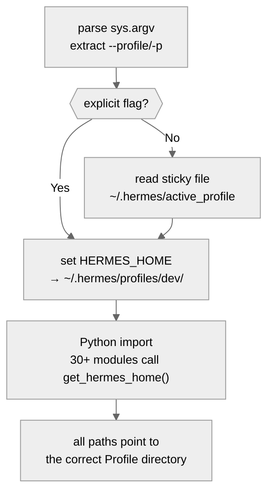
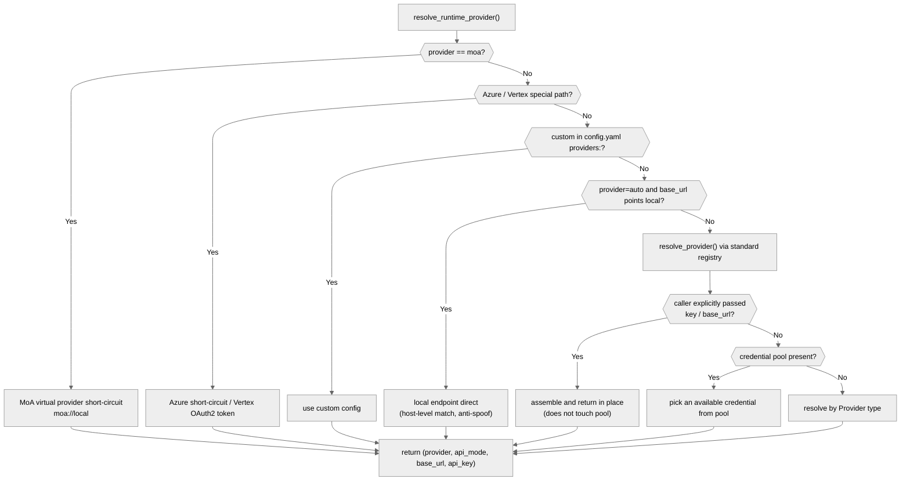
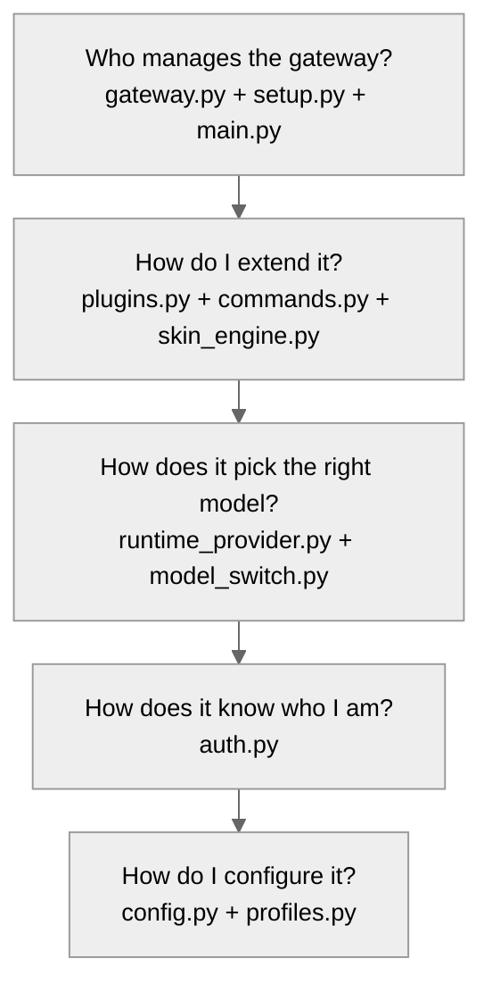
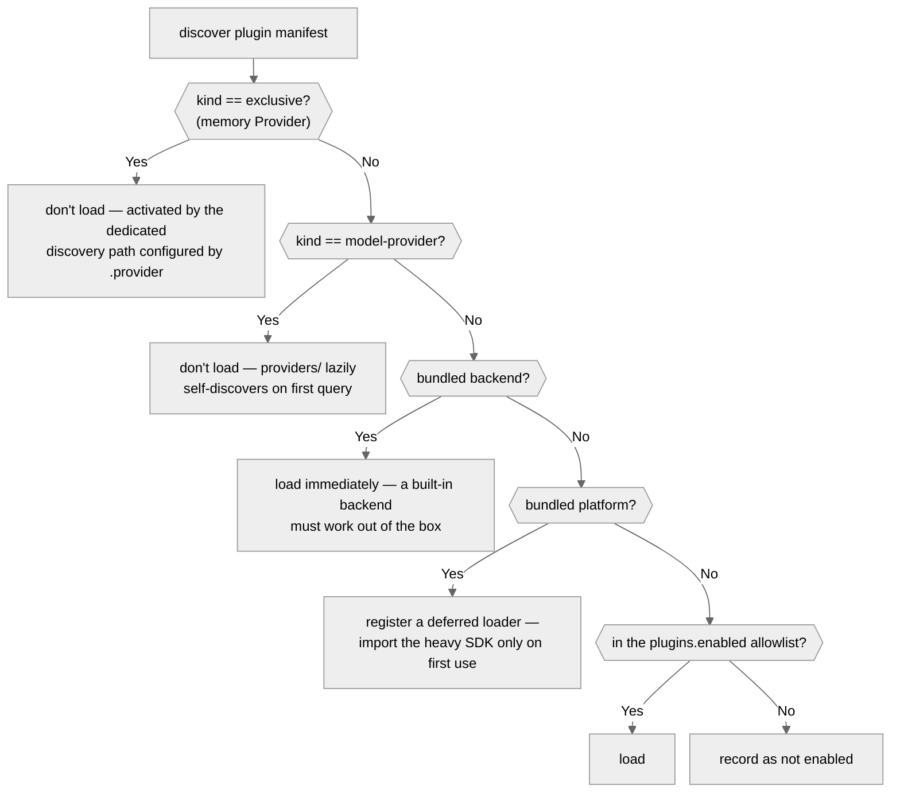

# 01 - Infrastructure Layer: The Control Plane Held Up by 203 Files

[中文](../zh/01-基础设施层.md) | English

> **Scope**: the `hermes_cli/` directory (203 .py files, ~163,000 lines, including the proxy/ and subcommands/ submodules) — CLI subcommands, the configuration system, the authentication system, plugin management, Profile isolation, and gateway service management.
> **Key classes**: `main()` (`main.py:12703`), `DEFAULT_CONFIG` (`config.py:906`), `PROVIDER_REGISTRY` (`auth.py:176`), `PluginManager` (`plugins.py:1246`).

> **This chapter is based on hermes-agent v0.18.2 (tag [`v2026.7.7.2`](https://github.com/NousResearch/hermes-agent/releases/tag/v2026.7.7.2), commit `9de9c25f6`, 2026-07-07)**

---

## Why Analyze hermes_cli Separately?

The previous chapter traced the journey of a message — from user input to the Agent's reply. But before a message reaches the Agent core, an entire infrastructure must already be in place: where does your API key come from? How is the config file loaded? How are plugins discovered? How are Profiles isolated? Who manages the gateway process?

The answers to all these questions live in `hermes_cli/`. It is hermes-agent's **control plane** — it doesn't directly participate in the conversation, but it determines the environment in which the conversation happens. It has about 163,000 lines of code (including the proxy/ and subcommands/ submodules and the Web Dashboard backend), making it the largest module in the whole project — larger than the Agent core (93,837 lines) and the gateway layer (77,883 lines).

---

## Usage Guide

### Basic Usage

The `hermes` command is the main entry point for daily use. With no arguments it enters an interactive conversation:

```bash
hermes                    # interactive conversation
hermes chat -z "summarize this directory" # non-interactive single task (oneshot mode)
hermes setup              # run the config wizard
hermes model              # switch model and Provider
hermes tools              # manage toolset enable/disable
hermes gateway start      # start the message gateway service
hermes profile create dev # create an isolated Profile named dev
hermes doctor             # diagnose environment problems
hermes update             # update to the latest version
```

### Configuration

The hermes_cli configuration system is layered, in order from highest to lowest priority:

| Layer | Location | Purpose |
|-------|----------|---------|
| CLI flag | `--model`, `--provider`, etc. | temporary override for a single invocation |
| config.yaml | `~/.hermes/config.yaml` | everything non-secret (wins when set in both places) |
| environment variables / .env | `~/.hermes/.env` | secrets like API keys **must** go here |

There is also a layer that most users never encounter: **managed scope** (`hermes_cli/managed_scope.py`) — an IT admin places `config.yaml`/`.env` in the root-owned `/etc/hermes/`, whose values override user config leaf-key by leaf-key and cannot be changed by the user. This is the pin-down mechanism for enterprise centralized management (see "Architecture & Implementation" below).

`DEFAULT_CONFIG` (`config.py:906`) is the authoritative source of the configuration schema — a 2,327-line nested dictionary with 76 top-level keys. Here are the most commonly used:

```yaml
# the most commonly used config keys
model:
  default: "anthropic/claude-opus-4.6"
  provider: "openrouter"

agent:
  max_turns: 90          # Agent max iterations
  gateway_timeout: 1800  # gateway-mode timeout (seconds)

terminal:
  backend: "local"       # execution backend: local/docker/ssh/modal/daytona/singularity

approvals:
  mode: "manual"         # dangerous-command approval: manual/off, etc.
  timeout: 60            # approval wait timeout (seconds); timing out means deny

display:
  skin: "default"        # theme: one of 9 — default/ares/mono/slate, etc.
```

Config loading has a subtle caching mechanism: `load_config()` (`config.py:6655`) uses a file signature as the cache key — no explicit invalidation signal is needed; change the file and the cache expires automatically. This matters for long-running Gateway processes: a user can edit `config.yaml` at any time, and the next Agent call automatically reads the new config.

### @ References in Input

An input syntax that shows up in daily use but is easily mistaken for "magic": writing `@file:path`, `@folder:src/`, `@diff`, or `@staged` in a message causes it to be **expanded in place** into the corresponding file contents, directory tree, or git diff, injected into that one message (`agent/context_references.py`, 598 lines; expansion happens before sending and is trimmed to the context-length budget). It's a lightweight way to "feed context to the Agent" — no need to `cat` and then paste; just `@diff help me review`. Works in both the CLI and message platforms.

### Common Scenarios

**Scenario 1: From zero config to your first conversation.** `hermes setup` launches the config wizard (`SETUP_SECTIONS`, `setup.py:2603`) in six steps: choose Provider and model → configure TTS → choose terminal backend → configure message platforms → configure toolsets → set Agent parameters. Each step can be run independently (take `hermes setup model` as an example).

**Scenario 2: Multi-Profile isolation.** You might need different configurations for different projects — one using Claude for code review, one using DeepSeek for data analysis. `hermes profile create coder --clone` copies the current Profile's config, secrets, SOUL.md, and skills into the new Profile (`create_profile()`, `profiles.py:990`); `--clone-all` does a full copy (state like memory comes along too, but **session history is explicitly excluded** — `state.db`, `sessions/`, backups, and snapshots are all on the exclusion list, `profiles.py:118-126`: a new Profile is a new workspace, and inheriting the source Profile's session history is meaningless and can bloat to tens of GB). Afterward switch with `hermes -p coder`, or use the auto-generated wrapper script `coder` as a shortcut command.

**Scenario 3: Install the Gateway as a system service.** `hermes gateway install` (subcommand dispatch entry `gateway_command()`, `gateway.py:6332`) automatically generates a systemd unit file (Linux) or launchd plist (macOS) based on the OS, so the gateway starts with the system — the actual generation logic is in `systemd_install()` (`gateway.py:3071`) and `launchd_install()` (`gateway.py:4053`).

### Troubleshooting

| Problem | Where to look |
|---------|---------------|
| `hermes` starts very slowly | On Android/Termux there are three levels of fast-launch optimization (version query `main.py:241`, direct TUI launch `:12508`, fast CLI launch `:12434`); if none triggered, check the Python version |
| Config change had no effect | `load_config()` caches by file signature (mtime_ns/size of the user file + managed file + a snapshot of referenced env vars, `config.py:226-231`); confirm the file was actually saved. If saved but still ineffective, it may be the Gateway process's stale cache — restart the Gateway |
| config.yaml syntax error | `load_config()` falls back to `DEFAULT_CONFIG` (all user overrides discarded), emits a warning via `_warn_config_parse_failure()` (`config.py:96`), automatically backs up the corrupt file as `config.yaml.corrupt.<timestamp>.bak` (`_backup_corrupt_config()`, `config.py:42`), and rebuilds. Check `hermes logs` or stderr for the YAML parse error |
| auth.json corrupted / operation stuck | All reads/writes are serialized through `_auth_store_lock()` (`auth.py:1048`) — note this is a kernel-level advisory flock (released automatically when the holding process exits); a leftover `auth.json.lock` file **does not mean** the lock is still held, and deleting the file usually does nothing. A genuine stall means a process legitimately holds the lock: wait for the 15-second timeout (`AUTH_LOCK_TIMEOUT_SECONDS`, `auth.py:72`) to see `TimeoutError`, and use `fuser`/`lsof` to find the holder. If the JSON itself is corrupt, delete `~/.hermes/auth.json` and `hermes login` again |
| Plugin fails to load | Check the `plugins.enabled` allowlist; `hermes plugins list` shows which plugins were discovered. One plugin failing to load doesn't stop the others — errors are isolated |
| A plugin hook doesn't fire | Confirm the hook name is in `VALID_HOOKS` (`plugins.py:135`, 23 total); confirm the plugin's `plugin.yaml` declares the hook in `provides_hooks`; check `hermes plugins list` to confirm the plugin status is enabled |
| Config wrong after switching Profiles | `_apply_profile_override()` (`main.py:340`) must run before imports. If you launch some other way (calling a Python script directly, for example), `HERMES_HOME` may be unset — check whether the path returned by `get_hermes_home()` points to the expected Profile |
| Provider authentication failure | `hermes auth status` shows each Provider's auth status; an expired OAuth token needs `hermes login` again; check that the API key variable name in `~/.hermes/.env` matches the `api_key_env_vars` in `PROVIDER_REGISTRY`. For OAuth flow issues, set `HERMES_OAUTH_TRACE=1` (`auth.py:861`) — every OAuth event goes to the log as structured JSON |
| `hermes login` hangs then errors | The device-code flow is waiting for you to complete authorization in the browser: `_poll_for_token()` (`auth.py:4538`) keeps polling, automatically widening the interval on `slow_down`, and raises `TimeoutError("Timed out waiting for device authorization")` (`:4584`) once the validity period is exceeded — just login again and confirm promptly in the browser |
| Connected to an unexpected Provider | The `provider=auto` resolution is an 8-level precedence chain (see the "Authentication System" section); an exported API key preempts an OAuth login, and when it does, a warning in stderr/log explains which variable to unset to restore OAuth |
| Field lost after migrate_config | `migrate_config()` (`config.py:5395`) does incremental migration and doesn't delete existing fields. If a field is lost, a YAML syntax error may have caused the whole file to be skipped (see "config.yaml syntax error" above) |
| Gateway restart / abnormal status | `hermes gateway restart` uses a SIGUSR1 graceful drain (doesn't interrupt in-flight sessions); when `gateway status` is abnormal, watch for orphan-process reaping and PID-mismatch notices; after a config change the service definition may drift, so `hermes gateway install --force` reinstalls the unit (see the "Who Manages the Gateway" section) |
| Not sure where to start | Run `hermes doctor` first (`doctor.py`, 2,412 lines) — a dozen-plus categories of checks (version consistency, certificates, gateway service, managed scope, Provider health, etc.) with three-level output OK/WARN/FAIL (`check_ok/warn/fail`, `doctor.py:177-183`) |

> 📖 **Further Reading (Official Docs):**
> - [CLI Guide](https://hermes-agent.nousresearch.com/docs/user-guide/cli)
> - [Configuration Reference](https://hermes-agent.nousresearch.com/docs/user-guide/configuration)
> - [Profile Management](https://hermes-agent.nousresearch.com/docs/user-guide/profiles)
> - [Plugin System](https://hermes-agent.nousresearch.com/docs/user-guide/features/plugins)

---

## Architecture & Implementation

The 203 files of hermes_cli answer five questions that a user encounters at different moments. Each question corresponds to a group of modules; understand the question and you understand why the module exists.

### How Do I Configure It? — The Configuration System

Once you've installed hermes-agent, the first thing you do is configure it. But hermes-agent has nearly 500 tunable config keys (`DEFAULT_CONFIG` leaf-key count) — from model selection and terminal backend to security policy and display theme, nearly every behavior is tunable. If you put all of these in environment variables, your shell startup command would become a monster of an `export` statement.

hermes-agent's solution is **config.py** (8,349 lines). `DEFAULT_CONFIG` (`config.py:906`) is a 2,327-line nested dictionary defining all valid config keys and default values (`_config_version` is currently 33 — incremented once per schema change). A user's `~/.hermes/config.yaml` only needs to override the fields they want to change, and at load time it is deep-merged with `DEFAULT_CONFIG` (`_deep_merge()`, `config.py:6165`), with everything else taking defaults automatically. `${VAR}` references in the config are expanded at load time (`_expand_env_vars()`, `config.py:6208`), so you can write `api_key: "${OPENROUTER_API_KEY}"` to have the config file reference an environment variable without exposing the secret.

A subtle detail: the cache key of `load_config()` (`config.py:6655`) is not just the file's `(mtime_ns, size)` — the signature tuple is `(user file mtime_ns, user file size, managed file mtime_ns, managed file size, snapshot of referenced env vars)` (`config.py:226-231`). Three kinds of change auto-invalidate the cache: the user edited config.yaml, the admin changed the managed config under /etc/hermes, or an environment variable referenced by `${VAR}` changed value (the in-process key-rotation scenario). What this saves is about 13 ms of YAML parsing + merging + expansion per load. The hot path has an even more aggressive layer: `load_config_readonly()` (`config.py:6672`) skips the defensive deepcopy — a cache-hit `load_config()` is about 265 µs per call, half of which goes to the deepcopy, while the Agent loop reads config 20-50 times per conversation (timeouts, thresholds, feature flags), so read-only callers take this fast path. All read/write paths are serialized by one RLock (`config.py:243`) — libyaml's C extension isn't thread-safe for concurrent `safe_load()` on the same file.

**Managed scope** (`hermes_cli/managed_scope.py`, 214 lines) is an enterprise-control layer added in v0.17: the root-owned, user-unwritable `/etc/hermes/` directory provides `config.yaml` and `.env`, whose values override the user's `~/.hermes/` same-named config **leaf-key by leaf-key**. The module comment deliberately distinguishes it from `HERMES_MANAGED` (a package-manager write lock that blocks all config changes): the write lock is coarse-grained "nothing may change," while managed scope is fine-grained "these few keys are pinned, the rest is free." The two can coexist. In v1 the enforcement mechanism is filesystem permissions themselves.

Config also has a security gate: interfaces like the dashboard can write variables to `.env` on the user's behalf, but `_ENV_VAR_NAME_DENYLIST` (`config.py:181`) rejects about 30 dangerous variable names — `LD_PRELOAD`, `DYLD_INSERT_LIBRARIES`, `PYTHONPATH`, `PATH`, `GIT_SSH_COMMAND`, `HERMES_HOME`, and more. These variables can change the code the process loads or hijack path resolution, so writing them equals arbitrary code execution. The comment explicitly says the list is "enumerated by name, deliberately kept narrow" (`config.py:174`) — better to miss an uncommon variable than to do pattern matching that's prone to false positives.

What happens to the config file on a version upgrade? `migrate_config()` (`config.py:5395`) does incremental migration — a new version adds fields, and the migration function fills them in automatically, transparently to the user. If the YAML itself is corrupt and fails to parse, `_backup_corrupt_config()` (`config.py:42`) backs up the original as `config.yaml.corrupt.<timestamp>.bak` before rebuilding — a lost config can be recovered; silently swallowing it is the real disaster.

But if you need completely different configurations for different projects — one using Claude for code review, one using DeepSeek for data analysis — a single config.yaml isn't enough.

### How Do I Isolate Multiple Environments? — The Profile System

**profiles.py** (2,225 lines) implements multi-Profile isolation. Each Profile is a complete HERMES_HOME copy under `~/.hermes/profiles/<name>/`: its own `config.yaml`, `.env`, `sessions/`, `memories/`, `skills/`, `cron/`. Profiles are fully isolated — one Profile's memory doesn't leak into another.

Profile switching has a counterintuitive design: `main.py` parses the `--profile/-p` argument (`_apply_profile_override()`, `main.py:340`, called at module level at `:513`) and directly modifies `os.environ["HERMES_HOME"]` **before any module that reads HERMES_HOME is imported**. (Strictly speaking, the 40 parser modules under subcommands/ are imported even earlier, but they don't touch HERMES_HOME at module level, so it's harmless.)



**Figure: Profile switching must complete before imports — otherwise 30+ modules will use the wrong paths**

Why so early? Because `get_hermes_home()` (`hermes_constants.py:55`) is called by 30+ modules at import time — if the Profile switch happened after imports, those modules would already be using the default path, and the switch would be a no-op. The cost is having to manually parse `sys.argv` before argparse, but this is the only viable approach.

The sticky-file branch in the figure deserves a couple more words. Without an explicit `-p`, `_apply_profile_override()` reads `~/.hermes/active_profile` (`main.py:472-483`) — this is the persistence effect of `hermes profile use`: switch once, and afterward every bare `hermes` enters that Profile. This rule has one deliberate exception: supervised gateway child processes under S6 container orchestration (`HERMES_S6_SUPERVISED_CHILD=1`) **do not follow** the sticky file (`main.py:462-471`) — each supervised slot's Profile identity is fixed, and if the default gateway of a reserved slot also followed active_profile, a user switching Profiles in the dashboard would end up with "two gateways for the active Profile and none for the default Profile." Error handling also splits three ways (`main.py:486-505`): when a Profile doesn't exist, it first tries the sudo-scenario fallback (using `SUDO_USER` to reverse-look-up the real user's home), and only errors out on continued failure; an invalid Profile name exits directly; but **any other exception only prints a warning and continues with the default Profile** — the comment reads verbatim, "a bug in profiles.py must never block hermes from starting."

Profiles and the gateway have another easily-overlooked relationship: a gateway isn't necessarily "one process per Profile." `profiles_to_serve()` (`profiles.py:949`) is the single decision point for "which Profiles an inbound gateway serves" — by default it returns just the current active Profile (fully consistent with historical behavior); with multiplex enabled it returns default plus all valid named Profiles, and **a single gateway process serves multiple Profiles at once**, each conversation round executing under the corresponding HERMES_HOME scope.

Once config and Profile are in place, the next question finally makes sense: the Provider declared in this config — on what basis does it trust that you are you?

### How Does It Know Who I Am? — The Authentication System

**auth.py** (8,275 lines) manages exactly the identity problem. hermes-agent ships with 36 Provider presets (Chapter 00's `CANONICAL_PROVIDERS` catalog), each with a different authentication method — some use an API key, some use OAuth, some use AWS IAM. Writing a separate auth logic for each Provider would make the code explode.

`PROVIDER_REGISTRY` (`auth.py:176`) is the unified registry on the auth side — it statically defines 33 entries, using the `ProviderConfig` data class (`auth.py:159`, with fields including `id`, `name`, `auth_type`, `inference_base_url`, `api_key_env_vars`, etc.) to describe each Provider's identity information. Dozens of Providers are reduced to six authentication methods:

| Auth method | Applicable Providers | Mechanism |
|-------------|----------------------|-----------|
| `oauth_device_code` | Nous Portal | RFC 8628 device-code flow |
| `oauth_external` | OpenAI Codex, xAI Grok, Gemini CLI | local callback + PKCE |
| `oauth_minimax` | MiniMax | custom device-code variant |
| `api_key` | Anthropic, OpenAI, DeepSeek, NVIDIA, etc. | environment variable or auth.json |
| `external_process` | GitHub Copilot ACP | token obtained from a subprocess |
| `aws_sdk` | Bedrock | IAM credentials |

All auth state is persisted in `~/.hermes/auth.json`, made cross-process-safe via a file lock (`_auth_store_lock()`, `auth.py:1048`) — the Gateway and CLI can read and write simultaneously without corrupting the data.

An important design: although `PROVIDER_REGISTRY` is statically defined, it auto-expands at module load (`auth.py:447-470`) — it pulls the Providers registered by plugins under `plugins/model-providers/` from the providers discovery layer and adds the api_key-type entries among them into the registry (except OAuth-type and specially-handled ones — copilot, kimi, openrouter, etc. have their own token-refresh or aggregation logic, and the comment explicitly says adding them would actually break resolution). This means adding an API-key-type Provider only requires writing a plugin directory, with no changes to `auth.py`.

**When the user doesn't say who to use, who does it connect to?** This is the most confusing question in the auth system. `resolve_provider()` (`auth.py:1610`) follows an 8-level precedence chain when `provider=auto` (or unset) (the docstring `auth.py:1619-1628` lists it verbatim):

1. CLI explicitly passed api_key/base_url → openrouter
2. `config.yaml`'s `model.provider`
3. `OPENAI_API_KEY` / `OPENROUTER_API_KEY` environment variable → openrouter
4. OpenRouter credential pool — the scenario where the key exists only in the pool and no environment variable was exported (the window patched by issue #42130)
5. Scan, one by one, the dedicated environment variables of api_key-type Providers in the registry (GLM, Kimi, MiniMax...) — but **deliberately skip copilot and lmstudio** (`auth.py:1761`): GITHUB_TOKEN often exists for repo access and shouldn't hijack the inference choice; LM Studio is a local service, and the key existing doesn't mean the service is running
6. `auth.json`'s `active_provider` (OAuth login) — **the last fallback**
7. AWS Bedrock credential-chain probing
8. Error: no Provider available at all

The order of levels 5 and 6 hides a historical lesson (issue #29285): an exported API key now **takes priority over** a logged-in OAuth Provider — a key the user explicitly exported is a stronger signal of intent, and an expired OAuth login shouldn't quietly steal the request. And when such preemption does happen, a warning log explains "which environment variable stole your OAuth login, and what to unset to go back to OAuth" (`auth.py:1769-1776`) — silently switching Providers is a debugging nightmare, and this log is prepared for exactly that.

There's also a Profile-scenario detail: when a Profile's own `auth.json` lacks credentials for some Provider, it **read-only falls back** to the global root `~/.hermes/auth.json` (`_global_auth_file_path()`, `auth.py:901`). So `hermes auth status` in a newly-created Profile showing some Provider as logged-in isn't a bug — it's the root credentials being inherited; writes always land in the Profile's own file.

But authentication only answers "who are you." Every time the Agent calls the model, it also needs to know "where to send the request, and with what protocol."

### How Does It Pick the Right Model? — Provider Runtime Resolution

The user says "I want OpenRouter's Claude," but the Agent core needs a precise triple: where to send the request (`base_url`), with what identity (`api_key`), and using which API protocol (`api_mode` — e.g. the OpenAI-compatible `chat_completions` mode, or the native Anthropic `anthropic_messages` mode).

**runtime_provider.py** (2,058 lines) handles this translation. `resolve_runtime_provider()` (`runtime_provider.py:1509`) runs every time the Agent calls the model, following a carefully-designed precedence chain:



**Figure: The credential-resolution precedence chain of runtime_provider**

Resolution is attempted in the following priority order, stopping on the first hit:

1. **MoA virtual provider** (`runtime_provider.py:1528`) — when `provider=moa`, it directly returns the `moa://local` virtual triple; the real Mixture of Agents (MoA) aggregation happens inside the Agent loop (Chapter 02)
2. **Azure Anthropic short-circuit** (`runtime_provider.py:1543`) — when `provider=anthropic` and `base_url` contains `azure.com`, it directly returns `anthropic_messages` mode
3. **Azure Foundry** (`runtime_provider.py:1563`) — when the user configured `provider: azure-foundry`, it takes the Azure-specific resolution (supporting Entra ID keyless auth)
4. **Vertex AI** (`runtime_provider.py:1583`) — an OAuth2-token-type Provider: it mints a short-lived access token on each call and uses it as the api_key. The comment specifically emphasizes that the credential file path **must never** flow into the credential pool or the generic api_key resolver — that would send the file path out as a static key
5. **Custom Provider** (`_resolve_named_custom_runtime()`, `runtime_provider.py:1606`) — a non-standard endpoint defined by the user in the `providers:` section of `config.yaml` (take a private vLLM service as an example), using the user-configured base_url and api_key directly
6. **Local endpoint direct** (`runtime_provider.py:1620`) — when `provider: auto` but `base_url` points to a local service like Ollama/LM Studio, it goes straight to that endpoint, avoiding a cloud API key in an environment variable hijacking the request. Matching uses host-level comparison rather than substring — a spoofed URL (`api.anthropic.com.attacker.test`) won't fool it
7. **Standard registry** (`runtime_provider.py:1652`) — resolves a name via `auth.py`'s `resolve_provider()` (which itself has an 8-level precedence chain on auto, see the previous section), matching a known Provider
8. **Caller explicit override** (`_resolve_explicit_runtime()`, `runtime_provider.py:1354`, called at `:1658`) — if the caller passed `explicit_api_key`/`explicit_base_url` directly, it assembles and returns here in place, and **the credential pool is never touched at all**
9. **Credential Pool** (`runtime_provider.py:1668`) — the multi-key rotation pool. Note its activation threshold is asymmetric: non-openrouter Providers query their respective pools directly; the openrouter pool requires **three conditions to all hold** to activate — `requested_provider` is openrouter/auto, there's no custom endpoint (explicit/env-var/config base_url all count), and there's no runtime override (`:1682-1686`). The problem of "configured a pool but still using a single key" is most often stuck on these three (see the Credential Pool section in Chapter 02)
10. **Provider-type resolver** — based on the matched Provider type, calls the corresponding credential-resolution function (take Nous OAuth as an example: it goes the JWT invoke path; take an API Key Provider as an example: it reads from `.env` or `auth.json`)

Why not just read the config file to get the API key? Because reality is far more complex: OAuth tokens need refreshing, the Credential Pool needs to rotate rate-limited keys, Azure needs special handling for Entra ID auth, Vertex's credential is a file path rather than a key, and a custom Provider's base_url may come from an environment variable. This function concentrates all the complexity in one place, so the Agent core only needs to receive a clean triple.

**model_switch.py** (2,452 lines) handles model switching — when the user types `/model sonnet`, it needs to resolve the alias into a full `(provider, model_id)`. `resolve_alias()` (`model_switch.py:557`) looks in order: `DIRECT_ALIASES` (built-in aliases + user-defined aliases from `config.yaml`'s `model_aliases:`) → the built-in family aliases `MODEL_ALIASES` (e.g. `sonnet` mapping to a concrete version) → prefix matching against the Provider model catalog (`startswith`, not edit-distance-style fuzzy matching). Since v0.18 there is also an implicit path: a bare `/model <name>` that exactly matches an enabled MoA preset name switches to the MoA virtual provider (Chapter 02).

### How Do I Extend It? — Plugins, Commands, Themes

A framework that can't be extended gets forked. hermes_cli provides three formal extension mechanisms.

**Plugin system.** `PluginManager` (`plugins.py:1246`) discovers plugins from four sources: built-in (`<repo>/plugins/`, 18 categories), user (`~/.hermes/plugins/`), project-level (`./.hermes/plugins/`, requires enabling `HERMES_ENABLE_PROJECT_PLUGINS`), and pip entry-points. Each plugin registers tools, hooks, and commands through the `PluginContext` object (`plugins.py:337`). The hook system supports 23 lifecycle events (`VALID_HOOKS`, `plugins.py:135`), covering key points like tool calls, user approval, the verification loop, and gateway message dispatch — a plugin can inject custom logic at any one of them. See Chapter 07.

**Slash commands.** `COMMAND_REGISTRY` (`commands.py:64`) is a single registry of about 80 command definitions. The same registry is shared by the CLI, Gateway, Telegram Bot, Discord Slash Commands, and Slack App Manifest — different platforms filter via `cli_only`/`gateway_only` markers.

**Theme engine.** `skin_engine.py` (926 lines) is purely data-driven — 9 built-in themes (default, ares, mono, slate, daylight, warm-lightmode, poseidon, sisyphus, charizard), and a user can drop a YAML file into `~/.hermes/skins/` to customize colors, spinner animations, and brand text. No code changes needed.

### Who Manages the Gateway? — The Service Lifecycle

**gateway.py** (7,064 lines) manages the complete lifecycle of the gateway process: start, stop, restart, install as a system service, diagnose. Its OS-aware design covers systemd (Linux, both user and system scopes), launchd (macOS), and manual process tracking (Windows/WSL/Docker), falling back to a `gateway.pid` file.

What swells the size to 7,000 lines isn't the install logic but **runtime state convergence** — what to do when the process's actual state doesn't match the expected:

- **Graceful restart vs. hard restart** (`_graceful_restart_via_sigusr1()`, `gateway.py:248`): `hermes gateway restart` first sends `SIGUSR1` — the gateway side interprets this as "drain the running Agent sessions (wait up to `agent.restart_drain_timeout` seconds) then exit," after which systemd's `Restart=always` / launchd's `KeepAlive` brings it back up automatically. This is the direct answer to "will a restart interrupt a running task": the graceful path won't; only if the drain times out without exiting does the caller fall back to a path like `systemctl restart`/SIGTERM that hard-kills in-flight sessions
- **Orphan-process reaping** (`_reap_unsupervised_gateway_orphans()`, `gateway.py:1458`): cleans up leftover gateway processes that escaped the service manager's supervision
- **PID-mismatch detection** (`_print_gateway_process_mismatch()`, `gateway.py:1339`): explicitly warns when the process pointed to by `gateway.pid` is not the gateway, rather than falsely reporting "running"
- **systemd start-limit recovery** (`_recover_pending_systemd_restart()`, `gateway.py:1147`): the unlock path after a crash loop triggers systemd's start limit
- **Unit-file drift detection** (`systemd_unit_is_current()`, `gateway.py:2828`): when the service definition that should currently be generated differs from the installed one, it prompts you to `hermes gateway install --force` to update

**setup.py** (3,405 lines) is the orchestrator of the interactive config wizard; `SETUP_SECTIONS` (`setup.py:2603`) defines six steps (choose Provider and model → configure TTS → choose terminal backend → configure message platforms → configure toolsets → set Agent parameters). It doesn't implement any config logic itself — each step delegates to a dedicated module.

**main.py** (14,624 lines) is the entry point for the `hermes` command. Since v0.17, two big blocks of its content were extracted by the god-file decomposition: the argparse parse tree is now assembled by the `hermes_cli/subcommands/` directory (40 files, of which 38 define `build_*_parser`, plus `__init__`/`_shared` infrastructure; cron was the pilot, followed by a full migration); about 19 per-Provider model-configuration flows (`_model_flow_*()` — OAuth login, API-key validation, model selection, and other interactive logic) were moved wholesale into `model_setup_flows.py` (2,983 lines). What remains in main.py are the `cmd_*` functions for each subcommand — mostly thin proxies that import the corresponding submodule and then delegate, so that each subcommand's startup loads only the modules it needs.

### Two Cross-Cutting Problems

The five questions above cover hermes_cli's main-line functionality. But two more problems span multiple modules and don't belong to any single problem domain.

#### How Do the Agent Thread and the TUI Thread Coordinate?

The Agent's tool system runs on a daemon thread, but some operations require user interaction — clarifying a question, approving a dangerous command, entering an API key. User interaction happens in prompt_toolkit's main-thread event loop. How do the two threads coordinate?

`callbacks.py` (242 lines) solves this with a classic pattern: three callback functions (`clarify_callback()`, `approval_callback()`, `prompt_for_secret()`) all set CLI state → have the TUI refresh the interface → block on a `queue.Queue` waiting for the user's response, polling once a second to check for timeout. Using a queue avoids lock contention over shared state.

The three callbacks' timeout policies are not the same — the difference in post-timeout behavior is precisely the reflection of each one's risk model:

| Callback | Default timeout | Source | On timeout |
|----------|-----------------|--------|------------|
| `clarify_callback` | 120s | `clarify.timeout` config (`callbacks.py:26`) | tells the model "the user didn't respond, decide for yourself and continue" (`:59-63`) |
| `prompt_for_secret` | 120s | hardcoded (`:102`) | treated as skipped, returns `skipped: true` (`:176-183`) |
| `approval_callback` | 60s | `approvals.timeout` config (`:204`) | **deny directly** — a dangerous command is better left unexecuted (`:241-242`) |

Clarification can let the model decide for itself, a secret can be configured next time, but the default answer for a dangerous-command approval must be "no." Additionally, `approval_callback` uses `cli._approval_lock` to serialize concurrent approval requests (`:193-202`) — when parallel delegation subtasks trigger approvals at the same time, each prompt queues up and appears in turn, without stepping on each other.

#### Why Is Kanban Inside hermes_cli?

`kanban.py` (2,845 lines) + `kanban_db.py` (8,723 lines) is a complete multi-Agent collaboration system — a kanban board, DAG task dependencies (`_would_cycle()`, `kanban_db.py:2843`), optimistic-lock claiming (`host:pid` identity + TTL, `_claimer_id()` returns `f"{host}:{pid}"`, `kanban_db.py:2363`), circuit breakers (`consecutive_failures` + `max_retries`). Each board is an independent SQLite file, so backup and archiving is just copying the .db file.

It lives in `hermes_cli/` rather than a standalone module because users operate the board directly via `hermes kanban` subcommands, without launching a full Agent. The detailed DAG task scheduling and multi-Agent collaboration mechanism is covered in Chapter 09.

### The Full Picture



**Figure: The dependency relationships among hermes_cli's five questions — upper questions depend on lower ones being solved first**

### Code Organization

```
hermes_cli/
├── main.py                  — entry + cmd_* dispatch (14,624 lines)
├── subcommands/             — argparse parsers (40 files, 3,154 lines, extracted in god-file Phase 2)
├── model_setup_flows.py     — 19 per-Provider config-wizard flows (2,983 lines, extracted with the above)
├── cli_commands_mixin.py    — HermesCLI slash-command handlers (2,736 lines, extracted in Phase 4)
├── cli_agent_setup_mixin.py — HermesCLI agent construction (689 lines, extracted in Phase 4)
├── config.py                — config load/save/migrate/validate (8,349 lines)
├── managed_scope.py         — enterprise managed-config layer /etc/hermes (214 lines)
├── auth.py                  — PROVIDER_REGISTRY + OAuth/API-key management (8,275 lines)
├── runtime_provider.py      — runtime Provider resolution (2,058 lines)
├── gateway.py               — gateway service lifecycle management (7,064 lines)
├── setup.py                 — interactive config wizard (3,405 lines)
├── plugins.py               — PluginManager + hook lifecycle (2,464 lines)
├── profiles.py              — Profile create/delete/switch/import/export (2,225 lines)
├── commands.py              — COMMAND_REGISTRY slash-command registry (2,147 lines)
├── tools_config.py          — toolset enable/disable management (4,505 lines)
├── model_switch.py          — /model command implementation + alias resolution (2,452 lines)
├── models.py                — model-catalog queries + CANONICAL_PROVIDERS (4,294 lines)
├── moa_cmd.py + moa_config.py — MoA preset config (411 lines, → Chapter 02)
├── kanban.py                — Kanban CLI subcommands (2,845 lines)
├── kanban_db.py             — Kanban SQLite persistence + DAG tasks (8,723 lines)
├── callbacks.py             — Agent↔TUI inter-thread callback bridge (242 lines)
├── console_engine.py        — console rendering engine (1,876 lines, extracted from a god-file)
├── container_boot.py        — container startup bootstrap (576 lines)
├── skin_engine.py           — theme engine (926 lines)
├── skills_config.py         — skill enable/disable (183 lines)
├── web_server.py            — Web Dashboard / desktop backend FastAPI (16,926 lines, → Chapters 10/14)
├── goals.py                 — Goals / Ralph Loop cross-turn goal persistence (1,765 lines)
├── doctor.py                — hermes doctor environment diagnostics (2,412 lines)
├── backup.py                — hermes backup/import data migration (1,376 lines)
├── checkpoints.py           — filesystem snapshot management (244 lines)
├── inventory.py             — Provider/platform config-status inventory (525 lines)
├── proxy/                   — Subscription Proxy local proxy (7 .py, 951 lines)
├── claw.py                  — OpenClaw migration (809 lines)
└── ...(another 100+ feature files)
```

### Design Decisions

#### Decision 1: The Growth and Decomposition of the Entry File

`main.py` was once the third-largest single file in the whole project (13,847 lines at the v0.14 baseline, behind only `gateway/run.py` and `cli.py`, containing all subcommand dispatch and 19 Provider config flows). The stance at the time was intentional: the config flows are highly similar (all variations of "choose model → validate credentials → write config"), and keeping them in one file allows a single grep to search them all.

The v0.17 god-file decomposition campaign (Chapter 00) changed this trade-off: 40 argparse parsers were split into `subcommands/`, 19 model-config flows into `model_setup_flows.py`, 9 closure handlers promoted to top-level functions. Interestingly, after the split main.py actually got longer (14,624 lines) — the freed space was filled back with new features. This shows the motivation for the split wasn't "make the file smaller" but **giving continuously-growing code a bounded home**: adding a new subcommand parser now has a clear destination (`subcommands/<name>.py`) rather than defaulting to piling into main.py.

#### Decision 2: Termux Three-Level Fast Launch

On Android/Termux, Python import overhead is significantly amplified by eMMC's slow random I/O. `main.py` designed three levels of acceleration for this:
1. **Ultra-fast version check** (`_try_termux_ultrafast_version()`, `main.py:241`): runs before the module import chain starts (the module-level call at `main.py:254`), so `hermes version` / `hermes --version` loads no heavy modules
2. **Fast TUI launch** (`_try_termux_fast_tui_launch()`, `main.py:12508`): `hermes --tui` runs only a lightweight top-level parser and transfers to `cmd_chat` (which then execs Node.js), skipping **the construction of the full subcommand parse tree** — that would import a whole pile of command modules like model/kanban/plugins
3. **Fast CLI launch** (`_try_termux_fast_cli_launch()`, `main.py:12434`): a bare `hermes` and `hermes -z` skip the full argparse and go straight into the conversation

#### Decision 3: The Five-Branch Triage of Plugin Loading

Plugins aren't all loaded in one go. The `PluginManager` discovery loop has a five-branch triage (`plugins.py:1395-1462`), each branch corresponding to a strategy for "when to actually import the module":



**Figure: The five-branch triage of plugin loading — each branch is a different import-timing strategy**

The most notable is the fourth branch: **built-in platform plugins changed from "auto-load" to "deferred registration"** (`plugins.py:1444` → `_register_deferred_platform()`). The reason is written in the comment (`plugins.py:1433-1443`): platform adapters import heavy SDKs at module level (lark_oapi, slack_bolt, discord.py...), and eagerly loading the ~20 platform plugins once added seconds of startup delay to **every** `hermes` invocation — including `hermes chat`, which never touches the gateway. Now the discovery stage only hangs a cheap loader in the platform registry, and gateway/cron/setup/send_message imports a platform only when it first genuinely needs it. The user-visible behavior is unchanged: every platform shipped with hermes still works out of the box, it's just that "you pay the load cost only on first use."

The rest of the plugins (standalone, user-installed backends, entry-point plugins) are controlled by the `plugins.enabled` allowlist — only those explicitly listed are loaded. This is a security decision: third-party plugins can register arbitrary tools and hooks, and unrestricted loading would pose a security risk. `migrate_config()` automatically adds existing user plugins to the allowlist on upgrade, so plugins don't suddenly disappear after an update.

### Extension Points

1. **Custom Provider**: just add an entry to the `providers:` section of `config.yaml`, no code changes needed
2. **Custom plugin**: place a `plugin.yaml` + Python module under `~/.hermes/plugins/<name>/`
3. **Custom theme**: `~/.hermes/skins/<name>.yaml`
4. **Custom slash command**: register via a plugin's `ctx.register_command()`
5. **Custom model alias**: the `model_aliases:` section of `config.yaml`

---

## Relationship to Other Chapters

| Related Chapter | Relationship |
|-----------------|--------------|
| 00 — Project Overview | hermes_cli is the concrete implementation of the "entry layer" in 00 |
| 02 — Agent Core | hermes_cli creates and configures the AIAgent instance and provides credentials via `runtime_provider`; MoA preset config is in moa_config.py |
| 03 — Tool System | `tools_config.py` manages toolset enable/disable |
| 05 — Gateway Layer | `gateway.py` manages the gateway process lifecycle; the platform deferred loader is registered into the gateway's platform registry |
| 07 — Plugin Framework | `plugins.py` is the host-side implementation of the plugin system |
| 09 — Kanban System | `kanban.py` + `kanban_db.py` are Kanban's CLI entry and persistence layer |
| 10 / 14 — Interfaces & Desktop App | `web_server.py` is the shared backend for the Web Dashboard and the desktop client |

---

*This document is based on source analysis of hermes-agent v0.18.2. All code references have been independently verified.*
