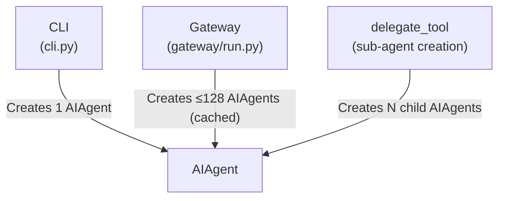
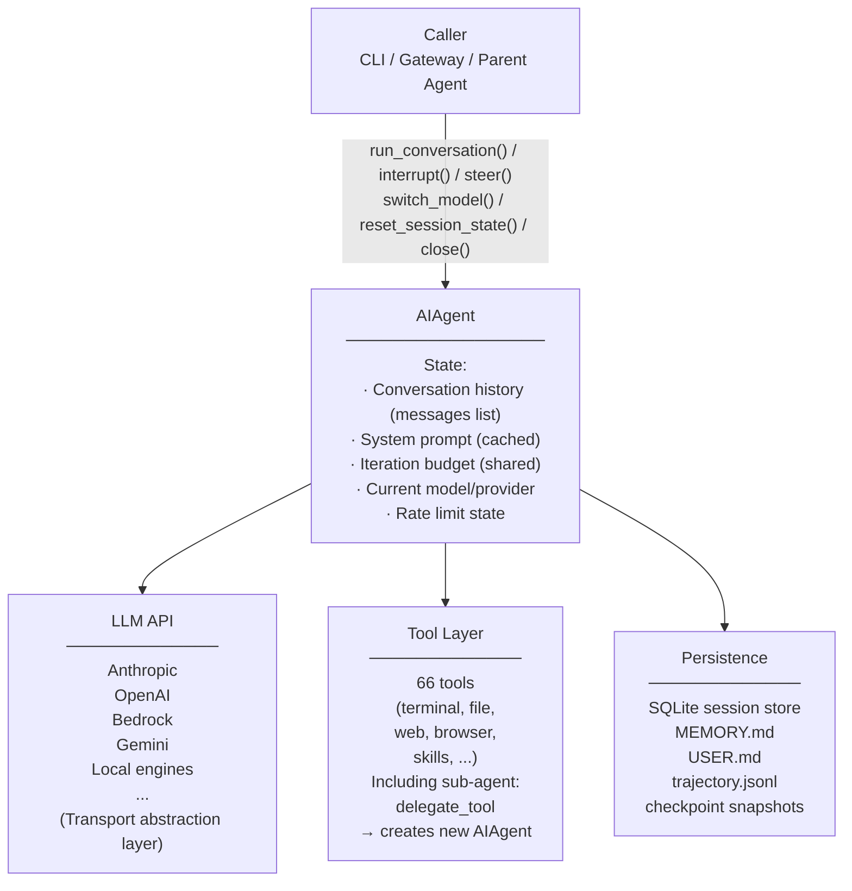
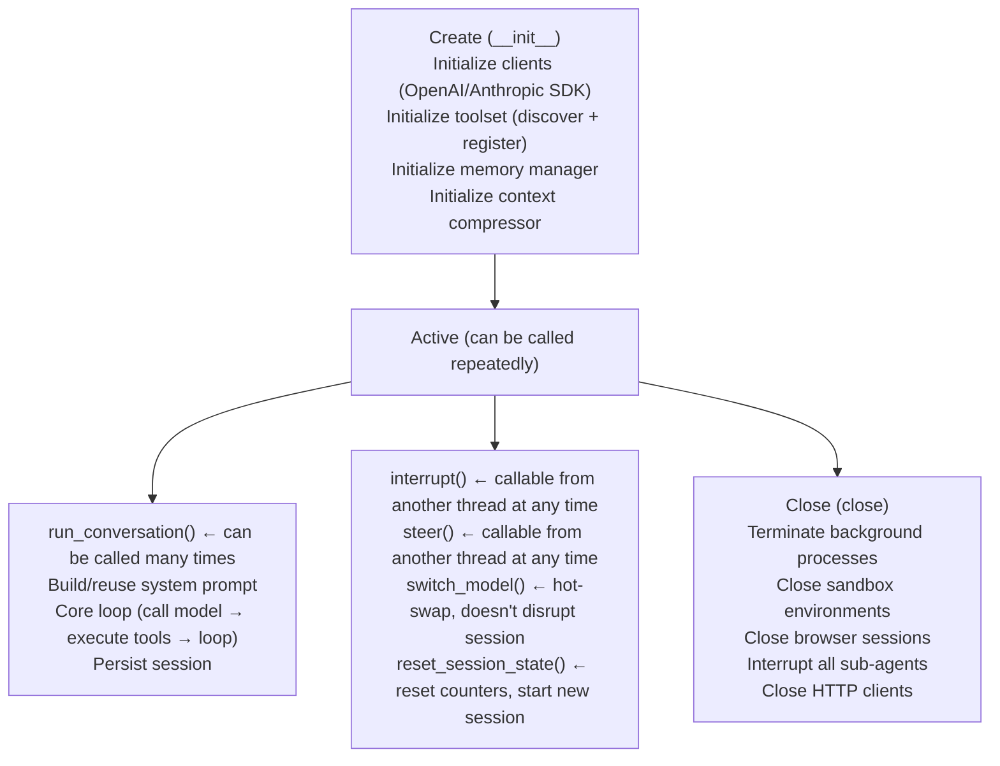
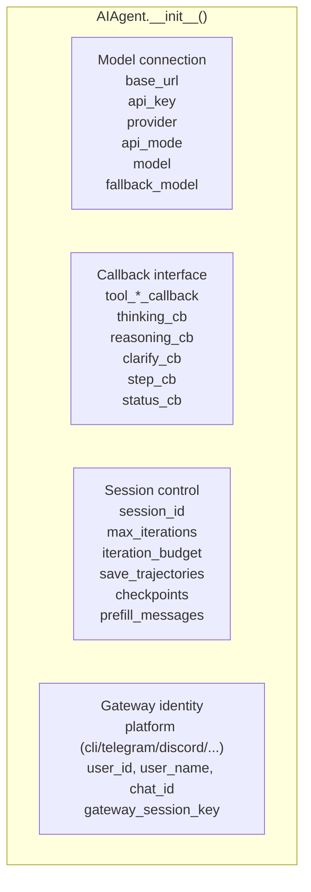
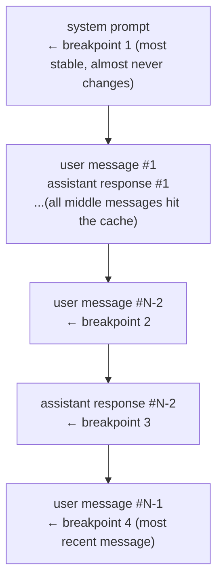
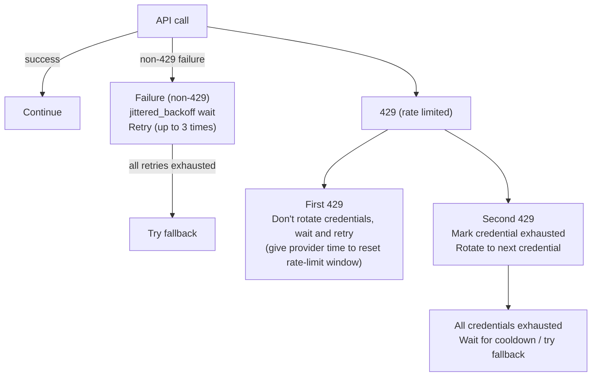
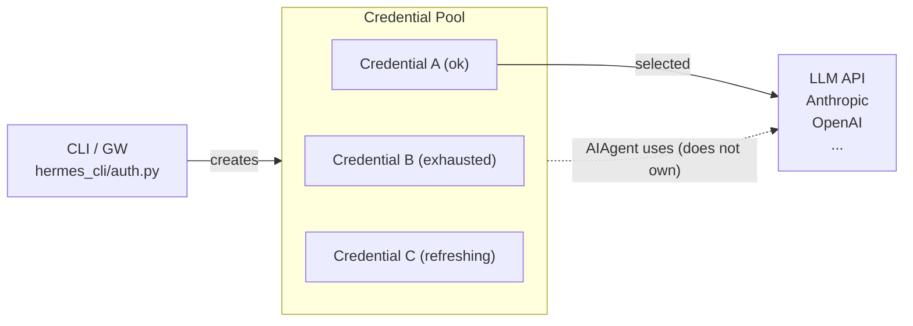
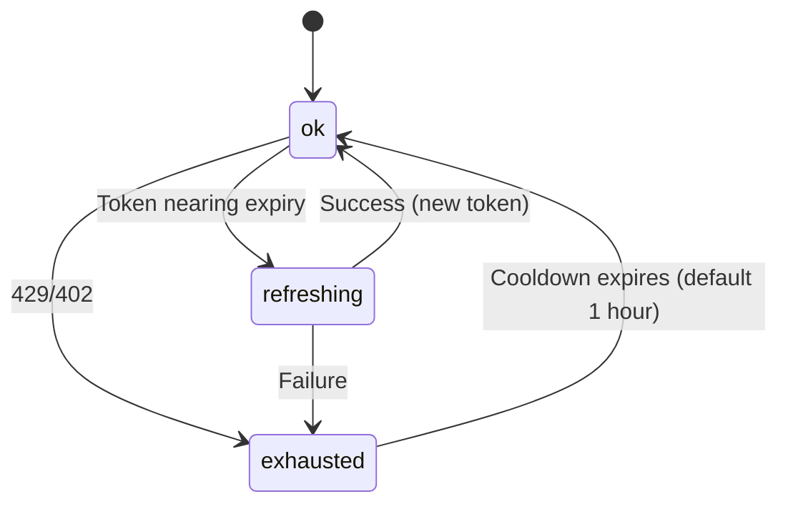
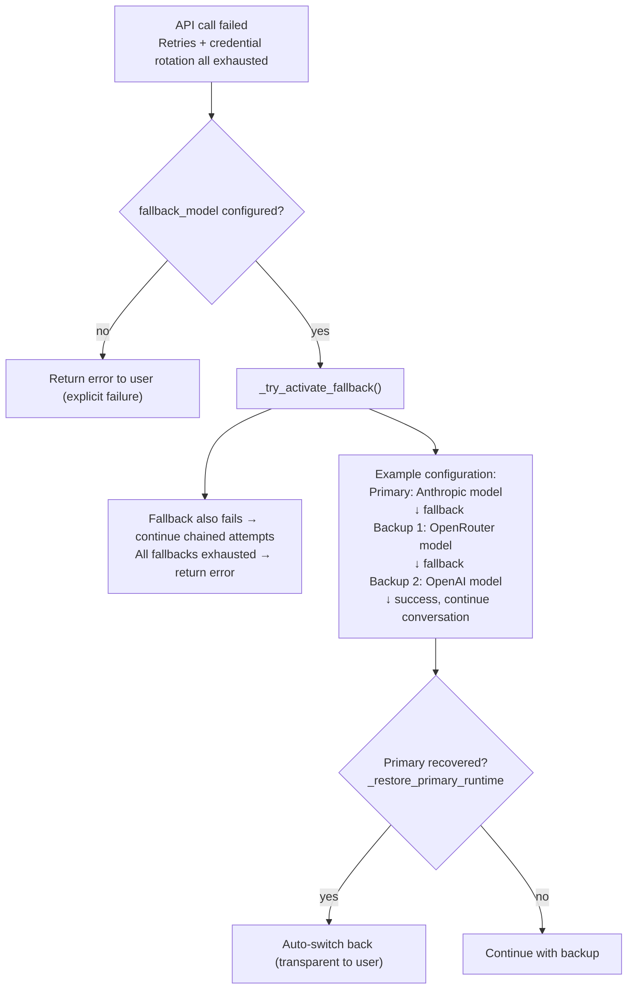
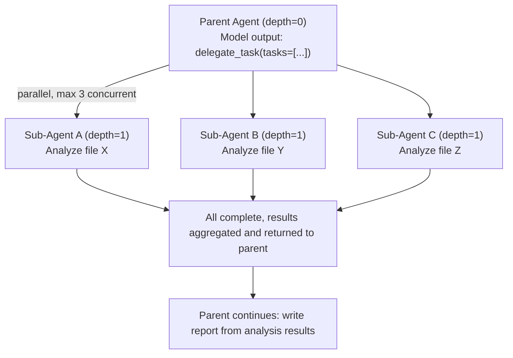

# 02 - Agent Core: The Inner Workings of a 13,000-Line God Object

> **Chapter scope**: `run_agent.py` single file (13,293 lines) + `agent/` subdirectory (52 files, 29,201 lines). This is the Agent core module — the heart of the system.
> **Key class**: `AIAgent` (`run_agent.py:840`) — a stateful conversation coordinator with 50+ parameters.

## Why Analyze AIAgent Separately?

The previous architecture analysis traced a message's complete path from input to output. But at the Agent core stage we only scratched the surface — the main loop, tool execution, Transport adapters. In reality, the 13,293-line `run_agent.py` contains a wealth of mechanisms that directly affect performance, cost, and reliability: How does Prompt Caching cut token costs by 75%? What happens when the API rate-limits you? How do multiple API keys rotate? How are conversation trajectories persisted?

These mechanisms aren't "advanced features" — they're the infrastructure that lets Hermes run reliably in production.

## AIAgent's Role and Collaborators

Before diving into internal mechanics, let's establish one fundamental question: **what role does AIAgent play in the overall system, and what components does it interact with?**

### The Conceptual Model

`AIAgent` is at its core a **stateful conversation coordinator**. It's not the model itself, nor the tools themselves — it's the dispatcher sitting in the middle, translating user intent into a sequence of "model calls + tool executions" until the task is complete.

An analogy: if the LLM is the brain and tools are the hands and feet, then AIAgent is the nervous system — receiving sensory input (user messages), turning the brain's decisions (model responses) into actions (tool calls), and feeding the results of those actions back to the brain.

### Who Creates an Agent?

**Figure: The three creators of AIAgent — CLI, Gateway (with caching), and delegate_tool (sub-agents)**



Three creators, three scenarios:
- **CLI** creates 1 Agent for direct user interaction; lifetime = the entire session
- **Gateway** creates 1 Agent per chat session, caching up to 128, recycling after 1 hour of inactivity
- **delegate_tool** creates child Agents; lifetime = a single delegated task

### Four Collaboration Directions

**Figure: AIAgent's four-way collaboration — with callers, LLM APIs, the tool layer, and the persistence layer**



The Agent interacts with components in four directions:

1. **Upward: caller interface**. Callers (CLI, Gateway, parent Agent) interact with the Agent through a small number of methods:
   - `run_conversation()` — send a message, get a complete reply (`run_agent.py:9627`)
   - `chat()` — simplified interface, returns text only (`run_agent.py:13063`)
   - `interrupt()` / `steer()` — runtime intervention (`run_agent.py:4050` / `4151`)
   - `switch_model()` — hot-swap the model (`run_agent.py:2097`)
   - `close()` — release all resources (`run_agent.py:4441`)

2. **Left: LLM API**. Calls various model providers through the Transport abstraction layer. The Agent doesn't talk to APIs directly — it calls `_build_api_kwargs()` to construct parameters; Transport handles format conversion and protocol adaptation.

3. **Downward: tool layer**. Calls 66 tools through `model_tools.handle_function_call()`. Special among them is `delegate_tool` — it creates new AIAgent instances in turn, establishing a parent-child relationship.

4. **Right: persistence layer**. SQLite stores session history and search indices; MEMORY.md/USER.md store cross-session memory; trajectory files store training data; checkpoints store filesystem snapshots.

### Agent Lifecycle

**Figure: AIAgent's lifecycle states from creation to close — a long-lived service that can be called multiple times**



Key point: **the Agent is long-lived**. In Gateway mode, a single Agent instance may serve the same user for hours or days, handling dozens of `run_conversation()` calls in between. That's why it needs session reset, model switching, and rate limit tracking capabilities — it's not a one-shot function call but a stateful service that needs to keep running and be maintained.

## AIAgent's Parameter Design

With the Agent's role and collaborators established, its parameters make more sense. Its `__init__` (`run_agent.py:840-902`) accepts over 50 parameters, organized into roughly four groups:

**Figure: AIAgent constructor's 50+ parameters grouped into four functional categories (model connection, callback interface, session control, gateway identity)**



Why so many parameters? Because `AIAgent` is used by **three completely different entry points** — CLI needs streaming callbacks and interrupt support; Gateway needs platform identity and session isolation; the batch runner needs trajectory saving and budget control. Rather than splitting into three subclasses (which would add inheritance complexity), a large parameter list (with sensible defaults) lets each caller pass only what it cares about.

## Prompt Caching: Stop Paying for the Same Tokens Twice

Every model API call sends the complete message sequence (system prompt + conversation history + current message) from scratch. In a Hermes session, the system prompt might occupy 5,000–10,000 tokens (including identity, memory snapshots, skill guides, context files, etc.), but it barely changes across 20 conversation turns — meaning you're paying for the same content 20 times.

Prompt Caching addresses this waste. It's not a Hermes invention — Anthropic's API natively supports `cache_control` markers, OpenRouter transparently passes this capability for Claude models, and local inference engines (vLLM, llama.cpp) naturally support KV cache prefix reuse. Hermes's contribution is implementing a **cross-provider caching marker strategy** in `agent/prompt_caching.py` that benefits as many scenarios as possible.

This module sits between the Agent core and the Transport layer — it injects `cache_control` markers into `api_messages` before they're handed to Transport's `build_kwargs()` (`run_agent.py:10195-10200`). It's a pure function module (`prompt_caching.py:8`: "Pure functions -- no class state, no AIAgent dependency"), holding no state and depending on nothing in AIAgent.

The specific strategy is called "system_and_3" (`prompt_caching.py:1-8`). Using Anthropic as an example: it allows up to 4 `cache_control` breakpoints, which Hermes allocates like this:

**Figure: The "system_and_3" Prompt Caching strategy — one breakpoint for the system prompt, one each for the last three messages**



Why not put all 4 breakpoints on the most recent messages? Because the system prompt is the most stable prefix — it's unchanged throughout the session, so its cache hit rate approaches 100%. Without a dedicated marker on it, the provider may not know where caching should begin. The last 3 messages' breakpoints form a rolling window, ensuring recent context is also cached.

One alternative would be relying entirely on the provider's automatic prefix matching, with no explicit markers. But Anthropic's API requires explicit marking to enable caching (it's not automatic), so Hermes must take this step proactively. For providers that don't support `cache_control`, these markers are ignored with no side effects.

But markers are only half the story — if the system prompt subtly changes every time, the cache is useless. Hermes guards prefix stability at multiple levels (`run_agent.py:10207-10239`):

- **System prompt built only once** (`run_agent.py:9814`), not rebuilt within the session (unless context compression alters the message structure). Dynamic information (e.g., memory retrieval results) is injected into **user messages**, not the system prompt — this is another motivation for the "dual injection" strategy introduced in [01-Architecture](01-architecture.md).
- **JSON normalization**. Tool call parameters use `sort_keys=True, separators=(",", ":")` — the same parameters in different serialization orders would cause cache misses. This optimization also benefits local inference engine KV caches.
- **Whitespace cleanup**. Message content is `.strip()`'d to eliminate meaningless whitespace differences.

What if the cache completely fails? Nothing crashes — it simply falls back to normal full-cost billing, with latency and cost reverting to uncached levels. It's a "better with it, no worse without it" optimization.

Cache TTL is configurable via `config.yaml`'s `prompt_caching.cache_ttl` (`run_agent.py:1154-1167`): 5 minutes (default, 1.25x write cost) or 1 hour (2x write cost, but appropriate for Gateway chat scenarios with longer message intervals — it amortizes the cost across more requests).

## Retries and Backoff: Recovering Gracefully from API Failures

Calling external APIs inevitably means encountering failures — network hiccups, service overload, rate limiting, insufficient credit. For a Gateway session that might run for hours, zero failures is an unrealistic expectation. The question is **how to recover after failure**.

Retry logic is embedded in the API call stage of the Agent's core loop (`run_agent.py:10280-10648`), triggered after each `_interruptible_streaming_api_call()` failure, retrying up to `_api_max_retries` times (default 3, adjustable in `config.yaml`). It relies on `agent/retry_utils.py` for backoff timing, on the Credential Pool (if configured) for credential rotation, and coordinates with the interruption mechanism — during retry waits, it checks `_interrupt_requested` every 0.2 seconds so the user can abort a long retry sequence at any time.

The backoff algorithm itself is classic **jittered exponential backoff** (`retry_utils.py:19-57`):

```
delay = min(base × 2^(attempt-1), max_delay) + jitter
```

Base delay is 5 seconds, doubling each attempt, capped at 120 seconds. The simpler alternative is pure exponential backoff (no jitter), but in a multi-session scenario this causes a thundering herd — if a Gateway is serving 50 users simultaneously and a provider returns 429, all sessions wait exactly 5 seconds and retry at once, hammering the provider again. Jitter adds a random offset to each session's retry delay (`[0, 0.5 × delay]`), spreading requests out in time.

The jitter random seed is `time_ns ^ (counter × 0x9E3779B9)` (`retry_utils.py:53`) — XOR of a timestamp and a monotonic counter, ensuring that multiple retries created within the same millisecond get different random sequences. The `0x9E3779B9` constant is the 32-bit approximation of the golden ratio, commonly used in hash functions for bit mixing.

429 (rate limit) errors have additional layered handling (`run_agent.py:5761-5843`), working in concert with the Credential Pool:

```
First 429 → don't rotate credentials, just wait and retry
  ↓ (give the provider time to reset its rate-limit window)
Second 429 → mark current credential as exhausted, rotate to next
  ↓
Exhausted credentials cool down for 1 hour before auto-recovery (credential_pool.py:73)
  ↓
If all credentials are exhausted → fall back to normal backoff waiting
  ↓
If fallback_model is configured → automatically switch to another provider (see next section)
```

**Figure: Layered retry strategy for API call failures — normal errors use exponential backoff, 429s trigger credential rotation**



The reason the first 429 doesn't immediately rotate credentials is that rate limiting may be transient — the provider's rate-limit window might reset within seconds, making an immediate rotation wasteful. This "tolerate one, then rotate" strategy reduces unnecessary credential churn in practice.

## Credential Pool: Managing the Lifecycle of Credentials

Early AI agents typically needed just one API key — put it in an environment variable, read it on use. But when Hermes started supporting OAuth login (Nous Portal's `hermes login`, Anthropic OAuth, GitHub Copilot OAuth), things got more complex: OAuth tokens expire and need to be refreshed with a `refresh_token`; the same user might have both an API key and an OAuth token; teams might share multiple keys to distribute quota. A simple `os.getenv("API_KEY")` no longer suffices.

The Credential Pool (`agent/credential_pool.py`) was built to manage these complex scenarios. It's a **stateful credential container** sitting between the Agent core and the LLM API — rather than grabbing a fixed key each time the Agent needs to call a model, it asks the Credential Pool "give me a currently available credential."

**Figure: The Credential Pool ownership model — created by CLI/Gateway, the Agent is a consumer that selects an available credential from the pool**



A common misconception is that the Credential Pool is managed by the Agent. In reality, **the pool is created and credentials are discovered by the CLI layer (`hermes_cli/auth.py`) or the Gateway layer**, ready before the Agent is created, and injected via the `credential_pool=pool` parameter (`run_agent.py:898`). The Agent is just a consumer — it selects credentials from the pool, marks rate-limit states, and triggers token refreshes, but doesn't own where credentials come from. This "creator and consumer separation" design lets credential lifetimes span multiple Agent instances (which matters in Gateway mode).

The pool provides four selection strategies (`credential_pool.py:59-68`), configured via `config.yaml`'s `credential_pool_strategies`:

- **fill_first** (default) — always prefer the highest-priority credential, falling back to the next only when rate-limited. Suitable for "one primary key, a few backups" personal setups.
- **round_robin** — rotate to the end of the queue after each selection. Suitable for load-balancing across multiple equivalent keys.
- **random** — random selection; a simple decorrelation strategy.
- **least_used** — pick the least-used credential. Ensures even consumption across keys.

The strategy determines "which credential to pick," but not every credential is available at all times — credentials have **state transitions**. Each `PooledCredential` (`credential_pool.py:91`) moves among three states:

**Figure: The three state transitions of a credential in the pool (ok → exhausted/refreshing → ok)**



- **ok** — available, selected normally
- **exhausted** — rate-limited (429) or insufficient credit (402); enters a cooldown period (default 1 hour, `credential_pool.py:73`); auto-recovers when cooldown ends
- **refreshing** — OAuth token is nearing expiry; exchanging for a new one via refresh_token (`credential_pool.py:575-735`)

What if all credentials are simultaneously exhausted? The Agent falls back to normal retry backoff — waiting for cooldown to pass. If a `fallback_model` is configured (next section), it can also automatically switch to a different provider's model and continue with completely different credentials.

With "which credentials to use" and "how to recover from failures" solved, the next question is: once a response arrives, how is it delivered to the user?

## Streaming Responses: Making the Wait Bearable

Waiting for the model to generate a complete response before returning it all at once makes for a poor user experience — seconds of blank silence followed by a sudden wall of text. Streaming delivers tokens to the user as they're generated, psychologically transforming "waiting" into "watching it write." This isn't unique to Hermes — almost every modern chatbot does it. But Hermes faces an extra challenge: in its Agent loop, model responses come in two forms — **plain text replies** and **tool calls**. Only the former should be streamed to the user; the latter are internal dispatch instructions for the Agent itself.

Streaming sits inside the Agent core, above the Transport layer. `_interruptible_streaming_api_call()` (`run_agent.py:6154`) receives the SSE event stream in a background thread; each text token triggers `_fire_stream_delta()` (`run_agent.py:6081`). This method first passes the delta through `StreamingContextScrubber` to filter out internal markers (e.g., `<hermes-memory>` tags that shouldn't leak to the UI), then dispatches to two callbacks: `stream_callback` (provided by the caller; CLI uses it to drive terminal output) and `stream_delta_callback` (used by the TTS speech synthesis pipeline to begin speaking while text is still being generated).

Different providers use different streaming protocols — most use SSE (Server-Sent Events), AWS Bedrock has its own event stream format, and OpenAI Codex's Responses API is internally streaming already. `_interruptible_streaming_api_call()` handles these differences through three `api_mode` code paths, while exposing a unified callback interface to the layer above.

One design decision: **tool call turns are completely silent**. When a model response contains tool calls, stream callbacks don't fire — the user won't see intermediate text like "I need to search the web first" appearing character by character. Only the final plain text reply is streamed. The alternative would be streaming tool call intents (e.g., "Searching for..."), but Hermes chose to use tool progress callbacks (`tool_progress_callback`) and spinner animations instead, keeping the output area clean.

If no new token is received for 180 consecutive seconds (`HERMES_STREAM_STALE_TIMEOUT` environment variable, default 180, `run_agent.py:6835`), the stream is judged stale and a retry is triggered — this handles provider-side SSE connection hang scenarios (connection open but no data flowing).

## Fallback Chain: Automatic Failover Across Providers

Retries and credential rotation handle recovery within a single provider. But if an entire provider goes down — say Anthropic has a major outage — rotating credentials doesn't help. The Fallback Chain addresses a higher-level problem: **automatically switching to a completely different provider and model**.

This mechanism sits outside the retry logic. When retries are exhausted and credentials have all been rotated without success, the Agent calls `_try_activate_fallback()` (`run_agent.py:6997`), pulling the next fallback option from the `fallback_model` configuration. `fallback_model` can be a single dict or an ordered list (a chained set of backups), configured via `config.yaml`'s `model.fallback_model` or the `AIAgent.__init__` `fallback_model` parameter.

**Figure: The Fallback Chain — chain of fallback models after retries are exhausted, with automatic recovery to the primary when it comes back**



Why not let users switch manually? In CLI scenarios users can use `/model` to switch, but in a Gateway scenario (50 people simultaneously using a Telegram group), you can't ask each user to do it manually. The Fallback Chain lets the Gateway maintain service automatically during provider outages — users might notice a slight change in response style (because the model changed) rather than a complete outage.

The switch is temporary — `_restore_primary_runtime()` (`run_agent.py:7192`) tries to restore the primary model on subsequent requests. If the primary has recovered, it switches back transparently. If no `fallback_model` is configured, repeated failures eventually return an error to the user — the worst case, but an explicit failure rather than silently dropping messages.

## Sub-Agents: When One Agent Isn't Enough

The Fallback Chain is vertical degradation — one model fails, switch to another. Sub-agents are horizontal decomposition — a task is too large, split it into parallel pieces. Both are elasticity mechanisms in the Agent core, but in different directions.

Sub-agents originate from a practical scenario: the user says "analyze these three files then write a report." Analyzing three files can be parallelized; writing the report must wait for the analyses. A single Agent working serially takes three times as long; spawning three sub-agents to analyze in parallel and then aggregating for the report is far more efficient.

`tools/delegate_tool.py` implements this mechanism. It isn't part of the Agent core — it's an **ordinary tool** named `delegate_task`, registered in the tool layer (`tools/`) and triggered by the model through a tool call just like `terminal` or `web_search`. But it's special: it's the only tool that **creates AIAgent instances in reverse** (via lazy import `from run_agent import AIAgent`, `delegate_tool.py:866`), forming an Agent → Tool Layer → Agent recursive structure.

**Figure: Parent Agent splits into three parallel sub-agents to handle independent sub-tasks, then resumes after aggregation**



Sub-agents run in `ThreadPoolExecutor` worker threads, with a default maximum of 3 concurrent (`delegate_tool.py:128`, `_DEFAULT_MAX_CONCURRENT_CHILDREN = 3`). They share the parent Agent's `iteration_budget` — if the parent has a budget of 90 iterations, the three sub-agents can only consume what's left of those 90 combined. This prevents sub-agents from consuming resources uncontrolled.

Safety isolation is the core design consideration for sub-agents. A sub-agent is not a complete clone of its parent — its toolset is a **subset** of the parent's (intersection, `delegate_tool.py:891-930`), and five tools are forcibly disabled (`delegate_tool.py:41-49`):

- `delegate_task` — prevents infinite recursion (unless the sub-agent's role is `orchestrator`)
- `clarify` — sub-agents run in background threads; there's no stdin, so interaction is impossible
- `memory` — prevents multiple sub-agents concurrently writing to MEMORY.md and causing conflicts
- `send_message` — prevents sub-agents from messaging users on their own
- `execute_code` — forces step-by-step reasoning instead of shortcuts

Why not simply share all of the parent's tools? Because sub-agents run in independent threads and lack the CLI's interactive context (no stdin, no approval dialog). If a sub-agent needs to execute a dangerous operation (e.g., `rm -rf`), the parent Agent's approval callback isn't visible to it. The default behavior is `_subagent_auto_deny` (`delegate_tool.py:69`) — automatically denying all operations requiring approval. For cron jobs or batch-run scenarios, `delegation.subagent_auto_approve` can be configured to relax this restriction.

Nesting depth is limited to 1 layer by default (`delegate_tool.py:129`, `MAX_DEPTH = 1`) — a parent Agent spawns child Agents, but child Agents cannot spawn grandchild Agents. This can be relaxed to a maximum of 3 layers via `config.yaml`'s `delegation.max_spawn_depth` (`delegate_tool.py:133`). For deeper nesting, a sub-agent can be given `role: "orchestrator"`, which retains the `delegate_task` tool and allows it to continue decomposing tasks.

Sub-agents also have runtime observability — the `_active_subagents` registry (`delegate_tool.py:151`) lets the TUI display how many sub-agents are currently running and what each is doing, and supports individually interrupting a specific sub-agent.

## Trajectories: From Runtime to Training Data

Nous Research isn't just building an agent product — they're using the agent's runtime data to train the next generation of tool-calling models. This is one part of what Hermes means by "research-ready": it can record each conversation as a directly usable training dataset while running day-to-day.

`agent/trajectory.py` is a small module (56 lines), sitting on the output side of the Agent core — at the end of each `run_conversation()`, if `save_trajectories=True` (`run_agent.py:855`), it calls `_save_trajectory()` (`run_agent.py:3723`) to append the complete conversation sequence to a JSONL file. Successful trajectories are written to `trajectory_samples.jsonl`, failures to `failed_trajectories.jsonl` — failures are kept too, because for researchers "where the model went wrong" is just as valuable as "what the model did right."

The format is ShareGPT-compatible JSON (`{"conversations": [...], "timestamp": ISO, "model": str, "completed": bool}`), because this is the common format for Nous's training framework (Atropos) and community tools (such as axolotl). One noteworthy detail: `convert_scratchpad_to_think()` (`trajectory.py:16`) replaces internal `<REASONING_SCRATCHPAD>` tags with `<think>` before writing — different models use different reasoning tag names, but training data needs to be consistently normalized.

This module is completely transparent to day-to-day usage — off by default, no performance impact. It's primarily used by `batch_runner.py` (the batch trajectory generator) and RL research workflows, and is part of the infrastructure for Hermes's "research-ready" positioning.

## Model Metadata: Finding a Model's True Parameters in a Chaotic Ecosystem

`agent/model_metadata.py` (1,467 lines) appears to do one thing: tell the Agent how large the current model's context window is. But this seemingly simple question becomes surprisingly tricky given Hermes's support for 20+ providers.

The same model accessed through different paths may have completely different parameters — GPT-5.5 via Codex OAuth has a 272K context, while direct OpenAI API access gives 1.05M. Local models' (Ollama, vLLM) context length depends on how much VRAM the user allocated for the KV cache — it's not a fixed value. Some providers' APIs return no model metadata at all. Users may also have manually overridden defaults in their configuration.

This module is used during Agent initialization — after `AIAgent.__init__` determines the model and provider, it immediately queries the context length, which is used to initialize the context compressor's threshold. It's depended upon by the Agent core, the context compressor, and the Insights Engine (which uses pricing information to estimate costs).

### Multi-Level Fallback Chain

`agent/model_metadata.py` (1,467 lines) implements a ten-plus-level fallback chain for resolving context length (`model_metadata.py:1229-1426`, numbered 0 through 10 with sub-levels in the source):

```
0.  Explicit override in config.yaml (if user set it, use this)
0b. Per-model configuration in custom_providers
    ↓ Neither set?
1.  Persistent cache (~/.hermes/context_length_cache.yaml)
1b. AWS Bedrock static table (immediately after cache, no network probe needed)
    ↓ No cache hit?
2.  Custom endpoint /models API probe
3.  Local servers (Ollama /api/show, LM Studio, llama.cpp /v1/props)
4.  Anthropic /v1/models API
5.  Provider-aware queries (Copilot /models, Nous suffix match, Codex OAuth)
    ↓ No hit?
6.  OpenRouter API + models.dev registry
8.  Hardcoded default table (fuzzy match, longest key wins)
9.  Local server last resort (try again)
10. Final fallback → 128K
```

Numbering follows source code comments (`model_metadata.py:1252-1425`); gaps are historical artifacts.

Resolved results are cached: OpenRouter metadata for 1 hour (`model_metadata.py:526`), custom endpoints for 5 minutes (`model_metadata.py:562`).

Does this system look over-engineered? Given Hermes's support for 20+ providers and local engines, each with their own metadata query mechanism (or none at all), this fallback chain is driven by real requirements.

## Display and Insights: Two Dimensions of Observability

What does the user see while the Agent is working? What can they review after work is done? These two questions are answered by `display.py` and `insights.py` respectively.

**`agent/display.py`** (approximately 1,000 lines) handles **real-time observability** — what appears in the terminal while the Agent is executing tools. It's a presentation adapter between the Agent core and the CLI layer, receiving the Agent's tool progress callbacks and converting them into human-readable terminal output. It's extracted into its own module rather than embedded in the CLI because this display logic is also reused by the TUI and Gateway status notifications.

Its responsibilities include: tool execution previews (condensing tool name and parameters into a single human-readable line), tool completion lines (emoji + verb + detail + elapsed time), inline diff display (unified diffs of file edit results, up to 6 files × 80 lines), and `KawaiiSpinner` — 9 animation styles for the "thinking" spinner. The spinner sounds decorative, but it has a real purpose: during the long waits of streaming responses and tool execution, the animation signals "the system is still alive," reducing the anxiety of "did it hang?"

**`agent/insights.py`** (`InsightsEngine`, approximately 930 lines) handles **after-the-fact observability** — usage statistics that users can review via the `/insights` command. It reads raw data from the SQLite session database, aggregating total token consumption, estimated cost (using Model Metadata's pricing information), grouped statistics by model/platform/tool, and activity distribution by day of week and hour. It outputs in two formats: ASCII tables (for CLI terminals) and Markdown (for Gateway chat platform replies).

Neither module affects the Agent's core logic — remove them entirely and the Agent keeps working; users just won't see anything. They're the "observability layer," with a one-way dependency on the Agent core — display depends on the Agent's callback interface, insights depends on the SQLite data the Agent writes, but the Agent doesn't depend on either of them.

## Retrospective: How Does a Single File Manage This Many Responsibilities?

`run_agent.py` — 13,293 lines, 50+ init parameters, 10+ core methods — is a textbook God Object. Why not split it up?

In fact, Hermes has been splitting it all along. The `agent/` subdirectory (~29,200 lines) is code progressively extracted from `run_agent.py`: the Transport layer, context compression, memory management, prompt construction, rate limit tracking, credential pool — all of these used to live in `run_agent.py`.

But the core loop — "call the model → parse the response → execute tools → loop" — and all the orchestration logic between these subsystems still needs a single home. That's `run_agent.py`'s role: **not a class that does everything, but the glue that wires all the subsystems together**. It's just that when the system is complex enough, the glue itself needs 13,000 lines — orchestrating the interactions between 10 subsystems, handling their temporal dependencies and error propagation, is a task of comparable complexity to implementing those subsystems.

## What's Next

This chapter explored the internal mechanisms of the Agent core. The next chapter, **[03-Tool System](03-tool-system.md)**, focuses on the Agent's hands — how 66 tools are registered, dispatched, and executed; how toolsets are configured; and how the security approval mechanism works.

---

*This document is based on analysis of hermes-agent v0.11.0 source code. All code references have been independently verified.*
