# 02 - Agent Core: The Inner Workings of the Conversation Orchestrator

[中文](../zh/02-Agent核心.md) | English

> **Scope**: `run_agent.py` (6,013 lines) + the `agent/` subdirectory (150 .py files including subdirectories, 93,837 lines). This is the Agent core module, the heart of the system.
> **Key class**: `AIAgent` (`run_agent.py:393`) — the stateful conversation orchestrator. The core loop is in `agent/conversation_loop.py` (5,312 lines).

> **This chapter is based on hermes-agent v0.18.2 (tag [`v2026.7.7.2`](https://github.com/NousResearch/hermes-agent/releases/tag/v2026.7.7.2), commit `9de9c25f6`, 2026-07-07)**

---

## Why Dive Into AIAgent?

The previous chapter analyzed hermes_cli — the infrastructure before the Agent runs. But once config is in place and credentials are ready, the real work begins in `AIAgent`.

Chapter 00's "journey of a message" already walked the Agent's main path: build the prompt → call the model → execute tools → loop. But that was only the surface. Within the nearly 100,000 lines of `run_agent.py` + `agent/` lie a great many mechanisms that affect performance, cost, and reliability: how does Prompt Caching save on token cost? What happens when you're rate-limited? How are multiple API keys rotated? How does it automatically switch when an entire Provider goes down? How does `/moa` have multiple models advise on the same question? How is the conversation trajectory saved as training data?

These aren't "advanced features" — they are the infrastructure that lets Hermes run stably 24/7 in production.

---

## Usage Guide

### Basic Usage

In most cases, users don't interact with AIAgent directly — the CLI and Gateway create and manage it automatically. But the following parameters affect the Agent's behavior and are worth knowing:

```yaml
# Agent-core-related config in config.yaml
agent:
  max_turns: 90           # max iterations per conversation (rounds of tool calls)
  gateway_timeout: 1800   # idle timeout in gateway mode (seconds)

model:
  fallback_model:         # where to switch automatically when the main model fails
    provider: "openrouter"
    model: "deepseek/deepseek-r1"

credential_pool_strategies:
  openrouter: "round_robin"  # multi-key rotation strategy

prompt_caching:
  cache_ttl: "5m"         # prompt cache TTL ("5m" or "1h")

moa:                      # Mixture of Agents presets (see the MoA section below)
  presets:
    default:
      reference_models: [...]
      aggregator: {...}
```

### Common Scenarios

**Scenario 1: Configure a Fallback Chain.** The main Provider occasionally gets rate-limited or fails. Set `fallback_model` in `config.yaml`, and the Agent will switch automatically after the main one exhausts its retries — the user might only notice a slight change in reply style, rather than the chat cutting off entirely.

**Scenario 2: Multi-API-key rotation.** A team shares multiple keys to spread quota. Write multiple keys (comma-separated) in `.env`, and configure `credential_pool_strategies` to choose a rotation strategy (fill_first / round_robin / random / least_used).

**Scenario 3: Have multiple models advise.** `/moa what are the pitfalls of this architecture?` — send the question to multiple reference models at once to gather opinions, then have the aggregator model synthesize an answer (see the "MoA" section below).

**Scenario 4: Programmatic invocation.** Use the Agent directly from Python code:

```python
from run_agent import AIAgent
agent = AIAgent(base_url="https://openrouter.ai/api/v1", model="anthropic/claude-opus-4.6")
result = agent.run_conversation("analyze the security vulnerabilities in this code")
print(result["response"])
agent.close()
```

### Troubleshooting

| Problem | Where to look |
|---------|---------------|
| Agent loop won't stop | Check the `max_turns` setting; subagents have their own `iteration_budget` (default 50), adjusted via `delegation.max_iterations` |
| Reply very short after budget exhausted | Normal behavior: after the budget is exhausted there is one **tool-stripped** summary call (log "Iteration budget exhausted … asking model to summarise"), and the model can only answer from existing information |
| Frequent 429 rate limits | Configure Credential Pool multi-key rotation; or set a fallback_model |
| A key keeps showing unavailable | exhausted cooldown tiers: 401 triggers 5 minutes, 429 triggers 1 hour (`credential_pool.py:113-115`); the `dead` status (terminal errors like a revoked token) doesn't self-heal and requires re-login |
| Switched Provider without retrying | Not a bug: billing-type 402 rotates immediately, and aggregator upstream rate-limits (upstream_rate_limit) fall back directly without touching the credential pool — see the four branches in the "Retry and Backoff" section |
| Context overflow error | The compressor handles it automatically; if compression itself fails: auth/network failures freeze the messages as-is and wait for recovery, while the default config silently swaps in a static summary (may drop middle messages, check `_last_summary_dropped_count`) — the switch is `compression.abort_on_summary_failure` |
| Agent forgot the middle of the conversation | Most likely it took the static fallback branch of a compression failure (dropping middle messages), or normal compression summarized the details away — see the ContextEngine section |
| Streaming response stuck | By default, 180 seconds with no new token triggers an automatic retry (`HERMES_STREAM_STALE_TIMEOUT` is tunable); reasoning models have wider dedicated floors (`agent/reasoning_timeouts.py`); local engines disable this detection by default |

> 📖 **Further Reading (Official Docs):**
> - [Agent Loop Internals](https://hermes-agent.nousresearch.com/docs/developer-guide/agent-loop)
> - [Fallback Provider](https://hermes-agent.nousresearch.com/docs/user-guide/features/fallback-providers)
> - [Credential Pool](https://hermes-agent.nousresearch.com/docs/user-guide/features/credential-pools)
> - [Context Compression](https://hermes-agent.nousresearch.com/docs/developer-guide/context-compression-and-caching)

---

## Architecture & Implementation

### What Is AIAgent?

`AIAgent` (`run_agent.py:393`) is essentially a **stateful conversation orchestrator**. It is neither the model itself nor the tools themselves — if we compare the whole system to a project team, the LLM is the core that makes decisions, the tools are the executors that do the actual work, and AIAgent is the project manager — breaking tasks into instructions, sending them out, collecting results, judging whether they're done, and deciding the next step.

#### Four Directions of Collaboration

AIAgent interacts with components in four directions:

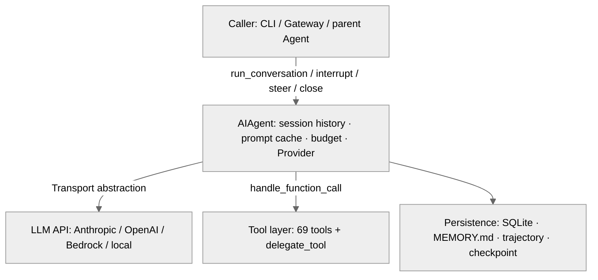

**Figure: AIAgent's four-way collaboration with the caller, LLM API, tool layer, and persistence layer**

1. **Caller interface**: the CLI, Gateway, or a parent Agent interacts with the Agent through a few methods — `run_conversation()` sends a message and gets a reply (`run_agent.py:5745`), `interrupt()` interrupts (`run_agent.py:2619`), `steer()` gently redirects (`run_agent.py:2720`), `switch_model()` hot-swaps the model (`run_agent.py:792`), `close()` releases resources (`run_agent.py:3433`)
2. **LLM API**: calls the model through the Transport abstraction layer. The Agent doesn't deal with the API directly — the Transport handles format conversion and protocol adaptation
3. **Tool layer**: dispatches 69 tools via `model_tools.handle_function_call()`. The special one is `delegate_tool` — it reverse-creates a new AIAgent, forming a recursive structure
4. **Persistence layer**: SQLite stores sessions, MEMORY.md/USER.md store cross-session memory, trajectory stores training data, checkpoint stores filesystem snapshots

#### AIAgent's Parameter Design

AIAgent's `__init__` (`run_agent.py:416`) accepts over 60 parameters, roughly divided into four groups:

| Group | Typical parameters | Purpose |
|-------|--------------------|---------|
| Model connection | `base_url`, `api_key`, `provider`, `api_mode`, `model`, `fallback_model` | which LLM to connect to |
| Callback interface | `tool_*_callback`, `thinking_callback`, `reasoning_callback`, `clarify_callback`, `stream_delta_callback`, `status_callback` | how the Agent notifies the caller at runtime |
| Session control | `session_id`, `max_iterations`, `iteration_budget`, `save_trajectories`, `checkpoints_enabled`, `prefill_messages` | control the conversation's behavior and boundaries |
| Gateway identity | `platform`, `user_id`, `user_name`, `chat_id`, `gateway_session_key` | which user on which platform the message came from |

Why so many parameters? Because AIAgent is used by three completely different entry points — the CLI needs streaming callbacks and interrupt support, the Gateway needs platform identity and session isolation, and the batch runner needs trajectory saving and budget control. Rather than splitting into three subclasses (introducing inheritance complexity), it uses a large parameter list with sensible defaults, so each caller passes only the parts it cares about. The actual initialization logic is delegated to `agent/agent_init.py` (2,103 lines, `run_agent.py:489-490`).

#### The Lifecycle of an AIAgent Instance

An Agent instance is **long-lived**. In gateway mode, one Agent instance may serve the same user for hours or even days, handling dozens of `run_conversation()` calls in between.

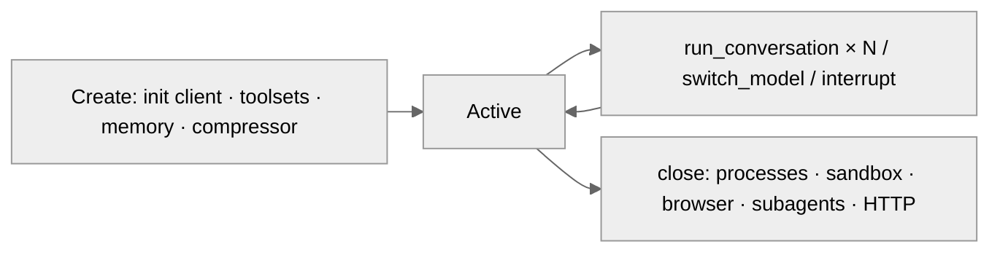

**Figure: The lifecycle of an AIAgent instance — repeatedly callable after creation; close() releases all resources**

`close()` (`run_agent.py:3433`) releases resources in five steps: terminate background processes (ProcessRegistry) → clean up terminal sandbox → close browser sessions → close subagents → close the HTTP client. Each step has its own try-except, so one step failing doesn't affect the rest of the cleanup.

#### The Ongoing Modular Decomposition

In v0.14, `run_agent.py` was reduced from 13,293 lines to 4,309 lines (the core loop split into `conversation_loop.py`). By v0.18.2, `run_agent.py` had grown back to 6,013 lines — but the decomposition is also continuing: the v0.17 god-file decomposition campaign (Chapter 00) split the **prologue** of `run_conversation()` into `agent/turn_context.py` (565 lines), the **epilogue** into `agent/turn_finalizer.py` (507 lines), and consolidated the inner retry-recovery flags into `TurnRetryState` in `agent/turn_retry_state.py` (80 lines). What remains in `run_agent.py` is mostly forwarder functions — a backward-compatible API surface whose implementation is delegated to the submodules.

### The Lifecycle of a Complete Conversation

When a caller (CLI, Gateway, or a parent Agent) calls `run_conversation()` (the actual body is `conversation_loop.py:523`), a conversation unfolds in the following order:

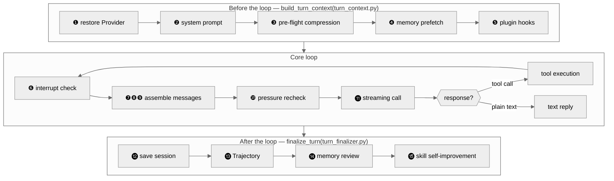

**Figure: The complete lifecycle of `run_conversation()` — the prologue and epilogue have been split into separate files, and the numbers correspond to the descriptions below**

**Before the loop** — all the once-per-turn preparation is now concentrated in `build_turn_context()` (called at `conversation_loop.py:576`, implemented in `agent/turn_context.py`): stdio guarding, retry-counter reset, user-message sanitization, system-prompt restore/build, crash-recovery persistence, pre-flight compression, the `pre_llm_call` plugin hook, and external-memory prefetch — it returns a context object from which the loop reads back all local state. Item by item:

**❶ Restore the main Provider** (`turn_context.py:174`) — if the previous turn triggered a Fallback, this turn first tries to restore the main model. On successful restore, subsequent API calls go to the main one; on failure, it keeps using the fallback.

**❷ Build/reuse the system prompt** — built only once per session (`build_system_prompt()`, `agent/system_prompt.py:470`, the docstring explicitly says "once per session, rebuilt only after a compression event"), afterward reusing `_cached_system_prompt`. This is the prerequisite for Prompt Caching hits — only if the system-prompt bytes are unchanged can the Provider reuse the previous KV cache. When the Gateway resumes a session, it goes through `_restore_or_build_system_prompt` (`conversation_loop.py:282`), loading the old prompt from SessionDB to avoid a rebuild that would invalidate the cache.

**❸ Pre-flight compression** — before entering the loop, it checks whether the history messages exceed the context threshold (including the 20-30K+ tokens taken by tool schemas), and compresses first if so. This prevents the problem of "calling the API with an over-long history until the Provider errors out and only then compressing." The compressed message carries a `[CONTEXT COMPACTION — REFERENCE ONLY]` prefix (`context_compressor.py:45`), explicitly telling the model this is a historical reference rather than a current instruction.

**❹ Memory prefetch** — retrieves memory snippets relevant to the current message from an external memory provider (take a vector database as an example). The results are cached in `_ext_prefetch_cache` and reused throughout the turn — 10 tool calls won't query 10 times. The retrieval results are ultimately injected into the user message (step ❼), not the system prompt.

**❺ Plugin pre_llm_call hook** — plugins can inject extra context here. Like memory prefetch, the injection target is the user message rather than the system prompt — the system prompt is cached, and modifying it would break the cache.

**Core loop** (`conversation_loop.py:638`):

**❻ Check the interrupt flag** — if the user pressed Ctrl+C or sent a new message, `_interrupt_requested` is True (`conversation_loop.py:643`), and it breaks immediately. The interrupt signal recursively propagates to all subagents and tool worker threads.

❼❽❾ These three steps together accomplish one thing: **turning the Agent's internal `messages` list into an API request the Provider can accept** — a process involving three kinds of operation: injection, cleanup, and format conversion.

**❼ Assemble API messages** (from `conversation_loop.py:787`) — generates an `api_messages` copy from `messages` (without modifying the original list), handled by three kinds of operation:
- **Injection**: append the memory-retrieval results from step ❹ and the plugin context from step ❺ to the end of the current user message (the comment at `agent/conversation_loop.py:791-808` explicitly says "injected only for the API call, the original messages are never mutated and never persisted to the session"); copy reasoning content (`reasoning_content`) for multi-turn reasoning continuity
- **Cleanup**: remove internal marker fields (`finish_reason`, `_thinking_prefill`, etc.) — these are the Agent's internal state and shouldn't be sent to the API
- **Standardization**: serialize tool-call arguments with `sort_keys=True`, `separators=(",", ":")` to guarantee identical byte representation for identical content, preventing Prompt Caching misses due to serialization differences

**❽ Splice the system prompt + cache markers** — put `_cached_system_prompt` at the front of `api_messages` as `{"role": "system", "content": ...}`. If Prompt Caching is enabled (`_use_prompt_caching`), call `apply_anthropic_cache_control()` (`prompt_caching.py:84`) to inject `cache_control` breakpoints (see the "Prompt Caching" section below). The reference-opinion injection of the MoA marker path also happens after this (`conversation_loop.py:853-874`, see the MoA section) — after the system prompt is assembled and before it's sent, the synthesized opinion is spliced into the last user message.

**❾ Sanitize/repair + Transport conversion** — `_sanitize_api_messages()` cleans up orphaned tool results, fills in missing tool result stubs, and merges reasoning-only assistant messages to avoid API errors. Then the Transport layer converts the OpenAI-format messages into the Provider's native format (take Anthropic as an example: the `system` message is extracted from the array into a standalone parameter).

**❿ Pre-call pressure recheck** (`conversation_loop.py:983`) — the second compression gate, added in v0.17. The prologue's pre-flight compression only saw the incoming user message, but a turn may append multiple giant tool results internally, squeezing the next call into having no output budget (the comment records a real incident: a Codex failure at 271k/272k). So before each API call it rechecks `should_compress()` using the immediate estimate of the current request — whereas the old gate at the loop's tail uses the API-reported token count from the previous round, which lags behind a large result just appended.

**⓫ Streaming API call** — initiates a streaming request, dispatching each token to the CLI and TTS callbacks via `_fire_stream_delta()` (see the "Streaming Response" section below). A long time with no new token is judged a stale stream and retried.

**Response parsing** (three paths):
- **Tool call** → execute tools (serial or parallel, depending on the side-effect judgment) → append the `assistant` (with tool_call) and `tool` (with result) messages to `messages` → back to ❻
- **Plain text** (`finish_reason == "stop"`) → exit the loop
- **Exception** → hand to `error_classifier` for classification → decide retry/compress/rotate/Fallback (see the "Retry and Backoff" section below)

The loop is bounded by `IterationBudget` (now a standalone module `agent/iteration_budget.py`, 62 lines) — a counter bound to the Agent instance, decremented once per LLM call. Each Agent instance has its own budget: a parent Agent defaults to 90 (`max_iterations`), a subagent to 50 (`delegation.max_iterations`). Parent and child budgets are independent — three subagents can each use 50 iterations, exceeding the parent's cap of 90 in total. The budget also has a **refund** mechanism: `refund()` (`iteration_budget.py:45-49`) returns the iterations consumed by programmatic calls like `execute_code`, so they don't count against the budget.

When the budget is exhausted, the conversation doesn't suddenly cut off mid-tool-call: after the loop exits, the finalize stage finds there's no final reply (`turn_finalizer.py:53-70`) and issues **one extra API call with all tools stripped** to ask the model to summarize (`agent._handle_max_iterations` → `chat_completion_helpers.py:1565 handle_max_iterations`, log keyword "Iteration budget exhausted … asking model to summarise"). Stripping the tools means the model can only produce text and can't perform one more action. In a kanban-worker scenario, the model can no longer call `kanban_block` itself, so the finalize code calls `_record_task_failure(outcome="timed_out")` on its behalf to report — only then is it counted toward the `consecutive_failures` circuit breaker, avoiding "a task repeatedly going over budget silently" (`turn_finalizer.py:72-84` comment, #29747).

**After the loop** — the finalize is all in `finalize_turn()` (`agent/turn_finalizer.py`): budget-exhaustion summary, trajectory saving, session persistence, turn diagnostics, response transformation, result-dict assembly, steer draining, and memory/skill review triggering. Item by item:

**⓬ Save the session** to SQLite (`hermes_state.py`), including message history, system prompt, and metadata. This lets the Gateway load the full context when it resumes the same session next time.

**⓭ Write Trajectory** — if `save_trajectories=True`, append the conversation sequence to a JSONL file. See the "Trajectory" section below.

**⓮ Memory review** — at a configured interval (`agent_init.py:1330`, default every 10 rounds), it periodically forks a review Agent in the background to have an auxiliary model review whether this round's conversation contains anything worth remembering, and if so, automatically writes it to MEMORY.md.

**⓯ Skill self-improvement** — triggered by this round's tool-call count (`turn_finalizer.py:454-458`: when `_iters_since_skill` reaches `_skill_nudge_interval` and the `skill_manage` tool is available). If this round used many tool calls (indicating a complex task), the Agent tries to abstract the solution into a skill and save it.

That's what happens in a complete conversation from start to finish. But one key question hasn't been answered: what does the LLM actually see?

### What Does the LLM See? — The Complete Message Structure of Each API Call

The key to understanding how the Agent leverages the LLM's intelligence is understanding **what the LLM actually receives on each API call**. This is not a simple user message — it's a carefully assembled composition of three parts:

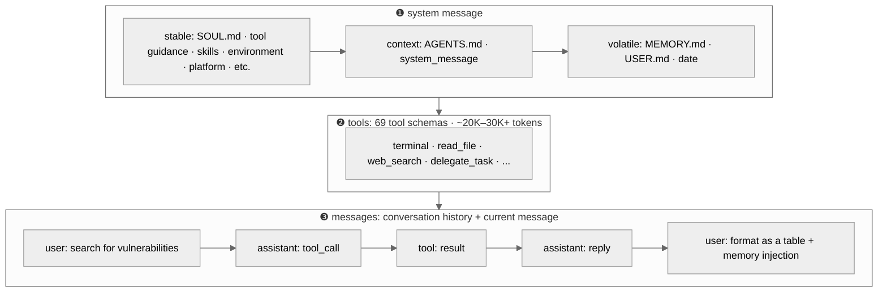

**Figure: The complete structure the LLM receives on one API call**

#### ❶ system message — telling the LLM "who you are, where you are, what you can do"

The LLM itself doesn't know what environment it's running in — it doesn't know whether the user is on Telegram or in a terminal, what tools are available, or the user's preferences. The system prompt's role is to **give the LLM all the context it needs to make decisions**.

The system prompt is assembled from three layers (`agent/system_prompt.py:12-19` module comment; the layered-assembly function `build_system_prompt_parts()`, `:113`), arranged from most to least cache-friendly:

- **stable layer** (rarely changes): the SOUL.md persona definition ("You are Hermes, an AI assistant..."), tool-behavior guidance ("when you need to search, call web_search, don't make up answers"), the skill system prompt (summaries and trigger conditions of installed skills), environment hints ("you're running on WSL2" / "you're in a Docker container" — without this, the LLM might give Windows commands while actually on Linux), platform hints ("the user is on Telegram, reply in Markdown")
- **context layer** (may change across sessions): the user's project AGENTS.md / .cursorrules (project-level instructions), the caller-supplied system_message
- **volatile layer** (different per session, but unchanged within a session): the MEMORY.md snapshot ("the user is a backend developer, prefers Python..."), the USER.md snapshot ("uses vim, dislikes TypeScript"), the current date (accurate only to the day, no minutes — so the system-prompt bytes are unchanged within a day, guaranteeing cache hits), the model name and Provider name

The order of the three layers isn't arbitrary — the stable layer goes first because Prompt Caching's prefix matching starts from the first byte. If the volatile layer (a memory snapshot different per session) were placed before the stable layer, the cache prefix would differ for every session, and the cache would be useless.

#### ❷ tools — telling the LLM "what tools you have"

The function-calling JSON schemas of 69 tools, defined in OpenAI format (each tool includes name, description, parameters). This part can take **20,000-30,000+ tokens** — one of the largest token costs in a single API call.

The tool schemas are exactly identical every round — a property the Prompt Caching section below exploits fully.

#### ❸ messages — conversation history + current message

The message list contains the full conversation history: user messages, assistant replies, tool calls (`tool_calls`), and tool results (`tool`-role messages). The LLM needs to see the previous tool calls and results to understand the context — if it searched the web last round and is asked this round to "format as a table," it needs to see the search results to know what to format.

The current round's user message is **injected with two kinds of extra content** (`conversation_loop.py:791-808`, injected only for the API call, not modifying the original message list, not persisted to SessionDB):
- the external memory provider's retrieval results (the `_ext_prefetch_cache` prefetched in step ❹)
- the context returned by the plugin pre_llm_call hook

Why are these injected into the user message rather than the system prompt? Because the system prompt is cached — modifying it would break the cache. The user message is different every round anyway, so adding to it doesn't affect the cache prefix.

Once you understand the complete input the LLM sees each time, the Prompt Caching section has a foothold — it solves exactly the cost problem of repeated content among these three parts.

### Prompt Caching: Stop Paying Again for Repeated Tokens

Every time the model API is called, the complete message sequence (system prompt + history + current message) has to be sent from the start. In a Hermes session, the system prompt may take 5,000-10,000 tokens, but it barely changes over 20 rounds of conversation — meaning you paid for the same content 20 times.

Prompt Caching is the response to this waste. `agent/prompt_caching.py` (119 lines) implements a cross-Provider generic cache-marking strategy. Take Anthropic as an example: it allows up to 4 `cache_control` breakpoints, and Hermes's "system_and_3" strategy (`prompt_caching.py:3`) allocates them like this:

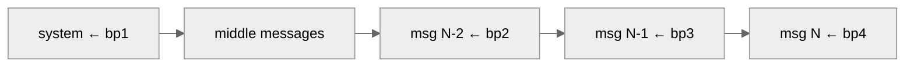

**Figure: The breakpoint allocation of Prompt Caching — the system prompt takes one, and the three most recent non-system messages take one each**

The system prompt is the most stable prefix — unchanged within a session, with a hit rate near 100%. The Provider's cache is keyed by a hash of the prefix content — just as git identifies versions by content hash, one differing byte is a different key, even if it looks identical to the eye. This is why Hermes guards prefix stability at multiple levels: the system prompt is built only once (`_cached_system_prompt`), JSON tool arguments are standardized with `sort_keys=True` (preventing cache misses from serialization-order differences), and message content is `.strip()`ed to eliminate whitespace differences.

The cache TTL is configurable via `prompt_caching.cache_ttl`: 5 minutes (default, 1.25× write cost) or 1 hour (2× write cost, suited to gateway scenarios with longer intervals between messages). If the cache is fully invalidated — it doesn't crash, it just falls back to normal full billing. This is a "nice to have, no loss without" optimization.

### Retry and Backoff: Handling API Failures Gracefully

Calling an external API is bound to hit failures. For a gateway session that may run for hours, zero failures is unrealistic; what matters is **how to recover after a failure**.

The retry logic is in the core loop of `agent/conversation_loop.py`, triggered after each API-call failure. The backoff algorithm is the classic **exponential backoff with jitter** (`jittered_backoff()`, `agent/retry_utils.py:36`):

```
delay = min(base × 2^(attempt-1), max_delay) + jitter
```

The base delay is 5 seconds, doubling each time, capped at 120 seconds (`retry_utils.py:39-40`); each API call retries at most `agent.api_max_retries` times (default 3, `agent_init.py:1489-1497`, #11616). Why add jitter? Suppose the Gateway serves 50 users at once, and after a Provider returns 429 all sessions wait 5 seconds and retry simultaneously — 50 requests hit at once and get rate-limited again. Jitter adds a random offset to each session's retry time (0-50% of the computed delay), spreading the requests out in time. Certain Providers also have dedicated backoff curves — take Z.AI Coding Plan's overload as an example: `adaptive_rate_limit_backoff()` (`retry_utils.py:108`) probes a few times with short intervals before switching to a 30/60/90/120-second ladder.

Error classification is handled by `agent/error_classifier.py` (1,598 lines) — the input is an exception object, the output is a structured `ClassifiedError` (containing `reason: FailoverReason` enum — the reasons that trigger failover such as rate-limit, context overflow, OAuth expiry, plus boolean flags like `retryable`, `should_compress`, `should_rotate_credential`, `should_fallback`). The core loop no longer needs to understand the semantics of each error — it just asks the classifier "what to do." Additionally, the recovery state spanning multiple retries within a round (which measures have been tried, what remains) is now consolidated in `TurnRetryState` (`agent/turn_retry_state.py`, 80 lines) rather than scattered boolean variables.

The recovery action after classification isn't a single "retry or rotate" — `recover_with_credential_pool()` (`agent/agent_runtime_helpers.py:696`) splits into at least four paths by `FailoverReason`:

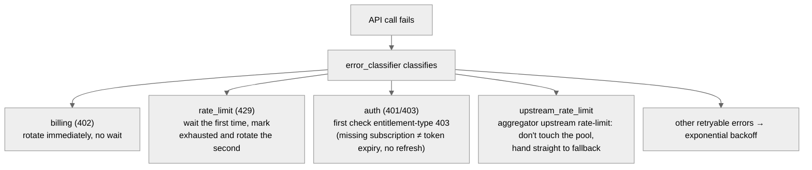

**Figure: The four branches of credential-layer recovery — different failure reasons take different recovery strategies**

A few key judgments:

- **The first 429 doesn't immediately switch credentials** — a rate limit may be merely transient, the Provider's rate-limit window may reset within seconds, and switching immediately wastes a key that could have recovered (except when the credential is already in the exhausted state, in which case it skips the wait and rotates directly)
- **A 402 (billing exhausted) has no reason to wait** — the balance won't recover within seconds, so it rotates immediately to the next credential
- **A 403 first does an entitlement check** (from `:858`) — "the account lacks this subscription" looks the same on the wire as "token expired," but refreshing the token can't save the former; without distinguishing them you'd fall into a pointless refresh loop. There is also a refresh-attempt cap for protection: a single-entry OAuth pool may "always refresh successfully but always be rejected upstream," and the `_MAX_AUTH_REFRESH_ATTEMPTS` counter prevents infinite refreshing (#26080)
- **Whether to fall back early depends on whether the pool can still be saved** — `_pool_may_recover_from_rate_limit()` (referenced at `conversation_loop.py:3168-3178`): as long as the pool still has rotatable credentials, don't rush to switch Providers; only a case like upstream_rate_limit, where "switching keys won't help," falls back unconditionally

Beyond these four main paths, the classifier also recognizes a batch of **auto-repairable-and-retryable** specialized errors: auto-shrinking oversized images, degrading to plain text when multimodal tool content isn't supported, auto-removing the beta header after Anthropic OAuth's 1M-context beta is rejected, auto-refreshing on Codex/xAI OAuth 401. Nous Portal's 429 also has a cross-session circuit breaker (`agent/nous_rate_guard.py`) — the rate-limit state is written to a shared file, so other sessions on the same machine stop retrying directly rather than each hitting it once.

Retry handles "transient failures under the same credential." But what if the key itself gets rate-limited? That needs another layer — credential rotation.

### Credential Pool: Lifecycle Management of Multiple Keys

Early on, only one API key was needed. But once Hermes supported OAuth login, credential management got complicated: tokens have expiry times and need refreshing; a team might share multiple keys to spread quota.

`agent/credential_pool.py` (2,384 lines) is a stateful credential container. Each time the Agent calls the model, instead of taking a fixed key directly, it asks the Credential Pool for "a currently-available credential."

The pool offers four selection strategies (`credential_pool.py:98-101`, configured via `credential_pool_strategies`):
- **fill_first** (default) — use the highest-priority credential first, only using the next when rate-limited
- **round_robin** — rotate to the tail each time, for load balancing
- **random** — pick at random, a simple decorrelation strategy
- **least_used** — pick the least-used one, ensuring even consumption

Each credential flows among three persistent states:

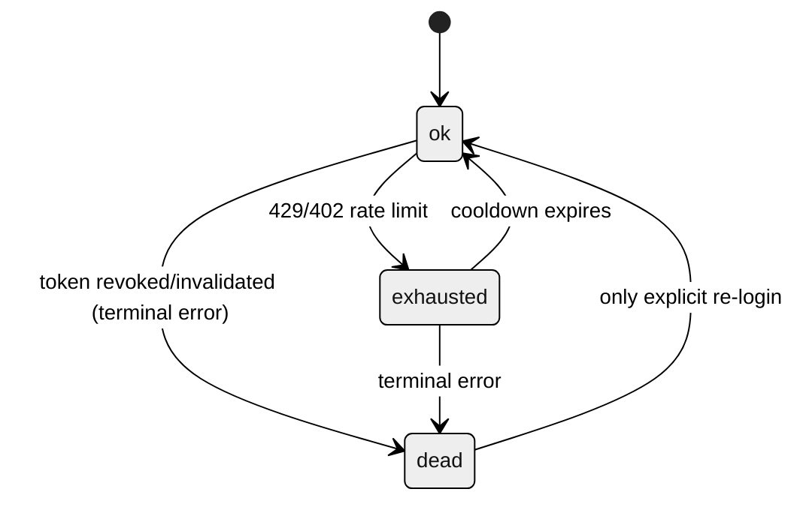

**Figure: The three persistent-state transitions of a single credential**

The `exhausted → ok` cooldown has three tiers (`credential_pool.py:113-115`): a 401-triggered short cooldown of **5 minutes** (so single-key users recover quickly), a 429-triggered **1 hour**, and a default of **1 hour** for others; if the Provider gave a `reset_at` timestamp in the response, that takes precedence. Beyond `STATUS_OK` (`credential_pool.py:57`) and `STATUS_EXHAUSTED` (`:58`), since v0.16 there is `STATUS_DEAD` (`:65`) — a credential marked by a set of **terminal OAuth errors** (`token_invalidated`, `token_revoked`, `invalid_grant`, etc., `_TERMINAL_AUTH_REASONS`, `:70-77`) never self-heals, and a retry after cooldown is doomed to fail, so it's unconditionally excluded from rotation; only an explicit re-login (write-side sync) can revive it; a manually-added dead credential is cleaned up after 24 hours (`:90`). OAuth token refresh isn't a separate state — it's triggered automatically when selecting a credential, and during refresh the credential stays in the `ok` state; a failed refresh skips that credential but doesn't mark it `exhausted`.

A common misconception is that the Credential Pool is managed by the Agent. In fact, **the pool is created by the CLI/Gateway layer** (`hermes_cli/runtime_provider.py` calls `load_pool()` to load and inject it, and the reading/writing of credential data is in `hermes_cli/auth.py`), ready before the Agent is created, injected via the `credential_pool=pool` parameter. The Agent is just a consumer — it selects credentials from the pool, marks rate-limit states, and triggers token refresh, but isn't responsible for where the credentials come from.

Where credentials come from was itself systematized in v0.17-0.18. `agent/credential_sources.py` (443 lines) defines a unified **removal contract** for each credential source (`env:<VAR>`, Claude Code's credentials.json, PKCE OAuth, device-code login, qwen-cli, gh CLI, a config custom entry, a manual `hermes auth add`) — so on logout/deletion of a credential it knows which file to clean up. The write-to-disk boundary has another line of defense: `agent/credential_persistence.py` (174 lines) strips the raw values of "borrowed" runtime secrets before the credential pool writes to `auth.json` — a key borrowed from an environment variable stores only a reference, not the value. Multi-Profile gateway multiplexing (Chapter 01's multiplex) relies on `agent/secret_scope.py` (205 lines): each Profile's `.env` secrets are placed in a contextvar scope that propagates with the task, **without process-level merging** — otherwise Profile A's key would leak into Profile B's turns and every subprocess.

### Fallback Chain: Automatic Fallback Across Providers

Retry and credential rotation handle "recovery within the same Provider." But what if the entire Provider is down — the Fallback Chain solves a higher-level problem: **automatically switching to a completely different Provider and model**.

`_try_activate_fallback()` (`run_agent.py:4741`) triggers after both retry and credential rotation are exhausted. `fallback_model` can be a single dict or an ordered list (a chained fallback):

```yaml
# config.yaml example
model:
  default: "anthropic/claude-opus-4.6"
  fallback_model:
    - provider: "openrouter"
      model: "deepseek/deepseek-r1"
    - provider: "openai"
      model: "gpt-4.1"
```

Main → fallback 1 → fallback 2, tried in a chain. The switch is temporary — `_restore_primary_runtime()` (`run_agent.py:4760`) tries to restore the main one in the prologue of each new turn (`turn_context.py:174`), switching back automatically on success, transparently to the user.

In the CLI scenario, the user can switch manually with `/model`; but in the gateway scenario (multiple users sharing one service), you can't rely on manual intervention. The Fallback Chain lets the Gateway keep serving automatically during a Provider outage, with no user involvement.

If no `fallback_model` is configured, continuous failures eventually return an error to the user — the worst case, but also an explicit failure, not a silently-dropped message.

#### The Three-Level Progression of Error Recovery

Retry, credential rotation, and Fallback aren't three parallel mechanisms — they are **a progressive three-line defense**, each solving what the previous one can't handle:

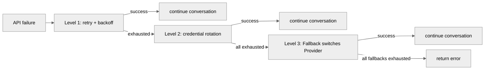

**Figure: The three-level progression of error recovery — retry → credential rotation → Fallback, each level solving what the previous can't**

When troubleshooting API errors, locate the issue in this order: first look at the retry count in the log (was backoff triggered?), then the credential state (any key marked exhausted or dead?), and finally whether Fallback activated (the `_fallback_activated` flag).

### Streaming Response: Making the Wait Bearable

Returning the whole response at once after the model finishes generating is a terrible experience — several seconds of blank waiting, then a big block of text suddenly appears. Streaming responses deliver tokens to the user as they're generated.

But Hermes faces an extra challenge: model responses come in two kinds — **plain-text replies** and **tool calls**. Only the former should be streamed to the user; the latter are internal dispatch instructions for the Agent itself.

`_fire_stream_delta()` (`run_agent.py:4650`) is the core of streaming dispatch. As each text token arrives, it first passes two scrubbers: `_stream_think_scrubber` removes reasoning/thinking blocks (take the `<think>` tag as an example — it shouldn't leak to the user interface), and `_stream_context_scrubber` removes internal memory-context markers. After filtering, it dispatches to two callbacks:
- `stream_delta_callback` (used by the CLI to drive terminal output)
- `stream_callback` (used by the TTS voice-synthesis pipeline to start speaking as the text is generated, `conversation_loop.py:529`)

**Tool-call rounds are completely silent** — the user won't see intermediate text like "let me search the web" popping out character by character. Hermes uses a tool-progress callback (`tool_progress_callback`) and the `KawaiiSpinner` animation instead, keeping the output area clean.

The "stall" detection of streaming (stale stream) became three-tiered in v0.18: a Provider-level configured timeout takes precedence (`chat_completion_helpers.py:2866`); otherwise it uses the `HERMES_STREAM_STALE_TIMEOUT` environment variable, default 180 seconds (`:2870`); local engines (Ollama, llama.cpp, etc.) disable detection by default (`:2874`, a large local-context prefill can reasonably exceed 300 seconds), and large-context scenarios also scale the timeout by context size. **Reasoning models have a dedicated floor table**: `agent/reasoning_timeouts.py` (216 lines) sets wider per-model timeout floors for models like o1/o3, Opus thinking, DeepSeek R1, QwQ, and Grok reasoning that "think for a long time before emitting the first token" — the module comment records the empirical basis (the NVIDIA NIM gateway kills idle connections at about 120 seconds, while a model's TTFB can start at 31 seconds).

The mechanisms discussed so far — caching, streaming, retry, credential rotation, Fallback — all handle "doing the same thing but hitting an obstacle" or "how to deliver the result to the user." The next two sections are a different kind of problem: what to do when one model / one Agent isn't enough.

### MoA: Having Multiple Models Advise on the Same Question

v0.18 refactored the old `mixture_of_agents` **tool** into an **MoA loop mode** (done atomically in a single commit `c6575df92`: delete the tool, create `agent/moa_loop.py`). The design stance is written in the first paragraph of the module comment (`moa_loop.py:1-7`): `/moa` **is deliberately not made a model tool** — it marks a user turn as MoA-enabled, the normal Hermes agent loop still holds tool-calling and turn-termination authority, and moa_loop is only responsible for gathering the reference models' opinions before the model iterates.

In implementation there are **two different paths**, depending on how it's triggered:

```mermaid
%%{init: {"theme": "neutral", "themeVariables": {"fontSize": "14px"}, "flowchart": {"nodeSpacing": 15, "rankSpacing": 25}}}%%
flowchart TD
    subgraph P1 ["Path 1: marker encoding (text-only frontend / gateway)"]
        U1["message carries __HERMES_MOA_TURN_V1__"] --> D1["conversation_loop decodes<br/>#40;:557-559#41;"]
        D1 --> FAN1["aggregate_moa_context #40;:571#41;<br/>reference fan-out + aggregator itself synthesizes one opinion"]
        FAN1 --> INJ1["synthesized opinion spliced into user message #40;:857-872#41;"]
        INJ1 --> ACT1["the one that continues is still the current model<br/>#40;not necessarily the preset's aggregator#41;"]
    end
    subgraph P2 ["Path 2: MoA virtual provider (/moa one-shot, /model moa:preset)"]
        U2["provider = moa"] --> C2["agent.client swapped to MoAClient<br/>#40;agent_init.py:856#41;"]
        C2 --> INT["MoAChatCompletions.create#40;#41;<br/>intercepts every model call"]
        INT --> FAN2["reference fan-out ≤8 concurrent"]
        FAN2 --> ACT2["aggregator directly acts as<br/>the model executing tool calls"]
    end
```

**Figure: The two implementation paths of MoA — marker encoding is "synthesize an opinion then hand back to the original model," the virtual provider is "the aggregator acts as the main loop"**

- **Path 1 (marker encoding)**: `aggregate_moa_context()` (`moa_loop.py:571`, injection point `conversation_loop.py:853-874`) queries the reference models concurrently, then **calls the aggregator model once itself** to synthesize the various opinions into a block of text, spliced into the current user message — and the model that continues running the tool loop afterward is still the one from before the trigger. This path is for frontends that can't switch Providers
- **Path 2 (virtual provider)**: when `provider=moa`, `agent.client` is replaced by `MoAClient` (`moa_loop.py:1041`, assembled at `agent_init.py:856`), and its `create()` intercepts **every** model call: reference fan-out first, then **the aggregator directly acts as the model executing tool calls** (the docstring reads "the aggregator is the acting model"). The `/moa` one-shot sugar and `/model moa:<preset>` (including the bare preset-name implicit match, PATH B of Chapter 01's model_switch) both take this path

Mechanisms shared by both paths:

1. **Reference calls have no tools and are independent of each other** — a reference model receives a dedicated advisor system prompt (`_REFERENCE_SYSTEM_PROMPT`, `moa_loop.py:100`, explicitly telling it "you cannot call tools, your opinion is private advice"), and the tool results passed to it are trimmed to 4,000 characters head and tail (`_REFERENCE_TOOL_RESULT_BUDGET`, `:91`) to prevent context blowup; the concurrency cap is `_MAX_REFERENCE_WORKERS = 8` (`:27`)
2. **The fan-out cadence is configurable** (`fanout`, `moa_loop.py:847-878`): the default `per_iteration` re-asks the advisors on every tool iteration (they can see the new tool results); `user_turn` asks only once per user turn and reuses the cache in subsequent iterations (judged by a signature hash). This is the main cost switch for MoA: a round of 10 tool iterations is 10 rounds of reference fan-out in the default mode
3. **Billing is independent**: `_RefAccounting` (`moa_loop.py:30`) prices each reference model at **its own rate** — folding the advisors' tokens into the aggregator's usage would "mis-bill each advisor" (the comment's words). `agent/moa_trace.py` (167 lines) archives the complete actual input and output each advisor saw, for later audit
4. **Configuration**: presets (the reference-model list + aggregator + sampling parameters + fanout) live in config's `moa.presets`, managed by the `hermes moa` subcommand; at the Provider layer MoA appears as a virtual provider (`moa://local`, step 1 of Chapter 01's runtime_provider chain)
5. **The failure semantic is fail-open**: when a reference model times out/errors, it **doesn't raise an exception to abort the round**, but instead feeds `[failed: {exc}]` to the aggregator as a labelled opinion (`moa_loop.py:324-329`, the comment reads "Never raises: a failed reference becomes a labelled note"), and the corresponding `_RefAccounting` billing is zeroed. So when one advisor dies, `/moa` **degrades and continues** this round rather than failing entirely — the aggregator knows whose opinion is missing

Why not make it a tool? Making it a tool would mean the model itself decides "when to convene advisors" — but multi-model consultation is expensive, and one fan-out may burn three models' worth of tokens. Leaving the decision to the user (slash command / model selection) and putting the mechanism in the loop makes the cost boundary clear: fan out only when the user names it, and `fanout` decides the fan-out frequency.

### Another Execution Path: Codex App-Server Runtime

MoA is "ask a few more models within the main loop," but Hermes has a more thorough alternative path — **delegating the entire tool loop wholesale**. When the model is `openai/*` or `openai-codex/*` and a Codex CLI is installed locally with the corresponding config enabled, `run_conversation()` no longer drives the tool loop itself but goes through `_run_codex_app_server_turn()` (call site `conversation_loop.py:630`, implementation `agent/codex_runtime.py`, 930 lines): a whole round of conversation is handed to the Codex CLI's own app-server subprocess — with its own tool loop, sandbox, and `apply_patch` — and Hermes only provides the shell of session history, gateway delivery, and memory-and-skills, translating Codex's `item/started` and other notifications back into Hermes tool-progress events.

This explains something easily misunderstood: `AIAgent.run_conversation()` **is not the only execution entry point**. In most cases it runs the tool loop itself; in MoA mode it fans out to advisors at each model call; in Codex runtime mode it hands the whole round to the external app-server. The three are three landings of the same `run_conversation()` — if you read the source only watching the default tool loop, you'll miss the latter two paths.

### Subagents: Splitting Tasks Horizontally

If the parent Agent is a project manager, a subagent is the specialized contractor it outsources to — receiving a clear subtask, with its own budget, reporting the result when done. When the user says "analyze these three files then write a report," the analysis can be parallel, but the report has to wait for the analysis. If a single Agent did it serially, it would take three times as long. `tools/delegate_tool.py` (3,459 lines) lets the Agent spawn subagents to handle subtasks in parallel.

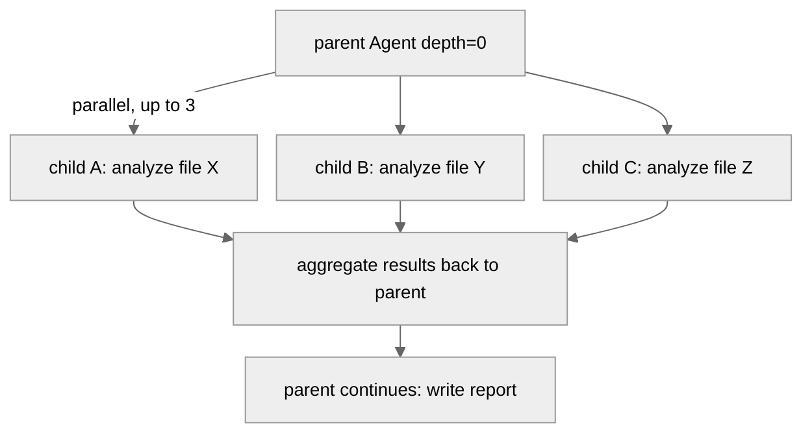

**Figure: The parent Agent splits three subagents in parallel and continues after aggregating**

Subagents run in a `ThreadPoolExecutor`, with a default of up to 3 concurrent (`_DEFAULT_MAX_CONCURRENT_CHILDREN = 3`, `delegate_tool.py:118`). Each subagent gets its own `IterationBudget`, default cap 50 (`delegation.max_iterations`, `delegate_tool.py:586`), not deducted from the parent's budget. This means a parent + three subagents can in theory execute 90 + 3×50 = 240 iterations.

#### Security Isolation

A subagent isn't a full clone of the parent. Its toolset is a **subset** of the parent's (an intersection, `delegate_tool.py:549-570`), and six tools are force-disabled (`DELEGATE_BLOCKED_TOOLS`, `delegate_tool.py:45-53`):

| Disabled tool | Reason (paraphrased from the source comment) |
|---------------|----------------------------------------------|
| `delegate_task` | prevent infinite recursion (unless the role is `orchestrator`) |
| `clarify` | a subagent is on a background thread, has no stdin, and can't interact |
| `memory` | avoid conflicts from multiple subagents concurrently writing MEMORY.md |
| `send_message` | prevent a subagent from sending cross-platform messages on its own |
| `execute_code` | force step-by-step reasoning, no shortcut of writing a script |
| `cronjob` | don't allow scheduling more follow-up work in the parent's name |

Nesting depth defaults to 1 level (`MAX_DEPTH = 1`, `delegate_tool.py:125`) — a parent spawns children, but children can't spawn grandchildren. `delegation.max_spawn_depth` can loosen this, and it **has no upper bound** (`:129-131` comment: like the concurrency count, it has only a floor of 1; a deeper tree multiplies API cost, so the default is flat and going deeper is explicit opt-in). If you need a subagent to keep `delegate_task`, set `role: "orchestrator"` for it.

#### Approval and Error Handling

Subagents run in separate threads, lacking the CLI's interactive context. If a subagent wants to execute a dangerous command (take `rm -rf` as an example), the parent Agent's approval callback isn't visible to it. The default behavior is `_subagent_auto_deny` (`delegate_tool.py:74`) — automatically deny all operations requiring approval. For cron tasks or batch-run scenarios, you can configure `delegation.subagent_auto_approve: true` to loosen the restriction (`:68-88`).

If a subagent crashes (exits with an exception), the `ThreadPoolExecutor` catches the exception, and the parent Agent receives a result containing the error info — it won't crash the parent Agent. The `_active_subagents` registry (`delegate_tool.py:146`) lets the TUI display in real time how many subagents are currently running and what each is doing, and supports interrupting an individual subagent.

Two more easily-overlooked boundary behaviors:

- **Result aggregation has overflow protection**. N subagents each return a complete summary, and stuffing them all back into the parent's context at once may blow the parent up directly — this is the real incident recorded in issue #9126 (triggering a compression/429 death loop). Now `_apply_summary_budget()` (`delegate_tool.py:1664`) dynamically allocates each summary's character budget based on the parent Agent's **remaining context space** (`_parent_summary_char_budget()`, `:1624`: half the remaining space divided by the number of subtasks, `_SUMMARY_HEADROOM_FRACTION = 0.5`, `:595`), and over-budget summaries are trimmed to a head + a file pointer to the full version written to disk
- **Subagents have no wall-clock timeout by default** (`delegation.child_timeout_seconds` defaults to `None`, `_get_child_timeout()`, `:425-433`) — the old one-size-fits-all timeout used to kill legitimate long tasks like deep code reviews and large research fan-outs mid-way. Stuck detection is instead backstopped by heartbeat-staleness monitoring: a stuck subagent stops refreshing the parent's activity signal and is eventually wrapped up by the Gateway layer's overall inactivity timeout. A hard timeout is enabled only when a positive number is explicitly configured (with a 30-second floor)

Whether a single Agent or multi-level subagents, at the end of each conversation run the system can save the complete execution trajectory — that's why the Trajectory mechanism exists.

### LSP Integration: Letting the Agent See the "Red Squiggles" When It Edits Code

The red squiggles in VS Code — a misspelled variable name, a type mismatch, a symbol not found — are reported in real time by the language server analyzing behind the scenes. A code-writing Agent that lacks this feedback can only repeatedly run `terminal` lint/type checks — slow and easy to miss. Hermes's LSP integration (`agent/lsp/`) wires this "editor-level diagnostics" straight into the Agent: the Agent finishes editing a file and immediately sees a semantic error like "line 42: cannot find name 'foo'" in the tool result. But how does the LSP know which file the Agent edited, and when does it step in?

**The integration point is after the file write, not in the conversation loop**. When the Agent calls `write_file` or `patch`, `tools/file_operations.py` runs the LSP once before and once after the write: before writing it calls `_snapshot_lsp_baseline` (`file_operations.py:1869`) to record all current LSP diagnostics of the file as a "baseline"; after writing it calls `_maybe_lsp_diagnostics` (`:1892`) to get the new diagnostics, diffs the old and new, and merges only the diagnostics **newly introduced by this edit** into the tool output's `lsp_diagnostics` field. This means the Agent doesn't need to actively "go check for errors" — it finishes editing the code, and the errors surface on their own. There's a prerequisite: **the LSP is requested only when the syntax check passes** (`lint_result.success or skipped`) — when the file itself has broken syntax it isn't queried, to avoid stacking two layers of noise (syntax errors and semantic errors).

**The core is `LSPService` (`agent/lsp/manager.py:133`), a process-level singleton** that starts and reuses language-server processes on demand. The `SERVERS` list in `agent/lsp/servers.py` (`servers.py:971`) registers 27 language servers (pyright, gopls, rust-analyzer, typescript-language-server, clangd, etc.), and subsequent requests for the same `(server, workspace)` pair directly reuse the already-started process. Diagnostics are formatted by `agent/lsp/reporter.py` — by default it **reports only ERROR level** (`DEFAULT_SEVERITIES = frozenset({1})`, `reporter.py:17`, to avoid warning/hint spam), at most 20 per file (`MAX_PER_FILE`, `reporter.py:19`), and no more than 4,000 characters total (`MAX_TOTAL_CHARS`, `:20`).

An inconspicuous but critical design detail: **line-number offset handling** (`agent/lsp/range_shift.py:33 build_line_shift`). After an edit inserts/deletes a few lines, the line numbers of all diagnostics in the latter half of the file shift — if not handled, "errors that already existed" would be treated as "newly introduced by this edit" because their line numbers changed, giving the Agent a pile of false noise. `build_line_shift` uses `difflib` to build a line-number mapping between the pre- and post-edit text, shifting the baseline diagnostics' line numbers to their post-edit positions before diffing, ensuring only truly-new errors are reported.

On failure there are several layers of degradation, ensuring that any LSP link failing doesn't ripple into `write_file` itself:

- **Scope limitation**: it runs only within a git workspace, avoiding starting a daemon in an unrelated directory; and it **activates only on the local backend** — under remote sandboxes like Docker/Modal/SSH/Daytona it's skipped entirely (a language-server process can't reach the files inside the sandbox, `_lsp_local_only`, `file_operations.py:1791`), so the file is still written but with no diagnostics.
- **broken-set**: a server that times out on startup or crashes is recorded in a broken set, and subsequent requests skip it directly rather than waiting on the timeout again.
- **Isolated installation**: when a binary is missing, it's auto-installed to `<HERMES_HOME>/lsp/bin` per `install_strategy` (without polluting the system PATH); if it can't install, it silently skips.

Configurability is in the `lsp:` section of `config.yaml` (`enabled`, `wait_mode`, `install_strategy`, and per-language `servers:` overrides for binary path/init options).

> 📖 **Further Reading**: [LSP Integration](https://hermes-agent.nousresearch.com/docs/user-guide/features/lsp)

### Trajectory: From Runtime to Training Data

`agent/trajectory.py` (56 lines) is the simplest and most independent module in the Agent core. After `run_conversation()` returns normally (now triggered by `turn_finalizer.py`), it appends the complete conversation sequence to a JSONL file (ShareGPT-compatible format). It doesn't affect any core logic, and its dependency on the main flow is one-directional — removing it breaks no functionality.

Successful ones go to `trajectory_samples.jsonl`, failed ones to `failed_trajectories.jsonl` — failure cases are just as valuable to researchers, even more so ("where the model erred" is as important as "what it got right"). Nous Research uses these trajectories to train the next generation of tool-calling models, one of the infrastructure pieces behind Hermes's "research-ready" positioning. Disabled by default. Note that `batch_runner.py` doesn't use this mechanism (it explicitly sets `save_trajectories=False` and stores its own separately, see Chapter 12) — this simple `agent/trajectory.py` storage actually serves only the interactive CLI's `--save_trajectories` flag.

### Auxiliary Model: The Unified Scheduler for Side Tasks

Context compression needs a "cheap model" to summarize, vision analysis needs a "model that can see images" to describe, web extraction needs a model to clean up content — these "side tasks" shouldn't consume the main model's quota and latency.

`agent/auxiliary_client.py` (7,469 lines) is the unified router for all side tasks. `call_llm()` (`auxiliary_client.py:6371`) resolves the auxiliary model by task name — the task types listed in the docstring are compression, vision, web_extract, session_search, skills_hub, mcp, title_generation. Resolution order: task-level config (a provider:model specified by config/env) → explicit parameter override → `auto` auto-detection (`_resolve_auto`, defined at `:4104`, called at `:4510`, trying available Providers by priority; the call site also handles corrections like "when an OpenRouter-format model name lands on a local Provider, auto-swap it for that Provider's default model").

Vision tasks and text tasks take different resolution paths — vision needs a multimodal model, text needs only a cheap, fast model. If all fallbacks are unavailable, the side task fails silently (take context compression as an example: after a compression failure it falls back to continuing without compression, and won't try again within 600 seconds).

This component is shared by many consumers — context compression (`context_compressor.py`), memory review (`background_review.py`), vision analysis, web extraction, smart approval, etc. — none of which need to care where the auxiliary model comes from; they just call `call_llm()` and get a result. MoA's reference-model queries reuse it too.

### ContextEngine: A Pluggable Context Strategy

`agent/context_engine.py` (the `ContextEngine` ABC, `context_engine.py:32`) defines the pluggable interface for context management. The default implementation is `ContextCompressor` (the "protect head and tail, compress the middle" summarization strategy, `context_compressor.py` is now 3,082 lines), but a third-party engine can replace it via a plugin.

ContextEngine's core interface and lifecycle methods:
1. `update_from_response(usage)` (`:71`) — update the token count after each LLM call (in v0.18 the usage dict also carries breakdown buckets like cache_read/cache_write/reasoning)
2. `should_compress(prompt_tokens)` (`:83`) — decide whether compression is needed
3. `compress(messages, system_prompt)` (`:87`) — perform compression
4. `on_session_start()` / `on_session_end()` / `on_session_reset()` (`:144-158`) — session-level lifecycle

The base class also carries three protection parameters (`:64-66`): the compression-trigger threshold `threshold_percent = 0.75`, head protection `protect_first_n = 3` messages, tail protection `protect_last_n = 6` messages — "protect head and tail" isn't the compressor's private implementation but an interface-level contract. Configuration is controlled via `context.engine` (default `"compressor"`). The engine's key state (`threshold_tokens`, `context_length`, `compression_count`) is read directly by pre-flight compression and the pre-call pressure recheck.

The default implementation `ContextCompressor.compress()` (`context_compressor.py:2707`) has a five-step algorithm (docstring `:2710-2715`):

1. Trim old tool results (cheap preprocessing, no LLM call)
2. Protect head messages (system prompt + first exchange)
3. Find the tail boundary by token budget (a **dynamic** boundary of about 20K tokens, not a fixed count)
4. Use a structured prompt to have the summary LLM compress the middle rounds
5. On repeated compression, iteratively update the previous summary (rather than re-summarizing from scratch)

After compression it also cleans up orphaned tool_call/tool_result pairs, ensuring the API never receives a mismatched ID.

**Compression itself can also fail** — summarization relies on an auxiliary LLM, which can also 401, drop the network, or time out. On failure it takes one of three branches:

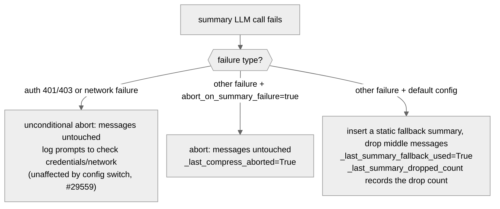

**Figure: The three degradation branches of a compression failure — auth/network failures never drop messages**

The reason for the unconditional abort on auth/network failure is written in the comment (`context_compressor.py:1099-1109`): trapping the user in a degraded session where "the credential is already broken and the history was quietly dropped" is pointless — the original messages stay unchanged, waiting for the credential/network to recover. And the default path's static fallback means: if you notice "the Agent seems to have forgotten the middle of the conversation," it's worth checking whether it took this branch (`_last_summary_dropped_count`). The switch is `compression.abort_on_summary_failure` (default false).

The several mechanisms discussed above — caching, retry, credential rotation, Fallback — all operate quietly at the bottom. But two more problems need solving before the Agent runs: how large is the model's context window? Is the Agent healthy, and how much has it spent?

### Model Metadata: Finding a Model's True Parameters in a Chaotic Ecosystem

`agent/model_metadata.py` (2,434 lines) solves a seemingly simple problem: how large is the current model's context window?

The same model accessed through different paths may have completely different parameters — take GPT-5.5 as an example: via Codex OAuth it's 272K context, via a direct OpenAI API it's 1.05M. A local model's context depends on GPU VRAM allocation. Some Providers' APIs don't return metadata at all.

`get_model_context_length()` (`model_metadata.py:1886`) implements a dozen-plus-level fallback chain (order copied from the function docstring `:1895-1916`):

```
0.  config.yaml explicit override (model.context_length / custom_providers per-model) → if the user set it, stop here
1.  persistent cache (previously-probed result; a Nous URL bypasses the cache so 5b can always reconcile the authoritative value)
1b. AWS Bedrock static table (must precede custom-endpoint probing)
2.  custom-endpoint /models API probe
3.  local-server query (Ollama /api/show, LM Studio, llama.cpp /v1/props)
4.  Anthropic /v1/models API (API-key users only)
5.  Provider-aware query: Copilot /models, Nous online probe, Codex OAuth, GMI,
    Ollama native probe, the models.dev registry (5f)
6.  OpenRouter online API metadata
7.  local-server query again (before the hardcoded defaults, :2271)
8.  hardcoded default table (fuzzy match, longest key wins, :2281)
9.  final fallback → 256K (:2292)
```

Note the local server appears twice (3 and 7) — step 3 probes early for an explicit local endpoint, step 7 is the last real-measurement chance before falling to the hardcoded table.

The result found is cached: OpenRouter metadata for 1 hour, custom endpoints for 5 minutes. If none of the levels hit, it falls back to 256K (`DEFAULT_FALLBACK_CONTEXT = CONTEXT_PROBE_TIERS[0]`, `model_metadata.py:180`) — a value large enough for most models to work, but if the actual context is smaller than 256K, the compressor auto-corrects at runtime. There's also a hard floor: a model with context below 64K is rejected outright (`MINIMUM_CONTEXT_LENGTH`, `:185`) — the minimum working memory a tool-calling workflow needs.

Over-engineered? Given that Hermes ships with 36 Provider presets and various local engines, each with its own metadata-query method (or none at all), this fallback chain is driven by real need. When troubleshooting a "wrong context length" issue, check from level 0 of this chain downward to locate which data source returned the wrong value.

### Billing and Observability

**`agent/display.py`** (1,440 lines) handles **real-time observability** — what the terminal shows as the Agent executes tools. The tool-execution preview, the completion line (emoji + verb + duration), inline diff display, and the `KawaiiSpinner` thinking animation. The spinner isn't just decoration — during a long wait it gives the user a "the system is still alive" signal.

**`agent/insights.py`** (921 lines) handles **after-the-fact observability** — the `/insights` command shows usage statistics: token consumption, estimated cost, breakdowns by model/platform/tool.

v0.17-0.18 added **money observability** on this line: `agent/credits_tracker.py` (794 lines) parses the `x-nous-credits-*` family in the Nous inference API response headers (balance, subscription balance — which can be negative to indicate arrears, consumption) into a validated `CreditsState`, providing balance-exhaustion detection; `agent/billing_view.py` (295 lines) is the surface-agnostic core of the billing UI — the same parse is shared by the CLI's `/billing` and the TUI's JSON-RPC method, amounts use `decimal.Decimal` throughout (the server sends decimal strings, and floats would lose cents), and when not logged in / the service is unreachable it fails open and degrades rather than crashing.

None of these modules affect the Agent's core logic — remove them entirely and the Agent works as usual. They are a one-directionally-dependent observability layer. A similar lightweight new member is `agent/context_breakdown.py` (156 lines, the `/context` context-usage analysis — how much the system prompt / tool schemas / history each take).

### Code Organization

```
run_agent.py                  — the AIAgent class + forwarder functions (6,013 lines)
agent/
├── conversation_loop.py      — the core conversation loop (5,312 lines)
├── turn_context.py           — per-turn prologue: once-per-turn preparation (565 lines, extracted from a god-file)
├── turn_finalizer.py         — per-turn epilogue: persistence/review triggering (507 lines, ditto)
├── turn_retry_state.py       — in-turn retry-recovery state (80 lines, ditto)
├── iteration_budget.py       — iteration-budget counter (62 lines)
├── moa_loop.py + moa_trace.py — MoA reference fan-out + audit archive (1,073 + 167 lines)
├── auxiliary_client.py       — auxiliary LLM client (7,469 lines)
├── agent_init.py             — Agent initialization (2,103 lines)
├── credential_pool.py        — credential-pool management (2,384 lines)
├── credential_sources.py     — unified credential-source contract (443 lines)
├── credential_persistence.py — write-to-disk boundary secret stripping (174 lines)
├── secret_scope.py           — Profile-level secret scope (205 lines)
├── model_metadata.py         — model-metadata resolution (2,434 lines)
├── context_compressor.py     — context compression (3,082 lines)
├── context_engine.py         — context-strategy ABC (231 lines)
├── prompt_builder.py         — prompt building (1,971 lines)
├── error_classifier.py       — API error classification (1,598 lines)
├── reasoning_timeouts.py     — reasoning-model timeout-floor table (216 lines)
├── credits_tracker.py        — Nous credits-header parsing (794 lines)
├── billing_view.py           — billing-view core (295 lines)
├── display.py                — real-time observability (1,440 lines)
├── insights.py               — after-the-fact statistics (921 lines)
├── system_prompt.py          — three-layer system-prompt assembly (536 lines)
├── prompt_caching.py         — Prompt Cache marking (119 lines)
├── retry_utils.py            — backoff algorithm (154 lines)
├── trajectory.py             — trajectory saving (56 lines)
├── lsp/                      — LSP integration (27 language servers)
├── transports/               — Provider adaptation layer (already covered in Chapter 00)
│   ├── base.py               — ProviderTransport ABC
│   ├── chat_completions.py   — OpenAI-compatible
│   ├── anthropic.py          — Anthropic native
│   ├── bedrock.py            — AWS Bedrock
│   └── codex.py              — OpenAI Codex Responses
└── ...(another ~100 files)
```

### Design Decisions

#### From God File to Ongoing Decomposition

v0.11.0's `run_agent.py` had 13,293 lines; v0.14.0 shrank it to 4,309 lines after extracting the core loop; by v0.18.2 it had grown back to 6,013 lines — the gravity of new features always exists. The answer from v0.17's god-file decomposition campaign wasn't "cut once more" but to give the loop's head and tail a bounded home each: the prologue into `turn_context.py`, the epilogue into `turn_finalizer.py`, the retry state into `TurnRetryState`. The split was deliberately verbatim/behavior-neutral — move first, don't rewrite (the module comment at `turn_finalizer.py:1-21` records this principle in detail). The stability of `AIAgent` as an external API is never affected.

#### MoA Not Made a Tool

Making "multi-model aggregation" (MoA) a tool the model can call autonomously (the v0.14 approach) means the model itself decides when to spend triple the money. v0.18 refactored it into a user-explicitly-triggered loop mode + virtual provider — moving the cost decision from the model's hands back to the user's. This is a sample of a "which layer to put a capability at" architectural decision: the same functionality, made as a tool, a loop mode, or a Provider, has completely different cost models and user experiences.

#### The Introduction of the Error Classifier

v0.11.0's error handling was hardcoded if-else. Since v0.14, `error_classifier.py` was introduced — a dedicated classifier whose input is an exception object and output is a structured `ClassifiedError`. The core loop no longer needs to understand the semantics of each error — it just asks the classifier "what to do." v0.17 also consolidated the state of "which recovery measures have been tried this round" into `TurnRetryState`, with the classifier managing "what to do" and the state object managing "what has been done."

### Extension Points

1. **Custom Transport**: implement the four methods of `ProviderTransport` to support a new Provider
2. **Custom ContextEngine**: implement the `ContextEngine` ABC to replace the default compression strategy
3. **Custom MemoryProvider**: inject an external memory backend via a plugin
4. **Fallback Chain**: configure a chained fallback via `fallback_model`
5. **MoA preset**: customize the reference-model combination and aggregator via `moa.presets`

---

## Relationship to Other Chapters

| Related Chapter | Relationship |
|-----------------|--------------|
| 00 — Project Overview | The overview of the Agent core loop and the Transport layer is given in Chapter 00 |
| 01 — Infrastructure Layer | hermes_cli creates the AIAgent and injects credentials and config; the MoA virtual provider short-circuits at step 1 of the runtime_provider chain; secret_scope supports gateway multi-Profile multiplexing |
| 03 — Tool System | The Agent dispatches tools via model_tools.py, and the tool layer is the Agent's "hands and feet"; the old mixture_of_agents tool has been refactored into this chapter's MoA loop |
| 04 — Skill System | The skill-review trigger point is in turn_finalizer.finalize_turn |
| 05 — Gateway Layer | The Gateway creates and caches AIAgent instances (≤128) |
| 07 — Plugin Framework | Plugins inject hooks via PluginContext, stepping in at multiple points of the Agent loop |
| 12 — Batch Running | The toolset distributions were adjusted after the moa tool was removed |

---

*This document is based on source analysis of hermes-agent v0.18.2. All code references have been independently verified.*
