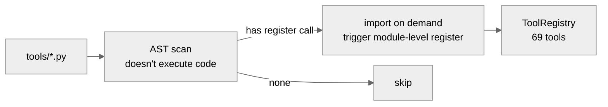
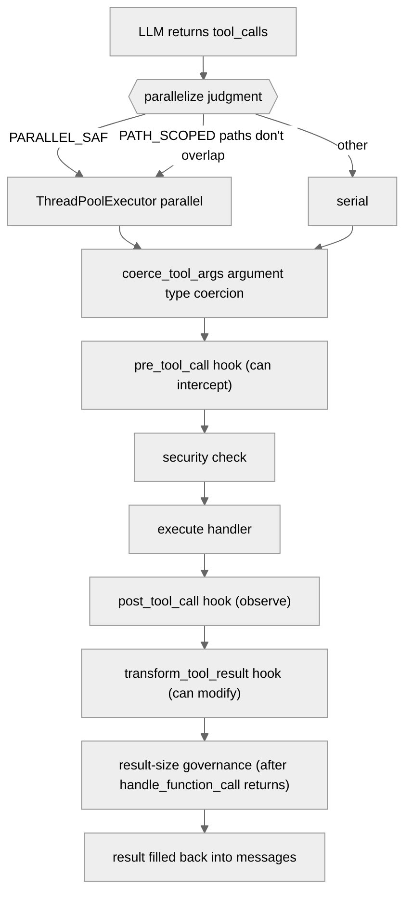
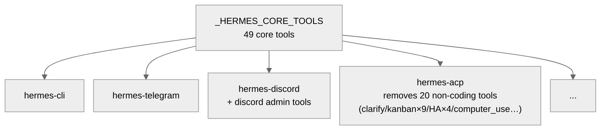
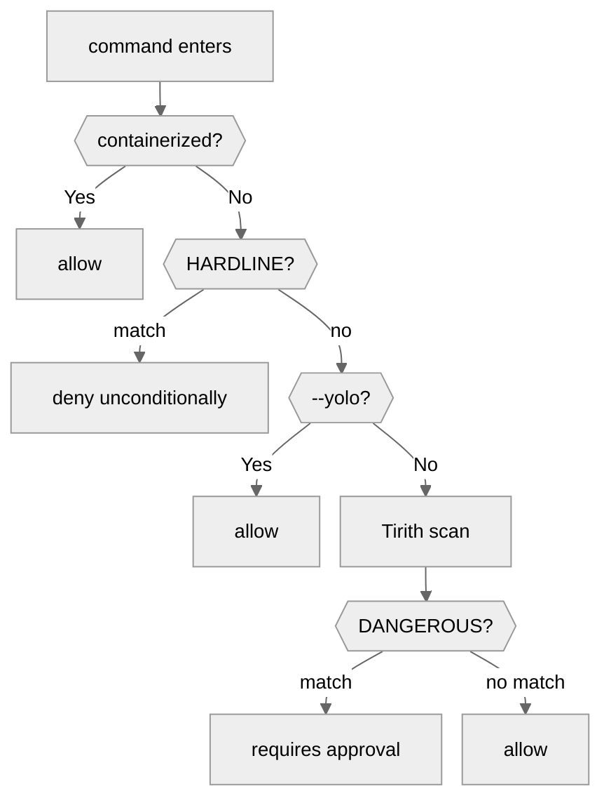
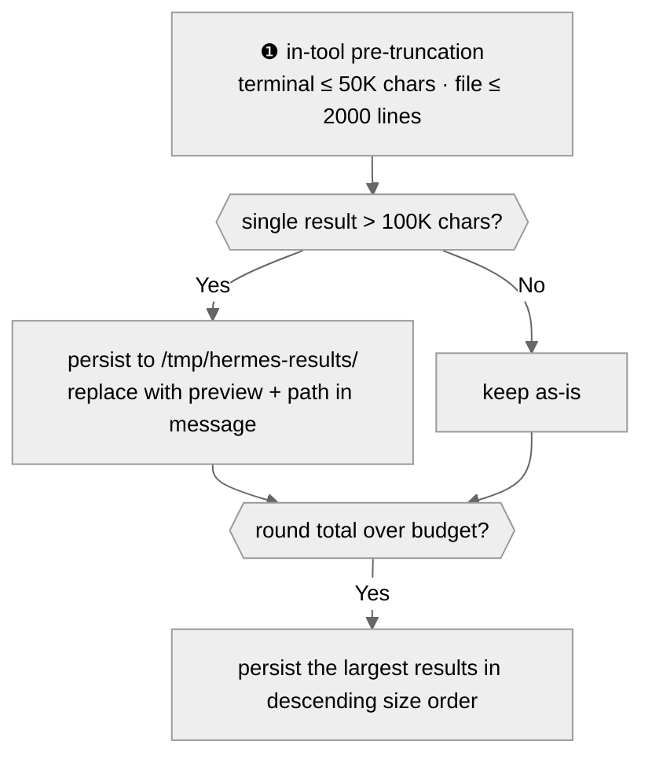

# 03 - Tool System: The Agent's Execution Capabilities

[中文](../zh/03-工具系统.md) | English

> **Scope**: the `tools/` directory (93 top-level .py, 112 including subdirectories, 92,364 lines) + `model_tools.py` (1,375 lines) + `toolsets.py` (971 lines). This is the tool layer — the collection of the Agent's execution capabilities.
> **Key classes**: `ToolRegistry` (`tools/registry.py:208`), `handle_function_call()` (`model_tools.py:1019`).

> **This chapter is based on hermes-agent v0.18.2 (tag [`v2026.7.7.2`](https://github.com/NousResearch/hermes-agent/releases/tag/v2026.7.7.2), commit `9de9c25f6`, 2026-07-07)**

---

## The Agent Only Thinks; Tools Let It Act

In the previous two chapters, we saw that AIAgent's core loop is "call the model → parse the response → execute tools → loop." The model makes decisions ("I should search the web"), but the one that actually searches isn't the model — it's the tool system. Without tools, the Agent is just a chatting API client.

If you want to understand the boundaries of the Agent's execution capabilities, or you hit issues like "a tool wasn't called," "the tool result is wrong," or "a command was denied" and need to troubleshoot, this chapter is the entry point.

---

## Usage Guide

### Basic Usage

Tools are transparent to the user — you don't call tools manually; the model chooses them automatically as needed. But the following operations affect tool availability:

```bash
hermes tools              # interactively manage toolset enable/disable
hermes tools enable mcp   # enable the MCP toolset
hermes tools disable browser  # disable browser tools
```

### Configuration

```yaml
# tool-system-related config in config.yaml
toolsets: ["hermes-cli"]         # the currently-used toolset

platform_toolsets:
  telegram: ["hermes-telegram"]  # platform-level toolset override

approvals:                       # command approval (top-level key)
  mode: "smart"                  # manual/smart/off
  cron_mode: "deny"              # cron tasks hitting a dangerous command: deny/approve

security:
  tirith_fail_open: true         # allow through when Tirith is unavailable (default)

tool_search:                     # progressive tool disclosure (see the MCP section)
  enabled: auto                  # default auto: activates only when deferrable tools' schema usage exceeds 10% of the context

mcp_servers:                     # MCP server config (top-level flat key, not a nested mcp.servers)
  filesystem:
    command: "npx"
    args: ["-y", "@anthropic/mcp-server-fs"]
```

### Common Scenarios

**Scenario 1: Integrate MCP tools.** Add a server config to `mcp_servers` in `config.yaml`, and after a restart `hermes tools` will show the new `mcp-`-prefixed toolset. MCP tools use exactly the same registration interface as built-in tools, and are indistinguishable from the Agent's perspective.

**Scenario 2: Disable the browser for Telegram.** Configure a toolset that doesn't include the browser series in `platform_toolsets.telegram` in `config.yaml` — or use `hermes tools` to disable the browser category on the Telegram platform page.

**Scenario 3: Enable smart approval.** Set `approvals.mode: "smart"`, and an auxiliary LLM will automatically judge whether a command is safe (APPROVE/DENY/ESCALATE, the prompt text at `approval.py:1960-1972`), bothering the user only when it's uncertain. Especially useful in the gateway scenario.

### Troubleshooting

| Problem | Where to look |
|---------|---------------|
| The model doesn't call a certain tool | `hermes tools` to confirm the tool is enabled; check whether `check_fn` returns True (30-second TTL cache, `registry.py:134`); confirm the tool is in the current platform's toolset; if `tool_search` is on, a non-core tool must first be retrieved by `tool_search` to become visible |
| A tool is registered but never executed | Check whether the `pre_tool_call` hook intercepted it (`model_tools.py:1175`); check the `_AGENT_LOOP_TOOLS` reserved list (`model_tools.py:600`) |
| A tool call errors | Check `agent.log` (tool errors go through `_sanitize_tool_error`, `model_tools.py:630`, and the raw exception is in the log); `handle_function_call()` (`model_tools.py:1019`) is the dispatch entry |
| A command was denied BLOCKED | Possible reasons: a HARDLINE match (cannot be bypassed, `approval.py:366`), the sudo stdin guard (`sudo -S` password guessing, `:448`), a DANGEROUS match (`:547`), a Gateway approval timeout of 300 seconds. Check `command_allowlist` in `config.yaml` |
| MCP tools don't appear | Check that the `mcp_servers` config is correct; whether the MCP service process started successfully (check the MCP connection log in `agent.log`) |
| Tool result truncated | A single result over 100K chars (`budget_config.py:17`) is persisted to `/tmp/hermes-results/`, with only a 1,500-char preview + path kept in the message; the model can read the full content with `read_file` |
| Tool execution timeout | Terminal commands default to a 180-second timeout (`terminal.timeout` is tunable) |
| Memory/skill write held pending | Since v0.17 there is a separate **write approval** (`tools/write_approval.py`): with `write_approval` on, persistent writes of memory and skills require user approval — especially for the autonomous writes of the background self-improvement review |

> 📖 **Further Reading (Official Docs):**
> - [Tools and Toolsets](https://hermes-agent.nousresearch.com/docs/user-guide/features/tools)
> - [MCP Integration](https://hermes-agent.nousresearch.com/docs/user-guide/features/mcp)
> - [Security](https://hermes-agent.nousresearch.com/docs/user-guide/security)
> - [Tools Runtime](https://hermes-agent.nousresearch.com/docs/developer-guide/tools-runtime)

---

## Architecture & Implementation

### What Does a Tool Look Like?

Before understanding the tool system, let's look at a concrete tool definition. All 69 tools follow the same three-step pattern. Take `read_file` as an example (`tools/file_tools.py`):

**❶ Define the Schema** — tell the model "what this tool is called and what parameters it takes," using OpenAI function-calling's standard JSON format:

```json
{
  "name": "read_file",
  "description": "Read a text file with line numbers...",
  "parameters": {
    "type": "object",
    "properties": {
      "path": {"type": "string"},
      "offset": {"type": "integer", "default": 1},
      "limit": {"type": "integer", "default": 500}
    },
    "required": ["path"]
  }
}
```

**❷ Implement the Handler** — an ordinary Python function that takes an `args` dict and keyword arguments and returns a JSON string:

```python
def _handle_read_file(args, **kw):
    tid = kw.get("task_id") or "default"
    return read_file_tool(path=args.get("path", ""), ...)
```

The return value must be a JSON string. `registry.py` provides two helper functions: `tool_result(data)` (`registry.py:754`) returns a success result, and `tool_error(message)` (`registry.py:740`) returns an error.

**❸ Register** — call `registry.register()` at module level:

```python
registry.register(
    name="read_file", toolset="file",
    schema=READ_FILE_SCHEMA, handler=_handle_read_file,
    check_fn=_check_file_reqs, emoji="📖",
    max_result_size_chars=100_000
)
```

`check_fn` is an optional availability-check function, called each time a tool definition is fetched (the result is cached for 30 seconds, `_CHECK_FN_TTL_SECONDS`, `registry.py:134`; there's also a debounce detail: a check that just succeeded will, on a transient failure, first be treated as "last time's True" for a short while, so that one network blip doesn't make the toolset flicker in and out). Take the Browser tool as an example: its check_fn checks whether Playwright is installed — if it returns False, the tool is silently removed from the available list and the model won't see its schema. This is why some tools "exist but are unavailable" — they're registered but check_fn filtered them out.

Why choose OpenAI's function-calling format? Because it's the industry de facto standard — all mainstream LLMs understand it. The Transport layer converts it to each Provider's native format when needed (take Anthropic's `input_schema` as an example), but the **tool definition is written only once**.

### How Are Tools Discovered and Loaded?

The 93 top-level tool files aren't all imported at startup — that would pull in heavy dependencies like Playwright and faster-whisper and slow down startup. `discover_builtin_tools()` (`tools/registry.py:58`) uses two-phase loading:



**Figure: Two-phase tool discovery — an AST scan confirms necessity, then imports on demand**

Why AST rather than "import all files then try-except"? Because import executes module-level code, which may have side effects (take establishing a database connection as an example). AST only parses the syntax tree without executing code — a zero-side-effect discovery mechanism. The observability of the two failure paths differs: when AST parsing fails (a file syntax error), `_module_registers_tools` returns False directly — **completely silent**, not even a log (the except branch at `registry.py:50-51`); only if it passes the scan but throws during the import phase is a warning recorded (`registry.py:74`). When troubleshooting "a new tool file wasn't loaded," be aware that the former case can't be found in the log.

### From LLM Returning a tool_call to the Result Being Filled Back

In Chapter 02's core loop, when the LLM returns a response containing `tool_calls`, control passes to the tool layer. The complete execution path is:



**Figure: The complete execution path of a tool call — including argument coercion, three hooks, security checks, and result governance**

Key steps explained:

1. **Parallelize judgment** (`agent/tool_dispatch_helpers.py:104`): `_should_parallelize_tool_batch()` triages in three tiers:
   - `_NEVER_PARALLEL_TOOLS` (`:42`): `clarify` vetoes parallelism for the whole batch
   - `_PATH_SCOPED_TOOLS` (`:60`): `read_file`, `write_file`, `patch` — parallel only if target paths don't overlap, falling back to serial on overlap. **Note `read_file` is in this tier**: although it also appears in the safe list, the path-check branch comes first, and "read-only so free to parallelize" doesn't hold
   - `_PARALLEL_SAFE_TOOLS` (`:45`, 11 entries): read-only, non-persisting tools like `web_search`, `search_files`, `session_search`, `vision_analyze` are allowed unconditionally
   - MCP tools: controlled by the MCP server's parallelism declaration (`_is_mcp_tool_parallel_safe`, `:91`)
   - If argument parsing fails (invalid JSON), it falls back to serial directly

2. **Argument type coercion** (`coerce_tool_args()`, `model_tools.py:650`): coerces argument types (take a string `"42"` becoming the integer `42` as an example). When troubleshooting "argument type error," start here

3. **Three hooks execute in order**:
   - `pre_tool_call` (`model_tools.py:1175`): triggered before execution, a plugin can return a block message to **prevent execution** — when troubleshooting "a tool is registered but never executed," check whether pre_tool_call intercepted it. A caller can also explicitly skip via the `skip_pre_tool_call_hook` parameter (`:1029`)
   - `post_tool_call` (the emit function `_emit_post_tool_call_hook`, `model_tools.py:968`, emitted once each on the success/exception paths `:1194/:1294`): triggered after execution, observe-only (the return value is ignored), used to record metrics like duration
   - `transform_tool_result` (`model_tools.py:1309`): triggered last, a plugin can return a string to **replace the result**

4. **Security check**: a terminal tool's command goes through `check_all_command_guards()` (see "Lines of Defense" below)

5. **Result-size governance**: note — governance isn't inside `handle_function_call()`, but in the upper `agent/tool_executor.py` (1,646 lines, managing budget, persistence, interrupt handling), executed after the handler returns. See "Result-Size Governance" below

6. **Fill back**: the final result is appended to the `messages` list as a `{"role": "tool", "content": result}` message

Note: tool error messages go through `_sanitize_tool_error()` (`model_tools.py:630`) — preventing framing tokens in exceptions from entering the model context. This means that when debugging, the error info in the tool return value may differ from the raw exception, so check `agent.log` for the full exception.

### Toolsets: The Same Batch of Tools, Different Scenarios

Not every scenario needs every tool. A CLI user might need the browser, but a Telegram group chat doesn't — imagine an Agent automatically opening a browser to visit web pages in a group.

`toolsets.py` defines a **shared core + platform extensions** model. `_HERMES_CORE_TOOLS` (`toolsets.py:31`) lists 49 core tools shared by all platforms. Each platform's toolset adds to or subtracts from the core:



**Figure: The shared core + platform extension model of toolsets**

Toolsets support recursive composition — `resolve_toolset()` (`toolsets.py:687`) does DFS expansion and cycle detection. A user can override any platform's toolset via `platform_toolsets` in `config.yaml`. If a tool's dependency isn't satisfied (take Playwright not being installed as an example), `check_fn` returns False at registration and the tool is silently removed from the available list.

Among the core tools there is a special tool that doesn't operate on the outside world but only handles "planning," worth naming individually: **`todo`** (`tools/todo_tool.py`, within the 49 core tools). The Agent uses it to break a complex task into a to-do list and check off progress across turns — the docstring calls itself "Planning & Task Management." Its value is in long tasks: context compression drops the intermediate process, but the `todo` list is **re-injected** after compression, effectively giving the Agent an "un-compressible sticky note" that prevents forgetting which steps remain halfway through a long task.

By the way, a subtraction in v0.18: the v0.14-era `mixture_of_agents` model tool has been removed entirely — multi-model aggregation was refactored into the MoA mode at the Agent-loop layer (Chapter 02) and no longer occupies a tool slot.

### Security: More Than Three Lines of Defense

The most sensitive part of the tool system is security — a command the Agent executes may delete files, modify system configuration, or make network requests. Hermes's lines of defense along the tool-call path each guard a different attack vector: **command approval** intercepts dangerous command intent (using regex to recognize operations like `rm -rf /`); **path + URL safety** intercepts structural bypass attacks (path traversal and SSRF); **Tirith** intercepts content-disguise attacks (using semantic analysis to find threats regex can't see). v0.17-0.18 added two more surfaces: **write approval** governs the Agent's autonomous modifications to its own memory/skills, and the **threat-pattern library** unifies the prompt-injection detection of the various context scans.

#### The First: Command Approval (approval.py, 3,242 lines)

approval.py doubled from v0.14's 1,424 lines to 3,242 lines — the increase is mainly in context awareness (cron/session state) and Gateway async approval. `check_all_command_guards()` (`approval.py:2537`) is the entry, executing six levels of checks by priority:



**Figure: The six-level check of command approval — from container exemption to hardline blocking to DANGEROUS pattern matching**

The check flow explained level by level:

1. **Containerized-environment detection** — commands inside Docker, Singularity, Modal, and Daytona are allowed directly, because the container is itself a sandbox
2. **HARDLINE_PATTERNS** (`approval.py:366`) — command patterns denied unconditionally, not bypassable even with `--yolo`. 12 patterns total: `rm -rf /`, `mkfs`, fork bombs, and other extremely dangerous operations. This is Hermes's security bottom line
2b. **sudo stdin guard** (pattern defined at `approval.py:448`) — blocks the Agent from a password-guessing attack via a `sudo -S` pipe, also not bypassable by `--yolo`. The error message is `"BLOCKED: sudo password guessing via stdin"`
3. **--yolo / approvals.mode=off** — the user explicitly chooses to skip all approvals (except HARDLINE and the sudo guard). User-defined deny rules (fnmatch globs in the `approvals` config) take effect before yolo — they are the user-editable version of the "code-built-in hard bottom line"
4. **Tirith content scan** (`tools/tirith_security.py`, 871 lines) — an external Rust binary that detects content-level threats regex can't catch, like Unicode homoglyph-disguised URLs. Defaults to `fail_open=true` (allow through when unavailable). *(The full introduction to Tirith is in the "Third Line of Defense" section below.)*
5. **DANGEROUS_PATTERNS** (`approval.py:547-762`) — **73** regex-matched dangerous-command patterns (`rm -rf`, `chmod 777`, `DROP TABLE`, `git reset --hard`, `curl | sh`, the killall force-kill series, etc.; expanded from 52 to 73 across v0.14→v0.18, the additions typified by Windows PowerShell destructive commands)
6. **Approval** — when DANGEROUS is matched or smart mode judges it suspicious, approval is triggered. The approval method depends on the platform: the CLI is an interactive prompt (once/session/always/deny), the Gateway is an async wait for the user's response (up to 300 seconds), and smart mode (one of the three `approvals.mode` values, `:1797`) uses an auxiliary LLM to judge automatically (APPROVE/DENY/ESCALATE)

Approval results are persisted: an `always`-level decision writes to `command_allowlist` in `config.yaml`, and subsequent similar commands won't ask again.

In the gateway scenario, approval times out after 300 seconds, returning `"BLOCKED: Command timed out without user response"` — one of the most common reasons a command is "denied" under the Gateway. Cron mode has its own config (`approvals.cron_mode`): `deny` denies dangerous commands directly (default, the Agent will find another way), `approve` allows all through.

#### The Second: Path and URL Safety

**Path safety** (`tools/path_security.py`, 43 lines) — prevents path-traversal attacks. `validate_within_dir()` uses `path.resolve().relative_to(root)` to ensure file operations don't escape the allowed directory.

**URL safety** (`tools/url_safety.py`, 503 lines) — prevents SSRF (Server-Side Request Forgery). `is_safe_url()` does a DNS resolution of the URL then checks the IP, **fail-closed** (deny if DNS fails). It permanently blocks all cloud-platform metadata endpoints: `169.254.169.254` (AWS/GCP), `metadata.google.internal`, Azure/DigitalOcean, etc. Even with `security.allow_private_urls: true` configured to open up private IPs, the metadata endpoints remain inaccessible — this prevents the Agent from reading a VM's IAM credentials on a cloud server.

#### The Third: Tirith Content-Level Scanning

Tirith (`tools/tirith_security.py`, 871 lines) is an external Rust binary that detects content-level threats regex can't catch. On first use it auto-downloads from GitHub releases, verifying the SHA-256 checksum and the cosign supply-chain signature. The download runs on a background thread, not blocking Agent startup.

#### The Fourth (Added in v0.17): Write Approval — Governing the Agent Changing Itself

Command approval governs what the Agent does **outward**; `tools/write_approval.py` (493 lines) governs what the Agent does **to itself**. The Agent has two cross-session persistent stores: memory (MEMORY.md/USER.md, small entries of about 200 characters) and skills (SKILL.md + attachments, which can reach 10-100 KB). Writes come from two sources: the foreground (a normal turn with the user present) and **background_review** (the self-improvement fork that autonomously decides "what to remember" after each round — the module comment says outright that this is the source of users' complaints about "recording wrong assumptions"). With `write_approval` on, you can require, per subsystem (memory/skills), that a write first pass user approval, with pending entries going into a pending store.

Command approval protects your system; write approval protects the Agent's own long-term state from being contaminated by itself — a security surface unique to the "self-improving Agent."

#### The Unified Threat-Pattern Library

`tools/threat_patterns.py` (284 lines) is a v0.18 defensive consolidation: the detection patterns for prompt injection/promptware/data exfiltration used to be scattered everywhere, and are now consolidated into a single source of truth. The actually-integrated consumers (by import relationship) are three: `agent/prompt_builder.py` (context-assembly scanning), `tools/memory_tool.py` (memory-write scanning), and `tools/cronjob_tools.py` (cron prompt-injection scanning, using its invisible-character list) — change a pattern in one place and it takes effect in all three at once. (The module's own docstring also mentions the tool-result-delimiting system, but that mechanism — `<untrusted_tool_result>` wrapping and delimiter neutralization — is self-contained in `tool_dispatch_helpers.py` and doesn't import this pattern library; the docstring has slightly drifted from the actual references.)

### MCP: Making External Tools First-Class Citizens

Through MCP (Model Context Protocol), any external service that implements the MCP protocol can be registered as a Hermes tool.

Key design: **MCP tools use exactly the same registration interface as built-in tools**. `discover_mcp_tools()` (`tools/mcp_tool.py`, 5,627 lines) connects to the configured MCP servers at startup, fetches the tool list, and then registers them into the ToolRegistry using the same `registry.register()`. From the Agent's perspective, MCP tools and built-in tools are indistinguishable.

An MCP tool's toolset starts with `mcp-` (take `mcp-filesystem` as an example), for convenient on-demand enable/disable. Registration has name-collision protection: MCP tools can override each other, but an MCP tool can't override a built-in tool (and vice versa). When an MCP server's tool list changes, the server sends a `tools/list_changed` notification, and Hermes automatically does a deregister + re-register without restarting the Agent.

The MCP implementation details are worth knowing:

- **A dedicated background event loop** (`mcp_tool.py:69-76`): MCP runs on a dedicated asyncio event loop in a daemon thread, and tool calls are dispatched cross-thread. This explains why MCP tools' timeout behavior differs from built-in tools
- **Three transport protocols** (`mcp_tool.py:5`): stdio (subprocess communication, most common), HTTP/StreamableHTTP (remote services), SSE. A `command` field in the config means stdio, a `url` field means HTTP/SSE
- **Sampling capability** (`mcp_tool.py:71`): an MCP server can reverse-request an LLM completion via `sampling/createMessage` — meaning an MCP tool call may trigger a nested LLM request, a path to consider when troubleshooting unexpected LLM calls
- **Auto-reconnect**: exponential-backoff retry on connection failure. If an MCP server stays unavailable, that server's tools are silently removed
- **Security**: an MCP subprocess only inherits allowlisted environment variables (PATH, HOME, USER, etc.), so sensitive credentials don't leak to the external process
- **Orphan watchdog** (`tools/mcp_stdio_watchdog.py`, 184 lines, added in v0.18): a stdio MCP server is a direct child process of Hermes, and when Hermes is `kill -9`'d the normal cleanup path can't run, leaving orphan `npx`/node processes. The watchdog, as a separate supervisor process, watches for the parent's death and reaps on its behalf

#### What to Do When There Are Too Many Tools: Progressive Disclosure

The more MCP servers you integrate, the larger the tool schemas — each tool's definition takes model context. `tools/tool_search.py` (735 lines, added in v0.16) gives the answer of **progressive tool disclosure**. Note its default tier is `auto` (`ToolSearchConfig.from_raw`, `tool_search.py:78-83`): when this key isn't written in the config at all, it **auto-activates** once the deferrable tools' schema usage reaches 10% of the context window (or a 20K-token threshold when the window is unknown) — it's not "off by default, turn on manually." The mechanism: MCP and non-core plugin tools no longer directly enter the model-visible tools array, but are replaced by three bridge tools — `tool_search` (retrieve on demand), `tool_describe` (view the full definition), `tool_call` (invoke indirectly). The model searches for what it needs and only expands the schema when it uses it. Core Hermes tools are never deferred — the direct visibility of high-frequency tools is not sacrificed.

### Result-Size Governance

Whether a tool is built in or integrated via MCP, they face the same reality: the output can be large. If a tool returns 1MB of file content, what happens if it's all stuffed into the message history? Context blowup, cost surges, higher latency. Hermes controls this with a three-layer mechanism:



**Figure: Tool-result-size governance — ❶ pre-truncation → ❷ per-result persistence → ❸ per-turn budget**

The thresholds are all in `tools/budget_config.py` (114 lines): the single-result threshold defaults to 100K chars (`DEFAULT_RESULT_SIZE_CHARS`, `:17`), the preview 1,500 chars (`:19`). **The per-turn total budget is dynamic since v0.18**: it takes 30% of the model context window (`_PER_TURN_WINDOW_FRACTION`, `:76`), with a floor of 16K and a ceiling of 200K (`:81/:18`) — small-window models automatically tighten, and large-window models aren't held back by a fixed 200K number.

The cleverness of this design: **no information is discarded**. An oversized result is persisted to the filesystem, with a 1,500-char preview + path in the message, and the model reads the full content with `read_file` when it needs it. The cost is one extra tool call, but information is never silently lost.

Special handling: although `read_file` sets `max_result_size_chars=100_000` at registration, `PINNED_THRESHOLDS` in `budget_config.py:11` overrides it to `float('inf')` at runtime — because if read_file's result were also persisted, the model would need to read_file the persisted read_file result, falling into an infinite loop. This override is implemented via `BudgetConfig.resolve_threshold()` (`:37`), with a priority chain of: pinned → tool_overrides → registry → default.

### Background Delegation: Letting Subagents Run Asynchronously

The `delegate_task` covered in Chapter 02 is synchronous — the parent Agent waits for all subtasks to finish before continuing. v0.17 added `delegate_task(background=true)`: the subagent is dispatched to a module-level daemon executor to run asynchronously (`tools/async_delegation.py`, 531 lines + `tools/daemon_pool.py`, 64 lines), the parent Agent immediately gets a handle, continues doing other things, and later queries status/collects the result via the handle. This turns "dispatch and wait for the result" into "dispatch and move on, settle up later" — suited to long-running subtasks like research fan-outs. It shares the same foundation as Chapter 02's heartbeat monitoring and summary-budget mechanisms.

### Computer Use: Desktop Control

Besides the browser tool (`browser_tool.py`, 4,803 lines, controlling browser pages), hermes-agent has a **desktop-level** automation tool — `computer_use` (the `tools/computer_use/` subdirectory, 8 .py files, with `doctor.py` self-diagnostics and `permissions.py` permission checks added in v0.18).

Computer Use is based on cua-driver (a separately-installed MCP stdio binary, supporting macOS/Windows/Linux — `check_computer_use_requirements()`, `tool.py:899`; Linux currently goes via X11/XWayland), letting the Agent control the entire desktop — click buttons, type text, take screenshots to analyze. The key difference from the browser tool: the browser tool can only operate browser pages, while Computer Use can operate any GUI application (take Finder, System Settings as examples).

An important design choice: `computer_use`'s schema uses the OpenAI function-calling format (`tools/computer_use/schema.py`) rather than Anthropic's native Computer Use format — meaning **all models that support tool calling** can drive it, not just Claude.

Install cua-driver via `hermes tools`, then enable the `computer_use` toolset in `config.yaml` after configuring.

### Terminal Backends: 7 Execution Environments

The Agent's `terminal` tool doesn't necessarily execute commands locally. `tools/environments/` provides 7 backends:

| Backend | File | Scenario |
|---------|------|----------|
| Local | `local.py` | default, executes directly on the host |
| Docker | `docker.py` | container isolation, for untrusted commands |
| SSH | `ssh.py` | remote-server execution |
| Daytona | `daytona.py` | cloud sandbox, hibernates when idle |
| Singularity | `singularity.py` | HPC container |
| Modal (SDK) | `modal.py` | Serverless, billed by usage |
| Modal (managed) | `managed_modal.py` | proxied through the Tool Gateway |

(In the v0.14 era there was also a Vercel Sandbox backend, removed along with the Vercel AI Gateway.)

The core difference among the 7 backends is **isolation level and execution location**: Local has no isolation, commands run directly on the host; Docker/Singularity provide process-level container isolation, suited to running untrusted code; Modal is a fully-stateless cloud sandbox, with high startup latency but no ops burden; Daytona and SSH target persistent remote environments, SSH for an existing server, Daytona providing lifecycle management (auto-hibernating when idle to save cost).

When choosing a backend, three dimensions matter most: **security need** (does it need sandbox isolation), **persistent-state need** (does it need to keep the filesystem across tasks), and **execution location** (local, private server, or cloud).

All backends implement the `BaseEnvironment` interface (`tools/environments/base.py`, 959 lines), so the Agent and tool code don't need to care where a command executes — switching backends only requires changing `terminal.backend` in `config.yaml`. But some backends have extra dependencies (take Modal as an example: it needs `pip install modal` and a Modal account setup).

When troubleshooting terminal-backend issues, two implicit behaviors are worth knowing:

- **CWD persistence** (`base.py:282`): the session passes the working directory by embedding a `__HERMES_CWD_{session_id}__` marker in the command output. Remote backends (SSH, Modal) parse this marker to sync the CWD. If the command output happens to contain a similar string, it may cause a CWD parse error
- **Snapshot degradation** (`base.py:443`): if `init_session()` fails (`snapshot_ready=False`), every subsequent command degrades to executing via `bash -l`, bypassing environment-variable inheritance — environment variables set by an earlier command disappear in later commands. It shows up as "the command result is wrong"
- **Background-process hang** (`base.py:568-574`, issue #8340): when a command is backgrounded (`cmd &`), the grandchild process inherits the write end of the stdout pipe, and after bash exits the pipe stays open, so the drain thread never gets EOF and the tool hangs. Set the `HERMES_DEBUG_INTERRUPT=1` environment variable to enable detailed poll logging to help locate it

### Code Organization

```
model_tools.py           — tool dispatch entry (1,375 lines)
toolsets.py              — toolset definitions + platform mapping (971 lines)
tools/
├── registry.py          — ToolRegistry singleton + discovery logic (766 lines)
├── approval.py          — command approval six-level check (3,242 lines)
├── write_approval.py    — memory/skill write approval (493 lines, added in v0.17)
├── threat_patterns.py   — unified prompt-injection pattern library (284 lines, new)
├── tool_search.py       — progressive tool disclosure (735 lines, new)
├── async_delegation.py  — background-delegation registry (531 lines, new)
├── browser_tool.py      — browser tool (4,803 lines)
├── mcp_tool.py          — MCP client integration (5,627 lines)
├── mcp_stdio_watchdog.py — MCP subprocess orphan watchdog (184 lines, new)
├── delegate_tool.py     — subagent delegation (3,459 lines, see Chapter 02)
├── terminal_tool.py     — terminal execution (3,029 lines)
├── file_tools.py        — file read/write/search (2,173 lines)
├── file_operations.py   — low-level file operations (2,423 lines)
├── web_tools.py         — web search and extraction (1,183 lines)
├── code_execution_tool.py — code-execution sandbox (1,910 lines)
├── skills_tool.py       — skill-management tools (1,681 lines)
├── url_safety.py        — URL safety check (503 lines)
├── tirith_security.py   — Tirith content scan (871 lines)
├── path_security.py     — path safety (43 lines)
├── tool_result_storage.py — result persistence (254 lines)
├── budget_config.py     — result-size budget (114 lines)
├── computer_use/        — desktop control (8 files)
├── environments/        — 7 terminal backends
└── ...(another ~65 tool files)
```

### Design Decisions

#### Self-Registration vs. Centralized Registration

Hermes chose the self-registration model — each tool file calls `registry.register()` itself when imported, rather than having a central file list all tools one by one. Benefit: adding a tool only requires creating a file, no changes to any other file. Cost: a tool's registration order depends on import order, but this isn't a problem in practice (the registry is a dict, looked up by name, independent of order).

#### MCP Tools and Built-in Tools Share an Interface

MCP tools could use a completely different registration path — such as a separate MCP dispatch layer. But Hermes chose to have MCP tools and built-in tools go through the same `ToolRegistry`, transparent to the Agent. Benefit: the Agent core doesn't need to distinguish tool sources, simplifying the tool-dispatch logic. Cost: MCP-tool errors and built-in-tool errors aren't easy to distinguish in the log (you need to look at the `mcp-` prefix of the toolset name when troubleshooting).

#### Persist Rather Than Truncate

The traditional approach is to truncate oversized tool results directly. Hermes chose to persist to a file + put a preview in the message. Benefit: no information is lost. Cost: it needs an extra `read_file` tool call, adding a round of Agent loop.

#### A Tool's Visibility Is Also a Budget

`tool_search`'s progressive disclosure is the application of the same philosophy on the schema side: on the result side, "persist oversized content, read on demand"; on the definition side, "gather non-core tools into retrieval, expand on demand." Both change "stuff everything into context" into "a pointer + fetch on demand," at the same cost of one extra tool call.

### Extension Points

1. **Add a built-in tool**: create `tools/<name>.py`, implement schema + handler + `registry.register()`
2. **Add an MCP tool**: add a server config to `mcp_servers` in `config.yaml`
3. **Add a terminal backend**: implement the `BaseEnvironment` interface
4. **Custom toolset**: compose in `toolsets` or `platform_toolsets` in `config.yaml`
5. **Custom security policy**: pre-approve specific command patterns via `command_allowlist`, or add a hard bottom line via `approvals` user deny rules

---

## Relationship to Other Chapters

| Related Chapter | Relationship |
|-----------------|--------------|
| 02 — Agent Core | The Agent's `_execute_tool_calls()` (Chapter 02) calls this chapter's `handle_function_call()` one by one via `agent/tool_executor.py`, filling results back into messages; the old mixture_of_agents tool has been refactored into Chapter 02's MoA loop; background delegation shares a foundation with delegate_task |
| 04 — Skill System | Skill writes are gated by write_approval |
| 05 — Gateway Layer | Different platforms use different toolsets, and the Gateway handles toolset selection |
| 06 — Protocol Adaptation Layer | MCP tools are integrated via `mcp_tool.py`, and ACP has its own tool subset |
| 07 — Plugin Framework | Plugins modify tool results via the `transform_tool_result` hook |
| 09 — Kanban System | `kanban_tools.py` provides board-operation tools, in the core tool list |

---

*This document is based on source analysis of hermes-agent v0.18.2. All code references have been independently verified.*
