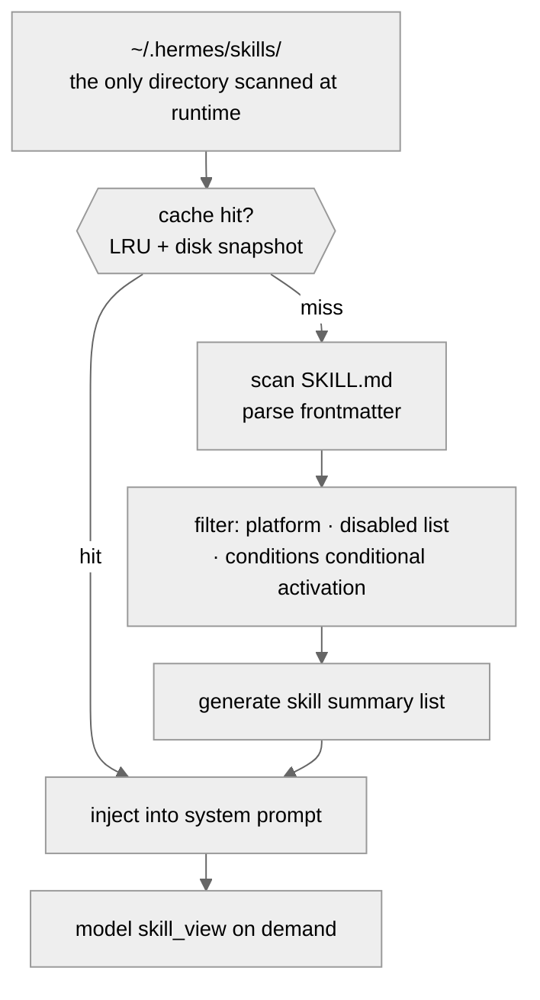
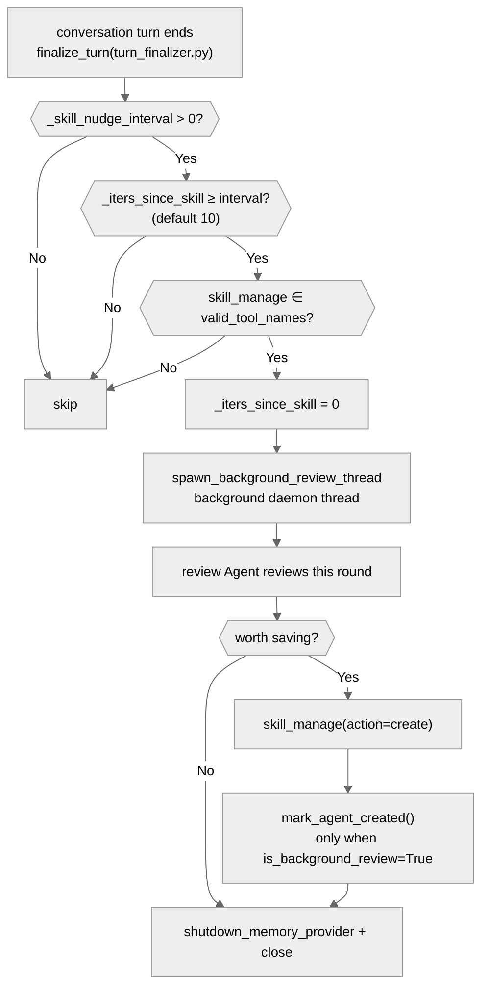
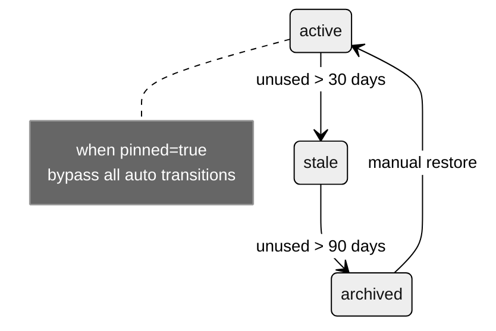
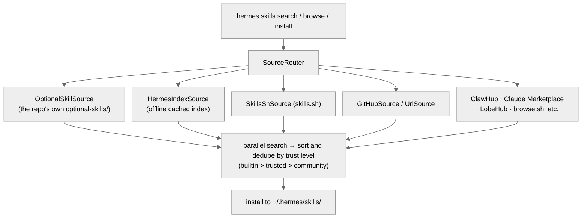

# 04 - Skill System: The Agent's Learning Capability

[中文](../zh/04-技能系统.md) | English

> **Scope**: `skills/` (72 built-in skills, 17 skill categories) + `optional-skills/` (102 optional skills, 19 categories) + `tools/skills_tool.py` (1,681 lines) + `tools/skill_manager_tool.py` (1,559 lines) + `agent/background_review.py` (960 lines) + `hermes_cli/skills_hub.py` (1,997 lines).
> **Key functions**: `skill_manage()` (`skill_manager_tool.py:1320`), `spawn_background_review_thread()` (`background_review.py:925`).

> **This chapter is based on hermes-agent v0.18.2 (tag [`v2026.7.7.2`](https://github.com/NousResearch/hermes-agent/releases/tag/v2026.7.7.2), commit `9de9c25f6`, 2026-07-07)**

---

## Why Does an Agent Need "Skills"?

hermes-agent's tagline is "The self-improving AI agent — **creates skills from experience, improves them during use**". The skill system is the core implementation of this tagline.

An Agent without a skill system is stateless — it starts from scratch every conversation and doesn't remember how it solved a similar problem last time. The skill system lets the Agent abstract successful experience into a reusable operating manual, to be called directly the next time a similar problem arises.

Take a concrete scenario as an example: you have the Agent look up an arXiv paper for you, and it works out the correct curl command and parsing approach. Without the skill system, the next time you ask it to look up a paper, it has to work it out all over again. With the skill system, the Agent automatically reviews this experience after the conversation ends and creates an "arxiv" skill to save it — the next time the model sees this skill in the system prompt, it executes by the known method directly, no more trial and error.

Chapter 07 already established the contrast between skills and plugins (a skill is an operating manual + a sandbox script for the model, a plugin is an in-process extension). This chapter first looks at the skill system from the user's perspective — how to install, enable, troubleshoot — and then lifts the hood into the implementation: what a skill looks like, how it's discovered and loaded, how the Agent automatically creates and improves skills, and how the Skills Hub works.

---

## Usage Guide

### Basic Usage

```bash
hermes skills             # interactively manage skill enable/disable
hermes skills list        # list all available skills
hermes skills browse         # browse the Skills Hub (a multi-source aggregated skill marketplace)
hermes skills install <name>  # install a skill from the Hub
```

In a conversation, load a skill directly with `/` + skill name:

```
/arxiv          # load the arxiv skill
/polymarket     # load the polymarket skill
```

The model can also decide to load a skill on its own — the system prompt contains a summary list of all available skills, and the model browses and loads them via the `skills_list` and `skill_view` tools based on user needs.

### Configuration

```yaml
# config.yaml
skills:
  disabled: []                  # globally disabled skills
  platform_disabled:
    telegram: ["godmode"]       # platform-level disable
  # disable auto-creation: set creation_nudge_interval: 0
  creation_nudge_interval: 10   # trigger a skill review every N tool iterations (default 10)

auxiliary:
  background_review:            # model routing for the background review (added in v0.18, see the architecture section)
    provider: "auto"            # auto = inherit the main model (default)
    model: ""
```

### Common Scenarios

**Scenario 1: Install a community skill.** `hermes skills browse` browses the multi-source skill marketplace (an aggregation of ten data sources including skills.sh, GitHub, the official optional library, etc., see the architecture section); find the skill you want then `hermes skills install <name>`. Installed skills go under `~/.hermes/skills/` and are used the same way as built-in skills.

**Scenario 2: The Agent auto-creates a skill.** You don't need to do anything — when the Agent uses a fair number of tool calls in a conversation (indicating a complex task), after the conversation ends `background_review.py` starts a daemon thread in the background, creating a separate review Agent instance to review this conversation, and if it finds a reusable pattern it automatically creates a skill.

**Scenario 3: Manually create a skill.** Tell the Agent in a conversation "save that method as a skill," and the Agent will create the SKILL.md with `skill_manage(action="create")`. You can also directly create the directory and SKILL.md file under `~/.hermes/skills/`.

### Troubleshooting

| Problem | Where to look |
|---------|---------------|
| A skill doesn't appear in the list | ① Confirm SKILL.md exists and the frontmatter is well-formed ② Check `conditions` conditional activation — `fallback_for_toolsets` may silently hide the skill when the current toolset exists ③ Check same-name conflicts (`_find_all_skills()` dedupes via `seen_names`, local first, `skills_tool.py:634`) ④ Frontmatter over 4000 characters is truncated, causing a parse failure — the skill **still appears in the list**, but its name degrades to the directory name and its description is polluted (`skills_tool.py:654`; after a parse failure the name falls back to `skill_dir.name`) — seeing "the name became the directory name" is this cause |
| `/skillname` doesn't trigger | Confirm the skill isn't disabled (`skills.disabled` or `skills.platform_disabled`) |
| Skill loading shows SETUP_NEEDED | Missing an environment variable declared in `required_environment_variables` or a `required_credential_files`; run setup or set them manually |
| A skill edit had no effect | The cache has two layers: the disk layer (mtime detection, editing a file auto-invalidates it) and the in-process layer (in-memory cache, cleared only by restarting the Agent or calling `clear_skills_system_prompt_cache()`) — see the architecture section |
| A skill isn't auto-created | Check the three trigger conditions (now living in `turn_finalizer.py:456-458`): `creation_nudge_interval > 0`, enough tool iterations, and the `skill_manage` toolset enabled. Troubleshooting entry: `spawn_background_review_thread()` (`background_review.py:925`) |
| Background review thread fails | Log `WARNING: Background memory/skill review failed` (written to agent.log; this warning runs outside the redirected context, persisted via the logger handler). During the review, both stdout and stderr are redirected to devnull, so the UI doesn't see mid-run output |
| A built-in skill "disappeared" | It may have been archived by the Curator — `prune_builtins` is **on by default**, and long-unused built-in skills also go into `.archive/` (recoverable), see the Curator section |
| Skill script execution fails | Scripts execute in a sandbox via `terminal`/`execute_code` — check that dependencies are installed and paths are correct |
| Skills Hub install fails | Check network connectivity; Hub skills download to `~/.hermes/skills/` |

> 📖 **Further Reading (Official Docs):**
> - [Skill System](https://hermes-agent.nousresearch.com/docs/user-guide/features/skills)
> - [Creating Skills](https://hermes-agent.nousresearch.com/docs/developer-guide/creating-skills)
> - [Skills Hub](https://hermes-agent.nousresearch.com/docs/user-guide/features/skills)

---

## Architecture & Implementation

### What Does a Skill Look Like?

If a skill is an "operating manual," then SKILL.md is the manual itself — the frontmatter is the cover information (author, applicable platforms, prerequisites), the body is the operating steps, and `scripts/` is the toolkit that comes with the manual. Each skill is a directory containing at least a `SKILL.md` file. Take `skills/research/polymarket/` as an example:

```
polymarket/
├── SKILL.md          — skill definition (frontmatter + body)
├── scripts/
│   └── polymarket.py — Python tool script (command-line tool)
└── references/
    └── api-endpoints.md — reference doc (the model can read it)
```

**SKILL.md's frontmatter** (YAML format) defines the skill's metadata:

```yaml
---
name: polymarket
description: "Query Polymarket: markets, prices, orderbooks, history."
version: 1.0.0
author: Hermes Agent + Teknium
tags: [polymarket, prediction-markets, market-data, trading]
platforms: [linux, macos, windows]
---
```

These are the most commonly used fields, but the frontmatter spec is far more than this. The complete field system:

| Field | Purpose |
|-------|---------|
| `name` / `description` / `version` / `author` / `tags` / `platforms` | basic metadata |
| `required_environment_variables` | declares required environment variables (`name`/`prompt`/`help`/`required_for`/`optional` subfields); on load, `skill_view` interactively guides the user to set missing variables |
| `required_credential_files` | credential-file registration (`skills_tool.py:1452`) |
| `setup.collect_secrets` | interactive secret-collection config (from `skills_tool.py:245`) |
| `metadata.hermes.*` | conditional activation — four subfields control when a skill appears (see the detailed explanation below) |

**The four subtypes of conditional activation** (parsing near `agent/skill_utils.py:608`). Note: these fields are nested under `metadata.hermes`, they are **not** top-level frontmatter fields:

```yaml
# the correct form in SKILL.md frontmatter
metadata:
  hermes:
    requires_toolsets: [terminal]
```

| Subfield (under metadata.hermes) | Semantics |
|----------------------------------|-----------|
| `requires_toolsets: [terminal]` | shown only when the terminal toolset **exists** |
| `requires_tools: [web_search]` | shown only when the web_search tool **exists** |
| `fallback_for_toolsets: [web]` | shown only when the web toolset **doesn't exist** (an alternative) |
| `fallback_for_tools: [browser_navigate]` | shown only when the browser_navigate tool **doesn't exist** |

Take the built-in `maps` skill as an example: it declares `requires_toolsets: [terminal]` under `metadata.hermes` — in an environment without a terminal toolset (take some Gateway platforms as an example) this skill is silently filtered and doesn't appear in the system prompt.

**The three readiness_status states**: when `skill_view` loads a skill it evaluates the readiness status (`skills_tool.py:176-178`):
- `AVAILABLE` — usable normally
- `SETUP_NEEDED` — missing a required environment variable or credential file, needs setup first
- `UNSUPPORTED` — not supported on the current platform

**The body** is natural-language instructions — telling the model when to use this skill, how, and what commands and APIs are available. After the model loads the skill, the body content is injected into the system prompt.

**The scripts/ directory** contains executable Python scripts. Take `polymarket.py` as an example: it's a standard command-line tool (`python3 polymarket.py search "bitcoin"`), which the model executes via the `terminal` tool. The script runs in a sandbox, not inside the Agent process — this is the key difference between a skill and a plugin.

**The references/ directory** contains reference docs, which the model can read on demand via the `read_file` tool.

### How Are Skills Discovered and Loaded?



**Figure: The complete path of a skill from discovery to injection into the system prompt**

1. **Only one directory is scanned at runtime**: `~/.hermes/skills/` (plus the external directories in the optional `skills.external_dirs` config). Note: `<repo>/skills/` and `<repo>/optional-skills/` are not read directly at runtime — they are the **seed source at install time**, copied to `~/.hermes/skills/` via `sync_skills()` during `hermes setup` or first launch. `optional-skills/` is more special — it's exposed via the Skills Hub's `OptionalSkillSource` adapter, and the user needs `hermes skills install official/<name>` to install it to `~/.hermes/skills/`
2. **Two-layer cache check**: first the in-process LRU cache, then the disk snapshot. The LRU cache key is now a **seven-tuple** (the tuple is constructed at `prompt_builder.py:1458-1466`): `(skills_dir, external_dirs, available_tools, available_toolsets, platform, disabled, compact_categories)` — the `compact_categories` added in v0.17 is the seventh element (see below), and different configs produce independent cache entries. The disk snapshot (`~/.hermes/.skills_prompt_snapshot.json`) is validated with an mtime/size manifest — **the disk layer is content-aware**, editing a SKILL.md changes `st_mtime_ns` and the disk snapshot auto-invalidates. But the in-process LRU has no inotify mechanism, so **only restarting the process or calling `clear_skills_system_prompt_cache()` clears the in-memory cache**. Note: `_load_skills_snapshot()` (`prompt_builder.py:1289`) only compares the `skills_dir` manifest, and a change in external_dirs doesn't invalidate the disk snapshot — a potential stale-cache scenario requiring manual deletion of the snapshot file or restarting the Agent
3. **Filter** (`_skill_should_show()`, `prompt_builder.py:1386`): checks platform compatibility (the `platforms` field), the disabled list (`skills.disabled`), and the four kinds of conditions-based conditional activation (see the field table above). Note: the conditions filter is **silent** — a filtered skill produces no log, a common blind spot when troubleshooting "a skill disappeared." Additionally, `_find_all_skills()` dedupes via `seen_names` (from `skills_tool.py:634`), with the local directory taking priority, so among same-named skills only the first appears in the list
4. **Summary list**: generate a list of all available skills' `name` and `description`, injected into the `<available_skills>` block of the system prompt. v0.17 added the `compact_categories` config: skills in the specified categories show only a compact form of name + description in the system prompt — a noise-reduction measure when coding-type skills are numerous and cluttered
5. **Load on demand**: the model reads a specific skill's full content via the `skill_view` tool

### How Does the Agent Auto-Create Skills?

This is the core of hermes-agent's "self-improvement" capability. The finalize step of Chapter 02's lifecycle mentioned "skill self-improvement," and the trigger logic now lives in the finalize file (`turn_finalizer.py`); here we unpack the specific mechanism.



**Figure: The complete flow of the Agent auto-creating a skill (including trigger prerequisites)**

The trigger conditions (`turn_finalizer.py:456-458` — migrated from conversation_loop to the finalize file with the god-file decomposition) aren't a simple "trigger once the iteration count is enough" — all three conditions must hold at once: `_skill_nudge_interval > 0` (can be fully disabled by setting to 0), `_iters_since_skill >= interval`, and `"skill_manage" in valid_tool_names` (the skill toolset must be enabled). If any one isn't met, it doesn't trigger. The counter `_iters_since_skill` increments on each tool iteration (`conversation_loop.py:697`) and resets to 0 when `skill_manage` is actually used (the concurrent execution path `tool_executor.py:344`, the serial execution path `:1067` — single-tool-call rounds usually go serial).

`spawn_background_review_thread()` (`background_review.py:925`) builds the review logic — it returns a `(target, prompt)` tuple, and the actual `threading.Thread` is created by the caller `AIAgent._spawn_background_review()`. Inside the target function, a separate review Agent is created (a brand-new `AIAgent` instance, `max_iterations=16`, `background_review.py:685`), granted only the `skills` toolset via a toolset allowlist, while the `memory` toolset is added **conditionally** — only if the profile enabled memory or user_profile (`background_review.py:784-790`; hardcoding both once let a memory-disabled profile be polluted by background-review writes, #54937). `skip_memory=True` prevents the review fork from leaking the harness prompt to an external memory Provider (take Honcho as an example).

**Which model does the review use?** v0.18 introduced model routing (`_resolve_review_runtime()`, `background_review.py:46`):

- **Default (auto / unconfigured / same name as the parent)**: inherits the main Agent's live runtime — `routed=False`, reuses the parent's `_cached_system_prompt` to hit the Anthropic prefix cache (saving about 26% cost, `background_review.py:736-742`), replaying the full conversation
- **A different model explicitly configured** (`auxiliary.background_review.{provider,model}`): `routed=True`, dispatching the review to a cheaper model. In this case the parent's prompt-cache advantage no longer exists, so it switches to a **digest replay** — `_digest_history()` (`:112`) compresses the conversation history into a synthesized summary of the last ~24 messages before handing it to the review model. The comment states the policy bluntly: "same model → full replay to eat the cache; different model → digest replay to save tokens. That's the whole strategy"

**Key detail**: the review Agent installs an auto-deny dangerous-command approval callback (`background_review.py:626-634`), preventing the background Agent from hanging waiting for user input when it tries to execute a dangerous command. When the thread ends, it calls `shutdown_memory_provider()` and `close()` to ensure resources are released.

**Provenance tracking**: `skill_provenance.py` (78 lines) uses a ContextVar to distinguish "auto-created by background review" from "created by a foreground user instruction." Only when `is_background_review()` is True does `skill_manage(action="create")` call `mark_agent_created()` (`skill_manager_tool.py:1402-1406`), and the skill is stamped with `created_by: "agent"` (`skill_usage.py:653`).

The review Agent has three working modes: memory review only, skill review only, or both combined, depending on whether the memory and skill trigger conditions are each currently met. It reviews this round's conversation and decides:

1. Is there information worth remembering? → write to MEMORY.md
2. Is there a reusable operating pattern? → create a skill

By the way: since v0.17 both kinds of writes can be gated by **write approval** (`tools/write_approval.py`, Chapter 03) — the autonomous writes of the background review used to be the source of "recorded a wrong assumption" complaints, and can now require human approval per subsystem.

### How Do Skills Self-Improve?

If the Agent finds a skill imperfect while using it, it can modify it in place with `skill_manage`'s three write actions:

- **`action="edit"`** — replace the full body of SKILL.md, suited to major rewrites (take "discovering the whole operating flow changed" as an example)
- **`action="patch"`** — do a targeted find-and-replace update with `old_string`/`new_string` (not a whole-file overwrite, nor a unified diff), the most surgical modification method (take "the polymarket skill's API-endpoint list needs a new field added" as an example). patch reuses the same fuzzy-match engine as the file patch tool to locate, tolerating small-range context changes
- **`action="write_file"`** — add a new file under `scripts/` or `references/`, without modifying SKILL.md itself

The difference among these three actions is the scope of the change — patch is the most common one the main model uses when it finds a small problem mid-use. Each modification bumps the `patch_count` telemetry counter (`bump_patch()`, `skill_usage.py:635`), and the Curator uses this to judge a skill's activity level.

**Deletion has a dedicated safety check** (added in v0.17): `skill_manage(action="delete")` goes through `_is_path_redirect()` (`skill_manager_tool.py:196`) and `_validate_delete_target()` (`:209`) — two validations preventing a symlink from redirecting the deletion outside the skill tree, preventing deleting the root directory, and preventing deleting a path outside the tree. The Agent has permission to delete its own skills, but the blast radius of this permission is pinned inside the skill directory.

### A Skill's Lifecycle: The Curator

Creating a skill is only the start. The skill library bloats over time — some skills become obsolete, some duplicate. The Curator (`agent/curator.py`, 1,976 lines) is the background curator, responsible for maintaining the health of the skill library.

**Lifecycle states** (`tools/skill_usage.py:53-55`):



**Figure: The skill lifecycle state machine (three states + the pinned flag)**

- **active** — the default state, in normal use
- **stale** — unused for more than `stale_after_days` (default 30 days, `curator.py:58`), the Curator marks it stale
- **archived** — unused for more than `archive_after_days` (default 90 days, `:59`), moved to the `.archive/` directory. **The Curator never auto-deletes** — archiving is recoverable
- **pinned** (a boolean flag, orthogonal to state) — a skill with `pinned=true` bypasses all automatic state transitions

**Usage telemetry**: `~/.hermes/skills/.usage.json` (`skill_usage.py:86`) records each skill's usage data: `view_count`, `use_count`, `patch_count`, `last_used_at`, `created_by`. The counting entries are three public bump functions (`bump_view/bump_use/bump_patch`, `skill_usage.py:611/623/635`, all best-effort — failures only log DEBUG). On a successful `skill_view` it bumps both view and use (`skills_tool.py:1663-1668`) — the main model actively loading a skill counts as one "use," refreshing `last_used_at` and directly affecting the Curator's stale timing.

**Curator trigger conditions** (defaults `curator.py:56-64`, decided in `should_run_now()` `:219` and `maybe_run_curator()` `:1958`): it doesn't use cron — it's called once each by the gateway's housekeeping tick loop (near `gateway/run.py:19977`, checking every 60 ticks) and at CLI startup, and only truly runs if more than `interval_hours` (default 7 days) has passed since the last run. The parameter table also has the `min_idle_hours` (default 2 hours) gate, but note: both current call sites pass `idle_for_seconds=float("inf")` (the CLI comment says outright "fully idle at startup") — this idle detection is never triggered by a real idle duration in the current code, and is an extensibility parameter left for the future. The Curator uses the auxiliary model (auxiliary client), not affecting the main session's prompt cache.

**Two working modes** (since v0.17, consolidate became opt-in):

- **Deterministic cleanup** (runs whenever the Curator is enabled): does active→stale→archived state transitions based on inactivity time, purely rule-based, zero LLM cost
- **LLM consolidation curation** (`consolidate`, **off by default**, `DEFAULT_CONSOLIDATE = False`, `curator.py:64`): uses the auxiliary model to analyze the skill library and merge similar skills — the comment says outright this is an optional "opinionated and spends auxiliary-model money" feature

**The scope of governance** also differs from v0.14. Back then the rule was "only govern skills with `agent_created=True`"; since v0.16, the archive candidates expanded to two kinds: agent-created skills + **built-in skills** (`prune_builtins`, **on by default**, `curator.py:178-187`) — long-unused built-in skills are also archived, and a suppression list ensures `hermes update` re-seeding won't reinstall an already-archived skill. Hub-installed skills are never cleaned up regardless. There's also **cron-reference protection** (`_cron_referenced_skills()`, `curator.py:276`): a skill referenced by a scheduled task isn't auto-archived even if long "unused" — the cron task will need it on its next run. And there's a hard bottom line: `PROTECTED_BUILTIN_SKILLS` (`skill_usage.py:58-78`, currently only `plan`) — built-in skills that carry critical UX paths like slash commands can't be touched by prune_builtins, pinned status, or LLM judgment, otherwise `/plan` would silently become "Unknown command."

### Skills Hub: A Multi-Source Aggregated Skill Marketplace

The "Skills Hub" isn't an integration with a single platform — it's a **multi-source aggregator**. `create_source_router()` (near `tools/skills_hub.py:3939`) registers ten data sources:



**Figure: The Skills Hub's multi-source aggregation — one search hits ten data sources in parallel, merged and sorted by trust level**

```bash
hermes skills browse               # browse
hermes skills search "finance"     # search all data sources in parallel
hermes skills install stock-trader # install
hermes skills publish my-skill     # publish your own skill
```

The CLI interface layer is in `hermes_cli/skills_hub.py` (1,997 lines), and the source-adapter library is in `tools/skills_hub.py` (4,109 lines). A search hits all sources in parallel via `parallel_search_sources()`, and the results are sorted by trust level (official built-in > trusted > community) then deduped and merged. Installed skills go under `~/.hermes/skills/` and are used exactly like built-in skills — all scanned, filtered, and injected into the system prompt.

An easily-confused name: the "agentskills.io" that appears in code comments refers to the **SKILL.md file-format standard** (the frontmatter spec is compatible with it), not a scraped skill platform — it's not in the data-source list.

### Code Organization

```
tools/skills_tool.py         — skill browsing and loading (skills_list, skill_view) (1,681 lines)
tools/skill_manager_tool.py  — skill create/edit/delete (skill_manage) (1,559 lines)
tools/skill_usage.py         — usage telemetry + lifecycle state (.usage.json) (947 lines)
tools/skill_provenance.py    — write-provenance tracking (ContextVar distinguishing foreground/background) (78 lines)
tools/write_approval.py      — memory/skill write approval (→ Chapter 03)
agent/background_review.py   — background auto-review and creation + model routing (960 lines)
agent/curator.py             — the Curator (lifecycle management, periodic cleanup) (1,976 lines)
agent/skill_utils.py         — frontmatter/conditions parsing
agent/prompt_builder.py      — skill injection into the system prompt (build_skills_system_prompt)
tools/skills_hub.py          — Hub source-adapter library (OptionalSkillSource, etc.; optional-skills exposed via this) (4,109 lines)
hermes_cli/skills_hub.py     — Skills Hub CLI interface layer (multi-source aggregation, 10 data sources, 1,997 lines)
hermes_cli/skills_config.py  — the hermes skills command (183 lines)

skills/                      — 72 built-in skills (17 skill categories + the index-cache infrastructure directory)
optional-skills/             — 102 optional skills (19 categories)
```

### Design Decisions

#### Why Are Skills Natural Language Rather Than Code?

Because the Agent needs to be able to **create** skills itself. If a skill were Python code, the Agent would need to write correct code (imports, registration, error handling), with a high failure rate. SKILL.md is natural language — the Agent only needs to describe "when you hit this kind of problem, use this method," which is the most natural output format for an LLM. Scripts (scripts/) are an optional attachment, not required.

#### The Cost of Review: From "Only the Main Model" to Routable

In the v0.14 era, the review Agent unconditionally inherited the main Agent's model — the main model is expensive, so the review is expensive, a fixed tax of "self-improvement." v0.18's model routing gives a second option: dispatch the review to a cheap model. But cheap has a cost — a different model can't eat the parent session's prompt cache, so the design chose "digest replay" rather than "full replay": in the same-model scenario the bulk of the full-replay cost is already offset by the cache, while in the different-model scenario a full replay means paying for a long context over again for nothing. Each path chose the cost-optimal solution, much finer than a "one-size-fits-all switch to a cheap model" approach.

#### Built-in Skills Also Enter the Curation Scope

v0.14's Curator strictly "only touched what the Agent created itself." Since v0.16, built-in skills are also included as archive candidates (on by default) — 72 built-in skills aren't all usable by every user, and long-unused ones take up space in the system prompt. The prerequisite for daring to do this is four safety cushions: archiving is recoverable (never deleted), the suppression list prevents update from reinstalling, cron-reference protection prevents "archiving a skill a scheduled task still needs," and the `PROTECTED_BUILTIN_SKILLS` hard list preserves the critical skills carrying slash commands.

### Extension Points

1. **Manually create a skill**: create SKILL.md under `~/.hermes/skills/<category>/<name>/`
2. **Skills Hub install**: `hermes skills install <name>`
3. **Platform-level disable**: `skills.platform_disabled` in `config.yaml`
4. **Adjust review frequency**: `skills.creation_nudge_interval` (default 10 tool iterations)
5. **Review model routing**: `auxiliary.background_review.{provider,model}`

---

## Appendix: Complete Skill Index

### Built-in Skills (72, 17 categories)

#### apple (4) — Apple ecosystem integration
| Skill | Purpose |
|-------|---------|
| apple-notes | Manage Apple Notes via the memo CLI: create, search, edit |
| apple-reminders | Manage Apple Reminders via remindctl: add, list, complete |
| findmy | Track Apple devices and AirTags via FindMy.app (macOS) |
| imessage | Send/receive iMessage/SMS via the imsg CLI (macOS) |

#### autonomous-ai-agents (4) — AI agent collaboration
| Skill | Purpose |
|-------|---------|
| claude-code | Delegate coding tasks to the Claude Code CLI |
| codex | Delegate coding tasks to the OpenAI Codex CLI |
| hermes-agent | Configure, extend, or contribute to Hermes Agent |
| opencode | Delegate coding tasks to the OpenCode CLI |

#### computer-use (1)
| Skill | Purpose |
|-------|---------|
| computer-use | Desktop control (operating manual for the Computer Use tool) |

#### creative (16) — creativity and design
| Skill | Purpose |
|-------|---------|
| architecture-diagram | Dark-themed SVG architecture/cloud/infrastructure diagrams |
| ascii-art | ASCII art: pyfiglet, cowsay, boxes, image-to-ASCII |
| ascii-video | ASCII video: video/audio to color ASCII MP4/GIF |
| baoyu-infographic | Infographics: 21 layouts × 21 styles |
| claude-design | Design one-off HTML artifacts (landing pages, demos, prototypes) |
| comfyui | Generate images, video, and audio via ComfyUI (workflow parameter injection) |
| design-md | Write/validate/export a Google DESIGN.md design spec |
| excalidraw | Hand-drawn-style Excalidraw JSON diagrams |
| humanizer | Text humanization: remove AI traces, add a genuine feel |
| manim-video | Manim CE animations: 3Blue1Brown-style math/algorithm videos |
| p5js | p5.js creative coding: generative art, shaders, interaction, 3D |
| popular-web-designs | HTML/CSS of 54 real design systems (Stripe, Linear, Vercel) |
| pretext | Browser text-typography demos based on @chenglou/pretext |
| sketch | One-off HTML sketches: 2-3 design variants for quick comparison |
| songwriting-and-ai-music | Lyric writing and Suno AI music prompts |
| touchdesigner-mcp | Control TouchDesigner real-time visual creation via MCP |

#### data-science (1)
| Skill | Purpose |
|-------|---------|
| jupyter-live-kernel | Connect to a Jupyter kernel via hamelnb for iterative Python development |

#### dogfood (1)
| Skill | Purpose |
|-------|---------|
| dogfood | Exploratory QA of web apps: find bugs, collect evidence, generate reports |

#### email (1)
| Skill | Purpose |
|-------|---------|
| himalaya | Manage IMAP/SMTP email via the Himalaya CLI |

#### github (6) — GitHub workflows
| Skill | Purpose |
|-------|---------|
| codebase-inspection | Inspect a codebase via pygount: LOC, languages, ratios |
| github-auth | GitHub auth setup: HTTPS token, SSH key, gh CLI |
| github-code-review | PR review: diff, inline comments (via gh or REST) |
| github-issues | Issue management: create, triage, label, assign |
| github-pr-workflow | PR lifecycle: branch, commit, create, CI, merge |
| github-repo-management | Repo management: clone, create, fork, remotes, releases |

#### media (4) — media processing
| Skill | Purpose |
|-------|---------|
| gif-search | Search/download GIFs via the Tenor API |
| heartmula | HeartMuLa: generate music from lyrics and tags (Suno-like) |
| songsee | Audio spectrogram/feature analysis (mel, chroma, MFCC) |
| youtube-content | YouTube video transcription → summary, thread, blog |

#### mlops (7) — machine-learning operations
| Skill | Purpose |
|-------|---------|
| audiocraft-audio-generation | AudioCraft: MusicGen text-to-music, AudioGen text-to-sound |
| evaluating-llms-harness | lm-eval-harness: LLM benchmarking (MMLU, GSM8K, etc.) |
| huggingface-hub | HuggingFace hf CLI: search/download/upload models and datasets |
| llama-cpp | llama.cpp local GGUF inference + HF Hub model discovery |
| segment-anything-model | SAM: zero-shot image segmentation (points, boxes, masks) |
| serving-llms-vllm | vLLM: high-throughput LLM serving, OpenAI API, quantization |
| weights-and-biases | W&B: ML experiment logging, hyperparameter search, model registry |

#### note-taking (1)
| Skill | Purpose |
|-------|---------|
| obsidian | Obsidian knowledge base: read, search, create, edit notes |

#### productivity (9) — productivity tools
| Skill | Purpose |
|-------|---------|
| airtable | Airtable REST API: record CRUD, filter, upsert |
| google-workspace | Gmail, Calendar, Drive, Docs, Sheets (via the gws CLI or Python) |
| maps | Geocoding, POIs, routes, timezones (OpenStreetMap/OSRM) |
| nano-pdf | Edit PDF text/typos/titles via the nano-pdf CLI |
| notion | Notion API + ntn CLI: pages, databases, Markdown |
| ocr-and-documents | Extract text from PDFs/scans (pymupdf, marker-pdf) |
| petdex | Install/select Hermes's petdex animated mascot |
| powerpoint | Create/read/edit .pptx slides |
| teams-meeting-pipeline | Operate the Teams meeting-summary pipeline via the Hermes CLI |

#### research (5) — research tools
| Skill | Purpose |
|-------|---------|
| arxiv | Search arXiv papers by keyword, author, category, or ID |
| blogwatcher | Monitor blogs and RSS/Atom feeds via blogwatcher-cli |
| llm-wiki | Karpathy's LLM Wiki: build/query an interlinked Markdown knowledge base |
| polymarket | Query Polymarket: markets, prices, orderbooks, history |
| research-paper-writing | Write ML papers for NeurIPS/ICML/ICLR: from design to submission |

#### smart-home (1)
| Skill | Purpose |
|-------|---------|
| openhue | Control Philips Hue lights, scenes, rooms via the OpenHue CLI |

#### social-media (1)
| Skill | Purpose |
|-------|---------|
| xurl | Operate X/Twitter via the xurl CLI: post, search, DM, media |

#### software-development (9) — software development practices
| Skill | Purpose |
|-------|---------|
| hermes-agent-skill-authoring | Write a well-formed SKILL.md: frontmatter, validation, structure |
| node-inspect-debugger | Debug Node.js via --inspect + the Chrome DevTools Protocol |
| plan | Plan mode: write a Markdown plan to .hermes/plans/, don't execute code |
| python-debugpy | Remote-debug Python via a pdb REPL + debugpy |
| requesting-code-review | Pre-commit review: security scan, quality gate, auto-fix |
| simplify-code | Three parallel agents clean up recent code changes |
| spike | One-off experiment: validate an idea before building |
| systematic-debugging | Four-phase root-cause debugging: understand the bug before fixing |
| test-driven-development | TDD: enforce RED-GREEN-REFACTOR, write tests before code |

#### yuanbao (1)
| Skill | Purpose |
|-------|---------|
| yuanbao | Yuanbao groups: @mention users, query info/members |

### Optional Skills (102, 19 categories)

Optional skills aren't installed with hermes-agent by default; enable them via `hermes skills install` or by manually placing them in `~/.hermes/skills/`. Compared to v0.14: skills like kanban collaboration, godmode, and gaming moved into the optional library, a payments category was added, and mlops expanded to 30.

#### autonomous-ai-agents (5)
| Skill | Purpose |
|-------|---------|
| antigravity-cli | Operate the Antigravity CLI (agy): plugins, auth, sandbox |
| blackbox | Delegate coding tasks to the Blackbox AI CLI (multi-model + built-in judge) |
| grok | Delegate coding tasks to the xAI Grok Build CLI |
| honcho | Configure and use Honcho memory: cross-session user modeling |
| openhands | Delegate coding tasks to the OpenHands CLI (model-agnostic, LiteLLM) |

#### blockchain (3)
| Skill | Purpose |
|-------|---------|
| evm | Read-only EVM client: wallets, tokens, gas (8 chains) |
| hyperliquid | Hyperliquid market data, account history, trade review |
| solana | Query Solana on-chain data: wallet balances, token portfolios, transactions, NFTs |

#### communication (1)
| Skill | Purpose |
|-------|---------|
| one-three-one-rule | The 1-3-1 communication rule |

#### creative (9)
| Skill | Purpose |
|-------|---------|
| baoyu-article-illustrator | Article illustrations: type × style × palette consistency |
| baoyu-comic | Knowledge comics: education, biography, tutorial |
| blender-mcp | Control Blender via MCP: 3D objects, materials, animation |
| concept-diagrams | Generate educational-style SVG diagrams (light/dark-mode adaptive, 9 semantic color scales) |
| creative-ideation | Generate project inspiration via creative methodologies |
| hyperframes | HTML video composition: title cards, subtitles, audio visualization |
| kanban-video-orchestrator | Orchestrate video production via a Kanban multi-agent pipeline |
| meme-generation | Generate real meme images using Pillow |
| pixel-art | Pixel art: era palettes like NES, Game Boy, PICO-8 |

#### devops (5)
| Skill | Purpose |
|-------|---------|
| docker-management | Docker container, image, volume, network, Compose management |
| hermes-s6-container-supervision | Modify/debug the s6 supervision tree inside the Hermes Docker image |
| inference-sh-cli | Run 150+ AI apps via the inference.sh CLI |
| pinggy-tunnel | Zero-install localhost tunnel over SSH (Pinggy) |
| watchers | Poll RSS, JSON APIs, and GitHub (watermark deduplication) |

#### dogfood (1)
| Skill | Purpose |
|-------|---------|
| adversarial-ux-test | Role-play the toughest user for product UX testing |

#### email (1)
| Skill | Purpose |
|-------|---------|
| agentmail | Give the Agent a dedicated mailbox via AgentMail |

#### finance (8) — financial modeling
| Skill | Purpose |
|-------|---------|
| 3-statement-model | Three-statement model (income statement, balance sheet, cash flow) |
| comps-analysis | Comparable-companies analysis: operating metrics, valuation multiples |
| dcf-model | DCF valuation model: revenue forecast, FCF, WACC, scenario sensitivity |
| excel-author | Build audit-grade Excel workbooks with openpyxl |
| lbo-model | Leveraged-buyout model: sources of funds, debt, IRR/MOIC |
| merger-model | M&A model: consolidated income statement, synergies, EPS impact |
| pptx-author | Build PowerPoint presentations with python-pptx |
| stocks | Stock quotes, history, search, comparison, crypto |

#### gaming (2)
| Skill | Purpose |
|-------|---------|
| minecraft-modpack-server | Set up a modded Minecraft server (CurseForge, Modrinth) |
| pokemon-player | Play Pokemon via a headless emulator + RAM reading |

#### health (2)
| Skill | Purpose |
|-------|---------|
| fitness-nutrition | Fitness and nutrition guidance |
| neuroskill-bci | Brain-computer interface skill |

#### mcp (2)
| Skill | Purpose |
|-------|---------|
| fastmcp | Build/test/deploy MCP servers with FastMCP |
| mcporter | Manage MCP servers/tools via the mcporter CLI |

#### migration (1)
| Skill | Purpose |
|-------|---------|
| openclaw-migration | Migrate from OpenClaw to Hermes Agent |

#### mlops (30) — machine-learning toolchain
| Skill | Purpose |
|-------|---------|
| axolotl | Axolotl: YAML-configured LLM fine-tuning (LoRA, DPO, GRPO) |
| chroma | Chroma vector database: store embeddings, semantic search |
| clip | OpenAI CLIP: vision-language linking, zero-shot classification |
| distributed-llm-pretraining-torchtitan | torchtitan: PyTorch-native 4D-parallel LLM pretraining |
| dspy | DSPy: declarative LM programs, auto-optimized prompts, RAG |
| faiss | Facebook FAISS: efficient vector similarity search and clustering |
| fine-tuning-with-trl | TRL: SFT, DPO, PPO, GRPO, and reward modeling |
| guidance | Control LLM output format with regex and grammar |
| huggingface-accelerate | HuggingFace Accelerate: distributed training in 4 lines |
| huggingface-tokenizers | Rust-implemented fast tokenizers: 1GB in < 20 seconds |
| instructor | Extract structured data from LLM responses (Pydantic validation) |
| lambda-labs-gpu-cloud | Lambda Labs GPU cloud instances |
| llava | LLaVA: visual instruction tuning, image conversation |
| modal-serverless-gpu | Modal: serverless GPU cloud platform |
| nemo-curator | GPU-accelerated LLM training-data curation |
| obliteratus | OBLITERATUS: remove LLM refusal behavior (diff-in-means) |
| optimizing-attention-flash | Flash Attention: 2-4x speedup, 10-20x memory optimization |
| outlines | Outlines: structured JSON/regex/Pydantic LLM generation |
| peft-fine-tuning | PEFT: 25+ parameter-efficient fine-tuning methods like LoRA, QLoRA |
| pinecone | Pinecone vector database: managed, auto-scaling |
| pytorch-fsdp | PyTorch FSDP fully-sharded data-parallel training |
| pytorch-lightning | PyTorch Lightning: high-level training framework |
| qdrant-vector-search | Qdrant vector search engine: RAG and semantic search |
| simpo-training | SimPO: reference-free LLM preference optimization |
| slime-rl-training | Slime: Megatron+SGLang framework RL post-training |
| sparse-autoencoder-training | SAELens: sparse-autoencoder training and analysis |
| stable-diffusion-image-generation | Stable Diffusion text-to-image |
| tensorrt-llm | NVIDIA TensorRT-LLM: maximum-throughput inference optimization |
| unsloth | Unsloth: 2-5x faster LoRA/QLoRA fine-tuning |
| whisper | OpenAI Whisper: speech recognition and translation in 99 languages |

#### payments (an optional-skill-library category; the specific introduction version is authoritative on the official Skills Hub — the main repo source tree doesn't contain optional skills, so it can't be verified from source)
| Skill | Purpose |
|-------|---------|
| mpp-agent | Pay for HTTP 402 APIs via the Machine Payments Protocol |
| stripe-link-cli | Agent payments via Stripe Link: cards, SPT, approvals |
| stripe-projects | Provision SaaS services via Stripe Projects + sync credentials |

#### productivity (7)
| Skill | Purpose |
|-------|---------|
| canvas | Canvas LMS integration: fetch courses and assignments |
| here.now | Publish a static site to {slug}.here.now |
| memento-flashcards | Memory flashcards |
| shop | Shop product search, ordering, order tracking, returns |
| shopify | Shopify Admin & Storefront GraphQL API |
| siyuan | SiYuan Note API: search, read, create, manage blocks and documents |
| telephony | Give the Agent phone capability via Twilio: send/receive SMS/MMS, make calls |

#### research (11)
| Skill | Purpose |
|-------|---------|
| bioinformatics | Entry to 400+ bioinformatics skills (genomics, transcriptomics, etc.) |
| darwinian-evolver | Optimize prompts/regex/SQL/code via an evolutionary loop |
| domain-intel | Passive domain reconnaissance: subdomains, SSL, WHOIS, DNS |
| drug-discovery | Drug discovery |
| duckduckgo-search | DuckDuckGo free search (no API key needed) |
| gitnexus-explorer | Index a codebase with GitNexus and provide a knowledge graph |
| osint-investigation | Public-records OSINT investigation framework (SEC, USAspending, etc.) |
| parallel-cli | Parallel CLI: agent-native search and deep research |
| qmd | Local knowledge-base search (BM25 + vector hybrid retrieval) |
| scrapling | Scrapling web scraping: HTTP, stealth browser, anti-Cloudflare |
| searxng-search | SearXNG meta-search: aggregate 70+ search engines |

#### security (6)
| Skill | Purpose |
|-------|---------|
| 1password | 1Password CLI: install, login, read secrets |
| godmode | LLM jailbreaks: Parseltongue, GODMODE, ULTRAPLINIAN |
| oss-forensics | Open-source software forensics |
| sherlock | OSINT username search: 400+ social networks |
| unbroker | Automatically remove personal info from data-broker sites |
| web-pentest | Web penetration testing |

#### software-development (3)
| Skill | Purpose |
|-------|---------|
| code-wiki | Generate wiki documentation + Mermaid diagrams for any codebase |
| rest-graphql-debug | Debug REST/GraphQL APIs: status codes, auth, schema |
| subagent-driven-development | Execute a plan via delegate_task subagents (two-phase review) |

#### web-development (2)
| Skill | Purpose |
|-------|---------|
| cloudflare-temporary-deploy | Temporarily deploy a Cloudflare Worker with no account (wrangler --temporary) |
| page-agent | Embed alibaba/page-agent into a web app (in-browser GUI agent) |

---

## Relationship to Other Chapters

| Related Chapter | Relationship |
|-----------------|--------------|
| 00 — Project Overview | Skills are the implementation of the "self-improvement" core selling point |
| 02 — Agent Core | The skill-self-improvement trigger point is in turn_finalizer.finalize_turn (the finalize stage) |
| 03 — Tool System | `skill_manage` and `skills_list`/`skill_view` are registered tools; skill writes are gated by write_approval |
| 07 — Plugin Framework | The skill-vs-plugin contrast is established in Chapter 07 |
| 11 — Cron Scheduling | Skills referenced by cron are protected from Curator archiving |

---

*This document is based on source analysis of hermes-agent v0.18.2. All code references have been independently verified.*
