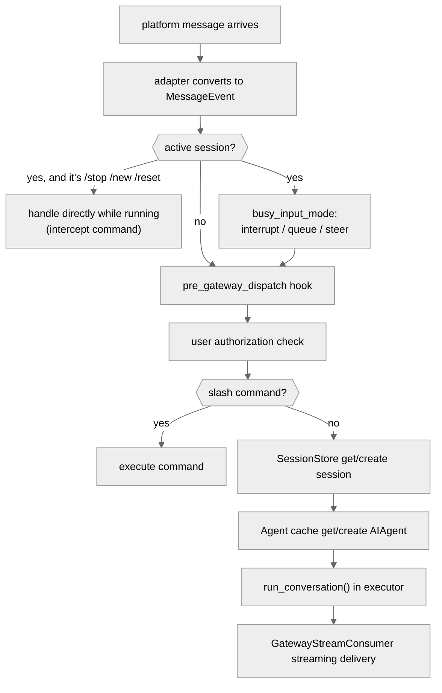

# 05 - Gateway Layer: One Process, All Platforms

[中文](../zh/05-网关层.md) | English

> **Scope**: the `gateway/` directory (70 .py, 77,883 lines). It contains the core controller `GatewayRunner` (`run.py:2774`, a 20,719-line file — the largest single file), the platform registry and 9 built-in adapters, session management, streaming delivery, and failure recovery. (A dozen-plus mainstream platform adapters have migrated to `plugins/platforms/`, see the "Platform Adapters" section.)
> **Key classes**: `GatewayRunner` (`gateway/run.py:2774`, mixing in three mixins), `BasePlatformAdapter` (`gateway/platforms/base.py:2253`), `SessionStore` (`gateway/session.py:961`), `GatewayStreamConsumer` (`gateway/stream_consumer.py:83`).

> **This chapter is based on hermes-agent v0.18.2 (tag [`v2026.7.7.2`](https://github.com/NousResearch/hermes-agent/releases/tag/v2026.7.7.2), commit `9de9c25f6`, 2026-07-07)**

---

## Why a Gateway?

In CLI mode, the user and the Agent are one-to-one. But what if you want the same Agent to serve a Telegram group, a Discord channel, a Slack workspace, and a WhatsApp DM all at once?

Each platform has its own protocol (Telegram uses the Bot API + webhooks, Discord uses WebSockets, Slack uses the Events API + Bolt), different message formats, different capabilities (some support message editing, some don't), and different user-identity systems. Writing a separate Agent service for each platform would be extremely repetitive, and the deployment complexity of maintaining 20 services is unacceptable.

The Gateway's solution is: **one process connects to all platforms at once, sharing the same Agent logic**. Platform differences are encapsulated in adapters, and the Agent core is completely unaware of where a message came from.

---

## Usage Guide

### Basic Usage

```bash
hermes gateway start     # start the gateway (background service)
hermes gateway stop      # stop
hermes gateway status    # check status
hermes gateway setup     # interactively configure platforms
hermes gateway install   # install as a system service (systemd/launchd)
hermes gateway run       # run in the foreground (for debugging)
```

### Configuration

```yaml
# Gateway-related config in config.yaml
gateway:
  platforms:
    telegram:
      enabled: true
      token: "${TELEGRAM_BOT_TOKEN}"   # read from .env
    slack:
      enabled: true
      app_token: "${SLACK_APP_TOKEN}"

display:
  busy_input_mode: "interrupt"  # new-message handling strategy: interrupt/queue/steer

session_reset:
  mode: "both"                  # idle/daily/both/none; default none (never auto-reset)
  idle_minutes: 1440            # idle-mode timeout (minutes, default 24 hours)
  at_hour: 4                    # daily-mode reset hour

group_sessions_per_user: true   # isolate group-chat sessions per user
```

### Common Scenarios

**Scenario 1: Telegram bot deployment.** `hermes gateway setup` and choose Telegram, entering the token from BotFather. After `hermes gateway start`, message the bot to start a conversation. Context is continuous across platforms — your conversation history on Telegram is independent of the CLI's.

**Scenario 2: Serving multiple platforms at once.** One Gateway process connects to Telegram + Slack + Discord simultaneously. Each platform's users have their own sessions but share the same Agent config (model, toolset, memory).

**Scenario 3: Scheduled cron delivery.** `hermes cron create "summarize HN headlines at 8 AM daily" --deliver telegram`, and the Gateway creates a separate Agent instance to execute the task at the specified time, delivering the result to Telegram's home channel.

### Troubleshooting

| Problem | Where to look |
|---------|---------------|
| Bot doesn't reply | `hermes gateway status` to confirm the process is running; check `~/.hermes/logs/gateway.log`; confirm the bot token is valid |
| Message sent but Agent doesn't respond | Check user authorization: `_is_user_authorized()` (now in `gateway/authz_mixin.py`) — may need DM pairing or an allowlist |
| Reply truncated | The platform has a message-length limit (take Telegram's 4096 chars as an example), and an over-long reply is auto-split into multiple messages |
| Session context suddenly gone | Check `SessionResetPolicy` (`gateway/config.py:347`) — an idle or daily reset may have triggered |
| Gateway restarts frequently | Check stuck-loop detection: if the same session is active on 3 consecutive restarts → that session is auto-suspended (`run.py:5954`) |
| One platform disconnected but others fine | Platform reconnection is independent: `_platform_reconnect_watcher()` (`run.py:7717`) does exponential-backoff reconnection for a failed platform |
| A transient Telegram network error took the whole gateway down? | Not anymore — v0.18 catches transient network errors at the event-loop level (`_is_transient_network_error()`, `run.py:232`, #31066/#31110), logging and swallowing them so they no longer drag down the process |
| Cron task didn't execute | `hermes cron list` to confirm the task exists; check whether `scheduler.tick()`'s file lock is stuck (`.tick.lock`) |
| Cron shows success but the message never arrived | Check whether the dead-target registry marked the target dead (auto-marked on delivery failure, self-heals on success) — see the Delivery Router under "Streaming Delivery" |
| Pairing code always invalid no matter what | Pairing rate-limiting/lockout may have triggered (the failure counter and platform-level lockout in `gateway/pairing.py`); wait for the lockout window to pass or clear the pending records — it's not necessarily a wrong code |
| Configured interrupt but it doesn't interrupt | Look at the degradation branches: an active subagent / compression-in-progress both auto-degrade to queue — see the degradation table under "Active-Session Check" |

> 📖 **Further Reading (Official Docs):**
> - [Message Gateway](https://hermes-agent.nousresearch.com/docs/user-guide/messaging)
> - [Security and Pairing](https://hermes-agent.nousresearch.com/docs/user-guide/security)
> - [Cron Scheduling](https://hermes-agent.nousresearch.com/docs/user-guide/features/cron)
> - [Gateway Internals](https://hermes-agent.nousresearch.com/docs/developer-guide/gateway-internals)

---

## Architecture & Implementation

### GatewayRunner: One Class, Four Files

First, the biggest structural change: v0.17's god-file decomposition (Chapter 00) split `GatewayRunner` into a main class + three mixins (`run.py:2774`):

```python
class GatewayRunner(GatewayAuthorizationMixin, GatewayKanbanWatchersMixin, GatewaySlashCommandsMixin):
```

- `gateway/authz_mixin.py` (710 lines) — the user-authorization cluster (`_is_user_authorized`, etc.)
- `gateway/kanban_watchers.py` (1,286 lines) — the kanban-board watch loop (Chapter 09)
- `gateway/slash_commands.py` (4,624 lines) — 46 gateway slash-command handlers

The split is a verbatim move, not a rewrite — the `self` semantics are unchanged, so when describing the flow we still say "some method of GatewayRunner," only the source's home changed. `run.py` itself still has 20,719 lines, holding the title of the largest single file in the whole project.

### The Complete Path of a Message from Platform to Agent

When a Telegram message arrives, it goes through the following path:



**Figure: The complete path of a message from platform to Agent**

Step by step:

**❶ The adapter receives and converts.** Each platform adapter converts the native message object into a unified `MessageEvent` (`gateway/platforms/base.py:1716`, a standardized message envelope containing fields like `source`, `text`, `message_type`, `message_id`, `media_urls`, `media_types`), then calls `handle_message()` (`base.py:4585`). This is the key step where platform differences are smoothed over — all subsequent logic looks only at the `MessageEvent`, not caring whether the message came from Telegram or Slack.

**❷ Active-session check.** If the chat already has a running Agent, the behavior is decided by `busy_input_mode` (`run.py:2785`):
- `interrupt` (default) — interrupt the current task to handle the new message
- `queue` — queue the new message to wait for the current task to finish
- `steer` — don't interrupt, but inject the new message as a steer instruction (having the Agent adjust course on the next step)

But the configured mode doesn't take effect unconditionally — the actual dispatch (from `run.py:5119`) carries a set of degradation and bypass branches:

| Situation | Actual behavior | Basis |
|-----------|-----------------|-------|
| The Agent has an active subagent | `interrupt` auto-degrades to `queue` (interrupting the parent would kill the entire subagent tree, #30170) | `run.py:5328` |
| Context compression in progress | Also degrades to `queue` (#56391) | `run.py:5339` |
| `steer` fails (Agent not ready / no payload) | Falls back to `queue` | `run.py:5350` |
| Internal synthetic events (background-task completion notices, etc.) | Never interrupt/steer, silently queue — a background task completing shouldn't interrupt your ongoing conversation | `run.py:5291` |
| A text reply to a pending approval ("yes"/"no") | Bypasses to the approval handler, not into interrupt/queue/steer (#46866) | `run.py:5211` |

The queue has a hard cap: `_BUSY_QUEUE_MAX_PENDING = 32` (`run.py:5125`); anything over is dropped directly with a warning logged — check here for "part of the messages disappeared after a flood came in." v0.18's concurrency-model rewrite also lets **intercept commands** like `/stop`, `/new`, `/reset` be handled immediately while the Agent is running — note that `/stop` in the busy path does a hard kill of `_running_agents`, not a soft `interrupt()`.

**❸ Plugin hook.** `pre_gateway_dispatch` (`run.py:8754`) triggers, and a plugin can return `{"action": "skip"}` to drop the message, `{"action": "rewrite", "text": "..."}` to rewrite it, or `{"action": "allow"}` to let it through. Triggered only for external messages (not system-generated internal events).

> ⚠️ **Security note**: the `pre_gateway_dispatch` hook triggers **before** the authorization check. This means an unauthorized user's message also passes through plugins — plugin developers must handle the unauthorized case within the plugin themselves and can't rely on the Gateway's authorization layer to filter.

**❹ User authorization.** `_is_user_authorized()` (`gateway/authz_mixin.py`) checks whether the sender is permitted to use the Agent. It supports several authorization modes: DM pairing (`gateway/pairing.py` — the first DM requires entering a pairing code), allowlist (`gateway.allowed_users` config), open group chat, etc. The Team Gateway scenario (see the relay section) also has an `authorization_is_upstream` mode — trusting that the upstream gateway already did the authorization.

**❺ Command parsing.** Check whether the message is a slash command (`/model`, `/new`, `/stop`, `/compress`, etc.; 46 handlers in `gateway/slash_commands.py`).

**❻ Session fetch.** `SessionStore.get_or_create_session()` (`session.py:1687`) looks up or creates a session by `session_key` (a session identifier composed of platform + chat ID + user ID, see "Session Management" below). If the session has timed out, it's handled per the reset policy.

**❼ Agent fetch.** Looks up an Agent by `session_key` in `_agent_cache` (`run.py:2961`, an OrderedDict). A cache hit requires two conditions: the session_key matches, and `_agent_config_signature()` (`run.py:15518`) matches — the signature covers model, provider, api_mode, api_key fingerprint, base_url, enabled_toolsets, some cache-affecting config keys (context_length, compression, etc.), **and also user_id/user_id_alt**. The last item has a concrete incident background (`run.py:15542-15549` comment, #27371): a shared-thread-mode session_key deliberately omits participant IDs, and if the signature also omitted user_id, the same cached Agent would be reused across multiple users — the Honcho memory Provider freezes the user identity on the first message, so a second user's words would be attributed to the first user. Putting user_id in the signature means "rebuild the Agent when the person changes in a shared thread" — trading prompt-cache hit rate for correct memory attribution.

On a cache miss it creates a new AIAgent and restores the session history from SQLite — this is why the first message after a config change is slow (a cold start).

> **Cache eviction policy**: dual eviction — a capacity cap of 128 (`_AGENT_CACHE_MAX_SIZE`, `run.py:67`) + a 1-hour idle TTL (`_AGENT_CACHE_IDLE_TTL_SECS`, `run.py:68`). A running Agent is protected from eviction — so the cache **may temporarily exceed 128** (over-capacity entries that are all running only log a warning, near `run.py:16176`); check this first when memory usage is higher than expected. Idle sweeping is also coupled with the reset policy: a session with `session_reset.mode != "none"` defers eviction, leaving it to the expiry monitor to run the full `on_session_end` (memory persisted to disk); `mode == "none"` soft-evicts immediately but doesn't trigger `on_session_end`. An evicted Agent's resources are cleaned up asynchronously on a background daemon thread, not blocking cache operations.

**❽ Execution.** `AIAgent.run_conversation()` runs in a thread pool via `loop.run_in_executor()` — the Gateway main loop is asyncio, the Agent is synchronous, and the executor bridges the two.

**❾ Streaming delivery.** `GatewayStreamConsumer` (`stream_consumer.py:83`) bridges between the Agent's synchronous callbacks and the platform's asynchronous sending (see "Streaming Delivery" below).

### Session Management: Whose Conversation Belongs to Whom

The Gateway faces a problem the CLI doesn't need to consider: **the same chat window may have multiple users**.

The generation rule for `session_key` determines the granularity of session isolation:

| Scenario | session_key format | Effect |
|----------|--------------------|--------|
| DM | `agent:main:{platform}:dm:{chat_id}` | one user, one session |
| Group chat (default) | `...:{chat_id}:{user_id}` | each user a separate session |
| Group chat (shared mode) | `...:{chat_id}` | the group shares one session |
| Thread | `...:{chat_id}:{thread_id}` | shared within the thread |

Group chats isolate per user by default (`group_sessions_per_user=True`). In shared mode, multiple people's messages enter the same conversation stream, each prefixed with `[sender name]`. Three easily-tripped edge cases (`build_session_key()`, `session.py:870-958`): **thread isolation is a separate switch** — `thread_sessions_per_user` (default False, shared within a thread) and `group_sessions_per_user` are two dimensions; **a DM missing a chat_id has a fallback chain** — falling back in order to `user_id_alt`/`user_id` → `thread_id` → a bare `platform:dm` (the comment says outright this prevents "an adapter without a chat_id stuffing everyone into one shared session"); **WhatsApp's participant ID is canonicalized first** (`canonical_whatsapp_identifier()`) — a JID/LID alias flip would otherwise split the same person into two sessions.

#### Session Reset Policy

`SessionResetPolicy` (`gateway/config.py:347`) defines four reset modes:
- **idle** — auto-reset after idle for more than the specified time (default 1440 minutes = 24 hours)
- **daily** — reset at a specified hour each day (default 4 AM)
- **both** — reset when either condition is met
- **none** (default) — never auto-reset (context managed by compression only)

The default has a history: it was long `both` (24-hour idle + daily 4 AM), and in 2026-07 (`9c272a306`, #60194, the same day as this chapter's baseline tag) it was changed to `none` — the docstring says outright that the old default "surprised users who expected their conversations to persist." Auto-reset now requires explicit configuration.

A reset clears the conversation history and starts a new `session_id`, but persistent memory (MEMORY.md, USER.md) is unaffected. If the session has an active background process, the reset is deferred until the process ends.

#### PII Protection

Different platforms have different privacy requirements for user IDs. `_PII_SAFE_PLATFORMS` (`session.py:332`) contains 4 platforms — WhatsApp, Signal, Telegram, BlueBubbles — whose user_id may contain sensitive info like a real phone number. These platforms' IDs are hashed for anonymization before being injected into the system prompt, so the real ID never leaks to the LLM. Other platforms' (take Discord as an example) user_id keeps the original format, because Discord's mention system needs the original ID (`<@user_id>`).

### Platform Adapters: From a Built-in Legion to a Plugin Ecosystem

`BasePlatformAdapter` (`gateway/platforms/base.py:2253`, a 5,627-line file) is the abstract base class for all platform adapters. **Adding a platform requires implementing only 4 methods**:

| Method | Required | Purpose |
|--------|----------|---------|
| `connect()` | Yes | connect to the platform (since v0.18 with an `is_reconnect` parameter, `base.py:2864` — an adapter can skip one-time initialization on reconnection) |
| `disconnect()` | Yes | disconnect |
| `send()` | Yes | send a text message (`base.py:2889`) |
| `get_chat_info()` | Yes | get chat info (`base.py:5476`) |
| `edit_message()` | No | streaming edit (send a new message each time if unsupported) |
| `send_image()` / `send_voice()` / `send_video()` / `send_document()` | No | rich media (degrade if unsupported) |
| `send_typing()` / `delete_message()` | No | typing indicator / delete message |
| `send_draft()` and 4 other draft methods | No | **draft streaming** (from `base.py:2471`) — platforms that support a native "typing" draft preview (Telegram Bot API 9.5+ DMs) can render streaming content as a live draft rather than repeatedly editing a message |

v0.18 also gave adapters **capability-declaration class attributes** (from `base.py:2288-2296`, 5 of them like `supports_async_delivery`, `splits_long_messages`) — the Gateway uses these to decide at which layer to split a long message and whether delivery goes the sync or async path, rather than trial and error at runtime.

**The distribution of platforms underwent a narrative-level change between v0.16-v0.18** (see the migration story in Chapter 08):

- **20 platforms are distributed as plugins** (`plugins/platforms/`) — Telegram, Slack, Discord, Feishu, DingTalk, WeCom, Matrix, Mattermost, WhatsApp, Email, SMS, Home Assistant, IRC, Line, ntfy, Simplex, Teams, Google Chat, Photon (iMessage), Raft. All the mainstream message platforms are here
- **The gateway keeps only 9 built-in adapters** — Signal, WeChat Official Account, WhatsApp Cloud API, Tencent Yuanbao, QQ Bot, BlueBubbles, plus the three protocol entry points API Server / Webhook / MS Graph Webhook

The two sides are connected by the **platform registry** (`gateway/platform_registry.py`, 332 lines): plugin discovery only registers a deferred loader (importing each vendor's heavy SDK only on first use — eagerly loading 20 platforms once added seconds to every `hermes` startup, Chapter 01), and when the gateway builds an adapter it first checks the registry, only falling back to the built-in if/elif if the registry doesn't have it (`_create_adapter()`, `run.py:8514`). A registry entry (`PlatformEntry`) carries more than a factory function — required_env, the setup function, the authorization-environment-variable name, the message-length cap, the PII marker, and the system-prompt hint are all in it, and both `hermes setup` and the authorization check read metadata from the registry.

Optional methods have sensible degradation — take `send_image()` as an example: if the adapter doesn't implement it, the Gateway auto-degrades to a text message with the image URL.

### Streaming Delivery: Letting Users See "Typing"

`GatewayStreamConsumer` (`stream_consumer.py:83`, a 1,800-line file) is the core of streaming delivery. v0.18 upgraded its input from "coarse-grained token deltas" to a **fine-grained event stream** (`gateway/stream_events.py`, 171 lines):

- `MessageChunk` (`:44`) — an assistant text delta (reasoning/thinking content is filtered upstream and never appears as a MessageChunk)
- `ToolCallChunk` (`:85`) — a tool call starting/in-progress, with a name and argument preview, **its presentation decided by the gateway side** (emoji, truncation, verbose/compact, or swallowed entirely on some platforms)
- `Commentary` (`:72`) — the complete interstitial talk the model says between tool iterations ("let me look at the repo structure first") — a complete text, not a delta

Adapters can therefore customize their rendering strategy rather than every platform consuming the same concatenated text. A few designs that affect user experience:

**Edit cadence** — tokens enter a queue, and an async task calls `edit_message()` to update only when the trigger condition is met (an edit interval of 0.8 seconds or a buffer of 24 characters, `DEFAULT_STREAMING_EDIT_INTERVAL/BUFFER_THRESHOLD`, `gateway/config.py:539-540`, configurable), sending the final version after the Agent finishes. Platforms that support draft streaming (Telegram DM) switch to native draft rendering.

**Think-block filtering** (`_filter_and_accumulate()`, `stream_consumer.py:385`) — the model's internal reasoning tags (`<think>`, `<reasoning>`) are filtered by a state machine during streaming. A reasoning tag may be split across deltas (take `<thi` in one delta, `nk>` in the next as an example), and the state machine maintains a buffer to hold a possible tag prefix, waiting for a complete tag to be confirmed before deciding to filter or pass. When troubleshooting "a `<thi` fragment occasionally appears in the output," start here. Another edge case (the `is_boundary` decision at `:437-452`): filtering **only recognizes a tag at the start of a line (or with only whitespace before it)** — when the model writes `<think>` in the middle of a line of text, it's passed through to the user verbatim. "Occasionally seeing a complete `<think>` tag" is most likely this cause, not a broken filter.

**Long-message splitting** (`stream_consumer.py:956`) — different platforms have different message-length limits (take Telegram's 4096 chars as an example). An over-long reply is split by word and code-block boundaries into multiple messages, with a `(1/2)` chunk indicator.

**Deliverable Mode (turning generated files into attachments)**: after the Agent generates a chart/PDF/table, the user doesn't have to copy a local path — the model puts a `MEDIA:<absolute path>` marker in the reply, and before delivery the gateway uses `MEDIA_TAG_CLEANUP_RE` (`stream_consumer.py`, an anchored regex) to strip the marker from the **visible text** while uploading the file as a **native attachment** to the chat. An edge-case design: only a marker whose path ends in a known deliverable extension is stripped, and an unknown-extension path is kept visible as-is rather than silently swallowed (#34517). The streaming and non-streaming paths share the same regex, guaranteeing a marker behaves identically on both paths.

**Delivery Router** (`gateway/delivery.py`, 557 lines) uniformly decides "which target this message goes to, at which layer it's split, and via which adapter it's delivered" — cron output and Agent replies share this router. It also has three layers of fault tolerance internally, all entry points for troubleshooting "the message didn't arrive":

- **The dead-target registry** (`DeadTargetRegistry`, `gateway/dead_targets.py`, pre-delivery check from `delivery.py:274`): on a delivery failure it classifies by error text (`_classify_dead_from_error_text`, `:116` — only a whole-chat-level not_found counts as dead, deleting a single forum topic doesn't drag the chat down), and after confirming a dead target it skips sending directly; one successful delivery auto-clears the mark (self-healing). Check here for "cron shows success but the message never arrives"
- **Silence-narration filtering** (`_is_silence_narration()`, `:43`): recognizes the model's "I'll stay quiet" hallucination noise like "*(silent)*", 🔇, a bare period, and drops it directly without delivery — in a cross-bot forwarding scenario such noise would cause an infinite mirroring loop. Note it and cron's `[SILENT]` explicit marker (Chapter 11) are two different mechanisms: one is a convention protocol, the other is hallucination recognition
- **Over-length truncation + audit retention** (`MAX_PLATFORM_OUTPUT = 4000`, `:29`; handling at `:403-451`): over-limit output first writes a full copy to disk, then based on the adapter's `splits_long_messages` capability decides between "truncate and add a 'full output saved to…' footnote" or handing it to the adapter's native chunking

**The fresh-final mechanism** (from `gateway/config.py:575`) — if a streaming response lasts longer than `fresh_final_after_seconds` (e.g. set to 60 seconds), the final version is sent as a new message (rather than an edit), so the platform timestamp reflects the actual completion time. Note this is **off by default** (default `0.0` = always finalize in place), and Telegram's `prefers_fresh_final_streaming()` hardcodes `False` (`telegram/adapter.py:1453`) — fresh-final briefly shows two copies of the final answer then deletes the preview at wrap-up, looking like duplicate delivery, which is why #46206 reverted it; Telegram instead uses the Bot API's `editMessageText` to upgrade to rich text in place.

**Flood control** (`stream_consumer.py:100`) — if platform rate-limiting causes 3 consecutive `edit_message()` failures (`_MAX_FLOOD_STRIKES = 3`), that stream permanently disables progressive edit and degrades to caching all content then sending it once. This prevents rate-limit errors from fragmenting the message.

### Failure Recovery

As a long-running process, failure recovery is a core concern for the Gateway.

**Platform reconnection** (`_platform_reconnect_watcher()`, `run.py:7717`) — one platform disconnecting doesn't affect others. A background task does exponential-backoff reconnection for a failed platform (30s → 60s → 120s → 240s → 300s cap), and the docstring (`:7720-7729`) is very explicit about what follows: **retryable failures (network/DNS blips) retry indefinitely at the backoff cap and never auto-pause** — an "auto-circuit-broke a recovered platform" used to be the cause of a "bot silently dead after a transient DNS failure" incident, and this behavior was deliberately removed; **non-retryable failures (a bad token, etc.) exit the retry queue immediately**; the circuit breaker (`_pause_failed_platform`) keeps only a **manual** operation path (`/platform pause`, `/platform resume`). When troubleshooting "a platform won't connect," first distinguish which kind: `/platform list` shows the three states connected/retrying/fatal. On reconnection, `connect(is_reconnect=True)` lets the adapter skip one-time initialization.

**Transient network-error self-healing** (since v0.15, `_is_transient_network_error()`, `run.py:232`) — targeting the crash class recorded in #31066/#31110: an unhandled Telegram timeout exception could once blow up the whole gateway along the asyncio event loop. Now an event-loop-level exception handler recognizes the transient-network-error class as "safe to log and swallow," so one platform's network blip no longer becomes a whole-gateway incident.

**Session recovery** has several layers, from lowest to highest priority:

- **Auto-resumption after any restart** — not just the `/restart` command: on every startup (including after a crash) the gateway first runs `SessionStore.suspend_recently_active(max_age_seconds=120)` (`session.py:2053`, #7536): sessions active within the last 120 seconds are marked `resume_pending`, and the next message auto-resumes the old transcript. The `/restart` command is just the proactive version: it first notifies active sessions "restarting," waits for the Agent to finish (with a timeout force-interrupt), then restarts. The SIGUSR1 graceful drain covered in Chapter 01 is its service-manager-side counterpart
- **Resumption has a freshness window** (near `session.py:1789`) — if `resume_pending` hangs too long without actually resuming (e.g. the resume message itself failed), the next message judges it a zombie session and forces a reset — "it should have resumed after restart but became a new conversation" is usually past this window
- **Stuck-loop force-suspend** (`run.py:5984-6031`) — if the same session is active on 3 consecutive restarts (`_STUCK_LOOP_THRESHOLD = 3`), it's judged a possible crash culprit and escalated to `suspended` (higher priority than `resume_pending`, `session.py:1770`). The counter is persisted in `~/.hermes/.restart_failure_counts`; a suspended session is **force-reset** (history cleared) rather than refused service on its next message; one successful conversation zeroes the counter (`_clear_restart_failure_count()`, `run.py:6033`); manual clearing: delete that file
- **Compression-resumption self-healing** (`_heal_compression_tip_locked`, `session.py:1623-1663`) — context compression migrates the transcript to a child session; if a restart/send failure leaves the SessionStore's mapping still pointing at the pre-compression parent session, the next read automatically "heals" to point at the child session. Another possible root cause of "the last few rounds of history are missing after a restart"

**Zero-platform startup** — if no platform connected successfully, the Gateway still runs — because it also needs to execute Cron tasks. Only a non-retryable error (take a config-format error as an example) exits.

**Graceful shutdown** (orchestration entry `stop()`, `run.py:7907`) — `SIGTERM` triggers graceful shutdown: stop accepting new messages, wait for running Agents to finish (`restart_drain_timeout` configured timeout), close all platform connections, clean up the Agent cache. `shutdown_forensics.py` (462 lines) records each Agent's state during shutdown, helping troubleshoot shutdown-time anomalies.

### Relay: Gateway to Gateway

`gateway/relay/` (6 .py, 2,456 lines, a subpackage added in v0.17) implements the WebSocket connector of the **Team Gateway**: a member machine's gateway acts as a downstream, connecting to the team's upstream gateway, and messages are forwarded in via the upstream. A downstream can declare `authorization_is_upstream` — trusting the upstream has already done user authorization, not re-checking locally. This makes "a team sharing one outward-facing bot while each member machine runs its own Agent" possible. The details belong to the team-deployment topic; here we only note its place in the architecture: to the GatewayRunner, the relay is just another "platform."

The above is the Gateway's fault tolerance for "passive messages." The Gateway also has another side: it doesn't just wait passively for messages, it also takes the initiative.

### Cron Integration

Besides passively responding to messages, the Gateway takes on another duty — proactively triggering tasks at specified times. `cron/scheduler.py` implements this scheduling logic.

A cron task creates a **separate AIAgent instance** on execution (not reusing the Gateway's Agent cache), with its own toolset. Result delivery goes through the Delivery Router (the three-layer handling of dead-target skipping, silence filtering, and over-length truncation is in the "Streaming Delivery" section) and supports several targets:
- `local` — write a file only, don't send
- `origin` — send back to the chat that created the task
- `telegram` / `slack` / ... — the home channel of the specified platform
- `telegram:12345` — a specified chat_id on the specified platform

Delivery prefers to use the Gateway's running active adapter — important for platforms needing E2E encryption (take Matrix as an example), because only an established encrypted session can send messages. If the Gateway isn't running, it falls back to a standalone HTTP client calling the platform API directly.

When an Agent reply contains `[SILENT]`, the output is saved to a local file but not delivered — avoiding a "no update" message bothering the user (details in Chapter 11).

### Code Organization

```
gateway/
├── run.py               — GatewayRunner core controller (20,719 lines — the largest single file)
├── authz_mixin.py       — authorization mixin (710 lines, extracted from a god-file)
├── kanban_watchers.py   — kanban watch mixin (1,286 lines, ditto, → Chapter 09)
├── slash_commands.py    — 46 slash-command mixin (4,624 lines, ditto)
├── session.py           — SessionStore session management (2,432 lines)
├── stream_consumer.py   — streaming-delivery bridge (1,800 lines)
├── stream_events.py     — fine-grained stream-event model (171 lines, new)
├── config.py            — gateway config + SessionResetPolicy (2,277 lines)
├── status.py            — process-status tracking (1,456 lines)
├── delivery.py          — message-delivery routing (557 lines)
├── relay/               — Team Gateway WebSocket connector (6 files, 2,456 lines, new)
├── shutdown_forensics.py — shutdown-time state recording (462 lines)
├── pairing.py           — DM pairing authorization (661 lines)
├── channel_directory.py — platform channel directory (496 lines)
├── platform_registry.py — platform registry + deferred loading (332 lines)
├── hooks.py             — hook discovery and lifecycle (227 lines)
└── platforms/
    ├── base.py          — BasePlatformAdapter ABC + MessageEvent (5,627 lines)
    ├── yuanbao.py       — Tencent Yuanbao (the largest built-in adapter)
    ├── api_server.py    — HTTP API adapter
    ├── signal.py / weixin.py / whatsapp_cloud.py / bluebubbles.py
    ├── qqbot/ / msgraph_webhook.py / webhook.py
    └── ...(mainstream platform adapters migrated to plugins/platforms/, → Chapter 08)
```

### Design Decisions

#### The 20,719-Line run.py and Three Mixins

`gateway/run.py` is still the largest single file in the whole project, but it's no longer a sample of "refusing to split" — v0.17's god-file decomposition moved three high-cohesion clusters (authorization, kanban watching, slash commands) into separate mixin files (a verbatim move, behavior-neutral). What remains in run.py is the part with the densest shared state: message handling, Agent-cache management, reconnection, shutdown. The split strategy matches `cli.py` and `run_agent.py`: not pursuing a smaller file, but pursuing "new code has a clear home."

#### An Agent Cache Rather Than Creating Each Time

Creating an AIAgent is heavy — initializing the client, loading toolsets, building the system prompt, restoring session history. If it were created from scratch for every message, the latency would be unacceptable. The 128-instance LRU cache (`_AGENT_CACHE_MAX_SIZE`, `run.py:67`) strikes a balance between memory and latency. An evicted session doesn't lose data — it's restored from SQLite on the next message.

#### The Adapter's "Required + Optional Degradation + Capability Declaration"

Rather than requiring the adapter to implement all methods, it provides sensible degradation. This lowers the barrier to adding a platform — 4 required methods and it runs, advanced features added as needed. v0.18's capability-declaration attributes turned "what this platform can do" from runtime trial-and-error into declarative metadata — whether a long message is split at the adapter or gateway layer, and whether it can be delivered asynchronously, is known before connecting. The cost is that degradation behavior may not match user expectations (take "sending an image becoming sending a URL" as an example), but this is better than "if images aren't supported it's completely unusable."

### Extension Points

1. **Add a platform adapter**: implement the 4 required methods of `BasePlatformAdapter`, and register it as a plugin via `ctx.register_platform()` (Chapter 07)
2. **pre_gateway_dispatch hook**: intercept/rewrite before a message enters the Agent
3. **Custom session reset policy**: via `session_reset` config
4. **Cron delivery targets**: the delivery router supports custom platform delivery
5. **Team Gateway**: attach the local gateway to an upstream team gateway via the relay subpackage

---

## Relationship to Other Chapters

| Related Chapter | Relationship |
|-----------------|--------------|
| 00 — Project Overview | The Gateway is the solution to Chapter 00's "platform fragmentation" problem |
| 01 — Infrastructure Layer | `hermes_cli/gateway.py` manages the Gateway process lifecycle; the platform deferred loader is registered into this chapter's platform_registry at plugin discovery |
| 02 — Agent Core | The Gateway creates and caches AIAgent instances, executing via `run_conversation()` |
| 07/08 — Plugin Framework/Built-in Plugins | The 20 platform adapters are distributed as plugins (migration story in Chapter 08) |
| 09 — Kanban System | The kanban-board watch loop is in GatewayKanbanWatchersMixin |
| 11 — Cron Scheduling | Cron tasks deliver results through the Gateway via the delivery router |

---

*This document is based on source analysis of hermes-agent v0.18.2. All code references have been independently verified.*
