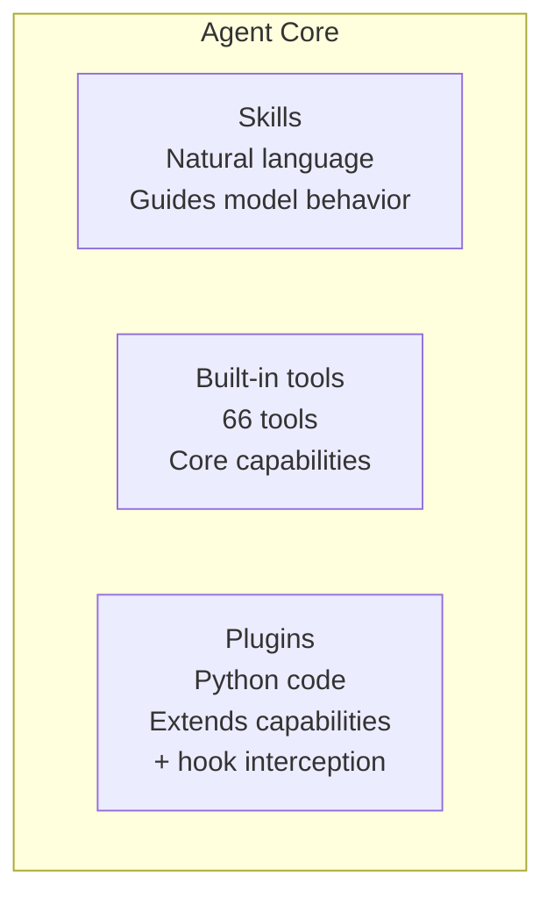
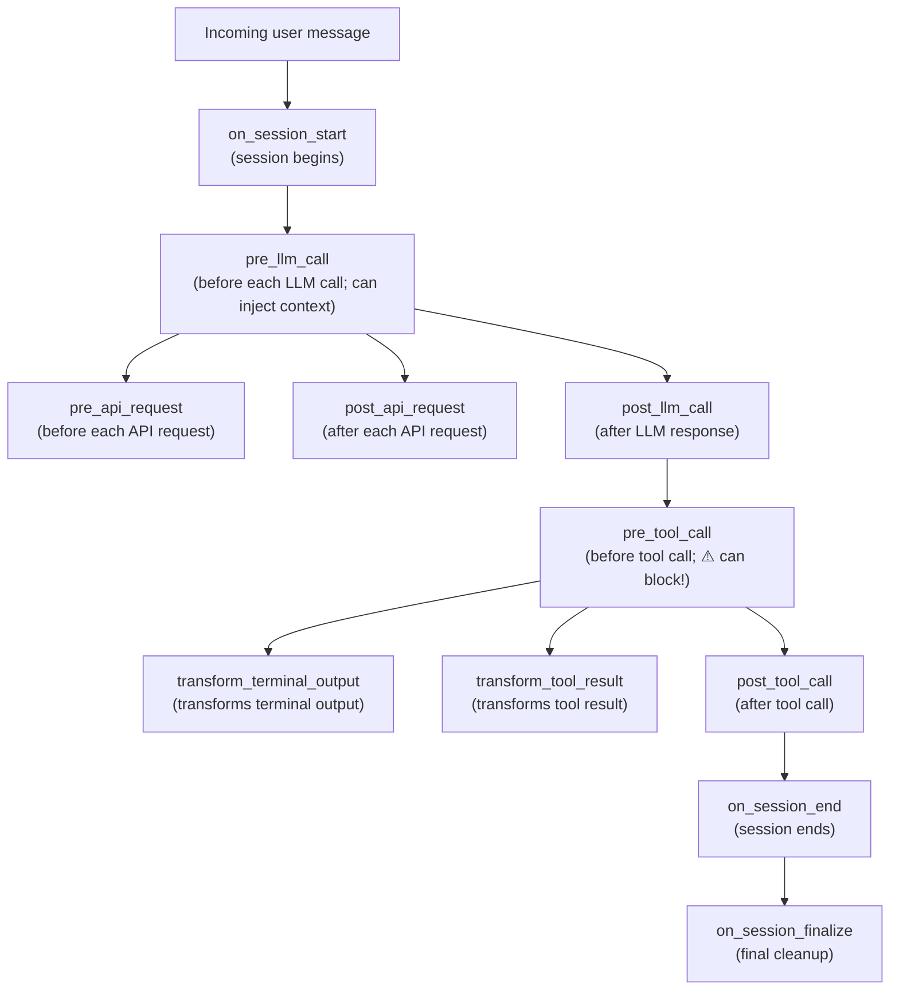
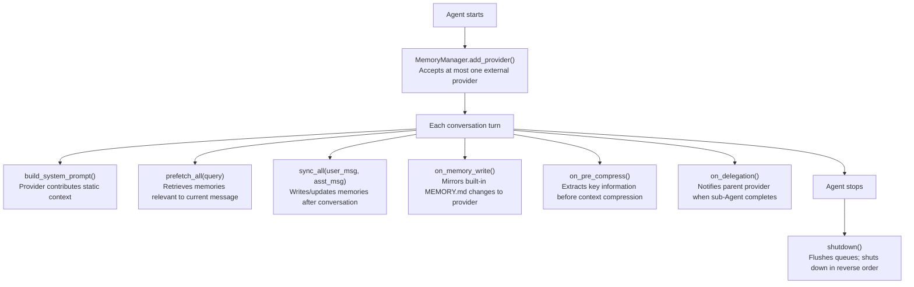

# 05 - Plugin System: Extending Agent Capabilities with Code

> **Chapter scope**: `plugins/` directory (41 files, 18,603 lines) + `hermes_cli/plugins.py` (plugin manager). Plugins are a runtime extension mechanism at the Python code level, complementing the natural-language-level skills system.
> **Key classes**: `PluginContext` (`hermes_cli/plugins.py:210`), `PluginManager` (`hermes_cli/plugins.py:518`).

## When Skills Are Not Enough

The previous chapter introduced the skills system — using natural-language instructions to guide model behavior. Skills are powerful, but they have a fundamental limitation: they can only tell the model *how to do* something; they cannot change the Agent's own capabilities. If you want Hermes to connect to Spotify and play music, automatically track temporary files and free up disk space, or send a trace of every LLM call to Langfuse — these require **runtime Python code**, not a SKILL.md file.

That is where the plugin system fits: **skills are extensions at the model layer (changing the model's behavioral instructions); plugins are extensions at the runtime layer (changing the Agent's capability set)**.

**Figure: Skills (natural language / model layer) and plugins (Python code / runtime layer) within the Agent core**

## What Plugins Can Do

A plugin registers its capabilities through a `PluginContext` object (`hermes_cli/plugins.py:210-511`). This context is the API surface the Agent exposes to plugins — what a plugin can do is strictly bounded by the methods on the context.

The main capabilities are:

**Register new tools.** Plugins use the same `registry.register()` interface as built-in tools — from the model's perspective, plugin tools are indistinguishable from built-in ones. The Spotify plugin (`plugins/spotify/__init__.py:56-66`), for example, registers 7 tools (playback control, device management, search, playlists, etc.), and the model can call `spotify_search` the same way it calls `read_file`.

**Register lifecycle hooks.** This is the most powerful plugin capability — the ability to insert custom logic at key points in the Agent's workflow. The system defines 16 hooks (`hermes_cli/plugins.py:60-96`), covering the complete lifecycle from tool calls to LLM requests to session management:

The full hook execution order is as follows:

**Figure: Plugin lifecycle hook execution order — from session start through LLM calls and tool execution to session end**

`pre_tool_call` is the most notable hook — it can return `{"action": "block", "message": "..."}` to **block a tool call** (`hermes_cli/plugins.py:1085-1121`). This means plugins can implement custom security policies: a rate-limiting plugin could automatically reject repeated calls to the same tool within a short time window, or an access-control plugin could decide which tools are available based on the user's identity. The first effective block instruction takes effect immediately; subsequent checks are not evaluated.

Every hook callback is wrapped in a try/except (`hermes_cli/plugins.py:995-1001`), so a crash in one plugin does not affect other plugins or the Agent core — this is the plugin system's isolation guarantee.

**Register slash commands and CLI subcommands.** Plugins can register slash commands such as `/disk-cleanup` (available in both CLI and Gateway, `hermes_cli/plugins.py:303-355`), as well as terminal subcommands such as `hermes spotify` (`hermes_cli/plugins.py:278-299`). Registration is rejected if the command name conflicts with a built-in command.

**Register image generation backends.** Different providers have different image generation APIs — OpenAI's gpt-image-2, xAI's Grok — and plugins register backends via `ctx.register_image_gen_provider()` (`hermes_cli/plugins.py:422-445`). The `image_generate` tool selects the appropriate backend based on the current configuration.

**Register plugin-private skills.** `ctx.register_skill()` (`hermes_cli/plugins.py:468-511`) lets a plugin bundle its own SKILL.md files, named `<plugin>:<skill>`. These skills do not enter the global index (they do not appear in the system prompt's `<available_skills>` section) and must be loaded explicitly — they are the plugin's internal reference documentation, not public skills.

**Inject messages.** `ctx.inject_message()` lets a plugin inject new messages into the Agent's conversation stream at runtime (`hermes_cli/plugins.py:250-274`). This is used for bridging external events — in the Google Meet plugin, for example, when someone speaks during a meeting, the plugin injects the transcript as a message into the Agent's conversation flow.

With so many capabilities available, plugins themselves come in several varieties — because different capabilities require different activation modes.

## Three Plugin Types

Not all plugins are the same. The `kind` field in `plugin.yaml` distinguishes three types (`hermes_cli/plugins.py:161-191`):

**`standalone`** (default) — self-contained feature plugins. Require the user to explicitly enable them in the `plugins.enabled` configuration. The disk-cleanup plugin (`plugins/disk-cleanup/`) is an example: it registers `post_tool_call` and `on_session_end` hooks to track and clean up temporary files, and provides a `/disk-cleanup` slash command.

**`backend`** — service backend plugins. These provide a provider implementation for a built-in tool. If the plugin is bundled (packaged alongside Hermes), it loads automatically without requiring an opt-in (`hermes_cli/plugins.py:633-634`). The `image_gen/openai` plugin (`plugins/image_gen/openai/`) is an example: it provides the OpenAI gpt-image-2 backend for the `image_generate` tool.

**`exclusive`** — mutually exclusive plugins; only one can be active at a time. Memory plugins fall into this category — you would not run both Honcho and Mem0 to manage memory simultaneously. Exclusive plugins are managed by a separate discovery path (not through the general `PluginManager`) and activated via a specific config key (e.g., `memory.provider: honcho`).

## Memory Plugins: The Most Complex Extension Point

Memory plugins are the most complex extension point in the plugin system — they determine what the Agent can remember, what it forgets, and how much it knows when a new conversation begins.

The `plugins/memory/` directory contains 8 memory plugins (honcho, hindsight, holographic, mem0, openviking, retaindb, supermemory, byterover), but only one can be active at a time. Discovery and loading are managed through a separate path (`plugins/memory/__init__.py`); the general `PluginManager` skips this directory (`hermes_cli/plugins.py:573-575`).

Memory plugins register by implementing the `MemoryProvider` ABC (`agent/memory_provider.py:42-241`). The complete lifecycle defined by `MemoryProvider` is as follows:

**Figure: Complete lifecycle of a memory plugin (MemoryProvider) — from Agent startup through per-turn build, prefetch, sync, and compression to shutdown**

`MemoryManager` (`agent/memory_manager.py`) is the runtime dispatch layer. It always includes a built-in `BuiltinMemoryProvider` (based on MEMORY.md + USER.md) and accepts at most one additional external provider (`agent/memory_manager.py:207`; a second one is rejected). Why not support multiple? Because multiple providers writing to the same conversation history simultaneously creates conflicts and duplication — each has its own semantic understanding of events, and merging them is an unsolved problem.

The most sophisticated example is the Honcho plugin (`plugins/memory/honcho/`), which implements multi-pass deep memory extraction: through repeated `.chat()` calls (`honcho/__init__.py:949-989`), each pass operating at a distinct reasoning level (minimal → low → medium → high → max), with early exit when a strong signal is found.

Honcho also implements an overhead-awareness mechanism (`honcho/__init__.py:722-774`) — like an investigator who only reaches for the notepad when there is a lead. `context_cadence` and `dialectic_cadence` control call frequency: deep extraction is not triggered on every turn but only every N turns. On consecutive empty results, linear backoff is applied (cadence increases by the count of consecutive empty results, with a ceiling, `honcho/__init__.py:825-831`), preventing wasteful API calls during low-signal sessions like casual chitchat.

## Context Engine Plugins: Replacing the Compression Strategy

`plugins/context_engine/` is another independently discovered plugin path. In [02 - Agent Core](02-agent-core.md) we saw that the context compressor (`ContextCompressor`) performs LLM-based summarization when the conversation history grows too long — that is the default implementation. Context engine plugins allow that strategy to be replaced.

Only one context engine can be active at a time (`hermes_cli/plugins.py:390-418`), selected via the `context.engine` config key (`plugins/context_engine/__init__.py:9-10`). The default is the built-in `ContextCompressor`. If a better compression strategy exists (e.g., vector-retrieval-based selective retention), it can be provided by implementing the `ContextEngine` ABC.

## Plugin Loading Rules

Plugins do not activate simply by being present — Hermes applies a clear priority order for loading plugins (`hermes_cli/plugins.py:596-656`):

1. **Explicit disable takes highest priority** — plugins in the `plugins.disabled` list are never loaded
2. **Bundled backends load automatically** — backend plugins packaged with Hermes (e.g., `image_gen/openai`) require no opt-in
3. **Standalone plugins require opt-in** — must appear in `plugins.enabled` to load
4. **Exclusive plugins are controlled by dedicated config** — e.g., `memory.provider: honcho`
5. **pip entry-point plugins** — discovered via the `hermes_agent.plugins` entry point group (`hermes_cli/plugins.py:98`), suitable for third-party plugins distributed via `pip install`
6. **User/project plugins always require opt-in** — regardless of `kind`, externally installed plugins must be explicitly enabled

Path traversal protection (`hermes_cli/plugins_cmd.py:37-71`) ensures that during `hermes plugin install`, plugin names cannot contain `/`, `\`, or `..`, and installation targets cannot escape the plugins directory.

## What's Next

This chapter has covered Hermes's "internal" systems — Agent core, tools, skills, and plugins. Next, **[06 - Gateway](06-gateway.md)** turns outward — how Hermes serves 20 messaging platforms simultaneously, how sessions are managed, and how messages are delivered.

---

*This document is based on analysis of hermes-agent v0.11.0 source code. All code references have been independently verified.*
