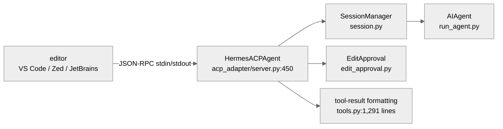
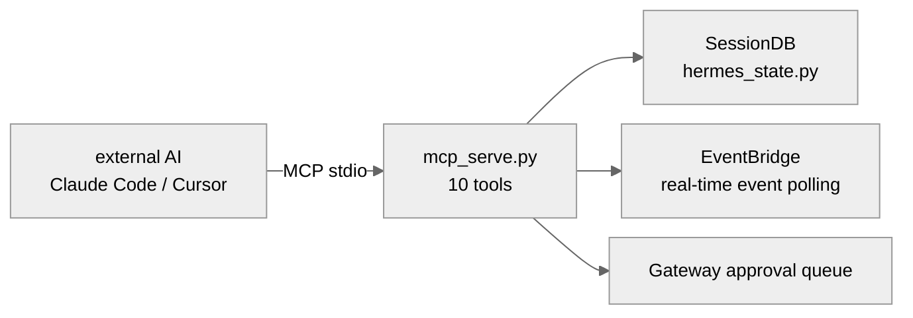

# 06 - Protocol Adaptation Layer: Letting Other Systems Call the Agent

[中文](../zh/06-协议适配层.md) | English

> **Scope**: `acp_adapter/` (11 .py, 5,288 lines) + `mcp_serve.py` (990 lines). Two separate protocol adapters that expose AIAgent's capabilities to IDEs and AI toolchains.
> **Key classes**: `HermesACPAgent` (`acp_adapter/server.py:450`), `EventBridge` (`mcp_serve.py:301`).

> **This chapter is based on hermes-agent v0.18.2 (tag [`v2026.7.7.2`](https://github.com/NousResearch/hermes-agent/releases/tag/v2026.7.7.2), commit `9de9c25f6`, 2026-07-07)**

---

## Why Protocol Adaptation?

So far, users interact with the Agent in two ways: the CLI terminal (direct conversation) and the message gateway (Telegram, Slack, etc.). But two more kinds of callers need to connect:

**IDE integration** — editors like VS Code, Zed, and JetBrains want to use hermes-agent as a coding assistant. This needs a standard protocol for bidirectional communication between the editor and the Agent — sending code context, receiving edit suggestions, managing file-modification approval. This is **ACP** (Agent Communication Protocol) — an open protocol defining interaction patterns between an editor and an AI agent, such as session management, message exchange, tool calls, and file-edit approval.

**AI-toolchain integration** — AI tools like Claude Code and Cursor want to read/write messages on various platforms through hermes-agent's message-gateway capability. This needs a different standard protocol — **MCP** (Model Context Protocol) — an open protocol led by Anthropic that defines a standard interface between an AI application and external data sources/services. hermes-agent uses MCP to expose the Gateway's session management and message send/receive as callable tools.

Both wrap the same AIAgent's capabilities into a standard protocol, but for completely different scenarios: ACP is for "the Agent helps you write code," MCP is for "an external AI reads/writes your messages."

---

## Usage Guide

### ACP: Editor Integration

```bash
hermes acp                # start the ACP server (usually invoked automatically by the editor)
hermes-acp                # equivalent command
```

The ACP server communicates with the editor via stdin/stdout JSON-RPC. The editor plugin (take VS Code's Hermes extension as an example) automatically launches the `hermes-acp` process, and the user doesn't need to do anything manually.

Editor interactions ACP supports:
- send code context and user instructions → the Agent returns replies and file edits
- file-edit approval (`edit_approval.py`, 338 lines) — when the Agent proposes modifying a file, the editor pops up a diff for the user to confirm
- session management (reset, compact, model switch)
- real-time tool-execution progress and token-usage updates

### MCP Serve: Message-Gateway Tools

```bash
hermes mcp serve           # start the MCP server
hermes mcp serve --verbose # verbose logging
```

The MCP server also communicates via stdin/stdout. Add to the MCP config in Claude Code or Cursor:

```json
{
  "mcpServers": {
    "hermes": {
      "command": "hermes",
      "args": ["mcp", "serve"]
    }
  }
}
```

After that, an external AI can call 10 MCP tools:
- `conversations_list` / `conversation_get` — list and fetch message conversations
- `messages_read` / `messages_send` — read/write messages
- `events_poll` / `events_wait` — poll and wait for real-time events
- `permissions_list_open` / `permissions_respond` — manage approval requests
- `attachments_fetch` — fetch attachments
- `channels_list` — list channels (Hermes-specific)

### Troubleshooting

| Problem | Where to look |
|---------|---------------|
| ACP server fails to start | Check whether `~/.hermes/.env` has a valid Provider config; ACP logs go to stderr |
| Editor can't see the Agent | Confirm the editor plugin config points to the correct `hermes-acp` command path |
| File edit rejected | Check the `edit_approval_policy` config: `ask` (default, ask every time), `workspace_session` (auto-approve within the same workspace), `session` (auto-approve within the session) |
| MCP tools unresponsive | First check whether the `mcp` Python package is installed (`pip install mcp`). If installed but still unresponsive, confirm the Gateway service is running — MCP serve depends on the Gateway's session database (SessionDB), and MCP tools silently fail when the Gateway isn't running |
| No tools after MCP connect | `hermes mcp serve` only exposes message-gateway tools, not the Agent's 69 execution tools |
| MCP events_poll always empty | Check stderr for `"EventBridge: SessionDB unavailable"` — if the `hermes_state` module is unavailable, EventBridge exits silently and `events_poll` always returns empty results |
| MCP approval tools "see" no approvals | In the current version the event source of `permissions_list_open`/`permissions_respond` isn't wired (`_pending_approvals` has no production write point), so it's always empty — not a config issue (see the "Security Boundary" section) |
| Where are ACP logs | ACP logs go to **stderr** (stdout is reserved for JSON-RPC), not in a file under `~/.hermes/logs/` |

> 📖 **Further Reading (Official Docs):**
> - [ACP Integration](https://hermes-agent.nousresearch.com/docs/user-guide/features/acp)
> - [MCP Integration](https://hermes-agent.nousresearch.com/docs/user-guide/features/mcp)

---

## Architecture & Implementation

### ACP: Letting an IDE and the Agent Talk

#### What Is the ACP Protocol

ACP (Agent Communication Protocol) is a standard protocol for bidirectional communication between an editor and an AI agent. It defines interaction patterns like session management, message exchange, tool calls, and file-edit approval. hermes-agent's ACP implementation is under the `acp_adapter/` directory.

#### Core Architecture



**Figure: The ACP architecture — the editor communicates with HermesACPAgent via JSON-RPC, which manages sessions and edit approval**

`HermesACPAgent` (`server.py:450`) inherits from `acp.Agent` and is the server-side implementation of the ACP protocol. It orchestrates five things — session lifecycle, message exchange, file-edit approval, tool-result formatting, and real-time updates. Each is a separate subsystem:

1. **Session lifecycle** — `SessionManager` (`session.py:186`, a 664-line file) maintains a separate `AIAgent` instance for each editor connection. A session has three modes: `default` (standard conversation), `accept_edits` (auto-accept file edits **within the workspace directory and /tmp**, sensitive paths still ask), `dont_ask` (auto-accept this session's file edits, but with sensitive paths excepted — see "Sensitive paths always ask" below)

2. **Message exchange** — the editor sends user messages (possibly containing code context, file references, images), and `HermesACPAgent` converts them into a format AIAgent understands then calls `run_conversation()`. The Agent's reply (text + tool-call results) is converted back to ACP format and returned to the editor

3. **File-edit approval** — when the Agent executes the `write_file` or `patch` tool, `edit_approval.py` (338 lines) intercepts the operation, sends a diff preview to the editor via the ACP protocol, and waits for user confirmation before actually writing. The approval policy is controlled by `edit_approval_policy` config

4. **Tool-result formatting** — `tools.py` (1,291 lines) customizes tool-result presentation for the IDE scenario. Take `read_file` as an example: the full file content is still passed to the editor, but wrapped in a code fence: Hermes's `read_file` output carries a `|` line-number separator, and if sent as raw Markdown, editors like Zed misparse the `|` as a table and the layout collapses — the fence keeps the file lines literal and readable. Each tool has a dedicated formatting function

5. **Real-time updates** — token-usage updates (`_send_usage_update()`, `server.py:698`) and session-info-change notifications let the editor display the Agent's status in real time

#### ACP's Concurrency Model

The ACP server can serve multiple editor sessions at once. This is achieved through three layers of mechanism:

- **Thread pool** (`server.py:90`): `ThreadPoolExecutor(max_workers=4)` provides 4 worker threads. AIAgent is synchronous code and executes in the thread pool via `loop.run_in_executor()`
- **ContextVar isolation** (from `server.py:1454`; `set/reset_hermes_interactive_context` imported from `tools/approval.py:68/78`): each `_run_agent` call runs in a separate `copy_context().run()`, guaranteeing the session ID and edit-approval callbacks don't leak across threads. A v0.18 security fix is worth noting: the "interactive session" marker used to go through `os.environ["HERMES_INTERACTIVE"]` — a process-level global, so two concurrent sessions would pollute each other's approval behavior (the race recorded in security advisory GHSA-96vc-wcxf-jjff); it's now switched to a `tools.approval` contextvar, isolated per call context
- **Same-session serialization**: when a session is running (`state.is_running == True`), a new incoming prompt is pushed onto `state.queued_prompts` (`server.py:1374-1377`), and after the current round finishes they're popped one by one and serially replayed in a `while True` loop (`server.py:1647-1660`). This guarantees that a single session's messages don't execute in parallel, but different sessions can be parallel (up to 4)

#### The Details of Edit Approval

`edit_approval.py` (338 lines) has three details worth knowing:

- **Sensitive paths always ask** (`edit_approval.py:45`): files under `{".env", ".env.local", ".env.production", "id_rsa", "id_ed25519"}` plus the `.git/` and `.ssh/` directories are **not auto-approved even in `dont_ask` mode**. This is the security bottom line
- **All three write forms trigger approval** (a v0.18 behavior change) — `build_edit_proposal()` (`edit_approval.py:178-189`) generates an approval proposal for `write_file`, `patch mode=replace`, and `patch mode="patch"` (the V4A multi-file patch format). V4A **didn't** trigger approval in the v0.14 era, and v0.18 filled this gap: it added `_proposal_for_patch_v4a()` and `_extract_v4a_patch_paths()` (`:131-175`) to parse the involved file paths from the V4A patch text and generate a diff proposal — a multi-file patch is no longer a backdoor around editor approval
- **A 60-second timeout equals denial** (the `timeout` default of `make_acp_edit_approval_requester` is 60.0, `edit_approval.py:290`) — if the editor doesn't respond to the approval request within 60 seconds, the file write is blocked

#### ACP's Toolset Restriction

ACP uses the dedicated `hermes-acp` toolset (`toolsets.py`), a **true subset** of the core toolset: the 49 core tools are cut to 29, and the 20 removed are all non-coding-scenario tools — `clarify` (the editor has its own interaction method), all 9 kanban tools, 4 Home Assistant tools, `computer_use`, `cronjob`, `image_generate`, `text_to_speech`, `read_terminal`/`close_terminal`. Zero additions — edit approval isn't a new tool but a transparent interception of existing `write_file`/`patch` calls (`model_tools.py:1214-1216` calls `maybe_require_edit_approval()`), and the tool schema the model sees is unchanged. (For clarity: `send_message` was never in any toolset — the comment at `toolsets.py:373` says outright that outbound platform messaging is handled outside the agent loop, and the agent doesn't get this tool.) On session establishment it also injects memory Provider tools on demand (`inject_memory_provider_tools()`, `server.py:831/847`).

#### Session Provenance Tracking: Who Am I After a Compression Head Rotation

v0.17 added `acp_adapter/provenance.py` (127 lines) to solve a confusion from the editor's perspective: Hermes's context compression **rotates the internal session ID** (after compression it starts a new head, chaining the old session up as the parent), but the ACP `session_id` in the editor's hand is a stable public handle — the two ID systems drift apart.

Provenance tracking exposes this chain: the ACP response's `_meta.hermes.sessionProvenance` carries the current/prior/root internal session IDs and the compression depth — all **derived on demand from the sessions table's `parent_session_id`/`end_reason`** (the module comment says outright it "adds no persistent state"), and an ACP client that doesn't recognize this extension field ignores it automatically. At the moment a rotation happens, it also proactively pushes a `session_info_update` notification (`server.py:1576-1597`), so the editor can update its understanding of the session in real time.

Two more v0.18 editor-experience details: the Agent's working directory follows the `session_cwd` passed by the editor (`agent.session_cwd = cwd` in `_make_agent()`, `session.py:660` — the comment says outright to have the Codex runtime start from the editor's cwd rather than the Hermes daemon's process cwd); and on a user interruption the internal interrupt-prompt message is **no longer sent to the ACP client** — the `suppress_interrupt_response` check (`server.py:1606-1609`) intercepts this text, using the protocol-standard `stop_reason: "cancelled"` (`:1677`) instead, so the editor no longer sees an inexplicable "[interrupted]" text.

### MCP Serve: Exposing the Gateway as Tools

#### What Is MCP Serve

`mcp_serve.py` (990 lines) exposes hermes-agent's **message-gateway capability** (not the Agent's execution capability) as MCP tools. Its target users are external AIs like Claude Code and Cursor — they read/write the various-platform messages managed by hermes-agent via MCP tools.

Note the direction: Chapter 03 is hermes-agent → [MCP Client] → external tool server; this chapter is external AI → [MCP Client] → hermes-agent (MCP Server). One reaches out to call others' tools, the other opens up to let others call itself.

#### Core Architecture



**Figure: The MCP Serve architecture — an external AI accesses the Gateway's sessions and messages via 10 MCP tools**

`EventBridge` (`mcp_serve.py:301`) is the core component of MCP Serve — on a background thread it polls the Gateway's events (new messages, approval requests) at a 200ms interval (`POLL_INTERVAL = 0.2`, `:289`), exposing them to the external AI via the `events_poll` and `events_wait` tools.

EventBridge's key design details:
- **The index has migrated to state.db** (v0.18, #9006): the session-routing index `_load_sessions_index()` (`mcp_serve.py:82`) now **reads state.db first**, with `sessions.json` demoted to a fallback — eliminating exactly the old dual-file-read race (which would miss a brand-new conversation when the two data copies were out of sync; #8925 is the number of that old bug). Polling also only checks state.db's mtime (`_poll_once()`, `:460-467`), not touching the database if the file hasn't changed — making the 200ms polling nearly zero-cost
- **Event-queue cap**: `QUEUE_LIMIT = 1000` (defined at `mcp_serve.py:288`), dropping the earliest events when exceeded. The cursor is an incrementing integer (not a timestamp), and on overflow there may be gaps among events after `after_cursor`
- **`events_wait` timeout**: default 30 seconds, max 5 minutes. Implemented via `threading.Event.wait()`, with a 200ms latency in the worst case
- **`permissions_respond` is best-effort** (`mcp_serve.py:930`): it only marks resolved in the bridge's in-memory dict, not directly controlling Gateway execution. Historical approvals disappear after the bridge restarts

The 10 MCP tools' design is compatible with OpenClaw's (hermes-agent's predecessor project) 9-tool MCP channel-bridge interface (`mcp_serve.py:8`), plus Hermes's own `channels_list` — meaning users migrating from OpenClaw don't need to change their MCP client config.

#### Security Boundary

MCP Serve only exposes the capability to **read/write messages**, not the Agent's tool-execution capability (terminal, file, browser, etc.). Note that `messages_send` is a **direct outbound** path: it calls `_handle_send()` in `tools/send_message_tool.py`, and after doing platform/channel resolution and a "is the platform enabled" config check, it sends directly through the platform adapter — **not triggering Agent execution, and with no approval step** (there's no approval/authorization logic anywhere in the file). It reuses the Gateway's outbound delivery surface, not the inbound message's full "authorization check → Agent execution → approval" flow.

`permissions_list_open` and `permissions_respond`, by interface design, let an external AI manage approval requests on the Gateway's platforms (aligning with OpenClaw's 9-tool surface). But a **current functional gap** must be noted: the `EventBridge._pending_approvals` dict is only read in production code (`list_pending_approvals()` / `respond_to_approval()`'s `.pop()`), with **no write point at all** — `_poll_once()` only scans new messages (`role in {"user","assistant"}`) and doesn't collect approval events; the only write in the whole repo is a manual injection in a test file. `respond_to_approval()`'s docstring even admits "best-effort without gateway IPC." That is, these two tools currently **can neither receive nor manage** real Gateway approvals: `permissions_list_open` always returns an empty list. This is a state of interface-first, event-source-unwired (to be confirmed whether a later version fills it in).

### Code Organization

```
acp_adapter/
├── server.py         — HermesACPAgent, the ACP protocol server (2,065 lines)
├── tools.py          — tool-result formatting for the IDE scenario (1,291 lines)
├── session.py        — SessionManager, managing AIAgent instances (664 lines)
├── edit_approval.py  — file-edit approval logic (338 lines)
├── events.py         — the ACP event system (279 lines)
├── entry.py          — CLI entry (271 lines)
├── permissions.py    — permission management (168 lines)
├── provenance.py     — session provenance tracking (127 lines, added in v0.17)
├── auth.py           — authentication (79 lines)
├── __init__.py       — package entry (1 line)
└── __main__.py       — module entry (5 lines)

mcp_serve.py          — the MCP server, 10 message-gateway tools (990 lines)
```

### Design Decisions

#### Why Are ACP and MCP Two Separate Protocols?

ACP targets the **editor↔coding-assistant** bidirectional interaction — needing IDE-specific capabilities like file-edit approval, session-mode switching, and real-time progress updates. MCP targets the **AI↔message-gateway** tool call — needing only to read/write messages and manage approvals. Their interaction patterns, security needs, and target users are completely different, and using one protocol for both would cause complexity to explode.

#### Why Doesn't MCP Serve Expose Agent Tools?

Security considerations. MCP Serve's goal is to let an external AI read/write messages, not to have it directly execute commands on your machine. If it exposed the `terminal` or `write_file` tool, the external AI could bypass hermes-agent's security-approval mechanism and operate the filesystem directly. `messages_send`, by contrast, only reuses the Gateway's **outbound delivery surface** — it doesn't touch execution capabilities like terminal/file and doesn't trigger Agent execution (consistent with the "Security Boundary" section), so exposing it doesn't open a hole in the execution surface.

### Extension Points

1. **ACP slash commands**: `HermesACPAgent._SLASH_COMMANDS` (`server.py:453`) defines 9 commands (help/model/tools/context/reset/compact/steer/queue/version), extensible
2. **MCP tools**: each tool in `mcp_serve.py` is a function, and new tools can be added per the MCP spec
3. **Edit-approval policy**: `edit_approval_policy` supports three modes: `ask`, `workspace_session`, `session`

---

## Relationship to Other Chapters

| Related Chapter | Relationship |
|-----------------|--------------|
| 00 — Project Overview | ACP and MCP Serve are the concrete implementation of Chapter 00's "external bridges" |
| 01 — Infrastructure Layer | The `hermes-acp` entry is registered at `pyproject.toml:310` (the `[project.scripts]` section) |
| 02 — Agent Core | ACP creates AIAgent instances to run conversations |
| 03 — Tool System | ACP uses the `hermes-acp` toolset (a subset of the core tools); MCP Serve exposes no tools |
| 05 — Gateway Layer | MCP Serve depends on the Gateway's SessionDB and approval queue |

---

*This document is based on source analysis of hermes-agent v0.18.2. All code references have been independently verified.*
