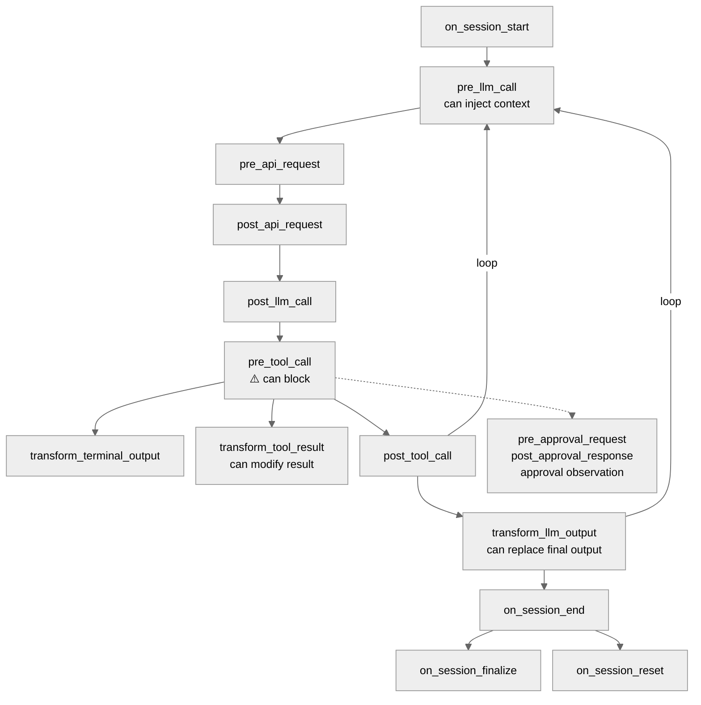
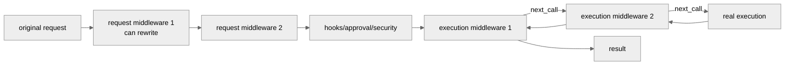
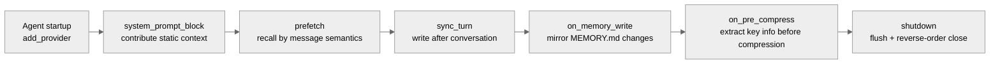

# 07 - Plugin Framework: Extending the Agent's Capabilities with Code

[中文](../zh/07-插件框架.md) | English

> **Scope**: the `plugins/` directory (177 .py, 104,721 lines, 18 categories) + `hermes_cli/plugins.py` (2,464 lines, the plugin manager). Plugins are a Python-code-level runtime extension mechanism.
> **Key classes**: `PluginContext` (`plugins.py:337`), `PluginManager` (`plugins.py:1246`), `PluginManifest` (`plugins.py:279`).

> **This chapter is based on hermes-agent v0.18.2 (tag [`v2026.7.7.2`](https://github.com/NousResearch/hermes-agent/releases/tag/v2026.7.7.2), commit `9de9c25f6`, 2026-07-07)**

---

## Why Plugins?

Both skills and plugins can extend the Agent's capabilities, but the way they extend is completely different. Three concrete scenarios explain this.

**Scenario 1: Let the Agent look up prediction-market odds.** A skill is enough for this. The Polymarket skill (`skills/research/polymarket/`) contains a SKILL.md (telling the model when and how to use it) and a Python script (`scripts/polymarket.py` — an ordinary command-line tool). When the model needs to check odds, it uses the `terminal` tool to run `python3 polymarket.py search "bitcoin"`, and the script runs in a sandbox and returns the result. The essence of a skill is **giving the model a new operating manual and tool script**.

**Scenario 2: Let the Agent control Spotify playback.** This can't use a skill — what you need is to have Spotify's 7 operations (play, pause, search, skip, etc.) appear as **first-class tools** in the model's tool list, with typed parameter schemas, so the model can call `spotify_play(track="...")` directly rather than running a Python script via `terminal`. This requires calling `registry.register()` inside the Agent process to register tools — only a plugin can do this.

**Scenario 3: Monitor the token usage and latency of all LLM calls and send them to Langfuse.** A skill can't do this at all — a skill is called **on demand** by the model, and it doesn't know when an LLM call happens. You need a callback to **auto-trigger** after each API request inside the Agent — injecting monitoring code in the `post_api_request` hook. This is a capability unique to plugins.

The three scenarios show three levels of extension need:

| | Skill | Plugin |
|---|-------|--------|
| Essence | an operating manual + tool script for the model | a Python module inside the Agent process |
| Execution | the model runs the script via `terminal`/`execute_code` | loaded into the Agent process, registering tools/hooks/components |
| The model's role | the model decides when and how to call | hooks auto-trigger, no model involvement needed |
| What it can do | add "doing" capability (query data, generate content) | register first-class tools, step into the workflow, replace core components |
| Can it intercept | no — the script doesn't know what other tools are doing | yes — `pre_tool_call` can block any tool call |
| Can it replace components | no — the script is in a sandbox, can't touch the Agent internals | yes — replace the memory system, context engine, image-gen backend |
| Can the Agent create it itself | yes — the Agent auto-creates and improves skills during use | no — must be written by a developer |
| Security | high — sandbox isolation, a bug doesn't break the Agent | low — runs in-process, a bug may block all tools |

**When to use a skill?** When you want the Agent to be able to "do a new thing" (query data, operate an API, follow a specific flow), and that thing can be done via a command-line script — use a skill. It's simple, safe, and the model can create it itself.

**When to use a plugin?** When you need: (1) to register first-class tools (with a schema, parameter type checking); (2) to auto-trigger logic at Agent-workflow nodes (monitoring, interception, transformation); (3) to replace the Agent's core components (memory, compression, Provider); (4) to integrate a new message platform — use a plugin.

**Why not merge them?** A trade-off of security and autonomy. Skills can be created and modified by the Agent itself — if skills had in-process access, the Agent could modify its own runtime behavior, which is unacceptable in the security model. Plugins can only be written and installed by a developer, and are loaded only after allowlist review.

Chapter 01 covered the discovery and loading mechanism of `hermes_cli/plugins.py` (four sources, allowlist control). This chapter dives into the plugin API, the hook system, and how the most complex plugins work.

---

## Usage Guide

### Basic Usage

```bash
hermes plugins list       # list all discovered plugins and their status
hermes plugins enable X   # enable a plugin
hermes plugins disable X  # disable a plugin
```

### Configuration

```yaml
# config.yaml
plugins:
  enabled:
    - disk-cleanup
    # Note: spotify is a backend-kind plugin (bundled backends auto-load);
    # putting it in enabled is redundant, it loads anyway; shown here only as a demo
  disabled: []            # explicitly disabled plugins (highest priority)

memory:
  provider: "honcho"      # a memory plugin is activated via a dedicated config key

context:
  engine: "compressor"    # a context-engine plugin (default the built-in compressor)
```

### Common Scenarios

**Scenario 1: Install a third-party plugin.** Place the plugin directory under `~/.hermes/plugins/<name>/`, ensure it has a `plugin.yaml` and `__init__.py`, then add the name to `plugins.enabled`.

**Scenario 2: Switch memory Provider.** Set `memory.provider: "honcho"`, and the Honcho plugin auto-activates. Only one memory provider can be active at a time — setting another replaces the current one.

**Scenario 3: Develop a custom plugin.** A minimal plugin needs only two files:

```
my-plugin/
├── plugin.yaml     # name, version, description, kind
└── __init__.py     # def register(ctx): ...
```

The `register(ctx)` function receives a `PluginContext` object, through which it registers tools, hooks, commands, and other capabilities.

### Troubleshooting

| Problem | Where to look |
|---------|---------------|
| Plugin development debugging | Set the `HERMES_PLUGINS_DEBUG=1` environment variable, and the full plugin discovery/load log goes to stderr and `agent.log` |
| Plugin not discovered | `hermes plugins list` to check (the error field shows the rejection reason); confirm `plugin.yaml` exists and is well-formed |
| Discovered but not loaded | Check the `plugins.enabled` allowlist; whether `plugins.disabled` overrode it |
| Plugin load error | Check `agent.log`; one plugin crashing doesn't affect others (each register call has its own try-except) |
| A hook doesn't fire | Confirm the hook name is in `VALID_HOOKS` (23 kinds); check the `provides_hooks` declaration in `plugin.yaml` |
| Plugin tool doesn't appear | Confirm the `register_tool()` call is correct; check whether the tool's `check_fn` returns True |
| Memory plugin doesn't work | Confirm `memory.provider` is set correctly; check the MemoryManager log in `agent.log` |
| Agent stuck in running for a long time | Suspect a memory provider's sync/prefetch network call blocking — it should run on the `mem-sync` daemon thread (memory_manager.py:571 once had a 298-second block incident); search the log for "sync_turn failed" |
| Custom secret source doesn't take effect on first launch | Plugin discovery is later than the first env load (plugins.py:812 "NOTE ON TIMING") — it only takes effect for subprocesses/cron/subagents, or call `reset_secret_source_cache()` |
| pre_verify keeps returning continue but the Agent stopped | There's a hard cap: `agent.max_verify_nudges` (default 3, config.py:1027) — beyond it, whatever the hook returns, it's let through and ends |

> 📖 **Further Reading (Official Docs):**
> - [Plugin Features](https://hermes-agent.nousresearch.com/docs/user-guide/features/plugins)
> - [Build a Plugin](https://hermes-agent.nousresearch.com/docs/developer-guide/plugins)
> - [Memory Provider Plugin](https://hermes-agent.nousresearch.com/docs/developer-guide/memory-provider-plugin)
> - [Context Engine Plugin](https://hermes-agent.nousresearch.com/docs/developer-guide/context-engine-plugin)

---

## Architecture & Implementation

### PluginContext: What a Plugin Can Do

`PluginContext` (`plugins.py:337`) is the API surface the Agent exposes to plugins — what a plugin can do is strictly bounded by its method list. v0.18.2 has 22 public members (20 methods + 2 properties). The table below marks with ★ the 3 registration surfaces added in v0.17-v0.18 (`register_secret_source`/`register_slack_action_handler`/`register_middleware`); another 3 registration surfaces (dashboard_auth/tts/transcription provider), though also fairly new, were added back in v0.15 and aren't marked separately:

| Method | Purpose | Line |
|--------|---------|------|
| `register_tool()` | register a new tool (same interface as built-in tools) | `plugins.py:389` |
| `inject_message()` | inject a message into the Agent's conversation stream | `plugins.py:474` |
| `register_cli_command()` | register a terminal subcommand (`hermes <name> ...`) | `plugins.py:502` |
| `register_command()` | register a slash command | `plugins.py:527` |
| `dispatch_tool()` | call any registered tool | `plugins.py:583` |
| `register_context_engine()` | replace the context-compression engine | `plugins.py:614` |
| `register_image_gen_provider()` | register an image-generation backend | `plugins.py:646` |
| `register_dashboard_auth_provider()` | register a Dashboard auth method (for desktop/Web, → Chapters 08/14; since v0.15) | `plugins.py:673` |
| `register_video_gen_provider()` | register a video-generation backend | `plugins.py:713` |
| `register_web_search_provider()` | register a web search/extraction backend | `plugins.py:740` |
| `register_browser_provider()` | register a cloud-browser backend | `plugins.py:768` |
| `register_secret_source()` ★ | register a secret source (for external secret management) | `plugins.py:800` |
| `register_tts_provider()` | register a TTS engine (since v0.15) | `plugins.py:847` |
| `register_transcription_provider()` | register an STT engine (new Python engines; the 6 built-in backends don't go here; since v0.15) | `plugins.py:885` |
| `register_platform()` | register a Gateway platform adapter (into the platform registry, → Chapter 05) | `plugins.py:929` |
| `register_slack_action_handler()` ★ | register a Slack Block Kit button callback | `plugins.py:985` |
| `register_auxiliary_task()` | register an auxiliary-LLM task | `plugins.py:1045` |
| `register_hook()` | register a lifecycle hook | `plugins.py:1156` |
| `register_middleware()` ★ | register middleware (a new extension surface parallel to hooks, see below) | `plugins.py:1175` |
| `register_skill()` | register a plugin-private skill | `plugins.py:1196` |
| `llm` property | access the `PluginLlm` facade (internally forwards to `auxiliary_client`, with per-plugin trust gating) | `plugins.py:349` |
| `profile_name` property | the current Profile name | `plugins.py:368` |

Note the distinction between the two kinds of command registration: `register_command()` registers an in-session slash command (take `/disk-cleanup` as an example), and `register_cli_command()` registers a terminal subcommand (take the `hermes meet` registered by the Google Meet plugin, or the `hermes teams-pipeline` registered by teams_pipeline, as examples; note the Spotify plugin only uses `register_tool` and doesn't register a CLI subcommand) — the two have completely different trigger methods and execution environments.

`register_tool()` uses the same `registry.register()` interface as built-in tools — to the model, plugin tools and built-in tools are indistinguishable. Take the Spotify plugin as an example: it registers 7 tools (play, search, playlist, etc.), and the model uses `spotify_search` just like it uses `read_file`.

`inject_message()` is for external-event bridging — take the Google Meet plugin as an example: when someone speaks in a meeting, the plugin injects the transcript text into the Agent's conversation stream. Note: **in gateway mode `inject_message()` silently fails** (when `_cli_ref` is None it logs a warning and `return False`, `plugins.py:485-488`), because it depends on the CLI's input queue. Injecting while the Agent is executing a task interrupts the current task; injecting while the Agent is idle enters the queue to wait for the next round.

The `llm` property returns a `PluginLlm` facade (`agent/plugin_llm.py`), through which a plugin accesses the auxiliary LLM client covered in Chapter 02 (`auxiliary_client.py`) for its own inference, not consuming the main model's quota. This facade has a security design of the same origin as "a tool override needs `allow_tool_override` permission" — model/provider/auth overrides are fail-closed by default and must be explicitly opened via `plugins.entries.<plugin_id>.llm.*` config, preventing a plugin from switching to a different model or credentials on its own.

### The 23 Lifecycle Hooks

Hooks are a plugin's most powerful capability — inserting custom logic at key nodes of the Agent workflow. `VALID_HOOKS` (`plugins.py:135`) defines 23 kinds:



**Figure: Where plugin hooks fire in the Agent workflow** (the figure shows hooks within the main conversation loop; those not on the main loop include: `subagent_start`/`subagent_stop` (subagent start/stop), `pre_gateway_dispatch` (before the Gateway authorization check, see Chapter 05), `api_request_error` (on an API error), `pre_verify` (the post-code-edit verification gate, which can have the Agent keep running checks rather than stop), and the kanban trio `kanban_task_claimed/completed/blocked` (kanban-task lifecycle events, defined in `hermes_cli/plugins.py`'s `VALID_HOOKS`), for 23 `VALID_HOOKS` in total)

Key hooks explained:

- **`pre_tool_call`**: the most special — it has **two** disposition actions (`_get_pre_tool_call_directive_details`, from `plugins.py:2099`): `{"action": "block", "message": "..."}` **blocks** directly; `{"action": "approve", "message": "..."}` **escalates to the human-approval gate** — going through the same once/session/always/deny flow as a dangerous command (with an optional `rule_key` to have always remember the rule), handing the decision to a human rather than a hard refusal. When the approval gate itself errors, it **fail-closes** to a block (`resolve_pre_tool_block`, `:2226`). Execution model: `invoke_hook` unconditionally calls all registered callbacks (no early exit), then takes the **first** valid directive. There's also a higher-priority short-circuit: a thread-level tool allowlist (`_thread_tool_whitelist`, `:2077`) rejects calls outside the allowlist before any plugin hook
- **`pre_llm_call`**: fires before each LLM call, and a plugin can return a context string to inject into the user message — the same injection point as the memory prefetch covered in Chapter 02
- **`transform_tool_result`**: fires after a tool executes, and a plugin can return a string to **replace** the tool result
- **`pre_gateway_dispatch`**: covered in Chapter 05 — fires before the Gateway authorization check, and a plugin can skip/rewrite/allow a message
- **`transform_llm_output`** (`plugins.py:143`): fires after the tool loop ends and the final reply is determined, and the first callback that returns a non-empty string **replaces the final output** — for output post-processing (take vocabulary/persona transformation as an example)
- **`pre_approval_request` / `post_approval_response`**: fire on a dangerous-command approval, observe-only (the return value is ignored). Both contain parameters like `command`, `surface` ("cli" or "gateway"); `choice` (`once`/`session`/`always`/`deny`/`timeout`) is **only on `post_approval_response`** (the approval result is only known as a post-event)
- **`subagent_stop`**: fires when a subagent finishes, for cross-Agent state sync

Every hook callback is wrapped in a try-except, so one plugin crashing doesn't affect other plugins or the Agent core — this is the isolation guarantee of the plugin system.

### Middleware: A Second Extension Surface That Can Rewrite Payloads and Wrap Execution

Hooks can only **observe or intercept**; the middleware added in v0.17 (`hermes_cli/middleware.py`) can **rewrite the payload and wrap execution itself**. `register_middleware()` supports four kinds (`middleware.py:20-23`): `tool_request` / `tool_execution` / `llm_request` / `llm_execution`, already integrated into the production paths of conversation_loop, tool_executor, and model_tools.

The two semantics are completely different:

- **Request middleware** (`apply_llm_request_middleware`/`apply_tool_request_middleware`, `:76-161`): chained rewriting — each callback can return `{"request": {...}}` or `{"args": {...}}` to **replace** the original payload, and it happens **before** hooks/security-defenses/approval see it; returning nothing or a non-dict passes through to the next
- **Execution middleware** (`run_tool_execution_middleware`/`run_llm_execution_middleware`, `:172-296`): the onion model — each callback gets a `next_call()` to invoke the next layer (or the final execution body). `next_call()` **can only be called once** (a repeat call raises RuntimeError); a downstream exception is re-raised as-is through the wrapping; if the callback itself errors but downstream already succeeded, it returns the downstream result rather than failing the whole chain



**Figure: Request middleware is a rewriting pipeline, execution middleware is an onion wrap — complementary to hooks that can only observe/intercept**

Which to use? For monitoring/interception, use a hook; for changing request parameters, or **wrapping** execution with caching/retry/timing, use middleware.

### The Five Plugin Kinds

The `kind` field in `plugin.yaml` distinguishes five kinds:

**`standalone`** (default) — a standalone-feature plugin, requiring explicit activation in `plugins.enabled`. Take `disk-cleanup` as an example: it registers the `post_tool_call` and `on_session_end` hooks to track and clean up temporary files.

**`backend`** — a service-backend plugin, providing a Provider implementation for a built-in tool. A bundled backend plugin auto-loads without opt-in. Take `image_gen/openai` as an example: it provides the gpt-image-2 backend for the `image_generate` tool.

**`platform`** — a platform-adapter plugin (`plugins/platforms/`, 20 currently, mainstream platforms migrated wholesale from the gateway between v0.16-v0.18, → Chapter 08). Take the Discord plugin as an example: it implements the `BasePlatformAdapter` interface. A bundled platform plugin is **deferred-loaded** (since v0.17): on discovery it only hangs a loader in the platform registry (`LoadedPlugin.deferred`, `plugins.py:327-330`), importing the heavy SDK only on first actual use — the prerequisite for the platform migration not slowing startup (Chapter 01's five-branch triage).

**`exclusive`** — a mutually-exclusive plugin, only one active at a time. Memory plugins and context-engine plugins are this kind, controlled by dedicated config keys (`memory.provider`, `context.engine`).

**`model-provider`** — a model-Provider plugin, providing a new Provider for the auth system (Chapter 01's `PROVIDER_REGISTRY`). It auto-expands the registry via `auth.py:447-470` (api_key-type only).

### Memory Plugins: The Most Complex Extension Point

`plugins/memory/` contains 8 memory plugins (honcho, hindsight, holographic, mem0, openviking, retaindb, supermemory, byterover), but only one can be active at a time.

> ⚠️ **Memory plugins don't go through the generic PluginManager**. They have their own discovery path (`plugins/memory/__init__.py`). A memory plugin's `register(ctx)` function receives not the generic `PluginContext` but an internal object `_ProviderCollector` (`plugins/memory/__init__.py:319`) — a minimal pseudo-context object where only `register_memory_provider()` is a valid method, and the rest (`register_tool`/`register_hook`/`register_cli_command`) are no-op stubs (they accept the call but do nothing). The generic `PluginContext` **has no** `register_memory_provider()` method. If you want to develop a memory plugin, the entry is `plugins/memory/<name>/__init__.py`, not the generic plugin-development path.

A memory plugin registers by implementing the `MemoryProvider` ABC (`agent/memory_provider.py:43`, 19 methods — v0.18 added `backup_paths()`, letting `hermes backup` know which local data of the provider to take). The core lifecycle:



**Figure: The MemoryProvider lifecycle — from startup registration to the in-session build/prefetch/sync to shutdown**

Beyond the core methods in the figure, `MemoryProvider` has a few methods critical to implementers:
- `is_available()` — an **abstract method**, called at Agent init to decide whether to activate, checking only config and dependencies, must not make network requests
- `initialize(**kwargs)` — another abstract method (the first lifecycle step, called by `MemoryManager.initialize_all()`). The most critical thing in kwargs is `agent_context`: one of four values "primary"/"subagent"/"cron"/"flush" (`memory_provider.py:74`) — the docstring says outright that **non-primary scenarios should skip writes** (a cron's system prompt would pollute the user profile); `hermes_home`, when not passed, is auto-injected by initialize_all for the provider to resolve the Profile-level storage path
- `get_tool_schemas()` / `handle_tool_call()` — a memory provider can expose its own tools to the model (take `honcho_memory_search` as an example), and `MemoryManager` builds a tool-name→provider routing index
- `queue_prefetch(query)` — called after each round, triggering the next round's background async prefetch
- `on_turn_start(turn_number, message)` — called at the start of each round, with context like remaining_tokens, model
- `on_session_switch(new_session_id)` — called when `/reset`, context compression, etc. trigger a session switch

`MemoryManager` (`agent/memory_manager.py:353`, a 1,086-line file) is the dispatch layer, accepting at most one external MemoryProvider. The built-in MEMORY.md/USER.md system is managed by a separate `MemoryStore` (`tools/memory_tool.py`), not going through the `MemoryProvider` ABC — the two work in parallel. Why only one external provider? Because multiple providers writing at once produce conflicts — their semantic understandings differ, and merging is an unsolved problem.

**The lesson of background sync**: `sync_turn`/`prefetch` used to be synchronous calls running in the main flow — a misconfigured Hindsight daemon once stuck the Agent in the running state for about 298 seconds (the incident post-mortem in the `memory_manager.py:571` comment). Now `sync_all`/`queue_prefetch_all` dispatch to a single-worker `mem-sync` daemon thread (guaranteeing turn N's write precedes turn N+1's), and `shutdown_all()` gives only 5 seconds to drain (`_SYNC_DRAIN_TIMEOUT_S`), so a stuck provider dies with the process. When troubleshooting "Agent stuck in running for a long time," first check whether a memory provider's network call is blocked.

There's also an easily-misunderstood path: although `_ProviderCollector`'s `register_cli_command` is a no-op, a memory plugin's CLI subcommands (like `hermes honcho setup`) go through **another separate channel** — `discover_plugin_cli_commands()` (from `plugins/memory/__init__.py:354`) loads the `register_cli()` in the `cli.py` of only the currently-active provider. "Hooks/tools are no-op" doesn't mean "no CLI capability."

Take the Honcho plugin as an example (`plugins/memory/honcho/`), whose cost-aware mechanism is worth knowing: `context_cadence` and `dialectic_cadence` control the call frequency — not doing deep extraction every round, but triggering only every N rounds. On consecutive empty results it linearly backs off (the cadence plus the consecutive empty-result count), avoiding wasted API calls when "the user is just chatting."

### Plugin Loading Rules

Plugin loading has a clear priority (`discover_and_load()`, `plugins.py:1277`; the full five-branch triage is in Chapter 01):

1. **`plugins.disabled` takes top priority** — a plugin in the list is never loaded
2. **bundled backend auto-loads, bundled platform deferred-registers** — both work out of the box, and platform just defers the import to first use
3. **standalone needs opt-in** — must be in `plugins.enabled`
4. **exclusive is controlled by a dedicated config** (accounted as enabled=False) — take `memory.provider: honcho` as an example; **model-provider is accounted as enabled=True but the module isn't loaded by PluginManager** (the providers/ discovery layer does the real import, and a second import would create two ProviderProfiles breaking the override semantics, `plugins.py:1410-1423`) — this is why the two have different statuses in `hermes plugins list`
5. **pip entry-point plugins** — discovered via the `hermes_agent.plugins` entry-point group
6. **user/project plugins always need opt-in**

Name-conflict rule: a later-loaded one overrides an earlier one (same name, same kind). New registration surfaces like TTS/STT share another priority pattern (docstring `plugins.py:856-865/:895-904`): **a built-in provider name always wins > a `type: command` command-type provider in config > plugin registration** — when a same-named provider registered by a plugin never gets selected, first check whether the top two layers took the name. But a same-named registration across toolsets is rejected by default (to prevent accidental shadowing; MCP-overriding-MCP is an exception), and a plugin wanting to replace a built-in tool's implementation must explicitly pass `override=True` (the `registry.register` signature `registry.py:356`, plus a per-plugin-namespace override-policy switch `:307`).

### The 18 Built-in Plugin Categories

```
plugins/
├── memory/           — memory Providers (honcho, mem0, etc.)
├── context_engine/   — context engine
├── model-providers/  — model Providers (29 subdirectories)
├── image_gen/        — image-generation backends (6; krea added in v0.15, openrouter new in v0.18)
├── video_gen/        — video-generation backends
├── platforms/        — 20 message platforms (mainstream platforms migrated from the gateway, → Chapter 08)
├── kanban/           — Kanban multi-Agent scheduler
├── observability/    — observability (langfuse + nemo_relay)
├── browser/          — browser extensions
├── web/              — web search backends
├── cron_providers/   — external scheduling Providers (chronos, → Chapter 11) ★new
├── dashboard_auth/   — Dashboard multi-method auth (basic/nous/drain/self_hosted, → Chapter 14) ★new
├── security-guidance/— security-pattern library ★new
├── spotify/          — Spotify integration
├── google_meet/      — Google Meet transcription integration
├── teams_pipeline/   — Teams meeting pipeline
├── hermes-achievements/ — achievement system (gamification)
└── disk-cleanup/     — disk cleanup
```

(v0.14's example-dashboard was removed; 16 - 1 + 3 = 18 categories.)

### Design Decisions

#### Allowlist vs. Denylist

hermes-agent chose the allowlist model (`plugins.enabled`) rather than a denylist (load everything by default, disable manually). This is a security decision — a third-party plugin can register arbitrary tools and hooks, and unrestricted loading would pose a security risk. `migrate_config()` automatically adds existing user plugins to the allowlist on upgrade, so plugins don't suddenly disappear after an update.

#### A Separate Discovery Path

Memory plugins and context-engine plugins don't go through the generic `PluginManager` but have a separate discovery path. This is because they are exclusive — only one at a time, needing different activation and conflict-resolution logic. The generic `PluginManager`'s "same-name override" rule doesn't apply to mutually-exclusive plugins.

### Extension Points

1. **Register a new tool**: `ctx.register_tool()`, the same interface as built-in tools
2. **Register a hook**: `ctx.register_hook()` supports 23 lifecycle events
3. **Register a command**: `ctx.register_command()` supports slash commands and CLI subcommands
4. **Replace the context engine**: implement the `ContextEngine` ABC
5. **Replace the memory Provider**: implement the `MemoryProvider` ABC
6. **Register an image/video-generation backend**: `ctx.register_image_gen_provider()`
7. **Register a model Provider**: auto-expand `PROVIDER_REGISTRY` via `plugins/model-providers/`

---

## Relationship to Other Chapters

| Related Chapter | Relationship |
|-----------------|--------------|
| 01 — Infrastructure Layer | The discovery/loading/allowlist mechanism of `hermes_cli/plugins.py` is introduced in Chapter 01 |
| 02 — Agent Core | The ContextEngine ABC and auxiliary_client (plugin LLM access) are introduced in Chapter 02 |
| 03 — Tool System | Plugin tools are registered via the same `registry.register()` interface |
| 05 — Gateway Layer | Platform plugins provide new message platforms via `plugins/platforms/` |
| 08 — Built-in Plugins | Detailed analysis of memory / model Provider / platform / observability / Spotify and other plugins |

---

*This document is based on source analysis of hermes-agent v0.18.2. All code references have been independently verified.*
