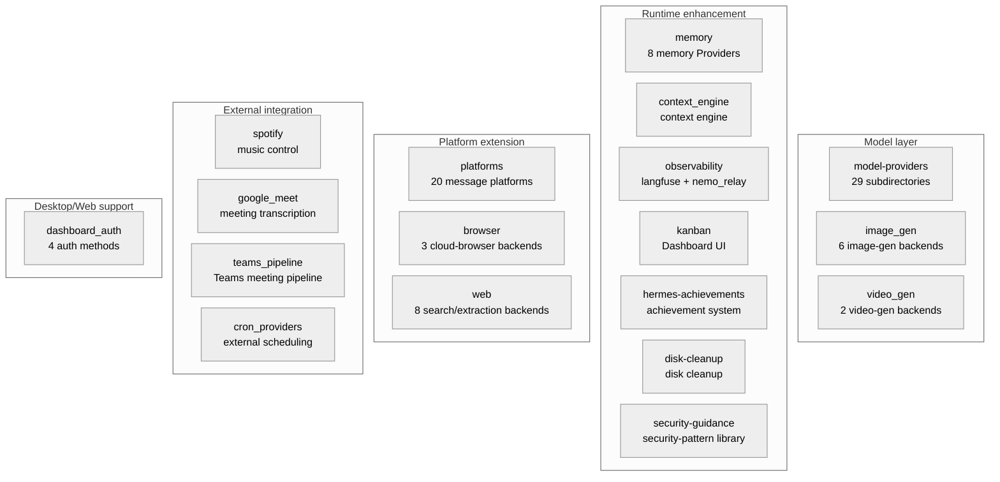

# 08 - Built-in Plugins: Capability Extension in 18 Categories

[中文](../zh/08-内置插件.md) | English

> **Scope**: the `plugins/` directory (177 .py, 104,721 lines, 18 categories). Chapter 07 covered the plugin framework's API and mechanisms; this chapter covers the actual users of those APIs — the 18 categories of built-in plugins that ship with hermes-agent.
> **Key directories**: `plugins/platforms/` (20 message platforms, 59,000 lines — the main battleground after the v0.15-v0.18 platform migration), `plugins/memory/` (8 memory Providers, 18,597 lines), `plugins/model-providers/` (29 subdirectories, 1,595 lines).

> **This chapter is based on hermes-agent v0.18.2 (tag [`v2026.7.7.2`](https://github.com/NousResearch/hermes-agent/releases/tag/v2026.7.7.2), commit `9de9c25f6`, 2026-07-07)**

---

## What Problems Do These Plugins Solve?

Chapter 07 established the plugin framework — the PluginContext API, 23 hooks, five kinds. But the framework itself doesn't produce value; the plugins that use the framework do.

hermes-agent ships with 18 categories of built-in plugins, covering extension needs in five directions:



**Figure: The 18 built-in plugin categories grouped by extension direction**

This chapter doesn't enumerate every plugin's code — that's a source tour, not an analysis document. Instead it covers each group's **common patterns** by extension direction, then picks representative plugins for a deep dive. This version's biggest narrative change is the **platform migration**: the mainstream message platforms moved wholesale from gateway built-in code into the plugin directory, so we cover that first.

---

## Usage Guide

### Basic Usage

```bash
hermes plugins              # interactively manage plugin enable/disable
hermes plugins list         # list all discovered plugins and their status
hermes plugins enable X     # enable a plugin
hermes plugins disable X    # disable a plugin
```

### Configuration

```yaml
# config.yaml
plugins:
  enabled:
    - observability/langfuse
    - spotify
  disabled: []

# memory plugins via a dedicated config key
memory:
  provider: "honcho"

# context-engine plugin
context:
  engine: "compressor"    # the default built-in compressor

# image-generation backend selection
image_gen:
  provider: "openai"      # openai / fal / xai / openai-codex / krea / openrouter
```

### Troubleshooting

| Problem | Where to look |
|---------|---------------|
| Plugin won't load | `HERMES_PLUGINS_DEBUG=1` to see the full discovery/load log (stderr + agent.log) |
| A backend plugin didn't auto-load | Confirm it's bundled (under `<repo>/plugins/`); a non-bundled one needs opt-in |
| A platform plugin "seems not loaded" | Normal — a bundled platform plugin is **deferred-loaded** (marked deferred in `hermes plugins list`), importing only on first actual use (gateway startup / cron delivery / setup) |
| Memory plugin has no effect | Confirm `memory.provider` is set correctly; check whether `is_available()` returns True |
| Langfuse tracing doesn't work | First set `HERMES_LANGFUSE_DEBUG=true` for detailed logs; confirm the key is a real value, not a placeholder (a real key has the `pk-lf-`/`sk-lf-` prefix, validated with a warning at plugin startup, #23823) |
| A platform is configured but completely non-functional | Search the log for `Deferred load of platform '<name>' failed` (WARNING level) — usually the platform's optional SDK isn't installed, and after the deferred load fails the platform silently disappears from the registry |
| Image generation using the wrong backend / strange errors | If `image_gen.provider` is explicitly set it won't auto-fall-back (it reports the exact missing key); when unset it does implicit fallback by "single available → FAL first" |
| Dashboard login behavior unclear | The auth gate **engages as soon as the Dashboard binds to a non-loopback address** (`--insecure` can no longer bypass it, see the architecture section); when a provider's config is incomplete it fail-closes and rejects login (check LAST_SKIP_REASON) |

> 📖 **Further Reading (Official Docs):**
> - [Built-in Plugins](https://hermes-agent.nousresearch.com/docs/user-guide/features/built-in-plugins)
> - [Memory Providers](https://hermes-agent.nousresearch.com/docs/user-guide/features/memory-providers)
> - [Image Generation](https://hermes-agent.nousresearch.com/docs/user-guide/features/image-generation)

---

## Architecture & Implementation

### The Platform Migration: From a Built-in Legion to a Plugin Ecosystem

In the v0.14 era, the adapters for mainstream platforms like Telegram, Slack, and Feishu were all built-in code under `gateway/platforms/`, and plugin platforms were only 7 peripheral roles. By v0.18.2 the picture had completely flipped: **all 20 platforms live as plugins in `plugins/platforms/`** (52 .py, 59,000 lines — over half of the entire plugin directory), and the gateway keeps only 9 built-in adapters (Chapter 05).

The migration happened in three waves: mattermost (`af973e407`, v0.15) and homeassistant (`c37c6eaf2`, v0.17) each went first, and the last 9 (slack/dingtalk/whatsapp/matrix/feishu/telegram/wecom/email/sms, along with their satellite files) were moved in one commit `5600105` (v0.18) — the commit message describes itself as "migrate the last 9 inline message adapters into self-contained bundled plugins." Plus the newly-added photon (iMessage) and raft, 7 + 11 + 2 = 20.

| Platform plugin | Lines | Origin |
|-----------------|-------|--------|
| telegram | 9,089 | migrated in (the largest platform, the debut site of draft streaming) |
| discord | 8,763 | original plugin (voice, slash commands, role authorization, channel-skill binding) |
| feishu | 7,688 | migrated in (with comment/meeting-invite satellite modules) |
| slack | 5,089 | migrated in |
| matrix | 4,616 | migrated in (E2E encryption) |
| google_chat | 4,019 | original plugin |
| photon | 3,285 | **new** (iMessage / Photon Spectrum) |
| wecom | 2,471 | migrated in (WeCom, with a callback-encryption satellite) |
| whatsapp | 1,769 | migrated in (the bridge version; the Cloud API version stays in the gateway) |
| dingtalk / line / teams / simplex / mattermost / email | 1,710 / 1,655 / 1,454 / 1,316 / 1,284 / 1,276 | migrated in or original plugins |
| irc / raft / ntfy / homeassistant / sms | 974 / 853 (**new**) / 596 / 580 / 513 | — |

**What did the migration change?**

1. **Registration method**: `gateway/run.py`'s hardcoded initialization → each plugin calls `ctx.register_platform()` into the platform registry (Chapter 05). The gateway's core code no longer knows the name "telegram"
2. **Dependency isolation + startup speed**: a platform's heavy SDK (slack_bolt, lark_oapi, discord.py) travels with the plugin, and bundled platform plugins are **deferred-loaded** (Chapter 07) — on discovery only a loader is hung, importing on first use. Eagerly loading 20 platforms once added seconds to every `hermes` startup
3. **Behavior unchanged (with one edge case)**: every platform shipped with Hermes still works out of the box, and an explicit `enabled: false` disable works as before. The full chain is "discover → hang a deferred loader → import for real only on the first `platform_registry.get()`/startup batch resolve → `ctx.register_platform()` inside the module enters the registry." The edge case is on the failure branch: **when the deferred loader fails to execute (typically the platform's optional SDK isn't installed), it only logs a WARNING (`Deferred load of platform '<name>' failed`), and the platform silently disappears from the registry** (`platform_registry.py:202-215`) — for "a platform is configured but completely non-functional," search for this log first

### Model-Layer Plugins: Swapping the Agent's Brain

#### model-providers (29 Provider subdirectories)

`plugins/model-providers/` contains 29 subdirectories (1,595 lines), with about 33 `register_provider()` calls total (most register one per directory, a few register multiple variants — e.g. minimax registers 3, kimi-coding registers kimi + kimi_cn). This is the concrete implementation of the `PROVIDER_REGISTRY` auto-expansion mechanism mentioned in Chapter 01 (`auth.py:447`) — each plugin registers its own `ProviderProfile` into the discovery layer on load.

The common pattern: each model-provider plugin inherits `ProviderProfile` (`providers/base.py:39`) and calls `register_provider()` to register. Core fields include `name`, `aliases`, `env_vars`, `base_url`, `auth_type`, `api_mode`, `models_url`, etc.; there are six overridable hooks — `get_hostname` (reverse-look-up ownership by URL), `prepare_messages` (message preprocessing), `build_extra_body` / `build_api_kwargs_extras` (request-body customization), `get_max_tokens` (per-model output cap), `fetch_models` (fetch the model list; the default implementation's URL priority is `models_url` > passed-in base_url > `base_url+"/models"`, and it deliberately uses a `hermes-cli/<version>` UA — some providers' WAFs 403 the default Python UA).

Most simple Providers (take Alibaba as an example) only need to declare fields — a dozen or so lines. But complex Providers need to override methods: take DeepSeek as an example, it overrides `build_api_kwargs_extras()` to handle the thinking-mode request format (`reasoning_effort` + `extra_body.thinking`); take OpenRouter as an example, it overrides `build_extra_body()` and `fetch_models()` to handle OpenRouter-specific routing parameters. This is the two-layer design of "declarative + optional extension" — declare for the simple case, override methods for the complex case.

#### image_gen (6 backends) and video_gen (2 backends)

Image-generation backends are registered via `ctx.register_image_gen_provider()`, 6 of them by v0.18.2: OpenAI (gpt-image-2), FAL, xAI, OpenAI-Codex, **Krea** (added in v0.15), and **OpenRouter** (new in v0.18) (2,987 lines total). The selection algorithm (`get_active_provider()`, `agent/image_gen_registry.py:75`) has a counterintuitive design: **if `image_gen.provider` is explicitly set, it uses it directly with no availability filtering** — letting downstream report the exact "X_API_KEY not set" rather than silently swapping backends; only when unset does it take the availability-filtered implicit fallback (single available → use it → the legacy FAL-first → none, then prompt to configure via `hermes tools`). For "the image used the wrong backend," first check whether the provider is explicitly set. Video generation (fal/xai, 1,545 lines) is registered via `ctx.register_video_gen_provider()`, in the same pattern.

### Runtime-Enhancement Plugins: Changing How the Agent Works

#### memory (8 memory Providers, 18,597 lines)

Memory plugins are the most complex of all plugins — Chapter 07 already covered the `MemoryProvider` ABC's 19 methods, the `_ProviderCollector` separate discovery path, and that `MemoryManager` accepts only one external provider. This section adds the differences among the concrete providers.

| Provider | Core capability | Lines |
|----------|-----------------|-------|
| honcho | cross-session user modeling, dialectic Q&A, semantic search, persistent conclusions | 6,362 |
| openviking | OpenViking memory backend | 3,725 |
| mem0 | Mem0 memory API | 1,990 |
| hindsight | Hindsight client integration | 1,968 |
| holographic | holographic memory (vector + graph) | 1,861 |
| supermemory | SuperMemory integration | 1,021 |
| retaindb | RetainDB local memory | 771 |
| byterover | ByteRover memory backend | 449 |

Honcho is still the most complex — Chapter 07 covered its cost-aware mechanism (`context_cadence`/`dialectic_cadence` control the call frequency, with linear backoff). Which provider to choose depends on the need: Honcho suits deep user modeling (dialectic reasoning to extract user traits), Mem0 suits simple factual memory, and holographic suits scenarios needing graph relationships.

#### observability: From One Plugin to Two (2,099 lines)

- **langfuse** — traces conversations, LLM calls, and tool usage, collected via the six hooks `pre/post_api_request`, `pre/post_llm_call`, `pre/post_tool_call`, without intruding on the Agent core. Environment variables: `HERMES_LANGFUSE_PUBLIC_KEY/SECRET_KEY/BASE_URL`, with an optional `HERMES_LANGFUSE_SAMPLE_RATE` sampling
- **nemo_relay** (added in v0.16) — interfaces with the NVIDIA NeMo-side relay, running in **dual-mode**: the default observe_only — 15 hooks (six API/LLM/tool pairs + the session quartet + the approval pair + subagent start/stop + api_request_error) purely observing; with adaptive enabled (via a separate `plugins.toml` config channel, `HERMES_NEMO_RELAY_PLUGINS_TOML`), the two **execution middleware handlers** it registers (`register_middleware("llm_execution"/"tool_execution")`, `__init__.py:420-421`) wrap the actual execution of LLM/tool calls into the Relay's `llm.execute`/`tools.execute` (gated by `managed_llm_enabled()`, `:275-286`) — at which point the corresponding observation hooks are short-circuited to prevent double recording. It also has two trajectory-to-disk exports, ATOF/ATIF. This is the only production plugin in the repo that uses both extension surfaces — hooks and middleware (Chapter 07) — at once. A known edge case: in adaptive mode it recovers the real downstream error from the Relay's wrapped exception by string prefix — if the Relay changes the format, the unwrapping silently fails, and the error then looks vague

The langfuse side also has two foolproofing designs worth noting: key **prefix validation** (a real key has the fixed `pk-lf-`/`sk-lf-` prefix, validated with a warning at startup — fixing the real incident where "a placeholder key lets the SDK construct successfully but the flush silently drops all traces," #23823); and a 256-entry LRU cap on the trace state table. For troubleshooting, first set `HERMES_LANGFUSE_DEBUG=true` for detailed logs.

#### kanban (Dashboard visualization, 2,454 lines)

`plugins/kanban/` **is not the scheduler** — it only contains the Web Dashboard UI of the Kanban system. The real task scheduler was migrated with the god-file decomposition into `gateway/kanban_watchers.py` (GatewayKanbanWatchersMixin, Chapters 05/09), running as an asyncio task embedded in the Gateway. See Chapter 09.

#### Other Runtime Enhancements

- **hermes-achievements** (1,217 lines) — a gamified achievement system, tracking behavioral milestones of the user and the Agent
- **disk-cleanup** (904 lines) — a `standalone`-kind plugin that tracks temporary files via the `post_tool_call` and `on_session_end` hooks and provides the `/disk-cleanup` slash command
- **security-guidance** (627 lines, added in v0.15) — a security-pattern library (`patterns.py` 368 lines), providing security-practice guidance content for the Agent
- **context_engine** (285 lines) — the discovery entry for context-engine plugins (still a single file); the concrete engines are provided on demand as separate plugins

### Neighbors of the Platform-Extension Plugins: browser and web

- **browser** (830 lines, 3 backends: Browser Use, Browserbase, Firecrawl) — registers a cloud-browser service via `ctx.register_browser_provider()`, so the browser tool uses a remote browser rather than local Playwright, selected via `browser.cloud_provider`
- **web** (2,497 lines, 8 backends: brave_free, ddgs, exa, firecrawl, parallel, searxng, tavily, xai) — registered via `ctx.register_web_search_provider()`, with the `web_search`/`web_extract` tools selecting via `web.search_backend`/`web.extract_backend`

### External-Integration Plugins: Connecting to Real-World Services

#### spotify (music control, 955 lines)

`plugins/spotify/` registers 7 tools (`spotify_playback`, `spotify_devices`, `spotify_queue`, `spotify_search`, `spotify_playlists`, `spotify_albums`, `spotify_library`), implemented via the Spotify Web API + PKCE OAuth. Authentication is done via `hermes auth spotify`. This is the example used in Chapter 07's "skill vs. plugin" comparison — Spotify needs first-class tools (with a schema, typed parameters), and can't use a skill's sandbox-script approach.

#### google_meet (meeting transcription, 3,420 lines)

The plugin registers 5 tools: `meet_join`, `meet_status`, `meet_transcript`, `meet_leave`, `meet_say` (the last depends on the v2 realtime audio mode, unavailable in the default config). The v1 mode's underpinning is a **separate-subprocess architecture** (`process_manager.py`): `meet_join` spawns a subprocess running Playwright to scrape Meet live captions into a transcript file, `meet_status` judges process health by PID liveness detection, and `meet_transcript` reads incrementally from the file — file relay rather than real-time injection, so for "transcription stuck," first check whether the subprocess is alive.

#### teams_pipeline (Teams meeting pipeline, 2,443 lines)

Targeting Microsoft Teams meetings — but unlike google_meet, it registers only CLI commands (`hermes teams-pipeline`), not Agent tools. The workflow: fetch the meeting recording → transcribe → an auxiliary LLM generates a summary (with key decisions, action items, risk assessment) → write to multiple sinks (a Notion database, a Linear team, a Teams channel). There's a heuristic fallback when the LLM summary fails. The sink-write fault tolerance must be stated precisely: the three sinks (Notion→Linear→Teams) are **written sequentially in `_write_sinks()` with no individual try/except** (`pipeline.py:567-590`) — a preceding one throwing interrupts the batch, and the later sinks won't be attempted at all, with the outer `run_job`'s task-level try/except as the backstop; the `sink:meeting_id` idempotency key guarantees that **on a retry** an already-succeeded sink isn't re-written, not isolation within the same batch.

#### cron_providers (external scheduling, 823 lines, a category new in v0.18)

`plugins/cron_providers/chronos/` is the first external scheduling Provider, with a mechanism of "**one-shot timer + callback re-arm**" (the module header comment): the local process arms exactly one one-shot timer for each task on the external service (via Nous Portal), then can go fully dormant (scale-to-zero); at the due time the external service calls back the local `/api/cron/fire` webhook, and after execution it re-arms the next one. `start()`'s design constraint is "return once armed, never block, never start a periodic wake-up." `is_available()` (`__init__.py:64`) only checks config, no network: if any of `portal_url` + `callback_url` + Nous login token is missing, `resolve_cron_scheduler` falls back to the built-in ticker — for "configured chronos but it didn't take effect," count these three first. This corresponds to Chapter 11's scheduler-provider interface.

### Desktop/Web Support: dashboard_auth (2,307 lines, a category taking shape gradually since v0.15: nous v0.15, basic/self_hosted v0.16, drain v0.18)

The desktop client (Chapter 14) and the Web Dashboard turned "who can open this interface" into a real question. `plugins/dashboard_auth/` is a multi-method authentication framework, four subdirectories for four methods:

- `basic` — username and password
- `nous` — Nous Portal OAuth
- `drain` — drain-style token
- `self_hosted` — for self-hosted scenarios

This framework has two layers: the **framework layer** is in `hermes_cli/dashboard_auth/` (routes/middleware/cookies/ws_tickets, etc.) — uniformly carrying the full lifecycle of "login initiation → callback validation → session cookie → middleware validation → refresh → WebSocket ticket → logout"; the **method layer** is these four plugins, each implementing only the "complete login" step. The contract is the `DashboardAuthProvider` ABC (`hermes_cli/dashboard_auth/base.py`): `Session` (an 8-field frozen dataclass), `TokenPrincipal` (the inter-service token principal), `LoginStart` (the OAuth first hop) plus four dedicated exceptions mapping to different HTTP status codes.

Two key branches on the usage side: **the auth gate engages as soon as the Dashboard binds to a non-loopback address** (the authoritative logic is `should_require_auth()` at `web_server.py:389`: loopback → no auth, non-loopback → auth required) — running on local 127.0.0.1 will never show a login page. Note one tightened behavior: `--insecure` (`allow_public`) **used to** be able to turn off the auth gate, but after the June 2026 `hermes-0day` MCP-persistence incident it was changed to be **ignored** — a non-loopback bind always requires an auth provider, and `--insecure` is kept only for compatibility with old launch scripts and no longer takes effect (the docstring at `plugins.py:678` that still says "without --insecure" is an out-of-date comment yet to be synced). When a provider is loaded but its config is incomplete, registration is refused and it goes **fail-closed** (all logins rejected, the reason recorded in `LAST_SKIP_REASON`) — for "can't log in after going live," check these two spots first. Plugins are registered via `ctx.register_dashboard_auth_provider()`, made as plugins rather than hardcoded into web_server, so a third-party deployment can bring its own SSO.

### Code Organization

```
plugins/
├── platforms/          — 20 message-platform adapters (52 files, 59,000 lines) ★migration main battleground
├── memory/             — 8 memory Providers (18,597 lines)
├── google_meet/        — Google Meet transcription integration (3,420 lines)
├── image_gen/          — 6 image-generation backends (2,987 lines)
├── web/                — 8 search/extraction backends (2,497 lines)
├── kanban/             — Kanban Dashboard UI (2,454 lines)
├── teams_pipeline/     — Teams meeting pipeline (2,443 lines)
├── dashboard_auth/     — Dashboard auth framework (2,307 lines) ★new
├── observability/      — langfuse + nemo_relay (2,099 lines)
├── model-providers/    — 29 LLM Provider declarations (1,595 lines)
├── video_gen/          — 2 video-generation backends (1,545 lines)
├── hermes-achievements/ — achievement system (1,217 lines)
├── spotify/            — Spotify music control (955 lines)
├── disk-cleanup/       — disk temporary-file cleanup (904 lines)
├── browser/            — 3 cloud-browser backends (830 lines)
├── cron_providers/     — chronos external scheduling (823 lines) ★new
├── security-guidance/  — security-pattern library (627 lines) ★new
└── context_engine/     — context-engine plugin entry (285 lines)
```

### Design Decisions

#### Why Are model-providers So Concise?

Each model-provider plugin averages only a few dozen lines — because most only declare metadata (Provider name, auth method, API-key environment variable), implementing no logic. The actual authentication flow, API calls, and Transport adaptation are all handled uniformly by the core system (`auth.py`, `runtime_provider.py`, `agent/transports/`). This is the typical pattern of a "declarative plugin" — the plugin only says "who I am," and the framework handles "how to use it."

#### Why Move the Mainstream Platforms Into Plugins Too?

v0.14's stance was "core platforms built in, peripheral platforms as plugins." v0.15-v0.18 overturned this dichotomy: **all platforms are treated equally as plugins**. The motivation has three layers: dependency isolation (each platform's heavy SDK is no longer a burden on core code), startup speed (paired with deferred loading, users not using the gateway don't pay for the import of 20 platforms), and evolution speed (adding/modifying a platform no longer touches the gateway core, and the per-platform special-casing in `gateway/config.py` and `hermes_cli/setup.py` was also stripped out with the migration). The 9 built-in adapters the gateway kept either have too-special dependencies (the China-specific ecosystems of weixin/yuanbao/qqbot) or are themselves protocol entry points (api_server/webhook) — not "more core," just "not yet migrated."

---

## Relationship to Other Chapters

| Related Chapter | Relationship |
|-----------------|--------------|
| 01 — Infrastructure Layer | model-providers auto-expand PROVIDER_REGISTRY via `auth.py:447`; platform-plugin deferred loading is in the plugin-discovery five-branch triage |
| 02 — Agent Core | Memory plugins inject into the conversation stream via MemoryManager |
| 05 — Gateway Layer | Platform plugins enter the platform registry via `ctx.register_platform()`; the gateway retains 9 built-in adapters |
| 07 — Plugin Framework | All plugins in this chapter are based on Chapter 07's PluginContext API |
| 09 — Kanban System | The kanban plugin provides the Dashboard UI; the scheduler is in gateway/kanban_watchers.py |
| 11 — Cron Scheduling | cron_providers integrate with the scheduler-provider interface |
| 14 — Desktop App | dashboard_auth provides auth methods for the desktop/Web interface |

---

*This document is based on source analysis of hermes-agent v0.18.2. All code references have been independently verified.*
