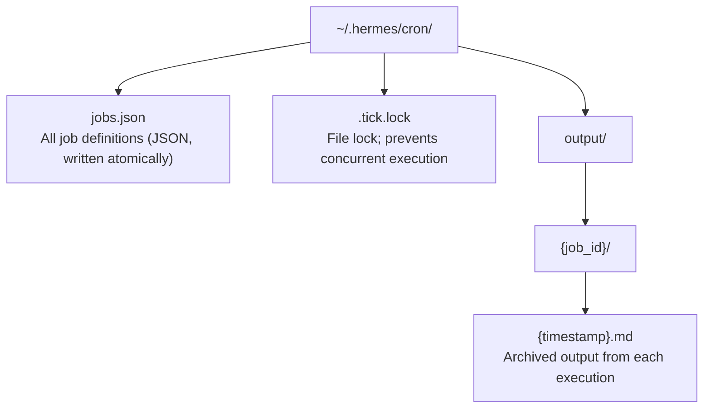
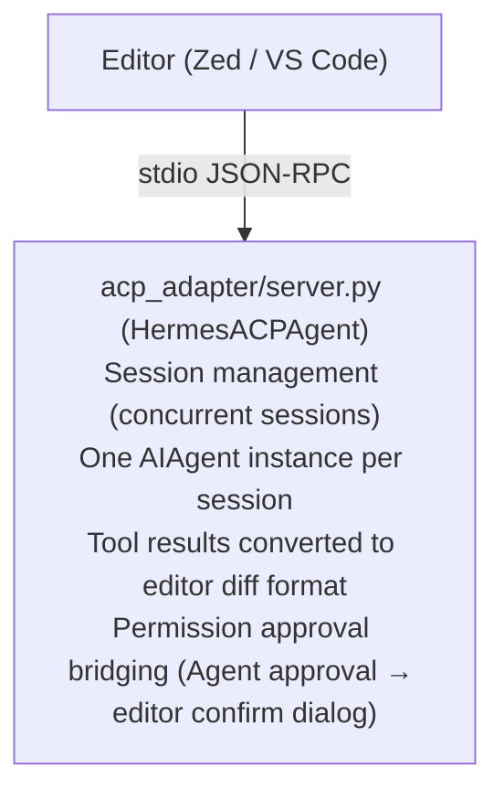

# 08 - Cron Scheduling and External Protocol Adapters

> **Chapter scope**: Three independent subsystems — `cron/` (3 files, 2,275 lines of scheduled dispatching), `acp_adapter/` (9 files, 2,354 lines of editor protocol adaptation), and `mcp_serve.py` (867 lines, MCP server). They share a common design principle: exposing AIAgent capabilities to different external callers.

## The Agent Shouldn't Only Work When You Talk to It

Every scenario covered so far has been "user says something → Agent responds." But some tasks don't need a human to trigger them — summarizing GitHub issues every morning, checking server health every hour, generating a weekly report. These require the Agent to be able to **wake up autonomously, execute, and deliver results**.

That is what the Cron scheduling system is designed for. At the same time, Hermes needs to be **callable from other systems** — code editors (via the ACP protocol) and AI toolchains (via the MCP protocol). These three systems appear quite different, but they share a single design principle: **exposing AIAgent capabilities to different callers**.

## Cron Scheduling: File-Driven Scheduled Jobs

### Why Not System crontab

The traditional approach is to write a shell script and add it to the system crontab. But Hermes's Cron has several special requirements: tasks are described in natural language ("summarize GitHub issues" rather than `curl | jq`), execution requires the full Agent environment (tools, memory, skills), and results need to be delivered to chat platforms. None of that is achievable with system crontab.

Hermes's Cron is a **pure application-layer implementation** (`cron/` directory). It has no dependency on system crontab and requires no root privileges:

**Figure: Cron data directory structure — jobs.json stores definitions, .tick.lock prevents concurrent execution, output/ archives each run's results**



### Job Lifecycle

Users can create Cron jobs in two ways: by telling the Agent in chat ("remind me about the meeting at 9 AM every day", which the Agent recognizes as intent and then calls the `cronjob` tool), or via the `hermes cron add` CLI command.

Each job contains (`cron/jobs.py:503-535`): a `prompt` (the natural-language instruction to execute), a `schedule` (the scheduling expression), a `deliver` (delivery target), and optional fields including `skills` (which skills to load), `model` (a specific model to use), and `script` (a pre-run script).

Scheduling expressions support three formats (`jobs.py:123-209`):

| Input | Type | Meaning |
|-------|------|---------|
| `"30m"` | once | Execute once in 30 minutes |
| `"every 2h"` | interval | Repeat every 2 hours |
| `"0 9 * * *"` | cron | Standard cron expression (requires `croniter` library) |

### Execution Engine

The Gateway background loop calls `scheduler.tick()` every 60 seconds (`scheduler.py:1197-1354`). The tick design has four notable mechanisms, each addressing a different aspect of correct and efficient execution:

**At-most-once semantics.** `next_run_at` is advanced to the next cycle *before* executing the job. If the Gateway crashes mid-execution, `next_run_at` is already pointing at the next cycle, so the job will not run twice. This is safer than "execute first, then advance" — the latter can double-execute a job on a crash.

**Grace window.** If the Gateway goes down for 6 hours and then restarts, it does not batch-execute all the jobs missed during those 6 hours. The grace window is calculated as `min(max(period/2, 120s), 7200s)` — jobs whose missed time exceeds this window are silently skipped.

**Wake gate.** A job can be configured with a pre-check script (`scheduler.py:797-818`). If the script outputs `{"wakeAgent": false}`, the entire Agent run is skipped. This is for "only run when new data exists" scenarios — the script first checks whether there are new PRs, and if not, the Agent is never woken up, saving an API call.

**`[SILENT]` suppression.** When the Agent's reply begins with `[SILENT]` (`scheduler.py:115`), the output is saved locally but not delivered to the chat. The system prompt explicitly tells the model it can use this marker: "If there is nothing worth reporting, reply [SILENT]" (`scheduler.py:720-731`).

### Delivery

Results can be delivered to multiple targets (comma-separated, `scheduler.py:236`):

- `"local"` — write to file only; do not send
- `"origin"` — reply to the chat where the job was created
- `"telegram:12345"` — specify platform and chat_id
- `"discord:#general"` — supports human-friendly channel names

Delivery prefers the Gateway's live adapter that is currently running — which is critical for platforms with end-to-end encryption (e.g., Matrix), since only an already-established encrypted session can send messages. If the Gateway is not running, it falls back to a standalone HTTP client (`scheduler.py:457`).

### Security

Cron job prompts are scanned for injection before being written (`cronjob_tools.py:40-68`): the scan detects invisible Unicode characters (zero-width spaces and 9 other variants) and 10 categories of threat patterns (prompt injection, data exfiltration, SSH backdoors, etc.). Script paths are restricted to the `~/.hermes/scripts/` directory (`cronjob_tools.py:153-189`) to prevent path traversal.

## ACP Adapter: Letting Editors Use Hermes

ACP (Agent Client Protocol) is an AI agent communication protocol that lets code editors (such as Zed, VS Code, and Cursor) call external agents. Hermes implements an ACP server via `acp_adapter/`, launched with `hermes acp`.

### Architecture

**Figure: ACP server architecture — the editor connects to Hermes via stdio JSON-RPC; each editor session maps to a dedicated AIAgent instance**



The transport is stdio JSON-RPC — stdout is dedicated to protocol frames, and all logging goes to stderr. Each editor session (tab/workspace) maps to a dedicated `AIAgent` instance with its own conversation history, toolset, and working directory.

The core execution flow is in the `prompt()` method (`acp_adapter/server.py:501-678`): extract user text → intercept slash commands → run `agent.run_conversation()` in a `ThreadPoolExecutor` → push tool progress, thinking content, and reply text to the editor via an event stream.

One critical adaptation detail: when the Agent executes a `patch` or `write_file` tool call, the ACP adapter converts the file modification into `tool_diff_content` (an old/new text diff, `acp_adapter/tools.py:21-51`), which the editor can display directly in its diff view for review. Permission approval is also bridged — the Agent's internal `approval_callback` is mapped to the editor's confirmation dialog, letting the user allow or deny the action from within the editor UI.

### Discovery

`acp_registry/agent.json` is the agent registration metadata for the ACP ecosystem. Editors use it to discover how to launch Hermes:

```json
{"type": "command", "command": "hermes", "args": ["acp"]}
```

On machines where Hermes is installed, ACP-compatible editors can automatically discover and use it without any manual configuration.

## MCP Server: Giving Other AI Tools Access to Chat Data

In [05 - Plugin System](05-plugin-system.md) we saw Hermes acting as an MCP **client** to connect to external tools. `mcp_serve.py` is the reverse — Hermes acting as an MCP **server**, exposing the chat platform sessions it manages to other AI tools (such as Claude Code and Cursor).

A typical scenario: you are working in Claude Code and want to see what a colleague just said in a Telegram group — Claude Code calls Hermes's `messages_read` via MCP to fetch the latest messages from that Telegram session, without switching to the Telegram client.

Launch with `hermes mcp serve` (stdio transport). It exposes 10 tools (`mcp_serve.py:452-809`) that collectively form a read/write API for the messaging gateway:

| Tool | Function |
|------|----------|
| `conversations_list` | List active conversations; filterable by platform or keyword |
| `conversation_get` | Get details of a single conversation |
| `messages_read` | Read message history |
| `messages_send` | Send a message to a specified platform |
| `channels_list` | List channels available for sending |
| `events_poll` / `events_wait` | Poll / long-poll for new events |
| `attachments_fetch` | Extract attachments |
| `permissions_list_open` / `permissions_respond` | Manage approval requests |

`EventBridge` (`mcp_serve.py:185-425`) is the core of event delivery: a background thread polls `state.db` every 200ms, skipping unchanged polls via file mtime comparison (extremely low overhead), placing new messages into an in-memory queue (capped at 1,000 entries). `events_wait` implements long-polling via `threading.Event`.

## Comparing the Three Protocols

| Dimension | Cron | ACP | MCP serve |
|-----------|------|-----|-----------|
| Caller | Timer (self-driven) | Code editor | AI toolchain |
| Transport | None (in-process call) | stdio JSON-RPC | stdio MCP |
| Agent instance | One dedicated instance per job | One dedicated instance per session | No Agent (messaging gateway read/write bridge) |
| Exposed capability | Full Agent (tools + skills + memory) | Full Agent (with diff adaptation) | Messaging gateway read/write only |
| State persistence | jobs.json + output/ | SessionDB (SQLite) | state.db (read-only) |

What they have in common: none of them modify the Agent core — they are adaptation layers outside the core that expose AIAgent capabilities to different consumers through their respective protocols.

## What's Next

At this point we have covered all of Hermes's major subsystems. The originally planned **09 - ACP Adapter** chapter has been merged into this one (covered above). **09 - Environment and Deployment** will focus on operations — Docker builds, terminal backend configuration, and multi-profile management.

---

*This document is based on analysis of hermes-agent v0.11.0 source code. All code references have been independently verified.*
