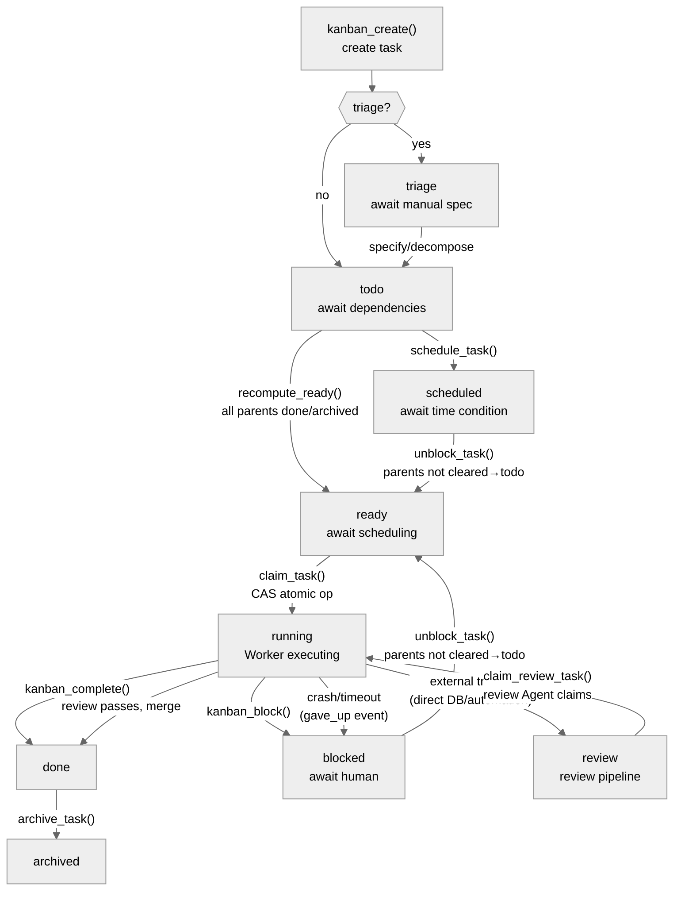

# 09 - Kanban System: Multiple Agents Collaborating on Complex Tasks

[中文](../zh/09-Kanban系统.md) | English

> **Scope**: `hermes_cli/kanban_db.py` (8,723 lines) + `hermes_cli/kanban.py` (2,845 lines) + `tools/kanban_tools.py` (1,672 lines) + `gateway/kanban_watchers.py` (1,286 lines, the GatewayKanbanWatchersMixin where the dispatcher/notifier live) + `plugins/kanban/` (the Dashboard plugin). About 14,500 lines of core code total.
> **Key classes**: `Task` (`kanban_db.py:839`), `Run` (`kanban_db.py:1005`), `dispatch_once()` (`kanban_db.py:6932`), `_default_spawn()` (`kanban_db.py:7662`).

> **This chapter is based on hermes-agent v0.18.2 (tag [`v2026.7.7.2`](https://github.com/NousResearch/hermes-agent/releases/tag/v2026.7.7.2), commit `9de9c25f6`, 2026-07-07)**

---

## Why Kanban?

There's a ceiling to what a single Agent can accomplish — a limited context window, single-threaded execution, one model that isn't good at everything. When a task is complex enough to need "one Agent on the frontend code, one on the backend API, one on test verification" — something a single Agent's context window and execution model can't handle — you need **multiple Agents each doing their part, coordinating their work**.

hermes-agent's Kanban system is designed for exactly this. It's not a simple task queue — it's a complete project-management system supporting task dependencies, automatic scheduling, failure recovery, review flows, and multi-tenant isolation. An orchestrator Agent breaks a big task into subtask cards, assigns them to Worker Agents in different Profiles, and the Dispatcher automatically schedules and executes them in the background.

This is fundamentally different from the `delegate_task` subagents covered in Chapter 02: `delegate_task` waits synchronously by default (`background=true` can be async too, but it's still a temporary subtask within a single conversation, with no persistence/dependency-graph/failure-retry semantics), while Kanban is thoroughly asynchronous (a task returns immediately after creation, the Worker executes independently in the background, and the task lives persistently in SQLite). `delegate_task` suits a simple "look something up for me," Kanban suits "help me complete a project needing multi-person collaboration."

---

## Usage Guide

### Basic Usage

```bash
# initialize the board
hermes kanban init

# create a task
hermes kanban create --title "implement the user-login API" --assignee backend-dev

# view the board
hermes kanban list
hermes kanban show t_abc123

# manually complete/block
hermes kanban complete t_abc123 --summary "API implemented and passing tests"
hermes kanban block t_abc123 --reason "need database schema confirmation"
```

In a conversation, the Agent operates the board via the `kanban_*` tools:

```
kanban_create(title="...", assignee="backend-dev", body="task spec...")
kanban_show(task_id="t_abc123")
kanban_complete(task_id="t_abc123", summary="...", metadata={...})
```

### Configuration

```yaml
# config.yaml
kanban:
  dispatch_in_gateway: true              # run the scheduler inside the Gateway process (default)
  dispatch_interval_seconds: 60          # scheduling interval (seconds, min 1.0)
  max_spawn: null                        # cap on concurrent Workers (null = unlimited)
  max_in_progress: null                  # cap on running tasks (throttle slow machines)
  failure_limit: 2                       # auto-block after N consecutive failures
  dispatch_stale_timeout_seconds: 14400  # threshold for detecting a heartbeat-less stale Worker (default 4 hours; set 0 to disable)
```

### Common Scenarios

**Scenario 1: The orchestrator splits tasks.** A Profile configured with `toolsets: [kanban]` acts as the orchestrator — it uses `kanban_create` to create subtasks, `parents=[...]` to set dependencies, and the Dispatcher schedules automatically in dependency order. The orchestrator doesn't do the work, only splits and assigns.

**Scenario 2: A Worker executes and hands off.** The Dispatcher spawns a Worker Agent for each ready task (`hermes -p <assignee> chat -q "work kanban task <id>"`). The Worker calls `kanban_show` to read the task context (including the previous attempt's summary, the comment thread, and the parent task's result), does the work, then `kanban_complete` to hand off the result.

**Scenario 3: Blocking and recovery.** A Worker hits a situation needing human decision (take "database schema needs confirmation" as an example) and calls `kanban_block(reason="...")`. The task pauses, waiting for a human to resume it via the Dashboard or CLI `kanban unblock`. After resuming, the Dispatcher re-spawns a Worker of the same Profile, and the new Worker can see the full comment thread to understand the context.

### Troubleshooting

| Problem | Where to look |
|---------|---------------|
| A task stays in todo | Check for incomplete parent tasks (`kanban show` to see parents); `recompute_ready()` only promotes when all parents are done or archived |
| A task is ready but doesn't spawn | ① `hermes kanban tail <id>` to see if there's a `respawn_guarded` event — four reasons, in priority order: `rate_limit_cooldown` (the last run ended on a rate limit, no re-spawn during the cooldown), `blocker_auth` (an API-quota-type error), `recent_success` (completed within 1h), `active_pr` (a PR within 24h) ② Confirm the assignee is a valid Profile (`hermes profile list`) ③ Check `dispatch_in_gateway: true` |
| Worker fails repeatedly | Check `consecutive_failures` and `last_failure_error` (`kanban show`); exceeding `failure_limit` (default 2) auto-blocks (a `gave_up` event, non-sticky) |
| Doesn't auto-recover after blocked | Check the latest `task_events`: if it's `blocked` (Worker actively blocked), you need to manually `kanban unblock`; if it's `gave_up` (auto-blocked), it should auto-recover after the parent task completes |
| A task stuck in running | The Worker may have crashed but the PID is still there — `kanban reclaim` to force-release; or wait for `detect_crashed_workers()` to auto-detect |
| kanban_complete fails | Check the `created_cards` parameter — if a declared task_id doesn't exist or wasn't created by this Worker, it triggers `HallucinatedCardsError` |
| Where is the Worker output | `hermes kanban log <task_id>` or directly `<board-root>/logs/<task_id>.log` |

> 📖 **Further Reading (Official Docs):**
> - [Kanban System](https://hermes-agent.nousresearch.com/docs/user-guide/features/kanban)
> - [Delegation Patterns (Multi-Agent Collaboration)](https://hermes-agent.nousresearch.com/docs/guides/delegation-patterns)

---

## Architecture & Implementation

### The Complete Journey of a Task



**Figure: The Kanban task state machine (9 states)**

The 9 task states (`kanban_db.py:102`):

- **triage** — awaiting spec; enriched with `kanban specify` or `kanban decompose` to enter todo
- **todo** — has incomplete parent-task dependencies; `recompute_ready()` promotes to ready when all parents are done or archived
- **scheduled** — a time-driven wait (corresponding to Cron scheduling, see Chapter 11). Difference from `blocked`: blocked waits for human intervention, scheduled waits for a time condition. **Not handled by `recompute_ready()`** — it needs an external `unblock_task()` (`kanban_db.py:4827`) to exit
- **ready** — schedulable; the Dispatcher will try to spawn on the next tick
- **running** — the Worker is executing
- **blocked** — two kinds (detailed below): Worker-initiated block (sticky) and Dispatcher auto-block (non-sticky)
- **review** — the review pipeline. **Not triggered by the Worker via a tool** — a Worker should use `kanban_block(reason="review-required: ...")` to request review. The `review` state must be set via direct database operation or external automation (there's no Python API in the code to move a task to review), and the Dispatcher force-loads the `sdlc-review` skill for a review Worker
- **done** — complete
- **archived** — archived (the scratch workspace is cleaned up)

**The key difference between the two kinds of blocked** (`_has_sticky_block()`, `kanban_db.py:3243`):

| Type | Trigger | Event type | Recovery |
|------|---------|------------|----------|
| Sticky block | Worker/human calls `kanban_block()` | `"blocked"` | only `kanban_unblock` can recover it |
| Auto-block | `consecutive_failures ≥ failure_limit` | `"gave_up"` | non-sticky — `recompute_ready()` **auto-recovers** after the parent task completes |

This difference directly affects diagnosis: if a task doesn't auto-become-ready after its parent completes following a block, check whether the latest event in `task_events` is `blocked` (sticky, needs manual unblock) or `gave_up` (non-sticky, should auto-recover; if it didn't, there's another problem).

### The Dispatcher: The Scheduling Engine

The Dispatcher is the heart of the Kanban system, running as an asyncio task embedded in the Gateway process — with the v0.17 god-file decomposition it migrated into `gateway/kanban_watchers.py` (`_kanban_dispatcher_watcher()`, `kanban_watchers.py:744`, part of the GatewayKanbanWatchersMixin, see Chapter 05). It runs `dispatch_once()` every `dispatch_interval_seconds` (default 60 seconds).

**Each round of dispatch_once() (`kanban_db.py:6932`) does seven things:**

1. **Reap zombie child processes** (Unix only, `os.waitpid(-1, WNOHANG)`) — clean up Worker processes that have exited but not been waited on
2. **Release stale claims** (`release_stale_claims()`) — tasks whose claim TTL expired return to ready
3. **Detect heartbeat-less Workers** (`detect_stale_running()`) — tasks that haven't sent a heartbeat for a long time return to ready
4. **Detect crashed Workers** (`detect_crashed_workers()`, `kanban_db.py:6346`) — a task whose PID no longer exists records a `crashed` event and is **put back to ready** (the same path as TTL-expiry reclaim); only if the failure count then accumulates to `failure_limit` does it secondarily trigger an auto-block
5. **Enforce max runtime** (`enforce_max_runtime()`) — a Worker exceeding `max_runtime_seconds` receives SIGTERM
6. **Promote ready tasks** (`recompute_ready()`) — todo → ready when all parents are done or archived
7. **Schedule ready tasks** — sorted by `priority DESC, created_at ASC`, executing a five-step pipeline for each ready task:
   - ① **Profile-existence check** — a task whose assignee isn't a real Hermes Profile is skipped (`skipped_nonspawnable`), supporting external Agents (take Claude Code as an example) manually claiming via `claim_task()`
   - ② **Respawn Guard** (`check_respawn_guard()`, `kanban_db.py:6758`) — **four** debounce rules (`rate_limit_cooldown` checked first, `:6767`); any one triggering skips this round's spawn and writes a `respawn_guarded` event:
     - `blocker_auth`: `last_failure_error` contains keywords like `quota`/`rate_limit`/`429`/`403`/`auth` — an API-quota/auth problem shouldn't be retried repeatedly
     - `recent_success`: a completed run within 1 hour (`_RESPAWN_GUARD_SUCCESS_WINDOW = 3600`) — prevents re-spawning a completed task
     - `active_pr`: a GitHub PR URL appearing in a comment within 24 hours (`_RESPAWN_GUARD_PR_WINDOW = 86400`) — prevents creating duplicate PRs
   - ③ **claim_task()** — a CAS atomic operation (ready → running)
   - ④ **resolve_workspace()** — create a temp directory/persistent directory/git worktree based on `workspace_kind`
   - ⑤ **_default_spawn()** — fork the Worker subprocess

Step 7 also has a **review lane**: a status=review task is also scheduled, and the Dispatcher force-loads the `sdlc-review` skill for the review Worker.

**The Notifier parallel to the Dispatcher**: the Gateway also runs `_kanban_notifier_watcher()` (`kanban_watchers.py:115`), polling the `kanban_notify_subs` table every 5 seconds to push a task's terminal events (completed/blocked/crashed, etc.) to the original requester via the platform adapter (take Telegram/Slack as examples). This is key to the human-in-the-loop closed loop — how does the user get notified after a Worker finishes? The Dashboard's WebSocket is for the browser, the Notifier is for message platforms.

**The specific command to spawn a Worker** (`_default_spawn()`, `kanban_db.py:7662`):

```bash
hermes -p <assignee> --accept-hooks --skills kanban-worker [--skills ...] [-m model] chat -q "work kanban task <task_id>"
```

The Dispatcher injects a full set of environment variables for the Worker (from `kanban_db.py:7702`, `HERMES_HOME` at :7702):

| Environment variable | Purpose |
|----------------------|---------|
| `HERMES_KANBAN_TASK` | task ID (the marker of Worker mode) |
| `HERMES_KANBAN_WORKSPACE` | working directory |
| `HERMES_KANBAN_RUN_ID` | the current run number |
| `HERMES_KANBAN_CLAIM_LOCK` | the claim identity |
| `HERMES_KANBAN_DB` | database path |
| `HERMES_KANBAN_BOARD` | board slug |
| `HERMES_KANBAN_WORKSPACES_ROOT` | the workspace base directory |
| `HERMES_KANBAN_BRANCH` | git branch name (worktree kind only) |
| `HERMES_PROFILE` | the Worker's Profile name |
| `HERMES_HOME` | the Profile-scoped config directory |
| `HERMES_TENANT` | the multi-tenant namespace |
| `TERMINAL_TIMEOUT` | terminal timeout computed from `max_runtime_seconds - 30s` |

**Worker logs**: the Worker's stdout/stderr are written to `<board-root>/logs/<task_id>.log` (append mode, a re-run doesn't overwrite). Default 2MiB rotation, keeping 1 backup. View via `hermes kanban log <task_id>`.

### The Task Data Structure

`Task` (from `kanban_db.py:839`) is a dataclass with **35 fields** (annotated fields counted via AST; 27 at v0.14.0, 30 at v0.15, 32 at v0.16 — measured per version via AST). Core fields:

| Field | Purpose |
|-------|---------|
| `id` | unique identifier (`t_<hex>` format) |
| `title` / `body` | task title and spec description |
| `assignee` | the Profile name designated to execute |
| `status` | one of 9 states |
| `priority` | scheduling priority (higher is higher-priority) |
| `workspace_kind` | `scratch` (temp directory, cleaned on archive) / `dir` (persistent directory) / `worktree` (git worktree) |
| `claim_lock` / `claim_expires` | the CAS lock and TTL (default 15 minutes) |
| `consecutive_failures` | consecutive-failure count (spawn-failure/timeout/crash counted uniformly) |
| `worker_pid` | the Worker process PID (for crash detection) |
| `current_run_id` | points to the current `task_runs` row |
| `skills` | the list of force-loaded skills |
| `model_override` | per-task LLM model override |

The 8 fields added after v0.14.0 (27→35, measured per version via diff):

| New field | Purpose |
|-----------|---------|
| `goal_mode` / `goal_max_turns` (`:900-903`) | the Worker runs in a Ralph goal loop: after each round a judge model evaluates "has the goal been reached," continuing if not (interfacing with `hermes_cli/goals.py`; the code tree is in Chapter 01, and mechanisms like the `/goal` judge decision and Ctrl+C auto-pause are detailed in Chapter 10) |
| `block_kind` / `block_recurrences` (`:913-917`) | typed blocking + an unblock-loop circuit breaker (see below) |
| `session_id` | which agent session the task was created from — a client can render a dedicated board per session |
| `project_id` | multi-project isolation, inherited by subtasks |
| `branch_name` | the git branch associated with the task |
| `model_override` | per-task LLM model override |

(Fields like `idempotency_key`/`max_retries`/`result`/`workflow_template_id`/`current_step_key` existed at v0.14 and aren't in this round's additions.)

**Typed blocking** is worth unpacking (`VALID_BLOCK_KINDS`, `kanban_db.py:125`; the routing logic is in the `block_task()` docstring, from `:4548`): `blocked` is no longer a catch-all state. The four kinds take two completely different paths:

- **`dependency` (waiting for another task) doesn't enter blocked at all** — it's routed to `todo`, handed to the existing parent-task gating/`recompute_ready` mechanism to auto-promote when the parent completes. No human, no cron, no retry storm
- **`needs_input` / `capability` / (the untyped `None`) are "real blocks"** — they enter `blocked` to wait for a human, and come with an **unblock-loop circuit breaker**: when the same kind is unblocked and then re-blocked, `block_recurrences` increments, and once it reaches `BLOCK_RECURRENCE_LIMIT = 2` (`:134`) it's no longer sent back to `blocked` but escalated to `triage` — forcing a human decision and breaking the "cron unblocks ↔ Worker re-blocks" death loop; `transient` (a transient fault) also participates in this circuit-breaker count

In a sentence: dependency is a "pseudo-block" that self-heals via the state machine, and the rest are "real blocks" needing a human (or the circuit breaker) to step in.

Two more scheduling-semantics changes: **per-profile concurrency cap** — `dispatch_once()` added `max_in_progress_per_profile` (`:6944`), and a task over the limit for the same Profile is marked `skipped_per_profile_capped` and skipped this round; **workspace inheritance** — when a Worker creates a subtask during task execution, the subtask by default inherits the workspace of **the task the Worker itself is executing** (the one `HERMES_KANBAN_TASK` points to) (`kanban_tools.py:859-898`, defaulting to a separate scratch at v0.14); tasks created by the orchestrator and by the CLI/dashboard still default to scratch. Note the inheritance source is "the creator's own task," not the parents in the dependency graph — the two are usually the same but not guaranteed by code. The database also expanded from 6 tables to **7**: the new `task_attachments` attachment table (created at `kanban_db.py:1239`).

### Run: The Record of Each Attempt

Each time a Worker is dispatched to execute a task, a `Run` record is created (from `kanban_db.py:1005`, 16 fields). The Run's `outcome` field records the result: `completed` (success), `blocked` (actively blocked), `timed_out` (timeout), `crashed` (crash), `spawn_failed` (spawn failure), `reclaimed` (force-released).

The Run's `summary` (a 1-3-sentence description of what was done) and `metadata` (structured data like `changed_files`, `tests_run`) are **the core mechanism for passing context across runs** — the next Worker sees the previous run's summary and metadata via `build_worker_context()` and can pick up the work.

The DB-side function is `complete_task()` (`kanban_db.py:3978`; the LLM-side `kanban_complete` tool ultimately calls it), and its full execution chain isn't just "the status becomes done":

1. **created_cards hallucination validation** — if a Worker declares in the `created_cards` parameter that it created certain task_ids, the system verifies these IDs genuinely exist and were created by this Worker. A false reference triggers `HallucinatedCardsError` and **blocks completion**
2. **DB transaction** (an atomic `write_txn`) — status=done, close the run
3. **Prose hallucination scan** — scan the summary and result for `t_<hex>` references, and emit a `suspected_hallucinated_references` event for nonexistent ones (advisory, non-blocking)
4. **Reset failure count + promote ready tasks** — `_clear_failure_counter()` (resets `consecutive_failures`) and `recompute_ready()` (triggers subtask todo → ready) both execute **outside the main transaction, after the prose scan** (`_clear_failure_counter` is defined at `kanban_db.py:6736`, `recompute_ready` at `:3281`), so the completion itself is already durable first
5. **Workspace cleanup** — a scratch-kind working directory + tmux session are cleaned up

### The Database: SQLite + WAL

Kanban data is stored in a SQLite database, using WAL mode so the Dashboard can still read while the Dispatcher writes. The `default` board's database is at `~/.hermes/kanban.db` (backward-compatible, not under a boards subdirectory), and other boards are at `~/.hermes/kanban/boards/<slug>/kanban.db`. The database-path resolution priority (resolution functions like `current_board_path()` are near `kanban_db.py:404`): the `HERMES_KANBAN_DB` environment variable (highest, pins the path directly) > the `board=` parameter > the `HERMES_KANBAN_BOARD` environment variable > the `~/.hermes/kanban/current` text file (written by `hermes kanban boards switch`, containing the board slug; `current_board_path()` returns `kanban_home()/"kanban"/"current"`, and `kanban_home()` resolves to `<root>`=`~/.hermes`, so there's only one `kanban` level).

7 tables:

| Table | Purpose |
|-------|---------|
| `tasks` | the task main table |
| `task_runs` | the history of each execution attempt |
| `task_links` | parent→child dependencies (composite primary key: parent_id, child_id) |
| `task_comments` | the comment thread (author taken from `HERMES_PROFILE`) |
| `task_events` | an append-only audit log (the Dashboard WebSocket tails this table) |
| `task_attachments` | task attachments (added in v0.18, created at `:1239`) |
| `kanban_notify_subs` | notification subscriptions |

### Worker Context: build_worker_context()

When a Worker calls `kanban_show()`, `build_worker_context()` (`kanban_db.py:7898`) builds a formatted text block containing:

- the task's title, body, assignee, status
- the parents' latest summary (the Worker can see upstream tasks' results)
- the summary, metadata, and error of the previous N Runs (up to 10, `_CTX_MAX_PRIOR_ATTEMPTS`)
- the comment thread (up to 30, `_CTX_MAX_COMMENTS`)
- each field has a size cap (body 8KB, summary/metadata 4KB, comment 2KB) to prevent context blowup

This is the key design of Kanban's asynchronous collaboration — a Worker doesn't need to converse with the orchestrator; all context is passed through the database.

### Tool Permissions: Worker vs. Orchestrator

`kanban_tools.py` distinguishes Worker and orchestrator permissions via two check functions:

- **Worker mode** (`_check_kanban_mode()`): the `HERMES_KANBAN_TASK` environment variable exists (spawned by the Dispatcher). A Worker can only operate its own task — `_enforce_worker_task_ownership()` ensures a Worker can't tamper with other tasks
- **Orchestrator mode** (`_check_kanban_orchestrator_mode()`): the Profile's `toolsets` include `kanban` but there's no `HERMES_KANBAN_TASK`. The orchestrator can use `kanban_list` (which a Worker can't) and `kanban_unblock`

| Tool | check_fn | Worker | Orchestrator | Note |
|------|----------|--------|--------------|------|
| `kanban_show` | kanban_mode | ✅ (any task) | ✅ (any task) | read-only, no ownership restriction (`_handle_show` doesn't call `_enforce_worker_task_ownership`) |
| `kanban_complete` | kanban_mode | ✅ | ✅ | Worker has ownership restriction |
| `kanban_block` | kanban_mode | ✅ | ✅ | Worker has ownership restriction |
| `kanban_heartbeat` | kanban_mode | ✅ | ✅ | Worker has ownership restriction |
| `kanban_comment` | kanban_mode | ✅ | ✅ | |
| `kanban_create` | kanban_mode | ✅ (create subtasks) | ✅ | |
| `kanban_link` | kanban_mode | ✅ | ✅ | add a parent→child dependency |
| `kanban_list` | orchestrator_only | ❌ | ✅ | |
| `kanban_unblock` | orchestrator_only | ❌ | ✅ | |

`kanban_mode` returns True for both Worker and orchestrator, but a Worker is restricted by `_enforce_worker_task_ownership()` — it can only operate its own task (`HERMES_KANBAN_TASK`). The orchestrator (with no `HERMES_KANBAN_TASK`) isn't restricted by ownership. `orchestrator_only` excludes the Worker entirely.

### Skill Guidance

The Dispatcher auto-loads the `kanban-worker` skill (`skills/devops/kanban-worker/SKILL.md`) for each Worker, guiding it to use the workspace correctly, write good summaries, handle heartbeats, and avoid common pitfalls. The orchestrator uses the `kanban-orchestrator` skill (`skills/devops/kanban-orchestrator/SKILL.md`), guiding the decomposition strategy and the "don't do it yourself" principle.

A Worker on a review task additionally loads the `sdlc-review` skill.

### The Dashboard Plugin

`plugins/kanban/` provides the Web Dashboard UI (Chapter 08 already covered that it's not the scheduler). The Dashboard is mounted via FastAPI routes at `/api/plugins/kanban/`, using session-token authentication. Core capabilities:

- board view (8 columns: triage → done, archived optionally shown)
- WebSocket real-time updates (tailing the `task_events` table)
- a task-detail drawer (runs history, comment thread, event log)
- WAL mode allows the Dashboard to read concurrently while the Dispatcher writes

### Code Organization

```
hermes_cli/kanban_db.py       — the core database layer (Task/Run/Comment/Event + dispatch_once) (8,723 lines)
gateway/kanban_watchers.py    — Dispatcher/Notifier watcher definitions (1,286 lines, GatewayKanbanWatchersMixin; gateway/run.py is just the create_task launch point)
hermes_cli/kanban.py          — the CLI command entry (init/create/list/show/complete/block and 25+ subcommands) (2,845 lines)
hermes_cli/kanban_diagnostics.py — diagnostic tools (1,107 lines)
hermes_cli/kanban_decompose.py — task-decomposition tools (477 lines)
hermes_cli/kanban_swarm.py    — Swarm orchestration helper (278 lines)
hermes_cli/kanban_specify.py  — task-spec tools (273 lines)
tools/kanban_tools.py         — the Agent tool interface (9 tools) (1,672 lines)
gateway/run.py                — the Dispatcher watcher (embedded in the Gateway's asyncio task)
plugins/kanban/               — the Dashboard plugin (Web UI + FastAPI routes)
skills/devops/kanban-worker/  — the Worker-behavior-guide skill
skills/devops/kanban-orchestrator/ — the orchestrator-decomposition-strategy skill
```

### Design Decisions

#### Why Embed in the Gateway Rather Than a Separate Daemon?

The Dispatcher is embedded in the Gateway process (`dispatch_in_gateway: true`) rather than running separately, because the Gateway is already a long-running process — no need for the user to manage an extra daemon. But if you don't use the Gateway (take a pure-CLI scenario as an example), you can run it separately via `hermes kanban daemon` or a systemd service (`plugins/kanban/systemd/hermes-kanban-dispatcher.service`).

#### Why SQLite Rather Than Redis/PostgreSQL?

Zero dependencies. The Kanban system's users are individual developers and small teams — they don't need a distributed database. SQLite + WAL mode provides enough concurrency on a single machine (one Dispatcher writing + Dashboard reading + Worker reading/writing), and the database file can be copied for backup directly.

#### What Do CAS and the claim TTL Solve?

`claim_task()` uses a CAS (Compare-And-Swap) atomic operation to ensure the same task isn't claimed by two Dispatcher ticks at once. `claim_expires` (default 15 minutes) is the safety net — if a Worker process crashes and PID detection fails (take a containerized environment as an example), the task is auto-released back to ready after the TTL expires.

---

## Relationship to Other Chapters

| Related Chapter | Relationship |
|-----------------|--------------|
| 01 — Infrastructure Layer | `hermes_cli/kanban.py` is a CLI subcommand |
| 02 — Agent Core | A Worker is a full `AIAgent` instance with its own conversation loop |
| 04 — Skill System | The `kanban-worker` / `kanban-orchestrator` skills guide Agent behavior |
| 05 — Gateway Layer | The Dispatcher is embedded in the Gateway's asyncio event loop |
| 08 — Built-in Plugins | The Dashboard is a plugin, providing the Web UI |

---

*This document is based on source analysis of hermes-agent v0.18.2. All code references have been independently verified.*
