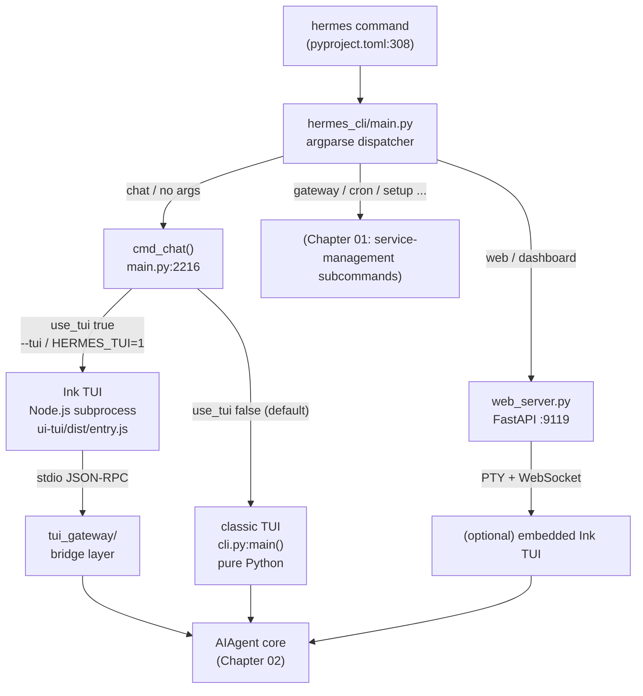
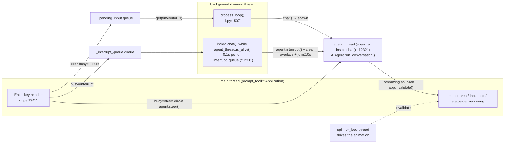
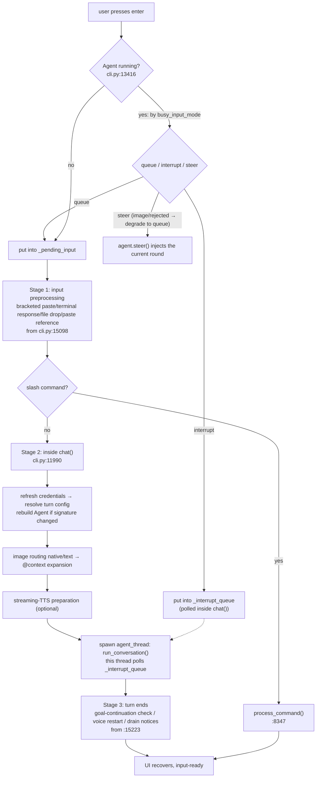
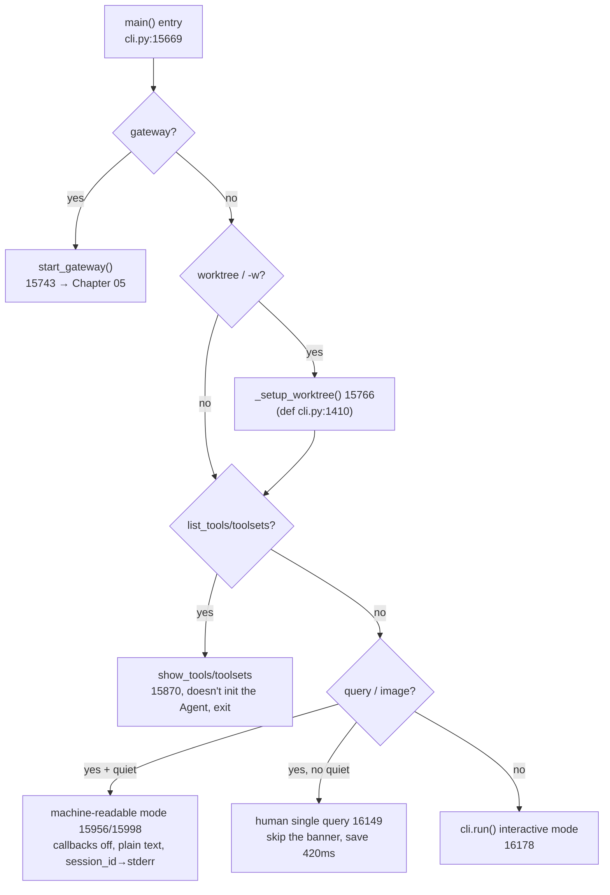
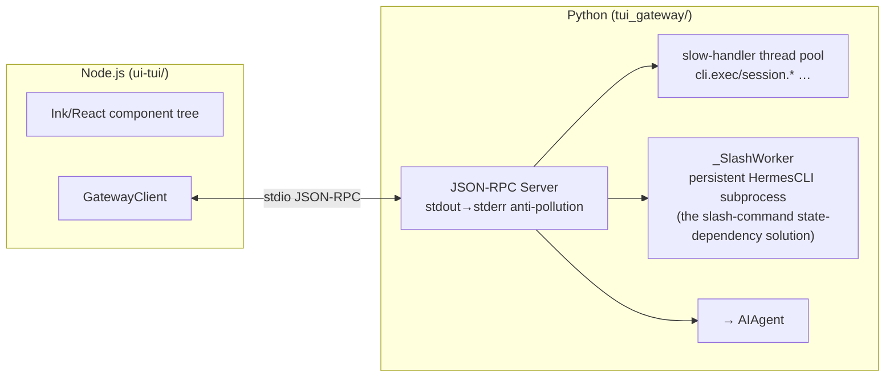
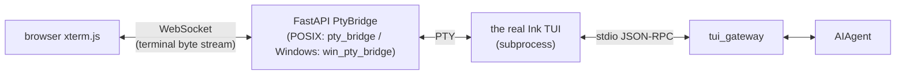

# 10 - The Same Agent, Three Faces and Six Ways to Run

[中文](../zh/10-交互界面与运行模式.md) | English

> **Scope**: the interaction-interface layer and run-mode dispatch — the classic prompt_toolkit TUI (`cli.py`, 16,184 lines), the modern Ink TUI (`ui-tui/` Node.js + the `tui_gateway/` 11-file bridge layer, 16,148 lines), and the Web Dashboard cum desktop backend (`hermes_cli/web_server.py`, 16,926 lines + the `web/` Vite/React SPA).
> **Key classes/functions**: `main()` (`cli.py:15669`, run-mode dispatch), `HermesCLI.run()` (`cli.py:13037`), `process_loop()` (`cli.py:15071`, the REPL thread model), `_render_final_assistant_content()` (`cli.py:2454`, the rendering pipeline), `SkinConfig` (`hermes_cli/skin_engine.py:130`), `cmd_chat()` (`hermes_cli/main.py:2216`, interface routing).

> **This chapter is based on hermes-agent v0.18.2 (tag [`v2026.7.7.2`](https://github.com/NousResearch/hermes-agent/releases/tag/v2026.7.7.2), commit `9de9c25f6`, 2026-07-07)**

---

## You Type `hermes` — Then What?

You type `hermes` in the terminal and hit enter, and half a second later a golden caduceus banner appears, with an input box fixed at the bottom of the screen. You type, hit enter, and the Agent's reply scrolls out above — markdown rendered into pretty formatting, tool calls popping out line by line with emoji, a kawaii face being cute while it thinks. It looks like an ordinary chat REPL. But what happens in that half second is the reason this chapter exists: the `hermes` command first passes through a 14,624-line argparse dispatcher that decides whether you want the classic interface, the modern Ink interface, or the Web dashboard; having chosen the classic interface, it doesn't use the most naive "read a line → run the Agent → print → read another line" blocking loop, but hands rendering and input to an event loop occupying the main thread and throws the Agent onto a background thread, the two communicating via a queue — **which is exactly why you can keep typing while the Agent is still running, and even interrupt it**. And when you switch scenarios — wanting to ask a one-off question in a shell script and pipe the answer to `jq` — the same `cli.py` switches into a "machine-readable" mode that prints no banner, does no rendering, and emits only plain text.

This chapter answers a few questions: **How can one `hermes` command conjure three interfaces? Why does the interactive interface use the seemingly-complex structure of "run the UI on the main thread, run the Agent on a background thread"? In what scenario is each of the six run modes used, and what's their essential difference? How are the markdown, diffs, CJK tables, spinner, and skins rendered in the terminal, and can they be configured?** By the end you should be able to: choose the right run mode by scenario, embed Hermes into an automation script, customize your own skin, and know where to look when the interface hangs.

> **Scope note**: Chapter 01 covers `hermes_cli`'s subcommand system (service-management commands like `gateway`/`setup`/`cron`/`config`) and the config/auth infrastructure; this chapter only takes over the part "after `hermes` enters chat" — interface routing, the interaction loop, rendering. Chapter 05 covers how the gateway asynchronously delivers messages to platforms like Telegram/Discord; this chapter covers the **synchronous rendering of the local terminal**. The two "non-interactive large-scale run modes" — batch running (`batch_runner.py`) and SWE evaluation (`mini_swe_runner.py`) — are left to Chapter 12.

---

## Usage Guide

### Basic Usage: Six Ways to Run

Hermes's entry is one command, `hermes`, but its behavior is determined by arguments. Here are the ones you'll use day to day:

```bash
# 1. interactive mode (default) — enter the classic prompt_toolkit TUI
hermes
hermes chat                       # equivalent

# 2. modern Ink TUI (the recommended way to interact) — modal overlays, mouse selection, non-blocking input
hermes --tui
export HERMES_TUI=1 && hermes      # make --tui the default via an environment variable

# 3. single-query mode — execute once and exit, good for a quick Q&A
hermes -q "explain the CAP theorem in one sentence"
hermes chat -q "open a draft PR"

# 4. machine-readable mode — for scripts/pipes, no banner, no rendering, plain text only
hermes -q "list the Python files in the current directory" --quiet | jq -R .
#   (session_id goes to stderr, stdout has only the final reply, staying clean)

# 5. worktree-isolation mode — run in a separate git worktree, multiple Agents in parallel without clashing
hermes -w
hermes -w -q "Fix issue #123"

# 6. resume a past session
hermes --continue                 # resume the most recent session (-c)
hermes --resume 20260225_143052_a1b2c3   # resume by ID (-r)
hermes -c "refactoring auth"      # resume by title
```

Two more common helpers:

```bash
hermes -s hermes-agent-dev,github-auth   # preload skills at startup
hermes --list-tools                       # list tools then exit (probe available tools in a script)
```

> **Classic CLI vs. modern TUI — which to use?** The official recommendation is the modern Ink TUI (`hermes --tui`) as the way to interact day to day — it has modal overlays (the model picker, session picker, and approval box are floating windows rather than inline in the stream), mouse drag-selection, flicker-free alternate-screen rendering, and leaves no scrollback junk after exiting. The classic CLI is the default, starts fastest (pure Python, no Node subprocess), and is what works in script and pipe scenarios. The two share the same sessions (both write `~/.hermes/state.db`), so you can start in one interface and `--continue` in the other.

### Configuration

The interface- and rendering-related config is all under the `display:` section of `config.yaml`. The most commonly used:

```yaml
# ~/.hermes/config.yaml
display:
  skin: default              # skin: default/ares/mono/slate/daylight/poseidon/sisyphus/charizard/warm-lightmode, or custom
  personality: helpful       # personality (affects tone, orthogonal to the skin)
  busy_input_mode: interrupt # pressing enter while the Agent is busy: interrupt (interrupt immediately) / queue (queue for the next round) / steer (inject into the current round without interrupting)
  tool_preview_length: 0     # max characters the tool-preview line shows (0 = unlimited)
  tui_status_indicator: kaomoji   # the Ink TUI status-bar busy indicator: kaomoji/emoji/unicode/ascii
  details_mode: collapsed    # the Ink TUI collapsible-panel global default: hidden/collapsed/expanded
  final_response_markdown: strip  # the final reply's rendering mode: render/strip/raw (default strip, see "Streaming Rendering Pipeline")
```

Three worth calling out specifically:

- **`busy_input_mode`** — decides what happens "when you press enter while the Agent is still working." `interrupt` (default) interrupts the current operation to handle your new message; `queue` quietly queues the message to send after this round ends; `steer` injects the message into the current run after the next tool call (no interruption, no new round), good for a mid-course addition like "check the tests too while you're at it" (the `cli.md` doc; `steer` auto-falls-back to `queue` when the Agent isn't started or the message has an image).
- **`tui_status_indicator`** — the busy animation in the Ink TUI status bar, defaulting to rotating a set of kawaii faces every 2.5 seconds. Can be switched to emoji/unicode/ascii, or at runtime via `/indicator emoji`.
- **`mouse_tracking`** (Ink TUI) — `off`/`wheel`/`buttons`/`all`. In tmux, `wheel` is recommended to avoid hover events making tmux flash "No image in clipboard" on the input line.

Skins can be switched at runtime and re-rendered live: `/skin ares`, `/personality pirate`. A runtime switch is session-level; to make it permanent, write it into `config.yaml`.

### Common Scenarios

**Scenario 1: Embed Hermes into a shell script** — use `--quiet` to get clean machine-readable output.

```bash
#!/bin/bash
# stdout has only the final reply; session_id and errors go to stderr, not polluting the pipe
ANSWER=$(hermes -q "summarize today's errors in /var/log/syslog" --quiet 2>/dev/null)
echo "$ANSWER" | tee report.txt
```

Expected: no banner, no spinner, no "Hermes" reply box; stdout is the plain-text answer; a non-zero exit code means this round failed (the machine-readable branch at the tail of main(), from `cli.py:16071`).

**Scenario 2: Multiple Agents modifying the same repo in parallel** — use `-w` to have each Agent work in a separate git worktree branch, without interfering.

```bash
hermes -w -q "migrate the auth module to the new API" &
hermes -w -q "add unit tests for the payment module" &
```

Expected: each instance creates a separate worktree branch, with changes isolated; the system prompt injects a note telling the Agent it's in an isolated environment and to remember to commit and open a PR (the worktree-mode system-prompt injection, in main()). A crash-leftover worktree is auto-cleaned on the next startup (`cli.py:1833 _prune_stale_worktrees`). But note a **data safety net**: on normal exit, if a worktree has unpushed commits, `_cleanup_worktree()` (`cli.py:1692`) **actively preserves** it and prints a manual-cleanup command — real work is never auto-deleted. So a `.worktrees/` directory piling up isn't a bug, it's unpushed work inside.

**Scenario 3: Reattach a session after an SSH disconnect** — the Ink TUI's auto-recovery.

```bash
export HERMES_TUI_RESUME=1     # auto-reattach the most recent TUI session
hermes --tui
```

Expected: after an SSH reconnect, `hermes --tui` reattaches directly to the previous session state rather than starting a new session.

### Troubleshooting

| Symptom | Cause | Fix |
|---------|-------|-----|
| `hermes --tui` won't start, falls back to the classic interface | No Node ≥20 / TUI bundle missing / not a TTY | Run `hermes doctor` to check Node; Hermes prints a diagnostic and auto-falls-back rather than hanging (`tui.md`) |
| `Shift+Enter` sends instead of newline | Most terminals don't distinguish the byte sequences of `Enter`/`Shift+Enter` | Use `Alt+Enter` or `Ctrl+J` (works everywhere); or enable the terminal's Kitty keyboard protocol |
| `--quiet` still printed a bunch of stuff? | Confused two "quiet" concepts (see the note below) | Machine-readable wants `--quiet`/`-Q`; "default quiet mode" is a different thing, meaning verbose tool logs are suppressed by default |
| CJK tables misaligned in the terminal | The model's table aligns by character count rather than display width | Hermes has built-in CJK-width correction (`agent/markdown_tables.py`); if still misaligned it's most likely a terminal monospace-font issue |
| Output garbled / old content re-scrolls after a window resize | The terminal redraw needs to replay history | This is normal resize recovery (`cli.py:2545 _replay_output_history`), replaying the last 200 lines |
| `Alt+Enter` doesn't newline on Windows | Intercepted by Windows Terminal (toggles fullscreen) | Use `Ctrl+Enter` (delivered as `Ctrl+J`) or `Ctrl+J` directly |
| Manually `export HERMES_TUI_RESUME=xxx` had no effect | Python proactively clears this variable on every startup (to prevent a shell leftover from making the TUI try to resume a nonexistent session) | Use `--resume <id>` explicitly; for auto-resume, set it up per `tui.md` |
| Ink TUI suddenly exits, showing only a pile of Node stack | On a non-zero exit of the TUI subprocess, the Python layer just passes through the exit code without adding a diagnostic | Check `~/.hermes/logs/tui_gateway_crash.log` (the full stack recorded by the panic hook) + the `[gateway-crash]` summary in the TUI Activity panel |
| Ink TUI disappears but there's nothing in the crash log | Another root cause: the TUI process itself was killed by mistake — the MCP orphan-reaping `killpg()` racing with slash-worker spawn (the pitfall recorded in the `tui_gateway/server.py:305` comment, fixed with `start_new_session=True`) | Confirm the version includes the fix; upgrade an old version |
| Interrupt/steer behaves unexpectedly | The interrupt chain has a dedicated debug log | Check `~/.hermes/interrupt_debug.log` — both nodes, enqueue (`cli.py:13448`) and the actual `agent.interrupt()` trigger (`:12361`, including subagent interrupt state), are recorded |
| `.worktrees/` directory won't clean up | That worktree has unpushed commits and was deliberately preserved by `_cleanup_worktree` | Push or confirm abandonment, then `git worktree remove --force` to clean manually |
| Non-localhost Dashboard access keeps 401 | A non-loopback bind switches to OAuth/cookie authentication, and the ephemeral token is no longer the credential | See the dual-authentication scheme in the "Web Dashboard" section; use 127.0.0.1 for local development |

> ⚠️ **The two meanings of "quiet" — the easiest trap to fall into**: the `cli.md` doc has a section called "Quiet Mode" saying "the CLI runs in quiet mode by default," which means **suppressing verbose tool logs and enabling kawaii animation feedback** (relative to `--verbose`). But the command-line `--quiet`/`-Q` flag is a completely different thing — it's **machine-readable mode**, turning off even the banner, spinner, and streaming render callbacks, emitting only the final reply (near `cli.py:16071`). The two share a name but are at different layers: one is "log quiet," the other is "output clean enough to feed a pipe."

> 📖 **Further Reading (Official Docs):**
> - [TUI (the modern interface)](https://hermes-agent.nousresearch.com/docs/user-guide/tui)
> - [CLI Interface (the classic interface: keys/slash commands/interruption)](https://hermes-agent.nousresearch.com/docs/user-guide/cli)
> - [Skins & Themes (skin customization)](https://hermes-agent.nousresearch.com/docs/user-guide/features/skins)
> - [Slash Commands Reference](https://hermes-agent.nousresearch.com/docs/reference/slash-commands)

---

## Architecture & Implementation

### One Command, Three Faces: How the Interface Is Routed

Why can `hermes`, `hermes --tui`, and `hermes web` enter three interfaces that look completely different, yet behind them is the same Agent core? The key is: **the interface is only the Agent's "frontend," and the routing happens at the entry point, not inside the Agent**.

The `hermes` command is registered at `pyproject.toml:308` to `hermes_cli.main:main` — a 14,624-line argparse dispatcher (Chapter 01 details its subcommand system). When you run `hermes` or `hermes chat`, control enters `cmd_chat()` (`hermes_cli/main.py:2216`). The first thing it does is call `_resolve_use_tui(args)` (`main.py:2218`) to decide which interface path to take — `--tui`/`HERMES_TUI=1` forces Ink, `--cli` forces classic, and `config.yaml`'s `display.interface: tui` is the default:

```python
def cmd_chat(args):
    use_tui = getattr(args, "tui", False) or os.environ.get("HERMES_TUI") == "1"
```

- **`use_tui` true** → launch the modern Ink TUI. In `_launch_tui()` (`main.py:1985`) it stuffs a bunch of runtime parameters into `HERMES_TUI_*` environment variables (`HERMES_TUI_PROVIDER` etc. from `:2051`, model/provider/toolsets/skills/resume), builds/reuses `ui-tui/dist/entry.js` via `_make_tui_argv()` (`:1721`), then spawns a Node.js subprocess to run it.
- **`use_tui` false** → `from cli import main as cli_main` (`main.py:2372`), directly calling the classic interface's `cli.py:main()`, a pure Python function call with no subprocess.

And `hermes web` / `hermes dashboard` is another subcommand path, starting a FastAPI service (`hermes_cli/web_server.py`).

Before routing, `cmd_chat()` does a few preprocessing steps that explain some entry behaviors:

- **The dual-source resolution of `--continue`/`-c`** (`main.py:1628-1651`): with a string, `-c` looks up a session by title/ID; without an argument, it first looks up by the current interface source (`source="tui"` or `"cli"`), and **the TUI mode, on a miss, falls back to looking up CLI sessions** (`main.py:1644`) — so a session you opened in the classic CLI can also be reattached by `hermes --tui -c`.
- **First-run guard** (`main.py:1686-1715`): with no provider configured, it intercepts and prompts `hermes setup`; in a non-interactive TTY (a pipe/CI) it `sys.exit(1)`s directly rather than hanging on an interactive prompt.
- **`--yolo`**: sets `HERMES_YOLO_MODE=1`, bypassing all dangerous-command approval (the status bar and banner conspicuously show a `⚠ YOLO` warning so you don't forget you're in auto-approve mode).

**Figure: How one `hermes` command routes to three interfaces — the routing happens at the entry point, and all three ultimately connect to the same AIAgent**



The cost of this design: the classic TUI and the Ink TUI are two separate rendering implementations (one Python, one TypeScript/React), so a lot of interface logic is maintained twice. But the payoff is playing to each one's strengths — the classic TUI starts fastest with zero extra dependencies, good for scripts and "just want to ask something quickly"; the Ink TUI has strong UI capabilities, good for long interactions. Shared session storage (`~/.hermes/state.db`) lets the two connect seamlessly, easing the fragmentation of "two implementations."

### Why the Classic TUI Uses "Run the UI on the Main Thread, the Agent on the Background"

The most naive chat REPL is this: read a line → run the Agent → print the result → read another line. A single `while True` loop would do. But Hermes deliberately doesn't do this. Why?

Because the naive loop has a fatal flaw: **while the Agent runs, the whole program is blocked**. You can't keep typing while it thinks, can't pre-queue the next message, and pressing `Ctrl+C` only takes effect after the current `input()` returns. For an Agent that easily runs for tens of seconds or minutes, this "typing means waiting" experience is unacceptable.

This is the same trick all GUI frameworks use: **separate rendering (the main thread) from the time-consuming computation (a background thread)** — Electron, Qt, Swing all do this, and Hermes just implements it again in the terminal. Specifically it splits into two threads:

- **The main thread**: occupied by `prompt_toolkit`'s `Application` event loop, responsible for rendering the output area, the bottom input box, the status bar, and responding to keyboard events. `run()` (`cli.py:13037`) builds this Application.
- **The background daemon thread**: runs `process_loop()` (`cli.py:15071`), which continuously takes user input from a queue `self._pending_input` and runs the Agent when it gets some.

The two communicate via the queue. You type in the input box and hit enter, and the main thread just `put`s the content into the queue and returns immediately — the UI never lags for a moment. The background thread gets it in a 0.1-second timeout poll (`cli.py:15076`), then calls `self.chat()` to run the Agent:

```python
def process_loop():
    while not self._should_exit:
        try:
            user_input = self._pending_input.get(timeout=0.1)
        except queue.Empty:
            if not self._agent_running:
                self._check_config_mcp_changes()        # things done incidentally while idle
                # drain background-process completion notices…
            continue
        ...
        self._agent_running = True
        app.invalidate()   # refresh the status bar
        try:
            self.chat(user_input, images=submit_images or None)
        finally:
            self._agent_running = False
```

**This is the root of "non-blocking input"** — the main thread is never occupied by the Agent, so you can type at any time. There's another daemon thread running `spinner_loop` (defined at `cli.py:15051`) dedicated to driving that cute spinner animation.

But the path above, "enter → `_pending_input` → process_loop," only covers the case where the **Agent is idle**. While the Agent is running, the Enter-key handler (`cli.py:13411-13467`) takes another decision tree — one of three by `busy_input_mode`:

- **queue** → put into `_pending_input` as usual, handled after this round ends
- **interrupt** → put into the separate `_interrupt_queue`
- **steer** → doesn't go through any queue, directly synchronously calls `self.agent.steer(text)` (thread-safe, holding `_pending_steer_lock`); with an image or if steer is rejected it **silently degrades to queue** (`cli.py:13417-13435`)

And the consumer of `_interrupt_queue` isn't process_loop's main loop either: inside `chat()` it actually **starts another thread** — `agent_thread` (`cli.py:12321`) really runs `AIAgent.run_conversation()`, and the thread where process_loop lives now enters a `while agent_thread.is_alive()` loop (`:12331`), polling `_interrupt_queue` on a 0.1-second timeout. So the Agent's real running-period form is **three worker threads, two queues**: the main thread handles the UI, the process_loop thread acts as the interrupt monitor, and agent_thread runs the model.

The action chain after an interrupt fires is also worth noting: `agent.interrupt(msg)` → `_clear_active_overlays_for_interrupt()` clears leftover approval/clarify/sudo overlays (otherwise the CLI stays frozen until the prompt's own timeout, #14026) → polls `agent_thread.join()` in 0.2-second steps for up to 10 seconds to reclaim control. There's also a race handling: when the clarify modal is active, a message in `_interrupt_queue` doesn't execute an interrupt but is transferred back to `_pending_input` (`cli.py:12341-12346`) — the user is answering a multiple-choice question, and interrupting now would only cause state confusion. The whole chain has a dedicated debug file `~/.hermes/interrupt_debug.log` (both the enqueue and trigger nodes write to it, see the troubleshooting table).

The queue model also incidentally solves a string of other needs: while idle (a queue-get timeout), the background thread checks for MCP config changes and drains the completion notices of background tasks (`/background`), treating them as synthetic input and `put`ting them back into the queue (`cli.py:15078-15088`); after a round ends it also runs the "goal continuation" check and the auto-restart of continuous voice (the finalize section of process_loop). All these "events" are unified into "put something into the queue," consumed by one loop, without needing a separate mechanism for each event kind.

**Figure: The classic TUI's thread model — two threads and one queue while idle; three threads and two queues during the Agent's run**



Failure mode: `process_loop` is wrapped in a try/except, so an error handling one message only logs a warning (`cli.py:15253`, "msg may be lost") without crashing the loop — the background thread dying means the whole interactive interface loses responsiveness, so this safety net is critical.

### The Lifecycle of a Complete Turn: From Pressing Enter to UI Recovery

The two-thread model above is the skeleton, but the step "got the input → run the Agent" is actually a fairly long pipeline. Walking through it fully explains some phenomena that look like bugs at first ("why is what I typed different from what got sent," "why is the first message slow after switching model," "why did the Agent send another one on its own").

**Stage 1: Input preprocessing** (inside `process_loop`, from `cli.py:15098`). The raw input, before entering the Agent, passes four silent cleanups:
1. Strip leaked bracketed-paste wrappers (`_strip_leaked_bracketed_paste_wrappers`, defined at `cli.py:2982`) — removed when the terminal bracketed-paste mode (`\x1b[?2004h`) mixed into the submitted content.
2. Strip leaked terminal responses (`_strip_leaked_terminal_responses_with_meta`, `:3257`) — removed when a mouse-event response mixed in, and triggers input-mode recovery.
3. File-drop detection (`_detect_file_drop`, `:2872`) — if what's dragged in is an image, auto-attach it; if a file, rewrite the input to `[User attached file: ...]`.
4. Paste-reference expansion (`_expand_paste_references`, `:5519`) — restore a placeholder like `[Pasted text #N: M lines → filename]` to the full content.

None of these four steps gives the user any visible cue — if you notice "the message sent is different from what I typed," the cause is most likely here. To troubleshoot: enable `/verbose`, and the stripping actions become visible in the debug log.

**Stage 2: Inside `chat()`** (`cli.py:11990`). Note it uses a **separate `_interrupt_queue`** (distinct from `_pending_input`): while idle, typing goes into `_pending_input`; while the Agent runs, typing goes into `_interrupt_queue`, avoiding a race between process_loop and the interrupt monitor (the head of chat()). Then:
1. Refresh provider credentials (handle key rotation, `11257`).
2. **Re-resolve the agent config by the current message** (`_resolve_turn_agent_config`, `11260`): some skills require a specific model/runtime, and if this round's signature differs from the current agent, `self.agent` is set to None and re-initialized (`11261-11272`) — **this is why "the first message is slow after switching model,"** because the Agent is being rebuilt.
3. **Image routing** (`11280-11329`): `decide_image_input_mode()` decides between native (a vision model, pixels as content parts) and text (a non-vision model, first using `vision_analyze` to turn the image into a text description).
4. **@context reference expansion** (`11331+`): references like `@file:main.py`, `@diff`, `@folder:src/` are read here and expanded per the context-length budget.
5. **Streaming-TTS preparation** (`12145-12195`): in voice mode with a provider supporting per-sentence streaming, it starts `tts_thread` and registers a stream callback — the "speak the reply as it's generated" mechanism is hooked here.
6. **Spawn `agent_thread` to run the model, this thread becomes the interrupt monitor** (`:12321/:12331`, see the three-thread model in the previous section) — `run_conversation()` doesn't run on the process_loop thread.

**Stage 3: After the turn ends** (the finalize section of `process_loop`, from `:15223`):
1. **Goal continuation** (`_maybe_continue_goal_after_turn`, defined at `cli.py:9089`, called at `:15223`). First, what "goal" is: `/goal <goal>` sets a **cross-turn persistent goal** (the `cli.py:9027` comment calls it a Ralph-style loop), and after each round a lightweight judge call decides "was it reached this round" — if not reached, the budget isn't exhausted, and there's no queued **real user message** in `_pending_input` (it must iterate the queue content to exclude slash commands, `:9115-9142`), it `put`s the continuation prompt back into the queue — **this is the source of "the Agent sent another one on its own."** Its interaction with the interrupt mechanism is special-cased: if this round was interrupted by Ctrl+C, the goal **auto-pauses** rather than judging-and-continuing as usual (the docstring says outright that otherwise "Ctrl+C would feel like it did nothing" — the judge, facing half-finished output, almost always says continue), prints `⏸ Goal paused`, and is resumed with `/goal resume` or cleared with `/goal clear` (`:9099-9107/:9159`).
2. In continuous voice mode, auto-restart recording (near `:15228`, dispatched to a daemon thread to avoid the beep blocking).
3. Drain background-process notices again, push into the queue.

**Figure: The lifecycle of a complete turn in the classic TUI**



### The Other Side of the Input Box: A Modal State Machine

The classic TUI's bottom input box looks like just "where you type messages," but it's actually a **modal state machine** — depending on the Agent's need, the same input box switches into different forms like a multiple-choice, a password input, a command approval. Five modal states are initialized in `HermesCLI.__init__` (`cli.py:4044-4066` — moved from run() to construction time in v0.18), each carrying a `response_queue` (to send the user's answer back to the waiting tool thread) and a `deadline` (a timeout timestamp).

Why not just use the most naive `input()` to ask? Because `input()` blocks, and calling it directly in prompt_toolkit's event loop would break the UI, and Enter could even EOF the whole application. The modal state machine lets these "ask the user" interactions reuse the same bottom input box: process_loop detects a non-empty modal state and renders the input box into the corresponding form, and after the user answers, the result is sent back via `response_queue` to the blocked tool thread. Each modal has a `deadline` timeout — to prevent the Agent from being stuck forever on a tool call waiting for a password while unattended.

The five modals:

| Modal state | Trigger scenario | Line | Feature |
|-------------|------------------|------|---------|
| `_clarify_state` | a clarify tool call, asking the user a multiple-choice | init 4044, callback `_clarify_callback` 11490 | supports an "Other" option entering free text (`_clarify_freetext`) |
| `_sudo_state` | a sudo password needed | init 4047, callback `_sudo_password_callback` 11551 | password input, with a timeout |
| `_approval_state` | dangerous-command approval | init 4050, callback `_approval_callback` 11599 | with `_approval_lock` serializing concurrent approvals (a delegation-race fix) |
| `_slash_confirm_state` | confirmation of destructive commands like `/new`, `/clear`, `/undo` | init 4053, assigned at 7485 | goes through the composer rather than raw `input()`, avoiding option labels being lost and Enter EOF-ing the whole app |
| `_secret_state` | secure secret collection for skill setup | init 4066, callback `_secret_capture_callback` 11895 | sensitive-value collection |

### Exit, Signals, and Cleanup: Why an SSH Disconnect Shouldn't Leave Zombie Processes

In interactive mode, when Hermes is terminated by SIGTERM/SIGHUP (typical scenarios: SSH disconnect, `kill`, systemd stop), just letting the main thread exit isn't enough — the subprocesses the Agent spawned for tools have their own process groups opened with `os.setsid`, and once the main thread dies, they're adopted by init as PPID=1 orphans and keep running. The signal handler that `run()` installs (registered from `cli.py:15262`) solves exactly this, in three steps:

1. **First `agent.interrupt()`** (`15298`): sets the per-thread interrupt flag on the daemon thread, so on its next 200ms poll it goes to `_kill_process` (send SIGTERM to the process group, wait 1 second then SIGKILL).
2. **Wait a grace window** (`HERMES_SIGTERM_GRACE`, default 1.5s, `15300`): `time.sleep` releases the GIL, giving the daemon thread a real chance to finish cleanup within the window.
3. **Use `app.exit()` rather than `raise KeyboardInterrupt()`** (`call_soon_threadsafe(_app.exit)`, `15327`): this is a post-pitfall choice. Directly raising KBI in the signal handler would unwind into a coroutine the prompt_toolkit event loop is running (usually `_poll_output_size`'s `asyncio.sleep`), becoming a Task exception, triggering "Unhandled exception in event loop" and freezing the terminal at "Press ENTER to continue" (issue #13710). Switching to `loop.call_soon_threadsafe(app.exit)` scheduling lets the event loop unwind normally.

The signal handler also hides a more subtle trap. `logger.debug` is wrapped in a `try/except` (`15291-15294`) — it looks like redundant defensive programming, but it's actually a scar left after a real crash. Because CPython's `logging` isn't reentrant — `Logger.isEnabledFor` caches the level result in `Logger._cache`, and during a shutdown race the cache may be being cleared or in a half-modified state, and if a signal fires at this moment it throws `KeyError: 10` (DEBUG's integer value). This KeyError escapes before `raise KeyboardInterrupt()`, bypasses prompt_toolkit's normal interrupt flow, and manifests as the EIO cascade of #13710 — extremely hard to locate, so it's better to let the log fail silently.

After `run()` ends normally there's also a cleanup sequence: close the voice recorder, deregister the sudo/approval/secret callbacks, close the SQLite session. This explains the troubleshooting direction for "the process is still there after Hermes exits" — most likely some tool's subprocess group wasn't reaped by `_kill_process`.

### How the Six Ways to Run Are Dispatched in `main()`

After interface routing, entering the classic `cli.py:main()` (`cli.py:15669`) there's another split — this time the "run mode." `main()` is exposed via Python Fire (`cli.py:16184 fire.Fire(main)`), so each parameter in the function signature automatically becomes a command-line flag. The dispatch logic is a string of early-returning `if`s:

```python
def main(query=None, q=None, quiet=False, gateway=False, worktree=False, w=False,
         list_tools=False, list_toolsets=False, resume=None, ...):
    os.environ["HERMES_INTERACTIVE"] = "1"

    if gateway:                          # ① gateway entry
        asyncio.run(start_gateway()); return
    if not list_tools and not list_toolsets:
        if worktree or w or ...:         # ② worktree isolation
            wt_info = _setup_worktree()
    ...
    if list_tools:                       # ③ list mode (doesn't init the Agent)
        cli.show_banner(); cli.show_tools(); sys.exit(0)
    if query or image:                   # ④/⑤ single query
        if quiet:                        #    ⑤ machine-readable: turn off banner/spinner/streaming callbacks
            cli.agent.stream_delta_callback = None
            ... print(response); print(f"session_id: ...", file=sys.stderr)
        else:                            #    ④ human single query: skip the banner (save ~420ms)
            cli.chat(query, ...); cli._print_exit_summary()
        return
    cli.run()                            # ⑥ default: interactive mode
```

**Figure: The run-mode decision tree of `cli.py:main()` (with line numbers)**



A few notable design points:

- **The machine-readable mode (⑤)'s key action is "tearing off the streaming callbacks"**: `cli.agent.stream_delta_callback = None`, `tool_gen_callback = None` (`cli.py:16071`), so stdout no longer has any styled output and the final reply is `print`ed once. `session_id` is deliberately printed to stderr (`cli.py:16080/16120`), so the stdout in an automation-script pipe stays clean — this is designed specifically for "using Hermes as a Unix tool."
- **The human single query (④) skips the banner for speed**: building the welcome banner takes ~420ms (of which ~200ms is a version-update check), worthless for a one-off query (`cli.py:16153` comment), so it's skipped directly.
- **Single-query mode additionally installs SIGTERM/SIGHUP signal handling** (inside main()'s -q branch): interactive mode's signal handling is registered in `run()`, but `-q` mode calls `run_conversation()` directly, and the Agent spawns worker threads for tools. Without handling, SIGTERM only unwinds the main thread, and the subprocesses (with their own process groups via `os.setsid`) are adopted by init as orphans and keep running. The fix is to route the signal to `agent.interrupt()`, give the worker threads a grace window to kill the subprocess groups, then raise `KeyboardInterrupt`.

**The internal mechanics of worktree isolation (②)** are several layers more than "create a separate worktree"; `_setup_worktree()` (`cli.py:1410`, ~170 lines) along with its companion functions is worth unpacking:

- **Where the base comes from**: not the local HEAD by default, but the **freshly-fetched remote tip** (`_resolve_worktree_base`, `:1335`) — a clone like `~/.hermes/hermes-agent` is only touched by `hermes update`, so the local HEAD may be very stale; on a fetch failure it auto-falls-back to the local HEAD. Configuring `worktree_sync: false` turns off remote sync (`:1418` docstring)
- **Naming**: the worktree directory `hermes-<8-hex>`, the branch `hermes/hermes-<8-hex>` (`:1430-1431`), and it auto-writes `.worktrees/` into `.gitignore`
- **`.worktreeinclude`**: the **gitignored-but-Agent-needed files** (typically `.env`) listed in this file at the repo root are copied into the worktree (from `:1487`), with double protection against path traversal / symlink escape — an out-of-bounds entry is skipped with a warning
- **The cleanup safety net**: `_cleanup_worktree()` (`:1692`) only deletes a worktree that's "committed nothing and pushed nothing"; **if there are unpushed commits it preserves it** and prints a `git worktree remove --force` manual-cleanup hint (corresponding to the troubleshooting for "Scenario 2")

### The Streaming Rendering Pipeline: From a Token Stream to Terminal Formatting

The Agent emits a stream of tokens; what you see in the terminal is a reply with markdown formatting, syntax highlighting, and aligned tables. This conversion in between is the rendering pipeline.

The core is `_render_final_assistant_content()` (`cli.py:2454`), which has three modes:

```python
def _render_final_assistant_content(text, mode="render"):
    if normalized_mode == "strip":     # strip markdown markers, plain text (then align tables)
        return _RichText(realign_markdown_tables(_strip_markdown_syntax(text), panel_width))
    if normalized_mode == "raw":       # output as-is (handle ANSI escapes)
        return _rich_text_from_ansi(text or "")
    # render mode: Rich's Markdown renderer (uses wcwidth internally for CJK width)
    plain = realign_markdown_tables(plain, panel_width)
    return Markdown(plain)
```

- **`render`**: handed to Rich's `Markdown` renderer, with code blocks, lists, and syntax highlighting all handled by Rich.
- **`strip`** (**the actual default**): strips the most verbose markdown fences and `**bold**`/`*italic*` markers, making the final reply read like prose rather than source code in the terminal (`cli.md` mentions this only affects the **final reply**, not gateway platforms and tool results).
- **`raw`**: as-is, only safely handling ANSI escapes.

The mode is decided by `config.yaml`'s `display.final_response_markdown` (config example in "Usage Guide"): the CLI falls back to `"strip"` when reading config, and an invalid value is also forced back to `"strip"` (`cli.py:3744-3748`) — the `mode="render"` in the function signature is just the parameter default, and the actual default for the final reply is strip.

**CJK table alignment** is a specifically-solved pain point: the model, when outputting a table, often aligns by "character count," but CJK characters take two display widths in the terminal, so the table misaligns. `realign_markdown_tables()` (`agent/markdown_tables.py`, 309 lines) uses `wcwidth` to re-lay-out column widths by real display width, correcting the model's under-padded columns.

Another detail is **window-resize recovery**. After a terminal redraw (resize, focus switch), prompt_toolkit may clear the screen, losing the output above. Hermes maintains an output history of the last 200 lines (`cli.py:2496 _OUTPUT_HISTORY`), and after a resize replays them all at once via `_replay_output_history()` (`cli.py:2545`) — and it's assembled into one ANSI payload and printed once, not line by line, otherwise the user would see the old output cascade line by line like a waterfall, a poor experience.

### The Ink TUI and tui_gateway: How Node.js Calls the Python Agent

The Ink TUI (`hermes --tui`) is a Node.js application based on React/Ink (`ui-tui/`). Ink is "React for CLI" — building a terminal UI with a component model. But the Agent core is written in Python, so how does Node.js call it?

The answer is `tui_gateway/` — a Python-side JSON-RPC server acting as the bridge layer. The Node.js side spawns it as a subprocess, and the two exchange JSON-RPC frames via stdio. This bridge layer has a few carefully-designed points (all in `tui_gateway/server.py`):

- **stdout is yielded to the protocol, and Python's print is redirected to stderr** (`server.py:251`: `sys.stdout = sys.stderr`). Because the real stdout is the JSON-RPC channel, any library or tool carelessly `print`ing a line would pollute the protocol and crash the frontend's parsing. Rerouting stdout to stderr turns stray output into harmless logs. It's like a package-sorting conveyor belt — only JSON-RPC frames go on the belt, everything else is diverted to the stderr bypass, so the scanner isn't crashed by a package of garbage.
- **Slow handlers routed to a thread pool** (`server.py:146-168`): handlers like `cli.exec`, `session.branch`, `session.compress`, `slash.exec` may block for seconds to minutes. If they occupy the RPC dispatch loop, an `approval.respond` or `session.interrupt` arriving meanwhile gets stuck unread in the stdin pipe — the user can't even press Ctrl+C to interrupt. The fix is to throw only these slow handlers into a small thread pool, keeping the fast path on the main thread to guarantee order.
- **`_SlashWorker`: a persistent HermesCLI subprocess** (`server.py:275`, the implementation split into `tui_gateway/slash_worker.py`) dedicated to executing slash commands. Because many slash commands (`/model`, `/tools`) deeply depend on `HermesCLI`'s internal state, rather than reimplementing them in tui_gateway, it maintains a real HermesCLI subprocess to run them.
- **Crash forensics: the panic hook** (`server.py:37-117`). The cross-process architecture brings a thorny debug problem — after tui_gateway crashes, **there's nothing to find**: the real stdout is the JSON-RPC pipe (the TUI only parses, doesn't record the raw content), the root log only captures controlled warnings, and the subprocess often exits before the stderr event pump flushes it out. Three reasons compound, and the crash scene vanishes without a trace (this hole was first exposed when voice mode exited the gateway mid-TTS). The fix is to hang two hooks: `sys.excepthook = _panic_hook` (`server.py:85`, catching unhandled main-thread exceptions) and `threading.excepthook = _thread_panic_hook` (`server.py:117`, catching worker-thread exceptions). Both append the full stack to `~/.hermes/logs/tui_gateway_crash.log` and print a `[gateway-crash] <type>: <first line>` summary line to stderr — this line shows up in the TUI's Activity panel via the stderr event pump, so the user sees the crash cause without opening the log file. **For troubleshooting an inexplicable Ink TUI exit, this crash log is the first stop.**

**Figure: The Ink TUI bridges the Python Agent via stdio JSON-RPC**



### Web Dashboard: A Complete Terminal Experience in the Browser

The Web Dashboard (`hermes web`, FastAPI, default `http://127.0.0.1:9119`) goes further: its Chat page embeds a complete terminal experience in the browser — a four-layer data path:



**Figure: The four-layer data flow of the Web Dashboard Chat page — what's bridged is a terminal byte stream, not JSON-RPC**

The key distinction here: PtyBridge carries the **raw terminal byte stream of the PTY** (the Ink TUI renders as usual in a pseudo-terminal, and the browser sees a terminal screen), not structured JSON-RPC events — this is the answer to "why is the Web Dashboard's Chat a complete Ink TUI rather than native Web components." POSIX uses `pty_bridge` (fcntl/termios/ptyprocess), native Windows uses `win_pty_bridge` (pywinpty/ConPTY), the two implementations sharing an interface (from `web_server.py:13844`).

"One gateway, multiple clients" — the TUI, Web Dashboard, and message platforms can all connect to the same long-running gateway simultaneously, sharing state (the "Attaching to a running gateway" of `tui.md`). This sharing's implementation mechanism is in `tui_gateway/transport.py`: a `Transport` protocol (`StdioTransport`:100 / `TeeTransport`:186) paired with a `contextvars.ContextVar` binding "which transport the current request came from" (`:77`), and the WebSocket entry (`tui_gateway/ws.py`) header comment says outright "Reuses `tui_gateway.server.dispatch()` verbatim" — the stdio and WS client kinds flow through the **same dispatch and session registry**, so state is naturally shared.

The Web Dashboard's security mechanism is **two mutually-exclusive schemes**: **loopback mode** (default) generates an ephemeral session token on each startup (`web_server.py:270`, `_SESSION_TOKEN = secrets.token_urlsafe(32)`; `_require_token`:348 validates the `X-Hermes-Session-Token` header, 401 rejects); **binding a non-loopback address** switches to OAuth/cookie authentication (decided by `should_require_auth()`:389, connecting to Chapter 08's dashboard_auth plugin), at which point the token is no longer injected into the frontend and the cookie is the credential — "non-localhost keeps 401" is most likely knocking on the OAuth-mode door with the token-mode posture. CORS localhost-only and Host-header validation to prevent DNS rebinding (from `web_server.py:378`) both apply to both modes.

### web_server: From Dashboard Backend to Desktop-App Backend

`hermes_cli/web_server.py` swelled in v0.18 from 4,671 lines to **16,926 lines** — because it took on a second job: **the local backend of the desktop app (Chapter 14)**. The desktop client is essentially "an Electron shell + this FastAPI service," so every capability of the Dashboard has to grow a corresponding API surface:

- **HERMES_DESKTOP mode** (from `web_server.py:188`): the set of behavior switches in desktop mode
- **The PTY channel** (`PtyBridge`, from `:174` + a WebSocket endpoint): the embedded terminal in the desktop — the browser/Electron-side xterm.js connects to a real PTY via WebSocket
- **The embedded cron ticker** (near `:132/:196`): the desktop scenario often doesn't run a resident gateway, so web_server carries a lightweight cron trigger loop so scheduled tasks can run on time even when "only the desktop app is open" (→ Chapter 11)
- **Event pub/sub** (`/api/pub`, `/api/events`, from `:15310`): the real-time refresh channel for the desktop's various window widgets
- **The plugin-management API** (`/api/plugins*`, near `:502/16538`): the plugin enable/disable interface in the desktop hits these endpoints directly
- **Theme/font persistence, usage-statistics APIs**: the backend for desktop preferences

The security model isn't relaxed because of the desktop: the ephemeral session token, CORS localhost-only, and Host-header validation (see the previous section) apply equally to desktop mode — the desktop app also gets a token.

`tui_gateway/` correspondingly expanded to 11 files (16,148 lines, of which `server.py` is 13,916 lines): the new `git_probe.py` (193 lines, the sidebar's git-status probe RPC), `project_tree.py` (558 lines, the project file tree), and `loop_noise.py` (83 lines) all serve the desktop/TUI sidebar widgets; `slash_worker.py` (157 lines) split out the _SlashWorker implementation.

### The Skin System: A Unified Visual Theme Across Interfaces

The three interfaces need a unified visual style — if you set a dark theme in the CLI, it shouldn't turn back light in the Web Dashboard. The skin system handles this.

`SkinConfig` (`hermes_cli/skin_engine.py:129`) is a dataclass holding a skin's entire config:

```python
@dataclass
class SkinConfig:
    name: str
    description: str = ""         # the blurb shown in the /skin list
    colors: Dict[str, str]       # 25+ color slots: banner_border / ui_ok / status_bar_bg /
                                 #   selection_bg (mouse selection) / completion_menu_* / voice_status_bg …
    spinner: Dict[str, Any]      # waiting_faces / thinking_faces / thinking_verbs / wings ([left, right] decorative pair)
    branding: Dict[str, str]     # agent_name / welcome / goodbye / prompt_symbol …
    tool_prefix: str = "┊"
    tool_emojis: Dict[str, str]  # per-tool emoji override
    banner_logo: str = ""        # Rich-markup ASCII art logo (replaces the default banner)
    banner_hero: str = ""        # Rich-markup hero art (replaces the default caduceus hero image)
```

Color slots are more than visual decoration — a few key slots directly determine the look of interactive components: `selection_bg` controls the highlight color when dragging with the mouse, `completion_menu_*` (a set of prefixed color slots) decides the coloring of the slash-command completion menu, and `voice_status_bg` decides the background of the voice-status badge. When you switch skins, these interactive elements' colors change in sync too.

The **9 built-in skins** (the `_BUILTIN_SKINS` dict at `skin_engine.py:164-645`): `default` (golden kawaii), `ares` (war-god red-bronze), `mono` (grayscale), `slate` (cool blue), `daylight` (light), `warm-lightmode` (warm light), `poseidon` (sea-god teal), `sisyphus` (Sisyphus gray), `charizard` (flame orange). User custom skins go in `~/.hermes/skins/<name>.yaml`, and missing keys auto-inherit from `default` — `_build_skin_config()` (`skin_engine.py:689`) starts with `default`'s color slots as the base (`692`: `default = _BUILTIN_SKINS["default"]`) then overrides with the skin's own values, so a custom skin only needs to write the differences. **But inheritance only covers three sections**: `colors`/`spinner`/`branding` are genuine dict-level deep merges; `tool_emojis` is a **wholesale replacement** (a skin wanting to change just one tool emoji loses all of default's other emojis — to keep them you have to copy the whole section over), `banner_logo`/`banner_hero` don't fall back to default, and only `tool_prefix` has a standalone fallback. The `tool_emojis` step is the easiest to trip over when writing a custom skin.

The most recognizable visual element is `KawaiiSpinner` (`agent/display.py:960`, the core class driving all status-bar animation effects): 9 animation styles (dots/bounce/grow/arrows/star/moon/pulse/brain/sparkle), a set of kawaii waiting faces (like `(｡◕‿◕｡)`) and thinking faces (like `(◔_◔)`), and 15 thinking verbs. A skin can override these — `get_waiting_faces()` (`display.py:993`) first checks whether the current skin defines them, only falling back to the hardcoded defaults otherwise. Skin changes sync to the Ink TUI (via tui_gateway pushing a skin event, `ui-tui/src/theme.ts` mirrors Python's color-slot definitions).

### Voice Mode: Speaking Instead of Typing

Embedding Hermes in a script, opening parallel worktrees, running remotely over tmux — these usages all have an implicit premise: you have to type. But while driving, at a whiteboard, or with a tool in hand, typing isn't always an option. Hermes's **voice interaction** lets you speak instead of type, lets the Agent reply by speaking, and even join a Discord voice channel to participate in a discussion in real time. This capability spans the CLI and message platforms, with the core code in `tools/voice_mode.py` (1,218 lines, recording/playback — since v0.18 supporting Termux/Android, PulseAudio/PipeWire detection, and an SSH remote-audio fallback), `tools/transcription_tools.py` (speech-to-text STT), and `tools/tts_tool.py` (text-to-speech TTS).

**How to use it in the CLI** (`features/voice-mode.md`): after `/voice on`, press `Ctrl+B` (configurable via `voice.record_key`) to start recording — an 880Hz beep + a real-time volume bar signals that it's listening; after you pause, **silence detection** ends it automatically (default 3 consecutive seconds of silence, confirmed by two 660Hz beeps); the audio is transcribed by Whisper and sent to the Agent; if TTS is on, the reply is read out; then it **auto-restarts recording** without another keypress — forming a continuous conversation until you press `Ctrl+B` mid-recording to exit.

A few experience-design points worth mentioning:

- **Silence detection is two-stage**: first confirm "someone is really speaking" (volume over the RMS threshold 200 for 0.3 seconds), then detect "done speaking" (3 consecutive seconds of silence after speech is confirmed). "Tolerating a brief pause" is actually two separate timers: the volume dip before speech is confirmed (`_dip_start`) and speaking again after finishing (`_resume_dip_start`) are judged separately. There's also an edge case: **if no one speaks at all, recording auto-stops after 15 seconds** (`_max_wait`, `voice_mode.py:499`, triggered at `:616`) — "recording stopped on its own before I got to speak" is this mechanism, not a bug.
- **Streaming TTS**: the reply doesn't have to wait for the whole thing to generate before being read; it's read **as it's generated**, per sentence — once the text delta accumulates a sentence (triggered internally at ≥20 characters) it's synthesized and played immediately, with markdown and `<think>` blocks stripped, so the user barely waits. However, this per-sentence streaming is currently **only enabled when the TTS provider is ElevenLabs** (`cli.py:12162`); other providers read the whole reply out at once after it's fully generated.
- **Hallucination filtering**: Whisper occasionally "makes up" text from silence/background noise (the classic "thanks for watching," "please subscribe," etc.). Hermes has a built-in set of known hallucination phrases across multiple languages + a regex catching repeated variants, filtering these out.

**STT/TTS are both multi-provider switchable** (the `stt:`/`tts:` sections of `config.yaml`). STT auto-falls-back by default in the priority **local (faster-whisper, free and key-free, a ~150MB model auto-downloaded on first use; a custom local command can be swapped in via `HERMES_LOCAL_STT_COMMAND`) → Groq → OpenAI → Mistral → xAI → ElevenLabs** (docstring `transcription_tools.py:1629-1631`; the file is 1,799 lines, with mistral/elevenlabs two levels added in v0.18); TTS has nearly ten built-in providers — take `edge` (Microsoft Edge TTS, free and key-free, the default), `elevenlabs` (paid, high quality), `openai`, `neutts` (local) as examples, plus `minimax`, `gemini`, `xai`, `kittentts`, etc. and a custom command provider (the full list is in the official TTS docs). So it runs with zero API keys too — local Whisper + Edge TTS is free the whole way.

Voice support on message platforms is richer: on Telegram/Discord, `/voice on` has the Agent reply by voice when you send a voice message, and `/voice tts` reads out all messages; Discord also supports `/voice join` to enter a voice channel for a real-time conversation, with echo suppression (pausing listening while playing TTS, to avoid hearing and reprocessing its own output). See the official docs.

> 📖 **Further Reading**: [Voice Mode](https://hermes-agent.nousresearch.com/docs/user-guide/features/voice-mode) · [Voice Mode Practical Guide](https://hermes-agent.nousresearch.com/docs/guides/use-voice-mode-with-hermes)

### Code Organization

```
cli.py                          — the classic prompt_toolkit TUI (16,184 lines; HermesCLI mixes in two mixins, Chapter 01)
├── main()              :15669  — run-mode dispatch (Fire entry :16184)
├── HermesCLI.run()     :13037  — builds the prompt_toolkit Application
├── process_loop()      :15071  — the REPL background thread (queue consumption)
├── chat()              :11990  — runs AIAgent in the background, streaming callbacks
├── _render_final_assistant_content() :2454 — the rendering pipeline (render/strip/raw)
└── _replay_output_history()    :2545  — resize output replay

hermes_cli/
├── main.py             :2216   — cmd_chat() interface routing (14,624 lines)
├── cli_commands_mixin.py       — 40 slash-command handlers (2,736 lines, extracted from a god-file)
├── cli_agent_setup_mixin.py    — agent construction (689 lines, ditto)
├── skin_engine.py      :130    — SkinConfig + 9 built-in skins (926 lines)
├── commands.py         :64     — the COMMAND_REGISTRY slash-command registry (2,147 lines; Chapter 01)
└── web_server.py               — Web Dashboard + desktop-backend FastAPI (16,926 lines)

agent/
├── display.py                  — KawaiiSpinner (1,440 lines)
└── markdown_tables.py          — CJK table alignment

tui_gateway/                    — Ink TUI ↔ Python bridge (11 files, 16,148 lines)
├── server.py                   — JSON-RPC server + thread pool + _SlashWorker (13,916 lines)
├── entry.py / slash_worker.py  — subprocess entry / slash worker process
├── git_probe.py / project_tree.py / loop_noise.py — desktop-sidebar support (new)
└── render.py / transport.py / ws.py / event_publisher.py

ui-tui/                         — Ink TUI (Node.js/React/TypeScript)
web/                            — Web Dashboard frontend (Vite/React SPA)
```

### Design-Decision Summary

| Decision | Reason | Cost | Alternative |
|----------|--------|------|-------------|
| Three interfaces share one Agent core | play to each one's strengths (classic fast, Ink powerful, Web remote) | rendering logic maintained multiple times | make only one — lose one of fast/powerful/remote |
| Classic TUI uses main-thread UI + background-thread Agent + queue | non-blocking input, mid-course interruptible, unified event source | multi-threading complexity, need invalidate coordination | naive blocking REPL — typing must wait for the Agent |
| Machine-readable mode tears off the streaming callbacks | stdout clean enough to feed a pipe | lose real-time feedback | add `--json` parsing — fragile |
| tui_gateway yields stdout to the protocol | prevent stray print polluting JSON-RPC | print debugging must look at stderr | use a separate fd — cross-platform hassle |
| Slow RPC handlers into a thread pool | guarantee approval/interrupt is always responsive | concurrent writes need locking | all on the main thread — can't press Ctrl+C during a long command |
| Skin missing-key inheritance from default (limited to colors/spinner/branding) | a custom skin only writes differences | the inheritance chain needs maintaining; tool_emojis/banner are the wholesale-replacement exceptions | must write all keys — a high barrier |

### Extension Points

- **Custom skin**: `~/.hermes/skins/<name>.yaml`, write only the keys to change, activate with `/skin <name>`.
- **Custom personality**: the `personalities:` section of `config.yaml`.
- **Quick commands**: the `quick_commands:` section of `config.yaml`, defining slash commands that run shell directly without calling the LLM (shared by the CLI and message platforms).
- **External prebuilt Ink bundle**: `HERMES_TUI_DIR=/path/to/prebuilt/ui-tui` (must contain `dist/entry.js`), for Nix/system-package distribution.
- **Attach to an existing gateway**: `HERMES_TUI_GATEWAY_URL=ws://...`, making the TUI a thin client sharing the same gateway.

---

## Relationship to Other Chapters

- **Chapter 01 (Infrastructure Layer)**: this chapter's entry `hermes_cli/main.py`'s subcommand system, the `COMMAND_REGISTRY` slash-command registry, and config/auth loading all belong to Chapter 01. This chapter only takes over the interface and rendering "after entering chat."
- **Chapter 02 (Agent Core)**: all three interfaces ultimately call `AIAgent.run_conversation()`. The streaming callback (`stream_delta_callback`) is the interface between the interface layer and the Agent core — machine-readable mode silences output precisely by setting it to None.
- **Chapter 05 (Gateway Layer)**: `hermes --gateway` enters exactly the gateway; the Ink TUI/Web Dashboard can attach to a resident gateway to share state. The gateway handles async delivery to external platforms, this chapter handles the local terminal's synchronous rendering.
- **Chapter 12 (Batch Running & Trajectory Generation)**: the two non-interactive large-scale run modes `batch_runner.py` and `mini_swe_runner.py` are left to Chapter 12.

---

*This document is based on source analysis of hermes-agent v0.18.2. All code references have been independently verified.*
