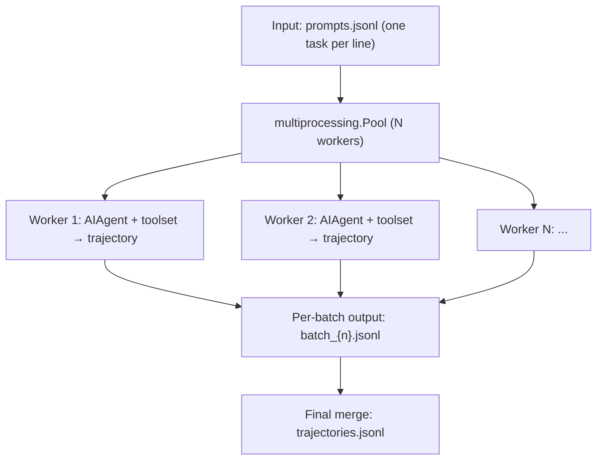
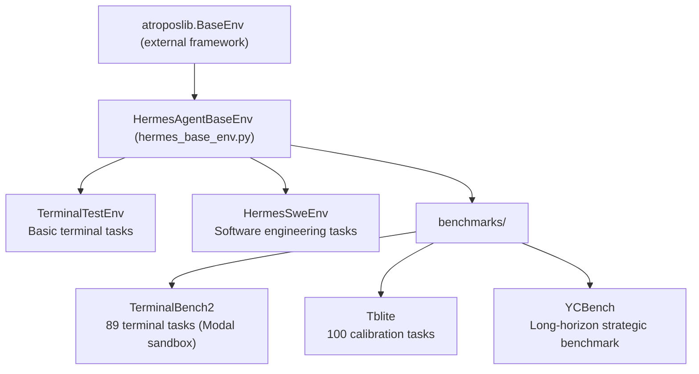

# 11 - Batch Runs & RL: From Agent to Training Data

> **Scope**: Research infrastructure — `batch_runner.py` (1,287-line bulk trajectory generator), `trajectory_compressor.py` (1,508-line trajectory compressor), `rl_cli.py` (446-line RL entry point), `environments/` (30 files, 7,306 lines of Atropos RL environments), `tinker-atropos/` (submodule).

## The Agent as a Data Factory

Nous Research built Hermes Agent not merely to sell an AI assistant — they also use it to generate training data for the next generation of tool-calling models. This is what the "research-ready" positioning means: conversations produced during everyday use of the Agent can, after compression and formatting, feed directly into supervised fine-tuning (SFT) or reinforcement learning (GRPO/PPO) pipelines.

This is not a bolted-on feature. From the `save_trajectories` parameter ([02 - Agent Core](02-agent-core.md)) to `toolset_distributions` ([03 - Tool System](03-tool-system.md)), research requirements were woven into Hermes's design from the start. This chapter focuses on three core components: the bulk trajectory generator, the trajectory compressor, and the RL training environments.

## BatchRunner: The Large-Scale Trajectory Factory

`batch_runner.py` (`BatchRunner` class, line 515) bulk-generates conversation trajectories from a JSONL dataset. Each line contains a `prompt` (task description), an optional `image` (container image override), and an optional `cwd` (working directory).

**Figure: BatchRunner multi-process parallel trajectory generation — JSONL input is processed in batches by multiple workers and merged into a training dataset**

Several design highlights:

**Toolset randomization.** Via the 17 probability distributions in `toolset_distributions.py` (introduced in [03 - Tool System](03-tool-system.md)), a different toolset is randomly activated for each run — simulating the diversity of real users working with different tool combinations, broadening the coverage of the training data.

**Checkpoint resume** (`batch_runner.py:796-839`). When `--resume` is set, completed batch files are scanned and already-processed prompts are skipped using content matching (not index matching) — this is more robust than line-number-based resumption because it tolerates rows being inserted into the middle of the dataset.

**Reasoning filter.** Zero-reasoning trajectories (conversations where the model did not use `<REASONING_SCRATCHPAD>` or native reasoning capabilities) are automatically discarded (`batch_runner.py:444-448`) — for training tool-calling models, trajectories without a reasoning trace have limited value.

**Tool statistics.** Every trajectory automatically extracts count/success/failure statistics for each tool call, and zero-values are filled in for all possible tool names (`batch_runner.py:114-194`), ensuring a consistent Parquet schema — this prepares the data for DataFrame processing in downstream training pipelines.

## Trajectory Compressor: Making Data More Compact

Both context windows and training budgets are finite — a 50K-token trajectory that needs to fit into a 15K-token training window requires compression. This is exactly what `trajectory_compressor.py` does.

The compression strategy (`trajectory_compressor.py:709`, `compress_trajectory()`) follows a clear principle — **preserve the head, preserve the tail, compress the middle**:

1. Protect the head: leave the first system/human/gpt/tool message untouched
2. Protect the tail: leave the last N turns (default 4) untouched
3. Middle section: generate a compressed summary using a summarization model (default `gemini-3-flash-preview`)
4. Replace the compressed span with a single `[CONTEXT SUMMARY]:` message

Why protect the head and tail? The head contains the task definition and initial context — the model needs to know "what to do." The tail contains the final result and success/failure signal — this is the core training signal. The middle is the "how it got there" process; summarizing it results in acceptable information loss.

Compression is asynchronous and parallel (`trajectory_compressor.py:829`), using `asyncio.Semaphore(50)` to cap concurrent API calls, with a 300-second timeout guard. Configuration is provided via the `CompressionConfig` class (line 83), which specifies the target token count (default 15,250) and the summary token budget (default 750).

## RL Training Environments

The `environments/` directory implements Atropos RL framework adapters, enabling Hermes's agent capabilities to be trained and evaluated under reinforcement learning.

**Figure: Hermes RL training environment inheritance hierarchy — HermesAgentBaseEnv derives into three categories: terminal, software engineering, and benchmark environments**

Training proceeds in two phases:

- **Phase 1** (evaluation / SFT): tool calls are parsed server-side, suitable for generating supervised training data
- **Phase 2** (GRPO/PPO): tool calls are parsed client-side, obtaining real token IDs and logprobs — these are required for gradient updates

Tool-call format varies by model — Hermes format, Mistral format, Llama3 JSON, Qwen, DeepSeek, and others each have their own conventions. The `tool_call_parsers/` directory reimplements parsers for 11 formats, ensuring correct tool-call extraction regardless of which model is being trained.

`rl_cli.py` is the command-line entry point for RL training and integrates with the `tinker-atropos/` submodule. Its agent configuration uses a higher iteration ceiling than everyday use — `RL_MAX_ITERATIONS = 200` (the everyday default is 90) — and the system prompt includes the full RL workflow guide (discover → inspect → create → configure → test → train → evaluate).

## Data Generation Configuration

The `datagen-config-examples/` directory provides several representative configuration templates:

- `trajectory_compression.yaml` — trajectory compression config, targeting 29K tokens
- `web_research.yaml` — bulk generation of web research tasks, 4 workers
- `example_browser_tasks.jsonl` — sample browser task dataset

These configurations illustrate how Hermes operates as a training-data factory — not manual annotation, but letting the Agent execute tasks, automatically recording trajectories, then compressing and feeding them into the training pipeline.

## What's Next

The final chapter, **12 - Engineering Practices**, examines Hermes's engineering quality at the code level — testing strategy, the logging system, data persistence, and coding conventions.

---

*This article is based on analysis of the hermes-agent v0.11.0 source code. All code references have been independently verified.*
