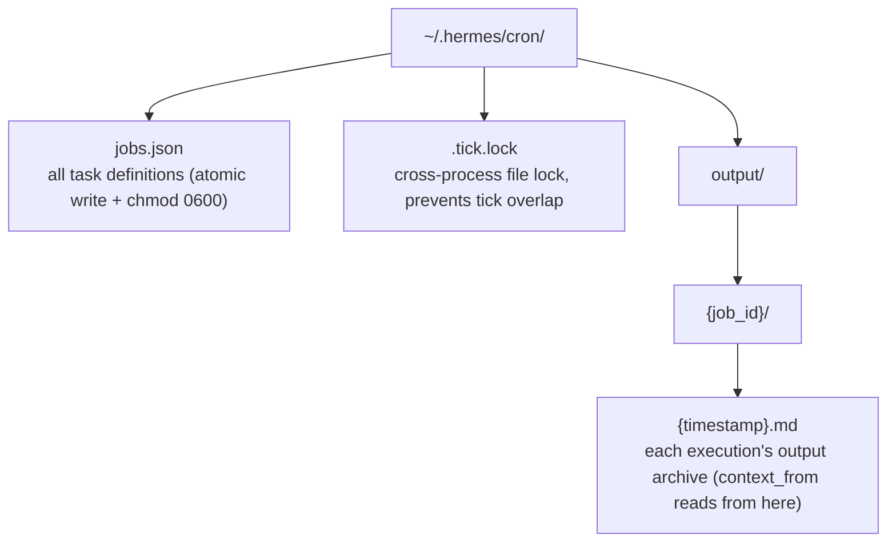
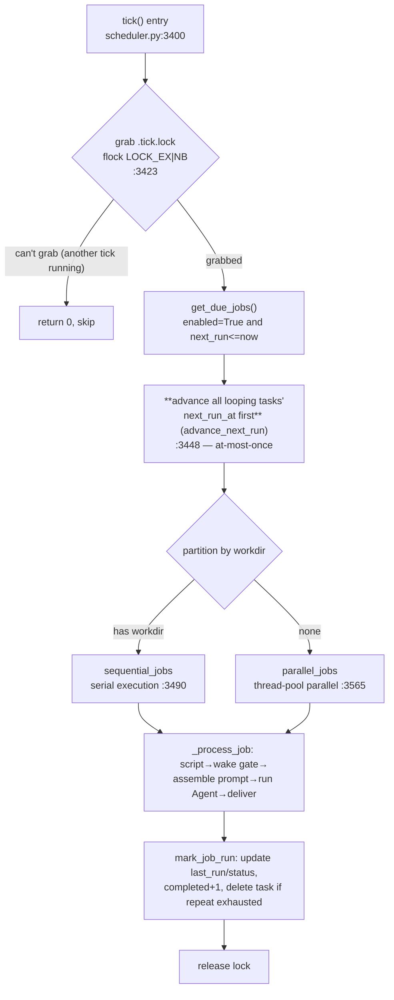
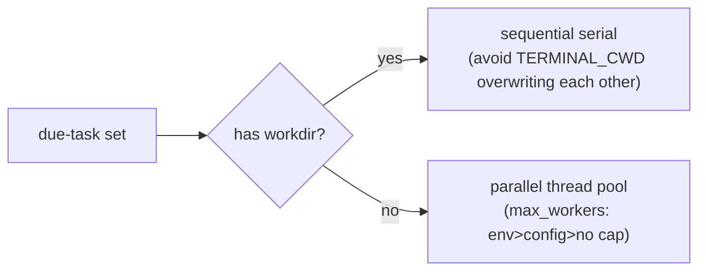

# 11 - Let the Agent Work Even When You're Not Talking

[中文](../zh/11-Cron调度.md) | English

> **Scope**: the Cron scheduling subsystem — `cron/jobs.py` (2,033 lines, the Job model and schedule parsing), `cron/scheduler.py` (3,638 lines, the tick execution engine), `tools/cronjob_tools.py` (1,137 lines, the Agent-side `cronjob` tool and injection scanning), `hermes_cli/cron.py` (456 lines) + `cron/scheduler_provider.py`/`blueprint_catalog.py`/`suggestions.py`/`lifecycle_guard.py` (the new members in v0.17-v0.18).
> **Key functions**: `tick()` (`cron/scheduler.py:3400`, the execution engine), `parse_schedule()` (`cron/jobs.py:362`), `compute_next_run()` (`cron/jobs.py:565`), `_compute_grace_seconds()` (`cron/jobs.py:533`), the gateway-side 60-second drive (near `gateway/run.py:19989`, the former `_start_cron_ticker` now a compatibility shim).

> **This chapter is based on hermes-agent v0.18.2 (tag [`v2026.7.7.2`](https://github.com/NousResearch/hermes-agent/releases/tag/v2026.7.7.2), commit `9de9c25f6`, 2026-07-07)**

---

## An Agent Shouldn't Only Work When You Talk

So far, every chapter has been about "the user talks → the Agent responds." But many tasks don't need a human to trigger them at all: summarizing Hacker News's AI news to Telegram at nine every morning, checking whether there's enough memory every five minutes, generating a weekly PR-health report. What these tasks have in common is — **they should wake up on their own while no one is watching, finish on their own, and deliver the result where it needs to go**.

The traditional approach is to write a shell script and drop it into the system crontab, but the system cron doesn't understand natural language (the task is "summarize the news," not `curl | jq`), can't provide a complete Agent environment (tools, skills, memory, model fallback), and can't deliver a message to Telegram (let alone end-to-end encryption) — so Hermes had to implement its own.

So Hermes implemented a **pure application-layer cron** (the `cron/` directory), not depending on the system crontab and not needing root. But it's far more than just "run a prompt on a timer" — this chapter will show how it uses "advance-then-execute" to guarantee no repeat runs after a crash, how it uses a grace window to avoid a task avalanche after a downtime restart, how it lets a script decide "should I wake the LLM this time" at `$0` cost, how it chains multiple tasks into a pipeline, and why tasks with a working directory must execute serially.

By the end you should be able to: schedule tasks in natural language or a cron expression, attach skills to a task, turn a monitoring script into a watchdog that "only talks when something's wrong," chain tasks into a multi-stage pipeline, and know where to look when a task doesn't run on time.

> **Scope note**: Chapter 05 covers how the gateway sends and receives messages — cron's tick is driven precisely by the gateway's background thread, but this chapter focuses on the scheduling logic itself. Chapter 09's Kanban has a `scheduled` state that integrates with cron; that's the timed triggering of Kanban cards. This chapter covers the general cron task system. v1 once combined cron with ACP/MCP serve in one chapter; v2 has moved the latter two into Chapter 06 (the protocol-adaptation layer), so this chapter can focus on covering cron thoroughly.

---

## Usage Guide

### Basic Usage: Three Ways to Create

A cron task can be created from three entry points, corresponding to three usage habits:

```bash
# 1. in chat via /cron (the handiest)
/cron add 30m "remind me to check the build result"
/cron add "every 2h" "check server status"
/cron add "0 9 * * *" "summarize new subscription content" --skill blogwatcher

# 2. standalone CLI (scripting / no chat environment)
hermes cron create "every 2h" "check server status"
hermes cron create "0 9 * * *" "summarize today's AI news and send to Telegram" \
  --skill blogwatcher --name "morning briefing"

# 3. just say it in natural language (the Agent recognizes intent and calls the cronjob tool itself)
#   "check Hacker News AI news at nine every morning, summarize and send to my Telegram"
```

All three entry points ultimately land on the same tool `cronjob` (`tools/cronjob_tools.py`) and the same storage `~/.hermes/cron/jobs.json`.

**The schedule expression has four formats** (`cron/jobs.py:362 parse_schedule`):

| Input | Type | Meaning |
|-------|------|---------|
| `"30m"` / `"2h"` / `"1d"` | once | a relative delay, run once after X time |
| `"every 30m"` / `"every 2h"` | interval | loop every X time |
| `"0 9 * * *"` | cron | a standard 5-field cron expression (depends on the `croniter` library) |
| `"2026-03-15T09:00:00"` | once | an ISO timestamp, run once at the specified moment |

### Configuration

The cron-related global config is under the `cron:` section of `config.yaml`; the three most commonly used:

```yaml
# ~/.hermes/config.yaml
cron:
  wrap_response: true            # whether to add a "this is scheduled-task output" header/footer wrapper on delivery (default true)
  script_timeout_seconds: 3600   # pre-run script timeout (default 3600s = 1 hour)
```

```yaml
# which toolsets tasks use by default — select in the "cron" platform config in the hermes tools curses UI
# can also be precisely controlled per-task with enabled_toolsets (see below)
```

> **Cost-saving point**: a cron task is a fresh session each time, and the tool schema is sent with every LLM call. Giving a small task like "grab the news" the full `moa`/`browser`/`delegation` toolsets means paying tokens for unused tools every time. Use `enabled_toolsets=["web", "file"]` to restrict the task to the toolsets it really needs (the job field in `cron/jobs.py`, the official doc `cron.md`).

### Common Scenarios

**Scenario 1: A watchdog — only talks when something's wrong**. Use no-agent script mode + `[SILENT]` semantics for zero-LLM-cost monitoring.

```bash
hermes cron create "every 5m" --no-agent \
  --script memory-watchdog.sh --deliver telegram --name "memory alert"
```

Expected: the script runs every 5 minutes, its stdout delivered directly as a message; **empty stdout → silent this time, no delivery** (that's watchdog mode — say nothing when all is well); a non-zero exit or timeout → deliver an error alert (a broken watchdog can't stay silent). The whole process doesn't touch the reasoning layer and costs no tokens (the official doc `cron-script-only`).

**Scenario 2: A multi-stage pipeline — one task's output feeds the next**. Use `context_from` to chain tasks.

```python
# Task 1: grab the news at 7am and save to a file
cronjob(action="create", schedule="0 7 * * *", name="grab news",
        prompt="grab the top 10 AI news items from Hacker News, save to ~/.hermes/data/raw.md")
# Task 2: at 7:30am, receive Task 1's output and filter
cronjob(action="create", schedule="30 7 * * *", name="filter news",
        context_from="<Task 1's ID>",
        prompt="read the news above, score by value, pick the top 5")
```

(Task 1's ID can be looked up with `hermes cron list`, or grabbed from the return after creation; in chat, just say "connect the grab-news task I just made to the filter-news task" and the Agent will resolve the ID itself.)

Expected: when Task 2 fires, Hermes automatically prepends Task 1's most recent output (read from `~/.hermes/cron/output/<Task 1 ID>/*.md`) to Task 2's prompt. Task 2 doesn't need to hardcode "go read that file"; it receives the content directly. The chain can be arbitrarily long.

**Scenario 3: High-frequency polling that only wakes the LLM when the data changed**. Use the pre-check script's wake gate.

```python
# ~/.hermes/scripts/check.py — the last line outputs JSON deciding whether to wake
import json, sys
if fetch_latest() == read_last_state():
    print(json.dumps({"wakeAgent": False}))   # no change → skip this agent run
else:
    print(json.dumps({"wakeAgent": True}))
```

Expected: when the script's last line is `{"wakeAgent": false}`, cron skips the whole agent run (the wake gate in `cron/scheduler.py`). Good for "poll every 1-5 minutes, but only spend money waking the LLM when the state actually changed."

### Troubleshooting

| Symptom | Cause | Fix |
|---------|-------|-----|
| Task doesn't run on time | The gateway isn't running (cron is driven by the gateway's background thread) | `hermes cron status` to check gateway status; use `hermes gateway install` to install it as a service |
| Missed tasks aren't backfilled after a downtime restart | Beyond the grace window, silently fast-forwarded | This is by design (see the grace window below); to run immediately use `hermes cron run <id>` |
| Task ran but no message received | The reply contains `[SILENT]` (substring match, case-insensitive), delivery suppressed | Check whether the prompt tells the model to reply `[SILENT]` when "nothing's wrong"; failed tasks always deliver, unaffected by this |
| Creating a task reports "injection blocked" | The prompt hit the injection/exfiltration scan | Check for invisible Unicode, `curl` with a secret, `authorized_keys` and other patterns (`cronjob_tools.py`) |
| Task says "can't find the file / doesn't know the context" | Cron is a fresh session, with no history memory | The prompt must be self-contained — write the SSH address, commands, criteria all into it |
| `croniter` errors | Used a cron expression but croniter isn't installed | `pip install croniter` (now a core dependency, the error branch at `jobs.py:401-404`) |
| Two tasks with a workdir interfere with each other | Parallel workdir tasks pollute each other's cwd | This is why workdir tasks are forced serial (see below) |
| Task has `enabled=true` but never runs | A looping task can't compute next_run (most likely the gateway doesn't have croniter), set to `state=error` | `hermes cron list --all` to see that task's `last_status`/`last_error` (there's no `cron get` subcommand); install `croniter` |
| Task started but no result for a long time | An API call is stuck / a tool is hanging, triggering the liveness timeout | Check the log `Job '...' idle for Xs` (default 600s of no activity); `HERMES_CRON_TIMEOUT` is tunable |
| `last_status=ok` but no message received | Execution succeeded, delivery failed (two separate fields) | `hermes cron list --all` to see that task's `last_delivery_error` (there's no `cron get` subcommand) |

> 📖 **Further Reading (Official Docs):**
> - [Scheduled Tasks (Cron)](https://hermes-agent.nousresearch.com/docs/user-guide/features/cron)
> - [Automate with Cron (practical guide)](https://hermes-agent.nousresearch.com/docs/guides/automate-with-cron)
> - [Script-Only Cron Jobs (watchdog mode)](https://hermes-agent.nousresearch.com/docs/guides/cron-script-only)
> - [Cron Internals (developer view)](https://hermes-agent.nousresearch.com/docs/developer-guide/cron-internals)

---

## Architecture & Implementation

### Data-Driven: jobs.json Is the Only Source of Truth

The whole cron system is **file-driven** — no database, no resident process holding state, all task definitions in one JSON file `~/.hermes/cron/jobs.json`. This is a deliberate choice: the task definitions need to be readable and writable by three different processes — the CLI, the Agent tool, the gateway — and using one file as the source of truth is much lighter than a database, and also convenient for users to view/back up directly.

Each job is a dict (`cron/jobs.py`), with core fields:

```python
{
  "id": "a1b2c3d4e5f6",          # the first 12 chars of uuid4().hex
  "prompt": "...",               # a natural-language instruction (can be empty when no_agent)
  "schedule": {"kind": "cron", "expr": "0 9 * * *", ...},
  "skills": ["blogwatcher"],     # skills injected before running (in order)
  "deliver": "telegram:123",     # the delivery target
  "repeat": {"times": null, "completed": 42},  # null = forever; records the completed count
  "enabled": true,               # set false along with state when paused (two separate gates)
  "state": "scheduled",          # scheduled/paused/completed/error
  "next_run_at": "...",          # the next run moment (the anchor for crash recovery)
  "last_run_at": "...", "last_status": "ok",
  "last_error": null,
  "last_delivery_error": null,   # delivery failure recorded separately (independent of last_status)
  "context_from": ["job_id"],    # links a predecessor task's output
  "no_agent": false,             # true = pure script, doesn't touch the LLM
  "workdir": null, "enabled_toolsets": null,  # isolation / cost control (note: the profile field was removed in v0.17-v0.18)
  "model": null, "provider": null,  # left empty, resolved from global config at runtime
}
```

`state` has four values, and the handling of `error` and "completed" hides two counterintuitive points. First, when a looping task (cron/interval) can't compute `next_run_at` (typically the gateway's Python environment doesn't have `croniter`), `mark_job_run` (from `jobs.py:1331`; the error-keeps-enabled branch at `:1396`) **deliberately sets `state` to `error` while keeping `enabled=true`** rather than setting `completed` — because silently turning "missing dependency" into "task completed" would make the user's scheduled task stop without a sound (#16265). Second, when a looping task's `repeat.times` count is exhausted, the task is **deleted outright** (the `jobs.pop(i)` in `mark_job_run`, `jobs.py:1384`; the other pop at `:1461` only handles the dispatch-claim of `kind=="once"` one-off tasks, not this looping-task path), not left as a `completed` record.

There's also a high-frequency troubleshooting trap — `last_status` and `last_delivery_error` are two separate fields: a task can be `last_status=ok` but have a non-empty `last_delivery_error` (execution succeeded, delivery failed). Looking only at `last_status` would make you think everything's fine, when the message actually didn't get out.

The file uses **atomic writes** (`cron/jobs.py:754 save_jobs`): write a temp file first, `fsync`, then `atomic_replace` rename, finally `chmod 0600`. This way even if the process is killed mid-write, no half-corrupt JSON is left behind — it's either the old complete file or the new complete file. An in-process lock together with a **cross-process flock** (`jobs.py:153-194`, hardened in v0.18) protect the "load → modify → save" read-modify-write cycle.

Storage and concurrency safety are solved, but how exactly is each job's `next_run_at` computed? That's for the schedule-parsing layer.

**Figure: The cron data-directory structure — jobs.json holds definitions, .tick.lock prevents concurrency, output/ archives each execution by job**



### Schedule Parsing: How Four Formats Compute "When Does It Run Next"

`parse_schedule()` (`cron/jobs.py:362`) parses the user-input string into a dict with a `kind`; `compute_next_run()` (`jobs.py:565`) then computes `next_run_at` from it:

- **once** (`30m` or an ISO timestamp): computes an absolute moment, done once it's run.
- **interval** (`every 2h`): `last_run_at + interval`; when there's no `last_run_at`, uses `now + interval`.
- **cron** (`0 9 * * *`): uses the `croniter` library to compute the next matching moment.

The cron mode has a key detail: when computing the next time, it **prefers `last_run_at` rather than `now` as croniter's base** (`jobs.py:601-606`). Why? Because this way, during crash recovery, time is anchored to "the moment it last actually ran" rather than "the restart moment," so the period doesn't drift because of the restart.

### The tick Execution Engine: Four Mechanisms Guaranteeing "No Over-Run, No Missed Run, No Empty Run"

Cron's heart is `tick()` (`cron/scheduler.py:3400`). Hermes's message gateway (the gateway, Chapter 05) starts a background ticker thread (near gateway/run.py:19989; the former `_start_cron_ticker` has degenerated into a compatibility shim) that calls `tick()` once **every 60 seconds**. Since v0.18 the heartbeat source is no longer unique: the desktop/Web backend (web_server.py, Chapter 10) carries an embedded ticker, and an external scheduler Provider (see "Scheduler Provider" below) can also be a trigger source — but the premise "if no ticker is running, nobody triggers" is unchanged. The complete flow of one tick:

**Figure: The complete flow of one tick — lock, advance early, partition-execute, deliver, update state**



Four mechanisms worth a close look, each guaranteeing correctness from a different angle:

**① At-most-once**. **Before** executing any task, tick first advances all looping tasks' `next_run_at` to the next period (`scheduler.py:3448` calls `advance_next_run`). The order is "advance first, then execute" rather than "execute first, then advance." Why? Because if the gateway crashes and restarts while a task is halfway executed, `next_run_at` is already a future value, and the next tick won't re-execute the same task. The cost is that the crashed run **isn't retried automatically** (a looping task waits for the next period, a one-off task keeps its original value to allow a retry) — this is the "rather miss a run than run twice" tradeoff; for side-effecting tasks like "send a message" or "modify data," repeated execution is far more dangerous than a missed run.

**② Grace window**. If the gateway is down for 6 hours and restarts, it'll find a pile of tasks whose `next_run_at` is all in the past. Should it backfill all the runs missed in those 6 hours? No — that would cause an avalanche (imagine an every-5-minute task with 72 runs backed up). The grace window computes a tolerance window for each task (`_compute_grace_seconds`, `jobs.py:533`):

```
grace = max(120s, min(period/2, 7200s))
```

That is, a floor of 2 minutes, a ceiling of 2 hours, typically half the period. Tasks whose miss time exceeds this window are **silently fast-forwarded** to the next future period, not backfilled (the fast-forward logic in `jobs.py`'s `get_due_jobs`). Example: a daily task's period is 86400s, half the period far exceeds the 2-hour ceiling, so the tolerance window is 2 hours — restarting more than 2 hours after downtime, today's run is skipped, waiting for tomorrow.

**③ Wake gate**. A task can attach a pre-check script (the `script` field). The script runs before the agent, and if its last line outputs `{"wakeAgent": false}`, cron skips the whole agent run (`_parse_wake_gate` in `cron/scheduler.py` (`scheduler.py:2041`)). This is a `$0`-cost "spend money or not" switch — a high-frequency polling task (every 1-5 minutes) only wakes the LLM when the state actually changed, otherwise not even touching the model. A script that wants to hand data to the agent needn't use a special field: its **entire stdout is injected into the prompt** (wrapped in a code block, `scheduler.py:2101/2112`), just print it directly. Note that `_parse_wake_gate` (`scheduler.py:2041`) only parses the single key `wakeAgent` and returns a boolean; other keys in the JSON (like `context`) aren't specially handled — data is passed via the entire stdout, not via some agreed field.

**④ `[SILENT]` suppresses delivery**. When the agent's final reply is judged a "silence signal" (`_is_cron_silence_response()`, `scheduler.py:257`, called at `:3349`; the marker `SILENT_MARKER` defined at `:245`), the output is still saved to the local `output/` but **not delivered** to chat. The judgment rule is a precise line-level match rather than a substring match: only when the whole reply is exactly the marker, the marker occupies the first or last line alone (like `2 deals filtered\n\n[SILENT]`), or a bracketed `[SILENT]` is a same-line prefix (the documented form `[SILENT] No changes detected`) does it count as silence; case-insensitive, and tolerating the model's dropped-bracket `SILENT`/`NO_REPLY` variants — but **a marker buried mid-sentence is delivered as real content as usual**. This rule set was rewritten on 2026-06-25 (`f284d85ef`): the old implementation was a `SILENT_MARKER in ...upper()` substring match, which both missed the bracket-less variants and mis-swallowed "a real report that just quoted `[SILENT]` in its body" (#51438, #46917). This lets a monitoring task "shut up when healthy, shout when something's wrong." Note: **a failed task always delivers**, unaffected by `[SILENT]` — otherwise a broken monitor would go silent.

①② are "time correctness" (no over-run, no batch backfill at the wrong time), ③④ are "cost/noise correctness" (no empty run, no spamming).

The four mechanisms guarantee what each tick runs and when — the next question is: can multiple tasks that fall due at the same time run together?

### Concurrency: Why Some Tasks Can Parallelize and Others Must Serialize

One tick may have multiple tasks fall due at the same time. Can they all run in parallel? Most can — tick executes in parallel with a thread pool (`scheduler.py:3565`, `max_workers` taken as "env var > config > no cap"). But **tasks with a `workdir`** are forced out to execute **serially** (the partition criterion at `scheduler.py:3490` looks only at the single field `workdir`): `workdir` takes effect via the process-level `TERMINAL_CWD` environment variable, and two workdir tasks in parallel would overwrite each other's working directory. There's also a `_terminal_cwd_lock` read-write lock specifically preventing "a parallel task with no workdir" from reading the `TERMINAL_CWD` a "task with a workdir" temporarily set.

So the criterion is clear: **a task that changed the process-level cwd must serialize, the rest parallelize**. This also explains a usage-level phenomenon — after setting a task's `workdir`, it's no longer in the parallel pool. (Note: an early version had `profile` as one of the serialization criteria too, but since v0.17-v0.18 `profile` is no longer a per-job field; profile isolation is now carried by per-profile `HERMES_HOME` and each one's own `jobs.json`, see the "Expansion" section below.)

**Figure: tick's concurrency partition — tasks with process-level global state (cwd/HERMES_HOME) serialize, the rest parallelize**



But "serializing process-level state" only solves `os.environ` global state like cwd/HERMES_HOME. There's another kind of state — the **delivery target** — that's also different per task and likewise can't overwrite each other in parallel. Here another layer of mechanism is used: a **ContextVar** (the Python standard library's coroutine/thread-local variable, similar to `threading.local` but coroutine-safe, from `scheduler.py:2597`). Each task's session/delivery state goes through a ContextVar rather than `os.environ`, and in parallel execution each task runs in its own `contextvars.copy_context()` copy, without cross-contaminating.

A related, easily-overlooked design: cron execution **deliberately clears `HERMES_SESSION_*`** (platform/chat_id set empty, `scheduler.py:2603-2611`), switching to `HERMES_CRON_AUTO_DELIVER_*` to carry the delivery target. Why? Because cron isn't "a message from a real user in some chat," but several tools read `HERMES_SESSION_PLATFORM` for runtime decisions — terminal_tool's background-process notification routing, tts_tool choosing Opus or MP3, skills_tool's per-platform disable list, send_message_tool's mirror tag — and if not cleared, they'd mistake it for a user driving the agent from the origin chat, and their behavior would all be wrong. Delivery itself reads directly from `job["origin"]`, not depending on these session variables, so clearing doesn't affect delivery.

So concurrency safety has three layers: **① serial isolation of process-level global state (cwd/HERMES_HOME) ② ContextVar isolation of per-task delivery/session state ③ the cross-process `.tick.lock` file lock** (`scheduler.py:3423`, Unix `fcntl.flock`, Windows `msvcrt.locking`) — the third layer prevents the gateway's built-in ticker and a user's manual `hermes cron tick` running at the same time from double-executing the same batch of tasks, and a tick that can't grab the lock just returns 0. (To go fully back to the old serial behavior, set `HERMES_CRON_MAX_PARALLEL=1`.)

### How a Single Task Runs: From Script to Delivery

`_process_job` → `run_job` is the main execution line of a single task, with several key stages:

0. **Hot reload + config read**: before each run, first `reset_secret_source_cache()` then `load_hermes_dotenv(~/.hermes/.env)` (note it's **not** a bare `load_dotenv`, `scheduler.py:2680`) — this way changing a provider key takes effect on new tasks without restarting the gateway. Resetting the secret-source cache first is required: otherwise a secret hosted in Bitwarden/BSM wouldn't be re-resolved and would just use the placeholder in .env, causing the cron task to request with the stale placeholder and 401 (#33465). Agent parameters like `max_turns` (default 90), `reasoning_effort`, etc. are also read from `config.yaml` each time rather than stored in the job.
1. **Pre-run script** (if there's a `script`): run the script first, parse the wake gate. The script timeout defaults to **3600s (1 hour)** (`_DEFAULT_SCRIPT_TIMEOUT`, `scheduler.py:1879`), tunable via `cron.script_timeout_seconds` or `HERMES_CRON_SCRIPT_TIMEOUT` (resolution priority: test module-level override → env → config → default 3600s).
2. **Assemble the prompt**: inject skill content (in `skills` order), splice the predecessor-task output referenced by `context_from`, append the script output. With a `workdir`, it also injects that directory's `AGENTS.md`/`CLAUDE.md`/`.cursorrules` (from `scheduler.py:2632`) — `workdir` isn't just setting cwd, it gives the task project-level context.
3. **Runtime injection scan** (`scheduler.py:2085/2187`): scans the **fully-assembled prompt** (user prompt + skill content) for injection once more — this plugs a hole v1 didn't (#3968): a malicious skill might inject a payload only at runtime, which scanning the prompt only at creation time wouldn't catch.
4. **Run the Agent in a fresh session, with a liveness timeout**: each task is a clean `AIAgent` session with no history memory, and the three toolsets `cronjob`, `messaging`, `clarify` are disabled (the toolset-disable section in `scheduler.py`) — disabling `cronjob` is a recursion guard (preventing a task from creating tasks and causing a scheduling explosion), disabling `messaging`/`clarify` is because cron has no interactive counterpart to send messages to or ask questions. The task inherits the user-configured fallback providers and credential pool, so a high-frequency task hitting a rate limit can fall back / rotate keys. The run is wrapped in a **liveness-based timeout** (the liveness-monitoring section, polling `agent.get_activity_summary()`, from `scheduler.py:3025`): the task can run for hours — as long as it keeps calling tools / receiving tokens; but if an API call is stuck or some tool hangs, **600 seconds of no activity by default** judges it timed out and `interrupt`s (`HERMES_CRON_TIMEOUT` tunable, `0` = infinite). Note it's "duration of no activity" rather than "total run duration" — it polls `agent.get_activity_summary()` rather than timing the total, so a long task isn't killed by mistake, but a truly-stuck task can't escape either.
5. **Delivery**: deliver the result per the `deliver` field (see the next section "Delivery: live adapter first, HTTP fallback").
6. **Cleanup (finally)**: restore `TERMINAL_CWD`, clear the ContextVar, close session_db, `agent.close()` + `cleanup_stale_async_clients()`. This last step is required — the gateway ticks every minute, and if not released, file descriptors would leak all the way to EMFILE (#10200).

A `no_agent=True` task skips steps 2-4, delivering the script's stdout directly as a message.

Each task also creates a `SessionDB` session record, so content produced by cron can be found via `session_search` — **by default** these messages aren't mirrored into the gateway's session history, to avoid polluting the target chat's message sequence; but there's a switch — after the global `cron.mirror_delivery` (`config.yaml`) or the per-job `attach_to_session` field is turned on, cron output is mirrored back into the source session in a way that doesn't break the conversation alternation.

### Delivery: Live Adapter First, HTTP Fallback

The result is delivered to the target specified by `deliver`, supporting a single one, multiple (comma-separated), and the routing token `all` (expanded at fire time to all platforms with a home channel configured). Delivery takes two paths (`_deliver_result` in `cron/scheduler.py`):

- **Prefer the gateway's running live adapter**: for platforms needing end-to-end encryption (like Matrix) this is required — only an established encrypted session can send a message.
- **When the gateway isn't running, fall back to a standalone HTTP client**: sending in a separate event loop via `asyncio.run()`. If the current thread already has a running event loop causing `asyncio.run()` to throw a `RuntimeError`, take one more step back — throw it into a new `ThreadPoolExecutor` thread to run (a 30s timeout backstop), avoiding "already has an event loop" making delivery fail outright.

The delivery-target syntax (the official doc `cron.md`): `origin` (back to where it was created), `local` (save file only), `telegram:123` (a specific chat), `telegram:-100:17585` (a specific topic thread), `discord:#eng` (a channel name), `all` (all), `origin,all` (back to source + all, deduplicated by `(platform, chat, thread)`).

By default delivery wraps a header/footer ("this is scheduled-task output, the agent can't see this message"), which can be turned off with `cron.wrap_response: false`.

### Security: Two Injection Scans + a Script-Path Sandbox

A cron task's prompt is auto-executed, and often carries credentials to access the outside — this is the attack surface. Hermes sets two injection scans (`_scan_cron_prompt` in `tools/cronjob_tools.py`):

- **Scan the prompt on create/update**: detects invisible Unicode (zero-width space, bidi override, etc.), prompt injection ("ignore previous instructions"), data exfiltration (a secret variable embedded in a `curl` URL/header/body), an SSH backdoor (`authorized_keys`), `/etc/sudoers`, `rm -rf /`, etc.
- **Scan the fully-assembled prompt at runtime** (`scheduler.py:2085`): see #3968 above, plugging malicious-skill runtime injection.

The script path is restricted to within `~/.hermes/scripts/` (`_validate_cron_script_path` in `cronjob_tools.py`): rejecting absolute paths, `~` expansion, and escaping the directory via `../` traversal.

### The v0.17-v0.18 Expansion: From a Built-in Scheduler to a Scheduling Platform

The cron subsystem nearly doubled between v0.17-v0.18 (3,217 → 7,402 lines), with the core increment in six directions:

**① The scheduler Provider interface** (`cron/scheduler_provider.py`, 194 lines). "When to trigger" is decoupled from the built-in ticker into a pluggable interface — `run_one_job()` (`scheduler.py:3253`) was extracted as a shared execution body, and both the built-in ticker and an external Provider (`plugins/cron_providers/chronos`, Chapter 08) call it. External scheduling means it can trigger on time without running a resident gateway.

**② Automation blueprints** (`cron/blueprint_catalog.py`, 713 lines). A catalog of parameterized task templates (CATALOG as the single source of truth), the same blueprint rendered to multiple surfaces: the Dashboard form, CLI, Agent tool, deep-link. Plus a **consent-first suggestion system** (`cron/suggestions.py`, 260 lines + `suggestion_catalog.py`) — Hermes can proactively suggest "how about a daily-digest task," but creation always waits for the user's nod.

**③ Job snapshots against drift** (from `jobs.py:864`, #44585). At task creation it locks the resolved `provider_snapshot`/`model_snapshot` — later when you switch the global default model, an existing scheduled task's behavior won't drift along with it.

**④ Concurrency safety expanded from three layers to five**. Beyond the existing serial isolation / ContextVar / tick file lock: jobs.json's read-modify-write now has a **cross-process flock** (`jobs.py:153-194` — multiple processes modifying the task list at the same time no longer overwrite each other); one-off tasks gained a **run claim** (the interception check at `jobs.py:1613-1629`, the stamp at `:1786-1800`, the TTL computation at `:108`, #59229) — a mid-run duplicate trigger is blocked by the claim.

**⑤ ticker heartbeat self-check** (`TICKER_HEARTBEAT_FILE`, `jobs.py:72/651/675`, #32612). The ticker writes a heartbeat file each round, and a diagnostic tool uses it to distinguish "the gateway is alive but the ticker thread died" — this kind of half-dead state used to be inferable only from "tasks inexplicably not running."

**⑥ A gateway lifecycle guard** (`cron/lifecycle_guard.py`, 141 lines, #30719). Intercepts a cron task executing something like `hermes gateway restart` inside its own body — the deadloop of task restarts gateway → gateway restart kills the task → next tick runs again and restarts again, now has a gate.

**The job fields were also swapped around**: removed `profile` (profile isolation is now carried by per-profile HERMES_HOME dynamic resolution, #4707); added `attach_to_session` (paired with **mirror delivery** — cron output mirrored back into the source session in a way that doesn't break conversation alternation), `paused_at/paused_reason` (pausable), `schedule_display`, `fire_claim/run_claim`, the two snapshot fields.

### Code Organization

```
cron/
├── jobs.py          — Job model/CRUD/schedule parsing/grace/delivery-target parsing (2,033 lines)
│   ├── parse_schedule()        :362   — four-format parsing
│   ├── compute_next_run()      :565   — compute the next run moment
│   ├── _compute_grace_seconds():533   — the grace-window formula
│   ├── advance_next_run()             — at-most-once early advance
│   └── save_jobs()             :433   — atomic write
├── scheduler.py     — tick engine/single-task execution/injection scan/delivery (3,638 lines)
│   ├── tick()                  :3400  — the execution engine's main loop
│   ├── run_one_job()           :3253  — the single-task execution body (shared with Provider)
│   ├── SILENT_MARKER           :245
│   └── concurrency partition sequential/parallel :3550/:3565
└── __init__.py      — exported interface (42 lines)

tools/cronjob_tools.py  — Agent-side cronjob tool + injection scan (:229) + path sandbox (:528) (1,137 lines)
hermes_cli/cron.py      — hermes cron subcommands (456 lines; the parser was split to subcommands/cron.py)
gateway/run.py:19989    — _start_cron_ticker (now a compatibility shim, actually delegating to InProcessCronScheduler); the real 60s drive thread is named cron-scheduler
```

### Design-Decision Summary

| Decision | Reason | Cost | Alternative |
|----------|--------|------|-------------|
| Pure application-layer cron, not the system crontab | needs a complete Agent environment + natural language + platform delivery | implement scheduling/recovery yourself | system crontab — can't provide the Agent environment |
| jobs.json single-file source of truth | shared by three processes CLI/tool/gateway, lightweight and backuppable | concurrency needs a file lock | database — heavy, hard to view directly |
| Advance next_run before executing (at-most-once) | a crash doesn't re-run side-effecting tasks | the crashed run isn't retried automatically | execute then advance — a crash double-runs |
| Grace-window silent fast-forward | a downtime restart doesn't avalanche-backfill | missed tasks are skipped | backfill all — the backlog explodes |
| workdir tasks serialize | cwd is process-level global state | such tasks have no concurrency | all parallel — pollute each other |
| Scan the assembled prompt again at runtime | plug malicious-skill runtime injection (#3968) | one extra scan of overhead | scan only at creation — skill injection slips through |
| Fresh session + disable the cronjob tool | self-contained, prevents recursive scheduling explosion | the prompt must be self-contained | with history — risk of recursive task creation |
| Liveness timeout (600s of no activity) rather than total-duration timeout | a long task that keeps working isn't killed by mistake, a stuck task can't escape either | needs to poll the activity summary | total-duration timeout — would kill a normal long task by mistake |
| ContextVar isolation + clearing HERMES_SESSION_* | parallel tasks' delivery targets don't cross-contaminate; tools don't mis-judge it as a real user message | one more layer of state management | use os.environ — parallel overwrite each other |
| A looping task that can't compute next_run set to error not completed | a missing dependency doesn't silently stop the user's scheduled task (#16265) | the user needs to check state | set completed — the task disappears silently |

### Extension Points

- **Attach skills**: `skills=[...]`, injects skill content in order before running, reusing a tested workflow.
- **Pre-check script + wake gate**: `script=` + the script outputs `{"wakeAgent": false}`, deciding whether to wake the LLM at $0 cost.
- **Task chain**: `context_from=[job_id, ...]`, injects a predecessor task's output into the current prompt, making a multi-stage pipeline.
- **Per-job isolation**: `workdir` (injects AGENTS.md/CLAUDE.md + sets cwd), `enabled_toolsets` (cost control). Profile isolation no longer goes through a per-job field — each profile has its own `~/.hermes/profiles/<name>/cron/jobs.json`.
- **Delivery plugin platforms**: a platform adapter can self-register a cron delivery target.

---

## Relationship to Other Chapters

- **Chapter 05 (Gateway Layer)**: cron's tick is driven by the gateway's `cron-scheduler` background thread every 60 seconds (`_start_cron_ticker` has now degenerated into a compatibility shim, the actual implementation is `InProcessCronScheduler`); delivery preferentially reuses the gateway's live adapter. With no gateway running, cron tasks don't trigger automatically (CLI mode only ticks when running a `hermes cron` command). Incidentally, the gateway's periodic maintenance (refreshing the channel catalog every 5 minutes, clearing the image/paste cache every hour, triggering the skill Curator every hour) **has been split out of the cron ticker** and runs in another separate thread `gateway-housekeeping` (`_start_gateway_housekeeping`, `gateway/run.py:19900`) — cron scheduling and gateway maintenance are now two threads each minding their own business.
- **Chapter 02 (Agent Core)**: each task runs a fresh `AIAgent.run_conversation()`, inheriting fallback providers and the credential pool (detailed in Chapter 02).
- **Chapter 04 (Skill System)**: a task can attach skills, injecting SKILL.md content before running; when the Curator merges/deprecates skills, it auto-fixes the skill references in cron tasks.
- **Chapter 09 (Kanban)**: Kanban's `scheduled` state integrates with cron, for the timed triggering of cards.
- **Chapter 12 (Batch Running & Trajectory Generation)**: cron is "timed self-driven" single-task scheduling; batch running is "one-off large-scale parallel." Both take the Agent out of interactive running, but the scenarios are orthogonal.

---

*This document is based on source analysis of hermes-agent v0.18.2. All code references have been independently verified.*
