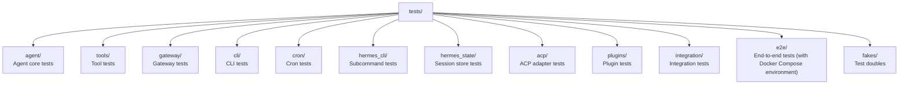

# 12 - Engineering Practices: Maintaining 578,000 Lines of Code

> **Scope**: Cross-module engineering infrastructure — `hermes_state.py` (2,094-line SQLite session store), `hermes_logging.py` (389-line logging system), `utils.py` (271-line atomic write utilities), `tests/` (826 files, 285,239 lines of tests), `CONTRIBUTING.md`, `SECURITY.md`.

## Infrastructure for a Large Project

578,000 lines of Python, 826 test files, 6,384 commits, nine months of development history — maintaining a project at this scale demands solid engineering infrastructure. This chapter isn't about how the Agent works; it's about **how the code itself is organized, tested, documented, and protected**.

## Session Storage: SQLite Used Well

`hermes_state.py` implements `SessionDB` — the underlying storage for all conversation history, token accounting, and session retrieval. The choice of SQLite over PostgreSQL or a plain filesystem reflects Hermes's positioning as a single-user, single-machine deployment: SQLite requires zero configuration, no network, and no process management — it works the moment you `pip install`.

The schema design (`hermes_state.py:38-101`, current `SCHEMA_VERSION = 11`) is worth examining:

The **sessions table** has 25+ fields, including a complete token ledger (input/output/cache_read/cache_write/reasoning tokens), cost estimates, and model information. The **messages table** supports multiple reasoning formats (`reasoning`, `reasoning_content`, `codex_reasoning_items`, and other fields), accommodating the varying output structures of different models.

**Full-text search** uses two FTS5 virtual tables (`hermes_state.py:103-156`): one with a unicode61 tokenizer (suited for Western word segmentation) and one with a trigram tokenizer (`messages_fts_trigram`, supporting CJK substring search). This means users can search Chinese content with `/session_search` — a requirement many projects overlook.

**Write contention** is a classic SQLite problem in multi-threaded scenarios. Hermes's approach (`hermes_state.py:167-201`): WAL mode + 1-second timeout + application-level randomized jitter retry (20–150 ms, up to 15 attempts). Why randomized jitter rather than a fixed interval? For the same reason API retries use jitter — to prevent multiple threads from thundering in synchrony. `BEGIN IMMEDIATE` acquires the write lock at the start of a transaction, avoiding the lock-upgrade conflict that arises when reading stale data before escalating. A PASSIVE WAL checkpoint runs every 50 writes to prevent the WAL file from growing without bound.

**Schema migration** uses an automated approach: `_parse_schema_columns()` (`hermes_state.py:297`) parses the existing table structure; `_reconcile_columns()` (`hermes_state.py:339`) diffs the schema and fills in any gaps, automatically executing `ALTER TABLE ADD COLUMN` — no downtime, no manual scripts. This makes database compatibility across version upgrades completely transparent.

## Logging System: Three-Way Dispatch and Secure Redaction

`hermes_logging.py` implements three-way log dispatch:

- `agent.log` — full activity log (INFO+), the primary source for day-to-day debugging
- `errors.log` — records WARNING+ only, for quickly pinpointing issues (2 MB × 2 backup rotation)
- `gateway.log` — dedicated to the Gateway component (routes logs from `gateway.*` modules via `_ComponentFilter`)

Session context (`hermes_logging.py:72-83`) is injected into every log entry via thread-local storage — within a `run_conversation()` lifecycle, all log lines carry a `[session_id]` tag, making it easy to trace a specific conversation in concurrent multi-session scenarios.

On the security side, `RedactingFormatter` automatically redacts API keys and tokens (preventing secrets from leaking into log files). In NixOS managed mode, files are automatically `chmod 0660` after creation and rotation, ensuring the gateway service account and the interactive user can share access to the logs.

## Testing Strategy: The Priorities Behind 826 Files

The `tests/` directory contains 826 test files and approximately 285,000 lines of test code — roughly half the size of the production codebase. Directories are organized by module:

**Figure: Test suite directory organization — partitioned by module with coverage across unit, integration, and end-to-end layers**

The test file names reveal the priority of what is being tested:

- `test_sql_injection.py` — security is a first-class concern
- `test_subprocess_home_isolation.py` — process isolation verification
- `test_batch_runner_checkpoint.py` — correctness of checkpoint resume
- `test_trajectory_compressor_async.py` — dedicated tests for async logic
- `test_packaging_metadata.py` — packaging metadata must not be wrong
- `test_model_tools_async_bridge.py` — sync/async bridge

E2E tests use Docker Compose to stand up a complete environment (Matrix cross-service signature bootstrapping is one example), ensuring end-to-end paths work in a real environment.

## Utility Functions: Mundane but Critical

`utils.py` is only 270 lines, but its `atomic_json_write()` and `atomic_yaml_write()` are depended upon across the entire system — Cron's `jobs.json`, Profile's `active_profile`, and batch-run checkpoints are all written through it.

"Atomic write" means: write to a temporary file → `fsync` to ensure it lands on disk → `os.replace` to swap in the target file. If the process crashes mid-write, the target file is either the old version (crashed before `replace`) or the new version (crashed after `replace`) — never a partially written, corrupt state. This matters most for Cron's `jobs.json` — imagine the tick executor crashing halfway through; if `jobs.json` is corrupted on restart, all scheduled jobs are lost.

## Security Boundaries: 8 Layers of Defense in Depth

`SECURITY.md` defines Hermes's security posture:

- **Trust model**: single-tenant personal Agent; multi-user isolation is the responsibility of the OS layer
- **Reporting channel**: GitHub Security Advisories or `security@nousresearch.com`, 90-day coordinated disclosure window
- **Out of scope**: prompt injection (unless it bypasses approvals), public internet exposure scenarios (no external auth)

Security layers summarized (across multiple chapters):

| Layer | Implementation | Documentation |
|-------|---------------|---------------|
| Dangerous command approval | `tools/approval.py` | [03 - Tool System](03-tool-system.md) |
| Path safety | `tools/path_security.py` | [03 - Tool System](03-tool-system.md) |
| URL SSRF protection | `tools/url_safety.py` | [03 - Tool System](03-tool-system.md) |
| Tirith content scanning | `tools/tirith_security.py` | [03 - Tool System](03-tool-system.md) |
| Output redaction | `agent/redact.py` | This chapter |
| MCP environment filtering | `tools/mcp_tool.py` | [05 - Plugin System](05-plugin-system.md) |
| Sub-Agent restrictions | `tools/delegate_tool.py` | [02 - Agent Core](02-agent-core.md) |
| Cron prompt injection scanning | `tools/cronjob_tools.py` | [08 - Cron Scheduling](08-cron-scheduling.md) |

## Contributing Guide: A Collaboration Contract with Clear Priorities

`CONTRIBUTING.md` defines an explicit priority ordering for contribution types: bug fix > cross-platform compatibility > security hardening > performance > new skill > new tool > documentation. Particularly notable is the "Skill vs Tool decision" — if something can be implemented using shell commands and existing tools, make it a Skill; only create a Tool when API key management or binary stream handling is required. This principle effectively controls the sprawl of the `tools/` directory.

Commit messages follow Conventional Commits (`fix/feat/docs/test/refactor/chore`), with scopes covering cli/gateway/tools/skills/agent/install/security.

## Conclusion

Twelve chapters have walked through the complete source code of Hermes Agent. From project overview to engineering practices, we've seen a project that is **ambitious but grounded**: simultaneously a usable AI assistant product, a message gateway supporting 20+ platforms, a training-data factory, and an RL research platform. A significant portion of the 578,000 lines of code was AI-assisted (see [00 - Project Overview](00-project-overview.md) for the analysis), but the consistency of the architectural design and the rigor of the engineering practices show that the quality bar set by human oversight has not been lowered.

---

*This article is based on analysis of the hermes-agent v0.11.0 source code. All code references have been independently verified.*
