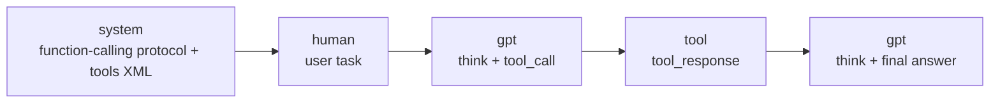
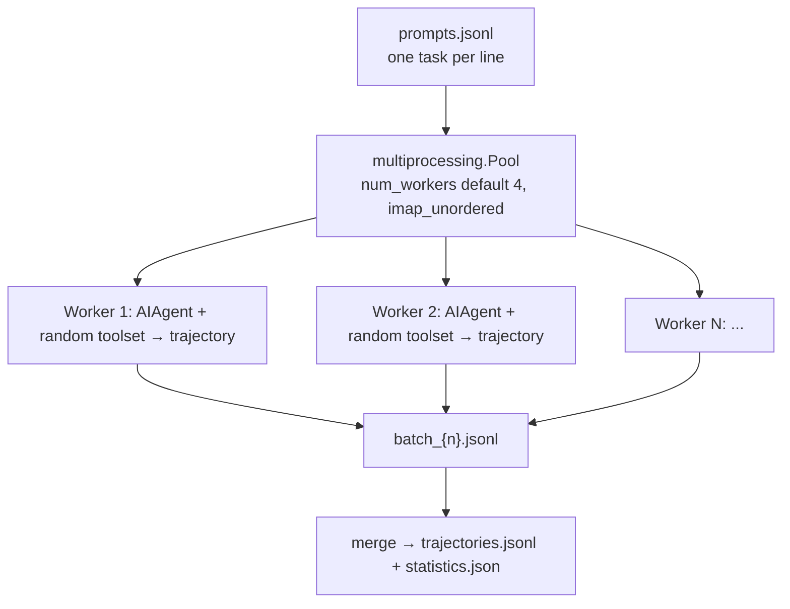
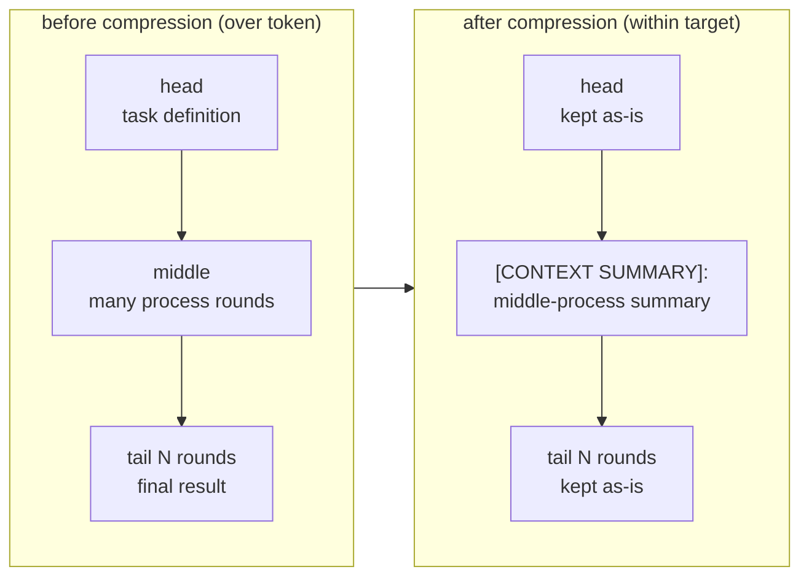

# 12 - The Agent Isn't Just a Product, It's Also a Data Factory

[中文](../zh/12-批量运行与轨迹生成.md) | English

> **Scope**: the training-data generation pipeline — `batch_runner.py` (1,321 lines, batch trajectory generation), `trajectory_compressor.py` (1,574 lines, trajectory compression), `mini_swe_runner.py` (732 lines, the SWE-task runner), `toolset_distributions.py` (358 lines, toolset randomization), `datagen-config-examples/` (config templates).
> **Key classes/functions**: `BatchRunner` (`batch_runner.py:527`), `CompressionConfig` (`trajectory_compressor.py:83`), `compress_trajectory()` (`trajectory_compressor.py:743`; the async version `compress_trajectory_async()` `:879`), `sample_toolsets_from_distribution()` (`toolset_distributions.py:241`).

> **This chapter is based on hermes-agent v0.18.2 (tag [`v2026.7.7.2`](https://github.com/NousResearch/hermes-agent/releases/tag/v2026.7.7.2), commit `9de9c25f6`, 2026-07-07)**

---

## Every Step the Agent Takes Could Become the Next Model's Textbook

Nous Research makes Hermes Agent not just to sell an AI assistant — they're a model company. Every time the Agent works it leaves behind a **trajectory**: the user gives a task, the model thinks, calls tools, sees results, calls again, finally completes. This trajectory is itself high-quality **training data** — it demonstrates "how a tool-using model should advance step by step through a real task." Collecting, cleaning, and compressing thousands of such trajectories gives you the data to fine-tune (SFT) or apply reinforcement learning (RL) to the next generation of tool-calling models.

This chapter is about this **data-factory pipeline**: how to run the Agent in large-scale batches to produce trajectories (`batch_runner.py`), how to compress the long trajectories produced down to fit the training window (`trajectory_compressor.py`), how to make the training data cover diverse tool combinations (`toolset_distributions.py`), and what a trajectory itself looks like (the ShareGPT format — a conversation-sequence JSON convention widely supported by training frameworks).

By the end you should be able to: generate trajectories in batch from your own prompt dataset, understand why toolset randomization and reasoning filtering are done, compress an over-long trajectory to a target token count, and read the ShareGPT trajectory file produced to feed HuggingFace datasets.

> **A note on "RL"**: this chapter was originally named "Batch Running & RL." In v0.11.0, the main repo still had a whole RL training environment (`environments/`'s Atropos adaptation, `rl_cli.py`, `tool_call_parsers/`). But by v0.14.0, **this RL training infrastructure has been moved out of the main repo** (very likely to a separate training repo — separating the product repo from the training repo is a common practice). So this chapter focuses on the **data-generation side that actually remains in the repo**: the factory producing training data is still here, the equipment that loads the data into an RL environment to run training has been moved away. RL appears here only as background for "who this data is born for."

> **Scope note**: Chapter 11 (Cron) covers "timed self-driven single tasks"; this chapter covers "running hundreds or thousands of tasks in one-off large-scale parallel." Both take the Agent out of interactive running, but the purposes are orthogonal — cron is for automating the everyday, batch is for mass-producing data. Chapter 02's `save_trajectories` and Chapter 03's tool system are both upstream of this chapter.

---

## Usage Guide

### Basic Usage: Batch-Generate Trajectories

The input is a JSONL dataset, one task per line (the `prompt` field is required, `image`/`cwd` optional):

```jsonl
{"prompt": "write a Python function to find the longest palindromic substring"}
{"prompt": "write a REST endpoint for user authentication with Flask"}
{"prompt": "install numpy and compute the eigenvalues of a 3x3 matrix", "image": "python:3.11-slim"}
```

Then run `batch_runner.py` (uses Python Fire, so function parameters are command-line flags):

```bash
# basic batch run
python batch_runner.py \
    --dataset_file=data/prompts.jsonl \
    --batch_size=10 \
    --run_name=my_run \
    --model=anthropic/claude-sonnet-4.6 \
    --num_workers=4

# resume after an interruption
python batch_runner.py --dataset_file=data/prompts.jsonl --batch_size=10 \
    --run_name=my_run --resume

# list all toolset distributions
python batch_runner.py --list_distributions
```

The output all lands in `data/<run_name>/`:

```
data/my_run/
├── trajectories.jsonl   # the final merged output (all batches)
├── batch_0.jsonl        # single-batch result
├── batch_1.jsonl
├── checkpoint.json      # the resume checkpoint
└── statistics.json      # aggregated tool-usage statistics
```

### Configuration

The most commonly used parameters (see the official docs for the full set):

| Parameter | Default | Purpose |
|-----------|---------|---------|
| `--dataset_file` | required | JSONL dataset path |
| `--batch_size` | required | how many prompts per batch |
| `--run_name` | required | run name (output directory + for resume) |
| `--distribution` | `default` | which toolset distribution to sample |
| `--model` | `anthropic/claude-sonnet-4.6` | which model (this is the CLI-entry default, including the `anthropic/` provider prefix, `batch_runner.py:1152`; when constructing `BatchRunner()` directly via the Python API the class default is opus, note the difference) |
| `--num_workers` | 4 | number of parallel worker processes |
| `--max_turns` | 10 | max rounds of tool calls per prompt |
| `--resume` | false | resume from checkpoint |
| `--max_samples` | all | process only the first N |

### Common Scenarios

**Scenario 1: Mass-produce coding trajectories for fine-tuning**. Multi-worker + large batch, using the default distribution to get full tool coverage.

```bash
python batch_runner.py --dataset_file=data/coding.jsonl --batch_size=20 \
    --run_name=coding_v1 --model=anthropic/claude-sonnet-4.6 \
    --num_workers=8 --distribution=default --max_turns=15
```

Expected: 8 processes run in parallel, each trajectory activates a random set of toolsets, zero-reasoning trajectories are auto-discarded, finally merged into one `trajectories.jsonl` that can directly `load_dataset("json", ...)` to feed HuggingFace.

**Scenario 2: Compress an over-long trajectory to the training window**. A 50K-token trajectory won't fit a 15K training window, use the compressor.

```bash
python trajectory_compressor.py --input=data/my_run/trajectories.jsonl \
    --output=data/compressed.jsonl --target_max_tokens=16000
```

Expected: each trajectory's head and tail are protected, the middle process is summarized into one `[CONTEXT SUMMARY]:` message, the whole thing compressed below the target token count. 50-way concurrency, a 300s timeout per trajectory.

**Scenario 3: Each task uses a different container image** (a benchmark scenario). Specify `image` per line in the JSONL.

```jsonl
{"prompt": "compile and run this Rust program", "image": "rust:1.75"}
{"prompt": "start a Node Express service", "image": "node:20-alpine", "cwd": "/app"}
```

Expected: under `TERMINAL_ENV=docker`, before running each prompt the batch runner first verifies the image is reachable (check the local cache, then try to pull, `batch_runner.py:272`); the Modal environment skips local validation (the Modal server pulls), the local environment doesn't apply.

### Troubleshooting

| Symptom | Cause | Fix |
|---------|-------|-----|
| Resume re-ran already-completed tasks | The dataset's prompt text was modified | Resume matches by **content**; if the prompt text changed it can't recognize it as the same one; keep the prompt text stable |
| Many trajectories discarded | Reasoning filtering: zero-reasoning trajectories are auto-discarded | Check whether the model has reasoning enabled; a purely reasoning-free conversation has limited training value and is discarded by design |
| HuggingFace load reports inconsistent schema | Different trajectories' tool-stat columns don't line up | Normally the batch runner already zero-fills to align; if you manually concatenated multiple runs' output you need to align it yourself |
| Trajectory still over the token count after compression | The trajectory is too short, no compressible space between the head and tail protection zones | Increase `target_max_tokens` or reduce `protect_last_n_turns` (a short trajectory just can't be compressed) |
| Wanted resume to re-run a discarded zero-reasoning prompt but it didn't | Discarded trajectories are also marked completed, `--resume` won't retry | Use a new `--run_name` to re-run, can't rely on resume |
| Image task failed | The Docker image is unreachable | The batch runner validates the image before running; confirm you can `docker pull` locally |

> 📖 **Further Reading (Official Docs):**
> - [Batch Processing](https://hermes-agent.nousresearch.com/docs/user-guide/features/batch-processing)
> - [Trajectory Format](https://hermes-agent.nousresearch.com/docs/developer-guide/trajectory-format)

---

## Architecture & Implementation

### The Trajectory Format: What Training Data Looks Like

To understand this pipeline, you first need to know what it produces — the format determines what tools downstream can consume it, and also why there are so many "normalization" steps in the pipeline. Hermes uses a **ShareGPT-compatible JSONL format** (the official doc `trajectory-format.md`): a `conversations` array, each element a `{from, value}` pair, `from` mapping API roles to the ShareGPT convention:

| API role | ShareGPT `from` |
|----------|-----------------|
| system | `system` |
| user | `human` |
| assistant | `gpt` |
| tool | `tool` |

Each role's `value` has a strict convention:

- **system**: the function-calling protocol description + a `<tools>` XML block (the tools' JSON definitions). This one is **generated at save time**, not taken from the conversation.
- **gpt**: must contain a `<think>...</think>` block (**inserting an empty block even when there's no reasoning** `<think>\n</think>`, to guarantee format consistency for training), followed by `<tool_call>\n{JSON}\n</tool_call>`.
- **tool**: `<tool_response>\n{JSON}\n</tool_response>`, multiple responses joined into one with newlines.

This format has several deliberate normalizations (the Normalization Rules in `trajectory-format.md`, the conversion in `agent/agent_runtime_helpers.py`):

- **Reasoning unified into `<think>`**: whether the model natively uses thinking tokens (Anthropic/OpenAI o-series) or is required by the system prompt to use `<REASONING_SCRATCHPAD>` XML, everything is finally converted to `<think>`. Training data must be format-consistent, and "where the reasoning goes" that the model sees must be the same marker.
- **Multiple tool responses merged into one `tool` message**: if a gpt round has multiple concurrent tool_calls, all responses are joined with `\n` into a **single** tool message (whereas in the API it's one per call), corresponding by position to the parent gpt's tool_calls.
- **Multimodal message slimming**: the large base64 blocks in an image-bearing tool message are replaced with a `text_summary`, avoiding each trajectory dragging around ~1MB of base64.
- **Prefill doesn't enter the trajectory**: the few-shot guidance from `--prefill_messages_file` is injected only at API-call time, not written into `conversations` — so you won't see the prefill content in the trajectory.

Why so much normalization? Because these trajectories are to be used as training data, and any format inconsistency (different reasoning markers, tool responses one or many, images with or without base64) would become training noise or a size disaster.

**Figure: The role sequence of a ShareGPT trajectory — system defines the tools, human gives the task, gpt thinks + calls, tool returns the result, gpt wraps up**



### BatchRunner: The Multi-Process Trajectory Factory

`BatchRunner` (`batch_runner.py:527`) is the body of the data factory. It reads tasks line by line from JSONL, uses `multiprocessing.Pool` to start `num_workers` processes (default 4), and uses `pool.imap_unordered()` (`batch_runner.py:959`) for unordered parallelism — whoever finishes first is collected first, for higher throughput. Each batch's result lands in `batch_{n}.jsonl` first, finally merged into `trajectories.jsonl`.

**Note the parallelism is "batch-level" rather than "prompt-level"**: each `Pool` task is a whole batch, and within a worker the prompts in a batch are **processed sequentially** (`batch_runner.py:442`: "Process each prompt sequentially in this batch"). So with `num_workers=4, batch_size=10` the Agents running at the same time are **4** (each worker running the current prompt of its own batch), not 40 — this is key to estimating throughput and cost. Each prompt runs an `AIAgent` session, forced with `skip_context_files=True`, `skip_memory=True` (`batch_runner.py:344`) — not loading SOUL.md/AGENTS.md, not using persistent memory, so the trajectory isn't polluted by environment context.

The merge stage also has a **hallucinated-tool filter** (from `batch_runner.py:1028`): it checks whether every tool name in each trajectory is in the legal-tool universe, and a trajectory containing a tool name the model hallucinated is discarded, not entering the final `trajectories.jsonl` — so the merged count may be fewer than in the batch files. A trajectory also carries a `partial` field: `true` means "stopped early due to an invalid tool call," distinct from normal completion and the model proactively wrapping up.

**Figure: BatchRunner multi-process parallelism — JSONL through N workers each running an Agent session, landing in batches then merged**



Four designs serving "data quality," each solving a problem specific to training data:

**① Toolset randomization**. If every trajectory enabled the full tool suite, the training data would lack diversity — the tool combinations real users use vary enormously. Before running each prompt, `sample_toolsets_from_distribution()` (`toolset_distributions.py:241`) randomly samples a set of toolsets per a **distribution**. This makes the training data cover all kinds of tool combinations (detailed in the next section).

**② Content-matched resume**. A batch run easily takes hours, and it can't start over from scratch when it dies midway. On `--resume`, the runner scans the existing `batch_*.jsonl`, extracts the human-message text of each completed trajectory in them into a set (`_scan_completed_prompts_by_content`), then uses it to filter the dataset — **matching by prompt-text content, not line number**. Why? Because a line-number-based resume goes completely haywire once a line is inserted/deleted in the middle of the dataset; content matching tolerates dataset-order changes and only skips the **successful** ones (failures are retried next time).

**③ Reasoning filtering**. The precise definition of "zero-reasoning" is: **all** assistant rounds have neither a `<REASONING_SCRATCHPAD>` nor a non-empty native `reasoning` field (`_extract_reasoning_stats`, `batch_runner.py:208`). As long as any round has one of them, the trajectory is kept; only reasoning-free throughout is discarded (near `batch_runner.py:455`). For training a tool-calling model, a trajectory with no reasoning process has limited value — you want to teach the model "think first, then act," and a pile of "act without thinking" samples is pollution.

> **Troubleshooting trap**: a discarded trajectory is also marked "completed" (`completed_in_batch`, `batch_runner.py:459`), so `--resume` won't re-run them — to retry these prompts with a different reasoning config, you have to open a new `--run_name`, you can't rely on resume.

**④ Tool-stat zero-fill**. Each trajectory automatically extracts each tool's count/success/failure statistics, and **zero-fills for all possible tool names** (`_normalize_tool_stats`, the tool universe from `model_tools.TOOL_TO_TOOLSET_MAP`). Why fill a 0 even for unused tools? Because when downstream loads with HuggingFace datasets, Arrow/Parquet requires each row's columns to be consistent — if trajectory A has a `terminal` column and trajectory B doesn't, the schema won't line up and loading errors. Zero-filling guarantees every trajectory's schema is exactly identical.

The first two (toolset randomization + resume) guard "the diversity and reliability of the data," the latter two (reasoning filtering + zero-fill) guard "the quality and format consistency of the data." Together, the four guarantee that the trajectories entering the training pipeline are diverse, resumable, clean, and uniform.

### Toolset Distributions: Making the Data Cover Diverse Tool Combinations

`toolset_distributions.py` defines **17 distributions** (the `DISTRIBUTIONS` dict, `toolset_distributions.py:29`, the AST key count is exactly 17). **A narrative-level change in v0.18: the moa toolset was removed from all 8 distributions containing it** — the moa tool itself was refactored into the MoA mode of the Agent-loop layer (Chapter 02), no longer occupying a tool slot. A few typical ones now (only the top two probability items excerpted): `default` (all tools 100%), `research` (web 90 + browser 70, plus vision 50/terminal 10, `:55-62`), `development` (terminal/file 80 each + web 30/vision 10, `:79-87`), `reasoning` (description changed from "Heavy mixture of agents" to "Heavy research/reasoning": web 90/file 60/terminal 20, `:151-158`), `browser_only` (browser only), `safe` (no-terminal mode).

The data structure is "an independent probability per toolset":

```python
"research": {
    "description": "...",
    "toolsets": {"web": 90, "browser": 70, ...}  # each a 0-100 probability
}
```

When sampling (`sample_toolsets_from_distribution`, `toolset_distributions.py:241`), it **rolls the dice once independently for each toolset in the distribution** (`random.random()*100 < probability`) — so multiple toolsets can be selected at once, simulating real multi-tool combinations. Finally there's a fallback: if none is selected, force-select the highest-probability one, avoiding an empty trajectory with "no tools at all."

> This differs from "handwriting a table of pre-made combinations" (the official doc `batch-processing.md` specifically clarifies this): it's not picking one of N predefined combinations, but flipping a coin independently for each toolset — N coins can flip out 2ᴺ combinations (whereas "pick one from a predefined table" always has only the few in the table), so diversity is naturally an order of magnitude higher.

### Trajectory Compression: Protect the Head and Tail, Compress the Middle

The model's training window is limited — a 50K-token trajectory won't fit a 15K window. `trajectory_compressor.py` is responsible for compressing a long trajectory to the target token count.

The compression strategy (`compress_trajectory()`, `trajectory_compressor.py:743`) follows a clear principle — **protect the head and tail, compress the middle**:

1. **Protect the head**: the opening system/human/gpt/tool messages are untouched — they contain the task definition and initial context, and the model has to know "what to do."
2. **Protect the tail**: the last N rounds are untouched (`protect_last_n_turns` default 4, `trajectory_compressor.py:98`) — the tail is the final result and the success/failure state, the core of the training signal.
3. **Compress the middle**: use a summarizer model (default `google/gemini-3-flash-preview`, `:101`) to generate a summary of the middle process.
4. **Replace**: replace the compressed interval with a single message with `from="human"` beginning with `[CONTEXT SUMMARY]:` (`trajectory_compressor.py:859-861`, the prefix force-guaranteed by `_ensure_summary_prefix` (`:597`), auto-appended if the model doesn't output it).

**Figure: Trajectory compression — head and tail protected, the middle process summarized into one [CONTEXT SUMMARY] message**



Why protect the head and tail and compress the middle, rather than simply truncate? Because the head (what to do) and the tail (was it done) are where the training signal is densest, and the middle "how it was done" process is low in information density and summarizable. Simple truncation would drop the tail's success/failure signal, which is exactly what should be kept most.

The compression config is in `CompressionConfig` (`trajectory_compressor.py:83`): target token `target_max_tokens=15250`, summary budget `summary_target_tokens=750`, tail protection `protect_last_n_turns=4`. Compression is **asynchronously parallel** — `asyncio.Semaphore(max_concurrent_requests=50)` controls concurrent API calls, with a `per_trajectory_timeout=300`s timeout per trajectory. Trajectories already below the target are by default skipped without processing (`skip_under_target=True`).

**How tokens are counted**: compression's token count uses the `moonshotai/Kimi-K2-Thinking` tokenizer (`trajectory_compressor.py:86`, `trust_remote_code=True`), not some generic counter — this choice means "15250 tokens" is computed by Kimi's tokenization rules. If the model you want to train is a different one, the actual token count will have a systematic bias, and it's best to re-validate the target value with the target model's tokenizer. The first run needs to download this HuggingFace tokenizer.

> **Note**: a tokenizer initialization failure `RuntimeError`s outright (no soft degradation); there's a crude `len(text)//4` fallback for a single-encoding exception, but its precision is poor for multi-byte characters like Chinese.

**How much to compress is computed on demand**, not compressing the whole middle interval. The algorithm (`trajectory_compressor.py:797-803`) first computes "how much to save": `tokens to compress = current total − target + summary budget` (adding the summary budget because the summary itself also takes tokens), then from the compression-zone start point **accumulates rounds until enough is saved, then stops**. So compression is **minimized** — compressing as little as possible, keeping more of the middle process. Implementation-wise, the boundary between the "head" and the "compressible zone" is the trajectory midline (`n//2`) rather than a fixed message count (`_find_protected_indices`, `trajectory_compressor.py:477`) — a concise but edge-case-prone choice: when the trajectory is very short, everything left of the midline is the protected head, everything right of the midline is directly the protected tail, there's no compressible space in the middle, the compressor can only return as-is, and the trajectory is still over token. This is the real mechanism behind "still over token after compression."

### mini_swe_runner: Trajectory Generation for SWE Tasks

This data-factory pipeline has one more dedicated branch — `mini_swe_runner.py` (732 lines), specifically for SWE (software-engineering) tasks. It doesn't share the main line's execution equipment (BatchRunner), but **outputs the same Hermes trajectory format**, its products can seamlessly merge into the same compression pipeline. Its characteristic is running commands with Hermes's own execution environments (local/docker/modal, the `create_environment()` factory) — it can execute locally, in a Docker container, or in a Modal cloud sandbox. It supports both single-task (`--task "..."`) and batch (`--prompts_file tasks.jsonl`) modes.

```bash
python mini_swe_runner.py --task "create a hello.py" --env docker --image python:3.11-slim
python mini_swe_runner.py --prompts_file tasks.jsonl --output_file out.jsonl --env docker
```

It has a **fundamental architectural difference** from batch_runner: mini_swe_runner **doesn't use `AIAgent`**, but implements its own streamlined tool-calling loop, and attaches only one kind of tool — terminal (`TERMINAL_TOOL_DEFINITION`, `mini_swe_runner.py:72`), not supporting multiple tools like web/file. The completion judgment is also different: since it doesn't use AIAgent's session layer and can't depend on the model "proactively ending the conversation," it switches to a sentinel string: the model executing `echo "MINI_SWE_AGENT_FINAL_OUTPUT"` in the terminal (the sentinel string appears in the system prompt, `mini_swe_runner.py:93`; the detection at `:525`) as the "I'm done" signal. **Troubleshooting point**: if the model never echoes this string, the task runs all the way to `max_iterations` (default 15) before stopping — a task "not ending" is most likely this signal not appearing.

So the division of labor is: batch_runner is the general large-scale trajectory factory (using the full AIAgent, multiple tools); mini_swe_runner is for SWE-type tasks of "repeatedly running shell commands in an isolated environment until the task completes" (streamlined loop, single terminal tool, echo-signal wrap-up), with a compatible output format for entering the same compression pipeline.

### Code Organization

```
batch_runner.py              — the batch trajectory factory (1,321 lines)
├── BatchRunner          :527  — the main class (num_workers default 4)
├── run()                :810  — the multi-process main loop
├── _scan_completed_prompts_by_content  — content-matched resume
├── _normalize_tool_stats           — tool-stat zero-fill
└── main() + fire.Fire   :1147/:1320  — the Fire CLI entry

trajectory_compressor.py     — trajectory compression (1,574 lines)
├── CompressionConfig    :83   — config (target 15250 / summary 750 / tail 4 / gemini-flash / concurrency 50)
├── compress_trajectory():743  — protect head and tail, compress the middle (async version :879)
└── _snap_boundary()           — snap the compression boundary to a message boundary (added in v0.17, commit f10a330ae, from :539)

mini_swe_runner.py           — the SWE runner (732 lines, local/docker/modal)
toolset_distributions.py     — 17 toolset distributions + independent-probability sampling (358 lines; the moa items all removed)
datagen-config-examples/     — trajectory_compression.yaml / web_research.yaml / sample datasets
```

### Design-Decision Summary

| Decision | Reason | Cost | Alternative |
|----------|--------|------|-------------|
| multiprocessing.Pool + imap_unordered | true parallelism (bypasses the GIL), high throughput | no shared state between processes, closures not picklable | thread pool — limited by the GIL |
| Content-matched resume (not line number) | tolerates dataset order/insert-delete changes | needs to scan completed files to extract text | line-number resume — dislocated the moment the dataset moves |
| Reasoning filtering discards zero-reasoning trajectories | training "think first, then act" isn't polluted by reasoning-free samples | drops some data | keep all — pollutes the training signal |
| Tool-stat zero-fill alignment | HuggingFace Arrow schema consistency | each row carries the full tool columns (sparse) | don't fill — schema mismatch at load |
| Protect head and tail, compress the middle | the head and tail are the core training signal, the middle is summarizable | loss of middle-process information | simple truncation — drops the success/failure signal |
| Independent-probability toolset sampling | exponential combination space, high diversity | can't precisely control the combination | pre-made combination table — limited diversity |

### Extension Points

- **Custom toolset distribution**: add a themed distribution to `toolset_distributions.py`'s `DISTRIBUTIONS`, select it with `--distribution=<name>`.
- **Datagen config templates**: `datagen-config-examples/` provides `trajectory_compression.yaml`, `web_research.yaml`, etc., usable with a few tweaks.
- **Per-prompt environment**: each JSONL line can carry `image`/`cwd`, specifying a different container/working directory per task.
- **Prefill few-shot**: `--prefill_messages_file` injects few-shot guidance messages.

---

## Relationship to Other Chapters

- **Chapter 02 (Agent Core)**: each worker runs an `AIAgent.run_conversation()`; `save_trajectories` is a CLI flag of `run_agent.py` (`--save_trajectories`, off by default) and an `AIAgent` constructor parameter, **not a config.yaml key**; it controls whether the interactive CLI also saves trajectories. The batch runner explicitly sets `save_trajectories=False` (`batch_runner.py:331`, "We handle saving ourselves") — it has its own trajectory-saving logic (batch_N.jsonl → merged trajectories.jsonl), independent of this switch.
- **Chapter 03 (Tool System)**: toolset randomization samples exactly the toolsets defined in Chapter 03; the local/docker/modal execution environments mini_swe_runner uses are exactly the set covered by Chapter 03's "Terminal Backends: 7 Execution Environments" (not the Computer Use desktop control).
- **Chapter 11 (Cron)**: cron is timed single-task self-driving, batch is one-off large-scale parallel — both take the Agent out of interaction, with orthogonal purposes.
- **RL training (moved out of the main repo)**: the ShareGPT trajectories this chapter produces are the input for SFT/RL training. Since v0.14.0, the code that loads this data into an RL environment to run training (the Atropos environment, rl_cli, tool_call_parsers) has been moved out of the main repo, expected to be consumed by a separate training system.

---

*This document is based on source analysis of hermes-agent v0.18.2. All code references have been independently verified.*
