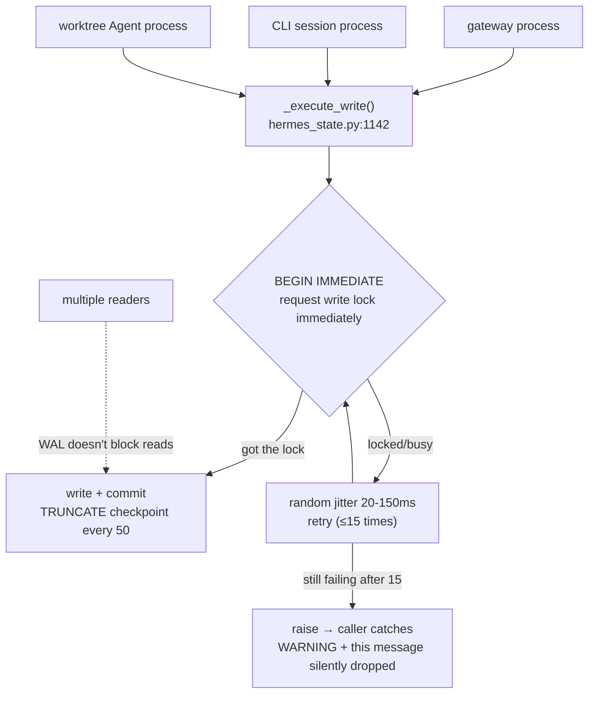
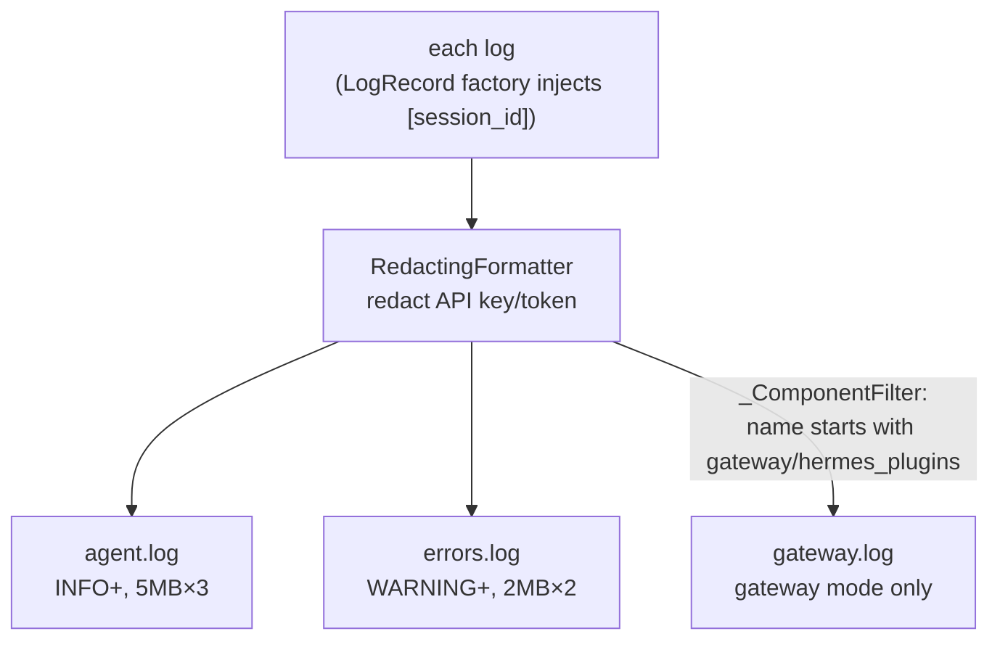
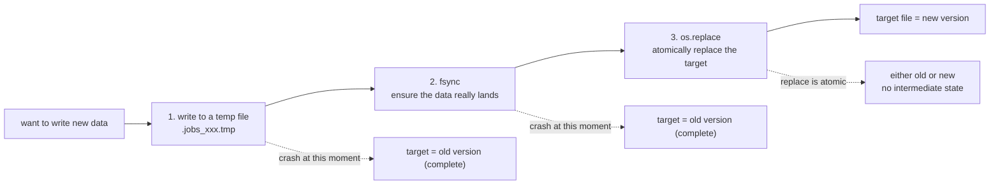

# 13 - The "Unsexy" Code That Keeps a 600,000-Line Project Steady

[中文](../zh/13-工程实践.md) | English

> **Scope**: cross-module engineering infrastructure — `hermes_state.py` (6,409 lines, SQLite session storage), `hermes_logging.py` (789 lines, the logging system), `utils.py` (546 lines, atomic writes), `tests/` (2,017 .py files, of which 1,960 are test_*.py), `pyproject.toml` (dependencies and supply chain), `CONTRIBUTING.md`/`SECURITY.md`/`AGENTS.md`.
> **Key classes/functions**: `SessionDB` (`hermes_state.py:871`), `_execute_write()` (`hermes_state.py:1142`), `_reconcile_columns()` (`hermes_state.py:1301`), `atomic_json_write()` (`utils.py:139`), `_ComponentFilter` (`hermes_logging.py:219`).

> **This chapter is based on hermes-agent v0.18.2 (tag [`v2026.7.7.2`](https://github.com/NousResearch/hermes-agent/releases/tag/v2026.7.7.2), commit `9de9c25f6`, 2026-07-07)**

---

## What Makes the Agent Run, and What Makes the Project Live Long

The previous twelve chapters were all about what Hermes **can do** — how to call tools, manage sessions, schedule, mass-produce data. But a project of several hundred thousand lines, tens of thousands of commits, and twenty-some platform adaptations won't live long on "the features run" alone. What really decides whether it can be continuously maintained is another batch of **unsexy** code: where the session is stored, whether concurrent writes conflict, how logs avoid leaking secrets, whether the config file gets corrupted if it crashes mid-write, what happens to old users' databases when the schema changes, whether a poisoned PyPI package can slip in down the dependency chain.

This chapter is about this batch of infrastructure. What they have in common is: **you don't feel their existence in normal times, but the moment one is missing it's a disaster**. The session storage uses SQLite but has to withstand multi-process concurrent writes; logging has to fan out four ways and auto-redact API keys; the config file has to be written atomically — a mid-write crash can't corrupt it; the schema has to auto-migrate — old users upgrading don't run a script manually; dependencies have to be exactly pinned — guarding against a supply-chain poisoning that actually happened.

By the end you'll understand Hermes's engineering choices on this "foundation," and the tradeoffs behind them. Finally, as the series' wrap-up, we'll look back at this project as a whole.

---

## Usage Guide

Most of this chapter's content is "the system does it for you," with few usage-level touchpoints, but a few are worth knowing:

### View Sessions, Search History

All sessions are stored in `~/.hermes/state.db` (SQLite). Common operations:

```bash
hermes sessions list                 # list sessions
hermes --resume <session_id>         # resume a session
hermes --continue                    # resume the most recent
```

Sessions support full-text search (including Chinese) — `/session_search docker 部署` (部署 = "deployment") can find content in past conversations.

### Read Logs to Troubleshoot

Logs are in `~/.hermes/logs/`, three files each with a role:

```bash
tail -f ~/.hermes/logs/agent.log     # the full activity log (INFO+), the workhorse for everyday troubleshooting
tail -f ~/.hermes/logs/errors.log    # only WARNING+, for quickly locating a problem
tail -f ~/.hermes/logs/gateway.log   # gateway-component-specific (only in gateway mode)
```

With multiple sessions concurrent, each log line carries a `[session_id]` tag, convenient for grepping out all the logs of one conversation. API keys/tokens in the logs are auto-redacted, so they can be shared safely.

### Dependencies and Supply Chain

```bash
hermes doctor                        # check the environment, including the supply-chain advisory (alerts for known-poisoned versions)
hermes doctor --ack <advisory-id>    # acknowledge and permanently dismiss a supply-chain alert
```

### Troubleshooting

| Symptom | Cause | Fix |
|---------|-------|-----|
| `database is locked` error | Multiple processes writing state.db at once and retries exhausted | Usually self-heals (application-layer retries 15 times); if persistent, check whether it's on NFS (see WAL degradation below) |
| Chinese search returns no results | The search term is too short (trigram needs ≥3 chars) | 1-2 Chinese characters degrade to LIKE, still searchable but slow; use a longer term |
| Database reports a missing column after upgrade | Very rare — declarative column reconciliation should auto-fill | Check the `ALTER TABLE` line in `agent.log`; normally the upgrade is seamless |
| `jobs.json` corrupted | Nearly impossible — atomic writes are used | Atomic writes guarantee either the old version or the new version, never a half-corrupt one |
| Part of the conversation history is lost | state.db write retried 15 times all hit the lock, the message was silently dropped | Search for `Session DB append_message failed` in `agent.log`; that message wasn't persisted (it's still in memory, invisible after restart/resume) |
| `state.db` reports schema malformed | sqlite_master corruption or an FTS write corruption | The system auto-repairs in three tiers (FTS rebuild→dedup→discard and rebuild) and backs up to `state.db.malformed-backup-<timestamp>` first; only a failed repair needs manual intervention |
| `tail -f` on a log suddenly stops updating | Rotated by an external tool (logrotate/script) causing an inode mismatch | Hermes auto-reopens by comparing inodes; to check, confirm whether `agent.log`'s inode changed |
| `hermes doctor` reports a supply-chain alert | The venv has a package with a known-poisoned version | Upgrade as prompted; after confirming, `--ack` to dismiss |
| A feature reports `FeatureUnavailable` | An optional dependency isn't installed, or lazy install is off | Check the network; or whether `security.allow_lazy_installs` is set to `false` (in a restricted environment you need to `pip install` manually) |

> 📖 **Further Reading (Official Docs):**
> - [Session Storage (session-storage internals)](https://hermes-agent.nousresearch.com/docs/developer-guide/session-storage)
> - [Sessions (session management)](https://hermes-agent.nousresearch.com/docs/user-guide/sessions)
> - [Security (the security model)](https://hermes-agent.nousresearch.com/docs/user-guide/security)
> - [Architecture (architecture overview)](https://hermes-agent.nousresearch.com/docs/developer-guide/architecture)

---

## Architecture & Implementation

Before diving into implementation details, one chapter boundary: Chapter 03 already covered the specific security guards in detail (dangerous-command approval, path safety, SSRF, Tirith scanning); this chapter doesn't re-enumerate them, but covers **the security model itself** — where the trust boundary is drawn, which are "real boundaries" and which are just "heuristics against fat-fingering," and the hardening at the supply-chain layer.

### SQLite Session Storage: How a Single-Machine Database Withstands Multi-Process Concurrent Writes

All conversation history, the token ledger, and session retrieval land in one SQLite file `~/.hermes/state.db` (`SessionDB`, `hermes_state.py:871`). Why SQLite rather than PostgreSQL? Because Hermes is positioned for single-user / single-machine deployment — SQLite is zero-config, zero-network, zero-process-management, usable right after `pip install`. The cost is that SQLite's concurrent-write ability is weak, and Hermes happens to have a multi-process concurrent-write need: the gateway, multiple CLI sessions, parallel Agents in a worktree, may write the same `state.db` at the same time.

This is the core tension of this section — **how to withstand multiple processes writing at once with a "single-writer" database**. Hermes's response (`_execute_write()`, `hermes_state.py:1142`) has four things working together:

1. **WAL mode**: Write-Ahead Logging allows "multi-read + single-write" concurrency, readers not blocked by the writer.
2. **Short timeout + application-layer retry**: if you just wait directly on SQLite's built-in busy handler, it can be up to 30 seconds (source comment); Hermes squeezes the timeout to **1 second** (`timeout=1.0`), then retries at the application layer itself — up to 15 times (`_WRITE_MAX_RETRIES=15`), each waiting a **20–150ms random jitter** (`_WRITE_RETRY_MIN_S=0.020`/`_MAX_S=0.150`).
3. **`BEGIN IMMEDIATE`**: the transaction requests the write lock at the very start, rather than waiting until commit. This makes a lock conflict **surface immediately at the transaction's start**, triggering an application-layer retry, rather than discovering you can't get the lock after writing halfway.
4. **Periodic WAL checkpoint**: a checkpoint every 50 successful writes (`_CHECKPOINT_EVERY_N_WRITES=50`), upgraded since v0.18 from PASSIVE to **TRUNCATE** (`hermes_state.py:1197-1209`) — not only merging the WAL content back into the main database but also truncating and reclaiming the WAL file, preventing a long-running gateway's WAL from swelling infinitely. Also a `PRAGMA optimize` every 1,000 writes (`_OPTIMIZE_EVERY_N_WRITES`, near `:1230`), maintaining FTS-segment health.

There's also an easily-overlooked precondition: the connection is opened with `isolation_level=None` (autocommit). Python's `sqlite3` by default auto-opens an ordinary transaction before DML, which would fight the handwritten `BEGIN IMMEDIATE`. Setting it to `None` means handing the transaction boundary entirely to the application to control, so `BEGIN IMMEDIATE` can work normally.

Why does the retry use **random** jitter rather than a fixed interval? For the same reason as API retries — to avoid a problem called the "**convoy effect**": if all competitors back off at a deterministic interval, they're like a pack of cars starting at once when the light turns green: hitting the wall together, backing off together, retrying together, colliding every round, never dispersing. Random jitter scatters them, letting conflicts naturally stagger (the `session-storage.md` official doc specifically points this out).

**Figure: state.db multi-process concurrent write — WAL allows multi-read single-write, the writer uses BEGIN IMMEDIATE to surface conflicts immediately + random-jitter retry to scatter the convoy effect**



**NFS-compatibility degradation**: WAL mode depends on shared memory, and fails on NFS/SMB network file systems. When Hermes detects a failure it degrades to `journal_mode=DELETE` (lower concurrency but usable), and warns only once per database per process, without spamming. There's an accompanying **diagnostic chain**: the reason for a DB-init failure is recorded to a module-level `_last_init_error`, and when commands like `/resume`, `/title`, `/branch` find `state.db` unavailable, this reason (usually an NFS/SMB "locking protocol" error) is formatted into the hint given to the user (`/history` is an exception — with no DB it only silently prints "no history yet," without the diagnostic reason) — rather than throwing a bare "Session database not available." Carrying "why the underlying layer failed" all the way through to "the error the user sees" is this project's consistent care for debuggability.

**What happens after retries are exhausted?** If all 15 jitter retries hit the lock, `_execute_write()` `raise`s directly (`hermes_state.py:1191`) — the exception bubbles all the way to the caller. Take the highest-frequency write point as an example: `run_agent.py`'s `append_message()` is wrapped in `try/except: logger.warning("Session DB append_message failed: %s", e)` (`:1885`): **this message is silently dropped, doesn't enter the persistent history, but the conversation continues in memory as usual, with the user none the wiser**. This is a failure end-state you must know — the root-cause path for "the chat log inexplicably lost a chunk" is to search for this warning in `agent.log` (the dropped message is still in memory, unfindable after restart/`/resume`).

**Session-compression lock: a second case of the same concurrency mechanism**. `state.db` has a `compression_locks` table (`hermes_state.py:783`), solving another concurrency race: a parent session and its spawned background-review child session may decide almost simultaneously to compress the same `session_id`, each rotating out a new session, resulting in one parent session sprouting two orphan child sessions. The lock's implementation is a **TTL-lease cross-process mutex**: `try_acquire_compression_lock()` (`:2230`) does "DELETE expired locks + INSERT OR IGNORE + SELECT to validate the holder" in three steps in the same transaction — relying precisely on the `BEGIN IMMEDIATE` of `_execute_write` above to make these three steps atomic; `refresh_compression_lock()` (`:2201`) renews the lease, `release_compression_lock()` (`:2292`) releases after validating by holder, naturally idempotent; the lock has a 300-second TTL by default, auto-reclaimed by the next attempter on expiry, so even if the compression process crashes the session isn't stuck forever. There's also a key failure semantic — **fail-open**: when the lock subsystem itself errors, `try_acquire` returns `False` (near `:2288`), letting the caller skip this compression rather than pretend it got the lock and compress — rather not compress than risk double compression.

**Three-tier self-healing on database corruption**. The SQLite file can also break — `sqlite_master` having duplicate object definitions, or an FTS index write corruption (reads fine, but the moment a write triggers the FTS trigger it fails, #50502). `SessionDB.__init__` is wrapped in a `try/except sqlite3.DatabaseError` (`try` at `hermes_state.py:954`, `except` at `:956`), and when it catches corruption judged by `is_malformed_db_error()` (`:449`), it triggers `repair_state_db_schema()` (`:556`) to self-heal: first use `_claim_repair_attempt()` to ensure each process repairs only once, then make a timestamped raw-byte backup of the file `state.db.malformed-backup-<timestamp>` (backing up `-wal`/`-shm` along with it, `_backup_db_file`, `:476`), then escalate through three tiers by "least-destructive first": ① the FTS `'rebuild'` command rebuilds the index in place (preserving the schema) → ② dedup `sqlite_master` (keeping the smallest rowid per object) → ③ discard the FTS schema wholesale then `VACUUM`, rebuilding the index at the next `SessionDB()` startup. The self-healing process logs `state.db schema is malformed (...) — attempting automatic repair...` in `agent.log` (`:967`). "Database reports malformed" — don't panic, it's most likely already self-healed, and the raw pre-repair data is in that `malformed-backup` file.

### Declarative Schema Evolution: Old Users Upgrading Don't Run a Migration Script

Software iterates, and the database schema changes. The traditional approach is to write a string of "version migration blocks": v5 adds this column, v6 adds that column, each upgrade executing in order by version number. Hermes was like this early on too (the current `SCHEMA_VERSION=19`, `hermes_state.py:125`). But for the most common operation of adding a column, writing a migration block is too verbose.

Hermes currently (`SCHEMA_VERSION` currently 19) uses **declarative column reconciliation**. The v0.14→v0.18 version chain is itself new evidence of "column additions go declarative, complex changes go the version chain": v14/15/17/19 are all carried by declarative column-filling, only v16 (the `_delegate_from` subagent cascade-delete marker, linked to Chapter 02) and v18 (backfilling gateway metadata from sessions.json into state.db, linked to Chapter 06's index migration) need real migration code: you just add a column in `SCHEMA_SQL` (the create-table statement), and next startup it automatically appears in the database — no migration code needed. The mechanism is (from `hermes_state.py:1259`): `_parse_schema_columns()` uses an **in-memory SQLite** to parse the create-table statement, getting "which columns each table should have" — why not regex? Because DDL has DEFAULT expressions with commas, inline REFERENCES, CHECK constraints, and regex parsing is all edge-case bugs; let SQLite parse it itself, then `PRAGMA table_info` to read the columns, zero regex edge cases.

Having gotten "which columns should exist," `_reconcile_columns()` (`:1301`) diffs against the actual database's columns, and for missing columns auto-executes `ALTER TABLE ... ADD COLUMN` (idempotent, wrapped in try/except to handle "column already exists").

```python
# from hermes_state.py:1301 — declarative column-filling, no version migration block needed
ALTER TABLE "{table_name}" ADD COLUMN "{safe_name}" {col_type}
```

This declarative reconciliation has a constraint decided by SQLite: `ALTER TABLE ADD COLUMN` can't add a "`NOT NULL` with no default" column — so a new column must have a default or allow NULL, which in turn constrains `SCHEMA_SQL`'s design (adding a non-compliant column silently fails at reconcile, logging only DEBUG). Also, an index depending on a "column to be filled" (say a partial index whose WHERE clause references a new column) can't be written in `SCHEMA_SQL` — otherwise the create fails when the old database doesn't have that column yet — but has to be created separately after `_reconcile_columns`.

So what's the version-number migration chain still for? For changes **other than adding columns** — data backfills, index/FTS rebuilds, things that can't be expressed declaratively. For example v10 adds the trigram FTS table and backfills all historical messages, v11 rebuilds the FTS index so it covers tool names. **Column additions go declarative, complex changes go the version chain** — this division makes everyday schema evolution nearly zero-cost while preserving the ability to handle complex migrations. All of this is zero-downtime and script-free: the user upgrades Hermes, and next startup the database auto-aligns.

### Full-Text Search: Making Chinese Searchable Too

Behind `/session_search` is SQLite's FTS5 full-text index. But there's a catch: FTS5's default `unicode61` tokenizer is designed for Western text, tokenizing by space/punctuation. Chinese has no spaces, and `unicode61` would split "大别山项目" into single characters "大 别 山 项 目," turning the search into "大 AND 别 AND 山 AND 项 AND 目" — both false positives and failing to match the phrase.

Hermes's solution is to build **two** FTS5 virtual tables (the schema in `hermes_state.py`): `messages_fts` (`unicode61`, Western) and `messages_fts_trigram` (the `trigram` tokenizer, a three-character sliding window, suited for CJK substring search). At search time it **routes** by the query content: ≥3 CJK characters go to the trigram index; 1-2 Chinese characters (trigram needs ≥9 UTF-8 bytes) degrade to `LIKE` (slow but searchable). The routing has a subtler catch (#20494): it judges by **each term** rather than just the total — like "广西 OR 桂林 OR 漓江" has 6 total CJK characters (≥3), but each term has only 2 Chinese characters, and trigram would return 0 results, so as long as **any non-operator CJK term is < 3 chars** it degrades entirely to LIKE. Many projects would ignore this CJK-search need; Hermes not only handles it but also plugs this short-term-combination edge case.

Beyond storage and search, there's another kind of infrastructure hidden even deeper — logging.

### Logging: Four-Way Fan-Out + Auto-Redaction + Session Tags

Logging looks simple, but Hermes's `hermes_logging.py` (789 lines) solves several practical problems:

**① Four-way fan-out**, avoiding "everything mixed in one file":
- `agent.log` (INFO+, 5MB×3 rotation) — full activity, the workhorse for everyday troubleshooting.
- `errors.log` (WARNING+, 2MB×2 rotation) — only problems, for quick location.
- `gateway.log` (gateway mode only) — via `_ComponentFilter` (`hermes_logging.py:219`) only passing records whose logger name starts with `gateway`/`hermes_plugins`; since v0.18 the prefix list added `plugins.platforms` (#41112) — after the platform plugins migrated, their logs still route to gateway.
- `gui.log` (`MODE=gui`, 10 MiB×5 rotation) — the fourth way added in v0.18, splitting off the desktop-side records of web_server/pty_bridge/tui_gateway/uvicorn (linked to Chapters 10/14).

**Figure: Log four-way fan-out — split by level and component, all redacted, with session tags**



**② Session-tag injection**: with multiple sessions concurrent, how do you know which conversation a log line belongs to? Hermes uses a thread-local to store the current `session_id` and replaces the global `LogRecord` factory (`_install_session_record_factory`) — each log automatically carries a ` [session_id]` tag when created. This way all logs within a `run_conversation()` cycle are stamped with the same session tag, and a grep pulls out all the logs of one conversation.

**③ Auto-redaction**: all handlers wear a `RedactingFormatter` (backed by the 811-line `agent/redact.py`), replacing secrets like API keys and tokens before writing to the log — the log file can be shared safely. It has two complementary identification strategies: for keys **with a known vendor prefix** (OpenAI `sk-`, GitHub `ghp_`, Slack `xox`, AWS, Stripe, HuggingFace, etc. — about thirty vendors, 41 prefix regexes) it does regex prefix matching; for **prefix-less opaque tokens** it does **exact matching** by query-parameter name / JSON-body key name (`_SENSITIVE_QUERY_PARAMS`/`_SENSITIVE_BODY_KEYS`, `redact.py:20/42` — exact, not substring, so names like `token_count`/`session_id` aren't collateral damage). The mask is partial: a short token (<18 chars) is fully masked, a long token keeps the first 6 and last 4, balancing "can't tell the original value" with the debuggability of "can still match which key it is in the log." The most careful touch is **anti-injection** — `_REDACT_ENABLED` is snapshotted from an environment variable at module import (`redact.py:68`), the comment stating the reason: preventing a jailbroken Agent from `export HERMES_REDACT_SECRETS=false`-ing itself mid-session to secretly leak credentials (#17691); to actually turn it off you can only change config or `.env`, and a degradation warning is printed at startup for ops to see. Also a bunch of noisy third-party libraries (openai, httpx, urllib3, etc.) are forced down to WARNING level, so as not to drown the genuinely useful logs.

**④ Async queue: the logging system can't drag down the main flow itself**. This is the hidden pillar making the four-way fan-out not crash under high concurrency. Cross-process log rotation uses a cross-process file lock (`concurrent-log-handler`/`portalocker`) — if the thread emitting the log happens to be the asyncio event-loop thread, `emit()` blocking on this cross-process lock would **freeze the whole event loop and drop the WebSocket connection**. The fix is that all file handlers don't hang directly on the root logger, but consume asynchronously via a shared `queue.SimpleQueue` + a separate-worker-thread `QueueListener` (`_register_queued_handler`, `hermes_logging.py:615`): the log-emitting thread only does a non-blocking enqueue, and the actual file-write + rotation happens in that background thread. The accompanying `_NonFormattingQueueHandler.prepare()` (`:575`) deliberately does a **shallow copy** of the record (avoiding cross-thread concurrent mutation of the same record object); at shutdown there are two drain functions with different tradeoffs — `flush_log_queue()` (`:647`, for tests, stop+start blocking drain, not one lost) and `drain_log_queue(timeout=1.0)` (`:666`, for the hard-exit path, **with a timeout ceiling, giving up the last few logs in exchange for the process exiting cleanly**).

**⑤ External-rotation self-healing**: `_ManagedRotatingFileHandler` (`hermes_logging.py:415`), besides rotation preserving ownership, watches one thing — `logrotate`, a manual `mv`, or another process rotating first, would make its held fd point to an already-renamed inode, causing "logs silently lost, everything after written into `gateway.log.1`." Before each `emit()` it `stat`s the file once and compares against the in-memory `(st_dev, st_ino)` (`_reopen_if_externally_rotated`, `:465`), and if they don't match, reopens the real file. "`tail -f agent.log` suddenly stops producing new lines" is most likely this — the inode changed, and Hermes auto-reopens.

### Atomic Writes: A Mid-Write Crash Doesn't Corrupt

`utils.py` is 546 lines, and this set of atomic-write primitives is depended on by the whole system — at the bottom is `atomic_replace()` (temp file → fsync → atomic rename), with `atomic_json_write()` (`utils.py:139`), `atomic_yaml_write()`, etc. wrapping it. v0.18 added three hardenings to this layer: `atomic_json_write` gained a `mode` parameter (`fchmod` atomically sets permissions before landing — a secret file no longer has the "write then chmod" naked window, from `:175`); a fallback copy path when rename throws `EXDEV/EBUSY` in cross-device/bind-mount scenarios (`:104-117`); preserving and restoring the original file's owner on replace (`_preserve/_restore_file_owner`, `:46-57`, so a root process modifying a user file in Docker/NAS no longer changes ownership). Concretely: Cron's `jobs.json` and OAuth credentials go through the low-level `atomic_replace` directly (`cron/jobs.py:744`'s `_save_jobs_unlocked`, `auth.py:1138/2230`), the batch-run checkpoint goes through `atomic_json_write`, the user's `config.yaml` goes through `atomic_roundtrip_yaml_update` — but their crash-safety guarantee at the moment of landing is the same set.

The meaning of "atomic write" is: write to a **temp file** first → `fsync` to ensure the data really lands → `os.replace` to atomically replace the target file. If the process crashes mid-write, the target file is either the old version (crash before replace) or the new version (crash after replace), **never a half-written corrupt state**. Imagine Cron's tick writing `jobs.json` losing power halfway — if not an atomic write, after restart `jobs.json` is corrupt and all scheduled tasks are lost.

**Figure: Atomic-write crash safety — a crash at any moment leaves the target file either a complete old version or a complete new version, never half-corrupt**



But the absolute statement "never half-corrupt" has an **exception branch** to honestly flag: when `os.replace` throws `EXDEV`/`EBUSY` (the temp file and target aren't on the same file system — bind-mount, NFS cross-device, busy file), `atomic_replace` falls back to `shutil.copyfile` overwriting the target directly (`utils.py:125`), and this step **doesn't go through temp-file+rename, isn't atomic**: if the process is SIGKILLed right in the middle of this copy, the target file is in a half-written state. The trigger condition is very narrow (most deployments have the temp file and target on the same disk), a known, low-impact tradeoff — but since this section's selling point is "crash safety," this boundary has to be stated.

An easily-overlooked detail: `os.replace` on a **symlink** replaces the link itself, not the link's target. A managed deployment often points `config.yaml`/`SOUL.md` via a symlink to a git-managed profile bundle, and a direct replace would wipe out the symlink. So Hermes's `atomic_replace` (`utils.py`, #16743) first resolves the symlink's real path then replaces the real file, preserving the link structure. The write also preserves and restores the original file's permission bits.

Atomic write actually has **three** functions, corresponding to three scenarios (`utils.py`): `atomic_json_write` (JSON files), `atomic_yaml_write` (program-generated YAML), and `atomic_roundtrip_yaml_update`. The third is specifically for a **user-hand-edited `config.yaml`**: it uses `ruamel.yaml`'s roundtrip mode — parsing the YAML into a modifiable syntax tree, changing just one dotted key, and on write-back restoring comments/indentation/quotes/Unicode as-is, rather than re-serializing the whole file like an ordinary `yaml.dump`. Why not just use `atomic_yaml_write`? Because `yaml.dump` clears all comments — doing an ordinary dump on the config file the user painstakingly annotated is equivalent to deleting all the comments. So "change one config key" goes through the roundtrip version.

### Testing: 2,017 Files, but the Real Skill Is in Isolation

`tests/` has 2,017 `.py` files (of which 1,960 are `test_*.py`, the rest fixtures like conftest). But the count isn't the point, **test isolation** is. `tests/conftest.py` declares at the top a set of "hermetic invariants" — hermetic literally means airtight, and in testing means each test runs in a bubble sealed off from the outside: not polluted by the environment, leaving no trace behind. The enforced rules:

- **Clear all credential env vars** (`*_API_KEY`/`*_TOKEN`/`*_SECRET`, etc.) — local-dev secrets can't possibly leak into tests.
- **Isolate `HERMES_HOME`** — pointing at a per-test temp directory, so a test reading `~/.hermes/*` can't see the real directory.
- **Deterministic runtime** — `TZ=UTC`, `LANG=C.UTF-8`, `PYTHONHASHSEED=0`, eliminating flaky failures from environment differences.
- **Don't inherit the gateway session** — the current `HERMES_SESSION_*` don't leak into tests.

Even more severe is the execution strategy: **start a separate subprocess (a separate Python interpreter) per test file**, rather than using `pytest-xdist`'s persistent workers. Why? Because a persistent worker leaks state across files — module-level dicts, ContextVars, various caches — and one file polluting the next causes flaky failures. File-level subprocess isolation eliminates this kind of leak at the root. In CI it runs in parallel with a configurable sharding matrix (`tests.yml`, `slice_count` default **8**, changed in v0.18 from a hardcoded 6-way to a reusable workflow_call parameter; dependency install uses `uv sync --locked`), sharded by cached historical duration, balancing isolation and speed. The cost of subprocess isolation has a measured footnote (the header comment of `scripts/run_tests_parallel.py`): if you start a subprocess **per test**, ~17,000 tests × 250ms ≈ 70 minutes CPU; changing to a subprocess **per file** (~850 files × 250ms) squeezes it to ~3.5 minutes — note this gain comes from "abandoning xdist, building a per-file subprocess pool ourselves," not from xdist (xdist's persistent worker is precisely the cross-file leak source to be eliminated).

Isolation has a second line of defense too: an `autouse` `_live_system_guard` (the fixture defined at `conftest.py:547-548`). It intercepts primitives like `os.kill`, `os.killpg`, `subprocess.*`, `os.system`, preventing a test that forgot to mock from actually sending a signal to a process **outside** the test process subtree — especially a `hermes-gateway` the developer is running on their own machine. Without this line of defense, a test with a missing mock could SIGTERM your gateway while running tests. You can tell the priority of concerns from the test file names: `test_concurrent_*` (concurrent contention), `test_*_wal_*` (WAL/NFS degradation), `test_*_injection*` (injection), `test_*_compression*` (session splitting not losing messages) — security and concurrency are first-class citizens.

### Supply-Chain Hardening: Guarding Against a Poisoning That Actually Happened

This is a very "of-its-time" part, laid down in v0.14 and continuing to today. The direct dependencies in `pyproject.toml` are **overwhelmingly exact-pinned** `==X.Y.Z` (of 30 dependencies, 6 use ranges: urllib3/fastapi/uvicorn/python-multipart plus the mutually-exclusive ptyprocess/pywinpty pair — if you count this PTY-dependency pair as one logical item, i.e. "5," it aligns with Chapter 00's framing; the "all pinned" slogan in the comment drifts slightly from reality). The comment (`pyproject.toml:25-38`) gives the reason, and it's a real event:

> A range lets PyPI push a new version at any time, without a code review on our side. Exact pinning means a new version can only reach users through us actively upgrading (changing the pin here + regenerating uv.lock). This was tightened after the Mini Shai-Hulud worm poisoned `mistralai 2.4.6` on PyPI on 2026-05-12 — if it had been `mistralai>=2.3.0,<3` rather than exact-pinned, every install in the hours before that version was quarantined would have pulled it.

Two more accompanying moves:

- **Lazy install of optional dependencies** (`tools/lazy_deps.py`, `security.md`): dependencies not everyone needs, like Mistral TTS, ElevenLabs, Bedrock, aren't all installed at once in `[all]`, but installed on first use. The benefit is a small "blast radius" — an optional dependency being poisoned/pulled won't drag down ten other unrelated features. Lazy install has hard constraints: install only into the current venv, only by package name from PyPI (not accepting `--index-url`/`git+https`/a local path, to prevent a malicious config redirecting the install source), and only packages in the built-in `LAZY_DEPS` allowlist.
- **Supply-chain advisory scanning (passive)** (`hermes_cli/security_advisories.py`): on each startup it uses the stdlib to check whether the packages in the venv hit the **built-in catalog of known-poisoned versions**, and on a hit alerts in the banner/`hermes doctor`/gateway log. Old alerts are **deliberately not deleted** — the comment's reason: a user running an old Hermes with dependencies still pinned to the poisoned fixed version needs to keep receiving the alert (superseded entries are marked with `superseded_by` rather than deleted).
- **Supply-chain audit (active/on-demand)** (`hermes_cli/security_audit.py`, the `hermes security audit` subcommand): a different mechanism from the passive scanning above — it on demand bundles the venv dependencies + plugin dependencies + MCP server versions and sends them to **OSV.dev** (`api.osv.dev/v1/querybatch`, a batch cap of 1000) to query known vulnerabilities in real time, rather than only local-matching against the built-in poisoned catalog. Passive scanning covers "the few known poisoning events," active audit covers "the full CVE surface."

### Release Engineering: CalVer + Keyless Publishing + Supply-Chain Signing

Supply-chain hardening guards against "someone else's bad package slipping in"; its other half is "preventing Hermes's own published package from being impersonated or tampered with" — that's the release pipeline. `scripts/release.py` (`--publish`) generates the changelog, tags by **CalVer** (calendar version, like `v2026.7.7.2`, with a suffix for multiple same-day releases), and creates a GitHub Release. The tag push triggers `.github/workflows/upload_to_pypi.yml`: the `build` job first builds the web dashboard + TUI bundle then packages the wheel/sdist, the `publish` job uses **OIDC trusted publishing** to publish to PyPI (`id-token: write` + `pypa/gh-action-pypi-publish`) — **no long-lived PyPI token is stored anywhere in CI**, the credential is a short-lived token negotiated on the spot between GitHub and PyPI, eliminating at the root the whole class of risk of "a PyPI token in a CI secret leaking." Finally the `sign` job uses **Sigstore** to sign the build artifacts (`sigstore/gh-action-sigstore-python`) and attaches the `.sigstore.json` to the GitHub Release, so a user can verify that the package they got was indeed produced by this pipeline and not swapped mid-way. CalVer + OIDC keyless + Sigstore signing bookend "supply-chain hardening" perfectly: one guards against a bad package coming in, one guards against your own package being impersonated.

### The Security Model: Which Are "Real Boundaries," and Which Are Just "Fat-Finger Protection"

The supply chain guards outside the door — preventing a problematic package from coming in. Once inside the door, the guard switches to another logic: which operations can be done, which must be blocked. Chapter 03 covered a bunch of such security guards (approval, path, SSRF, Tirith). But `SECURITY.md` covers something more fundamental — **among these guards, which are genuine security boundaries and which are just heuristic "fat-finger protection"**. This distinction is crucial, because using "fat-finger protection" as a "real boundary" leads to trouble.

Hermes's trust model is a **single-tenant personal Agent**: you trust the Agent you run yourself, and multi-user isolation is the OS layer's job. Under this premise:

- **Real boundaries (load-bearing)**: terminal-backend isolation (running LLM-generated shell commands with Docker/Modal/a sandbox), whole-process wrapping (stuffing the whole Agent process tree into Hermes's own Docker image or a per-session sandbox like NVIDIA OpenShell + file/network/syscall policies). These are the walls that genuinely stop "how much damage a runaway Agent can cause."
- **Heuristics (not boundaries)**: dangerous-command approval, output redaction, Skills Guard. They guard against fat-fingering and accidents, not against an attacker determined to bypass them. For example approval can stop an "accidental `rm -rf`" but can't stop an adversary who can write Python code to bypass the shell.

So the official docs are clear: Hermes has **no bug-bounty program**, and prompt injection itself and heuristic bypasses are **out of scope** (§3.2 Out of Scope); while sandbox escape, unauthorized access, credential leakage, and violating the documented trust model are in-scope. This attitude of "honestly making clear what can and can't be stopped" is itself a kind of engineering maturity — compared to piling up a bunch of "looks-secure" features and pretending they're an iron wall, drawing clear boundaries is more responsible. (That said, under `--yolo` there's still an always-in-force hardline blacklist — irreversible operations like `rm -rf /`, a fork bomb, `dd` to a raw disk can't be bypassed even by "always allow," see Chapter 03.)

### Code Organization

```
hermes_state.py        — SQLite session storage (6,409 lines, SCHEMA_VERSION=19)
├── SessionDB           :871  — the main class (thread-safe + WAL)
├── _execute_write()    :1142 — BEGIN IMMEDIATE + jitter retry + TRUNCATE checkpoint
├── _parse_schema_columns() :1259 / _reconcile_columns() :1301 — declarative column reconciliation
├── compression_locks table :783 — session-compression concurrency lock (TTL lease, fail-open)
├── try_acquire_compression_lock() :2230 — DELETE expired + INSERT OR IGNORE + SELECT
├── is_malformed_db_error() :449 / repair_state_db_schema() :556 — three-tier corruption self-healing + backup
├── MAX_FTS5_QUERY_CHARS :130 — FTS query length cap 2048
└── search_messages()          — FTS5 dual-layer routing (unicode61 + trigram)

hermes_logging.py      — four-way logging (789 lines, +gui.log)
├── _ComponentFilter    :219  — gateway.*/plugins.platforms routing
├── _ManagedRotatingFileHandler :415 — preserve ownership + external-rotation inode self-healing (:465)
├── _register_queued_handler() :615 — QueueHandler/Listener async queue (prevents blocking the event loop)
├── flush_log_queue() :647 / drain_log_queue() :666 — blocking drain vs timed drain
└── _install_session_record_factory  — session_tag injection

agent/redact.py        — secret redaction (811 lines, prefix regex + key-name exact match + import-time snapshot anti-injection)

utils.py               — atomic writes (546 lines)
├── atomic_json_write() :139
└── atomic_replace() :91       — symlink preservation (#16743); EXDEV/EBUSY fallback copy (non-atomic, :125)

scripts/release.py + .github/workflows/upload_to_pypi.yml
                       — CalVer release + OIDC keyless PyPI + Sigstore signing

tests/                 — 2,017 files, conftest hermetic isolation + per-file subprocess
pyproject.toml         — exact pinning (supply chain) + lazy-install optional dependencies
CONTRIBUTING.md / SECURITY.md / AGENTS.md  — collaboration contract / security model / AI-coding guidance
```

### Design-Decision Summary

| Decision | Reason | Cost | Alternative |
|----------|--------|------|-------------|
| SQLite rather than PostgreSQL | single-machine zero-config, usable right after pip | weak concurrent writes, must withstand it yourself | PG — needs install/config/process management |
| BEGIN IMMEDIATE + random-jitter retry | surface conflicts immediately + scatter the convoy effect | complex write path | default lock wait — convoy effect + long blocking |
| Declarative column reconciliation | zero-cost column addition, zero-downtime upgrade | complex changes still need the version chain | all on version migration blocks — verbose even for adding a column |
| Dual FTS5 (unicode61 + trigram) | Chinese searchable too | double the index overhead | unicode61 only — CJK search imprecise |
| Atomic write (temp+fsync+replace) | a crash leaves no corrupt file | one extra write+rename | direct write — half-write corruption loses data |
| Per-file subprocess for tests | eliminates cross-file state leaks | slower than xdist | xdist persistent worker — flaky pollution |
| Exact dependency pinning | a new version can only be brought in actively | upgrades need a manual bump | ranges — poisoned versions slip in automatically |
| compression_locks TTL lease + fail-open | prevents parent/child session double compression; if the lock breaks, rather not compress | one extra table + one transaction | no lock — orphan child sessions |
| OIDC + Sigstore release | CI has no long-lived PyPI token; artifacts verifiable | depends on the GitHub/PyPI OIDC ecosystem | store an API token — leak risk |

### Extension Points

- **MemoryProvider / ModelProvider / platform adapter**: all pip entry-point plugins (Chapters 07/08), added without changing the main repo.
- **Contribution priority** (`CONTRIBUTING.md`): bug fix > cross-platform > security > performance > skill > tool > docs; a new feature is preferably made a Skill rather than a Tool, controlling `tools/` bloat.
- **`AGENTS.md`**: development guidance for AI coding assistants (environment, the file dependency chain, the AIAgent signature, etc.) — this project itself is developed with an Agent, so it wrote a map specifically for AI collaborators.

---

## Relationship to Other Chapters

- **Chapter 02 (Agent Core)**: all logs within a `run_conversation()` cycle carrying a `[session_id]` tag rely on this chapter's session-context injection; session history lands in `state.db`.
- **Chapter 03 (Tool System)**: this chapter covers only the security **model** (trust boundaries, heuristics not boundaries); the specific guards (approval/path/SSRF/Tirith/hardline blacklist) are in Chapter 03.
- **Chapter 05 (Gateway Layer)**: `gateway.log`'s component routing and multi-process concurrent writes to `state.db` both originate from the gateway's multi-platform running.
- **Chapter 11 (Cron) / Chapter 12 (Batch Running)**: `jobs.json` and the checkpoint both rely on this chapter's atomic writes to not corrupt.

---

## Epilogue: A Project With Big Ambition and a Steady Foundation

Thirteen chapters done, from "what happens when you type `hermes`" to "how a poisoned PyPI package gets kept outside the door," we've turned over this project's source once. Looking back, Hermes Agent is several things at once: a usable AI-assistant product, a message gateway supporting twenty-some platforms, a timed automation system, a training-data factory. Spreading out this much ambition, it's easy to become a pile of code barely glued together that no one dares to touch.

But it didn't. What kept it from falling apart is precisely the "unsexy" things this last chapter covered: session storage that withstands concurrency, config writes that don't corrupt, a schema that auto-migrates, logs that don't leak, dependencies that hold off poisoning, tests isolated cleanly, security boundaries drawn honestly. These foundations decide whether the features above can keep growing — many failures in engineering aren't because the top layer is too weak, but because the foundation wasn't laid solidly.

Chapter 00 analyzed that a fairly large proportion of this project's code is AI-assisted-generated. But reading it through — from the fine handling of prompt caching, the credential pool, and fallback in the Agent core's 15-step lifecycle, to cron's at-most-once semantics, trajectory compression's protect-head-and-tail, to this chapter's convoy avoidance in SQLite concurrent writes — the architectural consistency and engineering rigor show that **the quality bar under human control did not drop because AI was used**. This is perhaps the most worthwhile thing to learn from Hermes Agent as a "research-ready" project: it not only shows what an Agent can do, but also demonstrates how a project in the Agent era should be seriously engineered — and this, perhaps, is the most worthwhile thing to take away from reading this source through.

With that, the story of this source is told.

---

*This document is based on source analysis of hermes-agent v0.18.2. All code references have been independently verified.*
