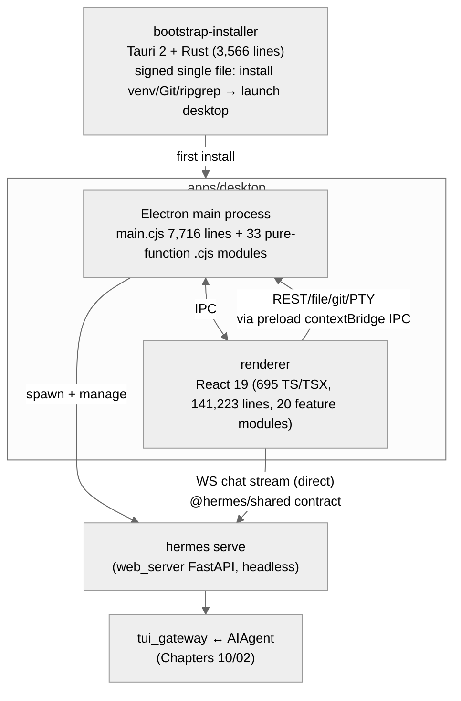
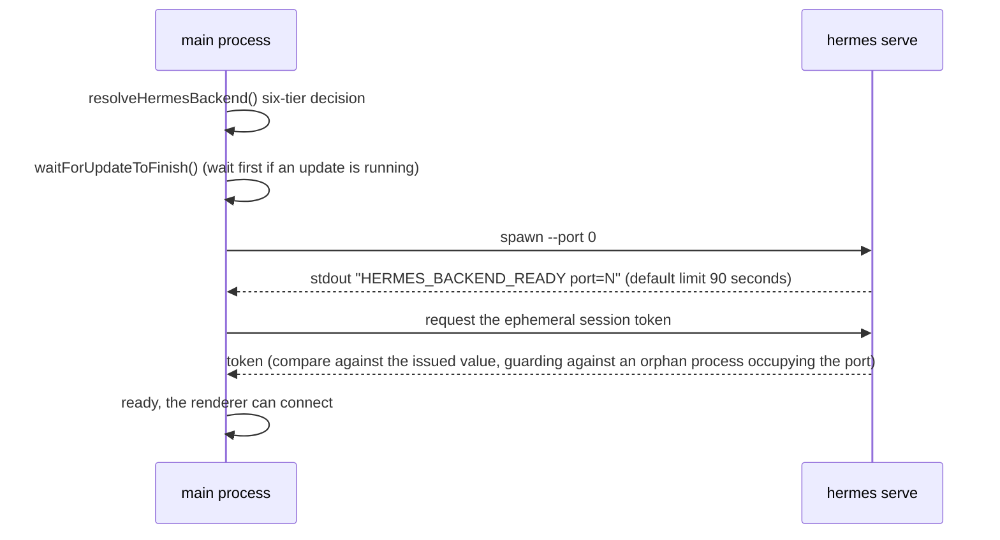

# 14 - Desktop App: Packing the Agent into a Double-Click Icon

[中文](../zh/14-桌面应用.md) | English

> **Scope**: the `apps/` directory — `desktop/` (the Electron + React 19 desktop client: 695 TS/TSX files, 141,223 lines + 68 Electron main-process .cjs files, 17,543 lines), `bootstrap-installer/` (the Tauri 2 + Rust bootstrap installer: 3,566 lines of Rust + 1,264 lines of TS), `shared/` (a 526-line shared client library). **The analysis level is architectural**: the Electron two-process model, backend hosting, the JSON-RPC contract, the feature-module map — not deep-diving individual React components. The desktop-backend integration mechanism (the swelling of web_server/tui_gateway) is in Chapter 10.
> **Key files**: `apps/desktop/electron/main.cjs` (7,716 lines, the main process), `apps/shared/src/json-rpc-gateway.ts` (the event contract), `apps/desktop/electron/backend-command.cjs` (the backend-launch strategy).

> **This chapter is based on hermes-agent v0.18.2 (tag [`v2026.7.7.2`](https://github.com/NousResearch/hermes-agent/releases/tag/v2026.7.7.2), commit `9de9c25f6`, 2026-07-07)**

---

## Why Have a Desktop App?

In the previous fourteen chapters, all of Hermes's entry points presume a terminal: the CLI wants you to know how to open a shell, the gateway wants you to know how to configure a token, and even the Web Dashboard requires `hermes web` first. For a developer this is fine; but the target user of a "self-improving personal AI assistant" shouldn't have "knows how to use a terminal" as the barrier.

`apps/desktop` is the answer given since v0.17: a cross-platform desktop app usable with a double-click (all-platform distribution: macOS DMG / Windows NSIS+MSI / Linux AppImage+deb+rpm). It's not a shell wrapping a web page — chat, session management, the setup wizard, the skill marketplace, the cron panel, the file browser, voice, the pet (petdex) are all natively-implemented React interfaces, a complete 140,000-line TypeScript application.

But it achieves **zero intrusion** on the Python body: it doesn't import any of Hermes's Python code, integrating purely through Chapter 10's web_server/tui_gateway API — the desktop app is essentially this API's first "big customer," and also the demand source that forced web_server to grow from 4,671 lines to 16,926 lines.

---

## Usage Guide

### Install and First Launch

Download the installer package for your platform from the official site or GitHub Releases. Windows/macOS users get a **bootstrap installer** (Hermes-Setup) — a signed single-file launcher, which after double-clicking is responsible for: initializing the Python virtual environment, installing dependencies like Git/ripgrep (internally driving the official install scripts like `install.ps1`), then launching the full desktop app. Later updates go through in-app updates, without re-running the installer.

After first launch is a graphical onboarding: choose a Provider, log in (supporting Nous Portal OAuth for one-click full setup), choose a model — equivalent to `hermes setup` in the terminal, but all point-and-click.

### What's in the App

- **Chat** — the main interface. Streaming replies, collapsible thinking blocks, tool-call cards, approval popups (the once/session/always/deny for dangerous commands is clicked here), the model switcher, the status bar (token usage/cost).
- **Sessions and Profiles** — the session list, search, branching; Profile switching. **The desktop and CLI share the same `~/.hermes`**: a session opened in the desktop can be reattached by `/resume` in the CLI, and vice versa.
- **Management panels** — skills (browse/install, integrating with Chapter 04's multi-source Hub), cron tasks (visual blueprint forms, integrating with Chapter 11), gateway/message-platform status (web_server also has a plugin enable/disable API `post_agent_plugin_enable/disable`, but the desktop frontend currently doesn't wire up this feature).
- **File browser and embedded terminal** — the right-sidebar project tree (tui_gateway's git_probe/project_tree RPC, Chapter 10); the embedded xterm.js terminal is started by the Electron main process locally via node-pty, communicating via contextBridge IPC (two different implementations from Chapter 10's Web Dashboard pty_bridge/WebSocket).
- **Voice** — push-to-talk (STT) and reading out replies (TTS), reusing Chapter 10's voice pipeline. Voice has no separate frontend module: the record/playback controls are embedded in the chat interface, and the on/off config is in settings — so the 20-module map below won't have a separate voice row.

### Connect to a Remote Backend

The desktop launches a local backend by default, but can also connect to a gateway on a remote machine (**Settings → Connection**): the remote runs `hermes serve`/`hermes dashboard`, with dashboard login credentials configured (basic-auth or OAuth, integrating with Chapter 08's dashboard_auth plugin), and the desktop just fills in the URL and logs in — "the company server runs the Agent, the laptop opens the interface."

### Troubleshooting

| Problem | Direction to investigate |
|---------|--------------------------|
| Stuck "connecting" after launch | The backend cold start may take a while (first launch compiles the whole Python import chain, and on Windows Defender scans each .pyc one by one, 30-60 seconds is normal, the `backend-ready.cjs` comment); check `~/.hermes/logs/gui.log` |
| Weird desktop behavior / API errors | The desktop version and backend version don't match — the desktop releases independently (package.json v0.17.0), an old backend may lack the new API; upgrade the hermes body |
| Want to see the desktop-side backend log | The fourth of the four-way logs: `~/.hermes/logs/gui.log` (web_server/pty_bridge/tui_gateway/uvicorn are all here, Chapter 13) |
| Reports "refusing its session token" | The port is occupied by a leftover orphan backend (served token ≠ spawn token and the child process is dead) — kill the old hermes process and relaunch |
| Update fails | exit code 2 = another hermes process is holding the venv (close other hermes/CLI and retry); a shallow clone / dirty working tree also blocks content updates |
| Ready timeout (slow disk + aggressive antivirus) | Set `HERMES_DESKTOP_PORT_ANNOUNCE_TIMEOUT_MS` to lengthen the wait (default 90 seconds) |
| Leftovers after uninstall | The detached cleanup script has to wait for the desktop process to exit (a ~30-second window on POSIX / 10 rmdir retries on Windows) — fully quit the app and retry |
| Uninstall | In-app uninstall or the `hermes desktop` CLI; the uninstall helper (`desktop-uninstall.cjs`) cleans up the hosted backend installation |

> 📖 **Further Reading (Official Docs):**
> - [Desktop App](https://hermes-agent.nousresearch.com/docs/user-guide/desktop)

---

## Architecture & Implementation

### The Trio: desktop, bootstrap-installer, shared



**Figure: The relationship of the desktop trio to the Python backend — the installer runs only once, the main process manages the lifecycle, the renderer goes through the API**

A fact worth remembering first: **these three things use three tech stacks** (Rust+Tauri / Node+Electron / a TypeScript library), yet none touches Python — `apps/`'s coupling to the main repo is just one HTTP/WebSocket API. The desktop has an independent version number (0.17.0) and an independent release cycle.

### Why Doesn't the Installer Use Electron?

At first glance it's odd: to install an Electron app, first write a Tauri app. The reason is in the installer's special constraints: it has to be a **single-file, small-footprint, system-signed** executable — the first thing the user downloads from a web page, watched most closely by SmartScreen/Gatekeeper. Tauri compiles a Rust binary of a few MB, while Electron starts at over a hundred MB.

The installer's execution is a stage state machine (the header comment of `bootstrap.rs` is the flow):

1. Resolve the install-script source — dev / cache / download, one of three (`install_script.rs`).
2. First run `install.ps1 -Manifest` to get the stage manifest, sending a `manifest` event to the UI.
3. Run `-Stage NAME -NonInteractive -Json` stage by stage, sending a `stage` progress event each step.
4. Send `complete` throughout; any failure or user cancellation (the mpsc cancel channel) sends `failed`.

Each platform has a special behavior. On macOS the Hermes icon in /Applications is a dual identity (`lib.rs:116-154`): both installer and launcher — detecting it's already installed, it skips the install interface and quickly launches the desktop app directly. On the Windows side, even the question of where the `windows_subsystem = "windows"` declaration should go (`main.rs`, not `lib.rs`) has a comment recording the lesson: putting it wrongly in lib.rs pops up a spurious cmd black window.

### The Electron Main Process: Backend Babysitter + 33 Pure-Function Modules

The installer's job ends here — the full desktop app it launches has its entire subsequent lifecycle of launch, auth, update, uninstall managed by the Electron main process. `main.cjs` (7,716 lines) is the heart of this lifecycle, but around this "god-file" is a ring of **pure-function modules deliberately decoupled from Electron** — `backend-command.cjs`, `backend-ready.cjs`, `backend-probes.cjs`, `connection-config.cjs`, `dashboard-token.cjs`, `bootstrap-runner.cjs` (739 lines)… these pure-function modules total **33** (the 68 top-level .cjs in `electron/` = `main.cjs` 1 + 33 modules + 34 `*.test.cjs` test files; the "68 .cjs" at the top of the chapter refers to the total including test files) — most with a matching `node --test` test file of the same name (a few exceptions: `embed-referer`/`git-repo-scan`/`preload` have no tests, and a few test files test `main.cjs`'s inline logic), the comment stating outright "kept standalone (no require('electron')) so it can be unit-tested." The main process's testable logic is all externalized, and `main.cjs` only does glue and IPC wiring — this is a direct answer to the industry-wide woe of "the Electron main process is hard to test."

The main process's management of the backend is a complete lifecycle:

0. **First decide which hermes to launch** (`resolveHermesBackend()`, `main.cjs:2985-3126`) — a six-tier decision tree, stopping at the first hit in order:
   1. The `HERMES_DESKTOP_HERMES_ROOT` environment-variable override.
   2. A developer source tree.
   3. A bootstrap-installed hosted install — the criterion is that the hosted directory (`ACTIVE_HERMES_ROOT`, i.e. `~/.hermes/hermes-agent`) has the `.hermes-bootstrap-complete` marker file written on install completion (`main.cjs:365`).
   4. A `hermes` already on PATH — it must pass a `--version` smoke test, to prevent a "half-uninstalled pip install" false positive (`backend-probes.cjs`).
   5. System Python with `hermes_cli` importable.
   6. None works — return the `bootstrap-needed` sentinel, handing over to the install flow.

   The answer to "which hermes is the desktop actually running" is only here.
1. **Launch** (`backend-command.cjs`): spawn `hermes serve --host 127.0.0.1 --port 0` — `--port 0` lets the OS assign a random port. There's a piece of compatibility logic against "an upgrade half-bricking it": `serve` is a newer subcommand (registered at `hermes_cli/subcommands/dashboard.py:137`), and if the resolved runtime doesn't recognize it yet, after statically probing its source it falls back to the equivalent `dashboard --no-open`. Before launch there are two gates:
   - `waitForUpdateToFinish()` (`main.cjs:1264`, #50238) — an app just restarted by the updater can't immediately lock the venv the updater is operating on.
   - **A failure latch** (`startHermes()`'s `bootstrapFailure`/`backendStartFailure`) — once it has failed, it re-throws the same error on every subsequent attempt, preventing renderer retries from dragging the user into a repeated-install loop.
2. **Wait for ready** (`backend-ready.cjs`): after the backend comes up it shouts a line `HERMES_BACKEND_READY port=<N>` to stdout (an old version shouted `HERMES_DASHBOARD_READY`, both recognized; there's also ready-file polling as a second detection path). The default timeout is **90 seconds** (`DEFAULT_PORT_ANNOUNCE_TIMEOUT_MS`, `:16`, a floor of 45 seconds, overridable with `HERMES_DESKTOP_PORT_ANNOUNCE_TIMEOUT_MS`) — a cold install compiles the whole import chain and Windows Defender scans each new .pyc one by one, and a pre-bind overhead of 30-60 seconds is the measured norm.
3. **Auth** (`dashboard-token.cjs`): get web_server's ephemeral session token (Chapter 10's security model). Here hides an orphan detection: if the token served on the port differs from the one it issued **and** the child process is dead, it judges the port occupied by an outside process, refuses its token, and reports `"...refusing its session token"` (`:82-86`) — it won't silently connect to a backend of unknown origin.
4. **Wrap-up** (`desktop-uninstall.cjs`): uninstall goes through a **detached cleanup script** (the running exe/venv is locked on macOS/Windows, so the script waits for the desktop process to exit first, up to ~30 seconds on POSIX, 10 rmdir retries on Windows).

Chaining steps 0-3 together is the dialogue between the main process and the backend every time you click the desktop icon:



**Figure: The backend's startup sequence from decision to ready (lifecycle steps 0-3)**

**Multi-Profile is a second lifecycle**: the main Profile's backend is managed throughout by the above set; switching to another Profile goes through `ensureBackend()`/`spawnPoolBackend()` (`main.cjs:5262-5447`) — a **backend process pool with LRU eviction**: capacity `POOL_MAX_BACKENDS` (default 3, `:787`), reclaimed after idle `POOL_IDLE_MS` (default 10 minutes) by an idle reaper that patrols every 60 seconds, with the renderer keeping it alive via a keepalive renewed every 90 seconds. Switching one Profile ≈ one more Python process — the answer to "why is memory/process count rising" is here.

**Self-update is dual-track** (the biggest flow missed in this draft's first version, filled in by the depth review):

- **Update detection (read-only)**: `checkUpdates()` (`main.cjs:1905`) does only a read-only comparison — `git fetch` + SHA comparison + `git status --porcelain`, for the UI to show "N commits behind," handling degradation to SHA comparison when a shallow clone has no merge-base (#51922), a dirty working tree, and SSH/HTTPS remote differences. It itself doesn't write anything.
- **Executing the update (`applyUpdates()`, `main.cjs:2222`)**: three branches but **all require a restart** — for a packaged install (with a staged updater) `app.quit()` hands control to the Tauri updater for the full reinstall below; on POSIX with no updater it goes through `applyUpdatesPosixInApp()` doing `hermes desktop --build-only` to rebuild then relaunch; a CLI install with no updater just gives the user a manual command, and the desktop itself does nothing. The so-called "dual-track" is actually the same update landing two ways on different platforms, there's no separate channel for "no-restart in-place incremental update." The Tauri-side `update.rs` (1,267 lines) full-reinstall four-step:
  1. Wait for the old desktop to exit (up to 20 seconds).
  2. `hermes update --yes --gateway` — update only the Python side, deliberately not rebuilding the desktop.
  3. `hermes desktop --build-only` to rebuild the desktop body.
  4. Launch the new desktop.

  Two protection mechanisms: the `UPDATE_RUNNING` atomic flag prevents React StrictMode double-mount from triggering a concurrent `git stash` dirtying the working tree; exit code **2** is a dedicated signal for "another hermes process is holding the venv" (`UPDATE_EXIT_CONCURRENT`, `update.rs:42`).

The two tracks are mutually exclusive via `waitForUpdateToFinish()` — the backend launch always waits for the update to finish first.

### The JSON-RPC Contract: @hermes/shared

Once the backend is ready, the only thing left to solve between the desktop and it is — what language to talk in. `apps/shared` (3 files, 526 lines) defines exactly this language: it's the client library shared by the desktop and the Web Dashboard, at its core `JsonRpcGatewayClient` (`json-rpc-gateway.ts`), and the `GatewayEventName` event vocabulary it defines is the **entire vocabulary** between the desktop and the backend:

```
gateway.ready · session.info
message.start / delta / complete
thinking.delta · reasoning.delta / available
status.update
tool.start / progress / complete / generating
clarify.request · approval.request · sudo.request · secret.request
background.complete · error · skin.changed
```

This vocabulary maps one-to-one to the mechanisms of the previous chapters: `message.delta` is the final outlet of Chapter 02's `_fire_stream_delta`; the `tool.*` trio corresponds to Chapter 05's stream_events ToolCallChunk; the four request events `clarify/approval/sudo/secret.request` correspond to the three callbacks in Chapter 01's callbacks.py plus the sudo gate — the desktop's approval popup is the UI-ification of these events; `skin.changed` lets a skin switched in the CLI change in sync in the desktop.

**Frame format: one WebSocket runs two frame kinds**. Client→server is a standard JSON-RPC 2.0 request (`{jsonrpc, id, method, params}`, `request()` default timeout 120 seconds, connection timeout 15 seconds — the comment states outright "a reconnect after sleep-wake can't hang forever"); the server→client event push is a **no-id notification disguised as `method:'event'`**, with the real event type in `params.type`. A third-party frontend wanting to reuse this protocol has to know this frame structure first.

**Reconnection isn't at this layer** — `JsonRpcGatewayClient` only handles the connection state machine (`idle/connecting/open/closed/error`) and pending-request settlement; the exponential-backoff reconnect loop lives in the renderer's `app/gateway/hooks/use-gateway-boot.ts`: `min(15s, 1s × 2^min(attempt,4))`, escalating to an explicit failure state after `RECONNECT_ESCALATE_AFTER = 6` consecutive failures (~45 seconds). In the OAuth scenario a ticket must also be re-minted before each reconnect — the ticket is one-time. For troubleshooting "spinning forever" go to use-gateway-boot.ts, don't look in the shared library.

`websocket-url.ts` handles the URL construction for the two remote-authentication models, with the discrimination and enforcement rules in `connection-config.cjs` (283 lines + 396 lines of tests): splitting by the remote `/api/status`'s `auth_required` — **token mode** connects directly with `?token=`; **OAuth mode** first mints a one-time `?ticket=` by `POST`ing `/api/auth/ws-ticket` before each connection. A ticket-minting failure must hard-fail — otherwise a false positive of "HTTP probe passes, WS can't connect" would appear.

The OAuth session itself is maintained by two levels of cookie: `hermes_session_at` (Access Token, ~15 minutes) + `hermes_session_rt` (Refresh Token, 24-hour rolling). The liveness judgment for "whether to attempt connection / show as logged in" uses `cookiesHaveLiveSession()` — **either the AT or RT cookie existing counts as live** (not only recognizing RT): the AT expiring every 15 minutes is a designed norm, and as long as the 24-hour RT is still there, the gateway middleware silently swaps a new AT with the RT on the next request; if it only recognized the AT, the user would be forced to re-login every 15 minutes. The truly authoritative liveness validation is minting a ws-ticket at connection time (when the RT is also invalid it returns a genuine 401). The corresponding `cookiesHaveSession()` is the version that "only checks the AT isn't expired."

### The Map of 20 Feature Modules

This protocol is the skeleton, and the renderer's `src/app/` grew 20 feature-domain modules on top of it — the map (with TS/TSX line counts):

| Module | Lines | Content |
|--------|-------|---------|
| chat | 20,943 | main chat: streaming rendering, thinking blocks, tool cards, approval UI |
| session | 9,641 | session list/search/branch/resume |
| settings | 8,858 | settings and the onboarding wizard |
| right-sidebar | 5,503 | right sidebar: project tree, git status (consuming tui_gateway's git_probe/project_tree RPC); the **embedded xterm.js terminal** is also here (the `terminal/` subdirectory, 2,253 lines, going through IPC to the main process's node-pty). Note: the desktop groups sessions by **Projects** (named workspaces, a per-profile `projects.db`, the backend `tools/project_tools.py`'s `project` toolset visible only to GUI sessions) — a subsystem unique to desktop/TUI, absent from CLI/messaging/cron |
| starmap | 3,817 | session Star Map visualization (Star Map / Memory Graph — the same `agent.learning_graph` data also feeds the CLI's `hermes journey` command and the `/journey` TUI overlay, same-source across three surfaces) |
| skills | 3,014 | skill browse/install (integrating the multi-source Hub, Chapter 04) |
| shell | 2,942 | the app shell: title bar/status bar/model menu (not the terminal — the terminal is in right-sidebar/terminal) |
| command-palette / command-center | 1,319 / 1,094 | the command palette |
| profiles | 1,081 | Profile switching |
| artifacts | 1,046 | artifact preview |
| pet-generate / pet-overlay | 993 / 494 | the desktop pet (petdex, linked to Chapter 04's built-in skills) |
| cron | 955 | the scheduled-task panel (blueprint forms, Chapter 11) |
| messaging / gateway | 872 / 842 | message platforms and gateway status |
| overlays / hooks / agents / learning | 725 / 453 / 390 / 74 | overlays / shared hooks / subagent view / learning panel |

**The two-process communication boundary** (preload.cjs, 230 lines) deserves a sentence of its own: the renderer **can't send REST directly** — except for the chat WS direct connection, all REST calls, file system (readDir/reveal/trash), git operations (worktree/branch/review), the terminal PTY, and the pet overlay window all go through the `hermesDesktop.*` API exposed by `contextBridge` via IPC, proxied by the main process (`ipcMain.handle('hermes:api', ...)`). This is the standard posture of the Electron security model (the renderer has no Node privileges), and also explains that long string of `ipcMain.handle` in main.cjs.

A restatement of the scoping stance: this table is **a map, not a tour guide** — the React component structure inside each module isn't in this chapter's (nor this series') scope. What's worth noting is the distribution shape: chat alone takes nearly 15% of the renderer code, consistent with "chat is the desktop app's main battleground"; while management panels like cron/skills/plugins are all thin — the heavy lifting is all in the Python-side API, and the frontend is just forms.

### Design Decisions

#### A Full Application, Not a Web Shell

The easiest way to make a desktop app is Electron wrapping a layer of the Web Dashboard, done. Hermes chose to rewrite native React interfaces, reusing only the API. The cost is 140,000 lines of frontend code; what it buys is a desktop-grade experience (the pet overlay, the command palette, the system tray, the PTY terminal) and the freedom for the desktop and the Web Dashboard to evolve separately. `@hermes/shared` is the greatest common divisor the two share — the contract shared, the interfaces diverging.

#### Zero Intrusion on Python

The desktop's entire dependency on the main repo is one HTTP/WebSocket API plus a stdout ready handshake. The Python side's awareness of "desktop" is compressed into a few environment-variable switches (`HERMES_DESKTOP=1` etc.) — web_server uses it to switch behavior, the visibility of the two tools `read_terminal`/`close_terminal` is gated by it, and `hermes_cli/main.py` injects a set of desktop-specific environment variables based on it. The surface is narrow and all switch-style, with no Python module importing desktop code or depending on the desktop's internal structure. This lets the desktop release independently (a 0.17.0 desktop paired with a 0.18.2 backend), and also forces the backend API to stay backward-compatible — the `serve`/`dashboard --no-open` dual-track compatibility is the product of this constraint.

#### Main-Process Logic Made Pure-Functional

Its form was already described above (33 pure-function modules with no electron dependency, tests nearly one-to-one); as a decision, what's worth noting is the isolation strategy it chose. Facing the industry-wide woe of "the Electron main process is hard to test," another common path is to wrap the main process into a dependency-injectable class and mock out electron at test time — desktop chose to physically split files: the code under test simply doesn't `require('electron')`, so testing needs no electron runtime or mocking infrastructure, and `node --test` runs bare. The cost is that `main.cjs`, left with only glue and IPC wiring, still has 7,716 lines. It's the same direction as the Python-side god-file decomposition (Chapter 00): rather than making the giant file testable, have the testable parts leave the giant file.

### Extension Points

1. **Remote backend**: any machine running `hermes serve` can be the desktop's backend.
2. **Auth methods**: the dashboard_auth plugin (Chapter 08) extends login methods.
3. **Shared client library**: `@hermes/shared` can be reused by a third-party frontend — the event vocabulary is the public contract.

---

## Relationship to Other Chapters

| Related chapter | Relationship |
|-----------------|--------------|
| 00 — Project Overview | apps/ is the codebase's seventh area |
| 01 — Infrastructure Layer | shares HERMES_HOME; the Profile system directly usable |
| 02 — Agent Core | the ultimate producer of message/tool/approval events |
| 08 — Built-in Plugins | dashboard_auth provides the remote-login method |
| 10 — Interaction Interfaces | web_server/tui_gateway is the desktop's backend (the integration mechanism detailed there) |
| 11 — Cron Scheduling | the desktop embeds a cron ticker, triggering on time even without a gateway |
| 13 — Engineering Practices | gui.log is the desktop side's log destination |

---

*This document is based on source analysis of hermes-agent v0.18.2. All code references have been independently verified.*
