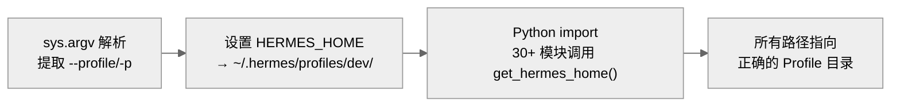
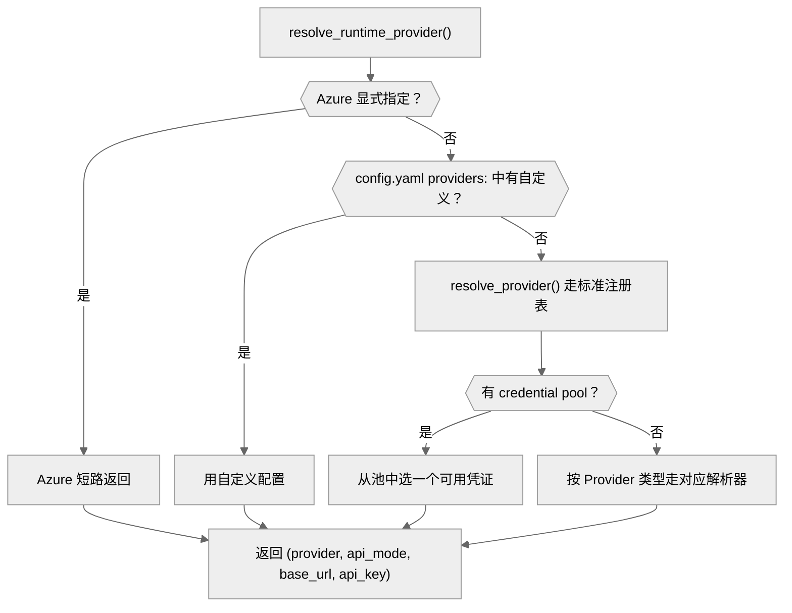
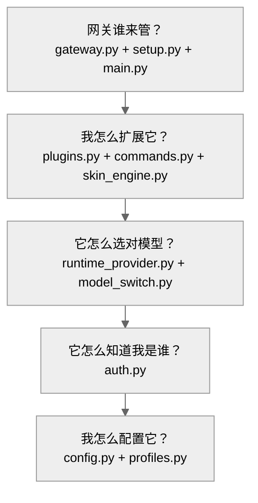

# 01-基础设施层：97 个文件撑起的控制平面

中文 | [English](../en/01-infrastructure.md)

> **本章定位**：`hermes_cli/` 目录（97 个 .py 文件，约 101,700 行，含 proxy/ 子模块）——CLI 子命令、配置系统、认证系统、插件管理、Profile 隔离、网关服务管理。
> **关键类**：`main()`（`main.py:10953`）、`DEFAULT_CONFIG`（`config.py:503`）、`PROVIDER_REGISTRY`（`auth.py:183`）、`PluginManager`（`plugins.py:883`）。

> **本章基于 hermes-agent commit [`3bace071b`](https://github.com/NousResearch/hermes-agent/commit/3bace071b)（2026-05-24）**

---

## 为什么要单独分析 hermes_cli？

上一章追踪了一条消息的旅程——从用户输入到 Agent 回复。但在消息进入 Agent 核心之前，有一整套基础设施必须先就位：你的 API Key 从哪来？配置文件怎么加载？插件怎么发现？Profile 怎么隔离？网关进程谁来管？

这些问题的答案都在 `hermes_cli/` 里。它是 hermes-agent 的**控制平面**——不直接参与对话，但决定了对话在什么环境下发生。它有约 101,700 行代码（含 proxy/ 子模块），是整个项目最大的模块，比 Agent 核心（63,679 行）和网关层（80,025 行）都大。

---

## 使用指南

### 基本用法

`hermes` 命令是日常使用的主入口。不带参数就进入交互式对话：

```bash
hermes                    # 交互式对话
hermes chat -z "总结这个目录" # 非交互式单次任务（oneshot 模式）
hermes setup              # 运行配置向导
hermes model              # 切换模型和 Provider
hermes tools              # 管理工具集启用/禁用
hermes gateway start      # 启动消息网关服务
hermes profile create dev # 创建名为 dev 的独立 Profile
hermes doctor             # 诊断环境问题
hermes update             # 更新到最新版本
```

### 配置

hermes_cli 的配置系统分三层，优先级从高到低：

| 层级 | 位置 | 用途 |
|------|------|------|
| CLI flag | `--model`、`--provider` 等 | 临时覆盖 |
| 环境变量 / .env | `~/.hermes/.env` | API Key 等敏感信息 |
| config.yaml | `~/.hermes/config.yaml` | 持久化配置 |

`DEFAULT_CONFIG`（`config.py:503`）是配置 schema 的权威来源——一个 1289 行的嵌套字典，约 60 个顶层 key。以下是最常用的几个：

```yaml
# 最常用的配置项
model:
  default: "anthropic/claude-opus-4.6"
  provider: "openrouter"

agent:
  max_turns: 90          # Agent 最大迭代次数
  gateway_timeout: 1800  # 网关模式超时（秒）

terminal:
  backend: "local"       # 执行后端：local/docker/ssh/modal/daytona/singularity/vercel

security:
  require_approval: true # 危险命令需要审批

display:
  skin: "default"        # 主题：default/ares/mono/slate 等 9 种
```

配置加载有一个精妙的缓存机制：`load_config()`（`config.py:4377`）用文件的 `(mtime_ns, size)` 作为缓存键——不需要显式的失效信号，文件一改缓存自动过期。这对长时间运行的 Gateway 进程很重要：用户可以随时编辑 `config.yaml`，下一次 Agent 调用就会自动读到新配置。

### 常见场景

**场景一：从零配置到第一次对话。** `hermes setup` 启动配置向导（`setup.py:3176`），分六个步骤：选 Provider 和模型 → 配 TTS → 选终端后端 → 配消息平台 → 配工具集 → 设 Agent 参数。每个步骤可独立运行（以 `hermes setup model` 为例）。

**场景二：多 Profile 隔离。** 你可能需要为不同项目使用不同的配置——一个用 Claude 做代码审查，一个用 DeepSeek 做数据分析。`hermes profile create coder --clone` 会完整复制当前配置到新 Profile（`profiles.py:636`），之后用 `hermes -p coder` 切换，或者直接用自动生成的 wrapper 脚本 `coder` 作为快捷命令。

**场景三：安装 Gateway 为系统服务。** `hermes gateway install` 根据操作系统自动生成 systemd unit 文件（Linux）或 launchd plist（macOS），让网关随系统启动（`gateway.py:5006`）。

### 排错指引

| 问题 | 排查方向 |
|------|---------|
| `hermes` 启动很慢 | Android/Termux 上有三级快速启动优化（`main.py:10842`），如果没触发检查 Python 版本 |
| 配置改了没生效 | `load_config()` 用 mtime 缓存，确认文件确实保存了（`stat()` 检查 mtime_ns + size）。如果文件已保存但仍无效，可能是 Gateway 进程的旧缓存——重启 Gateway 即可 |
| config.yaml 语法错误 | `load_config()` 会静默回退到 `DEFAULT_CONFIG`（所有用户覆盖被丢弃），但会通过 `_warn_config_parse_failure()`（`config.py:37`）输出警告到 stderr 和 `agent.log`。检查 `hermes logs` 或 stderr 输出中的 YAML 解析错误 |
| auth.json 损坏 | 所有读写通过 `_auth_store_lock()`（`auth.py:971`）文件锁序列化。如果锁文件残留（`auth.json.lock`），手动删除后重试。如果 JSON 本身损坏，删除 `~/.hermes/auth.json` 后重新 `hermes login` |
| 插件加载失败 | 检查 `plugins.enabled` 配置项白名单；`hermes plugins list` 查看发现了哪些插件。单个插件加载失败不会阻止其他插件——错误被隔离 |
| 插件钩子没触发 | 确认钩子名在 `VALID_HOOKS`（`plugins.py:128`，共 17 种）中；确认插件的 `plugin.yaml` 中 `provides_hooks` 声明了该钩子；检查 `hermes plugins list` 确认插件状态为 enabled |
| Profile 切换后配置不对 | `_apply_profile_override()`（`main.py:183`）必须在 import 前执行。如果通过其他方式启动（以直接调用 Python 脚本为例），`HERMES_HOME` 可能未设置——检查 `get_hermes_home()` 返回的路径是否指向预期 Profile |
| Provider 认证失败 | `hermes auth status` 查看各 Provider 认证状态；OAuth token 过期需要重新 `hermes login`；检查 `~/.hermes/.env` 中的 API Key 变量名是否与 `PROVIDER_REGISTRY` 中的 `api_key_env_vars` 匹配 |
| migrate_config 后字段丢失 | `migrate_config()`（`config.py:3548`）做增量迁移，不会删除已有字段。如果字段丢失，可能是 YAML 语法错误导致整个文件被跳过（见上方"config.yaml 语法错误"） |

> 📖 **延伸阅读（官方文档）：**
> - [CLI 使用指南](https://hermes-agent.nousresearch.com/docs/user-guide/cli)
> - [配置参考](https://hermes-agent.nousresearch.com/docs/user-guide/configuration)
> - [Profile 管理](https://hermes-agent.nousresearch.com/docs/user-guide/profiles)
> - [插件系统](https://hermes-agent.nousresearch.com/docs/user-guide/features/plugins)

---

## 架构与实现

hermes_cli 的 97 个文件回答的是五个用户会在不同时刻遇到的问题。每个问题对应一组模块，理解了问题就理解了模块存在的原因。

### 我怎么配置它？—— 配置系统

你安装完 hermes-agent，第一件事是配置。但 hermes-agent 有约 1100 行可调参数——从模型选择、终端后端到安全策略、显示主题，几乎每个行为都能调。如果把这些全放环境变量，你的 shell 启动命令会变成一条怪兽级的 `export` 语句。

hermes-agent 的解决方案是 **config.py**（5,598 行）。`DEFAULT_CONFIG`（`config.py:503`）是一个 1289 行的嵌套字典，定义了所有合法的配置键和默认值。用户的 `~/.hermes/config.yaml` 只需要覆盖想改的字段，加载时和 `DEFAULT_CONFIG` 做深度合并（`_deep_merge()`，`config.py:4127`），其余自动取默认值。配置中的 `${VAR}` 引用在加载时被展开（`_expand_env_vars()`，`config.py:4147`），所以你可以写 `api_key: "${OPENROUTER_API_KEY}"` 让配置文件引用环境变量而不暴露密钥。

一个精妙的细节：`load_config()`（`config.py:4377`）用文件的 `(mtime_ns, size)` 作为缓存键。不需要显式的失效信号——文件一改缓存自动过期。这对长时间运行的 Gateway 进程很重要：用户随时可以编辑 `config.yaml`，下一次 Agent 调用就会自动读到新配置，不需要重启任何进程。

版本升级时配置文件怎么办？`migrate_config()`（`config.py:3548`）做增量迁移——新版本增加了字段，迁移函数自动补上，用户无感知。

但如果你需要为不同项目使用完全不同的配置——一个用 Claude 做代码审查，一个用 DeepSeek 做数据分析——单个 config.yaml 就不够了。

### 我怎么隔离多个环境？—— Profile 系统

**profiles.py**（1,470 行）实现了多 Profile 隔离。每个 Profile 是 `~/.hermes/profiles/<name>/` 下的一个完整 HERMES_HOME 副本：独立的 `config.yaml`、`.env`、`sessions/`、`memories/`、`skills/`、`cron/`。Profile 之间完全隔离——一个 Profile 的记忆不会泄漏到另一个。

Profile 切换有一个反直觉的设计：`main.py` 在任何模块 import 之前就解析 `--profile/-p` 参数（`_apply_profile_override()`，`main.py:183`），直接修改 `os.environ["HERMES_HOME"]`。



**图：Profile 切换必须在 import 之前完成——否则 30+ 个模块会使用错误的路径**

为什么这么早？因为 `get_hermes_home()`（`hermes_constants.py:43`）被 30+ 个模块在 import 时调用——如果 Profile 切换发生在 import 之后，这些模块已经用了默认路径，切换就无效了。代价是需要在 argparse 之前手动解析 `sys.argv`，但这是唯一可行的方案。

配置和 Profile 就位之后，下一个问题才有意义：这个配置里声明的 Provider，凭什么相信你是你？

### 它怎么知道我是谁？—— 认证系统

**auth.py**（7,605 行）管理的就是身份问题。hermes-agent 支持 30+ 种 Provider，每种的认证方式都不一样——有的用 API Key，有的用 OAuth，有的用 AWS IAM。如果为每种 Provider 写一套独立的认证逻辑，代码会爆炸。

`PROVIDER_REGISTRY`（`auth.py:183`）是一个统一的注册表，用 `ProviderConfig` 数据类（`auth.py:167`，字段包括 `id`、`name`、`auth_type`、`inference_base_url`、`api_key_env_vars` 等）描述每个 Provider 的身份信息。30+ 种 Provider 归纳为六种认证方式：

| 认证方式 | 适用 Provider | 机制 |
|---------|--------------|------|
| `oauth_device_code` | Nous Portal | RFC 8628 设备码流程 |
| `oauth_external` | OpenAI Codex、xAI Grok、Gemini CLI | 本地回调 + PKCE |
| `oauth_minimax` | MiniMax | 自定义设备码变体 |
| `api_key` | Anthropic、OpenAI、DeepSeek、NVIDIA 等 | 环境变量或 auth.json |
| `external_process` | GitHub Copilot ACP | 从子进程获取 token |
| `aws_sdk` | Bedrock | IAM 凭证 |

所有认证状态持久化在 `~/.hermes/auth.json` 中，通过文件锁（`_auth_store_lock()`，`auth.py:971`）实现跨进程安全——Gateway 和 CLI 可以同时读写而不会损坏数据。

一个重要的设计：`PROVIDER_REGISTRY` 虽然是静态定义的，但在模块加载时会自动扩展（`auth.py:459`）——它扫描 `plugins/model-providers/` 下的插件，把插件注册的 Provider 也加入注册表。这意味着新增一个 Provider 只需要写一个插件目录，不需要改 `auth.py`。

但身份验证只回答了"你是谁"。Agent 每次调用模型时，还需要知道"往哪发请求、用什么协议"。

### 它怎么选对模型？—— Provider 运行时解析

用户说"我要用 OpenRouter 的 Claude"，但 Agent 核心需要的是一个精确的三元组：往哪发请求（`base_url`）、用什么身份（`api_key`）、用哪种 API 协议（`api_mode`——比如 OpenAI 兼容的 `chat_completions` 模式，或原生 Anthropic 的 `anthropic_messages` 模式）。

**runtime_provider.py**（1,668 行）负责这个翻译。`resolve_runtime_provider()`（`runtime_provider.py:1200`）每次 Agent 调用模型时都会执行，走一条精心设计的优先级链：



**图：runtime_provider 的凭证解析优先级链**

解析按以下优先级依次尝试，命中则停止：

1. **Azure 显式指定**（`runtime_provider.py:1224`）——如果 `provider=anthropic` 且 `base_url` 包含 `azure.com`，直接走 Azure Anthropic 短路路径，返回 `anthropic_messages` 模式
2. **Azure Foundry**（`runtime_provider.py:1244`）——用户配置了 `provider: azure-foundry` 时，走 Azure 专用解析（支持 Entra ID 无密钥认证）
3. **自定义 Provider**（`runtime_provider.py:1254`）——`config.yaml` 的 `providers:` 节中用户定义的非标准端点（以私有 vLLM 服务为例），直接使用用户配置的 base_url 和 api_key
4. **标准注册表**（`runtime_provider.py:1263`）——走 `auth.py` 的 `PROVIDER_REGISTRY` 解析，匹配已知 Provider
5. **Credential Pool**（可选）——如果配置了多 Key 轮转，从池中选一个当前可用的凭证（详见第 02 章的 Credential Pool 一节）
6. **Provider 类型解析器**——根据匹配到的 Provider 类型，调用对应的凭证解析函数（以 Nous OAuth 为例，走 JWT invoke 路径；以 API Key Provider 为例，从 `.env` 或 `auth.json` 读取）

为什么不直接读配置文件拿 API Key？因为现实比这复杂得多：OAuth token 需要刷新、Credential Pool 需要轮转限流的 Key、Azure 需要特殊处理 Entra ID 认证、自定义 Provider 的 base_url 可能来自环境变量。这个函数把所有复杂性集中在一处，Agent 核心只需要拿到一个干净的三元组。

**model_switch.py**（1,799 行）处理模型切换——当用户输入 `/model sonnet` 时，它需要把别名解析为完整的 `(provider, model_id)`。`resolve_alias()`（`model_switch.py:450`）会依次查找：`config.yaml` 的 `model_aliases:` 节（用户自定义别名）→ Provider 模型目录 → 模糊匹配。

### 我怎么扩展它？—— 插件、命令、主题

一个框架如果不能扩展，就会被 fork。hermes_cli 提供了三个正式的扩展机制。

**插件系统。** `PluginManager`（`plugins.py:883`）从四个来源发现插件：内置（`<repo>/plugins/`，16 个类别）、用户（`~/.hermes/plugins/`）、项目级（`./.hermes/plugins/`，需开启 `HERMES_ENABLE_PROJECT_PLUGINS`）、pip entry-points。每个插件通过 `PluginContext` 对象（`plugins.py:287`）注册工具、钩子和命令。钩子系统支持 17 种生命周期事件（`VALID_HOOKS`，`plugins.py:128`），覆盖工具调用、用户审批、网关消息分发等关键节点——插件可以在任意一个节点注入自定义逻辑。详见第 07 章。

**斜杠命令。** `COMMAND_REGISTRY`（`commands.py:64`）是约 70 个命令定义的单一注册表。同一份注册表被 CLI、Gateway、Telegram Bot、Discord Slash Commands、Slack App Manifest 共用——不同平台通过 `cli_only`/`gateway_only` 标记过滤。

**主题引擎。** `skin_engine.py`（926 行）是纯数据驱动的——9 个内置主题（default、ares、mono、slate 等），用户放一个 YAML 文件到 `~/.hermes/skins/` 就能自定义颜色、spinner 动画、品牌文案。不需要改代码。

### 网关谁来管？—— 服务生命周期

**gateway.py**（5,445 行）管理网关进程的完整生命周期：启动、停止、重启、安装为系统服务、诊断。它的 OS 感知设计覆盖了 systemd（Linux，用户和系统两种 scope）、launchd（macOS）、手动进程跟踪（Windows/WSL/Docker），回退到 `gateway.pid` 文件。

**setup.py**（3,607 行）是交互式配置向导的编排器，分五个步骤（选 Provider → 选终端后端 → 设 Agent 参数 → 配消息平台 → 配工具集）。它本身不实现任何配置逻辑——每个步骤都委托给专门的模块。

**main.py**（13,847 行）是 `hermes` 命令的入口，构建 argparse 解析树，为每个子命令定义 `cmd_*` 函数。这些函数大多是薄代理——import 对应的子模块然后委托执行，让每个子命令的启动只加载它需要的模块。main.py 还包含约 19 个 per-Provider 的模型配置流程（`_model_flow_*()`），处理 OAuth 登录、API Key 验证、模型选择等交互逻辑。

### 两个横切问题

以上五个问题覆盖了 hermes_cli 的主线功能。但还有两个问题横跨多个模块，不属于任何一个问题域。

#### Agent 线程和 TUI 线程怎么协调？

Agent 的工具系统在后台线程中运行，但某些操作需要用户交互——澄清问题、审批危险命令、输入 API Key。用户交互发生在 prompt_toolkit 的主线程事件循环中。两个线程怎么协调？

`callbacks.py`（242 行）用一个经典的模式解决：三个回调函数（`clarify_callback()`、`approval_callback()`、`prompt_for_secret()`）都设置 CLI 状态 → 让 TUI 刷新界面 → 在 `queue.Queue` 上阻塞等待用户响应，每秒轮询一次检查超时。用队列避免了共享状态的锁竞争。

#### Kanban 为什么在 hermes_cli 里？

`kanban.py`（2,762 行）+ `kanban_db.py`（6,579 行）是一个完整的多 Agent 协作系统——看板、DAG 任务依赖（`_would_cycle()`，`kanban_db.py:1906`）、乐观锁认领（UUID + TTL）、断路器（`consecutive_failures` + `max_retries`）。每个看板是一个独立的 SQLite 文件，备份和归档只需复制 .db 文件。

它驻留在 `hermes_cli/` 而不是独立模块，是因为用户通过 `hermes kanban` 子命令直接操作看板，无需启动完整 Agent。详细的 DAG 任务调度和多 Agent 协作机制在第 09 章展开。

### 全景总结



**图：hermes_cli 五个问题的依赖关系——上层问题依赖下层问题先被解决**

### 代码组织

```
hermes_cli/
├── main.py              — 入口 + argparse + cmd_* 分发（13,847 行）
├── config.py            — 配置加载/保存/迁移/验证（5,598 行）
├── auth.py              — PROVIDER_REGISTRY + OAuth/API Key 管理（7,605 行）
├── runtime_provider.py  — 运行时 Provider 解析（1,668 行）
├── gateway.py           — 网关服务生命周期管理（5,445 行）
├── setup.py             — 交互式配置向导（3,607 行）
├── plugins.py           — PluginManager + 钩子生命周期（1,725 行）
├── profiles.py          — Profile 创建/删除/切换/导入/导出（1,470 行）
├── commands.py          — COMMAND_REGISTRY 斜杠命令注册表（1,819 行）
├── tools_config.py      — 工具集启用/禁用管理（3,303 行）
├── model_switch.py      — /model 命令实现 + 别名解析（1,799 行）
├── kanban.py            — Kanban CLI 子命令（2,762 行）
├── kanban_db.py         — Kanban SQLite 持久化 + DAG 任务（6,579 行）
├── callbacks.py         — Agent↔TUI 线程间回调桥接（242 行）
├── skin_engine.py       — 主题引擎（926 行）
├── skills_config.py     — 技能启用/禁用（177 行）
├── web_server.py        — Web Dashboard FastAPI 后端（4,671 行）
├── goals.py             — Goals / Ralph Loop 跨轮次目标持续（762 行）
├── doctor.py            — hermes doctor 环境诊断（2,012 行）
├── backup.py            — hermes backup/import 数据迁移（937 行）
├── checkpoints.py       — 文件系统快照管理（244 行）
├── proxy/               — Subscription Proxy 本地代理（7 个 .py，947 行）
├── models.py            — 模型目录查询
├── claw.py              — OpenClaw 迁移
└── ...（另 ~60 个功能文件）
```

### 设计决策

#### 决策一：13,847 行的入口文件

`main.py` 是整个项目第二大的单文件（仅次于 `cli.py`）。它包含了所有子命令的分发逻辑和约 19 个 Provider 配置流程。为什么不拆分？

Provider 配置流程虽然多，但它们之间高度相似（都是"选模型 → 验证凭证 → 写配置"的变体），放在一个文件里可以用 grep 一次性搜索。如果拆成 30 个文件，改一个共性逻辑需要改 30 处。这是"上帝文件"策略在 hermes-agent 中的又一个体现。

#### 决策二：Termux 三级快速启动

在 Android/Termux 上，Python import 开销因 eMMC 的慢随机 I/O 而显著放大。`main.py` 为此设计了三级加速（`main.py:10842`）：
1. **超快版本检查**（import 前）：`hermes version` 和 `hermes --version` 不需要加载任何模块
2. **快速 TUI 启动**：`hermes --tui` 直接 exec Node.js，跳过 Python 子命令解析
3. **快速 CLI 启动**：裸 `hermes` 和 `hermes -z` 跳过完整 argparse，直接进入对话

#### 决策三：插件白名单

插件不是默认全部加载的。`plugins.enabled` 配置项控制白名单——只有显式列出的插件才会被加载。这是一个安全决策：第三方插件可以注册任意工具和钩子，无限制加载会带来安全风险。`migrate_config()` 在用户升级时会自动把已有的用户插件加入白名单，避免升级后插件突然消失。

### 扩展点

1. **自定义 Provider**：在 `config.yaml` 的 `providers:` 节添加条目即可，不需要改代码
2. **自定义插件**：`~/.hermes/plugins/<name>/` 下放 `plugin.yaml` + Python 模块
3. **自定义主题**：`~/.hermes/skins/<name>.yaml`
4. **自定义斜杠命令**：通过插件的 `ctx.register_command()` 注册
5. **自定义模型别名**：`config.yaml` 的 `model_aliases:` 节

---

## 与其他章节的关系

| 关联章节 | 关系 |
|---------|------|
| 00 — 项目全景 | hermes_cli 是 00 中"入口层"的具体实现 |
| 02 — Agent 核心 | hermes_cli 创建并配置 AIAgent 实例，通过 `runtime_provider` 提供凭证 |
| 03 — 工具系统 | `tools_config.py` 管理工具集的启用/禁用 |
| 05 — 网关层 | `gateway.py` 管理网关进程的生命周期 |
| 07 — 插件框架 | `plugins.py` 是插件系统的宿主端实现 |
| 09 — Kanban 系统 | `kanban.py` + `kanban_db.py` 是 Kanban 的 CLI 入口和持久化层 |

---

*本文基于 hermes-agent v0.14.0 源码分析。所有代码引用均经过独立验证。*
