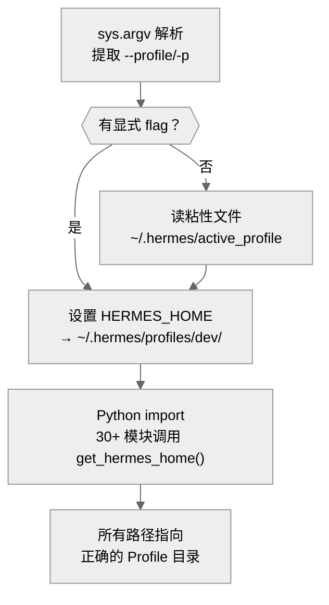
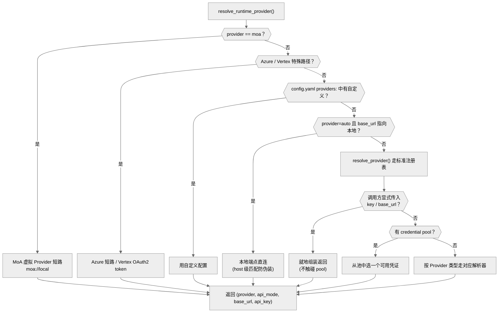
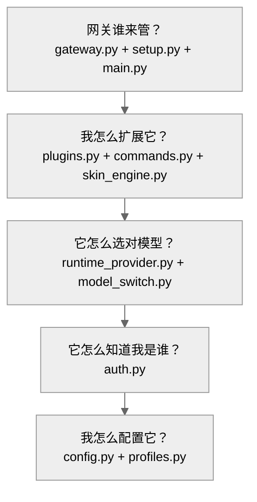
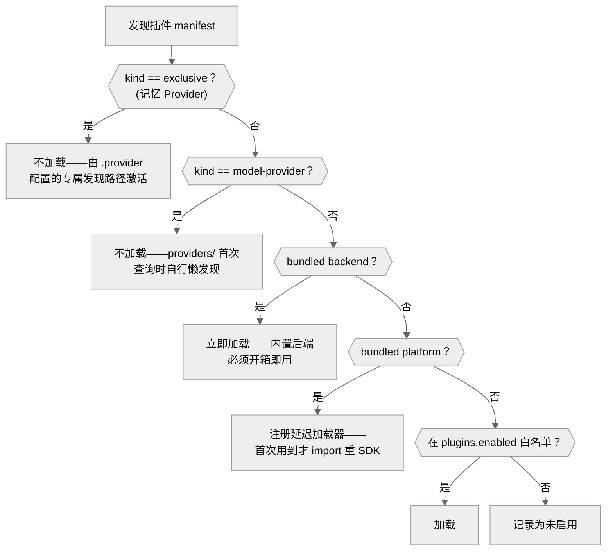

# 01-基础设施层：203 个文件撑起的控制平面

中文 | [English](../en/01-infrastructure.md)

> **本章定位**：`hermes_cli/` 目录（203 个 .py 文件，约 163,000 行，含 proxy/、subcommands/ 子模块）——CLI 子命令、配置系统、认证系统、插件管理、Profile 隔离、网关服务管理。
> **关键类**：`main()`（`main.py:12703`）、`DEFAULT_CONFIG`（`config.py:906`）、`PROVIDER_REGISTRY`（`auth.py:176`）、`PluginManager`（`plugins.py:1246`）。

> **本章基于 hermes-agent v0.18.2（tag [`v2026.7.7.2`](https://github.com/NousResearch/hermes-agent/releases/tag/v2026.7.7.2)，commit `9de9c25f6`，2026-07-07）**

---

## 为什么要单独分析 hermes_cli？

上一章追踪了一条消息的旅程——从用户输入到 Agent 回复。但在消息进入 Agent 核心之前，有一整套基础设施必须先就位：你的 API Key 从哪来？配置文件怎么加载？插件怎么发现？Profile 怎么隔离？网关进程谁来管？

这些问题的答案都在 `hermes_cli/` 里。它是 hermes-agent 的**控制平面**——不直接参与对话，但决定了对话在什么环境下发生。它有约 163,000 行代码（含 proxy/、subcommands/ 子模块和 Web Dashboard 后端），是整个项目最大的模块，比 Agent 核心（93,837 行）和网关层（77,883 行）都大。

---

## 使用指南

### 基本用法

`hermes` 命令是日常使用的主入口。不带参数就进入交互式对话：

```bash
hermes                    # 交互式对话
hermes chat -z "总结这个目录" # 非交互式单次任务（oneshot 模式）
hermes setup              # 运行配置向导
hermes model              # 切换模型和 Provider
hermes tools              # 管理工具集启用/禁用
hermes gateway start      # 启动消息网关服务
hermes profile create dev # 创建名为 dev 的独立 Profile
hermes doctor             # 诊断环境问题
hermes update             # 更新到最新版本
```

### 配置

hermes_cli 的配置系统分层，优先级从高到低：

| 层级 | 位置 | 用途 |
|------|------|------|
| CLI flag | `--model`、`--provider` 等 | 单次调用的临时覆盖 |
| config.yaml | `~/.hermes/config.yaml` | 一切非密钥配置（两边都设时它赢） |
| 环境变量 / .env | `~/.hermes/.env` | API Key 等密钥**必须**放这里 |

此外还有一个多数用户不会碰到的层：**托管作用域**（managed scope，`hermes_cli/managed_scope.py`）——IT 管理员把 `config.yaml`/`.env` 放进 root 所有的 `/etc/hermes/`，其中的值按叶键覆盖用户配置，用户不可改。这是企业集中管控场景的钉死机制（详见下文"架构与实现"）。

`DEFAULT_CONFIG`（`config.py:906`）是配置 schema 的权威来源——一个 2,327 行的嵌套字典，76 个顶层 key。以下是最常用的几个：

```yaml
# 最常用的配置项
model:
  default: "anthropic/claude-opus-4.6"
  provider: "openrouter"

agent:
  max_turns: 90          # Agent 最大迭代次数
  gateway_timeout: 1800  # 网关模式超时（秒）

terminal:
  backend: "local"       # 执行后端：local/docker/ssh/modal/daytona/singularity

approvals:
  mode: "manual"         # 危险命令审批：manual/off 等
  timeout: 60            # 审批等待超时（秒），超时即拒绝

display:
  skin: "default"        # 主题：default/ares/mono/slate 等 9 种
```

配置加载有一个精妙的缓存机制：`load_config()`（`config.py:6655`）以文件签名作为缓存键——不需要显式的失效信号，文件一改缓存自动过期。这对长时间运行的 Gateway 进程很重要：用户可以随时编辑 `config.yaml`，下一次 Agent 调用就会自动读到新配置。

### 常见场景

**场景一：从零配置到第一次对话。** `hermes setup` 启动配置向导（`SETUP_SECTIONS`，`setup.py:2603`），分六个步骤：选 Provider 和模型 → 配 TTS → 选终端后端 → 配消息平台 → 配工具集 → 设 Agent 参数。每个步骤可独立运行（以 `hermes setup model` 为例）。

**场景二：多 Profile 隔离。** 你可能需要为不同项目使用不同的配置——一个用 Claude 做代码审查，一个用 DeepSeek 做数据分析。`hermes profile create coder --clone` 会把当前 Profile 的配置、密钥、SOUL.md、技能复制到新 Profile（`create_profile()`，`profiles.py:990`）；`--clone-all` 则做全量复制（记忆等状态也带走，但**会话历史被显式排除**——`state.db`、`sessions/`、备份、快照都在排除清单里，`profiles.py:118-126`：新 Profile 是新工作区，继承源 Profile 的会话史没有意义还可能膨胀几十 GB）。之后用 `hermes -p coder` 切换，或者直接用自动生成的 wrapper 脚本 `coder` 作为快捷命令。

**场景三：安装 Gateway 为系统服务。** `hermes gateway install`（子命令分发入口 `gateway_command()`，`gateway.py:6332`）根据操作系统自动生成 systemd unit 文件（Linux）或 launchd plist（macOS），让网关随系统启动——实际生成逻辑在 `systemd_install()`（`gateway.py:3071`）和 `launchd_install()`（`gateway.py:4053`）。

### 排错指引

| 问题 | 排查方向 |
|------|---------|
| `hermes` 启动很慢 | Android/Termux 上有三级快速启动优化（版本查询 `main.py:241`、TUI 直启 `:12508`、CLI 快启 `:12434`），如果没触发检查 Python 版本 |
| 配置改了没生效 | `load_config()` 用文件签名缓存（用户文件 + 托管文件的 mtime_ns/size + 引用的环境变量快照，`config.py:226-231`），确认文件确实保存了。如果文件已保存但仍无效，可能是 Gateway 进程的旧缓存——重启 Gateway 即可 |
| config.yaml 语法错误 | `load_config()` 会回退到 `DEFAULT_CONFIG`（所有用户覆盖被丢弃），通过 `_warn_config_parse_failure()`（`config.py:96`）输出警告，并把损坏文件自动备份为 `config.yaml.corrupt.<时间戳>.bak`（`_backup_corrupt_config()`，`config.py:42`）再重建。检查 `hermes logs` 或 stderr 输出中的 YAML 解析错误 |
| auth.json 损坏 / 操作卡住 | 所有读写通过 `_auth_store_lock()`（`auth.py:1048`）序列化——注意这是内核级 advisory flock（持锁进程退出即自动释放），`auth.json.lock` 文件残留**不代表**锁还被持有，删文件通常没用。真卡住是有进程在合法持锁：等 15 秒超时（`AUTH_LOCK_TIMEOUT_SECONDS`，`auth.py:72`）看 `TimeoutError`，用 `fuser`/`lsof` 找持锁进程。JSON 本身损坏则删除 `~/.hermes/auth.json` 后重新 `hermes login` |
| 插件加载失败 | 检查 `plugins.enabled` 配置项白名单；`hermes plugins list` 查看发现了哪些插件。单个插件加载失败不会阻止其他插件——错误被隔离 |
| 插件钩子没触发 | 确认钩子名在 `VALID_HOOKS`（`plugins.py:135`，共 23 种）中；确认插件的 `plugin.yaml` 中 `provides_hooks` 声明了该钩子；检查 `hermes plugins list` 确认插件状态为 enabled |
| Profile 切换后配置不对 | `_apply_profile_override()`（`main.py:340`）必须在 import 前执行。如果通过其他方式启动（以直接调用 Python 脚本为例），`HERMES_HOME` 可能未设置——检查 `get_hermes_home()` 返回的路径是否指向预期 Profile |
| Provider 认证失败 | `hermes auth status` 查看各 Provider 认证状态；OAuth token 过期需要重新 `hermes login`；检查 `~/.hermes/.env` 中的 API Key 变量名是否与 `PROVIDER_REGISTRY` 中的 `api_key_env_vars` 匹配。OAuth 流程问题可设 `HERMES_OAUTH_TRACE=1`（`auth.py:861`）——每个 OAuth 事件以结构化 JSON 进日志 |
| `hermes login` 卡住后报错 | 设备码流程在等你去浏览器完成授权：`_poll_for_token()`（`auth.py:4538`）持续轮询，`slow_down` 时自动加大间隔，超过有效期抛 `TimeoutError("Timed out waiting for device authorization")`（`:4584`）——重新 login 并及时在浏览器确认即可 |
| 连到了预期外的 Provider | `provider=auto` 的解析是 8 级优先级链（见"认证系统"一节）；导出的 API Key 会抢占 OAuth 登录，抢占时 stderr/日志里有 warning 说明 unset 哪个变量能恢复 |
| migrate_config 后字段丢失 | `migrate_config()`（`config.py:5395`）做增量迁移，不会删除已有字段。如果字段丢失，可能是 YAML 语法错误导致整个文件被跳过（见上方"config.yaml 语法错误"） |
| 网关重启/状态异常 | `hermes gateway restart` 走 SIGUSR1 优雅 drain（不打断在途会话）；`gateway status` 异常时留意孤儿进程回收与 PID 不匹配提示；改了配置后服务定义可能漂移，`hermes gateway install --force` 重装 unit（见"网关谁来管"一节） |
| 不确定从哪查起 | 先跑 `hermes doctor`（`doctor.py`，2,412 行）——版本一致性、证书、网关服务、托管作用域、Provider 健康等十余类检查，三级输出 OK/WARN/FAIL（`check_ok/warn/fail`，`doctor.py:177-183`） |

> 📖 **延伸阅读（官方文档）：**
> - [CLI 使用指南](https://hermes-agent.nousresearch.com/docs/user-guide/cli)
> - [配置参考](https://hermes-agent.nousresearch.com/docs/user-guide/configuration)
> - [Profile 管理](https://hermes-agent.nousresearch.com/docs/user-guide/profiles)
> - [插件系统](https://hermes-agent.nousresearch.com/docs/user-guide/features/plugins)

---

## 架构与实现

hermes_cli 的 203 个文件回答的是五个用户会在不同时刻遇到的问题。每个问题对应一组模块，理解了问题就理解了模块存在的原因。

### 我怎么配置它？—— 配置系统

你安装完 hermes-agent，第一件事是配置。但 hermes-agent 有近 500 个可调配置项（`DEFAULT_CONFIG` 叶子键计数）——从模型选择、终端后端到安全策略、显示主题，几乎每个行为都能调。如果把这些全放环境变量，你的 shell 启动命令会变成一条怪兽级的 `export` 语句。

hermes-agent 的解决方案是 **config.py**（8,349 行）。`DEFAULT_CONFIG`（`config.py:906`）是一个 2,327 行的嵌套字典，定义了所有合法的配置键和默认值（`_config_version` 现为 33——每次 schema 变更递增一次）。用户的 `~/.hermes/config.yaml` 只需要覆盖想改的字段，加载时和 `DEFAULT_CONFIG` 做深度合并（`_deep_merge()`，`config.py:6165`），其余自动取默认值。配置中的 `${VAR}` 引用在加载时被展开（`_expand_env_vars()`，`config.py:6208`），所以你可以写 `api_key: "${OPENROUTER_API_KEY}"` 让配置文件引用环境变量而不暴露密钥。

一个精妙的细节：`load_config()`（`config.py:6655`）的缓存键不只是"文件的 (mtime_ns, size)"——签名元组是 `(用户文件 mtime_ns, 用户文件 size, 托管文件 mtime_ns, 托管文件 size, 已引用环境变量快照)`（`config.py:226-231`）。三类变化都会让缓存自动失效：用户改了 config.yaml、管理员改了 /etc/hermes 下的托管配置、某个被 `${VAR}` 引用的环境变量换了值（进程内轮换密钥的场景）。省下的是每次加载约 13ms 的 YAML 解析 + 合并 + 展开。热路径还有更狠的一层：`load_config_readonly()`（`config.py:6672`）跳过防御性 deepcopy——缓存命中的 `load_config()` 每次约 265µs，其中一半花在 deepcopy 上，而 Agent 循环一次对话要读配置 20-50 次（超时、阈值、特性开关），只读调用方走这条快路径。所有读写路径由一把 RLock 串行化（`config.py:243`）——libyaml 的 C 扩展对同一文件并发 `safe_load()` 不是线程安全的。

**托管作用域**（`hermes_cli/managed_scope.py`，214 行）是 v0.17 新增的企业管控层：root 所有、用户不可写的 `/etc/hermes/` 目录提供 `config.yaml` 和 `.env`，其中的值**按叶键**覆盖用户的 `~/.hermes/` 同名配置。模块注释特意区分了它和 `HERMES_MANAGED`（包管理器写锁，阻止一切配置变更）的差别：写锁是粗粒度的"全部不许改"，托管作用域是细粒度的"这几个键钉死，其他随意"。两者可以共存。v1 的强制手段就是文件系统权限本身。

配置还有一道安全闸门：dashboard 等界面可以替用户往 `.env` 写变量，但 `_ENV_VAR_NAME_DENYLIST`（`config.py:181`）拒绝约 30 个危险变量名——`LD_PRELOAD`、`DYLD_INSERT_LIBRARIES`、`PYTHONPATH`、`PATH`、`GIT_SSH_COMMAND`、`HERMES_HOME` 等。这些变量能改变进程加载的代码或劫持路径解析，被写入等于任意代码执行。注释明说名单"逐名列举、刻意保窄"（`config.py:174`）——宁可漏挡不常见变量，也不做容易误伤的模式匹配。

版本升级时配置文件怎么办？`migrate_config()`（`config.py:5395`）做增量迁移——新版本增加了字段，迁移函数自动补上，用户无感知。如果 YAML 本身损坏解析失败，`_backup_corrupt_config()`（`config.py:42`）先把原文件备份成 `config.yaml.corrupt.<时间戳>.bak` 再重建——配置丢了可以恢复，静默吞掉才是灾难。

但如果你需要为不同项目使用完全不同的配置——一个用 Claude 做代码审查，一个用 DeepSeek 做数据分析——单个 config.yaml 就不够了。

### 我怎么隔离多个环境？—— Profile 系统

**profiles.py**（2,225 行）实现了多 Profile 隔离。每个 Profile 是 `~/.hermes/profiles/<name>/` 下的一个完整 HERMES_HOME 副本：独立的 `config.yaml`、`.env`、`sessions/`、`memories/`、`skills/`、`cron/`。Profile 之间完全隔离——一个 Profile 的记忆不会泄漏到另一个。

Profile 切换有一个反直觉的设计：`main.py` 在任何**读取 HERMES_HOME 的模块** import 之前就解析 `--profile/-p` 参数（`_apply_profile_override()`，`main.py:340`，模块级调用在 `:513`），直接修改 `os.environ["HERMES_HOME"]`。（严格说 subcommands/ 的 40 个解析器模块 import 得更早，但它们不在模块级碰 HERMES_HOME，所以无害。）



**图：Profile 切换必须在 import 之前完成——否则 30+ 个模块会使用错误的路径**

为什么这么早？因为 `get_hermes_home()`（`hermes_constants.py:55`）被 30+ 个模块在 import 时调用——如果 Profile 切换发生在 import 之后，这些模块已经用了默认路径，切换就无效了。代价是需要在 argparse 之前手动解析 `sys.argv`，但这是唯一可行的方案。

图中的粘性文件分支值得多说两句。没有显式 `-p` 时，`_apply_profile_override()` 会读 `~/.hermes/active_profile`（`main.py:472-483`）——这就是 `hermes profile use` 的持久化效果：切换一次，之后每次裸 `hermes` 都进那个 Profile。这条规则有一个刻意的例外：S6 容器编排的受监督网关子进程（`HERMES_S6_SUPERVISED_CHILD=1`）**不跟随**粘性文件（`main.py:462-471`）——每个受监督槽位的 Profile 身份是固定的，如果保留槽的默认网关也跟着 active_profile 走，用户在 dashboard 里切换 Profile 会导致"活跃 Profile 起了两个网关、默认 Profile 一个都没有"。错误处理也分三路（`main.py:486-505`）：Profile 不存在时先尝试 sudo 场景回退（用 `SUDO_USER` 反查真实用户的 home），仍失败才报错退出；非法 Profile 名直接退出；而**任何其他异常只打 warning、继续用默认 Profile**——注释原话是"profiles.py 的 bug 绝不能挡住 hermes 启动"。

Profile 和网关还有一层关系容易被忽略：网关不一定"一个 Profile 一个进程"。`profiles_to_serve()`（`profiles.py:949`）是"入站网关服务哪些 Profile"的唯一决策点——默认返回当前活跃 Profile 一项（与历史行为完全一致）；开启 multiplex 后返回 default 加全部合法命名 Profile，**单个网关进程同时服务多个 Profile**，每轮对话用对应的 HERMES_HOME 作用域执行。

配置和 Profile 就位之后，下一个问题才有意义：这个配置里声明的 Provider，凭什么相信你是你？

### 它怎么知道我是谁？—— 认证系统

**auth.py**（8,275 行）管理的就是身份问题。hermes-agent 内置 36 个 Provider 预设（第 00 章的 `CANONICAL_PROVIDERS` 目录），每种的认证方式都不一样——有的用 API Key，有的用 OAuth，有的用 AWS IAM。如果为每种 Provider 写一套独立的认证逻辑，代码会爆炸。

`PROVIDER_REGISTRY`（`auth.py:176`）是认证侧的统一注册表——静态定义 33 个条目，用 `ProviderConfig` 数据类（`auth.py:159`，字段包括 `id`、`name`、`auth_type`、`inference_base_url`、`api_key_env_vars` 等）描述每个 Provider 的身份信息。几十种 Provider 归纳为六种认证方式：

| 认证方式 | 适用 Provider | 机制 |
|---------|--------------|------|
| `oauth_device_code` | Nous Portal | RFC 8628 设备码流程 |
| `oauth_external` | OpenAI Codex、xAI Grok、Gemini CLI | 本地回调 + PKCE |
| `oauth_minimax` | MiniMax | 自定义设备码变体 |
| `api_key` | Anthropic、OpenAI、DeepSeek、NVIDIA 等 | 环境变量或 auth.json |
| `external_process` | GitHub Copilot ACP | 从子进程获取 token |
| `aws_sdk` | Bedrock | IAM 凭证 |

所有认证状态持久化在 `~/.hermes/auth.json` 中，通过文件锁（`_auth_store_lock()`，`auth.py:1048`）实现跨进程安全——Gateway 和 CLI 可以同时读写而不会损坏数据。

一个重要的设计：`PROVIDER_REGISTRY` 虽然是静态定义的，但在模块加载时会自动扩展（`auth.py:447-470`）——它从 providers 发现层拉取 `plugins/model-providers/` 下插件注册的 Provider，把其中 api_key 型的条目补入注册表（OAuth 型和特殊处理的除外——copilot、kimi、openrouter 等有自己的 token 刷新或聚合逻辑，注释明说加进来反而会破坏解析）。这意味着新增一个 API Key 型 Provider 只需要写一个插件目录，不需要改 `auth.py`。

**用户没说用谁时，连到谁？** 这是认证系统里最容易让用户困惑的问题。`resolve_provider()`（`auth.py:1610`）在 `provider=auto`（或未设置）时走一条 8 级优先级链（docstring `auth.py:1619-1628` 原文列出）：

1. CLI 显式传入 api_key/base_url → openrouter
2. `config.yaml` 的 `model.provider`
3. `OPENAI_API_KEY` / `OPENROUTER_API_KEY` 环境变量 → openrouter
4. OpenRouter credential pool——密钥只存在池里、没导出环境变量的场景（issue #42130 补的窗口）
5. 逐个扫描注册表里 api_key 型 Provider 的专属环境变量（GLM、Kimi、MiniMax……）——但**刻意跳过 copilot 和 lmstudio**（`auth.py:1761`）：GITHUB_TOKEN 常为 repo 访问而存在，不该劫持推理选择；LM Studio 是本地服务，Key 存在不代表服务在跑
6. `auth.json` 的 `active_provider`（OAuth 登录）——**最后的兜底**
7. AWS Bedrock 凭证链探测
8. 报错：没有任何 Provider 可用

第 5、6 级的顺序藏着一个历史教训（issue #29285）：导出的 API Key 现在**优先于**已登录的 OAuth Provider——用户明确导出的密钥是更强的意图信号，过期的 OAuth 登录不该悄悄抢走请求。而当这种抢占真的发生时，会打一条 warning 日志说明"是哪个环境变量抢了你的 OAuth 登录、想用回 OAuth 该 unset 什么"（`auth.py:1769-1776`）——静默切换 Provider 是排查噩梦，这条日志就是为它准备的。

还有一个 Profile 场景的细节：Profile 自己的 `auth.json` 里没有某 Provider 的凭证时，会**只读回退**到全局根目录 `~/.hermes/auth.json`（`_global_auth_file_path()`，`auth.py:901`）。所以新建的 Profile 里 `hermes auth status` 显示某 Provider 已登录不是 bug——是根目录的凭证在被继承；写入则始终落在 Profile 自己的文件里。

但身份验证只回答了"你是谁"。Agent 每次调用模型时，还需要知道"往哪发请求、用什么协议"。

### 它怎么选对模型？—— Provider 运行时解析

用户说"我要用 OpenRouter 的 Claude"，但 Agent 核心需要的是一个精确的三元组：往哪发请求（`base_url`）、用什么身份（`api_key`）、用哪种 API 协议（`api_mode`——比如 OpenAI 兼容的 `chat_completions` 模式，或原生 Anthropic 的 `anthropic_messages` 模式）。

**runtime_provider.py**（2,058 行）负责这个翻译。`resolve_runtime_provider()`（`runtime_provider.py:1509`）每次 Agent 调用模型时都会执行，走一条精心设计的优先级链：



**图：runtime_provider 的凭证解析优先级链**

解析按以下优先级依次尝试，命中则停止：

1. **MoA 虚拟 Provider**（`runtime_provider.py:1528`）——`provider=moa` 时直接返回 `moa://local` 虚拟三元组，真正的多模型聚合发生在 Agent 循环内（第 02 章）
2. **Azure Anthropic 短路**（`runtime_provider.py:1543`）——`provider=anthropic` 且 `base_url` 含 `azure.com` 时，直接返回 `anthropic_messages` 模式
3. **Azure Foundry**（`runtime_provider.py:1563`）——用户配置了 `provider: azure-foundry` 时，走 Azure 专用解析（支持 Entra ID 无密钥认证）
4. **Vertex AI**（`runtime_provider.py:1583`）——OAuth2 token 型 Provider：每次调用现铸短时 access token 当 api_key 用。注释特意强调凭证文件路径**绝不能**流入 credential pool 或通用 api_key 解析器——那会把文件路径当静态密钥发出去
5. **自定义 Provider**（`_resolve_named_custom_runtime()`，`runtime_provider.py:1606`）——`config.yaml` 的 `providers:` 节中用户定义的非标准端点（以私有 vLLM 服务为例），直接使用用户配置的 base_url 和 api_key
6. **本地端点直连**（`runtime_provider.py:1620`）——`provider: auto` 但 `base_url` 指向 Ollama/LM Studio 等本地服务时，直接走该端点，避免环境变量里的云 API Key 把请求劫走。匹配用 host 级比较而非子串——伪装 URL（`api.anthropic.com.attacker.test`）骗不过去
7. **标准注册表**（`runtime_provider.py:1652`）——走 `auth.py` 的 `resolve_provider()` 定名（它自己在 auto 时还有一条 8 级优先级链，见上一节），匹配已知 Provider
8. **调用方显式覆盖**（`_resolve_explicit_runtime()`，`runtime_provider.py:1354`，在 `:1658` 被调用）——如果调用方直接传入了 `explicit_api_key`/`explicit_base_url`，在这里就地组装返回，**credential pool 根本不会被触碰**
9. **Credential Pool**（`runtime_provider.py:1668`）——多 Key 轮转池。注意它的启用门槛不对称：非 openrouter 的 Provider 直接查各自的池；openrouter 的池则要**三个条件同时满足**才启用——`requested_provider` 是 openrouter/auto、没有自定义端点（explicit/环境变量/config 的 base_url 都算）、没有运行时覆盖（`:1682-1686`）。"配置了 pool 却还在用单一 Key"的问题多半卡在这三条上（详见第 02 章的 Credential Pool 一节）
10. **Provider 类型解析器**——根据匹配到的 Provider 类型，调用对应的凭证解析函数（以 Nous OAuth 为例，走 JWT invoke 路径；以 API Key Provider 为例，从 `.env` 或 `auth.json` 读取）

为什么不直接读配置文件拿 API Key？因为现实比这复杂得多：OAuth token 需要刷新、Credential Pool 需要轮转限流的 Key、Azure 需要特殊处理 Entra ID 认证、Vertex 的凭证是文件路径而非密钥、自定义 Provider 的 base_url 可能来自环境变量。这个函数把所有复杂性集中在一处，Agent 核心只需要拿到一个干净的三元组。

**model_switch.py**（2,452 行）处理模型切换——当用户输入 `/model sonnet` 时，它需要把别名解析为完整的 `(provider, model_id)`。`resolve_alias()`（`model_switch.py:557`）会依次查找：`DIRECT_ALIASES`（内置别名 + `config.yaml` 的 `model_aliases:` 用户自定义别名）→ 内置家族别名 `MODEL_ALIASES`（如 `sonnet` 映射到具体版本）→ Provider 模型目录的前缀匹配（`startswith`，而非编辑距离式的模糊匹配）。v0.18 起还有一条隐式路径：裸 `/model <名字>` 如果精确命中一个启用的 MoA preset 名，会切换到 MoA 虚拟 Provider（第 02 章）。

### 我怎么扩展它？—— 插件、命令、主题

一个框架如果不能扩展，就会被 fork。hermes_cli 提供了三个正式的扩展机制。

**插件系统。** `PluginManager`（`plugins.py:1246`）从四个来源发现插件：内置（`<repo>/plugins/`，18 个类别）、用户（`~/.hermes/plugins/`）、项目级（`./.hermes/plugins/`，需开启 `HERMES_ENABLE_PROJECT_PLUGINS`）、pip entry-points。每个插件通过 `PluginContext` 对象（`plugins.py:337`）注册工具、钩子和命令。钩子系统支持 23 种生命周期事件（`VALID_HOOKS`，`plugins.py:135`），覆盖工具调用、用户审批、验证循环、网关消息分发等关键节点——插件可以在任意一个节点注入自定义逻辑。详见第 07 章。

**斜杠命令。** `COMMAND_REGISTRY`（`commands.py:64`）是约 80 个命令定义的单一注册表。同一份注册表被 CLI、Gateway、Telegram Bot、Discord Slash Commands、Slack App Manifest 共用——不同平台通过 `cli_only`/`gateway_only` 标记过滤。

**主题引擎。** `skin_engine.py`（926 行）是纯数据驱动的——9 个内置主题（default、ares、mono、slate、daylight、warm-lightmode、poseidon、sisyphus、charizard），用户放一个 YAML 文件到 `~/.hermes/skins/` 就能自定义颜色、spinner 动画、品牌文案。不需要改代码。

### 网关谁来管？—— 服务生命周期

**gateway.py**（7,064 行）管理网关进程的完整生命周期：启动、停止、重启、安装为系统服务、诊断。它的 OS 感知设计覆盖了 systemd（Linux，用户和系统两种 scope）、launchd（macOS）、手动进程跟踪（Windows/WSL/Docker），回退到 `gateway.pid` 文件。

体量撑到 7,000 行的不是安装逻辑，而是**运行时的状态收敛**——进程实际状态和预期不一致时怎么办：

- **优雅重启 vs 硬重启**（`_graceful_restart_via_sigusr1()`，`gateway.py:248`）：`hermes gateway restart` 优先发 `SIGUSR1`——网关侧把它接成"drain 掉正在跑的 Agent 会话（最多等 `agent.restart_drain_timeout` 秒）再退出"，然后由 systemd 的 `Restart=always` / launchd 的 `KeepAlive` 自动拉起。这是对"重启会不会打断正在跑的任务"的直接回答：优雅路径不会；只有 drain 超时未退出，调用方才回退到 `systemctl restart`/SIGTERM 这类会硬杀在途会话的路径
- **孤儿进程回收**（`_reap_unsupervised_gateway_orphans()`，`gateway.py:1458`）：清理脱离服务管理器监督的残留网关进程
- **PID 与预期不符检测**（`_print_gateway_process_mismatch()`，`gateway.py:1339`）：`gateway.pid` 指向的进程不是网关时明确提示，而不是误报"运行中"
- **systemd start-limit 恢复**（`_recover_pending_systemd_restart()`，`gateway.py:1147`）：崩溃循环触发 systemd 启动限制后的解锁路径
- **unit 文件漂移检测**（`systemd_unit_is_current()`，`gateway.py:2828`）：当前应生成的服务定义和已安装的不一致时，提示需要 `hermes gateway install --force` 更新

**setup.py**（3,405 行）是交互式配置向导的编排器，`SETUP_SECTIONS`（`setup.py:2603`）定义六个步骤（选 Provider 和模型 → 配 TTS → 选终端后端 → 配消息平台 → 配工具集 → 设 Agent 参数）。它本身不实现任何配置逻辑——每个步骤都委托给专门的模块。

**main.py**（14,624 行）是 `hermes` 命令的入口。v0.17 起它的两大块内容被 god-file 分解拆走了：argparse 解析树现在由 `hermes_cli/subcommands/` 目录装配（40 个文件，其中 38 个定义 `build_*_parser`，另有 `__init__`/`_shared` 基础设施；cron 是试点，随后全量迁移）；约 19 个 per-Provider 的模型配置流程（`_model_flow_*()`，OAuth 登录、API Key 验证、模型选择等交互逻辑）整体搬进了 `model_setup_flows.py`（2,983 行）。留在 main.py 的是每个子命令的 `cmd_*` 函数——它们大多是薄代理，import 对应的子模块然后委托执行，让每个子命令的启动只加载它需要的模块。

### 两个横切问题

以上五个问题覆盖了 hermes_cli 的主线功能。但还有两个问题横跨多个模块，不属于任何一个问题域。

#### Agent 线程和 TUI 线程怎么协调？

Agent 的工具系统在后台线程中运行，但某些操作需要用户交互——澄清问题、审批危险命令、输入 API Key。用户交互发生在 prompt_toolkit 的主线程事件循环中。两个线程怎么协调？

`callbacks.py`（242 行）用一个经典的模式解决：三个回调函数（`clarify_callback()`、`approval_callback()`、`prompt_for_secret()`）都设置 CLI 状态 → 让 TUI 刷新界面 → 在 `queue.Queue` 上阻塞等待用户响应，每秒轮询一次检查超时。用队列避免了共享状态的锁竞争。

三个回调的超时策略并不相同——超时后的行为差异正是各自风险模型的体现：

| 回调 | 默认超时 | 来源 | 超时后 |
|------|---------|------|--------|
| `clarify_callback` | 120s | `clarify.timeout` 配置（`callbacks.py:26`） | 告诉模型"用户未响应，自行判断并继续"（`:59-63`） |
| `prompt_for_secret` | 120s | 硬编码（`:102`） | 视为跳过，返回 `skipped: true`（`:176-183`） |
| `approval_callback` | 60s | `approvals.timeout` 配置（`:204`） | **直接 deny**——危险命令宁可不执行（`:241-242`） |

澄清可以让模型自己拿主意，密钥可以下次再配，但危险命令的审批默认答案必须是"不"。另外 `approval_callback` 用 `cli._approval_lock` 把并发审批请求串行化（`:193-202`）——并行 delegation 子任务同时触发审批时，每个提示排队轮流出现，不会互相踩踏。

#### Kanban 为什么在 hermes_cli 里？

`kanban.py`（2,845 行）+ `kanban_db.py`（8,723 行）是一个完整的多 Agent 协作系统——看板、DAG 任务依赖（`_would_cycle()`，`kanban_db.py:2843`）、乐观锁认领（`host:pid` 标识 + TTL，`_claimer_id()` 返回 `f"{host}:{pid}"`，`kanban_db.py:2363`）、断路器（`consecutive_failures` + `max_retries`）。每个看板是一个独立的 SQLite 文件，备份和归档只需复制 .db 文件。

它驻留在 `hermes_cli/` 而不是独立模块，是因为用户通过 `hermes kanban` 子命令直接操作看板，无需启动完整 Agent。详细的 DAG 任务调度和多 Agent 协作机制在第 09 章展开。

### 全景总结



**图：hermes_cli 五个问题的依赖关系——上层问题依赖下层问题先被解决**

### 代码组织

```
hermes_cli/
├── main.py                  — 入口 + cmd_* 分发（14,624 行）
├── subcommands/             — argparse 解析器（40 个文件，3,154 行，god-file Phase 2 拆出）
├── model_setup_flows.py     — 19 个 per-Provider 配置向导流程（2,983 行，同上拆出）
├── cli_commands_mixin.py    — HermesCLI 斜杠命令 handler（2,736 行，Phase 4 拆出）
├── cli_agent_setup_mixin.py — HermesCLI agent 构造（689 行，Phase 4 拆出）
├── config.py                — 配置加载/保存/迁移/验证（8,349 行）
├── managed_scope.py         — 企业托管配置层 /etc/hermes（214 行）
├── auth.py                  — PROVIDER_REGISTRY + OAuth/API Key 管理（8,275 行）
├── runtime_provider.py      — 运行时 Provider 解析（2,058 行）
├── gateway.py               — 网关服务生命周期管理（7,064 行）
├── setup.py                 — 交互式配置向导（3,405 行）
├── plugins.py               — PluginManager + 钩子生命周期（2,464 行）
├── profiles.py              — Profile 创建/删除/切换/导入/导出（2,225 行）
├── commands.py              — COMMAND_REGISTRY 斜杠命令注册表（2,147 行）
├── tools_config.py          — 工具集启用/禁用管理（4,505 行）
├── model_switch.py          — /model 命令实现 + 别名解析（2,452 行）
├── models.py                — 模型目录查询 + CANONICAL_PROVIDERS（4,294 行）
├── moa_cmd.py + moa_config.py — MoA preset 配置（411 行，→ 第 02 章）
├── kanban.py                — Kanban CLI 子命令（2,845 行）
├── kanban_db.py             — Kanban SQLite 持久化 + DAG 任务（8,723 行）
├── callbacks.py             — Agent↔TUI 线程间回调桥接（242 行）
├── console_engine.py        — 控制台渲染引擎（1,876 行，god-file 拆出）
├── container_boot.py        — 容器启动引导（576 行）
├── skin_engine.py           — 主题引擎（926 行）
├── skills_config.py         — 技能启用/禁用（183 行）
├── web_server.py            — Web Dashboard / 桌面后端 FastAPI（16,926 行，→ 第 10/14 章）
├── goals.py                 — Goals / Ralph Loop 跨轮次目标持续（1,765 行）
├── doctor.py                — hermes doctor 环境诊断（2,412 行）
├── backup.py                — hermes backup/import 数据迁移（1,376 行）
├── checkpoints.py           — 文件系统快照管理（244 行）
├── inventory.py             — Provider/平台配置状态盘点（525 行）
├── proxy/                   — Subscription Proxy 本地代理（7 个 .py，951 行）
├── claw.py                  — OpenClaw 迁移（809 行）
└── ...（另 100+ 个功能文件）
```

### 设计决策

#### 决策一：入口文件的膨胀与拆解

`main.py` 曾是整个项目第三大的单文件（v0.14 基准时 13,847 行，仅次于 `gateway/run.py` 和 `cli.py`，包含所有子命令分发和 19 个 Provider 配置流程）。当时的立场是有意为之：配置流程高度相似（都是"选模型 → 验证凭证 → 写配置"的变体），放在一个文件里可以用 grep 一次性搜索。

v0.17 的 god-file decomposition campaign（第 00 章）改变了这个权衡：40 个 argparse 解析器拆进 `subcommands/`、19 个模型配置流程拆进 `model_setup_flows.py`、9 个闭包 handler 提升为顶层函数。有趣的是拆完 main.py 反而更长了（14,624 行）——拆出的空间被新功能填回来了。这说明拆分的动机不是"让文件变小"，而是**给持续增长的代码找到有边界的归属**：新增一个子命令解析器现在有明确的落点（`subcommands/<name>.py`），不再默认堆进 main.py。

#### 决策二：Termux 三级快速启动

在 Android/Termux 上，Python import 开销因 eMMC 的慢随机 I/O 而显著放大。`main.py` 为此设计了三级加速：
1. **超快版本检查**（`_try_termux_ultrafast_version()`，`main.py:241`）：在模块 import 链启动之前执行（`main.py:254` 的模块级调用），`hermes version` / `hermes --version` 不加载任何重模块
2. **快速 TUI 启动**（`_try_termux_fast_tui_launch()`，`main.py:12508`）：`hermes --tui` 只跑轻量顶层解析器就转入 `cmd_chat`（随即 exec Node.js），跳过的是**完整子命令解析树的构建**——那会 import model/kanban/plugins 等一堆命令模块
3. **快速 CLI 启动**（`_try_termux_fast_cli_launch()`，`main.py:12434`）：裸 `hermes` 和 `hermes -z` 跳过完整 argparse，直接进入对话

#### 决策三：插件加载的五分支分诊

插件不是一股脑全部加载的。`PluginManager` 的发现循环里有一个五分支分诊（`plugins.py:1395-1462`），每个分支对应一种"什么时候真正 import 模块"的策略：



**图：插件加载五分支分诊——每个分支是一种不同的 import 时机策略**

最值得注意的是第四支：**内置平台插件从"自动加载"改成了"延迟注册"**（`plugins.py:1444` → `_register_deferred_platform()`）。原因写在注释里（`plugins.py:1433-1443`）：平台适配器在模块级 import 重 SDK（lark_oapi、slack_bolt、discord.py……），急加载约 20 个平台插件曾给**每一次** `hermes` 调用加几秒启动延迟——包括根本不碰网关的 `hermes chat`。现在发现阶段只在平台注册表里挂一个廉价的加载器，gateway/cron/setup/send_message 首次真正要用某平台时才 import。对用户的可见行为不变：每个随 hermes 分发的平台仍然开箱即用，只是"第一次用时才付加载成本"。

其余插件（standalone、用户安装的 backend、entry-point 插件）受 `plugins.enabled` 白名单控制——只有显式列出才会被加载。这是一个安全决策：第三方插件可以注册任意工具和钩子，无限制加载会带来安全风险。`migrate_config()` 在用户升级时会自动把已有的用户插件加入白名单，避免升级后插件突然消失。

### 扩展点

1. **自定义 Provider**：在 `config.yaml` 的 `providers:` 节添加条目即可，不需要改代码
2. **自定义插件**：`~/.hermes/plugins/<name>/` 下放 `plugin.yaml` + Python 模块
3. **自定义主题**：`~/.hermes/skins/<name>.yaml`
4. **自定义斜杠命令**：通过插件的 `ctx.register_command()` 注册
5. **自定义模型别名**：`config.yaml` 的 `model_aliases:` 节

---

## 与其他章节的关系

| 关联章节 | 关系 |
|---------|------|
| 00 — 项目全景 | hermes_cli 是 00 中"入口层"的具体实现 |
| 02 — Agent 核心 | hermes_cli 创建并配置 AIAgent 实例，通过 `runtime_provider` 提供凭证；MoA preset 配置在 moa_config.py |
| 03 — 工具系统 | `tools_config.py` 管理工具集的启用/禁用 |
| 05 — 网关层 | `gateway.py` 管理网关进程的生命周期；平台延迟加载器注册进 gateway 的平台注册表 |
| 07 — 插件框架 | `plugins.py` 是插件系统的宿主端实现 |
| 09 — Kanban 系统 | `kanban.py` + `kanban_db.py` 是 Kanban 的 CLI 入口和持久化层 |
| 10 / 14 — 界面与桌面应用 | `web_server.py` 是 Web Dashboard 和桌面客户端共用的后端 |

---

*本文基于 hermes-agent v0.18.2 源码分析。所有代码引用均经过独立验证。*
