# 02-Agent 核心：对话协调器的内部运作

中文 | [English](../en/02-agent-core.md)

> **本章定位**：`run_agent.py`（6,013 行）+ `agent/` 子目录（含子目录共 150 个 .py，93,837 行）。这是 Agent 核心模块，系统的心脏。
> **关键类**：`AIAgent`（`run_agent.py:393`）——有状态的对话协调器。核心循环在 `agent/conversation_loop.py`（5,312 行）。

> **本章基于 hermes-agent v0.18.2（tag [`v2026.7.7.2`](https://github.com/NousResearch/hermes-agent/releases/tag/v2026.7.7.2)，commit `9de9c25f6`，2026-07-07）**

---

## 为什么要深入 AIAgent？

上一章分析了 hermes_cli——Agent 运行之前的基础设施。但当配置就位、凭证准备好之后，真正的工作从 `AIAgent` 开始。

00 章的"一条消息的旅程"已经走过了 Agent 的主线路径：构建提示词 → 调用模型 → 执行工具 → 循环。但那只是表面。`run_agent.py` + `agent/` 加起来近 100,000 行代码里，藏着大量影响性能、成本和可靠性的机制：Prompt Caching 如何节省 token 费用？被限流了怎么办？多个 API Key 怎么轮转？整个 Provider 挂了怎么自动切换？`/moa` 怎么让多个模型给同一个问题当参谋？对话轨迹怎么存成训练数据？

这些不是"高级特性"——它们是让 Hermes 能在生产环境 7x24 稳定运行的基础设施。

---

## 使用指南

### 基本用法

大多数情况下，用户不需要直接和 AIAgent 打交道——CLI 和 Gateway 会自动创建和管理它。但以下几个参数影响 Agent 的行为，值得了解：

```yaml
# config.yaml 中与 Agent 核心相关的配置
agent:
  max_turns: 90           # 单次对话最大迭代次数（工具调用轮数）
  gateway_timeout: 1800   # 网关模式下的空闲超时（秒）

model:
  fallback_model:         # 主力模型挂了自动切换到哪
    provider: "openrouter"
    model: "deepseek/deepseek-r1"

credential_pool_strategies:
  openrouter: "round_robin"  # 多 Key 轮转策略

prompt_caching:
  cache_ttl: "5m"         # Prompt 缓存 TTL（"5m" 或 "1h"）

moa:                      # Mixture of Agents 预设（详见下文 MoA 一节）
  presets:
    default:
      reference_models: [...]
      aggregator: {...}
```

### 常见场景

**场景一：配置 Fallback Chain。** 主力 Provider 偶尔会限流或故障。在 `config.yaml` 中设置 `fallback_model`，Agent 会在主力耗尽重试后自动切换——用户可能只注意到回复风格略有变化，而不是聊天完全断掉。

**场景二：多 API Key 轮转。** 团队共享多把 Key 分摊配额。在 `.env` 中写多个 Key（逗号分隔），配置 `credential_pool_strategies` 选择轮转策略（fill_first / round_robin / random / least_used）。

**场景三：让多个模型当参谋。** `/moa 这个架构方案有什么坑？`——一次性把问题发给多个参考模型收集意见，再由聚合模型综合回答（详见下文"MoA"一节）。

**场景四：编程式调用。** 从 Python 代码直接使用 Agent：

```python
from run_agent import AIAgent
agent = AIAgent(base_url="https://openrouter.ai/api/v1", model="anthropic/claude-opus-4.6")
result = agent.run_conversation("分析这段代码的安全漏洞")
print(result["response"])
agent.close()
```

### 排错指引

| 问题 | 排查方向 |
|------|---------|
| Agent 循环不停止 | 检查 `max_turns` 设置；子 Agent 有独立的 `iteration_budget`（默认 50），通过 `delegation.max_iterations` 调整 |
| 预算耗尽后回复很短 | 正常行为：预算尽后有一次**剥离工具**的总结调用（日志 "Iteration budget exhausted … asking model to summarise"），模型只能靠已有信息作答 |
| 频繁 429 限流 | 配置 Credential Pool 多 Key 轮转；或设置 fallback_model |
| Key 一直显示不可用 | exhausted 冷却分档：401 触发 5 分钟、429 触发 1 小时（`credential_pool.py:113-115`）；`dead` 状态（token 被撤销类终态错误）不会自愈，需重新登录 |
| 没重试就直接切了 Provider | 不是 bug：402 计费类立即轮转、聚合器上游限流（upstream_rate_limit）直接 fallback 不碰凭证池——见"重试与退避"一节的四分叉 |
| 上下文溢出错误 | 压缩器自动处理；若压缩本身失败：认证/网络失败会冻结原样等恢复，默认配置则静默换静态摘要（可能丢中间消息，查 `_last_summary_dropped_count`）——开关 `compression.abort_on_summary_failure` |
| Agent 忘了中间对话 | 大概率走了压缩失败的静态兜底分支（丢中间消息），或正常压缩把细节摘要化了——见 ContextEngine 一节 |
| 流式响应卡住 | 默认 180 秒无新 token 自动重试（`HERMES_STREAM_STALE_TIMEOUT` 可调）；推理模型有更宽的专属下限（`agent/reasoning_timeouts.py`）；本地引擎默认不启用该检测 |

> 📖 **延伸阅读（官方文档）：**
> - [Agent Loop 内部](https://hermes-agent.nousresearch.com/docs/developer-guide/agent-loop)
> - [Fallback Provider](https://hermes-agent.nousresearch.com/docs/user-guide/features/fallback-providers)
> - [Credential Pool](https://hermes-agent.nousresearch.com/docs/user-guide/features/credential-pools)
> - [上下文压缩](https://hermes-agent.nousresearch.com/docs/developer-guide/context-compression-and-caching)

---

## 架构与实现

### AIAgent 是什么？

`AIAgent`（`run_agent.py:393`）本质上是一个**有状态的对话协调器**。它不是模型本身，也不是工具本身——如果把整个系统比作一个项目团队，LLM 是做决策的核心，工具是实际干活的执行者，那 AIAgent 就是项目经理——把任务分解成指令，发出去，收集结果，判断是否完成，决定下一步。

#### 四个协作方向

AIAgent 和四个方向的组件交互：

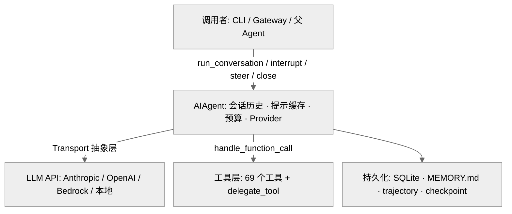

**图：AIAgent 与调用者、LLM API、工具层、持久化层的四向协作关系**

1. **调用者接口**：CLI、Gateway 或父 Agent 通过少数几个方法和 Agent 交互——`run_conversation()` 发消息拿回复（`run_agent.py:5745`）、`interrupt()` 中断（`run_agent.py:2619`）、`steer()` 温和重定向（`run_agent.py:2720`）、`switch_model()` 热切换模型（`run_agent.py:792`）、`close()` 释放资源（`run_agent.py:3433`）
2. **LLM API**：通过 Transport 抽象层调用模型。Agent 不直接和 API 打交道——Transport 负责格式转换和协议适配
3. **工具层**：通过 `model_tools.handle_function_call()` 调度 69 个工具。特殊的是 `delegate_tool`——它会反向创建新的 AIAgent，形成递归结构
4. **持久化层**：SQLite 存会话、MEMORY.md/USER.md 存跨会话记忆、trajectory 存训练数据、checkpoint 存文件系统快照

#### AIAgent 的参数设计

AIAgent 的 `__init__`（`run_agent.py:416`）接收超过 60 个参数，大致分为四组：

| 组 | 典型参数 | 用途 |
|---|---------|------|
| 模型连接 | `base_url`、`api_key`、`provider`、`api_mode`、`model`、`fallback_model` | 连接哪个 LLM |
| 回调接口 | `tool_*_callback`、`thinking_callback`、`reasoning_callback`、`clarify_callback`、`stream_delta_callback`、`status_callback` | Agent 运行时怎么通知调用者 |
| 会话控制 | `session_id`、`max_iterations`、`iteration_budget`、`save_trajectories`、`checkpoints_enabled`、`prefill_messages` | 控制对话的行为和边界 |
| Gateway 身份 | `platform`、`user_id`、`user_name`、`chat_id`、`gateway_session_key` | 消息来自哪个平台的哪个用户 |

为什么这么多参数？因为 AIAgent 被三个完全不同的入口使用——CLI 需要流式回调和中断支持，Gateway 需要平台身份和会话隔离，批量运行器需要轨迹保存和预算控制。与其拆成三个子类（引入继承复杂度），不如用大参数列表配合合理的默认值，让调用方只传自己关心的部分。实际的初始化逻辑委托给 `agent/agent_init.py`（2,103 行，`run_agent.py:489-490`）。

#### AIAgent 实例的生命周期

Agent 实例是**长生命周期的**。在 Gateway 模式下，一个 Agent 实例可能服务同一个用户几小时甚至几天，中间处理几十次 `run_conversation()` 调用。

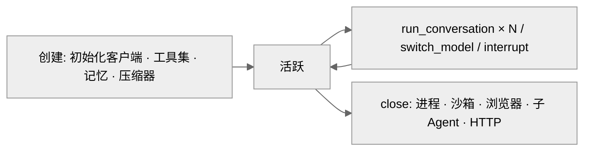

**图：AIAgent 实例的生命周期——创建后可被反复调用，close() 释放所有资源**

`close()`（`run_agent.py:3433`）按五个步骤释放资源：终止后台进程（ProcessRegistry）→ 清理终端沙箱 → 关闭浏览器会话 → 关闭子 Agent → 关闭 HTTP 客户端。每步独立 try-except，一步失败不影响后续清理。

#### 持续中的模块化拆解

v0.14 时 `run_agent.py` 曾从 13,293 行缩减到 4,309 行（核心循环拆到 `conversation_loop.py`）。到 v0.18.2，`run_agent.py` 又长回 6,013 行——但拆解同样在继续：v0.17 的 god-file decomposition campaign（第 00 章）把 `run_conversation()` 的**序幕**拆进 `agent/turn_context.py`（565 行）、**收尾**拆进 `agent/turn_finalizer.py`（507 行）、内层重试恢复标志收拢为 `agent/turn_retry_state.py` 的 `TurnRetryState`（80 行）。`run_agent.py` 里剩下的大多是 forwarder 函数——保持向后兼容的 API 表面，实现委托给各子模块。

### 一次完整对话的生命周期

当调用者（CLI、Gateway 或父 Agent）调用 `run_conversation()`（真身 `conversation_loop.py:523`）时，一次对话按以下顺序展开：

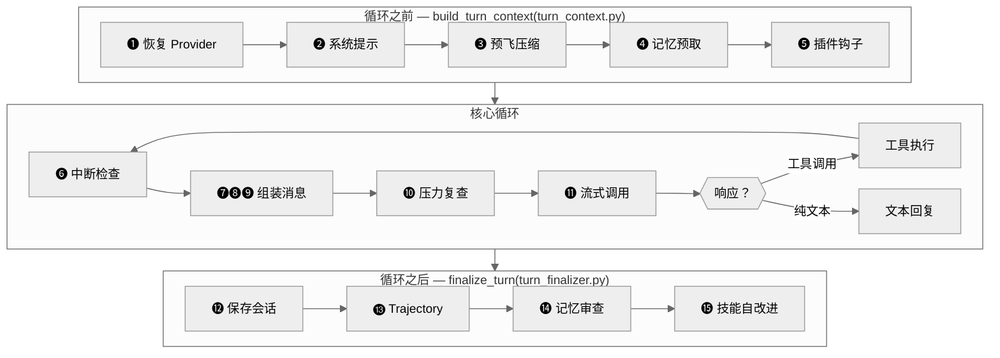

**图：`run_conversation()` 的完整生命周期——序幕和收尾已拆分为独立文件，编号对应下文说明**

**循环之前**——全部的每轮一次性准备工作现在集中在 `build_turn_context()`（`conversation_loop.py:576` 调用，实现在 `agent/turn_context.py`）：stdio 防护、重试计数器复位、用户消息消毒、系统提示恢复/构建、崩溃恢复持久化、预飞压缩、`pre_llm_call` 插件钩子、外部记忆预取——它返回一个上下文对象，循环从中读回所有局部状态。逐项看：

**❶ 恢复主力 Provider**（`turn_context.py:174`）——如果上一轮触发了 Fallback，这一轮先尝试恢复主力模型。恢复成功则后续 API 调用走主力；失败则继续用备用。

**❷ 构建/复用系统提示**——会话内只构建一次（`build_system_prompt()`，`agent/system_prompt.py:470`，docstring 明说"每会话一次、仅压缩事件后重建"），后续复用 `_cached_system_prompt`。这是 Prompt Caching 命中的前提——系统提示字节不变，Provider 才能复用之前的 KV cache。Gateway 续接会话时走 `_restore_or_build_system_prompt`（`conversation_loop.py:282`）从 SessionDB 加载旧提示，避免重建导致缓存失效。

**❸ 预飞压缩**——进入循环前就检查历史消息是否超过上下文阈值（包括工具 schema 占用的 20-30K+ token），超过则先压缩。这防止了"带着超长历史调 API，直到 Provider 报错才压缩"的问题。压缩后的消息带有 `[CONTEXT COMPACTION — REFERENCE ONLY]` 前缀（`context_compressor.py:45`），明确告知模型这是历史参考而非当前指令。

**❹ 记忆预取**——从外部 memory provider（以向量数据库为例）检索和当前消息相关的记忆片段。结果缓存在 `_ext_prefetch_cache` 中，整个 turn 内复用——10 次工具调用不会查 10 次。检索结果最终注入到用户消息中（步骤 ❼），不是系统提示。

**❺ 插件 pre_llm_call 钩子**——插件可以在这里注入额外上下文。和记忆预取一样，注入目标是用户消息而非系统提示——系统提示被缓存，修改它会破坏缓存。

**核心循环**（`conversation_loop.py:638`）：

**❻ 检查中断标志**——如果用户按了 Ctrl+C 或发了新消息，`_interrupt_requested` 为 True（`conversation_loop.py:643`），立即 break。中断信号会递归传播到所有子 Agent 和工具工作线程。

❼❽❾ 这三步合在一起完成同一件事：**把 Agent 内部的 `messages` 列表变成 Provider 可以接受的 API 请求**——过程中涉及注入、清理、格式转换三类操作。

**❼ 组装 API 消息**（`conversation_loop.py:787` 起）——从 `messages` 生成一份 `api_messages` 副本（不修改原始列表），分三类操作处理：
- **注入**：把步骤 ❹ 的记忆检索结果和步骤 ❺ 的插件上下文追加到当前用户消息末尾（`agent/conversation_loop.py:791-808` 的注释明说"仅 API 调用时注入，原始消息永不变异，不进会话持久化"）；拷贝推理内容（`reasoning_content`）供多轮推理延续
- **清理**：去除内部标记字段（`finish_reason`、`_thinking_prefill` 等），这些是 Agent 内部状态，不应发给 API
- **标准化**：工具调用参数做 `sort_keys=True`、`separators=(",", ":")` 序列化，保证相同内容的字节表示一致，防止 Prompt Caching 因序列化差异 miss

**❽ 拼接系统提示 + 缓存标记**——把 `_cached_system_prompt` 作为 `{"role": "system", "content": ...}` 放在 `api_messages` 最前面。如果启用了 Prompt Caching（`_use_prompt_caching`），调用 `apply_anthropic_cache_control()`（`prompt_caching.py:84`）注入 `cache_control` breakpoint（详见下文"Prompt Caching"一节）。MoA 标记路径的参考意见注入也发生在这之后（`conversation_loop.py:853-874`，见 MoA 一节）——系统提示拼好后、发出前，综合意见拼进最后一条用户消息。

**❾ 消毒修复 + Transport 转换**——`_sanitize_api_messages()` 清理孤立的工具结果、补缺失的工具 result stub；合并推理-only 的 assistant 消息避免 API 报错。然后 Transport 层把 OpenAI 格式的消息转成 Provider 原生格式（以 Anthropic 为例，`system` 消息从数组中提取为独立参数）。

**❿ 发前压力复查**（`conversation_loop.py:983`）——v0.17 新增的第二道压缩闸门。序幕的预飞压缩只看到了进来的用户消息，但一个 turn 内部可能追加多个巨型工具结果，把下一次调用挤到没有输出预算（注释里记录了真实事故：271k/272k 的 Codex 失败）。所以每次 API 调用前用当前请求的即时估算再查一次 `should_compress()`——而循环尾部的旧闸门用的是 API 报告的上一轮 token 数，对刚刚追加的大结果是滞后的。

**⓫ 流式 API 调用**——发起流式请求，通过 `_fire_stream_delta()` 分发每个 token 给 CLI 和 TTS 回调（详见下文"流式响应"一节）。长时间无新 token 判定为 stale stream 并重试。

**响应解析**（三条路径）：
- **工具调用** → 执行工具（串行或并行，取决于副作用判断）→ 把 `assistant`（含 tool_call）和 `tool`（含结果）消息追加到 `messages` → 回到 ❻
- **纯文本**（`finish_reason == "stop"`）→ 退出循环
- **异常** → 交给 `error_classifier` 分类 → 决定重试/压缩/轮转/Fallback（详见下文"重试与退避"一节）

循环受 `IterationBudget` 约束（现为独立模块 `agent/iteration_budget.py`，62 行）——这是一个绑定在 Agent 实例上的计数器，每执行一次 LLM 调用就递减一次。每个 Agent 实例有独立的预算，父 Agent 默认 90 次（`max_iterations`），子 Agent 默认 50 次（`delegation.max_iterations`）。父子预算相互独立——三个子 Agent 各可用 50 次迭代，总计可以超过父的 90 次上限。预算还有一个**退款**机制：`refund()`（`iteration_budget.py:45-49`）把 `execute_code` 这类程序化调用消耗的迭代退还，不占预算。

预算耗尽时对话不会在工具调用中途突然断掉：循环退出后，收尾阶段发现没有最终回复（`turn_finalizer.py:53-70`），会发起**一次剥离了全部工具的额外 API 调用**请求模型总结（`agent._handle_max_iterations` → `chat_completion_helpers.py:1565 handle_max_iterations`，日志关键词 "Iteration budget exhausted … asking model to summarise"）。工具被剥离意味着模型只能产出文本、不能再补一次操作。如果是 kanban worker 场景，此时模型自己已无法调用 `kanban_block`，收尾代码会代它调 `_record_task_failure(outcome="timed_out")` 上报——这样才会计入 `consecutive_failures` 熔断器，避免"任务反复超预算却无声无息"（`turn_finalizer.py:72-84` 注释，#29747）。

**循环之后**——收尾全部在 `finalize_turn()`（`agent/turn_finalizer.py`）：预算耗尽总结、轨迹保存、会话持久化、轮次诊断、响应变换、结果字典组装、steer 排空、记忆/技能审查触发。逐项看：

**⓬ 保存会话**到 SQLite（`hermes_state.py`），包括消息历史、系统提示、元数据。这让 Gateway 下次续接同一会话时可以加载完整上下文。

**⓭ 写 Trajectory**——如果 `save_trajectories=True`，把对话序列追加写入 JSONL。详见下文"Trajectory"一节。

**⓮ 记忆审查**——按配置间隔（`agent_init.py:1330` 默认每 10 轮）定期在后台 fork 一个 review Agent，用辅助模型审查本轮对话是否有值得记住的信息，如有则自动写入 MEMORY.md。

**⓯ 技能自改进**——按本轮工具调用次数触发（`turn_finalizer.py:454-458`：`_iters_since_skill` 达到 `_skill_nudge_interval` 且 `skill_manage` 工具可用时）。如果本轮用了很多工具调用（说明任务复杂），Agent 会尝试把解决方案抽象为技能保存下来。

这就是一次完整对话从头到尾发生的事情。但有一个关键问题还没有回答：LLM 实际看到的是什么？

### LLM 看到了什么？—— 每次 API 调用的完整消息结构

理解 Agent 如何利用 LLM 的智能，关键在于理解**每次 API 调用时 LLM 实际收到了什么**。这不是一条简单的用户消息——它是三部分构成的精心组装：

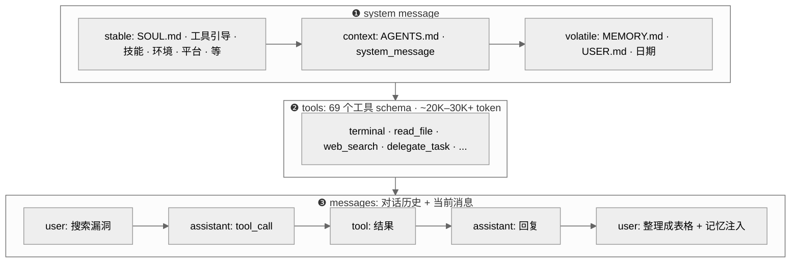

**图：一次 API 调用中 LLM 收到的完整结构**

#### ❶ system message——告诉 LLM "你是谁、在哪里、能做什么"

LLM 本身不知道自己运行在什么环境里——它不知道用户在 Telegram 上还是终端里，不知道有哪些工具可用，不知道用户的偏好。系统提示的作用是**给 LLM 提供做决策所需的全部上下文**。

系统提示由三层拼接而成（`agent/system_prompt.py:12-19` 模块注释；分层组装函数 `build_system_prompt_parts()`，`:113`），按缓存友好性从高到低排列：

- **stable 层**（几乎不变）：SOUL.md 人格定义（"你是 Hermes，一个 AI 助手..."）、工具行为引导（"当你需要搜索时调用 web_search，不要自行编造答案"）、技能系统提示（已安装技能的简介和触发条件）、环境提示（"你在 WSL2 上运行" / "你在 Docker 容器里"——没有这个，LLM 可能给出 Windows 命令而实际在 Linux 上）、平台提示（"用户在 Telegram 上，回复用 Markdown"）
- **context 层**（跨会话可能变化）：用户项目的 AGENTS.md / .cursorrules（项目级指令）、调用者传入的 system_message
- **volatile 层**（每个会话不同，但会话内不变）：MEMORY.md 快照（"用户是后端开发者，偏好 Python..."）、USER.md 快照（"习惯用 vim，不喜欢 TypeScript"）、当前日期（只精确到日，不含分钟——这样同一天内系统提示字节不变，保证缓存命中）、模型名和 Provider 名

三层的排列顺序不是随意的——stable 层放最前面，因为 Prompt Caching 的前缀匹配从第一个字节开始。如果把 volatile 层（每个会话都不同的记忆快照）放在 stable 层前面，所有会话的缓存前缀都不同，缓存就废了。

#### ❷ tools——告诉 LLM "你有哪些工具可以用"

69 个工具的 function-calling JSON schema，以 OpenAI 格式定义（每个工具包含 name、description、parameters）。这部分可能占 **20,000-30,000+ token**——是单次 API 调用中 token 开销最大的部分之一。

工具 schema 每轮都完全相同——这个特性后文的 Prompt Caching 节会充分利用到。

#### ❸ messages——对话历史 + 当前消息

消息列表包含完整的对话历史：用户消息、assistant 回复、工具调用（`tool_calls`）和工具结果（`tool` 角色消息）。LLM 需要看到之前的工具调用和结果才能理解上下文——如果它上一轮搜索了网页，这一轮被要求"整理成表格"，它需要看到搜索结果才知道整理什么。

当前轮的 user 消息会被**注入两种额外内容**（`conversation_loop.py:791-808`，仅在 API 调用时注入，不修改原始消息列表，不持久化到 SessionDB）：
- 外部 memory provider 的检索结果（步骤 ❹ 预取的 `_ext_prefetch_cache`）
- 插件 pre_llm_call 钩子返回的上下文

为什么这些注入到用户消息而不是系统提示？因为系统提示被缓存——修改它会破坏缓存。用户消息本来每轮就不同，在里面加东西不影响缓存前缀。

理解了 LLM 每次看到的完整输入之后，Prompt Caching 节就有了立足点——它解决的正是这三部分中重复内容的开销问题。

### Prompt Caching：让重复的 token 不再重复付费

每次调用模型 API，完整的消息序列（系统提示 + 历史对话 + 当前消息）都要从头发送。一个 Hermes 会话中，系统提示可能占 5,000-10,000 token，但它在 20 轮对话中几乎不变——等于同样的内容付了 20 次钱。

Prompt Caching 是对这个浪费的应对。`agent/prompt_caching.py`（119 行）实现了一个跨 Provider 通用的缓存标记策略。以 Anthropic 为例，它允许最多 4 个 `cache_control` breakpoint，Hermes 的 "system_and_3" 策略（`prompt_caching.py:3`）这样分配：

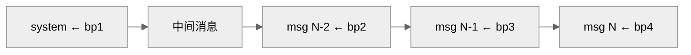

**图：Prompt Caching 的 breakpoint 分配——系统提示占一个，最近三条非 system 消息各占一个**

系统提示是最稳定的前缀——会话内不变，命中率接近 100%。Provider 的缓存以前缀内容的哈希为键——就像 git 以文件内容哈希标识版本，一个字节不同就是不同的 key，哪怕肉眼看起来一样。这就是为什么 Hermes 要在多个层面守护前缀稳定性：系统提示只构建一次（`_cached_system_prompt`）、JSON 工具参数做 `sort_keys=True` 标准化（防序列化顺序差异导致 cache miss）、消息内容 `.strip()` 消除空白差异。

缓存 TTL 可通过 `prompt_caching.cache_ttl` 配置：5 分钟（默认，写入成本 1.25 倍）或 1 小时（写入成本 2 倍，适合消息间隔较长的 Gateway 场景）。如果缓存完全失效——不会崩溃，只是退回到正常的全量计费。这是一个"有则更好，无则不损"的优化。

### 重试与退避：优雅地处理 API 失败

调用外部 API 必然会遇到失败。对一个可能运行几小时的 Gateway 会话来说，零失败是不现实的，关键是**失败后怎么恢复**。

重试逻辑在 `agent/conversation_loop.py` 的核心循环中，每次 API 调用失败后触发。退避算法是经典的**带抖动的指数退避**（`jittered_backoff()`，`agent/retry_utils.py:36`）：

```
delay = min(base × 2^(attempt-1), max_delay) + jitter
```

基础延迟 5 秒，每次翻倍，上限 120 秒（`retry_utils.py:39-40`）；每次 API 调用最多重试 `agent.api_max_retries` 次（默认 3，`agent_init.py:1489-1497`，#11616）。为什么加 jitter？假设 Gateway 同时服务 50 个用户，Provider 返回 429 后所有会话同时等 5 秒再重试——50 个请求同时砸过去，再次限流。Jitter 给每个会话的重试时间加随机偏移（计算延迟的 0-50%），让请求在时间上分散开。个别 Provider 还有专属退避曲线——以 Z.AI Coding Plan 的过载为例，`adaptive_rate_limit_backoff()`（`retry_utils.py:108`）用短间隔试探几次后转入 30/60/90/120 秒阶梯。

错误分类由 `agent/error_classifier.py`（1,598 行）负责——输入是异常对象，输出是结构化的 `ClassifiedError`（包含 `reason: FailoverReason` 枚举——限流、上下文溢出、OAuth 过期等触发 failover 的原因，以及 `retryable`、`should_compress`、`should_rotate_credential`、`should_fallback` 等布尔标记）。核心循环不再需要理解每种错误的语义——它只需要问分类器"该怎么做"。此外，一轮内跨越多次重试的恢复状态（哪些手段试过了、还剩什么可试）现在收拢在 `TurnRetryState`（`agent/turn_retry_state.py`，80 行），而不是散落的布尔变量。

分类之后的恢复动作不是单一的"重试或轮转"——`recover_with_credential_pool()`（`agent/agent_runtime_helpers.py:696`）按 `FailoverReason` 至少分四条路径：

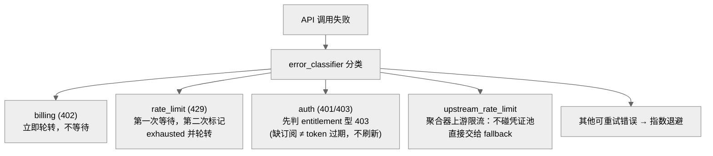

**图：凭证层恢复的四条分叉——不同的失败原因走不同的恢复策略**

几个关键判断：

- **第一次 429 不立刻切换凭证**——限流可能只是瞬时的，Provider 的限流窗口可能在几秒内重置，立刻切换反而浪费了一个本可恢复的 Key（凭证已处于 exhausted 状态时例外，跳过等待直接轮转）
- **402（计费耗尽）没有等待的意义**——余额不会几秒内恢复，立即轮转到下一个凭证
- **403 先做 entitlement 检测**（`:858` 起）——"账号没这个订阅"在线路上长得和"token 过期"一样，但刷新 token 救不了前者；不区分的话会陷入无意义的刷新循环。另有刷新次数上限保护：单条目 OAuth 池可能"刷新总成功但上游总拒绝"，`_MAX_AUTH_REFRESH_ATTEMPTS` 计数器防止无限刷新（#26080）
- **是否提前 fallback 要看池还有没有救**——`_pool_may_recover_from_rate_limit()`（`conversation_loop.py:3168-3178` 引用处）：池里还有可轮转的凭证就不急着切 Provider；只有 upstream_rate_limit 这种"换 Key 也没用"的情况才无条件 fallback

除了这四条主路径，分类器还识别一批**可自动修复后重试**的专项错误：图片超限自动缩图、多模态工具内容不被支持时降级纯文本、Anthropic OAuth 的 1M 上下文 beta 被拒后自动去掉 beta 头、Codex/xAI OAuth 401 自动刷新。Nous Portal 的 429 还有跨会话熔断（`agent/nous_rate_guard.py`）——限流状态写入共享文件，同机的其他会话直接停止重试，不再各自撞一遍。

重试解决的是"同一个凭证下的瞬时失败"。但如果 Key 本身被限流了呢？这就需要另一层机制——凭证轮换。

### Credential Pool：多密钥的生命周期管理

早期只需要一个 API Key。但当 Hermes 支持 OAuth 登录后，凭证管理变复杂了：token 有过期时间，需要刷新；团队可能共享多个 Key 分摊配额。

`agent/credential_pool.py`（2,384 行）是一个带状态的凭证容器。每次 Agent 调用模型时，不是直接拿一个固定 Key，而是问 Credential Pool "给我一个当前可用的凭证"。

池提供四种选择策略（`credential_pool.py:98-101`，通过 `credential_pool_strategies` 配置）：
- **fill_first**（默认）— 优先使用最高优先级的凭证，限流才用下一个
- **round_robin** — 每次轮转到队尾，做负载均衡
- **random** — 随机选，简单的去关联策略
- **least_used** — 选使用次数最少的，确保消耗均匀

每个凭证在三种持久状态间流转：

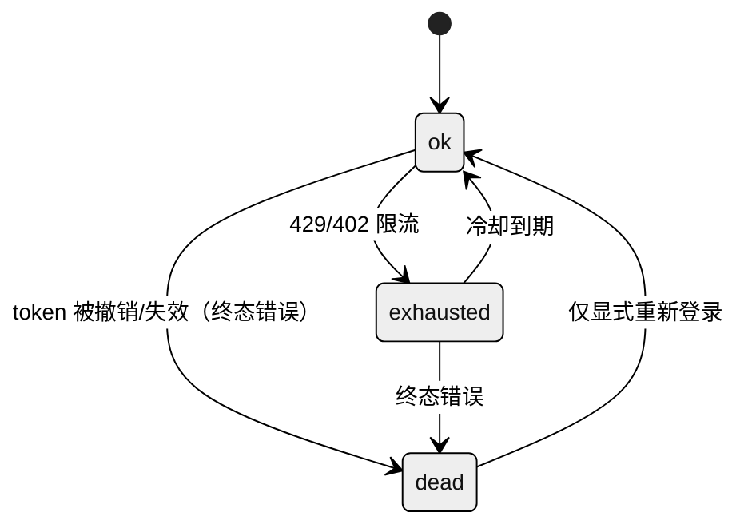

**图：单个凭证的三种持久状态转换**

`exhausted → ok` 的冷却时长分三档（`credential_pool.py:113-115`）：401 触发的短冷却 **5 分钟**（单 Key 用户能较快恢复）、429 触发 **1 小时**、其他默认 **1 小时**；Provider 在响应里给了 `reset_at` 时间戳的话以它为准。`STATUS_OK`（`credential_pool.py:57`）和 `STATUS_EXHAUSTED`（`:58`）之外，v0.16 起有 `STATUS_DEAD`（`:65`）——一组**终态 OAuth 错误**（`token_invalidated`、`token_revoked`、`invalid_grant` 等，`_TERMINAL_AUTH_REASONS`，`:70-77`）标记的凭证永远不会自愈，冷却后重试注定失败，所以被无条件排除出轮转，只有显式重新登录（写侧同步）才能复活；手工添加的 dead 凭证 24 小时后被清理（`:90`）。OAuth token 刷新不是一个独立状态——它在选取凭证时自动触发，刷新期间凭证仍在 `ok` 态；刷新失败则跳过该凭证，但不标记 `exhausted`。

一个常见的误解是 Credential Pool 由 Agent 管理。实际上，**池的创建由 CLI/Gateway 层完成**（`hermes_cli/runtime_provider.py` 调 `load_pool()` 加载并注入，凭证数据的读写在 `hermes_cli/auth.py`），在 Agent 创建之前就准备好，通过 `credential_pool=pool` 参数注入。Agent 只是消费者——它从池中选凭证、标记限流状态、触发 token 刷新，但不负责凭证从哪里来。

凭证从哪里来，本身也在 v0.17-0.18 被系统化了。`agent/credential_sources.py`（443 行）给每一种凭证来源（`env:<VAR>`、Claude Code 的 credentials.json、PKCE OAuth、设备码登录、qwen-cli、gh CLI、config 自定义条目、`hermes auth add` 手工添加）定义了统一的**移除契约**——登出/删除一个凭证时知道去哪个文件清理。写盘边界另有一道防线：`agent/credential_persistence.py`（174 行）在凭证池写入 `auth.json` 前剥离"借来的"运行时秘密的原始值——从环境变量借的 Key 只存引用不存值。多 Profile 网关复用（第 01 章的 multiplex）则靠 `agent/secret_scope.py`（205 行）：每个 Profile 的 `.env` 秘密装进 contextvar 作用域随任务传播，**不进程级合并**——否则 Profile A 的 Key 会泄漏给 Profile B 的轮次和每个子进程。

### Fallback Chain：跨 Provider 的自动 Fallback

重试和凭证轮转解决的是"同一个 Provider 内部的恢复"。但如果整个 Provider 都挂了——Fallback Chain 解决更上一层的问题：**自动切换到完全不同的 Provider 和模型**。

`_try_activate_fallback()`（`run_agent.py:4741`）在重试和凭证轮换都耗尽后触发。`fallback_model` 可以是单个 dict 或有序列表（链式备用）：

```yaml
# config.yaml 示例
model:
  default: "anthropic/claude-opus-4.6"
  fallback_model:
    - provider: "openrouter"
      model: "deepseek/deepseek-r1"
    - provider: "openai"
      model: "gpt-4.1"
```

主力 → 备用 1 → 备用 2，链式尝试。切换是临时的——`_restore_primary_runtime()`（`run_agent.py:4760`）会在每个新 turn 的序幕里尝试恢复主力（`turn_context.py:174`），成功就自动切回，用户无感知。

在 CLI 场景，用户可以用 `/model` 手动切换；但在 Gateway 场景（多用户共享同一服务），无法依赖手动干预。Fallback Chain 让 Gateway 在 Provider 故障时自动保持服务，无需任何用户介入。

如果没有配置 `fallback_model`，连续失败最终会返回错误给用户——这是最坏的情况，但也是明确的失败，不会静默丢消息。

#### 错误恢复的三层递进

重试、凭证轮转、Fallback 不是平行的三个机制——它们是**递进的三层防线**，每层解决前一层无法处理的问题：

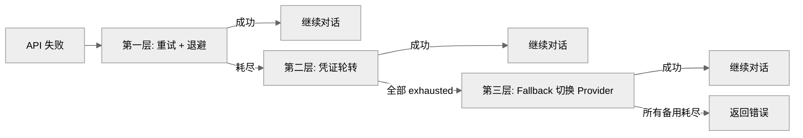

**图：错误恢复的三层递进——重试 → 凭证轮转 → Fallback，每层解决上一层无法处理的问题**

排查 API 错误时，按这个顺序定位：先看日志中的重试次数（是否触发了退避？），再看凭证状态（有没有 Key 被标记为 exhausted 或 dead？），最后看 Fallback 是否激活（`_fallback_activated` 标志）。

### 流式响应：让等待变得可以忍受

等模型生成完整响应后再一次性返回，用户体验很糟——几秒的空白等待，然后突然冒出一大段文字。流式响应让 token 在生成的同时就送达用户。

但 Hermes 面临一个额外挑战：模型响应分两种——**纯文本回复**和**工具调用**。只有前者应该流式展示给用户，后者是给 Agent 自己看的内部调度指令。

`_fire_stream_delta()`（`run_agent.py:4650`）是流式分发的核心。每个文本 token 到达时，它先经过两个 scrubber 过滤：`_stream_think_scrubber` 去掉推理/思考块（以 `<think>` 标签为例，不应泄露到用户界面）、`_stream_context_scrubber` 去掉内部记忆上下文标记。过滤后分发给两个回调：
- `stream_delta_callback`（CLI 用它驱动终端输出）
- `stream_callback`（TTS 语音合成管线用它在生成文本的同时开始朗读，`conversation_loop.py:529`）

**工具调用轮次完全静默**——用户不会看到"我要搜索一下网页"这样的中间文字逐字蹦出来。Hermes 用工具进度回调（`tool_progress_callback`）和 `KawaiiSpinner` 动画替代，保持输出区干净。

流式传输的"假死"检测（stale stream）在 v0.18 变成了三层取值：Provider 级配置的超时优先（`chat_completion_helpers.py:2866`）；否则用 `HERMES_STREAM_STALE_TIMEOUT` 环境变量，默认 180 秒（`:2870`）；本地引擎（Ollama、llama.cpp 等）默认禁用检测（`:2874`，本地大上下文 prefill 可以合理地超过 300 秒），大上下文场景还会按上下文规模放大超时。**推理模型有专门的下限表**：`agent/reasoning_timeouts.py`（216 行）给 o1/o3、Opus thinking、DeepSeek R1、QwQ、Grok reasoning 这类"先思考很久再吐第一个 token"的模型设置更宽的 per-model 超时下限——模块注释里记录了实证依据（NVIDIA NIM 网关约 120 秒就杀空闲连接，而模型 TTFB 可能 31 秒起步）。

到目前为止讨论的机制——缓存、流式、重试、凭证轮换、Fallback——都在处理"做同一件事但遇到了阻碍"或"怎么把结果交付给用户"。接下来两节是另一类问题：一个模型/一个 Agent 不够用了怎么办。

### MoA：让多个模型给同一个问题当参谋

v0.18 把原来的 `mixture_of_agents` **工具**重构成了 **MoA 循环模式**（单个 commit `c6575df92` 原子完成：删工具、建 `agent/moa_loop.py`）。设计立场写在模块注释第一段（`moa_loop.py:1-7`）：`/moa` **刻意不做成模型工具**——它把一个用户轮标记为 MoA-enabled，正常的 Hermes agent 循环仍然拥有工具调用和轮次终止权，moa_loop 只负责在模型迭代前收集参考模型的意见。

实现上有**两条不同的路径**，取决于怎么触发：

```mermaid
%%{init: {"theme": "neutral", "themeVariables": {"fontSize": "14px"}, "flowchart": {"nodeSpacing": 15, "rankSpacing": 25}}}%%
flowchart TD
    subgraph P1 ["路径一：标记编码（文本-only 前端 / gateway）"]
        U1["消息带 __HERMES_MOA_TURN_V1__"] --> D1["conversation_loop 解码<br/>#40;:557-559#41;"]
        D1 --> FAN1["aggregate_moa_context #40;:571#41;<br/>参考扇出 + 聚合模型自己综合成一段意见"]
        FAN1 --> INJ1["综合意见拼进用户消息 #40;:857-872#41;"]
        INJ1 --> ACT1["继续执行的仍是当前模型<br/>#40;不一定是 preset 的 aggregator#41;"]
    end
    subgraph P2 ["路径二：MoA 虚拟 Provider（/moa 一次性、/model moa:preset）"]
        U2["provider = moa"] --> C2["agent.client 换成 MoAClient<br/>#40;agent_init.py:856#41;"]
        C2 --> INT["MoAChatCompletions.create#40;#41;<br/>拦截每一次模型调用"]
        INT --> FAN2["参考扇出 ≤8 并发"]
        FAN2 --> ACT2["aggregator 直接作为<br/>执行工具调用的模型"]
    end
```

**图：MoA 的两条实现路径——标记编码是"合成意见后交回原模型"，虚拟 Provider 是"聚合器代行主循环"**

- **路径一（标记编码）**：`aggregate_moa_context()`（`moa_loop.py:571`，注入点 `conversation_loop.py:853-874`）并发问询参考模型后，**自己再调一次聚合模型**把各方意见综合成一段文本，拼进当前用户消息——之后继续跑工具循环的还是触发前的模型。这条路径给无法切 Provider 的前端用
- **路径二（虚拟 Provider）**：`provider=moa` 时 `agent.client` 被替换为 `MoAClient`（`moa_loop.py:1041`，装配在 `agent_init.py:856`），它的 `create()` 拦截**每一次**模型调用：先参考扇出，然后 **aggregator 直接作为代行工具调用的模型**（docstring 原话 "the aggregator is the acting model"）。`/moa` 一次性糖和 `/model moa:<preset>`（含裸 preset 名隐式匹配，第 01 章 model_switch 的 PATH B）都走这条

两条路径共享的机制：

1. **参考调用无工具、彼此独立**——参考模型收到专门的 advisor 系统提示（`_REFERENCE_SYSTEM_PROMPT`，`moa_loop.py:100`，明确告知"你不能调用工具、你的意见是私密建议"），传给它的工具结果被裁剪到头尾各 4,000 字符（`_REFERENCE_TOOL_RESULT_BUDGET`，`:91`）防上下文爆炸；并发上限 `_MAX_REFERENCE_WORKERS = 8`（`:27`）
2. **扇出节奏可配**（`fanout`，`moa_loop.py:847-878`）：默认 `per_iteration`——每次工具迭代都重新问参谋（他们能看到新的工具结果）；`user_turn` 则每个用户轮只问一次、后续迭代复用缓存（签名哈希判断）。这是 MoA 成本的主开关：一轮 10 次工具迭代在默认模式下是 10 轮参考扇出
3. **计费独立**：`_RefAccounting`（`moa_loop.py:30`）给每个参考模型按**它自己的费率**计价——把 advisor 的 token 折进聚合者的用量会"给每个 advisor 算错钱"（注释原话）。`agent/moa_trace.py`（167 行）把每个 advisor 实际看到的完整输入输出存档，供事后审计
4. **配置**：preset（参考模型列表 + 聚合者 + 采样参数 + fanout）在 config 的 `moa.presets`，`hermes moa` 子命令管理；MoA 在 Provider 层表现为一个虚拟 Provider（`moa://local`，第 01 章 runtime_provider 链的第 1 步）
5. **失败语义是 fail-open**：某个参考模型超时/报错时**不抛异常中断这一轮**，而是把 `[failed: {exc}]` 当作一条带标签的意见喂给聚合模型（`moa_loop.py:324-329`，注释原话 "Never raises: a failed reference becomes a labelled note"），对应的 `_RefAccounting` 计费清零。所以一个 advisor 挂掉，`/moa` 这轮会**降级继续**而非整体失败——聚合模型知道少了谁的意见

为什么不做成工具？做成工具意味着模型自己决定"何时召集参谋"——但多模型咨询很贵，一次扇出可能烧掉三个模型的 token。把决定权留给用户（斜杠命令/模型选择），把机制做在循环里，成本边界就是清晰的：用户点名才扇出，`fanout` 决定扇出频率。

### 另一条执行路径：Codex App-Server Runtime

MoA 是"在主循环里多问几个模型"，但 Hermes 还有一条更彻底的替代路径——**把整个工具循环整体委托出去**。当模型是 `openai/*` 或 `openai-codex/*` 且本机装了 Codex CLI 并开启对应配置时，`run_conversation()` 不再自己驱动工具循环，而是走 `_run_codex_app_server_turn()`（调用点 `conversation_loop.py:630`，实现 `agent/codex_runtime.py`，930 行）：一整轮对话交给 Codex CLI 自己的 app-server 子进程跑——用它自己的工具循环、沙箱、`apply_patch`，Hermes 只提供会话历史、网关投递、记忆与技能这层外壳，把 Codex 的 `item/started` 等通知翻译回 Hermes 的工具进度事件。

这解释了一件容易误解的事：`AIAgent.run_conversation()` **不是唯一的执行入口**。多数情况下它自己跑工具循环；MoA 模式下它在每次模型调用处扇出参谋；Codex runtime 模式下它把整轮让给外部 app-server。三者是同一个 `run_conversation()` 的三种落地——读源码时若只盯着默认工具循环，会漏掉后两条路径。

### 子 Agent：横向分拆任务

如果说父 Agent 是项目经理，子 Agent 就是它外包出去的专项承包商——拿到明确的子任务、有独立的预算，完成后汇报结果。用户说"分析这三个文件然后写一份报告"——分析可以并行，写报告要等分析完成。如果单个 Agent 串行做，时间是三倍。`tools/delegate_tool.py`（3,459 行）让 Agent 能 spawn 子 Agent 并行处理子任务。

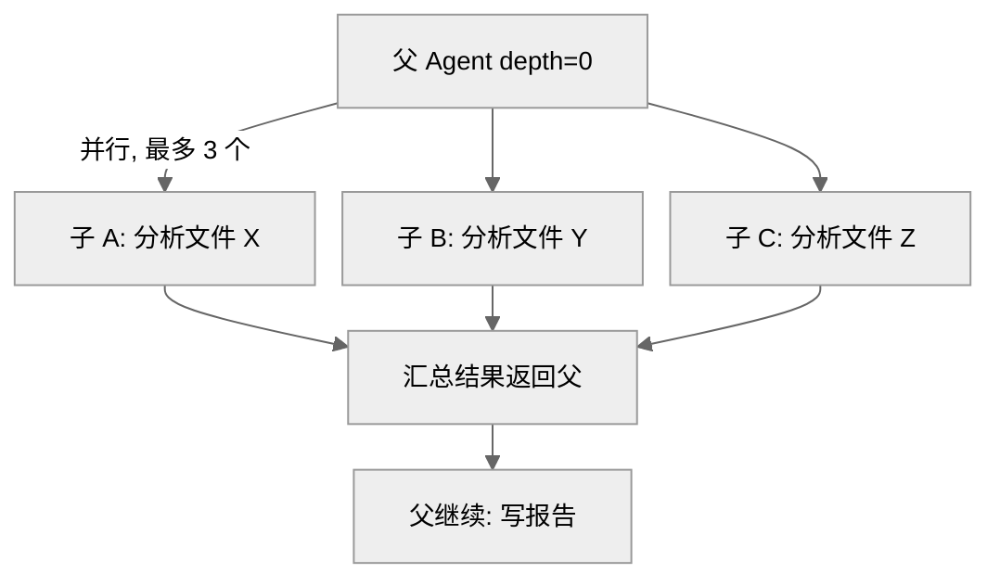

**图：父 Agent 并行分拆三个子 Agent，汇总后继续执行**

子 Agent 运行在 `ThreadPoolExecutor` 中，默认最多 3 个并发（`_DEFAULT_MAX_CONCURRENT_CHILDREN = 3`，`delegate_tool.py:118`）。每个子 Agent 获得独立的 `IterationBudget`，默认上限 50 次（`delegation.max_iterations`，`delegate_tool.py:586`），不从父的预算中扣减。这意味着父 + 三个子 Agent 理论上可以执行 90 + 3×50 = 240 次迭代。

#### 安全隔离

子 Agent 不是父的完整克隆。它的工具集是父的**子集**（取交集，`delegate_tool.py:549-570`），且六个工具被强制禁用（`DELEGATE_BLOCKED_TOOLS`，`delegate_tool.py:45-53`）：

| 禁用的工具 | 原因（源码注释原文意译） |
|-----------|------|
| `delegate_task` | 防止无限递归（除非 role 是 `orchestrator`）|
| `clarify` | 子 Agent 在后台线程，没有 stdin，无法交互 |
| `memory` | 避免多个子 Agent 并发写 MEMORY.md 导致冲突 |
| `send_message` | 防止子 Agent 擅自跨平台发消息 |
| `execute_code` | 强制逐步推理，不走捷径写脚本 |
| `cronjob` | 不许以父之名调度更多后续工作 |

嵌套深度默认 1 层（`MAX_DEPTH = 1`，`delegate_tool.py:125`）——父 spawn 子，但子不能再 spawn 孙。`delegation.max_spawn_depth` 可以放宽，且**没有上限**（`:129-131` 注释：和并发数一样只有下限 1；更深的树成倍放大 API 成本，所以默认扁平、加深是显式 opt-in）。如果需要让某个子 Agent 保留 `delegate_task`，给它设置 `role: "orchestrator"`。

#### 审批和错误处理

子 Agent 运行在独立线程中，缺少 CLI 的交互上下文。如果子 Agent 要执行危险命令（以 `rm -rf` 为例），父 Agent 的审批回调对它不可见。默认行为是 `_subagent_auto_deny`（`delegate_tool.py:74`）——自动拒绝所有需要审批的操作。对于 cron 任务或批量运行场景，可以配置 `delegation.subagent_auto_approve: true` 放开限制（`:68-88`）。

如果子 Agent 崩溃（异常退出），`ThreadPoolExecutor` 会捕获异常，父 Agent 收到一个包含错误信息的结果——不会导致父 Agent 崩溃。`_active_subagents` 注册表（`delegate_tool.py:146`）让 TUI 界面可以实时显示当前有多少子 Agent 在运行、各自在做什么，并支持单独中断某个子 Agent。

还有两个容易被忽略的边界行为：

- **结果汇总有溢出保护**。N 个子 Agent 各返回一份完整摘要，一次性塞回父的上下文可能直接把父撑爆——这是 issue #9126 记录的真实事故（触发压缩/429 死循环）。现在 `_apply_summary_budget()`（`delegate_tool.py:1664`）按父 Agent 的**剩余上下文空间**动态分配每份摘要的字符预算（`_parent_summary_char_budget()`，`:1624`：剩余空间的一半除以子任务数，`_SUMMARY_HEADROOM_FRACTION = 0.5`，`:595`），超预算的摘要被裁成头部 + 完整版落盘的文件指针
- **子 Agent 默认没有墙钟超时**（`delegation.child_timeout_seconds` 默认 `None`，`_get_child_timeout()`，`:425-433`）——旧版的一刀切超时曾把做深度代码审查、大型研究扇出的正经长任务杀在半路。卡死检测改由心跳陈旧监控兜底：卡住的子 Agent 停止刷新父的活动信号，最终由 Gateway 层的整体不活跃超时收场。显式配置正数才启用硬超时（有 30 秒地板）

无论是单 Agent 还是多层子 Agent，每次对话运行结束时，系统都可以把完整的执行轨迹保存下来——这就是 Trajectory 机制存在的原因。

### LSP 集成：让 Agent 改代码时看见「红波浪线」

VS Code 里的红波浪线——拼错变量名、类型不匹配、找不到符号——是背后的语言服务器实时分析报过来的。一个写代码的 Agent 如果缺少这个反馈，只能靠反复跑 `terminal` lint/类型检查，慢且容易漏。Hermes 的 LSP 集成（`agent/lsp/`）把这套「编辑器级的诊断」直接接进 Agent：Agent 改完一个文件，立刻在工具结果里看到「第 42 行：找不到名字 'foo'」这样的语义错误。但 LSP 怎么知道 Agent 改了哪个文件、又在什么时候介入？

**集成点是文件写入之后，而非对话循环里**。当 Agent 调用 `write_file` 或 `patch` 时，`tools/file_operations.py` 在写入前后各跑一次 LSP：写入前调 `_snapshot_lsp_baseline`（`file_operations.py:1869`），把当前文件的全部 LSP 诊断记为「基线」；写入后调 `_maybe_lsp_diagnostics`（`:1892`）取新诊断，新旧两份做差，只把**本次编辑新引入的**诊断并进工具输出的 `lsp_diagnostics` 字段。这意味着 Agent 不需要主动「去查错误」——它改完代码，错误自己浮出来。有个前提：**只在语法检查通过时才请求 LSP**（`lint_result.success or skipped`）——文件本身语法就崩的时候不查，免得语法错和语义错两层噪音叠在一起。

**核心是 `LSPService`（`agent/lsp/manager.py:133`），一个进程级单例**，按需启动并复用语言服务器进程。`agent/lsp/servers.py` 的 `SERVERS` 列表（`servers.py:971`）注册了 27 种语言服务器（pyright、gopls、rust-analyzer、typescript-language-server、clangd 等），同一 `(服务器, 工作区)` 对的后续请求直接复用已启动的进程。诊断由 `agent/lsp/reporter.py` 格式化——默认**只报 ERROR 级**（`DEFAULT_SEVERITIES = frozenset({1})`，`reporter.py:17`，避免 warning/hint 刷屏）、单文件最多 20 条（`MAX_PER_FILE`，`reporter.py:19`）、总量不超过 4,000 字符（`MAX_TOTAL_CHARS`，`:20`）。

一个不起眼但关键的设计细节：**行号偏移处理**（`agent/lsp/range_shift.py:33 build_line_shift`）。编辑插入/删除几行后，文件后半部分所有诊断的行号都会移位——如果不处理，「原本就存在的错误」会因为行号变了而被当成「本次新引入的」，给 Agent 一堆假噪音。`build_line_shift` 用 `difflib` 对改动前后的文本建一个行号映射，把基线诊断的行号平移到改动后的位置再做差，确保只有真·新错误被报出来。

失败时有多道降级保障，确保 LSP 任何一环出问题都不波及 `write_file` 本身：

- **作用域限制**：只在 git 工作区内运行，避免在无关目录启动守护进程；且**只在本地后端激活**——Docker/Modal/SSH/Daytona 等远程沙箱下完全跳过（语言服务器进程够不到沙箱里的文件，`_lsp_local_only`，`file_operations.py:1791`），文件照写但没有诊断。
- **broken-set**：启动超时或崩溃的服务器记入破损集合，后续请求直接跳过、不再重复等待超时。
- **隔离安装**：二进制缺失时按 `install_strategy` 自动装到 `<HERMES_HOME>/lsp/bin`（不污染系统 PATH），装不上就静默跳过。

可配置性在 `config.yaml` 的 `lsp:` 段（`enabled`、`wait_mode`、`install_strategy`、以及按语言 `servers:` 覆盖二进制路径/初始化选项）。

> 📖 **延伸阅读**：[LSP 集成](https://hermes-agent.nousresearch.com/docs/user-guide/features/lsp)

### Trajectory：从运行时到训练数据

`agent/trajectory.py`（56 行）是 Agent 核心里最简单也最独立的模块。它在 `run_conversation()` 正常返回后（现在由 `turn_finalizer.py` 触发），把完整对话序列追加写入 JSONL（ShareGPT 兼容格式）。它不影响任何核心逻辑，和主流程之间是单向依赖——移除它不破坏任何功能。

成功的写入 `trajectory_samples.jsonl`，失败的写入 `failed_trajectories.jsonl`——失败案例对研究者同样有价值，甚至更有价值（"模型在哪里犯错"和"做对了什么"一样重要）。Nous Research 用这些轨迹训练下一代工具调用模型，这是 Hermes "research-ready" 定位的基础设施之一。默认关闭。注意 `batch_runner.py` 并不用这套机制（它显式设 `save_trajectories=False`，自己另存一套，见第 12 章）——这套 `agent/trajectory.py` 的简单存储实际只服务交互式 CLI 的 `--save_trajectories` 标志。

### 辅助模型：侧任务的统一调度器

上下文压缩需要用一个"廉价模型"做摘要，视觉分析需要一个"能看图的模型"做描述，网页提取需要一个模型做内容清洗——这些"侧任务"不应该占用主模型的配额和延迟。

`agent/auxiliary_client.py`（7,469 行）是所有侧任务的统一路由器。`call_llm()`（`auxiliary_client.py:6371`）按任务名解析辅助模型——docstring 列出的任务类型有 compression、vision、web_extract、session_search、skills_hub、mcp、title_generation。解析顺序：任务级配置（config/env 指定的 provider:model）→ 显式参数覆盖 → `auto` 自动探测（`_resolve_auto`，定义 `:4104`、调用点 `:4510`，按优先级尝试可用的 Provider；调用点还处理"OpenRouter 格式的模型名落到本地 Provider 时自动换成该 Provider 默认模型"这类修正）。

视觉任务和文本任务走不同的解析路径——视觉需要多模态模型，文本只需要廉价快速的模型。如果所有 fallback 都不可用，侧任务静默失败（以上下文压缩为例，压缩失败后退回到不压缩继续工作，600 秒内不再尝试）。

这个组件被上下文压缩（`context_compressor.py`）、记忆审查（`background_review.py`）、视觉分析、网页提取、smart 审批等多个消费者共用——它们都不需要关心辅助模型从哪来，只需要调用 `call_llm()` 并拿到结果。MoA 的参考模型问询也复用它。

### ContextEngine：可插拔的上下文策略

`agent/context_engine.py`（`ContextEngine` ABC，`context_engine.py:32`）定义了上下文管理的可插拔接口。默认实现是 `ContextCompressor`（"保头保尾压中间"的摘要策略，`context_compressor.py` 现已 3,082 行），但第三方引擎可以通过插件替换它。

ContextEngine 的核心接口与生命周期方法：
1. `update_from_response(usage)`（`:71`）— 每次 LLM 调用后更新 token 计数（v0.18 的 usage 字典还带 cache_read/cache_write/reasoning 等细分桶）
2. `should_compress(prompt_tokens)`（`:83`）— 判断是否需要压缩
3. `compress(messages, system_prompt)`（`:87`）— 执行压缩
4. `on_session_start()` / `on_session_end()` / `on_session_reset()`（`:144-158`）— 会话级生命周期

基类还带三个保护参数（`:64-66`）：压缩触发阈值 `threshold_percent = 0.75`、头部保护 `protect_first_n = 3` 条、尾部保护 `protect_last_n = 6` 条——"保头保尾"不是压缩器的私有实现，而是接口级的契约。配置通过 `context.engine` 控制（默认 `"compressor"`）。引擎维护的关键状态（`threshold_tokens`、`context_length`、`compression_count`）被预飞压缩和发前压力复查直接读取。

默认实现 `ContextCompressor.compress()`（`context_compressor.py:2707`）的实际算法是五步（docstring `:2710-2715` 原文）：

1. 修剪旧工具结果（廉价预处理，不调 LLM）
2. 保护头部消息（系统提示 + 首个交换）
3. 按 token 预算找尾部边界（约 20K token 的**动态**边界，不是固定条数）
4. 用结构化提示词让摘要 LLM 压缩中间轮次
5. 再次压缩时迭代更新上一份摘要（而不是从头重摘）

压缩后还会清理孤立的 tool_call/tool_result 配对，保证 API 不会收到不匹配的 ID。

**压缩自己也会失败**——摘要靠辅助 LLM，它也会 401、断网、超时。失败后走三条分支之一：

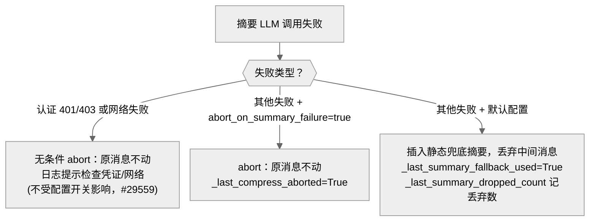

**图：压缩失败的三条降级分支——认证/网络失败永远不丢消息**

认证/网络失败无条件 abort 的理由写在注释里（`context_compressor.py:1099-1109`）：把用户困在一个"凭证已损坏还悄悄丢了历史"的降级会话里毫无意义——原始消息保持不变，等凭证/网络恢复。而默认路径的静态兜底意味着：如果你发现"Agent 好像忘了中间的对话"，值得查一下是否走过这条分支（`_last_summary_dropped_count`）。开关是 `compression.abort_on_summary_failure`（默认 false）。

上面讨论的几个机制——缓存、重试、凭证轮换、Fallback——都在底层默默运作。但还有两个问题需要在 Agent 运行之前解决：模型的上下文窗口有多大？Agent 是否健康、花了多少钱？

### Model Metadata：在混乱的生态中找到模型的真实参数

`agent/model_metadata.py`（2,434 行）解决一个看似简单的问题：当前模型的上下文窗口有多大？

同一个模型通过不同路径访问，参数可能完全不同——以 GPT-5.5 为例，通过 Codex OAuth 是 272K 上下文，直连 OpenAI API 是 1.05M。本地模型的上下文取决于 GPU 显存分配。有些 Provider 的 API 根本不返回元数据。

`get_model_context_length()`（`model_metadata.py:1886`）实现了一条十余级 fallback 链（顺序照抄函数 docstring `:1895-1916`）：

```
0.  config.yaml 显式覆盖（model.context_length / custom_providers 逐模型）→ 用户设了就不再往下查
1.  持久化缓存（之前探测到的结果；Nous URL 绕过缓存，让 5b 始终能对账权威值）
1b. AWS Bedrock 静态表（必须先于自定义端点探测）
2.  自定义端点 /models API 探测
3.  本地服务器查询（Ollama /api/show、LM Studio、llama.cpp /v1/props）
4.  Anthropic /v1/models API（仅 API-key 用户）
5.  Provider 感知查询：Copilot /models、Nous 在线探测、Codex OAuth、GMI、
    Ollama 原生探测、models.dev 注册表（5f）
6.  OpenRouter 在线 API 元数据
7.  本地服务器再查一次（在硬编码默认值之前，:2271）
8.  硬编码默认值表（模糊匹配，最长 key 优先，:2281）
9.  最终 fallback → 256K（:2292）
```

注意本地服务器出现了两次（3 和 7）——第 3 步针对明确的本地端点早查，第 7 步是落到硬编码表之前的最后一次实测机会。

查到的结果会被缓存：OpenRouter 元数据缓存 1 小时，自定义端点缓存 5 分钟。如果所有级别都没命中，兜底到 256K（`DEFAULT_FALLBACK_CONTEXT = CONTEXT_PROBE_TIERS[0]`，`model_metadata.py:180`）——这个值足够大多数模型工作，但如果实际上下文比 256K 小，压缩器会在运行时自动修正。另有一条硬性下限：上下文低于 64K 的模型直接被拒绝（`MINIMUM_CONTEXT_LENGTH`，`:185`）——工具调用工作流需要的最低工作记忆量。

过度设计了吗？考虑到 Hermes 内置 36 个 Provider 预设和各种本地引擎，每个都有自己的元数据查询方式（或者根本没有），这条 fallback 链是实际需求驱动的。排查"上下文长度不对"的问题时，从这条链的第 0 级往下检查即可定位是哪个数据源返回了错误值。

### 计费与可观测性

**`agent/display.py`**（1,440 行）处理**实时可观测性**——Agent 执行工具时终端显示什么。工具执行预览、完成行（emoji + 动词 + 耗时）、内联 diff 展示、`KawaiiSpinner` 思考动画。Spinner 不只是装饰——在长等待中给用户"系统还活着"的信号。

**`agent/insights.py`**（921 行）处理**事后可观测性**——`/insights` 命令查看使用统计：token 消耗、预估成本、按模型/平台/工具的分组统计。

v0.17-0.18 在这条线上加了**钱的可观测性**：`agent/credits_tracker.py`（794 行）解析 Nous 推理 API 响应头里的 `x-nous-credits-*` 家族（余额、订阅余额——可以为负表示欠费、消耗）为验证过的 `CreditsState`，提供余额耗尽检测；`agent/billing_view.py`（295 行）是账单界面的表面无关内核——同一份解析被 CLI 的 `/billing`、TUI 的 JSON-RPC 方法共用，金额全程用 `decimal.Decimal`（服务器发的是十进制字符串，浮点会丢分），未登录/服务不可达时 fail-open 降级而非崩溃。

这些模块都不影响 Agent 核心逻辑——完全移除它们 Agent 照常工作。它们是单向依赖的可观测性层。类似的轻量新成员还有 `agent/context_breakdown.py`（156 行，`/context` 上下文占用分析——系统提示/工具 schema/历史各占多少）。

### 代码组织

```
run_agent.py                  — AIAgent 类 + forwarder 函数（6,013 行）
agent/
├── conversation_loop.py      — 核心对话循环（5,312 行）
├── turn_context.py           — 每轮序幕：一次性准备工作（565 行，god-file 拆出）
├── turn_finalizer.py         — 每轮收尾：持久化/审查触发（507 行，同上）
├── turn_retry_state.py       — 轮内重试恢复状态（80 行，同上）
├── iteration_budget.py       — 迭代预算计数器（62 行）
├── moa_loop.py + moa_trace.py — MoA 参考扇出 + 审计存档（1,073 + 167 行）
├── auxiliary_client.py       — 辅助 LLM 客户端（7,469 行）
├── agent_init.py             — Agent 初始化（2,103 行）
├── credential_pool.py        — 凭证池管理（2,384 行）
├── credential_sources.py     — 凭证来源统一契约（443 行）
├── credential_persistence.py — 写盘边界秘密剥离（174 行）
├── secret_scope.py           — Profile 级秘密作用域（205 行）
├── model_metadata.py         — 模型元数据解析（2,434 行）
├── context_compressor.py     — 上下文压缩（3,082 行）
├── context_engine.py         — 上下文策略 ABC（231 行）
├── prompt_builder.py         — 提示词构建（1,971 行）
├── error_classifier.py       — API 错误分类（1,598 行）
├── reasoning_timeouts.py     — 推理模型超时下限表（216 行）
├── credits_tracker.py        — Nous 积分头解析（794 行）
├── billing_view.py           — 账单视图内核（295 行）
├── display.py                — 实时可观测性（1,440 行）
├── insights.py               — 事后统计（921 行）
├── system_prompt.py          — 系统提示三层组装（536 行）
├── prompt_caching.py         — Prompt Cache 标记（119 行）
├── retry_utils.py            — 退避算法（154 行）
├── trajectory.py             — 轨迹保存（56 行）
├── lsp/                      — LSP 集成（27 种语言服务器）
├── transports/               — Provider 适配层（已在 00 章覆盖）
│   ├── base.py               — ProviderTransport ABC
│   ├── chat_completions.py   — OpenAI 兼容
│   ├── anthropic.py          — Anthropic 原生
│   ├── bedrock.py            — AWS Bedrock
│   └── codex.py              — OpenAI Codex Responses
└── ...（另 ~100 个文件）
```

### 设计决策

#### 从上帝文件到持续拆解

v0.11.0 的 `run_agent.py` 有 13,293 行；v0.14.0 拆出核心循环后缩到 4,309 行；到 v0.18.2 它又长回 6,013 行——新功能的引力始终存在。v0.17 的 god-file decomposition campaign 给出的答案不是"再砍一刀"，而是给循环的头尾各立一个有边界的归属：序幕进 `turn_context.py`，收尾进 `turn_finalizer.py`，重试状态进 `TurnRetryState`。拆分刻意 verbatim/behavior-neutral——先搬家不重写（`turn_finalizer.py:1-21` 的模块注释详细记录了这一原则）。`AIAgent` 作为外部 API 的稳定性始终不受影响。

#### MoA 不做成工具

把"多模型聚合"做成模型可自主调用的工具（v0.14 的做法）意味着模型自己决定何时花三倍的钱。v0.18 把它重构为用户显式触发的循环模式 + 虚拟 Provider——成本决定权从模型手里移回用户手里。这是一个"能力放在哪一层"的架构决策样本：同样的功能，做成工具、做成循环模式、做成 Provider，成本模型和使用体验完全不同。

#### 错误分类器的引入

v0.11.0 的错误处理是 if-else 硬编码。v0.14 起引入 `error_classifier.py`——一个专门的分类器，输入是异常对象，输出是结构化的 `ClassifiedError`。核心循环不再需要理解每种错误的语义——它只需要问分类器"该怎么做"。v0.17 又把"这一轮已经试过哪些恢复手段"的状态收拢进 `TurnRetryState`，分类器管"该做什么"、状态对象管"做过什么"。

### 扩展点

1. **自定义 Transport**：实现 `ProviderTransport` 的四个方法即可支持新 Provider
2. **自定义 ContextEngine**：实现 `ContextEngine` ABC 替换默认的压缩策略
3. **自定义 MemoryProvider**：通过插件注入外部记忆后端
4. **Fallback Chain**：通过 `fallback_model` 配置链式备用
5. **MoA preset**：`moa.presets` 自定义参考模型组合与聚合者

---

## 与其他章节的关系

| 关联章节 | 关系 |
|---------|------|
| 00 — 项目全景 | Agent 核心循环和 Transport 层的概览已在 00 章给出 |
| 01 — 基础设施层 | hermes_cli 负责创建 AIAgent 并注入凭证和配置；MoA 虚拟 Provider 在 runtime_provider 链的第 1 步短路；secret_scope 支撑网关多 Profile 复用 |
| 03 — 工具系统 | Agent 通过 model_tools.py 调度工具，工具层是 Agent 的"手脚"；原 mixture_of_agents 工具已重构为本章的 MoA 循环 |
| 04 — 技能系统 | 技能审查触发点在 turn_finalizer.finalize_turn |
| 05 — 网关层 | Gateway 创建并缓存 AIAgent 实例（≤128 个） |
| 07 — 插件框架 | 插件通过 PluginContext 注入钩子，在 Agent 循环的多个节点介入 |
| 12 — 批量运行 | 工具集分布已随 moa 工具移除而调整 |

---

*本文基于 hermes-agent v0.18.2 源码分析。所有代码引用均经过独立验证。*
