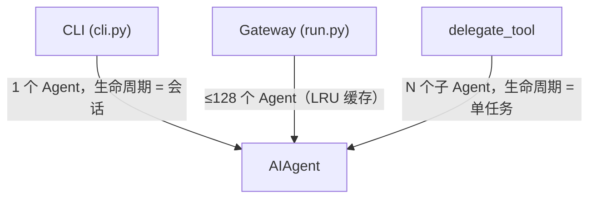
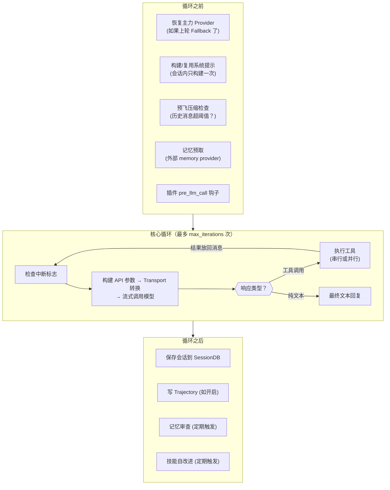
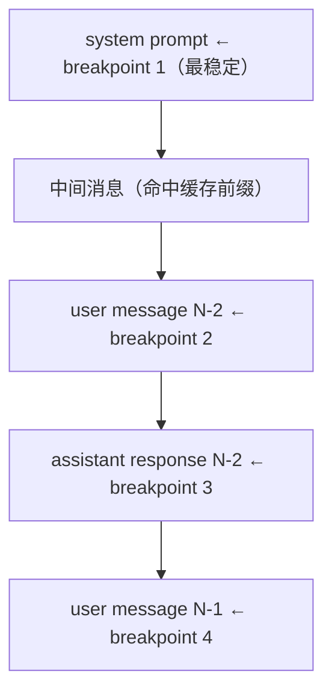
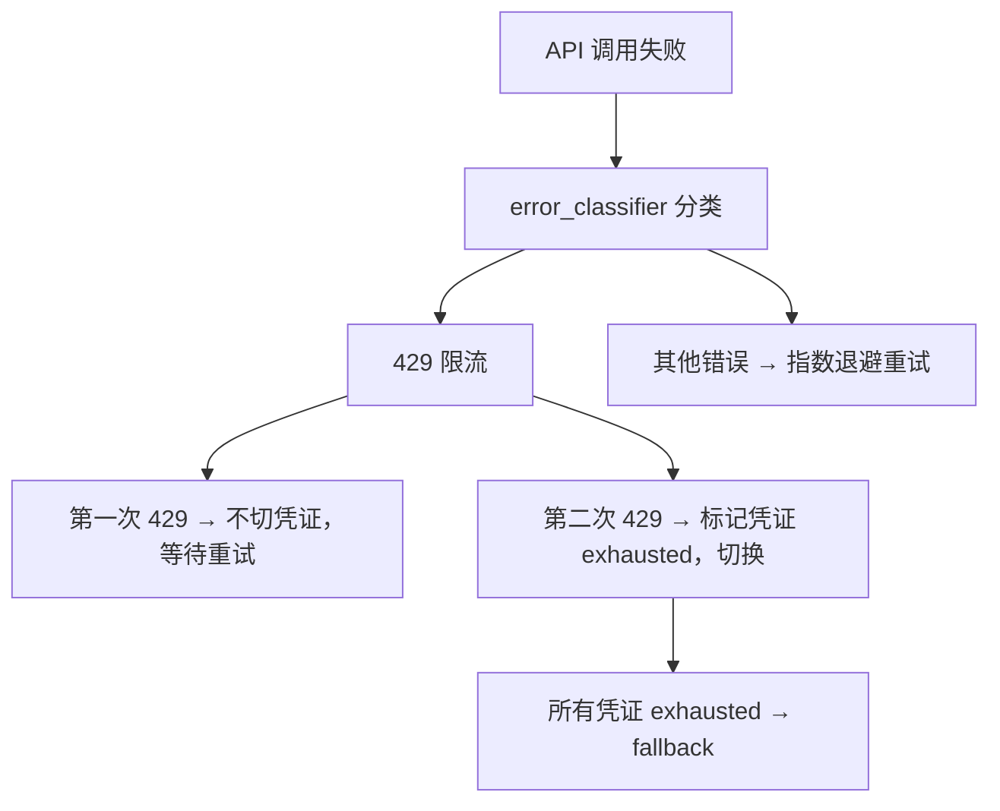
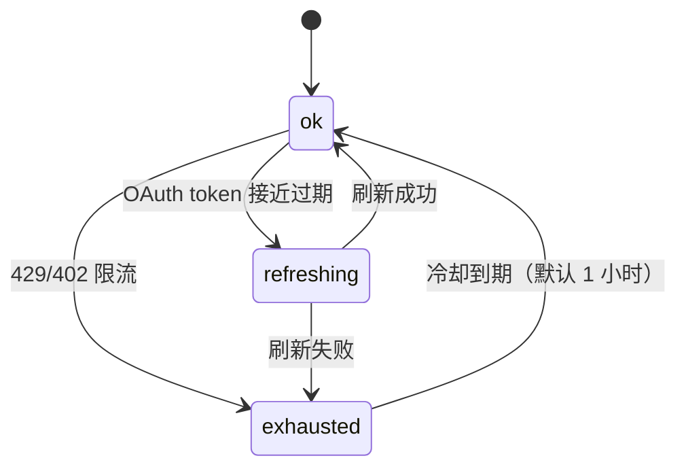

# 02-Agent 核心：对话协调器的内部运作

中文 | [English](../en/02-agent-core.md)

> **本章定位**：`run_agent.py`（4,309 行）+ `agent/` 子目录（含子目录共 102 个 .py，63,679 行）。这是 Agent 核心模块，系统的心脏。
> **关键类**：`AIAgent`（`run_agent.py:326`）——有状态的对话协调器。核心循环在 `agent/conversation_loop.py`（4,231 行）。

> **本章基于 hermes-agent commit [`3bace071b`](https://github.com/NousResearch/hermes-agent/commit/3bace071b)（2026-05-24）**

---

## 为什么要深入 AIAgent？

上一章分析了 hermes_cli——Agent 运行之前的基础设施。但当配置就位、凭证准备好之后，真正的工作从 `AIAgent` 开始。

00 章的"一条消息的旅程"已经走过了 Agent 的主线路径：构建提示词 → 调用模型 → 执行工具 → 循环。但那只是表面。`run_agent.py` + `agent/` 加起来近 68,000 行代码里，藏着大量影响性能、成本和可靠性的机制：Prompt Caching 如何节省 token 费用？被限流了怎么办？多个 API Key 怎么轮转？整个 Provider 挂了怎么自动切换？对话轨迹怎么存成训练数据？

这些不是"高级特性"——它们是让 Hermes 能在生产环境 7x24 稳定运行的基础设施。

---

## 使用指南

### 基本用法

大多数情况下，用户不需要直接和 AIAgent 打交道——CLI 和 Gateway 会自动创建和管理它。但以下几个参数影响 Agent 的行为，值得了解：

```yaml
# config.yaml 中与 Agent 核心相关的配置
agent:
  max_turns: 90           # 单次对话最大迭代次数（工具调用轮数）
  gateway_timeout: 1800   # 网关模式下的空闲超时（秒）

model:
  fallback_model:         # 主力模型挂了自动切换到哪
    provider: "openrouter"
    model: "deepseek/deepseek-r1"

credential_pool_strategies:
  openrouter: "round_robin"  # 多 Key 轮转策略

prompt_caching:
  cache_ttl: "5m"         # Prompt 缓存 TTL（"5m" 或 "1h"）
```

### 常见场景

**场景一：配置 Fallback Chain。** 主力 Provider 偶尔会限流或故障。在 `config.yaml` 中设置 `fallback_model`，Agent 会在主力耗尽重试后自动切换——用户可能只注意到回复风格略有变化，而不是聊天完全断掉。

**场景二：多 API Key 轮转。** 团队共享多把 Key 分摊配额。在 `.env` 中写多个 Key（逗号分隔），配置 `credential_pool_strategies` 选择轮转策略（fill_first / round_robin / random / least_used）。

**场景三：编程式调用。** 从 Python 代码直接使用 Agent：

```python
from run_agent import AIAgent
agent = AIAgent(base_url="https://openrouter.ai/api/v1", model="anthropic/claude-opus-4.6")
result = agent.run_conversation("分析这段代码的安全漏洞")
print(result["response"])
agent.close()
```

### 排错指引

| 问题 | 排查方向 |
|------|---------|
| Agent 循环不停止 | 检查 `max_turns` 设置；子 Agent 共享父的 `iteration_budget` |
| 频繁 429 限流 | 配置 Credential Pool 多 Key 轮转；或设置 fallback_model |
| 上下文溢出错误 | 上下文压缩器应自动处理；检查 `compression` 配置项 |
| 流式响应卡住 | 180 秒无新 token 会自动重试（`HERMES_STREAM_STALE_TIMEOUT` 可调） |

> 📖 **延伸阅读（官方文档）：**
> - [Agent Loop 内部](https://hermes-agent.nousresearch.com/docs/developer-guide/agent-loop)
> - [Fallback Provider](https://hermes-agent.nousresearch.com/docs/user-guide/features/fallback-providers)
> - [Credential Pool](https://hermes-agent.nousresearch.com/docs/user-guide/features/credential-pools)
> - [上下文压缩](https://hermes-agent.nousresearch.com/docs/developer-guide/context-compression-and-caching)

---

## 架构与实现

### AIAgent 是什么角色？

`AIAgent`（`run_agent.py:326`）本质上是一个**有状态的对话协调器**。它不是模型本身，也不是工具本身——它是坐在中间的调度员，负责把用户的意图翻译成"模型调用 + 工具执行"的序列，直到任务完成。

如果 LLM 是大脑，工具是手脚，那 AIAgent 就是神经系统——接收感觉输入（用户消息），把大脑的决策（模型响应）变成动作（工具调用），再把动作的结果反馈给大脑。

三种调用者创建 AIAgent：



**图：AIAgent 的三种创建者和生命周期差异**

v0.14.0 相比 v0.11.0 有一个重大架构变化：`run_agent.py` 从 13,293 行缩减到 4,309 行。核心循环被拆到了 `agent/conversation_loop.py`（4,231 行），系统提示构建拆到了 `agent/system_prompt.py`（380 行）和 `agent/prompt_builder.py`（1,465 行），Agent 初始化拆到了 `agent/agent_init.py`（1,637 行）。`run_agent.py` 里剩下的大多是 forwarder 函数——它们委托给 `agent/` 下的模块，保持了向后兼容的 API 表面。

### 一次完整对话的生命周期

当调用者（CLI、Gateway 或父 Agent）调用 `run_conversation()`（`conversation_loop.py:232`）时，一次对话按以下顺序展开：



**图：`run_conversation()` 的完整生命周期——循环前准备、核心循环、循环后收尾**

**循环之前**做五件事：

1. **恢复主力 Provider**（`conversation_loop.py:297`）——如果上一轮触发了 Fallback，这一轮先尝试恢复主力模型
2. **构建/复用系统提示**——会话内只构建一次，后续复用缓存（保证 Prompt Caching 命中）。Gateway 续接会话时从 SessionDB 加载旧提示，避免重建导致缓存失效
3. **预飞压缩**（`conversation_loop.py:474`）——进入循环前就检查历史消息是否超过上下文阈值，超过则最多做 3 轮压缩。这防止了"带着超长历史调 API，直到 Provider 报错才压缩"的问题
4. **记忆预取**——从外部 memory provider（以向量数据库为例）检索和当前消息相关的记忆片段，结果缓存到整个 turn 内复用（10 次工具调用不会查 10 次）
5. **插件 pre_llm_call 钩子**——插件可以在这里注入额外上下文到用户消息中（不是系统提示——那会破坏缓存）

**核心循环**的每一轮：

1. 检查中断标志——如果用户按了 Ctrl+C 或发了新消息，立即 break
2. 构建 API 参数 → Transport 转换 → 流式调用模型
3. 解析响应：如果是工具调用 → 执行工具（串行或并行）→ 把结果放回消息 → 下一轮。如果是纯文本 → 退出循环

循环受两道限制约束：`max_iterations`（默认 90，单次会话上限）和 `iteration_budget`（父子 Agent 共享的预算池，`conversation_loop.py:362`）。两者取更严的那个生效。

**循环之后**做四件事：

1. 保存会话到 SQLite（`hermes_state.py`）
2. 写 Trajectory（如果 `save_trajectories=True`）
3. 记忆审查——根据 `memory.nudge_interval` 配置，每 N 轮触发一次自动记忆整理
4. 技能自改进——根据工具调用次数，定期触发技能创建/优化

这就是一次完整对话从头到尾发生的事情。后面的各节会聚焦这条主线上的关键机制——它们各自嵌在哪个阶段、解决什么问题。

### Prompt Caching：让重复的 token 不再重复付费

每次调用模型 API，完整的消息序列（系统提示 + 历史对话 + 当前消息）都要从头发送。一个 Hermes 会话中，系统提示可能占 5,000-10,000 token，但它在 20 轮对话中几乎不变——等于同样的内容付了 20 次钱。

Prompt Caching 是对这个浪费的应对。`agent/prompt_caching.py`（79 行）实现了一个跨 Provider 通用的缓存标记策略。以 Anthropic 为例，它允许最多 4 个 `cache_control` breakpoint，Hermes 的 "system_and_3" 策略这样分配：



**图：Prompt Caching 的 breakpoint 分配——系统提示占一个，最近三条各占一个**

系统提示是最稳定的前缀——会话内不变，命中率接近 100%。Hermes 在多个层面守护前缀稳定性：系统提示只构建一次（`_cached_system_prompt`）、JSON 工具参数做 `sort_keys=True` 标准化（防序列化顺序差异导致 cache miss）、消息内容 `.strip()` 消除空白差异。

缓存 TTL 可通过 `prompt_caching.cache_ttl` 配置：5 分钟（默认，写入成本 1.25 倍）或 1 小时（写入成本 2 倍，适合消息间隔较长的 Gateway 场景）。如果缓存完全失效——不会崩溃，只是退回到正常的全量计费。这是一个"有则更好，无则不损"的优化。

### 重试与退避：优雅地处理 API 失败

调用外部 API 必然会遇到失败。对一个可能运行几小时的 Gateway 会话来说，零失败是不现实的，关键是**失败后怎么恢复**。

重试逻辑在 `agent/conversation_loop.py` 的核心循环中，每次 API 调用失败后触发。退避算法是经典的**带抖动的指数退避**（`agent/retry_utils.py:19-57`）：

```
delay = min(base × 2^(attempt-1), max_delay) + jitter
```

基础延迟 5 秒，每次翻倍，上限 120 秒。为什么加 jitter？假设 Gateway 同时服务 50 个用户，Provider 返回 429 后所有会话同时等 5 秒再重试——50 个请求同时砸过去，再次限流。Jitter 给每个会话的重试时间加随机偏移，让请求在时间上分散开。

v0.14.0 新增了 `agent/error_classifier.py`（1,134 行）——一个专门的错误分类器。它的输入是异常对象，输出是结构化的 `ClassifiedError`（包含 `reason: FailoverReason` 枚举——限流、上下文溢出、OAuth 过期等触发 failover 的原因，以及 `retryable`、`should_compress`、`should_rotate_credential`、`should_fallback` 等布尔标记）。核心循环不再需要理解每种错误的语义——它只需要问分类器"该怎么做"。这比 v0.11.0 用 if-else 硬编码错误处理是一个质的进步。

429（限流）有分层处理逻辑：



**图：API 错误的分层处理——error_classifier 分类后决定重试、轮转还是 fallback**

第一次 429 不立刻切换凭证，是因为限流可能只是瞬时的——Provider 的限流窗口可能在几秒内重置，立刻切换反而浪费了一个本可恢复的 Key。

重试解决的是"同一个凭证下的瞬时失败"。但如果 Key 本身被限流了呢？这就需要另一层机制——凭证轮换。

### Credential Pool：多密钥的生命周期管理

早期只需要一个 API Key。但当 Hermes 支持 OAuth 登录后，凭证管理变复杂了：token 有过期时间，需要刷新；团队可能共享多个 Key 分摊配额。

`agent/credential_pool.py`（1,955 行）是一个带状态的凭证容器。每次 Agent 调用模型时，不是直接拿一个固定 Key，而是问 Credential Pool "给我一个当前可用的凭证"。

池提供四种选择策略（通过 `credential_pool_strategies` 配置）：
- **fill_first**（默认）— 优先使用最高优先级的凭证，限流才用下一个
- **round_robin** — 每次轮转到队尾，做负载均衡
- **random** — 随机选，简单的去关联策略
- **least_used** — 选使用次数最少的，确保消耗均匀

每个凭证在三种状态间流转：



**图：单个凭证的三种状态转换**

一个常见的误解是 Credential Pool 由 Agent 管理。实际上，**池的创建由 CLI/Gateway 层完成**（`hermes_cli/auth.py`），在 Agent 创建之前就准备好，通过 `credential_pool=pool` 参数注入。Agent 只是消费者——它从池中选凭证、标记限流状态、触发 token 刷新，但不负责凭证从哪里来。

### Fallback Chain：跨 Provider 的自动 Fallback

重试和凭证轮转解决的是"同一个 Provider 内部的恢复"。但如果整个 Provider 都挂了——Fallback Chain 解决更上一层的问题：**自动切换到完全不同的 Provider 和模型**。

`_try_activate_fallback()`（`run_agent.py:3151`）在重试和凭证轮换都耗尽后触发。`fallback_model` 可以是单个 dict 或有序列表（链式备用）：

```yaml
# config.yaml 示例
model:
  default: "anthropic/claude-opus-4.6"
  fallback_model:
    - provider: "openrouter"
      model: "deepseek/deepseek-r1"
    - provider: "openai"
      model: "gpt-4.1"
```

主力 → 备用 1 → 备用 2，链式尝试。切换是临时的——`_restore_primary_runtime()`（`run_agent.py:3158`）会在后续请求中尝试恢复主力，成功就自动切回，用户无感知。

在 CLI 场景，用户可以用 `/model` 手动切换；但在 Gateway 场景（多用户共享同一服务），无法依赖手动干预。Fallback Chain 让 Gateway 在 Provider 故障时自动保持服务，无需任何用户介入。

到目前为止讨论的机制——重试、凭证轮换、Fallback——都在处理"做同一件事但遇到了阻碍"的情况。接下来要讲的子 Agent 处理的是另一类问题：任务本身太大，一个 Agent 不够用了。

### 子 Agent：横向分拆任务

`tools/delegate_tool.py` 让 Agent 能 spawn 子 Agent。子 Agent 运行在 `ThreadPoolExecutor` 中，默认最多 3 个并发（`_DEFAULT_MAX_CONCURRENT_CHILDREN = 3`，`delegate_tool.py:132`），共享父的 `iteration_budget`。

安全隔离是核心考量。子 Agent 的工具集是父的**子集**，且五个工具被强制禁用（`DELEGATE_BLOCKED_TOOLS`，`delegate_tool.py:45`）：
- `delegate_task` — 防递归（除非 role 是 orchestrator）
- `clarify` — 子 Agent 在后台线程，没有 stdin
- `memory` — 避免并发写 MEMORY.md
- `send_message` — 防擅自发消息
- `execute_code` — 强制逐步推理

嵌套深度默认 1 层（`MAX_DEPTH = 1`，`delegate_tool.py:133`），可通过 `delegation.max_spawn_depth` 放宽到最多 3 层。

无论是单 Agent 还是多层子 Agent，每次对话运行结束时，系统都可以把完整的执行轨迹保存下来——这就是 Trajectory 机制存在的原因。

### Trajectory：从运行时到训练数据

`agent/trajectory.py`（56 行）是 Agent 核心里最简单也最独立的模块。它在 `run_conversation()` 正常返回后，把完整对话序列追加写入 JSONL（ShareGPT 兼容格式）。它不影响任何核心逻辑，和主流程之间是单向依赖——移除它不破坏任何功能。

成功的写入 `trajectory_samples.jsonl`，失败的写入 `failed_trajectories.jsonl`——失败案例对研究者同样有价值，甚至更有价值（"模型在哪里犯错"和"做对了什么"一样重要）。Nous Research 用这些轨迹训练下一代工具调用模型，这是 Hermes "research-ready" 定位的基础设施之一。默认关闭，主要被 `batch_runner.py` 和 RL 研究流程使用。

上面讨论的几个机制——缓存、重试、凭证轮换、Fallback——都在底层默默运作。但还有两个问题需要在 Agent 运行之前解决：模型的上下文窗口有多大？Agent 是否健康、花了多少钱？

### Model Metadata：在混乱的生态中找到模型的真实参数

`agent/model_metadata.py`（1,828 行）解决一个看似简单的问题：当前模型的上下文窗口有多大？

同一个模型通过不同路径访问，参数可能完全不同——以 GPT-5.5 为例，通过 Codex OAuth 是 272K 上下文，直连 OpenAI API 是 1.05M。本地模型的上下文取决于 GPU 显存分配。有些 Provider 的 API 根本不返回元数据。

Model Metadata 实现了一条十余级 fallback 链来解析上下文长度（`get_model_context_length()`，`model_metadata.py:1430`）：配置覆盖 → 持久化缓存 → Bedrock 静态表 → 端点 API 探测 → 本地服务器查询 → OpenRouter API → models.dev 注册表 → 硬编码默认值 → 最终兜底 256K。

过度设计了吗？考虑到 Hermes 支持 35 种 Provider 和本地引擎，每个都有自己的元数据查询方式（或者根本没有），这条 fallback 链是实际需求驱动的。

### Display 和 Insights：可观测性

**`agent/display.py`**（1,037 行）处理**实时可观测性**——Agent 执行工具时终端显示什么。工具执行预览、完成行（emoji + 动词 + 耗时）、内联 diff 展示、`KawaiiSpinner` 思考动画。Spinner 不只是装饰——在长等待中给用户"系统还活着"的信号。

**`agent/insights.py`**（930 行）处理**事后可观测性**——`/insights` 命令查看使用统计：token 消耗、预估成本、按模型/平台/工具的分组统计。

两个模块都不影响 Agent 核心逻辑——完全移除它们 Agent 照常工作。它们是单向依赖的可观测性层。

### 代码组织

```
run_agent.py                  — AIAgent 类 + forwarder 函数（4,309 行）
agent/
├── conversation_loop.py      — 核心对话循环（4,231 行）
├── auxiliary_client.py       — 辅助 LLM 客户端（5,319 行）
├── agent_init.py             — Agent 初始化（1,637 行）
├── credential_pool.py        — 凭证池管理（1,955 行）
├── model_metadata.py         — 模型元数据解析（1,828 行）
├── context_compressor.py     — 上下文压缩（1,749 行）
├── prompt_builder.py         — 提示词构建（1,465 行）
├── error_classifier.py       — API 错误分类（1,134 行）
├── display.py                — 实时可观测性（1,037 行）
├── insights.py               — 事后统计（930 行）
├── system_prompt.py          — 系统提示三层组装（380 行）
├── prompt_caching.py         — Prompt Cache 标记（79 行）
├── retry_utils.py            — 退避算法（57 行）
├── trajectory.py             — 轨迹保存（56 行）
├── transports/               — Provider 适配层（已在 00 章覆盖）
│   ├── base.py               — ProviderTransport ABC
│   ├── chat_completions.py   — OpenAI 兼容
│   ├── anthropic.py          — Anthropic 原生
│   ├── bedrock.py            — AWS Bedrock
│   └── codex.py              — OpenAI Codex Responses
└── ...（另 ~60 个文件）
```

### 设计决策

#### 从上帝文件到模块化

v0.11.0 的 `run_agent.py` 有 13,293 行。v0.14.0 缩减到 4,309 行——9,000 行被拆到 `agent/` 子目录。核心循环去了 `conversation_loop.py`，初始化去了 `agent_init.py`，系统提示去了 `system_prompt.py`。`run_agent.py` 变成了一个 forwarder 壳——保持 `AIAgent` 的 API 表面不变，但实现委托给各子模块。

这不是一步到位的重构，而是渐进式的。`agent/` 目录会继续增长，但 `AIAgent` 作为外部 API 的稳定性不受影响。

#### 错误分类器的引入

v0.11.0 的错误处理是 if-else 硬编码。v0.14.0 引入了 `error_classifier.py`——一个专门的分类器，输入是异常对象，输出是结构化的 `ClassifiedError`（包含 `reason`、`retryable`、`should_compress`、`should_rotate_credential`、`should_fallback` 等布尔标记）。核心循环不再需要理解每种错误的语义——它只需要问分类器"该怎么做"。

### 扩展点

1. **自定义 Transport**：实现 `ProviderTransport` 的四个方法即可支持新 Provider
2. **自定义 ContextEngine**：实现 `ContextEngine` ABC 替换默认的压缩策略
3. **自定义 MemoryProvider**：通过插件注入外部记忆后端
4. **Fallback Chain**：通过 `fallback_model` 配置链式备用

---

## 与其他章节的关系

| 关联章节 | 关系 |
|---------|------|
| 00 — 项目全景 | Agent 核心循环和 Transport 层的概览已在 00 章给出 |
| 01 — 基础设施层 | hermes_cli 负责创建 AIAgent 并注入凭证和配置 |
| 03 — 工具系统 | Agent 通过 model_tools.py 调度工具，工具层是 Agent 的"手脚" |
| 04 — 网关层 | Gateway 创建并缓存 AIAgent 实例（≤128 个） |
| 06 — 插件框架 | 插件通过 PluginContext 注入钩子，在 Agent 循环的多个节点介入 |

---

*本文基于 hermes-agent v0.14.0 源码分析。所有代码引用均经过独立验证。*
