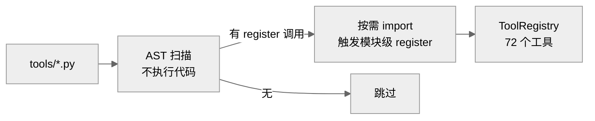
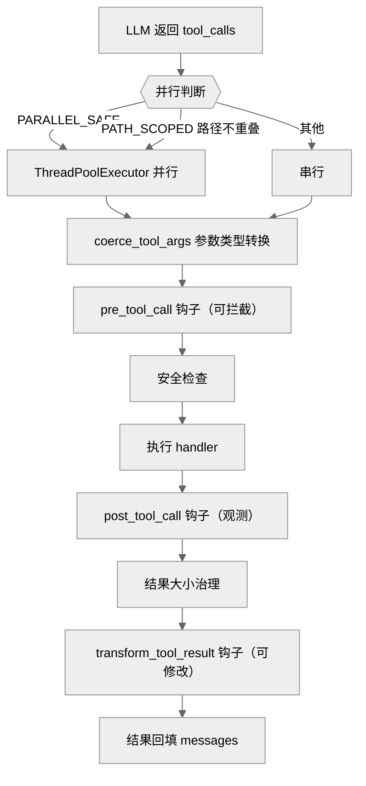
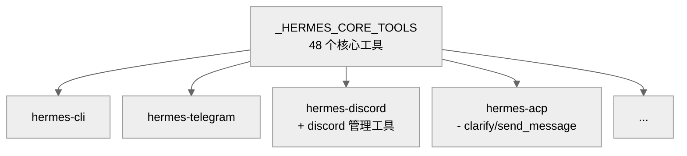
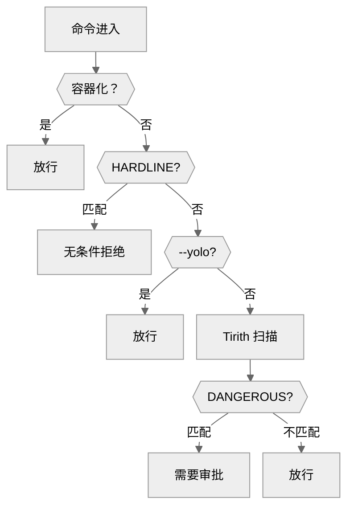
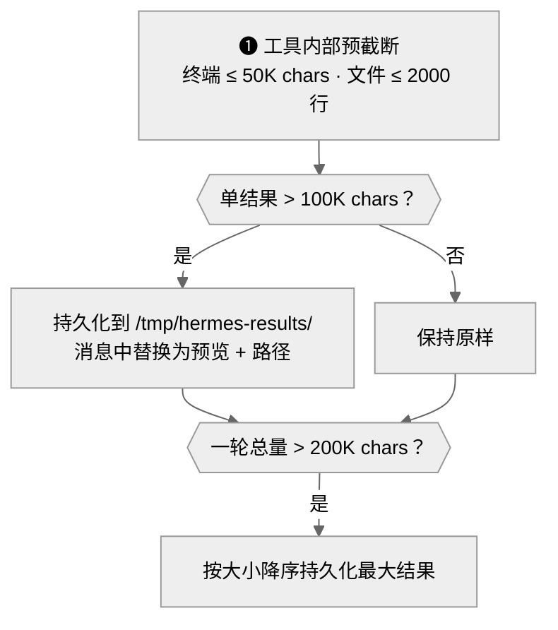

# 03-工具系统：Agent 的执行能力

中文 | [English](../en/03-tool-system.md)

> **本章定位**：`tools/` 目录（96 个 .py（含子目录），68,250 行）+ `model_tools.py`（923 行）+ `toolsets.py`（876 行）。这是工具层——Agent 的执行能力集合。
> **关键类**：`ToolRegistry`（`tools/registry.py:151`）、`handle_function_call()`（`model_tools.py:741`）。

> **本章基于 hermes-agent commit [`3bace071b`](https://github.com/NousResearch/hermes-agent/commit/3bace071b)（2026-05-24）**

---

## Agent 只会思考，工具让它能做事

在前两章中，我们看到 AIAgent 的核心循环是"调用模型 → 解析响应 → 执行工具 → 循环"。模型负责决策（"我应该搜索一下网页"），但真正去搜索的不是模型——而是工具系统。没有工具，Agent 就只是一个会聊天的 API 客户端。

如果你想理解 Agent 的执行能力边界，或者遇到"工具没被调用"、"工具结果不对"、"命令被拒绝"等问题需要排查，这一章是入口。

---

## 使用指南

### 基本用法

工具对用户是透明的——你不需要手动调用工具，模型会根据需要自动选择。但以下几个操作影响工具的可用性：

```bash
hermes tools              # 交互式管理工具集启用/禁用
hermes tools enable mcp   # 启用 MCP 工具集
hermes tools disable browser  # 禁用浏览器工具
```

### 配置

```yaml
# config.yaml 中与工具系统相关的配置
toolsets: ["hermes-cli"]         # 当前使用的工具集

platform_toolsets:
  telegram: ["hermes-telegram"]  # 平台级工具集覆盖

security:
  require_approval: true         # 危险命令需要审批
  approvals:
    mode: "smart"                # smart/manual/off
  tirith_fail_open: true         # Tirith 不可用时放行（默认）

mcp:
  servers:                       # MCP 服务器配置
    filesystem:
      command: "npx"
      args: ["-y", "@anthropic/mcp-server-fs"]
```

### 常见场景

**场景一：接入 MCP 工具。** 在 `config.yaml` 的 `mcp.servers` 中添加服务器配置，重启后 `hermes tools` 就能看到新的 `mcp-*` 前缀工具集。MCP 工具和内置工具使用完全相同的注册接口，从 Agent 角度没有区别。

**场景二：给 Telegram 禁用浏览器。** 在 `config.yaml` 的 `platform_toolsets.telegram` 中配置不包含 browser 系列的工具集——或者用 `hermes tools` 在 Telegram 平台页面下禁用浏览器类。

**场景三：开启 smart 审批。** 设置 `security.approvals.mode: "smart"`，辅助 LLM 会自动判断命令是否安全（APPROVE/DENY/ESCALATE），只有不确定的才打扰用户。在 Gateway 场景下特别有用。

### 排错指引

| 问题 | 排查方向 |
|------|---------|
| 模型不调用某个工具 | `hermes tools` 确认工具已启用；检查 `check_fn` 是否返回 True（30 秒 TTL 缓存）；确认工具在当前平台 toolset 中 |
| 工具注册了但从未执行 | 检查 `pre_tool_call` 钩子是否拦截了（`model_tools.py:784`）；检查 `_AGENT_LOOP_TOOLS` 保留名单（`model_tools.py:771`） |
| 工具调用报错 | 检查 `agent.log`（工具错误经过 `_sanitize_tool_error` 净化，日志中有原始异常）；`handle_function_call()`（`model_tools.py:741`）是调度入口 |
| 命令被拒绝 BLOCKED | 可能原因：HARDLINE 匹配（无法绕过）、sudo stdin guard（`sudo -S` 猜密码）、DANGEROUS 匹配（`approval.py:316`）、Gateway 审批超时 300 秒（`approval.py:1307`）。查看 `config.yaml` 的 `command_allowlist` |
| MCP 工具没出现 | 检查 `mcp.servers` 配置是否正确；MCP 服务进程是否启动成功（查看 `agent.log` 中的 MCP 连接日志）|
| 工具结果被截断 | 单个结果超 100K chars 会被持久化到 `/tmp/hermes-results/`，消息中只保留 1500 chars 预览 + 路径；模型可以用 `read_file` 读完整内容 |
| 工具执行超时 | 终端命令默认无超时（无限等待）；可通过 `terminal.timeout` 配置限制 |

> 📖 **延伸阅读（官方文档）：**
> - [工具与工具集](https://hermes-agent.nousresearch.com/docs/user-guide/features/tools)
> - [MCP 集成](https://hermes-agent.nousresearch.com/docs/user-guide/features/mcp)
> - [安全机制](https://hermes-agent.nousresearch.com/docs/user-guide/security)
> - [工具运行时](https://hermes-agent.nousresearch.com/docs/developer-guide/tools-runtime)

---

## 架构与实现

### 一个工具长什么样？

理解工具系统之前，先看一个具体的工具定义。所有 72 个工具都遵循同一个三步模式。以 `read_file` 为例（`tools/file_tools.py`）：

**❶ 定义 Schema** — 告诉模型"这个工具叫什么、接收什么参数"，使用 OpenAI function-calling 的标准 JSON 格式：

```json
{
  "name": "read_file",
  "description": "Read a text file with line numbers...",
  "parameters": {
    "type": "object",
    "properties": {
      "path": {"type": "string"},
      "offset": {"type": "integer", "default": 1},
      "limit": {"type": "integer", "default": 500}
    },
    "required": ["path"]
  }
}
```

**❷ 实现 Handler** — 一个普通的 Python 函数，接收 `args` 字典和关键字参数，返回 JSON 字符串：

```python
def _handle_read_file(args, **kw):
    tid = kw.get("task_id") or "default"
    return read_file_tool(path=args.get("path", ""), ...)
```

返回值必须是 JSON 字符串。`registry.py` 提供两个辅助函数：`tool_result(data)`（`registry.py:577`）返回成功结果，`tool_error(message)`（`registry.py:563`）返回错误。

**❸ 注册** — 在模块级别调用 `registry.register()`：

```python
registry.register(
    name="read_file", toolset="file",
    schema=READ_FILE_SCHEMA, handler=_handle_read_file,
    check_fn=_check_file_reqs, emoji="📖",
    max_result_size_chars=100_000
)
```

`check_fn` 是可选的可用性检查函数，在每次获取工具定义时调用（结果缓存 30 秒，`registry.py:116`）。以 Browser 工具为例，它的 check_fn 检查 Playwright 是否已安装——若返回 False，该工具被静默移出可用列表，模型不会看到它的 schema。这就是为什么某些工具"存在但不可用"——它们注册了但 check_fn 把它们过滤掉了。

为什么选择 OpenAI 的 function-calling 格式？因为这是行业事实标准——所有主流 LLM 都理解。Transport 层在必要时将其转换为各 Provider 的原生格式（以 Anthropic 的 `input_schema` 为例），但**工具定义只写一次**。

### 工具怎么被发现和加载的？

96 个工具文件不是在启动时全部 import 的——那会拉入 Playwright、faster-whisper 等重依赖，拖慢启动。`discover_builtin_tools()`（`tools/registry.py:57`）用两阶段加载：



**图：两阶段工具发现——AST 扫描确认必要性，再按需 import**

为什么用 AST 而非"import 所有文件然后 try-except"？因为 import 会执行模块级代码，可能有副作用（以建立数据库连接为例）。AST 只解析语法树不执行代码，是零副作用的发现机制。如果 AST 扫描失败（以文件有语法错误为例），该文件被静默跳过并记录 warning，不影响其他工具加载。

### 从 LLM 返回 tool_call 到结果回填

在 02 章的核心循环中，当 LLM 返回包含 `tool_calls` 的响应时，控制权转到工具层。完整的执行路径是：



**图：工具调用的完整执行路径——包含参数转换、三个钩子、安全检查、结果治理**

关键步骤说明：

1. **并行判断**（`agent/tool_dispatch_helpers.py:103`）：`_should_parallelize_tool_batch()` 按四条规则决定：
   - `_NEVER_PARALLEL_TOOLS`（`tool_dispatch_helpers.py:41`）：`clarify` 永不并行
   - `_PARALLEL_SAFE_TOOLS`（`tool_dispatch_helpers.py:44`）：`read_file`、`web_search`、`vision_analyze` 等 11 个只读工具，总是可以并行
   - `_PATH_SCOPED_TOOLS`（`tool_dispatch_helpers.py:59`）：`write_file`、`patch`——在目标路径不重叠时可以并行，路径重叠则回退串行
   - MCP 工具：由 MCP server 的 `supports_parallel_tool_calls` 标志控制（`tool_dispatch_helpers.py:90`）
   - 如果参数解析失败（JSON 非法），直接回退串行（`tool_dispatch_helpers.py:116`）

2. **参数类型转换**（`model_tools.py:768`）：`coerce_tool_args()` 对参数做类型强制转换（以字符串 `"42"` 转为整数 `42` 为例）。排查"参数类型错误"时从这里入手

3. **三个钩子依次执行**（`model_tools.py:784-887`）：
   - `pre_tool_call`（`model_tools.py:784`）：执行前触发，插件可返回 block 消息**阻止执行**——排查"工具注册了但从未执行"时，检查是否被 pre_tool_call 拦截
   - `post_tool_call`（`model_tools.py:825`）：执行后触发，仅观测（返回值被忽略），用于记录耗时等指标
   - `transform_tool_result`（`model_tools.py:866`）：最后触发，插件可返回字符串**替换结果**

4. **安全检查**：terminal 工具的命令经过 `check_all_command_guards()`（详见下文"安全三道防线"）

5. **结果大小治理**：注意——治理不在 `handle_function_call()` 内部，而在上层的 `_invoke_tool()`（`run_agent.py`），在 handler 返回之后执行。详见下文"结果大小治理"

6. **回填**：最终结果作为 `{"role": "tool", "content": result}` 消息追加到 `messages` 列表

注意：工具错误信息会经过 `_sanitize_tool_error()`（`model_tools.py:525`）净化——防止异常中的 framing tokens 进入模型上下文。这意味着 debug 时工具返回值中的错误信息可能与原始异常不同，需要查 `agent.log` 获取完整异常。

### 工具集：同一批工具，不同场景

并非所有场景都需要所有工具。CLI 用户可能需要浏览器，但 Telegram 群聊不需要——想象一个 Agent 在群里自动打开浏览器访问网页。

`toolsets.py` 定义了一个**共享核心 + 平台扩展**的模型。`_HERMES_CORE_TOOLS`（`toolsets.py:31-73`）列出 48 个核心工具，所有平台共享。每个平台的 toolset 在核心基础上增减：



**图：工具集的共享核心 + 平台扩展模型**

工具集支持递归组合——`resolve_toolset()`（`toolsets.py:600`）做 DFS 展开并检测环路。用户可以通过 `config.yaml` 的 `platform_toolsets` 覆盖任何平台的工具集。如果某个工具的依赖不满足（以 Playwright 未安装为例），`check_fn` 在注册时返回 False，该工具被静默从可用列表中移除。

### 安全：三道防线

工具系统最敏感的部分是安全——Agent 执行的命令可能删除文件、修改系统配置、发起网络请求。Hermes 在工具调用路径上设了三道防线，各守不同的攻击向量：第一道（命令审批）拦截**危险的命令意图**——用正则识别 `rm -rf /` 这样的操作；第二道（路径 + URL 安全）拦截**结构性绕过攻击**——路径穿越和 SSRF；第三道（Tirith）拦截**内容伪装攻击**——用语义分析发现正则看不见的威胁（以 Unicode 同质字形伪造的域名为例）。三者串联，覆盖从命令层到数据层的威胁面。

#### 第一道：命令审批（approval.py，1,424 行）

`check_all_command_guards()`（`approval.py:1043`）是入口，按优先级执行六级检查：



**图：命令审批的六级检查——从容器豁免到硬核封锁到 DANGEROUS 模式匹配**

检查流程逐级说明：

1. **容器化环境检测**——Docker、Singularity、Modal、Daytona 内的命令直接放行，因为容器本身就是沙箱
2. **HARDLINE_PATTERNS**（`approval.py:198`）——无条件拒绝的命令模式，即使 `--yolo` 也不能绕过。包括 `rm -rf /`、`mkfs`、fork bomb 等 12 类极端危险操作。这是 Hermes 的安全底线
2b. **sudo stdin guard**（`approval.py:1065`）——阻止 Agent 通过 `sudo -S` 管道猜密码攻击，同样无法被 `--yolo` 绕过。错误信息为 `"BLOCKED: sudo password guessing via stdin"`
3. **--yolo / approvals.mode=off**——用户显式选择跳过所有审批（除 HARDLINE 和 sudo guard 外）
4. **Tirith 内容扫描**（`tools/tirith_security.py`，803 行）——外部 Rust 二进制，检测 Unicode 同质字形伪装 URL 等正则无法捕获的内容级威胁。默认 `fail_open=true`（不可用时放行）。*（Tirith 的完整介绍见下文"第三道防线"一节）*
5. **DANGEROUS_PATTERNS**（`approval.py:316`）——15 个正则匹配危险命令模式（`rm -rf`、`chmod 777`、`DROP TABLE`、`git reset --hard`、`curl | sh` 等）
6. **审批**——匹配到 DANGEROUS 或 smart 模式判定为可疑时，触发审批。审批方式取决于平台：CLI 是交互式提示（once/session/always/deny），Gateway 是异步等待用户响应（最长 300 秒），smart 模式用辅助 LLM 自动判断（APPROVE/DENY/ESCALATE）

审批结果持久化：`always` 级别写入 `config.yaml` 的 `command_allowlist`，后续同类命令不再询问。

Gateway 场景下审批等待 300 秒后超时，返回 `"BLOCKED: Command timed out without user response"`（`approval.py:1307`）——这是 Gateway 下命令"被拒绝"最常见的原因之一。Cron 模式下有独立的配置（`approval.py:1089`）：`cron_mode=deny` 时危险命令直接拒绝，`cron_mode=approve` 时全部放行。

当 Tirith 和 DANGEROUS_PATTERNS 同时有发现时，两者合并为**一次**审批请求（`approval.py:1107`），避免用户被连续打扰。

#### 第二道：路径和 URL 安全

**路径安全**（`tools/path_security.py`，43 行）——防止路径遍历攻击。`validate_within_dir()` 用 `path.resolve().relative_to(root)` 确保文件操作不逃逸出允许目录。

**URL 安全**（`tools/url_safety.py`，351 行）——防止 SSRF（Server-Side Request Forgery）。`is_safe_url()` 对 URL 做 DNS 解析后检查 IP，**fail-closed**（DNS 失败则拒绝）。永久封锁所有云平台元数据端点：`169.254.169.254`（AWS/GCP）、`metadata.google.internal`、Azure/DigitalOcean 等。即使配置了 `security.allow_private_urls: true` 放开私网 IP，元数据端点仍不可访问——这防止了 Agent 在云服务器上读取 VM 的 IAM 凭证。

#### 第三道：Tirith 内容级扫描

Tirith（`tools/tirith_security.py`，803 行）是外部 Rust 二进制，检测正则无法捕获的内容级威胁。首次使用时从 GitHub releases 自动下载，验证 SHA-256 校验和和 cosign 供应链签名。下载在后台线程进行，不阻塞 Agent 启动。

### MCP：让外部工具成为一等公民

通过 MCP（Model Context Protocol），任何实现了 MCP 协议的外部服务都能注册为 Hermes 的工具。

关键设计：**MCP 工具和内置工具使用完全相同的注册接口**。`discover_mcp_tools()`（`tools/mcp_tool.py`）在启动时连接配置的 MCP servers，获取工具列表，然后用同一个 `registry.register()` 注册进 ToolRegistry。从 Agent 角度看，MCP 工具和内置工具没有区别。

MCP 工具的 toolset 以 `mcp-` 开头（以 `mcp-filesystem` 为例），便于按需启用禁用。注册时有重名保护：MCP 工具之间可互相覆盖，但 MCP 工具不能覆盖内置工具（反之亦然）。当 MCP server 的工具列表变化时，server 发送 `tools/list_changed` 通知，Hermes 自动做 deregister + 重新注册，无需重启 Agent。

MCP 的实现细节值得了解：

- **独立后台事件循环**（`mcp_tool.py:64`）：MCP 运行在 daemon 线程中的专用 asyncio 事件循环上，工具调用通过 `run_coroutine_threadsafe()` 跨线程调度。这解释了为什么 MCP 工具的超时行为和内置工具不同
- **三种传输协议**（`mcp_tool.py:30`）：stdio（子进程通信，最常用）、HTTP/StreamableHTTP（远程服务）、SSE（Server-Sent Events）。配置中的 `command` 字段表示 stdio，`url` 字段表示 HTTP
- **Sampling 功能**（`mcp_tool.py:40`）：MCP server 可以通过 `sampling/createMessage` 反向请求 LLM 完成——这意味着 MCP 工具调用可能触发嵌套的 LLM 请求，排查意外的 LLM 调用时需要考虑这个路径
- **自动重连**：连接失败时指数退避重试（最多 5 次）。如果 MCP server 持续不可用，该 server 的工具被静默移除
- **安全**：MCP 子进程只继承白名单环境变量（PATH、HOME、USER 等），敏感凭证不泄露到外部进程

### 结果大小治理

不管工具是内置的还是通过 MCP 接入的，它们都面临同一个现实问题：输出可能很大。如果工具返回了 1MB 的文件内容，全部塞进消息历史会怎样？上下文爆炸、费用飙升、延迟变高。Hermes 用三层机制控制：



**图：工具结果大小治理——❶ 预截断 → ❷ per-result 持久化 → ❸ per-turn 预算**

这个设计的巧妙之处：**不丢弃信息**。超大结果被持久化到文件系统，消息中放 1500 chars 预览 + 路径，模型需要完整内容时用 `read_file` 读取。代价是多一次工具调用，但不会无声地丢失信息。

特殊处理：`read_file` 虽然注册时设置了 `max_result_size_chars=100_000`，但 `budget_config.py:12` 的 `PINNED_THRESHOLDS` 在运行时将其覆盖为 `float('inf')`——因为如果 read_file 结果也被持久化，模型就需要用 read_file 读 read_file 的持久化结果，陷入无限循环。这个覆盖机制通过 `BudgetConfig.resolve_threshold()` 实现，优先级链为：pinned → tool_overrides → registry → default。

### 终端后端：8 种执行环境

Agent 的 `terminal` 工具不一定在本地执行命令。`tools/environments/` 提供了 8 种后端：

| 后端 | 文件 | 场景 |
|------|------|------|
| Local | `local.py` | 默认，直接在宿主机执行 |
| Docker | `docker.py` | 容器隔离，适合不信任的命令 |
| SSH | `ssh.py` | 远程服务器执行 |
| Daytona | `daytona.py` | 云沙箱，空闲时休眠 |
| Singularity | `singularity.py` | HPC 容器 |
| Modal (SDK) | `modal.py` | Serverless，按用量计费 |
| Modal (托管) | `managed_modal.py` | 通过工具网关代理 |
| Vercel Sandbox | `vercel_sandbox.py` | Vercel 云沙箱 |

8 种后端的核心差异在于**隔离级别和执行位置**：Local 无隔离，命令直接运行在宿主机；Docker/Singularity 提供进程级容器隔离，适合运行不信任的代码；Modal 和 Vercel Sandbox 是完全无状态的云沙箱，启动延迟高但无运维负担；Daytona 和 SSH 则针对持久化远程环境，SSH 用于已有的服务器，Daytona 提供生命周期管理（空闲时自动休眠以节省费用）。

选择后端时，三个维度最重要：**安全需求**（是否需要沙箱隔离）、**持久状态需求**（是否需要跨任务保留文件系统）、**执行位置**（本地、私有服务器还是云端）。

所有后端实现 `BaseEnvironment` 接口（`tools/environments/base.py`），Agent 和工具代码不需要关心命令在哪里执行——切换后端只需改 `config.yaml` 的 `terminal.backend`。但某些后端有额外依赖（以 Modal 为例，需要 `pip install modal` 和 Modal 账号配置）。

排查终端后端问题时需要了解两个隐性行为：

- **CWD 持久化**（`base.py:279`）：Session 通过在命令输出中嵌入 `__HERMES_CWD_{session_id}__` 标记来传递工作目录。远端后端（SSH、Modal）解析这个标记来同步 CWD。如果命令输出恰好包含类似字符串，可能导致 CWD 解析错误
- **Snapshot 退化**（`base.py:399`）：如果 `init_session()` 失败（`snapshot_ready=False`），后续每个命令都用 `bash -l` 执行，绕过了环境变量继承——之前命令设置的环境变量在后续命令中消失。表现为"命令结果不对"
- **后台进程挂起**（`base.py:505`）：命令后台化时（`cmd &`），grandchild 进程继承 stdout pipe，导致工具一直等待。设置 `HERMES_DEBUG_INTERRUPT=1` 环境变量可开启详细的 poll 日志帮助定位

### 代码组织

```
model_tools.py           — 工具调度入口（923 行）
toolsets.py              — 工具集定义 + 平台映射（876 行）
tools/
├── registry.py          — ToolRegistry 单例 + 发现逻辑（600+ 行）
├── approval.py          — 命令审批六级检查（1,424 行）
├── browser_tool.py      — 12 个浏览器工具（3,799 行）
├── mcp_tool.py          — MCP 客户端集成（3,593 行）
├── delegate_tool.py     — 子 Agent 委托（2,801 行，详见第 02 章）
├── terminal_tool.py     — 终端执行（2,405 行）
├── file_tools.py        — 文件读写搜索（1,244 行）
├── file_operations.py   — 文件操作底层（1,910 行）
├── web_tools.py         — Web 搜索和提取（1,561 行）
├── code_execution_tool.py — 代码执行沙箱（1,783 行）
├── skills_tool.py       — 技能管理工具（1,567 行）
├── url_safety.py        — URL 安全检查（351 行）
├── tirith_security.py   — Tirith 内容扫描（803 行）
├── path_security.py     — 路径安全（43 行）
├── tool_result_storage.py — 结果持久化（232 行）
├── budget_config.py     — 结果大小预算（51 行）
├── environments/        — 8 种终端后端
└── ...（另 ~70 个工具文件）
```

### 设计决策

#### 自注册 vs 集中式注册

Hermes 选择了自注册模式——每个工具文件在被 import 时自己调用 `registry.register()`，而不是有一个中央文件逐一列出所有工具。好处：新增工具只需创建文件，不需要修改任何其他文件。代价：工具的注册顺序取决于 import 顺序，但这在实践中不是问题（注册表是字典，按名称查找，不依赖顺序）。

#### MCP 工具和内置工具同接口

MCP 工具可以用完全不同的注册路径——比如单独的 MCP 调度层。但 Hermes 选择让 MCP 工具和内置工具走同一个 `ToolRegistry`，对 Agent 透明。好处：Agent 核心不需要区分工具来源，简化了工具调度逻辑。代价：MCP 工具的错误和内置工具的错误在日志中不容易区分（排查时需要看 toolset 名称的 `mcp-` 前缀）。

#### 结果持久化而非截断

传统做法是直接截断超大工具结果。Hermes 选择持久化到文件 + 消息中放预览。好处：信息不丢失。代价：需要额外一次 `read_file` 工具调用，增加了一轮 Agent 循环。

### 扩展点

1. **新增内置工具**：创建 `tools/<name>.py`，实现 schema + handler + `registry.register()`
2. **新增 MCP 工具**：在 `config.yaml` 的 `mcp.servers` 中添加服务器配置
3. **新增终端后端**：实现 `BaseEnvironment` 接口
4. **自定义工具集**：在 `config.yaml` 的 `toolsets` 或 `platform_toolsets` 中组合
5. **自定义安全策略**：通过 `command_allowlist` 预批准特定命令模式

---

## 与其他章节的关系

| 关联章节 | 关系 |
|---------|------|
| 02 — Agent 核心 | Agent 通过 `_execute_tool_calls()` 调用工具层，工具结果回填到 messages |
| 04 — 网关层 | 不同平台使用不同 toolset，Gateway 负责 toolset 选择 |
| 05 — 协议适配层 | MCP 工具通过 `mcp_tool.py` 接入，ACP 有独立的工具子集 |
| 06 — 插件框架 | 插件通过 `transform_tool_result` 钩子修改工具结果 |
| 10 — Kanban 系统 | `kanban_tools.py` 提供看板操作工具，在核心工具列表中 |

---

*本文基于 hermes-agent v0.14.0 源码分析。所有代码引用均经过独立验证。*
