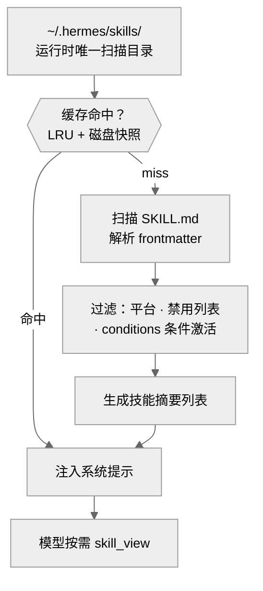
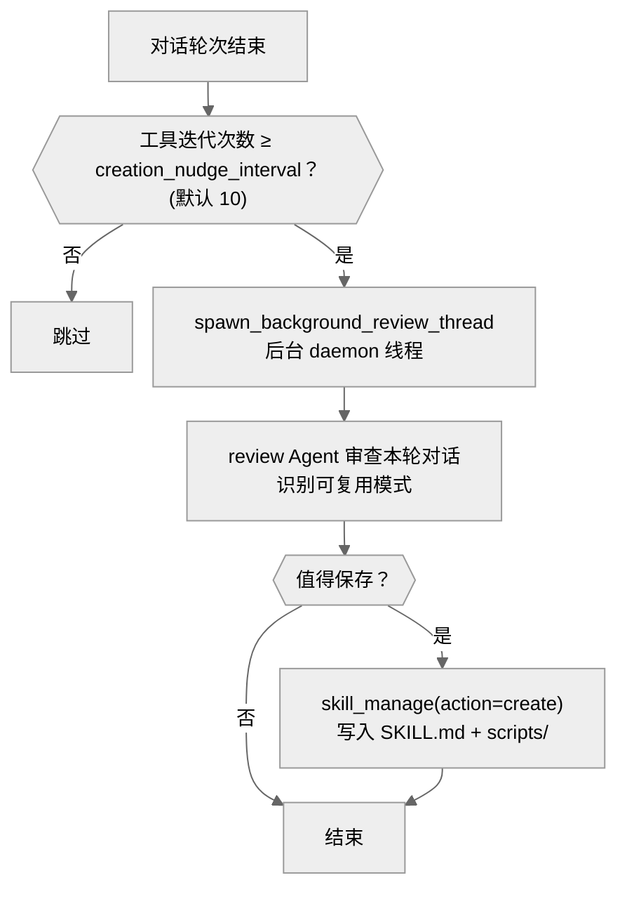

# 04-技能系统：Agent 的学习能力

中文 | [English](../en/04-skill-system.md)

> **本章定位**：`skills/`（89 个内置技能，25 个分类）+ `optional-skills/`（81 个可选技能，17 个分类）+ `tools/skills_tool.py`（1,567 行）+ `tools/skill_manager_tool.py`（1,034 行）+ `agent/background_review.py`（593 行）+ `hermes_cli/skills_hub.py`（1,617 行）。
> **关键函数**：`skill_manage()`（`skill_manager_tool.py:816`）、`spawn_background_review_thread()`（`background_review.py:558`）。

> **本章基于 hermes-agent commit [`3bace071b`](https://github.com/NousResearch/hermes-agent/commit/3bace071b)（2026-05-24）**

---

## 为什么 Agent 需要"技能"？

hermes-agent 的 tagline 是 "The self-improving AI agent — **creates skills from experience, improves them during use**"。技能系统是这个 tagline 的核心实现。

没有技能系统的 Agent 是无状态的——它每次对话都从零开始，不记得上次怎么解决类似问题。技能系统让 Agent 能把成功的经验抽象成可复用的操作手册，下次遇到类似问题时直接调用。

以一个具体场景为例：你让 Agent 帮你查了一篇 arXiv 论文，它摸索出了正确的 curl 命令和解析方式。没有技能系统，下次你再让它查论文，它要重新摸索一遍。有了技能系统，Agent 会在对话结束后自动审查这次经验，创建一个 "arxiv" 技能保存下来——下次模型在系统提示中看到这个技能，直接按已知方法执行，不再试错。

07 章已经建立了技能和插件的对比（技能是给模型的操作手册 + 沙箱脚本，插件是进程内扩展）。本章深入技能系统的内部：技能长什么样、怎么被发现和加载、Agent 怎么自动创建和改进技能、Skills Hub 怎么工作。

---

## 使用指南

### 基本用法

```bash
hermes skills             # 交互式管理技能启用/禁用
hermes skills list        # 列出所有可用技能
hermes skills browse         # 浏览 Skills Hub（agentskills.io）
hermes skills install <name>  # 从 Hub 安装技能
```

在对话中，用 `/` 加技能名直接加载：

```
/arxiv          # 加载 arxiv 技能
/polymarket     # 加载 polymarket 技能
```

模型也可以自行决定加载技能——系统提示中包含所有可用技能的摘要列表，模型根据用户需求通过 `skills_list` 和 `skill_view` 工具浏览和加载。

### 配置

```yaml
# config.yaml
skills:
  disabled: []                  # 全局禁用的技能
  platform_disabled:
    telegram: ["godmode"]       # 平台级禁用
  # 禁用自动创建：设 creation_nudge_interval: 0
  creation_nudge_interval: 10   # 每 N 次工具迭代触发一次技能审查（默认 10）
```

### 常见场景

**场景一：安装社区技能。** `hermes skills browse` 浏览 agentskills.io，找到想要的技能后 `hermes skills install <name>`。安装的技能放在 `~/.hermes/skills/` 下，和内置技能使用方式相同。

**场景二：Agent 自动创建技能。** 不需要你做任何事——当 Agent 在一次对话中使用了较多工具调用（说明任务复杂），对话结束后 `background_review.py` 会在后台 fork 一个 review Agent，审查这次对话，如果发现可复用的模式就自动创建技能。

**场景三：手动创建技能。** 在对话中告诉 Agent"把刚才的方法保存为技能"，Agent 会用 `skill_manage(action="create")` 创建 SKILL.md。你也可以直接在 `~/.hermes/skills/` 下创建目录和 SKILL.md 文件。

### 排错指引

| 问题 | 排查方向 |
|------|---------|
| 技能不出现在列表中 | `hermes skills list` 检查；确认 SKILL.md 存在且 frontmatter 格式正确 |
| `/技能名` 不触发 | 确认技能未被禁用（`skills.disabled` 或 `skills.platform_disabled`） |
| 技能修改后没生效 | 两层缓存（进程内 LRU + 磁盘快照 `~/.hermes/.skills_prompt_snapshot.json`）可能未失效。重启 Agent 或调用 `clear_skills_system_prompt_cache()` |
| 技能脚本执行失败 | 脚本通过 `terminal`/`execute_code` 在沙箱中执行——检查依赖是否安装、路径是否正确 |
| Skills Hub 安装失败 | 检查网络连通性；Hub 技能下载到 `~/.hermes/skills/` |

> 📖 **延伸阅读（官方文档）：**
> - [技能系统](https://hermes-agent.nousresearch.com/docs/user-guide/features/skills)
> - [创建技能](https://hermes-agent.nousresearch.com/docs/developer-guide/creating-skills)
> - [Skills Hub](https://hermes-agent.nousresearch.com/docs/user-guide/skills)

---

## 架构与实现

### 一个技能长什么样？

每个技能是一个目录，至少包含一个 `SKILL.md` 文件。以 `skills/research/polymarket/` 为例：

```
polymarket/
├── SKILL.md          — 技能定义（frontmatter + 正文）
├── scripts/
│   └── polymarket.py — Python 工具脚本（命令行工具）
└── references/
    └── api-endpoints.md — 参考文档（模型可以读取）
```

**SKILL.md 的 frontmatter**（YAML 格式）定义了技能的元数据：

```yaml
---
name: polymarket
description: "Query Polymarket: markets, prices, orderbooks, history."
version: 1.0.0
author: Hermes Agent + Teknium
tags: [polymarket, prediction-markets, market-data]
platforms: [linux, macos, windows]
---
```

关键字段：`name`（标识符）、`description`（出现在系统提示的技能列表中，模型靠它决定是否加载）、`platforms`（平台兼容性过滤）、`tags`（分类和搜索用）。

**正文**是自然语言指令——告诉模型什么时候用这个技能、怎么用、有哪些命令和 API。模型加载技能后，正文内容被注入到系统提示中。

**scripts/ 目录**包含可执行的 Python 脚本。以 `polymarket.py` 为例，它是一个标准的命令行工具（`python3 polymarket.py search "bitcoin"`），模型通过 `terminal` 工具执行。脚本在沙箱中运行，不在 Agent 进程内——这是技能和插件的关键区别。

**references/ 目录**包含参考文档，模型可以通过 `read_file` 工具按需读取。

### 技能怎么被发现和加载？



**图：技能从发现到注入系统提示的完整路径**

1. **运行时只扫描一个目录**：`~/.hermes/skills/`（加可选的 `skills.external_dirs` 配置中的外部目录）。注意：`<repo>/skills/` 和 `<repo>/optional-skills/` 不是运行时直接读取的——它们是**安装时的种子来源**，在 `hermes setup` 或首次启动时通过 `sync_skills()` 复制到 `~/.hermes/skills/`。`optional-skills/` 更特殊——它通过 Skills Hub 的 `OptionalSkillSource` 适配器暴露，用户需要 `hermes skills install official/<name>` 才能安装到 `~/.hermes/skills/`
2. **两层缓存检查**：先查进程内 LRU 缓存（key 是 `(skills_dir, tools, toolsets, platform, disabled)` 的组合），再查磁盘快照（`~/.hermes/.skills_prompt_snapshot.json`，用 mtime/size manifest 验证）。只有两层都 miss 才重新扫描文件系统。这就是为什么修改 SKILL.md 后可能不会立即生效——需要等缓存过期或调用 `clear_skills_system_prompt_cache(clear_snapshot=True)` 强制刷新
3. **过滤**：检查平台兼容性（`platforms` 字段）、禁用列表（`skills.disabled`）、**条件激活**（`conditions` 字段——技能可以声明只在特定工具集可用时才显示，`prompt_builder.py:1064`）
4. **摘要列表**：把所有可用技能的 `name` 和 `description` 生成列表，注入系统提示的 `<available_skills>` 块
5. **按需加载**：模型通过 `skill_view` 工具读取特定技能的完整内容

### Agent 怎么自动创建技能？

这是 hermes-agent "自改进"能力的核心。02 章步骤 ⓮ 提到"技能自改进——根据工具调用次数，定期触发技能创建/优化"，这里展开具体机制。



**图：Agent 自动创建技能的完整流程**

`spawn_background_review_thread()`（`background_review.py:558`）是入口。它在 daemon 线程中创建一个独立的 review Agent（全新的 `AIAgent` 实例，`max_iterations=16`），通过 toolset 白名单只授予 `memory` 和 `skills` 两个工具集下的工具。review Agent **继承主 Agent 的模型**（`model=agent.model`，`background_review.py:403`）——不是单独配置的辅助模型。`skip_memory=True` 防止 review fork 向外部记忆 Provider（以 Honcho 为例）泄漏 harness prompt。

review Agent 审查本轮对话，决定：

1. 有没有值得记住的信息？→ 写入 MEMORY.md
2. 有没有可复用的操作模式？→ 创建技能

`skill_provenance.py`（78 行）用 ContextVar 追踪技能的写入来源——区分"后台 review 自动创建"和"前台用户指令创建"。这让后续的 curator（技能策展人）只处理自动创建的技能，不干扰用户手动创建的。

### 技能怎么自改进？

Agent 在使用某个技能的过程中如果发现技能不完善（以"命令参数变了"或"缺少某个场景的处理"为例），可以直接用 `skill_manage(action="edit")` 或 `skill_manage(action="patch")` 修改 SKILL.md，或用 `skill_manage(action="write_file")` 添加新的脚本和参考文档。


### Skills Hub：社区共享

`hermes_cli/skills_hub.py`（1,617 行）实现了与 agentskills.io 的集成。Skills Hub 是一个开放的技能分享平台，兼容 agentskills.io 标准。

```bash
hermes skills browse                      # 浏览热门技能
hermes skills search "finance"     # 搜索
hermes skills install stock-trader # 安装
hermes skills publish my-skill     # 发布自己的技能
```

安装的技能放在 `~/.hermes/skills/` 下。Skills Hub 技能和内置技能使用方式完全相同——都被扫描、过滤、注入系统提示。

### 代码组织

```
tools/skills_tool.py         — 技能浏览和加载（skills_list、skill_view）（1,567 行）
tools/skill_manager_tool.py  — 技能创建/编辑/删除（skill_manage）（1,034 行）
agent/background_review.py   — 后台自动审查和创建（593 行）
hermes_cli/skills_hub.py     — Skills Hub 集成（1,617 行）
hermes_cli/skills_config.py  — hermes skills 命令（177 行）
tools/skill_provenance.py    — 写入来源追踪（78 行）

skills/                      — 89 个内置技能（25 个分类）
optional-skills/             — 81 个可选技能（17 个分类）
```

### 设计决策

#### 为什么技能是自然语言而不是代码？

因为 Agent 需要能**自己创建**技能。如果技能是 Python 代码，Agent 就需要写正确的代码（导入、注册、错误处理），失败率高。SKILL.md 是自然语言——Agent 只需要描述"遇到这种问题用这种方法"，这对 LLM 来说是最自然的输出格式。脚本（scripts/）是可选的附件，不是必须的。

#### review Agent 的成本考量

review Agent 继承主 Agent 的模型（`background_review.py:403`），没有单独的辅助模型配置。这意味着后台审查的成本和主对话一样——但 `max_iterations=16` 限制了审查深度，且 `skip_memory=True` 避免了额外的外部记忆 API 调用。如果你的主模型是高成本的（以 Claude Opus 为例），审查的成本会比预期更高——这是"自改进"能力的代价。

### 扩展点

1. **手动创建技能**：在 `~/.hermes/skills/<category>/<name>/` 下创建 SKILL.md
2. **Skills Hub 安装**：`hermes skills install <name>`
3. **平台级禁用**：`config.yaml` 的 `skills.platform_disabled`
4. **调整审查频率**：`skills.creation_nudge_interval`（默认 10 次工具迭代）

---

## 附录：内置技能完整索引

### 内置技能（89 个，25 个分类）

#### apple（5 个）——Apple 生态集成
| 技能 | 用途 |
|------|------|
| apple-notes | 通过 memo CLI 管理 Apple Notes：创建、搜索、编辑 |
| apple-reminders | 通过 remindctl 管理 Apple Reminders：添加、列出、完成 |
| findmy | 通过 FindMy.app 追踪 Apple 设备和 AirTag（macOS） |
| imessage | 通过 imsg CLI 收发 iMessage/SMS（macOS） |
| macos-computer-use | macOS 桌面控制（Computer Use 工具的操作手册） |

#### autonomous-ai-agents（5 个）——AI 代理协作
| 技能 | 用途 |
|------|------|
| claude-code | 委托编码任务给 Claude Code CLI |
| codex | 委托编码任务给 OpenAI Codex CLI |
| hermes-agent | 配置、扩展或为 Hermes Agent 做贡献 |
| kanban-codex-lane | Kanban worker 通过 Codex CLI 执行独立实现 |
| opencode | 委托编码任务给 OpenCode CLI |

#### creative（20 个）——创意和设计
| 技能 | 用途 |
|------|------|
| architecture-diagram | 暗色主题 SVG 架构/云/基础设施图 |
| ascii-art | ASCII 艺术：pyfiglet、cowsay、boxes、图像转 ASCII |
| ascii-video | ASCII 视频：视频/音频转彩色 ASCII MP4/GIF |
| baoyu-article-illustrator | 文章插图：类型 × 风格 × 调色板一致性 |
| baoyu-comic | 知识漫画：教育、传记、教程 |
| baoyu-infographic | 信息图：21 种布局 × 21 种风格 |
| claude-design | 设计 HTML 原型（落地页、演示文稿） |
| comfyui | 通过 ComfyUI 生成图像、视频和音频 |
| creative-ideation | 通过创意约束生成项目灵感 |
| design-md | 编写/验证 Google DESIGN.md 设计规范 |
| excalidraw | 手绘风格 Excalidraw JSON 图表 |
| humanizer | 文本人性化：去除 AI 痕迹，添加真实语感 |
| manim-video | Manim CE 动画：3Blue1Brown 风格数学/算法视频 |
| p5js | p5.js 创意编程：生成艺术、着色器、交互、3D |
| pixel-art | 像素艺术：NES、Game Boy、PICO-8 等时代调色板 |
| popular-web-designs | 54 个真实设计系统（Stripe、Linear、Vercel）的 HTML/CSS |
| pretext | 基于 @chenglou/pretext 的浏览器文本排版演示 |
| sketch | 一次性 HTML 草图：2-3 个设计变体快速对比 |
| songwriting-and-ai-music | 歌词创作和 Suno AI 音乐提示词 |
| touchdesigner-mcp | 通过 MCP 控制 TouchDesigner 实时视觉创作（36 个工具） |

#### data-science（1 个）
| 技能 | 用途 |
|------|------|
| jupyter-live-kernel | 通过 hamelnb 连接 Jupyter 内核做迭代式 Python 开发 |

#### devops（3 个）——运维和部署
| 技能 | 用途 |
|------|------|
| kanban-orchestrator | Kanban 编排者的分解策略和反自做规则 |
| kanban-worker | Kanban 工人的陷阱、示例和边界情况手册 |
| webhook-subscriptions | Webhook 订阅：事件驱动的 Agent 运行 |

#### dogfood（1 个）
| 技能 | 用途 |
|------|------|
| dogfood | Web 应用探索性 QA：找 bug、收集证据、生成报告 |

#### email（1 个）
| 技能 | 用途 |
|------|------|
| himalaya | 通过 Himalaya CLI 管理 IMAP/SMTP 邮件 |

#### gaming（2 个）
| 技能 | 用途 |
|------|------|
| minecraft-modpack-server | 搭建 modded Minecraft 服务器（CurseForge、Modrinth） |
| pokemon-player | 通过无头模拟器 + RAM 读取玩 Pokemon |

#### github（6 个）——GitHub 工作流
| 技能 | 用途 |
|------|------|
| codebase-inspection | 通过 pygount 检查代码库：LOC、语言、比率 |
| github-auth | GitHub 认证配置：HTTPS token、SSH key、gh CLI |
| github-code-review | PR 审查：diff、行内评论（通过 gh 或 REST） |
| github-issues | Issue 管理：创建、分类、标签、分配 |
| github-pr-workflow | PR 生命周期：分支、提交、创建、CI、合并 |
| github-repo-management | 仓库管理：克隆、创建、fork、远程、发布 |

#### mcp（1 个）
| 技能 | 用途 |
|------|------|
| native-mcp | MCP 客户端：连接服务器、注册工具（stdio/HTTP） |

#### media（5 个）——媒体处理
| 技能 | 用途 |
|------|------|
| gif-search | 通过 Tenor API 搜索/下载 GIF |
| heartmula | HeartMuLa：从歌词和标签生成音乐（类 Suno） |
| songsee | 音频频谱图/特征分析（mel、chroma、MFCC） |
| spotify | Spotify 控制：播放、搜索、队列、播放列表、设备 |
| youtube-content | YouTube 视频转录 → 摘要、线程、博客 |

#### mlops（9 个）——机器学习运维
| 技能 | 用途 |
|------|------|
| audiocraft | AudioCraft：MusicGen 文本转音乐、AudioGen 文本转声音 |
| dspy | DSPy：声明式 LM 程序、自动优化提示词、RAG |
| huggingface-hub | HuggingFace hf CLI：搜索/下载/上传模型和数据集 |
| llama-cpp | llama.cpp 本地 GGUF 推理 + HF Hub 模型发现 |
| lm-evaluation-harness | lm-eval-harness：LLM 基准测试（MMLU、GSM8K 等） |
| obliteratus | OBLITERATUS：消除 LLM 拒绝行为（diff-in-means） |
| segment-anything | SAM：零样本图像分割（点、框、遮罩） |
| vllm | vLLM：高吞吐量 LLM 服务、OpenAI API、量化 |
| weights-and-biases | W&B：ML 实验日志、超参搜索、模型注册 |

#### note-taking（1 个）
| 技能 | 用途 |
|------|------|
| obsidian | Obsidian 知识库：读取、搜索、创建、编辑笔记 |

#### productivity（9 个）——生产力工具
| 技能 | 用途 |
|------|------|
| airtable | Airtable REST API：记录增删改查、过滤、upsert |
| google-workspace | Gmail、Calendar、Drive、Docs、Sheets（通过 gws CLI 或 Python） |
| linear | Linear：通过 GraphQL + curl 管理 Issue、项目、团队 |
| maps | 地理编码、POI、路线、时区（OpenStreetMap/OSRM） |
| nano-pdf | 通过 nano-pdf CLI 编辑 PDF 文本/错别字/标题 |
| notion | Notion API + ntn CLI：页面、数据库、Markdown |
| ocr-and-documents | 从 PDF/扫描件提取文本（pymupdf、marker-pdf） |
| powerpoint | 创建/读取/编辑 .pptx 幻灯片 |
| teams-meeting-pipeline | 通过 Hermes CLI 操作 Teams 会议摘要管线 |

#### red-teaming（1 个）
| 技能 | 用途 |
|------|------|
| godmode | LLM 越狱：Parseltongue、GODMODE、ULTRAPLINIAN |

#### research（5 个）——研究工具
| 技能 | 用途 |
|------|------|
| arxiv | 通过关键词、作者、类别或 ID 搜索 arXiv 论文 |
| blogwatcher | 通过 blogwatcher-cli 监控博客和 RSS/Atom 订阅源 |
| llm-wiki | Karpathy 的 LLM Wiki：构建/查询互链 Markdown 知识库 |
| polymarket | 查询 Polymarket：市场、价格、订单簿、历史 |
| research-paper-writing | 为 NeurIPS/ICML/ICLR 写 ML 论文：从设计到提交 |

#### smart-home（1 个）
| 技能 | 用途 |
|------|------|
| openhue | 通过 OpenHue CLI 控制 Philips Hue 灯光、场景、房间 |

#### social-media（1 个）
| 技能 | 用途 |
|------|------|
| xurl | 通过 xurl CLI 操作 X/Twitter：发帖、搜索、DM、媒体 |

#### software-development（11 个）——软件开发实践
| 技能 | 用途 |
|------|------|
| debugging-hermes-tui-commands | 调试 Hermes TUI 斜杠命令 |
| hermes-agent-skill-authoring | 编写规范的 SKILL.md：frontmatter、验证、结构 |
| node-inspect-debugger | 通过 --inspect + Chrome DevTools 协议调试 Node.js |
| plan | 计划模式：写 Markdown 计划，不执行代码 |
| python-debugpy | 通过 pdb REPL + debugpy 远程调试 Python |
| requesting-code-review | 提交前审查：安全扫描、质量门禁、自动修复 |
| spike | 一次性实验：在构建前验证想法 |
| subagent-driven-development | 通过 delegate_task 子代理执行计划（两阶段审查） |
| systematic-debugging | 四阶段根因调试：先理解 bug 再修复 |
| test-driven-development | TDD：强制 RED-GREEN-REFACTOR，先写测试再写代码 |
| writing-plans | 写实施计划：可执行的任务拆解 |

#### yuanbao（1 个）
| 技能 | 用途 |
|------|------|
| yuanbao | 元宝群组：@提及用户、查询信息/成员 |

### 可选技能（81 个，17 个分类）

可选技能不随 hermes-agent 默认安装，需要通过 `hermes skills install` 或手动放入 `~/.hermes/skills/` 启用。

#### autonomous-ai-agents（2 个）
| 技能 | 用途 |
|------|------|
| blackbox | 委托编码任务给 Blackbox AI CLI（多模型 + 内置裁判） |
| honcho | 配置和使用 Honcho 记忆：跨会话用户建模 |

#### blockchain（3 个）
| 技能 | 用途 |
|------|------|
| evm | 只读 EVM 客户端：钱包、代币、Gas（8 条链） |
| hyperliquid | Hyperliquid 市场数据、账户历史、交易审查 |
| solana | 查询 Solana 链上数据：钱包余额、代币组合、交易 |

#### communication（1 个）
| 技能 | 用途 |
|------|------|
| one-three-one-rule | 1-3-1 沟通法则 |

#### creative（5 个）
| 技能 | 用途 |
|------|------|
| blender-mcp | 通过 MCP 控制 Blender：3D 对象、材质、动画 |
| concept-diagrams | 生成教育风格 SVG 图表（明暗模式适配） |
| hyperframes | HTML 视频合成：标题卡、字幕、音频可视化 |
| kanban-video-orchestrator | 通过 Kanban 多代理管线编排视频制作 |
| meme-generation | 使用 Pillow 生成真实 meme 图片 |

#### devops（4 个）
| 技能 | 用途 |
|------|------|
| cli | 通过 inference.sh CLI 运行 150+ AI 应用 |
| docker-management | Docker 容器、镜像、卷、网络、Compose 管理 |
| pinggy-tunnel | 通过 SSH 的零安装 localhost 隧道（Pinggy） |
| watchers | 轮询 RSS、JSON API 和 GitHub（水印去重） |

#### dogfood（1 个）
| 技能 | 用途 |
|------|------|
| adversarial-ux-test | 角色扮演最难搞的用户做产品 UX 测试 |

#### email（1 个）
| 技能 | 用途 |
|------|------|
| agentmail | 通过 AgentMail 给 Agent 专属邮箱 |

#### finance（8 个）——金融建模
| 技能 | 用途 |
|------|------|
| 3-statement-model | 三表模型（利润表、资产负债表、现金流量表） |
| comps-analysis | 可比公司分析：运营指标、估值倍数 |
| dcf-model | DCF 估值模型：收入预测、FCF、WACC |
| excel-author | 用 openpyxl 构建审计级 Excel 工作簿 |
| lbo-model | 杠杆收购模型：资金来源、债务、IRR/MOIC |
| merger-model | 并购模型：合并利润表、协同效应、EPS 影响 |
| pptx-author | 用 python-pptx 构建 PowerPoint 演示文稿 |
| stocks | 股票行情、历史、搜索、对比、加密货币 |

#### health（2 个）
| 技能 | 用途 |
|------|------|
| fitness-nutrition | 健身和营养指导 |
| neuroskill-bci | 脑机接口技能 |

#### mcp（2 个）
| 技能 | 用途 |
|------|------|
| fastmcp | 用 FastMCP 构建/测试/部署 MCP 服务器 |
| mcporter | 通过 mcporter CLI 管理 MCP 服务器/工具 |

#### migration（1 个）
| 技能 | 用途 |
|------|------|
| openclaw-migration | 从 OpenClaw 迁移到 Hermes Agent |

#### mlops（28 个）——机器学习工具链
| 技能 | 用途 |
|------|------|
| accelerate | HuggingFace Accelerate：4 行代码加分布式训练 |
| axolotl | Axolotl：YAML 配置 LLM 微调（LoRA、DPO、GRPO） |
| chroma | Chroma 向量数据库：存储嵌入、语义搜索 |
| clip | OpenAI CLIP：视觉-语言连接、零样本分类 |
| faiss | Facebook FAISS：高效向量相似度搜索和聚类 |
| flash-attention | Flash Attention：2-4x 加速、10-20x 内存优化 |
| guidance | 用正则和语法控制 LLM 输出格式 |
| huggingface-tokenizers | Rust 实现的快速分词器：1GB < 20 秒 |
| instructor | 从 LLM 响应提取结构化数据（Pydantic 验证） |
| lambda-labs | Lambda Labs GPU 云实例 |
| llava | LLaVA：视觉指令调优、图像对话 |
| modal | Modal：Serverless GPU 云平台 |
| nemo-curator | GPU 加速的 LLM 训练数据策展 |
| outlines | Outlines：结构化 JSON/正则/Pydantic LLM 生成 |
| peft | PEFT：LoRA、QLoRA 等 25+ 种参数高效微调方法 |
| pinecone | Pinecone 向量数据库：托管、自动扩展 |
| pytorch-fsdp | PyTorch FSDP 完全分片数据并行训练 |
| pytorch-lightning | PyTorch Lightning：高级训练框架 |
| qdrant | Qdrant 向量搜索引擎：RAG 和语义搜索 |
| saelens | SAELens：稀疏自编码器训练和分析 |
| simpo | SimPO：无参考的 LLM 偏好优化 |
| slime | Slime：Megatron+SGLang 框架 RL 后训练 |
| stable-diffusion | Stable Diffusion 文本转图像 |
| tensorrt-llm | NVIDIA TensorRT-LLM：最大吞吐量推理优化 |
| torchtitan | torchtitan：PyTorch 原生 4D 并行 LLM 预训练 |
| trl-fine-tuning | TRL：SFT、DPO、PPO、GRPO 和奖励建模 |
| unsloth | Unsloth：2-5x 更快的 LoRA/QLoRA 微调 |
| whisper | OpenAI Whisper：99 种语言语音识别和翻译 |

#### productivity（7 个）
| 技能 | 用途 |
|------|------|
| canvas | Canvas LMS 集成：获取课程和作业 |
| here-now | 发布静态站点到 {slug}.here.now |
| memento-flashcards | 记忆闪卡 |
| shop-app | Shop.app：商品搜索、订单追踪、退货 |
| shopify | Shopify Admin & Storefront GraphQL API |
| siyuan | 思源笔记 API：搜索、读取、创建、管理块和文档 |
| telephony | 通过 Twilio 给 Agent 电话能力：收发 SMS/MMS |

#### research（11 个）
| 技能 | 用途 |
|------|------|
| bioinformatics | 400+ 生物信息学技能入口（基因组学、转录组学等） |
| darwinian-evolver | 用进化循环优化提示词/正则/SQL/代码 |
| domain-intel | 被动域名侦察：子域名、SSL、WHOIS、DNS |
| drug-discovery | 药物发现 |
| duckduckgo-search | DuckDuckGo 免费搜索（无需 API Key） |
| gitnexus-explorer | 用 GitNexus 索引代码库并提供知识图谱 |
| osint-investigation | 公共记录 OSINT 调查框架（SEC、USAspending 等） |
| parallel-cli | Parallel CLI：Agent 原生搜索和深度研究 |
| qmd | 本地知识库搜索（混合检索引擎） |
| scrapling | Scrapling 网页抓取：HTTP、隐形浏览器、反 Cloudflare |
| searxng-search | SearXNG 元搜索：聚合 70+ 搜索引擎 |

#### security（3 个）
| 技能 | 用途 |
|------|------|
| 1password | 1Password CLI：安装、登录、读取密钥 |
| oss-forensics | 开源软件取证 |
| sherlock | OSINT 用户名搜索：400+ 社交网络 |

#### software-development（1 个）
| 技能 | 用途 |
|------|------|
| rest-graphql-debug | 调试 REST/GraphQL API：状态码、认证、schema |

#### web-development（1 个）
| 技能 | 用途 |
|------|------|
| page-agent | 嵌入 alibaba/page-agent 到 Web 应用（浏览器内 GUI 代理） |

---

## 与其他章节的关系

| 关联章节 | 关系 |
|---------|------|
| 00 — 项目全景 | 技能是"自改进"核心卖点的实现 |
| 02 — Agent 核心 | 步骤 ⓮ 的技能自改进由 `background_review.py` 实现 |
| 03 — 工具系统 | `skill_manage` 和 `skills_list`/`skill_view` 是注册工具 |
| 07 — 插件框架 | 技能 vs 插件的对比在 07 章建立 |

---

*本文基于 hermes-agent v0.14.0 源码分析。所有代码引用均经过独立验证。*
