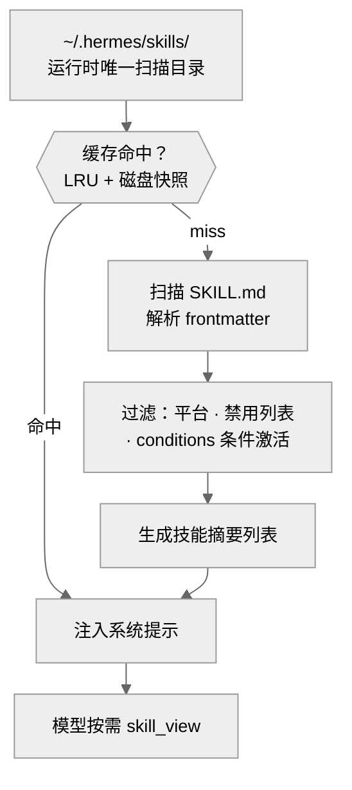
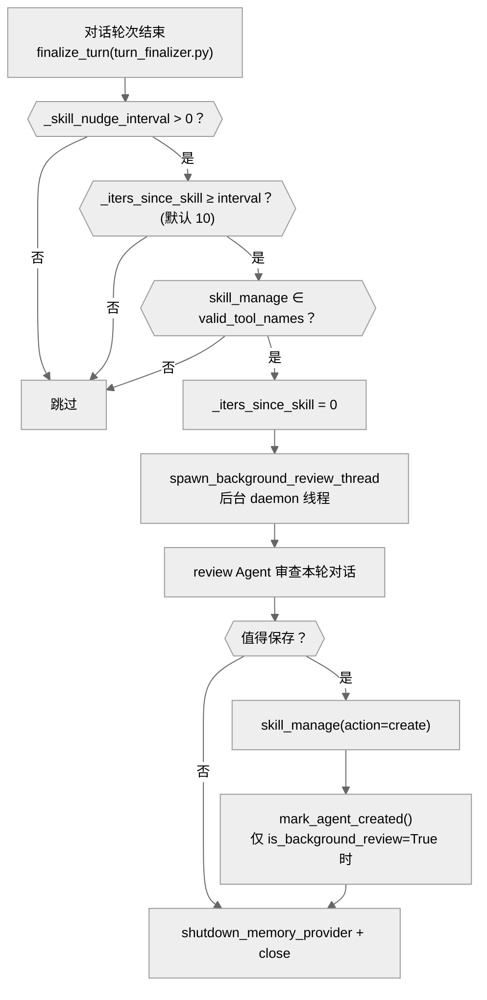
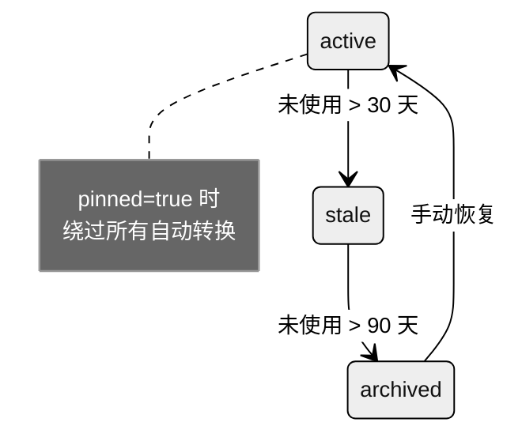
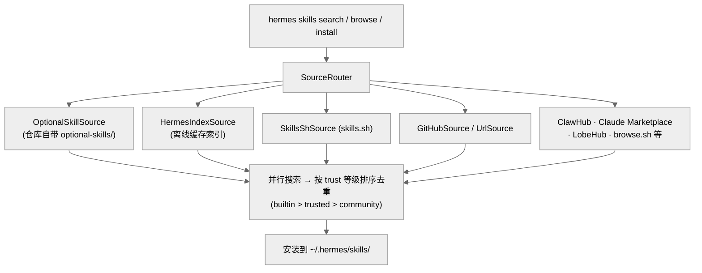

# 04-技能系统：Agent 的学习能力

中文 | [English](../en/04-skill-system.md)

> **本章定位**：`skills/`（72 个内置技能，17 个技能分类）+ `optional-skills/`（102 个可选技能，19 个分类）+ `tools/skills_tool.py`（1,681 行）+ `tools/skill_manager_tool.py`（1,559 行）+ `agent/background_review.py`（960 行）+ `hermes_cli/skills_hub.py`（1,997 行）。
> **关键函数**：`skill_manage()`（`skill_manager_tool.py:1320`）、`spawn_background_review_thread()`（`background_review.py:925`）。

> **本章基于 hermes-agent v0.18.2（tag [`v2026.7.7.2`](https://github.com/NousResearch/hermes-agent/releases/tag/v2026.7.7.2)，commit `9de9c25f6`，2026-07-07）**

---

## 为什么 Agent 需要"技能"？

hermes-agent 的 tagline 是 "The self-improving AI agent — **creates skills from experience, improves them during use**"。技能系统是这个 tagline 的核心实现。

没有技能系统的 Agent 是无状态的——它每次对话都从零开始，不记得上次怎么解决类似问题。技能系统让 Agent 能把成功的经验抽象成可复用的操作手册，下次遇到类似问题时直接调用。

以一个具体场景为例：你让 Agent 帮你查了一篇 arXiv 论文，它摸索出了正确的 curl 命令和解析方式。没有技能系统，下次你再让它查论文，它要重新摸索一遍。有了技能系统，Agent 会在对话结束后自动审查这次经验，创建一个 "arxiv" 技能保存下来——下次模型在系统提示中看到这个技能，直接按已知方法执行，不再试错。

07 章已经建立了技能和插件的对比（技能是给模型的操作手册 + 沙箱脚本，插件是进程内扩展）。本章先从使用者视角看技能系统——怎么安装、启用、排错——然后揭开引擎盖，深入实现机制：技能长什么样、怎么被发现和加载、Agent 怎么自动创建和改进技能、Skills Hub 怎么工作。

---

## 使用指南

### 基本用法

```bash
hermes skills             # 交互式管理技能启用/禁用
hermes skills list        # 列出所有可用技能
hermes skills browse         # 浏览 Skills Hub（多源聚合技能市场）
hermes skills install <name>  # 从 Hub 安装技能
```

在对话中，用 `/` 加技能名直接加载：

```
/arxiv          # 加载 arxiv 技能
/polymarket     # 加载 polymarket 技能
```

模型也可以自行决定加载技能——系统提示中包含所有可用技能的摘要列表，模型根据用户需求通过 `skills_list` 和 `skill_view` 工具浏览和加载。

### 配置

```yaml
# config.yaml
skills:
  disabled: []                  # 全局禁用的技能
  platform_disabled:
    telegram: ["godmode"]       # 平台级禁用
  # 禁用自动创建：设 creation_nudge_interval: 0
  creation_nudge_interval: 10   # 每 N 次工具迭代触发一次技能审查（默认 10）

auxiliary:
  background_review:            # 后台审查的模型路由（v0.18 新增，详见架构节）
    provider: "auto"            # auto = 继承主模型（默认）
    model: ""
```

### 常见场景

**场景一：安装社区技能。** `hermes skills browse` 浏览多源技能市场（skills.sh、GitHub、官方可选库等十个数据源聚合，见架构节），找到想要的技能后 `hermes skills install <name>`。安装的技能放在 `~/.hermes/skills/` 下，和内置技能使用方式相同。

**场景二：Agent 自动创建技能。** 不需要你做任何事——当 Agent 在一次对话中使用了较多工具调用（说明任务复杂），对话结束后 `background_review.py` 会在后台启动一个 daemon 线程，创建一个独立的 review Agent 实例审查这次对话，如果发现可复用的模式就自动创建技能。

**场景三：手动创建技能。** 在对话中告诉 Agent"把刚才的方法保存为技能"，Agent 会用 `skill_manage(action="create")` 创建 SKILL.md。你也可以直接在 `~/.hermes/skills/` 下创建目录和 SKILL.md 文件。

### 排错指引

| 问题 | 排查方向 |
|------|---------|
| 技能不出现在列表中 | ① 确认 SKILL.md 存在且 frontmatter 格式正确 ② 检查 `conditions` 条件激活——`fallback_for_toolsets` 可能在当前工具集存在时静默隐藏技能 ③ 检查同名冲突（`_find_all_skills()` 用 `seen_names` 去重，本地优先，`skills_tool.py:634`） ④ frontmatter 超过 4000 字符会被截断致解析失败——技能**仍会出现在列表里**，但名称退化为目录名、描述被污染（`skills_tool.py:654`；解析失败后 name 回退 `skill_dir.name`）——看到"名字变成了目录名"就是这个原因 |
| `/技能名` 不触发 | 确认技能未被禁用（`skills.disabled` 或 `skills.platform_disabled`） |
| 技能加载显示 SETUP_NEEDED | 缺少 `required_environment_variables` 声明的环境变量或 `required_credential_files`，运行 setup 或手动设置 |
| 技能修改后没生效 | 缓存分两层：磁盘层（mtime 检测，修改文件自动失效）和进程内层（内存缓存，只有重启 Agent 或调用 `clear_skills_system_prompt_cache()` 才能清除）——详见架构节 |
| 技能没有自动创建 | 检查三个触发条件（现居 `turn_finalizer.py:456-458`）：`creation_nudge_interval > 0`、工具迭代次数够、`skill_manage` 工具集已启用。排查入口：`spawn_background_review_thread()`（`background_review.py:925`） |
| 后台审查线程失败 | 日志 `WARNING: Background memory/skill review failed`（写入 agent.log；该 warning 在重定向 context 之外执行，靠 logger handler 落盘）。审查运行期间 stdout 和 stderr 都被重定向到 devnull，用户界面看不到中途输出 |
| 内置技能"消失了" | 可能被 Curator 归档了——`prune_builtins` **默认开启**，长期未使用的内置技能也会进 `.archive/`（可恢复），详见 Curator 节 |
| 技能脚本执行失败 | 脚本通过 `terminal`/`execute_code` 在沙箱中执行——检查依赖是否安装、路径是否正确 |
| Skills Hub 安装失败 | 检查网络连通性；Hub 技能下载到 `~/.hermes/skills/` |

> 📖 **延伸阅读（官方文档）：**
> - [技能系统](https://hermes-agent.nousresearch.com/docs/user-guide/features/skills)
> - [创建技能](https://hermes-agent.nousresearch.com/docs/developer-guide/creating-skills)
> - [Skills Hub](https://hermes-agent.nousresearch.com/docs/user-guide/skills)

---

## 架构与实现

### 一个技能长什么样？

如果技能是"操作手册"，那 SKILL.md 就是手册本身——frontmatter 是封面信息（作者、适用平台、前置条件），正文是操作步骤，`scripts/` 是随手册附带的工具包。每个技能是一个目录，至少包含一个 `SKILL.md` 文件。以 `skills/research/polymarket/` 为例：

```
polymarket/
├── SKILL.md          — 技能定义（frontmatter + 正文）
├── scripts/
│   └── polymarket.py — Python 工具脚本（命令行工具）
└── references/
    └── api-endpoints.md — 参考文档（模型可以读取）
```

**SKILL.md 的 frontmatter**（YAML 格式）定义了技能的元数据：

```yaml
---
name: polymarket
description: "Query Polymarket: markets, prices, orderbooks, history."
version: 1.0.0
author: Hermes Agent + Teknium
tags: [polymarket, prediction-markets, market-data, trading]
platforms: [linux, macos, windows]
---
```

这些是最常用的字段，但 frontmatter 规范远不止这些。完整的字段体系：

| 字段 | 用途 |
|------|------|
| `name` / `description` / `version` / `author` / `tags` / `platforms` | 基本元数据 |
| `required_environment_variables` | 声明所需的环境变量（`name`/`prompt`/`help`/`required_for`/`optional` 子字段），`skill_view` 加载时会交互式引导用户设置缺失变量 |
| `required_credential_files` | 凭证文件注册（`skills_tool.py:1452`） |
| `setup.collect_secrets` | 交互式密钥采集配置（`skills_tool.py:245` 起） |
| `metadata.hermes.*` | 条件激活——四个子字段控制技能何时出现（见下方详解） |

**conditions 条件激活的四种子类型**（解析在 `agent/skill_utils.py:608` 附近）。注意：这些字段嵌套在 `metadata.hermes` 下，**不是** frontmatter 顶层字段：

```yaml
# SKILL.md frontmatter 中的正确写法
metadata:
  hermes:
    requires_toolsets: [terminal]
```

| 子字段（metadata.hermes 下） | 语义 |
|------------------------------|------|
| `requires_toolsets: [terminal]` | 当 terminal 工具集**存在**时才显示 |
| `requires_tools: [web_search]` | 当 web_search 工具**存在**时才显示 |
| `fallback_for_toolsets: [web]` | 当 web 工具集**不存在**时才显示（替代方案） |
| `fallback_for_tools: [browser_navigate]` | 当 browser_navigate 工具**不存在**时才显示 |

以内置的 `maps` 技能为例，它在 `metadata.hermes` 下声明 `requires_toolsets: [terminal]`——在没有终端工具集的环境（以某些 Gateway 平台为例）中，这个技能会被静默过滤，不出现在系统提示中。

**readiness_status 三态**：`skill_view` 加载技能时会评估就绪状态（`skills_tool.py:176-178`）：
- `AVAILABLE` — 可正常使用
- `SETUP_NEEDED` — 缺少必需的环境变量或凭证文件，需要先运行 setup
- `UNSUPPORTED` — 当前平台不支持

**正文**是自然语言指令——告诉模型什么时候用这个技能、怎么用、有哪些命令和 API。模型加载技能后，正文内容被注入到系统提示中。

**scripts/ 目录**包含可执行的 Python 脚本。以 `polymarket.py` 为例，它是一个标准的命令行工具（`python3 polymarket.py search "bitcoin"`），模型通过 `terminal` 工具执行。脚本在沙箱中运行，不在 Agent 进程内——这是技能和插件的关键区别。

**references/ 目录**包含参考文档，模型可以通过 `read_file` 工具按需读取。

### 技能怎么被发现和加载？



**图：技能从发现到注入系统提示的完整路径**

1. **运行时只扫描一个目录**：`~/.hermes/skills/`（加可选的 `skills.external_dirs` 配置中的外部目录）。注意：`<repo>/skills/` 和 `<repo>/optional-skills/` 不是运行时直接读取的——它们是**安装时的种子来源**，在 `hermes setup` 或首次启动时通过 `sync_skills()` 复制到 `~/.hermes/skills/`。`optional-skills/` 更特殊——它通过 Skills Hub 的 `OptionalSkillSource` 适配器暴露，用户需要 `hermes skills install official/<name>` 才能安装到 `~/.hermes/skills/`
2. **两层缓存检查**：先查进程内 LRU 缓存，再查磁盘快照。LRU 的 cache key 现在是**七元组**（元组构造在 `prompt_builder.py:1458-1466`）：`(skills_dir, external_dirs, available_tools, available_toolsets, platform, disabled, compact_categories)`——v0.17 加入的 `compact_categories` 是第七元（见下），不同配置产生独立缓存条目。磁盘快照（`~/.hermes/.skills_prompt_snapshot.json`）用 mtime/size manifest 验证——**磁盘层是 content-aware 的**，修改 SKILL.md 会改变 `st_mtime_ns`，磁盘快照自动失效。但进程内 LRU 没有 inotify 机制，**只有重启进程或调用 `clear_skills_system_prompt_cache()` 才能清除内存缓存**。注意：`_load_skills_snapshot()`（`prompt_builder.py:1289`）只比较 `skills_dir` 的 manifest，external_dirs 的变更不会使磁盘快照失效——这是一个潜在的缓存陈旧场景，需要手动删除快照文件或重启 Agent
3. **过滤**（`_skill_should_show()`，`prompt_builder.py:1386`）：检查平台兼容性（`platforms` 字段）、禁用列表（`skills.disabled`）、conditions 四种条件激活（见上方字段表）。注意：conditions 过滤是**静默的**——被过滤的技能不产生任何日志，是排查"技能消失"问题的常见盲区。另外 `_find_all_skills()` 用 `seen_names` 去重（`skills_tool.py:634` 起），本地目录优先，同名技能中只有第一个出现在列表里
4. **摘要列表**：把所有可用技能的 `name` 和 `description` 生成列表，注入系统提示的 `<available_skills>` 块。v0.17 新增 `compact_categories` 配置：指定分类的技能在系统提示里只显示名称 + 描述的紧凑形式——编码类技能多而杂时的降噪手段
5. **按需加载**：模型通过 `skill_view` 工具读取特定技能的完整内容

### Agent 怎么自动创建技能？

这是 hermes-agent "自改进"能力的核心。02 章生命周期的收尾步骤提到"技能自改进"，触发逻辑现在就住在收尾文件里（`turn_finalizer.py`），这里展开具体机制。



**图：Agent 自动创建技能的完整流程（含触发前置条件）**

触发条件（`turn_finalizer.py:456-458`——随 god-file 分解从 conversation_loop 迁到收尾文件）不是简单的"迭代次数够了就触发"——必须同时满足三个条件：`_skill_nudge_interval > 0`（可通过设为 0 完全禁用）、`_iters_since_skill >= interval`、`"skill_manage" in valid_tool_names`（技能工具集必须已启用）。任何一个不满足都不触发。计数器 `_iters_since_skill` 在每次工具迭代时递增（`conversation_loop.py:697`），在 `skill_manage` 被实际使用时重置为 0（并发执行路径 `tool_executor.py:344`，串行执行路径 `:1067`——单工具调用轮常走串行）。

`spawn_background_review_thread()`（`background_review.py:925`）负责构建 review 逻辑——它返回 `(target, prompt)` 元组，实际的 `threading.Thread` 由调用方 `AIAgent._spawn_background_review()` 创建。target 函数内部创建一个独立的 review Agent（全新的 `AIAgent` 实例，`max_iterations=16`，`background_review.py:685`），通过 toolset 白名单只授予 `skills` 工具集，`memory` 工具集是**条件加入**的——仅当 profile 启用了 memory 或 user_profile 才给（`background_review.py:784-790`；硬编码两个都给曾让 memory-disabled 的 profile 被后台审查写入污染，#54937）。`skip_memory=True` 防止 review fork 向外部记忆 Provider（以 Honcho 为例）泄漏 harness prompt。

**review 用哪个模型？** v0.18 引入了模型路由（`_resolve_review_runtime()`，`background_review.py:46`）：

- **默认（auto / 未配置 / 与父同名）**：继承主 Agent 的实时运行时——`routed=False`，复用父的 `_cached_system_prompt` 命中 Anthropic prefix cache（节省约 26% 成本，`background_review.py:736-742`），全量重放对话
- **显式配置了不同模型**（`auxiliary.background_review.{provider,model}`）：`routed=True`，把审查派给更便宜的模型。此时父的 prompt cache 优势不复存在，所以改为**紧凑摘要重放**——`_digest_history()`（`:112`）把对话历史压成尾部约 24 条消息的合成摘要再交给审查模型。注释里的原话把政策讲得很干脆："同模型→全量重放吃缓存；异模型→摘要重放省 token。这就是全部策略"

**关键细节**：review Agent 安装了 auto-deny 的危险命令审批回调（`background_review.py:626-634`），防止后台 Agent 执行危险命令时挂起等待用户输入。线程结束时调用 `shutdown_memory_provider()` 和 `close()` 确保资源释放。

**来源追踪**：`skill_provenance.py`（78 行）用 ContextVar 区分"后台 review 自动创建"和"前台用户指令创建"。只有 `is_background_review()` 为 True 时，`skill_manage(action="create")` 才会调用 `mark_agent_created()`（`skill_manager_tool.py:1402-1406`），技能被打上 `created_by: "agent"` 标记（`skill_usage.py:653`）。

review Agent 有三种工作模式：只做 memory review、只做 skill review、或合并做两者，取决于当前是否满足 memory 和 skill 各自的触发条件。它审查本轮对话，决定：

1. 有没有值得记住的信息？→ 写入 MEMORY.md
2. 有没有可复用的操作模式？→ 创建技能

顺带一提：v0.17 起这两类写入都可以被**写入审批**门控（`tools/write_approval.py`，第 03 章）——后台 review 自主写入曾是"记了错误假设"类抱怨的来源，现在可以按子系统要求人工批准。

### 技能怎么自改进？

Agent 在使用某个技能的过程中如果发现技能不完善，可以用 `skill_manage` 的三种写入动作进行原地修改：

- **`action="edit"`** — 替换 SKILL.md 的完整正文，适合大幅改写（以"发现整个操作流程变了"为例）
- **`action="patch"`** — 用 `old_string`/`new_string` 定向查找替换做局部更新（不是整文件覆盖，也不是 unified diff），最外科手术式的修改方式（以 `polymarket` 技能的 API 端点列表需要补充一个新字段为例）。patch 复用文件 patch 工具同一套 fuzzy match 引擎定位，容忍小范围的上下文变化
- **`action="write_file"`** — 在 `scripts/` 或 `references/` 下添加新文件，不修改 SKILL.md 本身

这三种动作的区别在于改动范围——patch 是主模型在使用技能中途发现小问题时最常用的。每次修改都会 bump `patch_count` 遥测计数器（`bump_patch()`，`skill_usage.py:635`），Curator 据此判断技能的活跃程度。

**删除有专门的安全检查**（v0.17 新增）：`skill_manage(action="delete")` 走 `_is_path_redirect()`（`skill_manager_tool.py:196`）和 `_validate_delete_target()`（`:209`）两道验证——防 symlink 把删除重定向到技能树之外、防删根目录、防删除树外路径。Agent 有删除自己技能的权限，但这个权限的爆炸半径被钉死在技能目录内。

### 技能的生命周期：Curator 策展人

技能创建只是起点。技能库会随时间膨胀——有些技能过时了，有些重复了。Curator（`agent/curator.py`，1,976 行）是后台策展人，负责维护技能库的健康。

**生命周期状态**（`tools/skill_usage.py:53-55`）：



**图：技能生命周期状态机（三种状态 + pinned 标志）**

- **active** — 默认状态，正常使用
- **stale** — 超过 `stale_after_days`（默认 30 天，`curator.py:58`）未使用，Curator 标记为陈旧
- **archived** — 超过 `archive_after_days`（默认 90 天，`:59`）未使用，移动到 `.archive/` 目录。**Curator 从不自动删除**——archive 是可恢复的
- **pinned**（布尔标志，与状态正交）— `pinned=true` 的技能绕过所有自动状态转换

**使用遥测**：`~/.hermes/skills/.usage.json`（`skill_usage.py:86`）记录每个技能的使用数据：`view_count`、`use_count`、`patch_count`、`last_used_at`、`created_by`。计数入口是三个公开 bump 函数（`bump_view/bump_use/bump_patch`，`skill_usage.py:611/623/635`，全部 best-effort——失败只记 DEBUG 日志）。`skill_view` 成功时同时 bump view 和 use（`skills_tool.py:1663-1668`）——主模型主动加载技能即视为一次"使用"，刷新 `last_used_at`，直接影响 Curator 的陈旧计时。

**Curator 触发条件**（默认值 `curator.py:56-64`，判定在 `should_run_now()` `:219` 与 `maybe_run_curator()` `:1958`）：不使用 cron——由 gateway 的 housekeeping tick 循环（`gateway/run.py:19977` 附近，每 60 tick 查一次）和 CLI 启动时各调用一次，距上次运行超过 `interval_hours`（默认 7 天）才真正执行。参数表里还有 `min_idle_hours`（默认 2 小时）这道门，但注意：当前两个调用点都传 `idle_for_seconds=float("inf")`（CLI 注释直言"启动即完全空闲"）——这道空闲检测在现有代码里从未被真实空闲时长触发，是留给未来的可扩展参数。Curator 使用辅助模型（auxiliary client），不影响主会话的 prompt cache。

**两种工作模式**（v0.17 起 consolidate 改为 opt-in）：

- **确定性清理**（Curator 启用即运行）：按不活跃时间做 active→stale→archived 状态迁移，纯规则、零 LLM 成本
- **LLM 合并策展**（`consolidate`，**默认关**，`DEFAULT_CONSOLIDATE = False`，`curator.py:64`）：用辅助模型分析技能库、合并相近技能——注释明说这是"有主见且花辅助模型钱"的可选项

**管辖范围**也和 v0.14 不同了。当年的规则是"只管 `agent_created=True` 的技能"；v0.16 起归档候选扩大为两类：agent 创建的技能 + **内置技能**（`prune_builtins`，**默认开**，`curator.py:178-187`）——长期不用的内置技能同样会被归档，且有一个抑制名单保证 `hermes update` 重新播种时不会把已归档的技能装回来。Hub 安装的技能无论如何不会被清理。另有 **cron 引用保护**（`_cron_referenced_skills()`，`curator.py:276`）：被定时任务引用的技能即使长期"未使用"也不会被自动归档——cron 任务下次运行还要用它。还有一道硬底线：`PROTECTED_BUILTIN_SKILLS`（`skill_usage.py:58-78`，目前只有 `plan`）——承载斜杠命令等关键 UX 路径的内置技能，无论 prune_builtins、pinned 状态还是 LLM 判断都不许动，否则 `/plan` 会无声变成 "Unknown command"。

### Skills Hub：多源聚合的技能市场

"Skills Hub" 不是对接某个单一平台——它是一个**多源聚合器**。`create_source_router()`（`tools/skills_hub.py:3939` 附近）注册了十个数据源：



**图：Skills Hub 的多源聚合——一次搜索并行打到十个数据源，按信任级排序合并**

```bash
hermes skills browse               # 浏览
hermes skills search "finance"     # 并行搜索所有数据源
hermes skills install stock-trader # 安装
hermes skills publish my-skill     # 发布自己的技能
```

CLI 接口层在 `hermes_cli/skills_hub.py`（1,997 行），源适配器库在 `tools/skills_hub.py`（4,109 行）。搜索经 `parallel_search_sources()` 并行打到所有源，结果按信任级排序（官方内置 > 受信 > 社区）后去重合并。安装的技能放在 `~/.hermes/skills/` 下，和内置技能使用方式完全相同——都被扫描、过滤、注入系统提示。

一个容易误会的名字：代码注释里出现的 "agentskills.io" 指的是 **SKILL.md 文件格式标准**（frontmatter 规范与其兼容），不是某个被抓取的技能平台——数据源清单里并没有它。

### 代码组织

```
tools/skills_tool.py         — 技能浏览和加载（skills_list、skill_view）（1,681 行）
tools/skill_manager_tool.py  — 技能创建/编辑/删除（skill_manage）（1,559 行）
tools/skill_usage.py         — 使用遥测 + 生命周期状态（.usage.json）（947 行）
tools/skill_provenance.py    — 写入来源追踪（ContextVar 区分前台/后台）（78 行）
tools/write_approval.py      — 记忆/技能写入审批（→ 第 03 章）
agent/background_review.py   — 后台自动审查和创建 + 模型路由（960 行）
agent/curator.py             — Curator 策展人（生命周期管理、定期清理）（1,976 行）
agent/skill_utils.py         — frontmatter/conditions 解析
agent/prompt_builder.py      — 技能注入系统提示（build_skills_system_prompt）
tools/skills_hub.py          — Hub 源适配器库（OptionalSkillSource 等，optional-skills 经此暴露）（4,109 行）
hermes_cli/skills_hub.py     — Skills Hub CLI 接口层 / agentskills.io 集成（1,997 行）
hermes_cli/skills_config.py  — hermes skills 命令（183 行）

skills/                      — 72 个内置技能（17 个技能分类 + index-cache 基础设施目录）
optional-skills/             — 102 个可选技能（19 个分类）
```

### 设计决策

#### 为什么技能是自然语言而不是代码？

因为 Agent 需要能**自己创建**技能。如果技能是 Python 代码，Agent 就需要写正确的代码（导入、注册、错误处理），失败率高。SKILL.md 是自然语言——Agent 只需要描述"遇到这种问题用这种方法"，这对 LLM 来说是最自然的输出格式。脚本（scripts/）是可选的附件，不是必须的。

#### review 的成本：从"只能跟主模型"到可路由

v0.14 时代 review Agent 无条件继承主 Agent 的模型——主模型贵，审查就贵，这是"自改进"的固定税。v0.18 的模型路由给了第二个选项：把审查派给便宜模型。但便宜有代价——异模型吃不到父会话的 prompt cache，于是设计选择了"摘要重放"而不是"全量重放"：同模型场景全量重放的成本大头本来就被缓存抵消了，异模型场景全量重放等于白付一遍长上下文的钱。两条路径各自选了成本最优解，这比"一刀切换便宜模型"的方案精细得多。

#### 内置技能也进策展范围

v0.14 的 Curator 恪守"只动 Agent 自己创建的东西"。v0.16 起内置技能也纳入归档候选（默认开）——72 个内置技能不是每个用户都用得上，长期不用的占着系统提示的位置。敢这么做的前提是四个安全垫：归档可恢复（从不删除）、抑制名单防 update 重装、cron 引用保护防"归档了定时任务还要用的技能"、`PROTECTED_BUILTIN_SKILLS` 硬名单保住承载斜杠命令的关键技能。

### 扩展点

1. **手动创建技能**：在 `~/.hermes/skills/<category>/<name>/` 下创建 SKILL.md
2. **Skills Hub 安装**：`hermes skills install <name>`
3. **平台级禁用**：`config.yaml` 的 `skills.platform_disabled`
4. **调整审查频率**：`skills.creation_nudge_interval`（默认 10 次工具迭代）
5. **审查模型路由**：`auxiliary.background_review.{provider,model}`

---

## 附录：技能完整索引

### 内置技能（72 个，17 个分类）

#### apple（4 个）——Apple 生态集成
| 技能 | 用途 |
|------|------|
| apple-notes | 通过 memo CLI 管理 Apple Notes：创建、搜索、编辑 |
| apple-reminders | 通过 remindctl 管理 Apple Reminders：添加、列出、完成 |
| findmy | 通过 FindMy.app 追踪 Apple 设备和 AirTag（macOS） |
| imessage | 通过 imsg CLI 收发 iMessage/SMS（macOS） |

#### autonomous-ai-agents（4 个）——AI 代理协作
| 技能 | 用途 |
|------|------|
| claude-code | 委托编码任务给 Claude Code CLI |
| codex | 委托编码任务给 OpenAI Codex CLI |
| hermes-agent | 配置、扩展或为 Hermes Agent 做贡献 |
| opencode | 委托编码任务给 OpenCode CLI |

#### computer-use（1 个）
| 技能 | 用途 |
|------|------|
| computer-use | 桌面控制（Computer Use 工具的操作手册） |

#### creative（16 个）——创意和设计
| 技能 | 用途 |
|------|------|
| architecture-diagram | 暗色主题 SVG 架构/云/基础设施图 |
| ascii-art | ASCII 艺术：pyfiglet、cowsay、boxes、图像转 ASCII |
| ascii-video | ASCII 视频：视频/音频转彩色 ASCII MP4/GIF |
| baoyu-infographic | 信息图：21 种布局 × 21 种风格 |
| claude-design | 设计一次性 HTML 产物（落地页、演示、原型） |
| comfyui | 通过 ComfyUI 生成图像、视频和音频（工作流参数注入） |
| design-md | 编写/验证/导出 Google DESIGN.md 设计规范 |
| excalidraw | 手绘风格 Excalidraw JSON 图表 |
| humanizer | 文本人性化：去除 AI 痕迹，添加真实语感 |
| manim-video | Manim CE 动画：3Blue1Brown 风格数学/算法视频 |
| p5js | p5.js 创意编程：生成艺术、着色器、交互、3D |
| popular-web-designs | 54 个真实设计系统（Stripe、Linear、Vercel）的 HTML/CSS |
| pretext | 基于 @chenglou/pretext 的浏览器文本排版演示 |
| sketch | 一次性 HTML 草图：2-3 个设计变体快速对比 |
| songwriting-and-ai-music | 歌词创作和 Suno AI 音乐提示词 |
| touchdesigner-mcp | 通过 MCP 控制 TouchDesigner 实时视觉创作 |

#### data-science（1 个）
| 技能 | 用途 |
|------|------|
| jupyter-live-kernel | 通过 hamelnb 连接 Jupyter 内核做迭代式 Python 开发 |

#### dogfood（1 个）
| 技能 | 用途 |
|------|------|
| dogfood | Web 应用探索性 QA：找 bug、收集证据、生成报告 |

#### email（1 个）
| 技能 | 用途 |
|------|------|
| himalaya | 通过 Himalaya CLI 管理 IMAP/SMTP 邮件 |

#### github（6 个）——GitHub 工作流
| 技能 | 用途 |
|------|------|
| codebase-inspection | 通过 pygount 检查代码库：LOC、语言、比率 |
| github-auth | GitHub 认证配置：HTTPS token、SSH key、gh CLI |
| github-code-review | PR 审查：diff、行内评论（通过 gh 或 REST） |
| github-issues | Issue 管理：创建、分类、标签、分配 |
| github-pr-workflow | PR 生命周期：分支、提交、创建、CI、合并 |
| github-repo-management | 仓库管理：克隆、创建、fork、远程、发布 |

#### media（4 个）——媒体处理
| 技能 | 用途 |
|------|------|
| gif-search | 通过 Tenor API 搜索/下载 GIF |
| heartmula | HeartMuLa：从歌词和标签生成音乐（类 Suno） |
| songsee | 音频频谱图/特征分析（mel、chroma、MFCC） |
| youtube-content | YouTube 视频转录 → 摘要、线程、博客 |

#### mlops（7 个）——机器学习运维
| 技能 | 用途 |
|------|------|
| audiocraft-audio-generation | AudioCraft：MusicGen 文本转音乐、AudioGen 文本转声音 |
| evaluating-llms-harness | lm-eval-harness：LLM 基准测试（MMLU、GSM8K 等） |
| huggingface-hub | HuggingFace hf CLI：搜索/下载/上传模型和数据集 |
| llama-cpp | llama.cpp 本地 GGUF 推理 + HF Hub 模型发现 |
| segment-anything-model | SAM：零样本图像分割（点、框、遮罩） |
| serving-llms-vllm | vLLM：高吞吐量 LLM 服务、OpenAI API、量化 |
| weights-and-biases | W&B：ML 实验日志、超参搜索、模型注册 |

#### note-taking（1 个）
| 技能 | 用途 |
|------|------|
| obsidian | Obsidian 知识库：读取、搜索、创建、编辑笔记 |

#### productivity（9 个）——生产力工具
| 技能 | 用途 |
|------|------|
| airtable | Airtable REST API：记录增删改查、过滤、upsert |
| google-workspace | Gmail、Calendar、Drive、Docs、Sheets（通过 gws CLI 或 Python） |
| maps | 地理编码、POI、路线、时区（OpenStreetMap/OSRM） |
| nano-pdf | 通过 nano-pdf CLI 编辑 PDF 文本/错别字/标题 |
| notion | Notion API + ntn CLI：页面、数据库、Markdown |
| ocr-and-documents | 从 PDF/扫描件提取文本（pymupdf、marker-pdf） |
| petdex | 安装/选择 Hermes 的 petdex 动画吉祥物 |
| powerpoint | 创建/读取/编辑 .pptx 幻灯片 |
| teams-meeting-pipeline | 通过 Hermes CLI 操作 Teams 会议摘要管线 |

#### research（5 个）——研究工具
| 技能 | 用途 |
|------|------|
| arxiv | 通过关键词、作者、类别或 ID 搜索 arXiv 论文 |
| blogwatcher | 通过 blogwatcher-cli 监控博客和 RSS/Atom 订阅源 |
| llm-wiki | Karpathy 的 LLM Wiki：构建/查询互链 Markdown 知识库 |
| polymarket | 查询 Polymarket：市场、价格、订单簿、历史 |
| research-paper-writing | 为 NeurIPS/ICML/ICLR 写 ML 论文：从设计到提交 |

#### smart-home（1 个）
| 技能 | 用途 |
|------|------|
| openhue | 通过 OpenHue CLI 控制 Philips Hue 灯光、场景、房间 |

#### social-media（1 个）
| 技能 | 用途 |
|------|------|
| xurl | 通过 xurl CLI 操作 X/Twitter：发帖、搜索、DM、媒体 |

#### software-development（9 个）——软件开发实践
| 技能 | 用途 |
|------|------|
| hermes-agent-skill-authoring | 编写规范的 SKILL.md：frontmatter、验证、结构 |
| node-inspect-debugger | 通过 --inspect + Chrome DevTools 协议调试 Node.js |
| plan | 计划模式：写 Markdown 计划到 .hermes/plans/，不执行代码 |
| python-debugpy | 通过 pdb REPL + debugpy 远程调试 Python |
| requesting-code-review | 提交前审查：安全扫描、质量门禁、自动修复 |
| simplify-code | 三个并行 agent 清理最近的代码改动 |
| spike | 一次性实验：在构建前验证想法 |
| systematic-debugging | 四阶段根因调试：先理解 bug 再修复 |
| test-driven-development | TDD：强制 RED-GREEN-REFACTOR，先写测试再写代码 |

#### yuanbao（1 个）
| 技能 | 用途 |
|------|------|
| yuanbao | 元宝群组：@提及用户、查询信息/成员 |

### 可选技能（102 个，19 个分类）

可选技能不随 hermes-agent 默认安装，需要通过 `hermes skills install` 或手动放入 `~/.hermes/skills/` 启用。对比 v0.14：kanban 协作、godmode、gaming 等技能移入可选库，新增 payments 分类，mlops 扩到 30 个。

#### autonomous-ai-agents（5 个）
| 技能 | 用途 |
|------|------|
| antigravity-cli | 操作 Antigravity CLI（agy）：插件、认证、沙箱 |
| blackbox | 委托编码任务给 Blackbox AI CLI（多模型 + 内置裁判） |
| grok | 委托编码任务给 xAI Grok Build CLI |
| honcho | 配置和使用 Honcho 记忆：跨会话用户建模 |
| openhands | 委托编码任务给 OpenHands CLI（模型无关，LiteLLM） |

#### blockchain（3 个）
| 技能 | 用途 |
|------|------|
| evm | 只读 EVM 客户端：钱包、代币、Gas（8 条链） |
| hyperliquid | Hyperliquid 市场数据、账户历史、交易审查 |
| solana | 查询 Solana 链上数据：钱包余额、代币组合、交易、NFT |

#### communication（1 个）
| 技能 | 用途 |
|------|------|
| one-three-one-rule | 1-3-1 沟通法则 |

#### creative（9 个）
| 技能 | 用途 |
|------|------|
| baoyu-article-illustrator | 文章插图：类型 × 风格 × 调色板一致性 |
| baoyu-comic | 知识漫画：教育、传记、教程 |
| blender-mcp | 通过 MCP 控制 Blender：3D 对象、材质、动画 |
| concept-diagrams | 生成教育风格 SVG 图表（明暗模式适配，9 种语义色阶） |
| creative-ideation | 通过创意方法论生成项目灵感 |
| hyperframes | HTML 视频合成：标题卡、字幕、音频可视化 |
| kanban-video-orchestrator | 通过 Kanban 多代理管线编排视频制作 |
| meme-generation | 使用 Pillow 生成真实 meme 图片 |
| pixel-art | 像素艺术：NES、Game Boy、PICO-8 等时代调色板 |

#### devops（5 个）
| 技能 | 用途 |
|------|------|
| docker-management | Docker 容器、镜像、卷、网络、Compose 管理 |
| hermes-s6-container-supervision | 修改/调试 Hermes Docker 镜像内的 s6 监督树 |
| inference-sh-cli | 通过 inference.sh CLI 运行 150+ AI 应用 |
| pinggy-tunnel | 通过 SSH 的零安装 localhost 隧道（Pinggy） |
| watchers | 轮询 RSS、JSON API 和 GitHub（水印去重） |

#### dogfood（1 个）
| 技能 | 用途 |
|------|------|
| adversarial-ux-test | 角色扮演最难搞的用户做产品 UX 测试 |

#### email（1 个）
| 技能 | 用途 |
|------|------|
| agentmail | 通过 AgentMail 给 Agent 专属邮箱 |

#### finance（8 个）——金融建模
| 技能 | 用途 |
|------|------|
| 3-statement-model | 三表模型（利润表、资产负债表、现金流量表） |
| comps-analysis | 可比公司分析：运营指标、估值倍数 |
| dcf-model | DCF 估值模型：收入预测、FCF、WACC、情景敏感性 |
| excel-author | 用 openpyxl 构建审计级 Excel 工作簿 |
| lbo-model | 杠杆收购模型：资金来源、债务、IRR/MOIC |
| merger-model | 并购模型：合并利润表、协同效应、EPS 影响 |
| pptx-author | 用 python-pptx 构建 PowerPoint 演示文稿 |
| stocks | 股票行情、历史、搜索、对比、加密货币 |

#### gaming（2 个）
| 技能 | 用途 |
|------|------|
| minecraft-modpack-server | 搭建 modded Minecraft 服务器（CurseForge、Modrinth） |
| pokemon-player | 通过无头模拟器 + RAM 读取玩 Pokemon |

#### health（2 个）
| 技能 | 用途 |
|------|------|
| fitness-nutrition | 健身和营养指导 |
| neuroskill-bci | 脑机接口技能 |

#### mcp（2 个）
| 技能 | 用途 |
|------|------|
| fastmcp | 用 FastMCP 构建/测试/部署 MCP 服务器 |
| mcporter | 通过 mcporter CLI 管理 MCP 服务器/工具 |

#### migration（1 个）
| 技能 | 用途 |
|------|------|
| openclaw-migration | 从 OpenClaw 迁移到 Hermes Agent |

#### mlops（30 个）——机器学习工具链
| 技能 | 用途 |
|------|------|
| axolotl | Axolotl：YAML 配置 LLM 微调（LoRA、DPO、GRPO） |
| chroma | Chroma 向量数据库：存储嵌入、语义搜索 |
| clip | OpenAI CLIP：视觉-语言连接、零样本分类 |
| distributed-llm-pretraining-torchtitan | torchtitan：PyTorch 原生 4D 并行 LLM 预训练 |
| dspy | DSPy：声明式 LM 程序、自动优化提示词、RAG |
| faiss | Facebook FAISS：高效向量相似度搜索和聚类 |
| fine-tuning-with-trl | TRL：SFT、DPO、PPO、GRPO 和奖励建模 |
| guidance | 用正则和语法控制 LLM 输出格式 |
| huggingface-accelerate | HuggingFace Accelerate：4 行代码加分布式训练 |
| huggingface-tokenizers | Rust 实现的快速分词器：1GB < 20 秒 |
| instructor | 从 LLM 响应提取结构化数据（Pydantic 验证） |
| lambda-labs-gpu-cloud | Lambda Labs GPU 云实例 |
| llava | LLaVA：视觉指令调优、图像对话 |
| modal-serverless-gpu | Modal：Serverless GPU 云平台 |
| nemo-curator | GPU 加速的 LLM 训练数据策展 |
| obliteratus | OBLITERATUS：消除 LLM 拒绝行为（diff-in-means） |
| optimizing-attention-flash | Flash Attention：2-4x 加速、10-20x 内存优化 |
| outlines | Outlines：结构化 JSON/正则/Pydantic LLM 生成 |
| peft-fine-tuning | PEFT：LoRA、QLoRA 等 25+ 种参数高效微调方法 |
| pinecone | Pinecone 向量数据库：托管、自动扩展 |
| pytorch-fsdp | PyTorch FSDP 完全分片数据并行训练 |
| pytorch-lightning | PyTorch Lightning：高级训练框架 |
| qdrant-vector-search | Qdrant 向量搜索引擎：RAG 和语义搜索 |
| simpo-training | SimPO：无参考的 LLM 偏好优化 |
| slime-rl-training | Slime：Megatron+SGLang 框架 RL 后训练 |
| sparse-autoencoder-training | SAELens：稀疏自编码器训练和分析 |
| stable-diffusion-image-generation | Stable Diffusion 文本转图像 |
| tensorrt-llm | NVIDIA TensorRT-LLM：最大吞吐量推理优化 |
| unsloth | Unsloth：2-5x 更快的 LoRA/QLoRA 微调 |
| whisper | OpenAI Whisper：99 种语言语音识别和翻译 |

#### payments（3 个，v0.17 新增分类）
| 技能 | 用途 |
|------|------|
| mpp-agent | 通过 Machine Payments Protocol 支付 HTTP 402 API |
| stripe-link-cli | 通过 Stripe Link 做 Agent 支付：卡、SPT、审批 |
| stripe-projects | 通过 Stripe Projects 开通 SaaS 服务 + 同步凭证 |

#### productivity（7 个）
| 技能 | 用途 |
|------|------|
| canvas | Canvas LMS 集成：获取课程和作业 |
| here.now | 发布静态站点到 {slug}.here.now |
| memento-flashcards | 记忆闪卡 |
| shop | Shop 商品搜索、下单、订单追踪、退货 |
| shopify | Shopify Admin & Storefront GraphQL API |
| siyuan | 思源笔记 API：搜索、读取、创建、管理块和文档 |
| telephony | 通过 Twilio 给 Agent 电话能力：收发 SMS/MMS、拨打电话 |

#### research（11 个）
| 技能 | 用途 |
|------|------|
| bioinformatics | 400+ 生物信息学技能入口（基因组学、转录组学等） |
| darwinian-evolver | 用进化循环优化提示词/正则/SQL/代码 |
| domain-intel | 被动域名侦察：子域名、SSL、WHOIS、DNS |
| drug-discovery | 药物发现 |
| duckduckgo-search | DuckDuckGo 免费搜索（无需 API Key） |
| gitnexus-explorer | 用 GitNexus 索引代码库并提供知识图谱 |
| osint-investigation | 公共记录 OSINT 调查框架（SEC、USAspending 等） |
| parallel-cli | Parallel CLI：Agent 原生搜索和深度研究 |
| qmd | 本地知识库搜索（BM25 + 向量混合检索） |
| scrapling | Scrapling 网页抓取：HTTP、隐形浏览器、反 Cloudflare |
| searxng-search | SearXNG 元搜索：聚合 70+ 搜索引擎 |

#### security（6 个）
| 技能 | 用途 |
|------|------|
| 1password | 1Password CLI：安装、登录、读取密钥 |
| godmode | LLM 越狱：Parseltongue、GODMODE、ULTRAPLINIAN |
| oss-forensics | 开源软件取证 |
| sherlock | OSINT 用户名搜索：400+ 社交网络 |
| unbroker | 自动从数据经纪商网站移除个人信息 |
| web-pentest | Web 渗透测试 |

#### software-development（3 个）
| 技能 | 用途 |
|------|------|
| code-wiki | 为任意代码库生成 wiki 文档 + Mermaid 图 |
| rest-graphql-debug | 调试 REST/GraphQL API：状态码、认证、schema |
| subagent-driven-development | 通过 delegate_task 子代理执行计划（两阶段审查） |

#### web-development（2 个）
| 技能 | 用途 |
|------|------|
| cloudflare-temporary-deploy | 无账号临时部署 Cloudflare Worker（wrangler --temporary） |
| page-agent | 嵌入 alibaba/page-agent 到 Web 应用（浏览器内 GUI 代理） |

---

## 与其他章节的关系

| 关联章节 | 关系 |
|---------|------|
| 00 — 项目全景 | 技能是"自改进"核心卖点的实现 |
| 02 — Agent 核心 | 技能自改进的触发点在 turn_finalizer.finalize_turn（收尾阶段） |
| 03 — 工具系统 | `skill_manage` 和 `skills_list`/`skill_view` 是注册工具；技能写入受 write_approval 门控 |
| 07 — 插件框架 | 技能 vs 插件的对比在 07 章建立 |
| 11 — Cron 调度 | 被 cron 引用的技能受 Curator 归档保护 |

---

*本文基于 hermes-agent v0.18.2 源码分析。所有代码引用均经过独立验证。*
