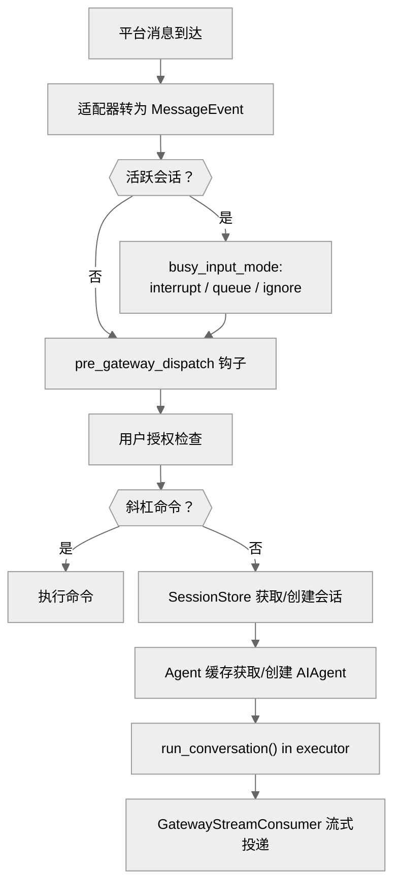

# 04-网关层：一个进程，二十个平台

中文 | [English](../en/04-gateway.md)

> **本章定位**：`gateway/` 目录（61 个 .py，80,025 行），是代码量最大的模块。包含核心控制器 `GatewayRunner`（`run.py:1547`，18,318 行——单文件最大）、31 个平台适配器文件、会话管理、流式投递和故障恢复。
> **关键类**：`GatewayRunner`（`gateway/run.py:1547`）、`BasePlatformAdapter`（`gateway/platforms/base.py:1389`）、`SessionStore`（`gateway/session.py:668`）、`GatewayStreamConsumer`（`gateway/stream_consumer.py:78`）。

> **本章基于 hermes-agent commit [`3bace071b`](https://github.com/NousResearch/hermes-agent/commit/3bace071b)（2026-05-24）**

---

## 为什么需要网关？

在 CLI 模式下，用户和 Agent 是一对一的。但如果你想让同一个 Agent 同时服务 Telegram 群、Discord 频道、Slack workspace 和 WhatsApp 私聊呢？

每个平台有自己的协议（Telegram 用 Bot API + webhooks，Discord 用 WebSocket，Slack 用 Events API + Bolt），消息格式不同，能力不同（有的支持消息编辑，有的不支持），用户身份体系也不同。如果为每个平台写一套独立的 Agent 服务，代码重复度极高，维护 20 个服务的部署复杂度不可接受。

Gateway 的解决方案是：**一个进程同时连接所有平台，共享同一套 Agent 逻辑**。平台差异被封装在适配器里，Agent 核心对消息来自哪里完全无感。

---

## 使用指南

### 基本用法

```bash
hermes gateway start     # 启动网关（后台服务）
hermes gateway stop      # 停止
hermes gateway status    # 查看状态
hermes gateway setup     # 交互式配置平台
hermes gateway install   # 安装为系统服务（systemd/launchd）
hermes gateway run       # 前台运行（调试用）
```

### 配置

```yaml
# config.yaml 中与 Gateway 相关的配置
gateway:
  platforms:
    telegram:
      enabled: true
      token: "${TELEGRAM_BOT_TOKEN}"   # 从 .env 读取
    slack:
      enabled: true
      app_token: "${SLACK_APP_TOKEN}"

display:
  busy_input_mode: "interrupt"  # 新消息处理策略：interrupt/queue/ignore/steer
  session_reset_policy: "both"  # idle/daily/both
  session_idle_hours: 24        # idle 模式的超时时间
  group_sessions_per_user: true # 群聊按用户隔离会话
```

### 常见场景

**场景一：Telegram Bot 部署。** `hermes gateway setup` 选择 Telegram，输入 BotFather 给的 token。`hermes gateway start` 启动后，给 Bot 发消息即可开始对话。跨平台的上下文连续——你在 Telegram 上的对话历史和 CLI 的是独立的。

**场景二：多平台同时服务。** 一个 Gateway 进程同时连接 Telegram + Slack + Discord。每个平台的用户有独立的会话，但共享同一个 Agent 配置（模型、工具集、记忆）。

**场景三：Cron 定时投递。** `hermes cron create "每天早上 8 点总结 HN 头条" --deliver telegram`，Gateway 会在指定时间创建独立 Agent 实例执行任务，结果投递到 Telegram 的 home channel。

### 排错指引

| 问题 | 排查方向 |
|------|---------|
| Bot 不回复消息 | `hermes gateway status` 确认进程运行；检查 `~/.hermes/logs/gateway.log`；确认 Bot token 有效 |
| 消息发出但 Agent 无反应 | 检查用户授权：`_is_user_authorized()`（`run.py:6208`）——可能需要 DM 配对或白名单 |
| 回复被截断 | 平台有消息长度限制（以 Telegram 4096 字符为例），超长回复会自动分割为多条 |
| 会话上下文突然消失 | 检查 `SessionResetPolicy`（`config.py:238`）——可能触发了 idle 或 daily 重置 |
| Gateway 频繁重启 | 检查 stuck loop 检测：连续 3 次重启时同一会话都活跃 → 该会话被自动挂起（`run.py:3390`） |
| 某个平台断开但其他正常 | 平台重连是独立的：`_platform_reconnect_watcher()`（`run.py:5521`）对失败平台做指数退避重连 |
| Cron 任务没执行 | `hermes cron list` 确认任务存在；检查 `scheduler.tick()` 的文件锁是否残留（`.tick.lock`） |

> 📖 **延伸阅读（官方文档）：**
> - [消息网关](https://hermes-agent.nousresearch.com/docs/user-guide/messaging)
> - [安全与配对](https://hermes-agent.nousresearch.com/docs/user-guide/security)
> - [Cron 调度](https://hermes-agent.nousresearch.com/docs/user-guide/features/cron)
> - [网关内部实现](https://hermes-agent.nousresearch.com/docs/developer-guide/gateway-internals)

---

## 架构与实现

### 消息从平台到 Agent 的完整路径

当一条 Telegram 消息到达时，会经历以下路径：



**图：消息从平台到 Agent 的完整路径——9 步处理流程**

逐步说明：

**❶ 适配器接收并转换**。每个平台适配器把原生消息对象转为统一的 `MessageEvent`（定义于 `gateway/platforms/base.py`，包含 `source`、`text`、`message_type`、`message_id`、`attachments` 等字段的标准化消息容器），然后调用 `handle_message()`（`base.py:3163`）。这是平台差异被抹平的关键一步——后续所有逻辑只看 `MessageEvent`，不关心消息来自 Telegram 还是 Slack。

**❷ 活跃会话检查**。如果该聊天已有一个正在运行的 Agent，根据 `busy_input_mode`（`run.py:1558`）决定行为：
- `interrupt`（默认）——中断当前任务处理新消息
- `queue`——新消息排队等当前任务完成
- `ignore`——丢弃新消息
- `steer`——不中断，但把新消息作为 steer 指令注入（让 Agent 在下一步调整方向）

**❸ 插件钩子**。`pre_gateway_dispatch`（`run.py:6544`）触发，插件可以返回 `{"action": "skip"}` 丢弃消息、`{"action": "rewrite", "text": "..."}` 改写消息、或 `{"action": "allow"}` 放行。注意：钩子在授权检查**之前**触发（`run.py:6549` 注释："Hook runs BEFORE auth so plugins can handle unauthorized senders"），这意味着未授权用户的消息也会触发插件——插件开发者需要意识到这一点。仅对外部消息（非系统生成的内部事件）触发。

**❹ 用户授权**。`_is_user_authorized()`（`run.py:6208`）检查发送者是否有权使用 Agent。支持多种授权模式：DM 配对（`gateway/pairing.py`——首次私聊需要输入配对码）、白名单（`gateway.allowed_users` 配置）、群聊开放等。

**❺ 命令解析**。检查消息是否是斜杠命令（`/model`、`/new`、`/stop`、`/compress` 等）。部分命令（以 `/stop` 为例）可以在 Agent 运行时处理——它们不需要等 Agent 完成就能执行中断。

**❻ 会话获取**。`SessionStore.get_or_create_session()`（`session.py:856`）根据 `session_key`（由平台+聊天 ID+用户 ID 组合而成的会话标识符，详见下节"会话管理"）查找或创建会话。如果会话已超时，按重置策略处理。

**❼ Agent 获取**。从 `_agent_cache`（`run.py:1649`，OrderedDict，≤128 个实例）中按 `session_key` 查找 Agent。但仅凭 session_key 命中还不够——还要比对 `_agent_config_signature()`（`run.py:14787`），该签名覆盖 model、api_key 指纹、base_url、enabled_toolsets 等字段。如果用户改了 `config.yaml`（以切换模型为例），签名不一致会触发缓存失效并重建 AIAgent——这就是为什么改配置后第一条消息会慢。缓存有**双重淘汰**：容量上限（128 个）+ 空闲 TTL（1 小时，`_AGENT_CACHE_IDLE_TTL_SECS`，`run.py:65`）。正在运行的 Agent 受保护不被淘汰。被淘汰的 Agent 在后台 daemon 线程中异步清理资源，不阻塞缓存操作。

**❽ 执行**。`AIAgent.run_conversation()` 通过 `loop.run_in_executor()` 在线程池中运行——Gateway 主循环是 asyncio 的，Agent 是同步的，executor 桥接两者。

**❾ 流式投递**。`GatewayStreamConsumer`（`stream_consumer.py:78`）在 Agent 的同步回调和平台的异步发送之间架桥：Agent 线程产生 token → 放入 Queue → 异步任务轮询 → 达到触发条件（0.8 秒间隔或 24 字符积累）→ 调用 `edit_message()` 更新消息。Agent 完成后发送最终版本。

### 会话管理：谁的对话算谁的

Gateway 面临一个 CLI 不需要考虑的问题：**同一个聊天窗口可能有多个用户**。

`session_key` 的生成规则决定了会话隔离粒度：

| 场景 | session_key 格式 | 效果 |
|------|-----------------|------|
| 私聊 | `agent:main:{platform}:dm:{chat_id}` | 一个用户一个会话 |
| 群聊（默认） | `...:{chat_id}:{user_id}` | 每个用户独立会话 |
| 群聊（共享模式） | `...:{chat_id}` | 群内共享一个会话 |
| 线程 | `...:{chat_id}:{thread_id}` | 线程内共享 |

默认群聊按用户隔离（`group_sessions_per_user=True`）。共享模式下，多人消息进入同一对话流，每条消息前缀 `[sender name]`。

#### 会话重置策略

`SessionResetPolicy`（`gateway/config.py:238`）定义三种重置模式：
- **idle** — 空闲超过指定时间（默认 24 小时）后自动重置
- **daily** — 每天指定时刻（默认凌晨 4 点）重置
- **both**（默认）— 满足任一即重置

重置清空对话历史、开始新 `session_id`，但持久记忆（MEMORY.md、USER.md）不受影响。如果会话有活跃后台进程，重置推迟到进程结束。

#### PII 保护

不同平台对用户 ID 的隐私要求不同。WhatsApp、Signal 等平台的 user_id 可能包含真实手机号。`_PII_SAFE_PLATFORMS`（`session.py:195`）对敏感平台的 ID 做哈希脱敏后注入系统提示——真实 ID 不会泄露到 LLM。

### 平台适配器：封装差异

`BasePlatformAdapter`（`gateway/platforms/base.py:1389`）是所有平台适配器的抽象基类。**新增一个平台只需要实现 3 个方法**：

| 方法 | 必须 | 作用 |
|------|------|------|
| `connect()` | 是 | 连接平台 |
| `disconnect()` | 是 | 断开连接 |
| `send()` | 是 | 发送文本消息 |
| `edit_message()` | 否 | 流式编辑（不支持则每次发新消息） |
| `send_image()` | 否 | 原生图片（不支持则降级为文本 URL） |
| `send_voice()` | 否 | 语音消息 |
| `send_video()` | 否 | 视频 |
| `send_document()` | 否 | 文件 |
| `send_typing()` | 否 | 打字指示器 |
| `delete_message()` | 否 | 删除消息 |

可选方法有合理的降级行为——以 `send_image()` 为例，如果适配器没实现，Gateway 自动降级为发送图片 URL 的文本消息。

当前的平台分布：核心适配器（`gateway/platforms/`）约 19 个平台——Telegram（5,700 行，最大）、飞书（5,120 行）、元宝（4,874 行）、API Server（3,552 行）、Slack（3,027 行）、Matrix（2,872 行）、微信（2,171 行）、企业微信（1,622 行）等。另有 7 个平台通过插件（`plugins/platforms/`）实现——Discord、Google Chat、IRC、Line、ntfy、Simplex、Teams。

### 流式投递：让用户看到"正在打字"

`GatewayStreamConsumer`（`stream_consumer.py:78`，1,318 行）是流式投递的核心。几个影响用户体验的设计：

**Think block 过滤**（`stream_consumer.py:298`）——模型的内部推理标签（`<think>`、`<reasoning>`）在流式传输过程中被状态机过滤，用户看到干净的回复。

**长消息分割**（`stream_consumer.py:718`）——不同平台有不同的消息长度限制（以 Telegram 4096 字符为例）。超长回复按词和代码块边界分割为多条消息，带 `(1/2)` 分块指示。

**fresh-final 机制**（`gateway/config.py:378`）——如果流式响应持续超过一定时间（以 Telegram 默认 60 秒为例），最终版本作为新消息发送（而非 edit），让平台时间戳反映实际完成时间。

**工具进度通知**——Agent 执行工具时，Gateway 通过 `send_typing()` 或状态消息告知用户"Agent 正在执行搜索..."，而不是让用户面对沉默。

**Flood control**（`stream_consumer.py:95`）——如果平台限速导致连续 3 次 `edit_message()` 失败（`_MAX_FLOOD_STRIKES = 3`），该次 stream 永久禁用 progressive edit，降级为缓存全部内容后一次性发送。这防止了限速错误导致消息碎片化。

**Think block 部分标签处理**——推理标签可能被跨 delta 分割（以 `<thi` 在一个 delta、`nk>` 在下一个 delta 为例）。`_filter_and_accumulate()`（`stream_consumer.py:298`）维护一个缓冲区暂存可能的标签前缀，等待完整标签确认后再决定过滤或放行。排查"输出中偶尔出现 `<thi` 碎片"时从这里入手。

### 故障恢复

Gateway 作为长期运行的进程，故障恢复是核心关切。

**平台重连**（`run.py:5521`）——单个平台断开不影响其他平台。`_platform_reconnect_watcher()` 后台任务对失败平台做指数退避重连（30s → 60s → 120s → 240s → 300s 上限，最多 10 次后触发 circuit-breaker）。如果平台持续不可用，日志记录但不影响其他平台。

**热重启**——`/restart` 命令触发：先通知所有活跃会话"重启中"，等待活跃 Agent 完成（超时则强制中断），标记可恢复的会话为 `resume_pending`（保留 session_id），然后重启进程。重启后从 SQLite 恢复历史继续对话。

**Stuck loop 检测**（`run.py:3390`）——如果同一个会话在连续 3 次重启时都处于活跃状态（`_STUCK_LOOP_THRESHOLD = 3`），说明它可能导致了崩溃循环——自动挂起该会话。计数器持久化在 `~/.hermes/.restart_failure_counts` JSON 文件中（`run.py:3391`）。被挂起的会话不是被拒绝服务——下次来消息时会**强制重置**（清空历史，`session.py:887`），相当于"从头开始"而非"完全不理你"。一次成功完成的对话会清零该会话的计数器（`_clear_restart_failure_count()`，`run.py:3469`）。手动解除挂起：删除 `.restart_failure_counts` 文件。

**零平台启动**——如果没有任何平台连接成功，Gateway 仍然运行——因为它还需要执行 Cron 任务。只有不可重试的错误（以配置格式错误为例）才会退出。

**优雅关闭**（`run.py:5846`）——`SIGTERM` 触发优雅关闭：停止接受新消息、等待正在运行的 Agent 完成（`restart_drain_timeout` 配置超时）、关闭所有平台连接、清理 Agent 缓存。`shutdown_forensics.py`（462 行）在关闭过程中记录每个 Agent 的状态，帮助排查关闭时的异常。

### Cron 集成

除了被动响应消息，Gateway 还承担着另一个职能——主动在指定时间触发任务。`cron/scheduler.py` 实现了这套定时调度逻辑。

Cron 任务执行时创建**独立的 AIAgent 实例**（不复用 Gateway 的 Agent 缓存），有自己的工具集。结果投递支持多种目标：
- `local` — 只写文件不发送
- `origin` — 回发到创建任务的聊天
- `telegram` / `slack` / ... — 指定平台的 home channel
- `telegram:12345` — 指定平台的指定 chat_id

投递优先使用 Gateway 正在运行的活跃 adapter——对需要 E2E 加密的平台（以 Matrix 为例）很重要，因为只有已建立的加密 session 才能发送消息。如果 Gateway 没在跑，回退到独立的 HTTP 客户端直接调用平台 API。

Agent 回复以 `[SILENT]` 开头时（`scheduler.py:132`），输出保存到本地文件但不投递——避免"没有更新"的消息打扰用户。

### 代码组织

```
gateway/
├── run.py               — GatewayRunner 核心控制器（18,318 行——单文件最大）
├── session.py           — SessionStore 会话管理（1,348 行）
├── stream_consumer.py   — 流式投递桥接（1,318 行）
├── config.py            — 网关配置 + SessionResetPolicy（1,858 行）
├── status.py            — 进程状态跟踪（971 行）
├── shutdown_forensics.py — 关闭时状态记录（462 行）
├── pairing.py           — DM 配对授权（450 行）
├── channel_directory.py — 平台频道目录（357 行）
├── platform_registry.py — 平台注册表（260 行）
├── delivery.py          — 消息投递路由（258 行）
├── hooks.py             — 钩子发现和生命周期（210 行）
├── platforms/
│   ├── base.py          — BasePlatformAdapter ABC（4,126 行）
│   ├── telegram.py      — Telegram 适配器（5,700 行）
│   ├── feishu.py        — 飞书（5,120 行）
│   ├── yuanbao.py       — 腾讯元宝（4,874 行）
│   ├── api_server.py    — HTTP API 适配器（3,552 行）
│   ├── slack.py         — Slack（3,027 行）
│   ├── matrix.py        — Matrix（2,872 行）
│   └── ...（另 24 个平台文件）
└── builtin_hooks/       — 内置钩子扩展点（空）
```

### 设计决策

#### 18,318 行的 run.py

`gateway/run.py` 是整个项目最大的单文件。它包含 `GatewayRunner` 类和所有的消息处理、Agent 缓存管理、重连逻辑、优雅关闭等。为什么不拆？和 `cli.py`、`run_agent.py` 的理由一样——Gateway 的各个子系统（消息处理、缓存管理、重连、关闭）之间有大量共享状态，拆分会引入复杂的跨模块状态同步。

#### Agent 缓存而非每次创建

创建 AIAgent 很重——初始化客户端、加载工具集、构建系统提示、恢复会话历史。如果每条消息都从头创建，延迟不可接受。128 个实例的 LRU 缓存（`_AGENT_CACHE_MAX_SIZE`，`run.py:64`）在内存和延迟之间取平衡。被淘汰的会话不丢失数据——下次收到消息时从 SQLite 恢复。

#### 适配器的"必须 + 可选降级"

不要求适配器实现所有方法，而是提供合理的降级行为。这降低了新增平台的门槛——3 个方法就能跑起来，进阶功能按需加。代价是降级行为可能不符合用户预期（以"发图片变成发 URL"为例），但这比"不支持图片就完全不能用"好。

### 扩展点

1. **新增平台适配器**：实现 `BasePlatformAdapter` 的 `connect()`、`disconnect()`、`send()` 三个方法
2. **插件平台**：通过 `plugins/platforms/<name>/` 目录注册新平台
3. **pre_gateway_dispatch 钩子**：在消息进入 Agent 前拦截/改写
4. **自定义会话重置策略**：通过 `display.session_reset_policy` 配置
5. **Cron 投递目标**：支持自定义平台投递

---

## 与其他章节的关系

| 关联章节 | 关系 |
|---------|------|
| 00 — 项目全景 | Gateway 是 00 章"平台碎片化"问题的解决方案 |
| 01 — 基础设施层 | `hermes_cli/gateway.py` 管理 Gateway 进程的生命周期 |
| 02 — Agent 核心 | Gateway 创建并缓存 AIAgent 实例，通过 `run_conversation()` 执行 |
| 06 — 插件框架 | 插件平台（Discord 等）通过 `plugins/platforms/` 注册 |
| 12 — 批量运行与调度 | Cron 任务通过 Gateway 投递结果 |

---

*本文基于 hermes-agent v0.14.0 源码分析。所有代码引用均经过独立验证。*
