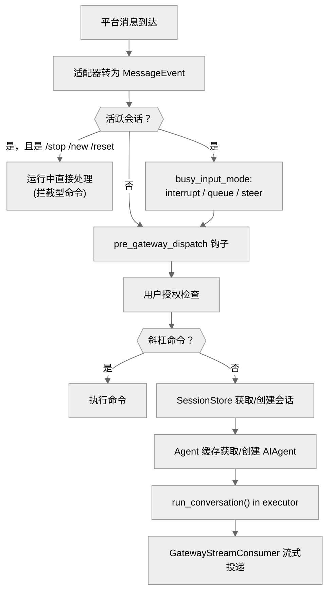

# 05-网关层：一个进程，所有平台

中文 | [English](../en/05-gateway.md)

> **本章定位**：`gateway/` 目录（70 个 .py，77,883 行）。包含核心控制器 `GatewayRunner`（`run.py:2774`，文件 20,719 行——单文件最大）、平台注册表与 9 个内建适配器、会话管理、流式投递和故障恢复。（十几个主流平台适配器已迁往 `plugins/platforms/`，见"平台适配器"一节。）
> **关键类**：`GatewayRunner`（`gateway/run.py:2774`，混入三个 mixin）、`BasePlatformAdapter`（`gateway/platforms/base.py:2253`）、`SessionStore`（`gateway/session.py:961`）、`GatewayStreamConsumer`（`gateway/stream_consumer.py:83`）。

> **本章基于 hermes-agent v0.18.2（tag [`v2026.7.7.2`](https://github.com/NousResearch/hermes-agent/releases/tag/v2026.7.7.2)，commit `9de9c25f6`，2026-07-07）**

---

## 为什么需要网关？

在 CLI 模式下，用户和 Agent 是一对一的。但如果你想让同一个 Agent 同时服务 Telegram 群、Discord 频道、Slack workspace 和 WhatsApp 私聊呢？

每个平台有自己的协议（Telegram 用 Bot API + webhooks，Discord 用 WebSocket，Slack 用 Events API + Bolt），消息格式不同，能力不同（有的支持消息编辑，有的不支持），用户身份体系也不同。如果为每个平台写一套独立的 Agent 服务，代码重复度极高，维护 20 个服务的部署复杂度不可接受。

Gateway 的解决方案是：**一个进程同时连接所有平台，共享同一套 Agent 逻辑**。平台差异被封装在适配器里，Agent 核心对消息来自哪里完全无感。

---

## 使用指南

### 基本用法

```bash
hermes gateway start     # 启动网关（后台服务）
hermes gateway stop      # 停止
hermes gateway status    # 查看状态
hermes gateway setup     # 交互式配置平台
hermes gateway install   # 安装为系统服务（systemd/launchd）
hermes gateway run       # 前台运行（调试用）
```

### 配置

```yaml
# config.yaml 中与 Gateway 相关的配置
gateway:
  platforms:
    telegram:
      enabled: true
      token: "${TELEGRAM_BOT_TOKEN}"   # 从 .env 读取
    slack:
      enabled: true
      app_token: "${SLACK_APP_TOKEN}"

display:
  busy_input_mode: "interrupt"  # 新消息处理策略：interrupt/queue/steer

session_reset:
  mode: "both"                  # idle/daily/both/none；默认 none（永不自动重置）
  idle_minutes: 1440            # idle 模式超时（分钟，默认 24 小时）
  at_hour: 4                    # daily 模式重置时刻

group_sessions_per_user: true   # 群聊按用户隔离会话
```

### 常见场景

**场景一：Telegram Bot 部署。** `hermes gateway setup` 选择 Telegram，输入 BotFather 给的 token。`hermes gateway start` 启动后，给 Bot 发消息即可开始对话。跨平台的上下文连续——你在 Telegram 上的对话历史和 CLI 的是独立的。

**场景二：多平台同时服务。** 一个 Gateway 进程同时连接 Telegram + Slack + Discord。每个平台的用户有独立的会话，但共享同一个 Agent 配置（模型、工具集、记忆）。

**场景三：Cron 定时投递。** `hermes cron create "每天早上 8 点总结 HN 头条" --deliver telegram`，Gateway 会在指定时间创建独立 Agent 实例执行任务，结果投递到 Telegram 的 home channel。

### 排错指引

| 问题 | 排查方向 |
|------|---------|
| Bot 不回复消息 | `hermes gateway status` 确认进程运行；检查 `~/.hermes/logs/gateway.log`；确认 Bot token 有效 |
| 消息发出但 Agent 无反应 | 检查用户授权：`_is_user_authorized()`（现居 `gateway/authz_mixin.py`）——可能需要 DM 配对或白名单 |
| 回复被截断 | 平台有消息长度限制（以 Telegram 4096 字符为例），超长回复会自动分割为多条 |
| 会话上下文突然消失 | 检查 `SessionResetPolicy`（`gateway/config.py:347`）——可能触发了 idle 或 daily 重置 |
| Gateway 频繁重启 | 检查 stuck loop 检测：连续 3 次重启时同一会话都活跃 → 该会话被自动挂起（`run.py:5954`） |
| 某个平台断开但其他正常 | 平台重连是独立的：`_platform_reconnect_watcher()`（`run.py:7717`）对失败平台做指数退避重连 |
| Telegram 偶发网络错误后整个网关挂了？ | 不会了——v0.18 在事件循环级捕获瞬时网络错误（`_is_transient_network_error()`，`run.py:232`，#31066/#31110），记日志后吞掉，不再拖垮进程 |
| Cron 任务没执行 | `hermes cron list` 确认任务存在；检查 `scheduler.tick()` 的文件锁是否残留（`.tick.lock`） |
| Cron 显示成功但消息没到 | 查 dead-target 注册表是否把目标标死了（投递失败自动标记、成功自愈）——见"流式投递"的 Delivery Router |
| 配对码怎么输都无效 | 可能触发了配对限速/锁定（`gateway/pairing.py` 的失败计数与平台级锁定），等锁定窗口过或清 pending 记录，不一定是码错 |
| 配了 interrupt 但没打断 | 看降级分支：子代理活跃/压缩进行中都会自动降级为 queue——见"活跃会话检查"的降级表 |

> 📖 **延伸阅读（官方文档）：**
> - [消息网关](https://hermes-agent.nousresearch.com/docs/user-guide/messaging)
> - [安全与配对](https://hermes-agent.nousresearch.com/docs/user-guide/security)
> - [Cron 调度](https://hermes-agent.nousresearch.com/docs/user-guide/features/cron)
> - [网关内部实现](https://hermes-agent.nousresearch.com/docs/developer-guide/gateway-internals)

---

## 架构与实现

### GatewayRunner：一个类，四个文件

先交代结构上最大的变化：v0.17 的 god-file 分解（第 00 章）把 `GatewayRunner` 拆成了主类 + 三个 mixin（`run.py:2774`）：

```python
class GatewayRunner(GatewayAuthorizationMixin, GatewayKanbanWatchersMixin, GatewaySlashCommandsMixin):
```

- `gateway/authz_mixin.py`（710 行）——用户授权簇（`_is_user_authorized` 等）
- `gateway/kanban_watchers.py`（1,286 行）——kanban 看板监视循环（第 09 章）
- `gateway/slash_commands.py`（4,624 行）——46 个网关斜杠命令 handler

拆分是 verbatim 搬移不是重写——`self` 语义不变，讲流程时仍说"GatewayRunner 的某方法"，只是源码归属变了。`run.py` 自身仍有 20,719 行，保有全项目最大单文件的头衔。

### 消息从平台到 Agent 的完整路径

当一条 Telegram 消息到达时，会经历以下路径：



**图：消息从平台到 Agent 的完整路径**

逐步说明：

**❶ 适配器接收并转换**。每个平台适配器把原生消息对象转为统一的 `MessageEvent`（`gateway/platforms/base.py:1716`，包含 `source`、`text`、`message_type`、`message_id`、`media_urls`、`media_types` 等字段的标准化消息容器），然后调用 `handle_message()`（`base.py:4585`）。这是平台差异被抹平的关键一步——后续所有逻辑只看 `MessageEvent`，不关心消息来自 Telegram 还是 Slack。

**❷ 活跃会话检查**。如果该聊天已有一个正在运行的 Agent，根据 `busy_input_mode`（`run.py:2785`）决定行为：
- `interrupt`（默认）——中断当前任务处理新消息
- `queue`——新消息排队等当前任务完成
- `steer`——不中断，但把新消息作为 steer 指令注入（让 Agent 在下一步调整方向）

但配置的模式不是无条件生效的——真实分发（`run.py:5119` 起）带一组降级和旁路分支：

| 情况 | 实际行为 | 依据 |
|------|---------|------|
| Agent 有活跃子代理 | `interrupt` 自动降级为 `queue`（打断父会杀掉整棵子代理树，#30170） | `run.py:5328` |
| 上下文压缩进行中 | 同样降级为 `queue`（#56391） | `run.py:5339` |
| `steer` 失败（Agent 未就绪/无 payload） | 回退为 `queue` | `run.py:5350` |
| 内部合成事件（后台任务完成通知等） | 永不 interrupt/steer，静默排队——后台任务完成不该打断你正在进行的对话 | `run.py:5291` |
| 待批准审批的文本回复（"yes"/"no"） | 旁路到审批 handler，不进 interrupt/queue/steer（#46866） | `run.py:5211` |

排队有硬上限：`_BUSY_QUEUE_MAX_PENDING = 32`（`run.py:5125`），超出直接丢弃并记警告——"消息大量涌入后部分消失"查这里。v0.18 的并发模型重写还让 `/stop`、`/new`、`/reset` 这类**拦截型命令**在 Agent 运行中立即处理——注意 `/stop` 在忙碌路径里走的是对 `_running_agents` 的硬杀，不是软 `interrupt()`。

**❸ 插件钩子**。`pre_gateway_dispatch`（`run.py:8754`）触发，插件可以返回 `{"action": "skip"}` 丢弃消息、`{"action": "rewrite", "text": "..."}` 改写消息、或 `{"action": "allow"}` 放行。仅对外部消息（非系统生成的内部事件）触发。

> ⚠️ **安全注意**：`pre_gateway_dispatch` 钩子在授权检查**之前**触发。这意味着未授权用户的消息同样会经过插件——插件开发者必须在插件内自行处理未授权情况，不能依赖 Gateway 的授权层做过滤。

**❹ 用户授权**。`_is_user_authorized()`（`gateway/authz_mixin.py`）检查发送者是否有权使用 Agent。支持多种授权模式：DM 配对（`gateway/pairing.py`——首次私聊需要输入配对码）、白名单（`gateway.allowed_users` 配置）、群聊开放等。Team Gateway 场景（见 relay 一节）还有 `authorization_is_upstream` 模式——信任上游网关已做过授权。

**❺ 命令解析**。检查消息是否是斜杠命令（`/model`、`/new`、`/stop`、`/compress` 等，46 个 handler 在 `gateway/slash_commands.py`）。

**❻ 会话获取**。`SessionStore.get_or_create_session()`（`session.py:1687`）根据 `session_key`（由平台+聊天 ID+用户 ID 组合而成的会话标识符，详见下节"会话管理"）查找或创建会话。如果会话已超时，按重置策略处理。

**❼ Agent 获取**。从 `_agent_cache`（`run.py:2961`，OrderedDict）中按 `session_key` 查找 Agent。缓存命中需要满足两个条件：session_key 匹配，且 `_agent_config_signature()`（`run.py:15518`）一致——签名覆盖 model、provider、api_mode、api_key 指纹、base_url、enabled_toolsets、部分影响缓存的配置项（context_length、compression 等），**还包括 user_id/user_id_alt**。最后这一项有个具体的事故背景（`run.py:15542-15549` 注释，#27371）：共享线程模式的 session_key 刻意不含参与者 ID，如果签名也不含 user_id，同一个缓存 Agent 会被多个用户复用——Honcho 记忆 Provider 在首消息时冻结用户身份，第二个用户的话会被记到第一个用户头上。把 user_id 放进签名等于"共享线程里换人就重建 Agent"——用 prompt cache 命中率换记忆归因正确。

缓存未命中时新建 AIAgent，从 SQLite 恢复会话历史——这就是为什么改配置后第一条消息会慢（冷启动）。

> **缓存淘汰策略**：双重淘汰——容量上限 128 个（`_AGENT_CACHE_MAX_SIZE`，`run.py:67`）+ 空闲 TTL 1 小时（`_AGENT_CACHE_IDLE_TTL_SECS`，`run.py:68`）。正在运行的 Agent 受保护不被淘汰——因此缓存**可能临时超过 128**（超额条目都在跑时只记 warning，`run.py:16176` 附近），内存占用高于预期时先看这条。空闲清扫还和重置策略耦合：`session_reset.mode != "none"` 的会话推迟淘汰、留给过期监视器走完整的 `on_session_end`（记忆落盘）；`mode == "none"` 立即软淘汰但不触发 `on_session_end`。被淘汰的 Agent 在后台 daemon 线程中异步清理资源，不阻塞缓存操作。

**❽ 执行**。`AIAgent.run_conversation()` 通过 `loop.run_in_executor()` 在线程池中运行——Gateway 主循环是 asyncio 的，Agent 是同步的，executor 桥接两者。

**❾ 流式投递**。`GatewayStreamConsumer`（`stream_consumer.py:83`）在 Agent 的同步回调和平台的异步发送之间架桥（详见下文"流式投递"）。

### 会话管理：谁的对话算谁的

Gateway 面临一个 CLI 不需要考虑的问题：**同一个聊天窗口可能有多个用户**。

`session_key` 的生成规则决定了会话隔离粒度：

| 场景 | session_key 格式 | 效果 |
|------|-----------------|------|
| 私聊 | `agent:main:{platform}:dm:{chat_id}` | 一个用户一个会话 |
| 群聊（默认） | `...:{chat_id}:{user_id}` | 每个用户独立会话 |
| 群聊（共享模式） | `...:{chat_id}` | 群内共享一个会话 |
| 线程 | `...:{chat_id}:{thread_id}` | 线程内共享 |

默认群聊按用户隔离（`group_sessions_per_user=True`）。共享模式下，多人消息进入同一对话流，每条消息前缀 `[sender name]`。三个容易踩的边界（`build_session_key()`，`session.py:870-958`）：**线程隔离是独立开关**——`thread_sessions_per_user`（默认 False，线程内共享）和 `group_sessions_per_user` 是两个维度；**DM 缺 chat_id 时有兜底链**——依次退到 `user_id_alt`/`user_id` → `thread_id` → 裸 `平台:dm`（注释明说是防"没有 chat_id 的适配器把所有人塞进一个共享会话"）；**WhatsApp 的参与者 ID 先做规整化**（`canonical_whatsapp_identifier()`）——JID/LID 别名翻转否则会把同一个人拆成两个会话。

#### 会话重置策略

`SessionResetPolicy`（`gateway/config.py:347`）定义四种重置模式：
- **idle** — 空闲超过指定时间（默认 1440 分钟 = 24 小时）后自动重置
- **daily** — 每天指定时刻（默认凌晨 4 点）重置
- **both** — 满足任一即重置
- **none**（默认）— 永不自动重置（上下文仅由压缩管理）

默认值有段历史：曾长期是 `both`（24 小时空闲 + 每日凌晨 4 点），2026-07（`9c272a306`，#60194，与本章基准 tag 同日）改成了 `none`——docstring 直言旧默认"surprised users who expected their conversations to persist"（用户以为对话会一直在，结果被自动清了）。想要自动重置现在必须显式配置。

重置清空对话历史、开始新 `session_id`，但持久记忆（MEMORY.md、USER.md）不受影响。如果会话有活跃后台进程，重置推迟到进程结束。

#### PII 保护

不同平台对用户 ID 的隐私要求不同。`_PII_SAFE_PLATFORMS`（`session.py:332`）包含 4 个平台——WhatsApp、Signal、Telegram、BlueBubbles——它们的 user_id 可能包含真实手机号等敏感信息。这些平台的 ID 做哈希脱敏后注入系统提示，真实 ID 不会泄露到 LLM。其他平台（以 Discord 为例）的 user_id 保留原始格式，因为 Discord 的 mention 系统需要原始 ID（`<@user_id>`）。

### 平台适配器：从内建军团到插件生态

`BasePlatformAdapter`（`gateway/platforms/base.py:2253`，文件 5,627 行）是所有平台适配器的抽象基类。**新增一个平台只需要实现 4 个方法**：

| 方法 | 必须 | 作用 |
|------|------|------|
| `connect()` | 是 | 连接平台（v0.18 起带 `is_reconnect` 参数，`base.py:2864`——重连时适配器可跳过一次性初始化） |
| `disconnect()` | 是 | 断开连接 |
| `send()` | 是 | 发送文本消息（`base.py:2889`） |
| `get_chat_info()` | 是 | 获取聊天信息（`base.py:5476`） |
| `edit_message()` | 否 | 流式编辑（不支持则每次发新消息） |
| `send_image()` / `send_voice()` / `send_video()` / `send_document()` | 否 | 富媒体（不支持则降级） |
| `send_typing()` / `delete_message()` | 否 | 打字指示器 / 删除消息 |
| `send_draft()` 等 4 个草稿方法 | 否 | **draft streaming**（`base.py:2471` 起）——支持原生"正在输入"草稿预览的平台（Telegram Bot API 9.5+ 的 DM）可以把流式内容渲染为实时草稿，而不是反复 edit 消息 |

v0.18 还给适配器加了**能力宣告类属性**（`base.py:2288-2296` 起，`supports_async_delivery`、`splits_long_messages` 等 5 个）——Gateway 据此决定长消息在哪一层分割、投递走同步还是异步路径，而不是靠运行时试错。

**平台的分布方式在 v0.16-v0.18 间发生了叙事级变化**（详见第 08 章的迁移故事）：

- **20 个平台以插件形式分发**（`plugins/platforms/`）——Telegram、Slack、Discord、飞书、钉钉、企业微信、Matrix、Mattermost、WhatsApp、Email、SMS、Home Assistant、IRC、Line、ntfy、Simplex、Teams、Google Chat、Photon（iMessage）、Raft。主流消息平台全在这边
- **gateway 只保留 9 个内建适配器**——Signal、微信公众号、WhatsApp Cloud API、腾讯元宝、QQ Bot、BlueBubbles，加 API Server / Webhook / MS Graph Webhook 三个协议入口

两边靠**平台注册表**（`gateway/platform_registry.py`，332 行）接起来：插件发现时只注册延迟加载器（首次用到才 import 各家重 SDK——急加载 20 个平台曾给每次 `hermes` 启动加数秒，第 01 章），gateway 建适配器时先查注册表、注册表没有才落回内建 if/elif（`_create_adapter()`，`run.py:8514`）。注册表条目（`PlatformEntry`）携带的不只是工厂函数——required_env、setup 函数、授权环境变量名、消息长度上限、PII 标记、系统提示 hint 都在里面，`hermes setup` 和授权检查都从注册表读元数据。

可选方法有合理的降级行为——以 `send_image()` 为例，如果适配器没实现，Gateway 自动降级为发送图片 URL 的文本消息。

### 流式投递：让用户看到"正在打字"

`GatewayStreamConsumer`（`stream_consumer.py:83`，文件 1,800 行）是流式投递的核心。v0.18 把它的输入从"粗粒度 token delta"升级为**细粒度事件流**（`gateway/stream_events.py`，171 行）：

- `MessageChunk`（`:44`）——助手文本增量（推理/思考内容在上游就被过滤，永远不会以 MessageChunk 出现）
- `ToolCallChunk`（`:85`）——工具调用开始/进行中，带名称和参数预览，**由网关侧决定呈现方式**（emoji、截断、详细/紧凑、或在某些平台上干脆吞掉）
- `Commentary`（`:72`）——工具迭代之间模型说的完整过场话（"我先看看仓库结构"）——不是增量而是完整文本

适配器因此可以自定义渲染策略，而不是所有平台吃同一种拼接文本。几个影响用户体验的设计：

**编辑节奏**——token 进入队列，异步任务达到触发条件（编辑间隔 0.8 秒或缓冲 24 字符，`DEFAULT_STREAMING_EDIT_INTERVAL/BUFFER_THRESHOLD`，`gateway/config.py:539-540`，可配置）才调用 `edit_message()` 更新，Agent 完成后发送最终版本。支持 draft streaming 的平台（Telegram DM）改用原生草稿渲染。

**Think block 过滤**（`_filter_and_accumulate()`，`stream_consumer.py:385`）——模型的内部推理标签（`<think>`、`<reasoning>`）在流式传输过程中被状态机过滤。推理标签可能被跨 delta 分割（以 `<thi` 在一个 delta、`nk>` 在下一个 delta 为例），状态机维护缓冲区暂存可能的标签前缀，等待完整标签确认后再决定过滤或放行。排查"输出中偶尔出现 `<thi` 碎片"时从这里入手。另一个边界（`:437-452` 的 `is_boundary` 判定）：过滤**只认行首（或前面全是空白）的标签**——模型把 `<think>` 写在一行文字中间时会原样透传给用户。"偶尔看到完整的 `<think>` 标签"多半是这个成因，不是过滤器坏了。

**长消息分割**（`stream_consumer.py:956`）——不同平台有不同的消息长度限制（以 Telegram 4096 字符为例）。超长回复按词和代码块边界分割为多条消息，带 `(1/2)` 分块指示。

**Delivery Router**（`gateway/delivery.py`，557 行，v0.18 新增）统一决定"这条消息按什么目标、在哪一层分割、走哪个适配器投递"——cron 输出和 Agent 回复共用这套路由。它内部还有三层容错，都是排查"消息没到"的入口：

- **dead-target 注册表**（`DeadTargetRegistry`，`gateway/dead_targets.py`，投递前检查 `delivery.py:274` 起）：投递失败时按错误文本分类（`_classify_dead_from_error_text`，`:116`——只有整个 chat 级的 not_found 才算死，删掉一个论坛 topic 不会连坐），确认死掉的目标之后直接跳过发送；一次成功投递自动清除标记（自愈）。"cron 显示成功但消息一直没到"查这里
- **静默叙述过滤**（`_is_silence_narration()`，`:43`）：识别 "*(silent)*"、🔇、纯句号这类模型的"我保持安静"幻觉噪声，直接丢弃不投递——跨 bot 转发场景下这类噪声会引起无限镜像循环。注意它和 cron 的 `[SILENT]` 显式标记（第 11 章）是两套机制：一个是约定协议，一个是幻觉识别
- **超长截断 + 审计留存**（`MAX_PLATFORM_OUTPUT = 4000`，`:29`；处理在 `:403-451`）：超限输出先落盘存完整副本，再按适配器的 `splits_long_messages` 能力决定"截断加'完整输出已保存到…'脚注"还是交给适配器原生分片

**fresh-final 机制**（`gateway/config.py:575` 起）——如果流式响应持续超过 `fresh_final_after_seconds`（例如设 60 秒），最终版本作为新消息发送（而非 edit），让平台时间戳反映实际完成时间。注意这是**默认关闭**的（默认 `0.0` = 一律原地 finalize），且 Telegram 的 `prefers_fresh_final_streaming()` 硬编码返回 `False`（`telegram/adapter.py:1453`）——fresh-final 会在收尾时短暂出现两份最终答案再删预览，看起来像重复投递，#46206 因此回退；Telegram 改用 Bot API 的 `editMessageText` 原地升级成富文本。

**Flood control**（`stream_consumer.py:100`）——如果平台限速导致连续 3 次 `edit_message()` 失败（`_MAX_FLOOD_STRIKES = 3`），该次 stream 永久禁用 progressive edit，降级为缓存全部内容后一次性发送。这防止了限速错误导致消息碎片化。

### 故障恢复

Gateway 作为长期运行的进程，故障恢复是核心关切。

**平台重连**（`_platform_reconnect_watcher()`，`run.py:7717`）——单个平台断开不影响其他平台。后台任务对失败平台做指数退避重连（30s → 60s → 120s → 240s → 300s 上限），之后按什么规则走，docstring（`:7720-7729`）写得非常明确：**可重试失败（网络/DNS 抖动）在退避上限无限期重试、永不自动暂停**——"自动熔断恢复了的平台"曾是"瞬时 DNS 故障后 bot 无声躺尸"的事故原因，这个行为被刻意移除了；**不可重试失败（坏 token 等）立即退出重试队列**；熔断器（`_pause_failed_platform`）只保留**手动**操作路径（`/platform pause`、`/platform resume`）。排查"平台一直连不上"先分清是哪一类：`/platform list` 看 connected/retrying/fatal 三态。重连时 `connect(is_reconnect=True)` 让适配器跳过一次性初始化。

**瞬时网络错误自愈**（v0.18 新增，`_is_transient_network_error()`，`run.py:232`）——针对 #31066/#31110 记录的崩溃类别：一个未被处理的 Telegram 超时异常曾能沿 asyncio 事件循环炸掉整个网关。现在事件循环级的异常处理器识别"可安全记录并吞掉"的瞬时网络错误类，单平台的网络抖动不再变成全网关事故。

**会话恢复**分几层，按优先级从低到高：

- **任意重启后的自动续接**——不只 `/restart` 命令：网关每次启动（含崩溃后）都先跑 `SessionStore.suspend_recently_active(max_age_seconds=120)`（`session.py:2053`，#7536）：最近 120 秒内活跃过的会话被标记 `resume_pending`，下次消息到达自动续接旧 transcript。`/restart` 命令只是主动版：先通知活跃会话"重启中"、等 Agent 完成（超时强制中断）再重启。第 01 章讲过的 SIGUSR1 优雅 drain 是服务管理器侧的对应物
- **续接有新鲜度窗口**（`session.py:1789` 附近）——`resume_pending` 挂太久没真正续上（比如恢复消息自己也失败了），下次消息会判定为僵尸会话、强制走重置——"重启后该续上却变成了新对话"通常是过了这个窗口
- **Stuck loop 强制挂起**（`run.py:5984-6031`）——连续 3 次重启时同一会话都活跃（`_STUCK_LOOP_THRESHOLD = 3`），判定它可能是崩溃元凶，升级为 `suspended`（优先级高于 `resume_pending`，`session.py:1770`）。计数器持久化在 `~/.hermes/.restart_failure_counts`；被挂起的会话下次来消息时**强制重置**（清空历史）而非拒绝服务；一次成功对话清零计数（`_clear_restart_failure_count()`，`run.py:6033`）；手动解除：删该文件
- **压缩续接自愈**（`_heal_compression_tip_locked`，`session.py:1623-1663`）——上下文压缩会把 transcript 迁到子 session；如果重启/发送失败让 SessionStore 的映射还停在压缩前的父 session，下次读取时自动"愈合"指向子 session。"重启后历史缺了最近几轮"的另一个可能根因

**零平台启动**——如果没有任何平台连接成功，Gateway 仍然运行——因为它还需要执行 Cron 任务。只有不可重试的错误（以配置格式错误为例）才会退出。

**优雅关闭**（编排入口 `stop()`，`run.py:7907`）——`SIGTERM` 触发优雅关闭：停止接受新消息、等待正在运行的 Agent 完成（`restart_drain_timeout` 配置超时）、关闭所有平台连接、清理 Agent 缓存。`shutdown_forensics.py`（462 行）在关闭过程中记录每个 Agent 的状态，帮助排查关闭时的异常。

### Relay：网关连网关

`gateway/relay/`（6 个 .py，2,456 行，v0.18 新增子包）实现 **Team Gateway** 的 WebSocket connector：一台成员机的网关作为下游，连接到团队的上游网关，消息经上游转发进来。下游可以声明 `authorization_is_upstream`——信任上游已经完成用户授权，本地不再重复检查。这让"团队共享一个对外 Bot、各成员机各跑各的 Agent"成为可能。细节属于团队部署话题，此处只交代它在架构中的位置：对 GatewayRunner 而言，relay 就是又一个"平台"。

以上是 Gateway 对"被动消息"的容错。Gateway 还有另一面：它不只被动等消息，还会主动出击。

### Cron 集成

除了被动响应消息，Gateway 还承担着另一个职能——主动在指定时间触发任务。`cron/scheduler.py` 实现了这套定时调度逻辑。

Cron 任务执行时创建**独立的 AIAgent 实例**（不复用 Gateway 的 Agent 缓存），有自己的工具集。结果投递经 Delivery Router（dead-target 跳过、静默过滤、超长截断三层处理见"流式投递"一节）支持多种目标：
- `local` — 只写文件不发送
- `origin` — 回发到创建任务的聊天
- `telegram` / `slack` / ... — 指定平台的 home channel
- `telegram:12345` — 指定平台的指定 chat_id

投递优先使用 Gateway 正在运行的活跃 adapter——对需要 E2E 加密的平台（以 Matrix 为例）很重要，因为只有已建立的加密 session 才能发送消息。如果 Gateway 没在跑，回退到独立的 HTTP 客户端直接调用平台 API。

Agent 回复中含 `[SILENT]` 时，输出保存到本地文件但不投递——避免"没有更新"的消息打扰用户（细节见第 11 章）。

### 代码组织

```
gateway/
├── run.py               — GatewayRunner 核心控制器（20,719 行——单文件最大）
├── authz_mixin.py       — 授权 mixin（710 行，god-file 拆出）
├── kanban_watchers.py   — kanban 监视 mixin（1,286 行，同上，→ 第 09 章）
├── slash_commands.py    — 46 个斜杠命令 mixin（4,624 行，同上）
├── session.py           — SessionStore 会话管理（2,432 行）
├── stream_consumer.py   — 流式投递桥接（1,800 行）
├── stream_events.py     — 细粒度流事件模型（171 行，新增）
├── config.py            — 网关配置 + SessionResetPolicy（2,277 行）
├── status.py            — 进程状态跟踪（1,456 行）
├── delivery.py          — 消息投递路由（557 行）
├── relay/               — Team Gateway WebSocket connector（6 文件，2,456 行，新增）
├── shutdown_forensics.py — 关闭时状态记录（462 行）
├── pairing.py           — DM 配对授权（661 行）
├── channel_directory.py — 平台频道目录（496 行）
├── platform_registry.py — 平台注册表 + 延迟加载（332 行）
├── hooks.py             — 钩子发现和生命周期（227 行）
└── platforms/
    ├── base.py          — BasePlatformAdapter ABC + MessageEvent（5,627 行）
    ├── yuanbao.py       — 腾讯元宝（内建最大适配器）
    ├── api_server.py    — HTTP API 适配器
    ├── signal.py / weixin.py / whatsapp_cloud.py / bluebubbles.py
    ├── qqbot/ / msgraph_webhook.py / webhook.py
    └── ...（主流平台适配器已迁往 plugins/platforms/，→ 第 08 章）
```

### 设计决策

#### 20,719 行的 run.py 与三个 mixin

`gateway/run.py` 仍是整个项目最大的单文件，但它已经不是"拒绝拆分"的样本——v0.17 的 god-file 分解把授权、kanban 监视、斜杠命令三个高内聚簇搬进了独立 mixin 文件（verbatim 搬移，行为中立）。留在 run.py 里的是共享状态最密集的部分：消息处理、Agent 缓存管理、重连、关闭。拆分策略和 `cli.py`、`run_agent.py` 一致：不追求文件变小，追求"新代码有明确的归属地"。

#### Agent 缓存而非每次创建

创建 AIAgent 很重——初始化客户端、加载工具集、构建系统提示、恢复会话历史。如果每条消息都从头创建，延迟不可接受。128 个实例的 LRU 缓存（`_AGENT_CACHE_MAX_SIZE`，`run.py:67`）在内存和延迟之间取平衡。被淘汰的会话不丢失数据——下次收到消息时从 SQLite 恢复。

#### 适配器的"必须 + 可选降级 + 能力宣告"

不要求适配器实现所有方法，而是提供合理的降级行为。这降低了新增平台的门槛——4 个必须方法就能跑起来，进阶功能按需加。v0.18 的能力宣告属性把"这个平台能做什么"从运行时试错变成声明式元数据——长消息在适配器层还是网关层分割、能不能异步投递，连接前就知道。代价是降级行为可能不符合用户预期（以"发图片变成发 URL"为例），但这比"不支持图片就完全不能用"好。

### 扩展点

1. **新增平台适配器**：实现 `BasePlatformAdapter` 的 4 个必须方法，以插件形式经 `ctx.register_platform()` 注册（第 07 章）
2. **pre_gateway_dispatch 钩子**：在消息进入 Agent 前拦截/改写
3. **自定义会话重置策略**：通过 `session_reset` 配置
4. **Cron 投递目标**：delivery router 支持自定义平台投递
5. **Team Gateway**：经 relay 子包把本机网关挂到上游团队网关

---

## 与其他章节的关系

| 关联章节 | 关系 |
|---------|------|
| 00 — 项目全景 | Gateway 是 00 章"平台碎片化"问题的解决方案 |
| 01 — 基础设施层 | `hermes_cli/gateway.py` 管理 Gateway 进程的生命周期；平台延迟加载器在插件发现时注册进本章的 platform_registry |
| 02 — Agent 核心 | Gateway 创建并缓存 AIAgent 实例，通过 `run_conversation()` 执行 |
| 07/08 — 插件框架/内置插件 | 20 个平台适配器以插件形式分发（迁移故事见 08 章） |
| 09 — Kanban 系统 | kanban 看板监视循环在 GatewayKanbanWatchersMixin |
| 11 — Cron 调度 | Cron 任务经 delivery router 通过 Gateway 投递结果 |

---

*本文基于 hermes-agent v0.18.2 源码分析。所有代码引用均经过独立验证。*
