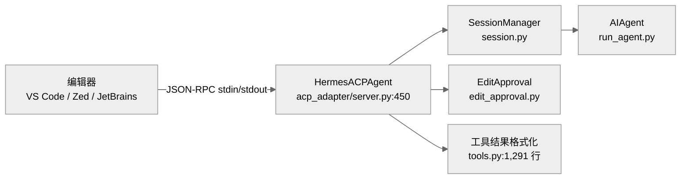
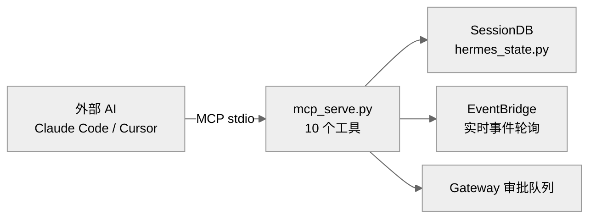

# 06-协议适配层：让其他系统调用 Agent

中文 | [English](../en/06-protocols.md)

> **本章定位**：`acp_adapter/`（11 个 .py，5,288 行）+ `mcp_serve.py`（990 行）。两个独立的协议适配器，把 AIAgent 的能力暴露给 IDE 和 AI 工具链。
> **关键类**：`HermesACPAgent`（`acp_adapter/server.py:450`）、`EventBridge`（`mcp_serve.py:301`）。

> **本章基于 hermes-agent v0.18.2（tag [`v2026.7.7.2`](https://github.com/NousResearch/hermes-agent/releases/tag/v2026.7.7.2)，commit `9de9c25f6`，2026-07-07）**

---

## 为什么需要协议适配？

到目前为止，用户通过两种方式和 Agent 交互：CLI 终端（直接对话）和消息网关（Telegram、Slack 等）。但还有两类调用者需要接入：

**IDE 集成**——VS Code、Zed、JetBrains 等编辑器想把 hermes-agent 当作代码助手使用。这需要一个标准协议让编辑器和 Agent 双向通信——发送代码上下文、接收编辑建议、管理文件修改审批。这就是 **ACP**（Agent Communication Protocol，智能体通信协议）——一个定义了编辑器和 AI 代理之间会话管理、消息交换、工具调用、文件编辑审批等交互模式的开放协议。

**AI 工具链集成**——Claude Code、Cursor 等 AI 工具想通过 hermes-agent 的消息网关能力读写各平台的消息。这需要一个不同的标准协议——**MCP**（Model Context Protocol，模型上下文协议）——由 Anthropic 主导的开放协议，定义了 AI 应用和外部数据源/服务之间的标准接口。hermes-agent 用 MCP 把 Gateway 的会话管理和消息收发暴露为可调用的工具。

两者都是把同一个 AIAgent 的能力包装成标准协议，但面向完全不同的场景：ACP 面向"Agent 帮你写代码"，MCP 面向"外部 AI 读写你的消息"。

---

## 使用指南

### ACP：编辑器集成

```bash
hermes acp                # 启动 ACP 服务器（通常由编辑器自动调用）
hermes-acp                # 等价命令
```

ACP 服务器通过 stdin/stdout JSON-RPC 与编辑器通信。编辑器插件（以 VS Code 的 Hermes 扩展为例）会自动启动 `hermes-acp` 进程，用户不需要手动操作。

ACP 支持的编辑器交互：
- 发送代码上下文和用户指令 → Agent 返回回复和文件编辑
- 文件编辑审批（`edit_approval.py`，338 行）——Agent 提议修改文件时，编辑器弹出 diff 让用户确认
- 会话管理（reset、compact、model switch）
- 实时工具执行进度和 token 用量更新

### MCP Serve：消息网关工具

```bash
hermes mcp serve           # 启动 MCP 服务器
hermes mcp serve --verbose # 详细日志
```

MCP 服务器也通过 stdin/stdout 通信。在 Claude Code 或 Cursor 的 MCP 配置中添加：

```json
{
  "mcpServers": {
    "hermes": {
      "command": "hermes",
      "args": ["mcp", "serve"]
    }
  }
}
```

之后外部 AI 就能调用 10 个 MCP 工具：
- `conversations_list` / `conversation_get` — 列出和获取消息会话
- `messages_read` / `messages_send` — 读写消息
- `events_poll` / `events_wait` — 轮询和等待实时事件
- `permissions_list_open` / `permissions_respond` — 管理审批请求
- `attachments_fetch` — 获取附件
- `channels_list` — 列出频道（Hermes 特有）

### 排错指引

| 问题 | 排查方向 |
|------|---------|
| ACP 服务器启动失败 | 检查 `~/.hermes/.env` 是否有有效的 Provider 配置；ACP 日志输出到 stderr |
| 编辑器看不到 Agent | 确认编辑器插件配置指向正确的 `hermes-acp` 命令路径 |
| 文件编辑被拒绝 | 检查 `edit_approval_policy` 配置：`ask`（默认，每次询问）、`workspace_session`（同一工作区自动批准）、`session`（会话内自动批准） |
| MCP 工具无响应 | 先检查 `mcp` Python 包是否已安装（`pip install mcp`）。若已安装仍无响应，确认 Gateway 服务正在运行——MCP serve 依赖 Gateway 的会话数据库（SessionDB），Gateway 未运行时 MCP 工具会静默失败 |
| MCP 连接后没有工具 | `hermes mcp serve` 只暴露消息网关工具，不是 Agent 的 69 个执行工具 |
| MCP events_poll 总是空 | 检查 stderr 是否有 `"EventBridge: SessionDB unavailable"`——如果 `hermes_state` 模块不可用，EventBridge 静默退出，`events_poll` 永远返回空结果 |
| MCP 审批工具"看不到"任何审批 | 当前版本 `permissions_list_open`/`permissions_respond` 的事件源未接线（`_pending_approvals` 无生产写入点），恒为空——不是配置问题（见"安全边界"节） |
| ACP 日志在哪里 | ACP 日志输出到 **stderr**（stdout 保留给 JSON-RPC），不在 `~/.hermes/logs/` 文件中 |

> 📖 **延伸阅读（官方文档）：**
> - [ACP 集成](https://hermes-agent.nousresearch.com/docs/user-guide/features/acp)
> - [MCP 集成](https://hermes-agent.nousresearch.com/docs/user-guide/features/mcp)

---

## 架构与实现

### ACP：让 IDE 和 Agent 对话

#### ACP 协议是什么

ACP（Agent Communication Protocol）是一个让编辑器和 AI 代理双向通信的标准协议。它定义了会话管理、消息交换、工具调用、文件编辑审批等交互模式。hermes-agent 的 ACP 实现在 `acp_adapter/` 目录下。

#### 核心架构



**图：ACP 架构——编辑器通过 JSON-RPC 与 HermesACPAgent 通信，后者管理会话和编辑审批**

`HermesACPAgent`（`server.py:450`）继承自 `acp.Agent`，是 ACP 协议的服务端实现。它统筹五件事——会话生命周期、消息交换、文件编辑审批、工具结果格式化、实时更新。每一件都是一个独立子系统：

1. **会话生命周期**——`SessionManager`（`session.py:186`，文件 664 行）为每个编辑器连接维护独立的 `AIAgent` 实例。会话有三种模式：`default`（标准对话）、`accept_edits`（自动接受**工作区目录和 /tmp 内**的文件编辑，敏感路径仍询问）、`dont_ask`（自动接受本会话文件编辑，但敏感路径例外——见下文"敏感路径始终询问"）

2. **消息交换**——编辑器发送用户消息（可能包含代码上下文、文件引用、图片），`HermesACPAgent` 转换为 AIAgent 能理解的格式后调用 `run_conversation()`。Agent 的回复（文本 + 工具调用结果）被转换回 ACP 格式返回编辑器

3. **文件编辑审批**——Agent 执行 `write_file` 或 `patch` 工具时，`edit_approval.py`（338 行）拦截操作，通过 ACP 协议向编辑器发送 diff 预览，等待用户确认后才实际写入。审批策略通过 `edit_approval_policy` 配置控制

4. **工具结果格式化**——`tools.py`（1,291 行）为 IDE 场景定制工具结果的展示。以 `read_file` 为例，完整文件内容仍会传给编辑器，但要包进代码围栏（fenced）：Hermes 的 `read_file` 输出带 `|` 行号分隔符，若当作裸 Markdown 发送，Zed 等编辑器会把 `|` 误解析成表格、导致排版塌陷——围栏让文件行保持字面、可读。每种工具有专门的格式化函数

5. **实时更新**——token 用量更新（`_send_usage_update()`，`server.py:698`）和会话信息变更通知，让编辑器实时显示 Agent 状态

#### ACP 的并发模型

ACP 服务器能同时服务多个编辑器会话。这通过三层机制实现：

- **线程池**（`server.py:90`）：`ThreadPoolExecutor(max_workers=4)` 提供 4 个工作线程。AIAgent 是同步代码，通过 `loop.run_in_executor()` 在线程池中执行
- **ContextVar 隔离**（`server.py:1454` 起；`set/reset_hermes_interactive_context` 导入自 `tools/approval.py:68/78`）：每个 `_run_agent` 调用在独立的 `copy_context().run()` 中运行，保证会话 ID 和编辑审批回调不在线程间泄漏。v0.18 的一个安全修复值得记：原来"交互式会话"的标记走 `os.environ["HERMES_INTERACTIVE"]`——进程级全局，两个并发会话会互相污染对方的审批行为（安全公告 GHSA-96vc-wcxf-jjff 记录的竞态）；现在改为 `tools.approval` 的 contextvar，按调用上下文隔离
- **同会话串行**：当会话正在运行（`state.is_running == True`）时，新来的 prompt 被推入 `state.queued_prompts`（`server.py:1374-1377`），当前轮次完成后在 `while True` 循环里逐条 pop 出来串行重放（`server.py:1647-1660`）。这保证了同一会话的消息不会并行执行，但跨会话可以并行（最多 4 个）

#### 编辑审批的细节

`edit_approval.py`（338 行）有三个需要了解的细节：

- **敏感路径始终询问**（`edit_approval.py:45`）：`{".env", ".env.local", ".env.production", "id_rsa", "id_ed25519"}` 以及 `.git/`、`.ssh/` 目录下的文件，**即使在 `dont_ask` 模式下也不会自动批准**。这是安全底线
- **三种写入形态都触发审批**（v0.18 行为变化）——`build_edit_proposal()`（`edit_approval.py:178-189`）为 `write_file`、`patch mode=replace`、以及 `patch mode="patch"`（V4A 多文件补丁格式）三者生成审批提案。V4A 在 v0.14 时代**不**触发审批，v0.18 补上了这个缺口：新增 `_proposal_for_patch_v4a()` 与 `_extract_v4a_patch_paths()`（`:131-175`）从 V4A 补丁文本中解析涉及的文件路径生成 diff 提案——多文件补丁不再是绕过编辑器审批的后门
- **60 秒超时等于拒绝**（`make_acp_edit_approval_requester` 的 `timeout` 默认值 60.0，`edit_approval.py:290`）——编辑器未在 60 秒内响应审批请求，文件写入被阻止

#### ACP 的工具集限制

ACP 使用专门的 `hermes-acp` 工具集（`toolsets.py`），它是核心工具集的**真子集**：49 个核心工具砍到 29 个，移除的 20 个全是非编码场景工具——`clarify`（编辑器有自己的交互方式）、全部 9 个 kanban 工具、4 个 Home Assistant 工具、`computer_use`、`cronjob`、`image_generate`、`text_to_speech`、`read_terminal`/`close_terminal`。零新增——编辑审批不是新工具，而是对既有 `write_file`/`patch` 调用的透明拦截（`model_tools.py:1214-1216` 调 `maybe_require_edit_approval()`），模型看到的工具 schema 不变。（顺带澄清：`send_message` 从来不在任何工具集里——`toolsets.py:373` 注释明说出站平台消息在 agent loop 之外处理，agent 拿不到这个工具。）会话建立时还会按需注入记忆 Provider 工具（`inject_memory_provider_tools()`，`server.py:831/847`）。

#### 会话血统追踪：压缩换头之后我是谁

v0.18 新增 `acp_adapter/provenance.py`（127 行）解决一个编辑器视角的困惑：Hermes 的上下文压缩会**轮转内部会话 ID**（压缩后开新 head、旧会话作为 parent 链上去），但编辑器手里的 ACP `session_id` 是稳定的公共句柄——两边的 ID 体系会渐行渐远。

血统追踪把这条链暴露出来：ACP 响应的 `_meta.hermes.sessionProvenance` 携带当前/前代/根内部会话 ID 和压缩深度——全部**按需从 sessions 表的 `parent_session_id`/`end_reason` 推导**（模块注释明说"不新增任何持久化状态"），不认识这个扩展字段的 ACP 客户端自动忽略。轮转发生的那一刻还会主动推送 `session_info_update` 通知（`server.py:1576-1597`），编辑器可以实时更新它对会话的认知。

另外两个 v0.18 的编辑器体验细节：Agent 的工作目录跟随编辑器传来的 `session_cwd`（`_make_agent()` 里 `agent.session_cwd = cwd`，`session.py:660`——注释直言让 Codex 运行时从编辑器的 cwd 出发，而不是 Hermes 守护进程的进程 cwd）；用户中断时内部的中断提示消息**不再发给 ACP 客户端**——`suppress_interrupt_response` 判断（`server.py:1606-1609`）拦下这条文本，改用协议标准的 `stop_reason: "cancelled"`（`:1677`）表达，编辑器不会再看到一条莫名其妙的"[interrupted]"文本。

### MCP Serve：把 Gateway 暴露为工具

#### MCP Serve 是什么

`mcp_serve.py`（990 行）把 hermes-agent 的**消息网关能力**（不是 Agent 执行能力）暴露为 MCP 工具。它的目标用户是 Claude Code、Cursor 等外部 AI——它们通过 MCP 工具读写 hermes-agent 管理的各平台消息。

注意区分方向：第 03 章是 hermes-agent → [MCP Client] → 外部工具服务器；本章是外部 AI → [MCP Client] → hermes-agent（MCP Server）。一个是伸手调用别人的工具，一个是张开手让别人来调用自己。

#### 核心架构



**图：MCP Serve 架构——外部 AI 通过 10 个 MCP 工具访问 Gateway 的会话和消息**

`EventBridge`（`mcp_serve.py:301`）是 MCP Serve 的核心组件——它在后台线程中以 200ms 间隔（`POLL_INTERVAL = 0.2`，`:289`）轮询 Gateway 的事件（新消息、审批请求），通过 `events_poll` 和 `events_wait` 工具暴露给外部 AI。

EventBridge 的关键设计细节：
- **索引已迁移 state.db**（v0.18，#9006）：会话路由索引 `_load_sessions_index()`（`mcp_serve.py:82`）现在**优先读 state.db**，`sessions.json` 降级为回退——消除的正是旧双文件读取的竞态（两份数据不同步时会漏掉全新会话，#8925 就是那个旧 bug 的编号）。轮询也只查 state.db 的 mtime（`_poll_once()`，`:460-467`），文件没变就不碰数据库——使 200ms 轮询几乎无开销
- **事件队列上限**：`QUEUE_LIMIT = 1000`（定义于 `mcp_serve.py:288`），超出后丢弃最早的事件。游标是递增整数（非时间戳），溢出时 `after_cursor` 之后的事件可能出现间隙
- **`events_wait` 超时**：默认 30 秒，最长 5 分钟。通过 `threading.Event.wait()` 实现，最坏情况有 200ms 延迟
- **`permissions_respond` 是尽力而为**（`mcp_serve.py:930`）：它只在桥接的内存字典中标记解决，不直接控制 Gateway 执行。重启桥接后历史审批消失

10 个 MCP 工具的设计兼容了 OpenClaw（hermes-agent 的前身项目）的 9 工具 MCP 通道桥接接口（`mcp_serve.py:8`），加上 Hermes 特有的 `channels_list`——这意味着从 OpenClaw 迁移过来的用户不需要修改 MCP 客户端配置。

#### 安全边界

MCP Serve 只暴露**读写消息**的能力，不暴露 Agent 的工具执行能力（terminal、file、browser 等）。要注意 `messages_send` 是一条**直接出站**通路：它调用 `tools/send_message_tool.py` 的 `_handle_send()`，做完平台/频道解析和"平台是否启用"的配置校验后就直接经平台适配器发出——**不触发 Agent 执行，也没有审批环节**（全文件无任何 approval/authorization 逻辑）。它复用的是 Gateway 的出站投递面，而非入站消息那套"授权检查 → Agent 执行 → 审批"的完整流程。

`permissions_list_open` 和 `permissions_respond` 按接口设计是让外部 AI 管理 Gateway 平台上的审批请求（对齐 OpenClaw 的 9 工具面）。但要标注一个**当前的功能缺口**：`EventBridge._pending_approvals` 字典在生产代码里只有读取（`list_pending_approvals()` / `respond_to_approval()` 的 `.pop()`），**没有任何写入点**——`_poll_once()` 只扫描新消息（`role in {"user","assistant"}`），不采集审批事件；全仓库唯一的写入在测试文件里手工注入。`respond_to_approval()` 的 docstring 也自曝"best-effort without gateway IPC"。也就是说这两个工具目前对真实的 Gateway 审批**收不到也管不了**：`permissions_list_open` 恒返回空列表。这是接口先行、事件源未接线的状态（待确认后续版本是否补上）。

### 代码组织

```
acp_adapter/
├── server.py         — HermesACPAgent，ACP 协议服务端（2,065 行）
├── tools.py          — IDE 场景的工具结果格式化（1,291 行）
├── session.py        — SessionManager，管理 AIAgent 实例（664 行）
├── edit_approval.py  — 文件编辑审批逻辑（338 行）
├── events.py         — ACP 事件系统（279 行）
├── entry.py          — CLI 入口（271 行）
├── permissions.py    — 权限管理（168 行）
├── provenance.py     — 会话血统追踪（127 行，v0.18 新增）
├── auth.py           — 认证（79 行）
├── __init__.py       — 包入口（1 行）
└── __main__.py       — 模块入口（5 行）

mcp_serve.py          — MCP 服务端，10 个消息网关工具（990 行）
```

### 设计决策

#### ACP 和 MCP 为什么是两个独立的协议？

ACP 面向的是**编辑器↔代码助手**的双向交互——需要文件编辑审批、会话模式切换、实时进度更新这些 IDE 特有的能力。MCP 面向的是**AI↔消息网关**的工具调用——只需要读写消息和管理审批。两者的交互模式、安全需求和目标用户完全不同，用同一个协议会导致复杂度爆炸。

#### 为什么 MCP Serve 不暴露 Agent 工具？

安全考虑。MCP Serve 的目标是让外部 AI 读写消息，不是让它直接在你的机器上执行命令。如果暴露了 `terminal` 或 `write_file` 工具，外部 AI 就能绕过 hermes-agent 的安全审批机制直接操作文件系统。消息级别的操作（通过 `messages_send`）会走 Gateway 的完整处理流程，包括用户授权和命令审批。

### 扩展点

1. **ACP 斜杠命令**：`HermesACPAgent._SLASH_COMMANDS`（`server.py:453`）定义了 9 个命令（help/model/tools/context/reset/compact/steer/queue/version），可扩展
2. **MCP 工具**：`mcp_serve.py` 中每个工具是一个函数，可按 MCP 规范添加新工具
3. **编辑审批策略**：`edit_approval_policy` 支持 `ask`、`workspace_session`、`session` 三种模式

---

## 与其他章节的关系

| 关联章节 | 关系 |
|---------|------|
| 00 — 项目全景 | ACP 和 MCP Serve 是 00 章"外部桥接"的具体实现 |
| 01 — 基础设施层 | `hermes-acp` 入口在 `pyproject.toml:310` 注册（`[project.scripts]` 段） |
| 02 — Agent 核心 | ACP 创建 AIAgent 实例执行对话 |
| 03 — 工具系统 | ACP 使用 `hermes-acp` 工具集（核心工具的子集）；MCP Serve 不暴露工具 |
| 05 — 网关层 | MCP Serve 依赖 Gateway 的 SessionDB 和审批队列 |

---

*本文基于 hermes-agent v0.18.2 源码分析。所有代码引用均经过独立验证。*
