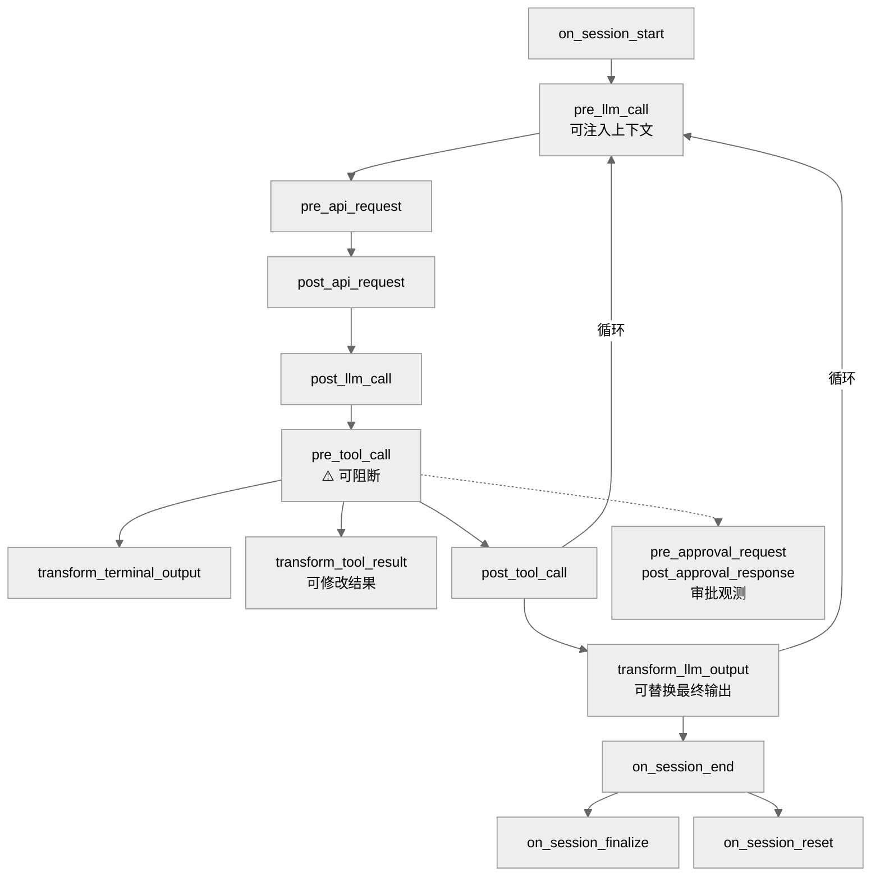
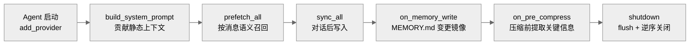

# 06-插件框架：用代码扩展 Agent 的能力

中文 | [English](../en/06-plugin-framework.md)

> **本章定位**：`plugins/` 目录（122 个 .py，46,477 行，16 个类别）+ `hermes_cli/plugins.py`（1,725 行，插件管理器）。插件是 Python 代码级的运行时扩展机制。
> **关键类**：`PluginContext`（`plugins.py:287`）、`PluginManager`（`plugins.py:883`）、`PluginManifest`（`plugins.py:234`）。

> **本章基于 hermes-agent commit [`3bace071b`](https://github.com/NousResearch/hermes-agent/commit/3bace071b)（2026-05-24）**

---

## 为什么需要插件？

01 章讲了 `hermes_cli/plugins.py` 的发现和加载机制（四个来源、白名单控制）。但那只是"怎么找到插件"——这一章要讲的是"插件能做什么、怎么做、以及最复杂的几个插件是怎么工作的"。

技能（`skills/`）可以包含 SKILL.md 指令和 Python 工具脚本——脚本通过 `execute_code` 工具在沙箱中执行，确实能增加新能力。但技能有一个根本限制：它**不能介入 Agent 的内部工作流**。技能的脚本是被 Agent 调用的外部代码，不能注册钩子拦截工具调用、不能替换上下文压缩策略、不能修改 LLM 输出、不能注入消息到对话流。

插件是进程内扩展——Python 模块直接加载到 Agent 进程中，通过 `PluginContext` API 介入 Agent 的每一个关键节点。区别不是"能不能跑代码"，而是"沙箱脚本 vs 进程内扩展"。

---

## 使用指南

### 基本用法

```bash
hermes plugins list       # 列出所有发现的插件和状态
hermes plugins enable X   # 启用插件
hermes plugins disable X  # 禁用插件
```

### 配置

```yaml
# config.yaml
plugins:
  enabled:
    - disk-cleanup
    - spotify
  disabled: []            # 显式禁用的插件（优先级最高）

memory:
  provider: "honcho"      # 记忆插件通过独立 config key 激活

context:
  engine: "compressor"    # 上下文引擎插件（默认内置压缩器）
```

### 常见场景

**场景一：安装第三方插件。** 把插件目录放入 `~/.hermes/plugins/<name>/`，确保有 `plugin.yaml` 和 `__init__.py`，然后在 `plugins.enabled` 中添加名称。

**场景二：切换记忆 Provider。** 设置 `memory.provider: "honcho"`，Honcho 插件自动激活。同一时间只能有一个记忆 provider——设置另一个会替换当前的。

**场景三：开发自定义插件。** 最小的插件只需要两个文件：

```
my-plugin/
├── plugin.yaml     # name, version, description, kind
└── __init__.py     # def register(ctx): ...
```

`register(ctx)` 函数接收 `PluginContext` 对象，通过它注册工具、钩子、命令等能力。

### 排错指引

| 问题 | 排查方向 |
|------|---------|
| 插件开发调试 | 设置 `HERMES_PLUGINS_DEBUG=1` 环境变量，插件发现/加载的完整日志输出到 stderr 和 `agent.log` |
| 插件没被发现 | `hermes plugins list` 检查（error 字段显示拒绝原因）；确认 `plugin.yaml` 存在且格式正确 |
| 插件发现了但未加载 | 检查 `plugins.enabled` 白名单；`plugins.disabled` 是否覆盖了 |
| 插件加载报错 | 检查 `agent.log`；单个插件崩溃不影响其他插件（每个 register 调用独立 try-except） |
| 钩子没触发 | 确认钩子名在 `VALID_HOOKS`（17 种）中；检查 `plugin.yaml` 的 `provides_hooks` 声明 |
| 插件工具没出现 | 确认 `register_tool()` 调用正确；检查工具的 `check_fn` 是否返回 True |
| 记忆插件不工作 | 确认 `memory.provider` 设置正确；检查 `agent.log` 中 MemoryManager 的日志 |

> 📖 **延伸阅读（官方文档）：**
> - [插件功能](https://hermes-agent.nousresearch.com/docs/user-guide/features/plugins)
> - [构建插件](https://hermes-agent.nousresearch.com/docs/guides/build-a-hermes-plugin)
> - [记忆 Provider 插件](https://hermes-agent.nousresearch.com/docs/developer-guide/memory-provider-plugin)
> - [上下文引擎插件](https://hermes-agent.nousresearch.com/docs/developer-guide/context-engine-plugin)

---

## 架构与实现

### PluginContext：插件能做什么

`PluginContext`（`plugins.py:287`）是 Agent 暴露给插件的 API 表面——插件能做的事情由它的方法列表严格界定：

| 方法 | 作用 | 行号 |
|------|------|------|
| `register_tool()` | 注册新工具（和内置工具同一接口） | `plugins.py:317` |
| `inject_message()` | 向 Agent 对话流注入消息 | `plugins.py:359` |
| `register_command()` | 注册斜杠命令或 CLI 子命令 | `plugins.py:412` |
| `register_context_engine()` | 替换上下文压缩引擎 | `plugins.py:499` |
| `register_image_gen_provider()` | 注册图像生成后端 | `plugins.py:531` |
| `register_hook()` | 注册生命周期钩子 | `plugins.py:814` |
| `register_skill()` | 注册插件私有技能 | `plugins.py:833` |
| `register_cli_command()` | 注册终端子命令（`hermes <name> ...`） | `plugins.py:387` |
| `dispatch_tool()` | 调用任意已注册工具 | `plugins.py:468` |
| `register_video_gen_provider()` | 注册视频生成后端 | `plugins.py:558` |
| `register_web_search_provider()` | 注册 Web 搜索/提取后端 | `plugins.py:585` |
| `register_browser_provider()` | 注册云浏览器后端 | `plugins.py:613` |
| `register_platform()` | 注册 Gateway 平台适配器 | `plugins.py:645` |
| `register_auxiliary_task()` | 注册辅助 LLM 任务 | `plugins.py:703` |
| `llm` property | 访问辅助 LLM 客户端（`auxiliary_client`） | — |

注意区分两种命令注册：`register_command()` 注册的是会话内斜杠命令（以 `/disk-cleanup` 为例），`register_cli_command()` 注册的是终端子命令（以 `hermes spotify` 为例）——两者的触发方式和执行环境完全不同。

`register_tool()` 和内置工具用同一个 `registry.register()` 接口——对模型来说，插件工具和内置工具没有区别。以 Spotify 插件为例，它注册了 7 个工具（播放、搜索、播放列表等），模型像使用 `read_file` 一样使用 `spotify_search`。

`inject_message()` 用于外部事件桥接——以 Google Meet 插件为例，会议中有人说话时，插件把转录文本注入 Agent 的对话流。注意：**Gateway 模式下 `inject_message()` 静默失败**（返回 False，`plugins.py:371`），因为它依赖 CLI 的输入队列。Agent 正在执行任务时注入会中断当前任务；Agent 空闲时注入则进入队列，等待下一轮处理。

`llm` property 让插件访问 02 章讲过的辅助 LLM 客户端（`auxiliary_client.py`），用于插件自己的 LLM 推理需求（以观测性插件生成摘要为例），不占用主模型的配额。

### 17 种生命周期钩子

钩子是插件最强大的能力——在 Agent 工作流的关键节点插入自定义逻辑。`VALID_HOOKS`（`plugins.py:128`）定义了 17 种：



**图：插件钩子在 Agent 工作流中的触发位置**

关键钩子说明：

- **`pre_tool_call`**：最特殊——可以返回 `{"action": "block", "message": "..."}` **阻断工具调用**。第一个有效的 block 指令立即生效，后续插件不再检查。这让插件可以实现自定义安全策略（以速率限制插件为例）
- **`pre_llm_call`**：每轮 LLM 调用前触发，插件可以返回上下文字符串注入到用户消息中——和 02 章讲的记忆预取是同一个注入点
- **`transform_tool_result`**：工具执行后触发，插件可以返回字符串**替换**工具结果
- **`pre_gateway_dispatch`**：04 章讲过——在 Gateway 授权检查前触发，插件可以 skip/rewrite/allow 消息
- **`transform_llm_output`**（`plugins.py:136`）：工具循环结束、最终回复确定后触发，第一个返回非空字符串的回调**替换最终输出**——用于输出后处理（以词汇/人格变换为例）
- **`pre_approval_request` / `post_approval_response`**：危险命令审批时触发，仅观测（返回值被忽略），含 `command`、`surface`（"cli"或"gateway"）、`choice` 等参数
- **`subagent_stop`**：子 Agent 完成时触发，用于跨 Agent 的状态同步

每个钩子回调都包在 try-except 里，单个插件崩溃不影响其他插件或 Agent 核心——这是插件系统的隔离保证。

### 五种插件类型

`plugin.yaml` 中的 `kind` 字段区分五种类型：

**`standalone`**（默认）——独立功能插件，需要在 `plugins.enabled` 中显式激活。以 `disk-cleanup` 为例，它注册 `post_tool_call` 和 `on_session_end` 钩子追踪并清理临时文件。

**`backend`**——服务后端插件，为内置工具提供 Provider 实现。bundled 的 backend 插件自动加载无需 opt-in。以 `image_gen/openai` 为例，它为 `image_generate` 工具提供 gpt-image-2 后端。

**`platform`**——平台适配器插件（04 章提到的 `plugins/platforms/`），为 Gateway 提供新的消息平台支持。以 Discord 插件为例，它实现了 `BasePlatformAdapter` 接口。bundled 的 platform 插件自动加载。

**`exclusive`**——互斥插件，同一时刻只能有一个激活。记忆插件和上下文引擎插件是这种类型，通过独立 config key 控制（`memory.provider`、`context.engine`）。

**`model-provider`**——模型 Provider 插件，为认证系统（01 章的 `PROVIDER_REGISTRY`）提供新的 Provider。通过 `auth.py:459` 自动扩展注册表。

### 记忆插件：最复杂的扩展点

`plugins/memory/` 包含 8 个记忆插件（honcho、hindsight、holographic、mem0、openviking、retaindb、supermemory、byterover），但同一时刻只能激活一个。

> ⚠️ **记忆插件不走通用 PluginManager**。它有自己的发现路径（`plugins/memory/__init__.py`）。记忆插件的 `register(ctx)` 函数接收的不是通用的 `PluginContext`，而是一个内部对象 `_ProviderCollector`（`plugins/memory/__init__.py:288`）——一个精简的伪 context 对象，只有 `register_memory_provider()` 是有效方法，其余 `register_tool`/`register_hook`/`register_cli_command` 是 no-op stub（接受调用但不做任何事）。通用 `PluginContext` **没有** `register_memory_provider()` 方法。如果你想开发记忆插件，入口是 `plugins/memory/<name>/__init__.py`，不是通用插件开发路径。

记忆插件通过实现 `MemoryProvider` ABC（`agent/memory_provider.py:42`，18 个方法）注册。核心生命周期：



**图：MemoryProvider 的生命周期——从启动注册到会话中的构建/预取/同步到关闭**

除了图中的核心方法，`MemoryProvider` 还有几个对实现者至关重要的方法：
- `is_available()` — **抽象方法**，Agent 初始化时调用以决定是否激活，只检查配置和依赖，不得发网络请求
- `get_tool_schemas()` / `handle_tool_call()` — memory provider 可以向模型暴露自己的工具（以 `honcho_memory_search` 为例），`MemoryManager` 建立工具名→provider 的路由索引
- `queue_prefetch(query)` — 每轮结束后调用，触发下一轮的后台异步预取
- `on_turn_start(turn_number, message)` — 每轮开始时调用，含 remaining_tokens、model 等上下文
- `on_session_switch(new_session_id)` — `/reset`、上下文压缩等触发 session 切换时调用

`MemoryManager`（`agent/memory_manager.py:244`）是调度层，最多接受一个外部 MemoryProvider。内置的 MEMORY.md/USER.md 系统由独立的 `MemoryStore`（`tools/memory_tool.py`）管理，不走 `MemoryProvider` ABC——两者并行工作。为什么只支持一个外部 provider？因为多个 provider 同时写入会产生冲突——它们各自的语义理解不同，合并是个未解决的难题。

以 Honcho 插件为例（`plugins/memory/honcho/`），它的开销感知机制值得了解：`context_cadence` 和 `dialectic_cadence` 控制调用频率——不是每轮都做深度提取，而是间隔 N 轮才触发。连续空结果时线性退避（cadence 加上空结果连续次数），避免"用户只是闲聊"时浪费 API 调用。

### 插件加载规则

插件加载有明确的优先级（`plugins.py:883` 的 `discover_and_load()`）：

1. **`plugins.disabled` 最优先**——列表中的插件永不加载
2. **bundled backend/platform 自动加载**——和 Hermes 一起打包的 backend 和 platform 插件不需要 opt-in
3. **standalone 需要 opt-in**——必须在 `plugins.enabled` 中
4. **exclusive 由专用 config 控制**——以 `memory.provider: honcho` 为例
5. **pip entry-point 插件**——通过 `hermes_agent.plugins` entry point group 发现
6. **user/project 插件始终需要 opt-in**

名称冲突规则：后加载的覆盖先加载的（同名同 kind）。但插件工具不能覆盖内置工具，除非显式传 `override=True`（`registry.py:247`）。

### 16 个内置插件类别

```
plugins/
├── memory/           — 8 个记忆 Provider（honcho、mem0 等）
├── context_engine/   — 上下文引擎（LCM 等）
├── model-providers/  — 模型 Provider（OpenRouter、Anthropic、GMI 等）
├── image_gen/        — 图像生成后端（OpenAI、FAL、xAI、Codex）
├── video_gen/        — 视频生成后端
├── platforms/        — 7 个消息平台（Discord、Teams、Google Chat 等）
├── kanban/           — Kanban 多 Agent 调度器
├── observability/    — 可观测性（metrics/traces/logs）
├── browser/          — 浏览器扩展
├── web/              — Web 搜索后端
├── spotify/          — Spotify 集成
├── google_meet/      — Google Meet 转录集成
├── teams_pipeline/   — Teams 会议管线
├── hermes-achievements/ — 成就系统（游戏化）
├── disk-cleanup/     — 磁盘清理
└── example-dashboard/— 示例 Dashboard 插件
```

### 设计决策

#### 白名单 vs 黑名单

hermes-agent 选择了白名单模式（`plugins.enabled`）而非黑名单（默认全加载、手动禁用）。这是安全决策——第三方插件可以注册任意工具和钩子，无限制加载会带来安全风险。`migrate_config()` 在升级时自动把已有的用户插件加入白名单，避免升级后插件突然消失。

#### 独立发现路径

记忆插件和上下文引擎插件不走通用 `PluginManager`，而是有独立的发现路径。这是因为它们是 exclusive 的——同一时间只能有一个，需要不同的激活和冲突解决逻辑。通用 `PluginManager` 的"同名覆盖"规则不适用于互斥插件。

### 扩展点

1. **注册新工具**：`ctx.register_tool()` 和内置工具同一接口
2. **注册钩子**：`ctx.register_hook()` 支持 17 种生命周期事件
3. **注册命令**：`ctx.register_command()` 支持斜杠命令和 CLI 子命令
4. **替换上下文引擎**：实现 `ContextEngine` ABC
5. **替换记忆 Provider**：实现 `MemoryProvider` ABC
6. **注册图像/视频生成后端**：`ctx.register_image_gen_provider()`
7. **注册模型 Provider**：通过 `plugins/model-providers/` 自动扩展 `PROVIDER_REGISTRY`

---

## 与其他章节的关系

| 关联章节 | 关系 |
|---------|------|
| 01 — 基础设施层 | `hermes_cli/plugins.py` 的发现/加载/白名单机制在 01 章介绍 |
| 02 — Agent 核心 | ContextEngine ABC 和 auxiliary_client（插件 LLM 访问）在 02 章介绍 |
| 03 — 工具系统 | 插件工具通过同一 `registry.register()` 接口注册 |
| 04 — 网关层 | platform 插件通过 `plugins/platforms/` 提供新的消息平台 |
| 07 — 模型层插件 | model-providers 和 image_gen 插件的详细分析 |
| 08 — 运行时增强插件 | 记忆、观测性、Kanban 插件的详细分析 |
| 09 — 外部集成插件 | Spotify、Google Meet 等集成插件 |

---

*本文基于 hermes-agent v0.14.0 源码分析。所有代码引用均经过独立验证。*
