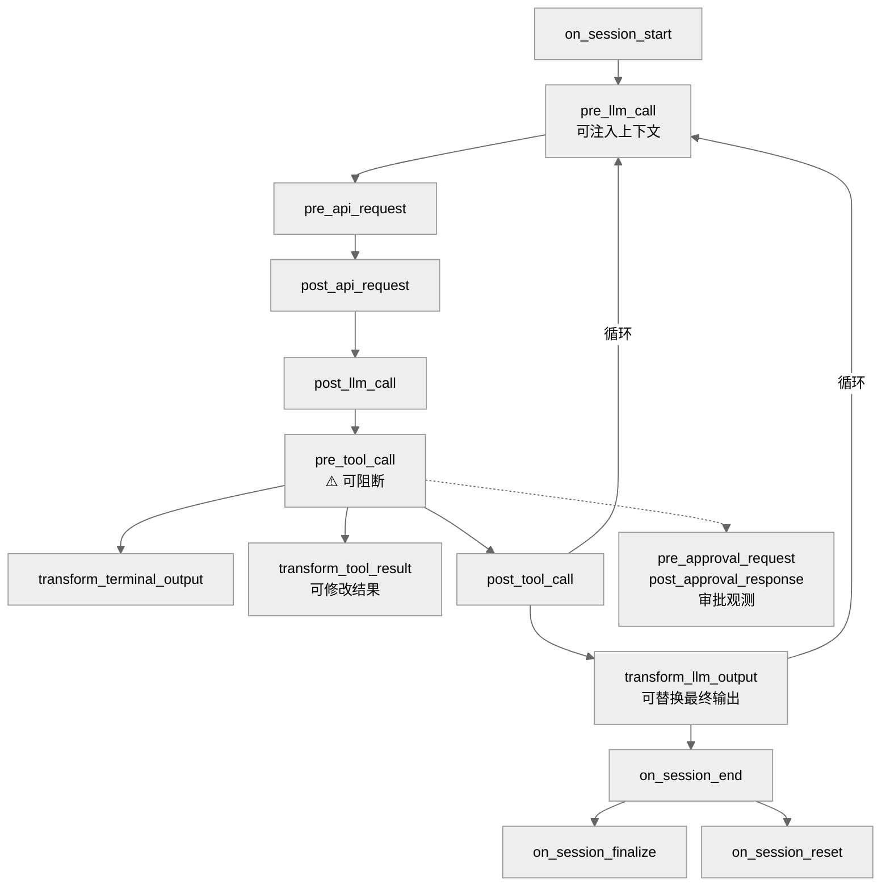
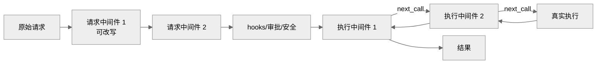
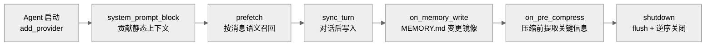

# 07-插件框架：用代码扩展 Agent 的能力

中文 | [English](../en/07-plugin-framework.md)

> **本章定位**：`plugins/` 目录（177 个 .py，104,721 行，18 个类别）+ `hermes_cli/plugins.py`（2,464 行，插件管理器）。插件是 Python 代码级的运行时扩展机制。
> **关键类**：`PluginContext`（`plugins.py:337`）、`PluginManager`（`plugins.py:1246`）、`PluginManifest`（`plugins.py:279`）。

> **本章基于 hermes-agent v0.18.2（tag [`v2026.7.7.2`](https://github.com/NousResearch/hermes-agent/releases/tag/v2026.7.7.2)，commit `9de9c25f6`，2026-07-07）**

---

## 为什么需要插件？

技能和插件都能扩展 Agent 的能力，但扩展的方式完全不同。用三个具体场景说明。

**场景一：让 Agent 能查预测市场的赔率。** 这用技能就够了。Polymarket 技能（`skills/research/polymarket/`）包含一个 SKILL.md（告诉模型什么时候用、怎么用）和一个 Python 脚本（`scripts/polymarket.py`——一个普通的命令行工具）。模型需要查赔率时，用 `terminal` 工具执行 `python3 polymarket.py search "bitcoin"`，脚本在沙箱中运行返回结果。技能的本质是**给模型一个新的操作手册和工具脚本**。

**场景二：让 Agent 能控制 Spotify 播放音乐。** 这就不能用技能了——你需要的是让 Spotify 的 7 个操作（播放、暂停、搜索、切歌等）作为**一等工具**出现在模型的工具列表中，有类型化的参数 schema，让模型可以直接调用 `spotify_play(track="...")`，而不是通过 `terminal` 跑一个 Python 脚本。这需要在 Agent 进程内调用 `registry.register()` 注册工具——只有插件能做。

**场景三：监控所有 LLM 调用的 token 用量和延迟，发送到 Langfuse。** 技能完全做不了——技能是被模型**按需调用**的，它不知道 LLM 调用何时发生。你需要在 Agent 内部的每次 API 请求后**自动触发**一个回调——在 `post_api_request` 钩子中注入监控代码。这是插件独有的能力。

三个场景展示了扩展需求的三个层次：

| | 技能 | 插件 |
|---|------|------|
| 本质 | 给模型的操作手册 + 工具脚本 | Agent 进程内的 Python 模块 |
| 执行方式 | 模型通过 `terminal`/`execute_code` 执行脚本 | 加载到 Agent 进程，注册工具/钩子/组件 |
| 模型的角色 | 模型决定何时调用、怎么调用 | 钩子自动触发，不需要模型参与 |
| 能做什么 | 增加"做事"能力（查数据、生成内容） | 注册一等工具、介入工作流、替换核心组件 |
| 能否拦截 | 不能——脚本不知道其他工具在做什么 | 可以——`pre_tool_call` 能阻断任何工具调用 |
| 能否替换组件 | 不能——脚本在沙箱中，接触不到 Agent 内部 | 可以——替换记忆系统、上下文引擎、图像生成后端 |
| Agent 能自己创建吗 | 可以——Agent 在使用中自动创建和改进技能 | 不能——必须由开发者编写 |
| 安全性 | 高——沙箱隔离，有 bug 不破坏 Agent | 低——进程内运行，有 bug 可能阻断所有工具 |

**什么时候用技能？** 当你想让 Agent 能"做一件新的事"（查数据、操作 API、遵循特定流程），而且这件事可以通过命令行脚本完成——用技能。它简单、安全、模型可以自己创建。

**什么时候用插件？** 当你需要：(1) 注册一等工具（有 schema、参数类型检查）；(2) 在 Agent 工作流节点自动触发逻辑（监控、拦截、变换）；(3) 替换 Agent 的核心组件（记忆、压缩、Provider）；(4) 接入新的消息平台——用插件。

**为什么不合并？** 安全和自主性的权衡。技能可以被 Agent 自己创建和修改——如果技能有进程内访问权，等于 Agent 可以修改自己的运行时行为，这在安全模型上不可接受。插件只能由开发者编写和安装，经过白名单审核才加载。

01 章讲了 `hermes_cli/plugins.py` 的发现和加载机制（四个来源、白名单控制）。这一章深入插件的 API、钩子系统、以及最复杂的几个插件是怎么工作的。

---

## 使用指南

### 基本用法

```bash
hermes plugins list       # 列出所有发现的插件和状态
hermes plugins enable X   # 启用插件
hermes plugins disable X  # 禁用插件
```

### 配置

```yaml
# config.yaml
plugins:
  enabled:
    - disk-cleanup
    - spotify
  disabled: []            # 显式禁用的插件（优先级最高）

memory:
  provider: "honcho"      # 记忆插件通过独立 config key 激活

context:
  engine: "compressor"    # 上下文引擎插件（默认内置压缩器）
```

### 常见场景

**场景一：安装第三方插件。** 把插件目录放入 `~/.hermes/plugins/<name>/`，确保有 `plugin.yaml` 和 `__init__.py`，然后在 `plugins.enabled` 中添加名称。

**场景二：切换记忆 Provider。** 设置 `memory.provider: "honcho"`，Honcho 插件自动激活。同一时间只能有一个记忆 provider——设置另一个会替换当前的。

**场景三：开发自定义插件。** 最小的插件只需要两个文件：

```
my-plugin/
├── plugin.yaml     # name, version, description, kind
└── __init__.py     # def register(ctx): ...
```

`register(ctx)` 函数接收 `PluginContext` 对象，通过它注册工具、钩子、命令等能力。

### 排错指引

| 问题 | 排查方向 |
|------|---------|
| 插件开发调试 | 设置 `HERMES_PLUGINS_DEBUG=1` 环境变量，插件发现/加载的完整日志输出到 stderr 和 `agent.log` |
| 插件没被发现 | `hermes plugins list` 检查（error 字段显示拒绝原因）；确认 `plugin.yaml` 存在且格式正确 |
| 插件发现了但未加载 | 检查 `plugins.enabled` 白名单；`plugins.disabled` 是否覆盖了 |
| 插件加载报错 | 检查 `agent.log`；单个插件崩溃不影响其他插件（每个 register 调用独立 try-except） |
| 钩子没触发 | 确认钩子名在 `VALID_HOOKS`（23 种）中；检查 `plugin.yaml` 的 `provides_hooks` 声明 |
| 插件工具没出现 | 确认 `register_tool()` 调用正确；检查工具的 `check_fn` 是否返回 True |
| 记忆插件不工作 | 确认 `memory.provider` 设置正确；检查 `agent.log` 中 MemoryManager 的日志 |
| Agent 卡在 running 很久 | 疑 memory provider 的 sync/prefetch 网络调用阻塞——正常应跑在 `mem-sync` 后台线程（memory_manager.py:571 曾有 298 秒阻塞事故）；日志搜 "sync_turn failed" |
| 自定义 secret source 首启不生效 | 插件发现晚于首次 env 加载（plugins.py:812 "NOTE ON TIMING"）——只对子进程/cron/subagent 生效，或调 `reset_secret_source_cache()` |
| pre_verify 一直返回 continue 但 Agent 停了 | 有硬上限：`agent.max_verify_nudges`（默认 3，config.py:1027）——超过后无论钩子返回什么都放行结束 |

> 📖 **延伸阅读（官方文档）：**
> - [插件功能](https://hermes-agent.nousresearch.com/docs/user-guide/features/plugins)
> - [构建插件](https://hermes-agent.nousresearch.com/docs/guides/build-a-hermes-plugin)
> - [记忆 Provider 插件](https://hermes-agent.nousresearch.com/docs/developer-guide/memory-provider-plugin)
> - [上下文引擎插件](https://hermes-agent.nousresearch.com/docs/developer-guide/context-engine-plugin)

---

## 架构与实现

### PluginContext：插件能做什么

`PluginContext`（`plugins.py:337`）是 Agent 暴露给插件的 API 表面——插件能做的事情由它的方法列表严格界定。v0.18.2 共 22 个公开成员（20 个方法 + 2 个属性），其中 6 个注册面是 v0.17-v0.18 新增：

| 方法 | 作用 | 行号 |
|------|------|------|
| `register_tool()` | 注册新工具（和内置工具同一接口） | `plugins.py:389` |
| `inject_message()` | 向 Agent 对话流注入消息 | `plugins.py:474` |
| `register_cli_command()` | 注册终端子命令（`hermes <name> ...`） | `plugins.py:502` |
| `register_command()` | 注册斜杠命令 | `plugins.py:527` |
| `dispatch_tool()` | 调用任意已注册工具 | `plugins.py:583` |
| `register_context_engine()` | 替换上下文压缩引擎 | `plugins.py:614` |
| `register_image_gen_provider()` | 注册图像生成后端 | `plugins.py:646` |
| `register_dashboard_auth_provider()` ★ | 注册 Dashboard 认证方案（对接桌面/Web，→ 08/14 章） | `plugins.py:673` |
| `register_video_gen_provider()` | 注册视频生成后端 | `plugins.py:713` |
| `register_web_search_provider()` | 注册 Web 搜索/提取后端 | `plugins.py:740` |
| `register_browser_provider()` | 注册云浏览器后端 | `plugins.py:768` |
| `register_secret_source()` ★ | 注册密钥来源（对接外部密钥管理） | `plugins.py:800` |
| `register_tts_provider()` ★ | 注册 TTS 引擎 | `plugins.py:847` |
| `register_transcription_provider()` ★ | 注册 STT 引擎（新 Python 引擎；6 个内置后端不走这里） | `plugins.py:885` |
| `register_platform()` | 注册 Gateway 平台适配器（进平台注册表，→ 05 章） | `plugins.py:929` |
| `register_slack_action_handler()` ★ | 注册 Slack Block Kit 按钮回调 | `plugins.py:985` |
| `register_auxiliary_task()` | 注册辅助 LLM 任务 | `plugins.py:1045` |
| `register_hook()` | 注册生命周期钩子 | `plugins.py:1156` |
| `register_middleware()` ★ | 注册中间件（与钩子并行的新扩展面，见下） | `plugins.py:1175` |
| `register_skill()` | 注册插件私有技能 | `plugins.py:1196` |
| `llm` property | 访问辅助 LLM 客户端（`auxiliary_client`） | `plugins.py:349` |
| `profile_name` property | 当前 Profile 名 | `plugins.py:368` |

注意区分两种命令注册：`register_command()` 注册的是会话内斜杠命令（以 `/disk-cleanup` 为例），`register_cli_command()` 注册的是终端子命令（以 Google Meet 插件注册的 `hermes meet`、或 teams_pipeline 注册的 `hermes teams-pipeline` 为例；注意 Spotify 插件只走 `register_tool`，并不注册 CLI 子命令）——两者的触发方式和执行环境完全不同。

`register_tool()` 和内置工具用同一个 `registry.register()` 接口——对模型来说，插件工具和内置工具没有区别。以 Spotify 插件为例，它注册了 7 个工具（播放、搜索、播放列表等），模型像使用 `read_file` 一样使用 `spotify_search`。

`inject_message()` 用于外部事件桥接——以 Google Meet 插件为例，会议中有人说话时，插件把转录文本注入 Agent 的对话流。注意：**Gateway 模式下 `inject_message()` 静默失败**（`_cli_ref` 为 None 时记 warning 并 `return False`，`plugins.py:485-488`），因为它依赖 CLI 的输入队列。Agent 正在执行任务时注入会中断当前任务；Agent 空闲时注入则进入队列，等待下一轮处理。

`llm` property 让插件访问 02 章讲过的辅助 LLM 客户端（`auxiliary_client.py`），用于插件自己的 LLM 推理需求（以观测性插件生成摘要为例），不占用主模型的配额。

### 23 种生命周期钩子

钩子是插件最强大的能力——在 Agent 工作流的关键节点插入自定义逻辑。`VALID_HOOKS`（`plugins.py:135`）定义了 23 种：



**图：插件钩子在 Agent 工作流中的触发位置**（图中展示的是主对话循环内的钩子；不在主循环上的还有：`subagent_start`/`subagent_stop`（子 Agent 起止）、`pre_gateway_dispatch`（Gateway 授权检查前，见 05 章）、`api_request_error`（API 报错时）、`pre_verify`（代码编辑后的验证门控，可让 Agent 继续跑检查而非停下）、以及 kanban 三件套 `kanban_task_claimed/completed/blocked`（看板任务事件，→ 09 章），合计 23 种 `VALID_HOOKS`）

关键钩子说明：

- **`pre_tool_call`**：最特殊——有**两种**处置动作（`_get_pre_tool_call_directive_details`，`plugins.py:2099` 起）：`{"action": "block", "message": "..."}` 直接**阻断**；`{"action": "approve", "message": "..."}` 则**升级到人工审批门**——走和危险命令一样的 once/session/always/deny 流程（可带 `rule_key` 让 always 记住规则），把决定权交给人而不是硬拒绝。审批门自身报错时 **fail-closed** 成阻断（`resolve_pre_tool_block`，`:2226`）。执行模型：`invoke_hook` 无条件调用所有已注册回调（无提前退出），随后取**第一个**有效指令生效。另有一道优先级更高的短路：线程级工具白名单（`_thread_tool_whitelist`，`:2077`）在任何插件钩子之前就拒绝白名单外的调用
- **`pre_llm_call`**：每轮 LLM 调用前触发，插件可以返回上下文字符串注入到用户消息中——和 02 章讲的记忆预取是同一个注入点
- **`transform_tool_result`**：工具执行后触发，插件可以返回字符串**替换**工具结果
- **`pre_gateway_dispatch`**：05 章讲过——在 Gateway 授权检查前触发，插件可以 skip/rewrite/allow 消息
- **`transform_llm_output`**（`plugins.py:143`）：工具循环结束、最终回复确定后触发，第一个返回非空字符串的回调**替换最终输出**——用于输出后处理（以词汇/人格变换为例）
- **`pre_approval_request` / `post_approval_response`**：危险命令审批时触发，仅观测（返回值被忽略）。两者都含 `command`、`surface`（"cli"或"gateway"）等参数；`choice`（`once`/`session`/`always`/`deny`/`timeout`）**只有 `post_approval_response` 才有**（审批结果是后置事件才知道的）
- **`subagent_stop`**：子 Agent 完成时触发，用于跨 Agent 的状态同步

每个钩子回调都包在 try-except 里，单个插件崩溃不影响其他插件或 Agent 核心——这是插件系统的隔离保证。

### 中间件：能改写载荷、能包裹执行的第二扩展面

钩子只能**观察或拦截**；v0.17 新增的中间件（`hermes_cli/middleware.py`）能**改写载荷、包裹执行本身**。`register_middleware()` 支持四种 kind（`middleware.py:20-23`）：`tool_request` / `tool_execution` / `llm_request` / `llm_execution`，已接入 conversation_loop、tool_executor、model_tools 的生产链路。

两类语义完全不同：

- **请求中间件**（`apply_llm_request_middleware`/`apply_tool_request_middleware`，`:76-161`）：链式改写——每个回调可返回 `{"request": {...}}` 或 `{"args": {...}}` **替换**原始载荷，且发生在 hooks/安全防线/审批**看到之前**；不返回或返回非 dict 则透传给下一个
- **执行中间件**（`run_tool_execution_middleware`/`run_llm_execution_middleware`，`:172-296`）：洋葱模型——每个回调拿到一个 `next_call()` 去调用下一层（或最终执行体）。`next_call()` **只能调一次**（重复调用抛 RuntimeError）；下游异常经包装原样上抛；回调自己抛错但下游已成功时返回下游结果而不是让整条链失败



**图：请求中间件是改写流水线，执行中间件是洋葱包裹——与只能观察/拦截的钩子构成互补**

用哪个？监控/拦截用钩子；要改请求参数、给执行加缓存/重试/计时**包裹**的，用中间件。

### 五种插件类型

`plugin.yaml` 中的 `kind` 字段区分五种类型：

**`standalone`**（默认）——独立功能插件，需要在 `plugins.enabled` 中显式激活。以 `disk-cleanup` 为例，它注册 `post_tool_call` 和 `on_session_end` 钩子追踪并清理临时文件。

**`backend`**——服务后端插件，为内置工具提供 Provider 实现。bundled 的 backend 插件自动加载无需 opt-in。以 `image_gen/openai` 为例，它为 `image_generate` 工具提供 gpt-image-2 后端。

**`platform`**——平台适配器插件（`plugins/platforms/`，现有 20 个，v0.16-v0.18 间主流平台从 gateway 整体迁入，→ 08 章）。以 Discord 插件为例，它实现了 `BasePlatformAdapter` 接口。bundled 的 platform 插件**延迟加载**（v0.17 起）：发现时只在平台注册表挂一个加载器（`LoadedPlugin.deferred`，`plugins.py:327-330`），首次真正用到才 import 重 SDK——这是平台大迁移不拖慢启动的前提（第 01 章五分支分诊）。

**`exclusive`**——互斥插件，同一时刻只能有一个激活。记忆插件和上下文引擎插件是这种类型，通过独立 config key 控制（`memory.provider`、`context.engine`）。

**`model-provider`**——模型 Provider 插件，为认证系统（01 章的 `PROVIDER_REGISTRY`）提供新的 Provider。通过 `auth.py:447-470` 自动扩展注册表（仅 api_key 型）。

### 记忆插件：最复杂的扩展点

`plugins/memory/` 包含 8 个记忆插件（honcho、hindsight、holographic、mem0、openviking、retaindb、supermemory、byterover），但同一时刻只能激活一个。

> ⚠️ **记忆插件不走通用 PluginManager**。它有自己的发现路径（`plugins/memory/__init__.py`）。记忆插件的 `register(ctx)` 函数接收的不是通用的 `PluginContext`，而是一个内部对象 `_ProviderCollector`（`plugins/memory/__init__.py:319`）——一个精简的伪 context 对象，只有 `register_memory_provider()` 是有效方法，其余 `register_tool`/`register_hook`/`register_cli_command` 是 no-op stub（接受调用但不做任何事）。通用 `PluginContext` **没有** `register_memory_provider()` 方法。如果你想开发记忆插件，入口是 `plugins/memory/<name>/__init__.py`，不是通用插件开发路径。

记忆插件通过实现 `MemoryProvider` ABC（`agent/memory_provider.py:43`，19 个方法——v0.18 新增 `backup_paths()`，让 `hermes backup` 知道该带走 provider 的哪些本地数据）注册。核心生命周期：



**图：MemoryProvider 的生命周期——从启动注册到会话中的构建/预取/同步到关闭**

除了图中的核心方法，`MemoryProvider` 还有几个对实现者至关重要的方法：
- `is_available()` — **抽象方法**，Agent 初始化时调用以决定是否激活，只检查配置和依赖，不得发网络请求
- `initialize(**kwargs)` — 另一个抽象方法（生命周期第一步，`MemoryManager.initialize_all()` 调用）。kwargs 里最关键的是 `agent_context`："primary"/"subagent"/"cron"/"flush" 四值（`memory_provider.py:74`）——docstring 明说**非 primary 场景应跳过写入**（cron 的系统提示会污染用户画像）；`hermes_home` 未传时由 initialize_all 自动注入，供 provider 解析 Profile 级存储路径
- `get_tool_schemas()` / `handle_tool_call()` — memory provider 可以向模型暴露自己的工具（以 `honcho_memory_search` 为例），`MemoryManager` 建立工具名→provider 的路由索引
- `queue_prefetch(query)` — 每轮结束后调用，触发下一轮的后台异步预取
- `on_turn_start(turn_number, message)` — 每轮开始时调用，含 remaining_tokens、model 等上下文
- `on_session_switch(new_session_id)` — `/reset`、上下文压缩等触发 session 切换时调用

`MemoryManager`（`agent/memory_manager.py:353`，文件 1,086 行）是调度层，最多接受一个外部 MemoryProvider。内置的 MEMORY.md/USER.md 系统由独立的 `MemoryStore`（`tools/memory_tool.py`）管理，不走 `MemoryProvider` ABC——两者并行工作。为什么只支持一个外部 provider？因为多个 provider 同时写入会产生冲突——它们各自的语义理解不同，合并是个未解决的难题。

**后台同步的教训**：`sync_turn`/`prefetch` 曾是同步调用跑在主流程里——一个配置错误的 Hindsight daemon 曾把 Agent 卡在 running 状态约 298 秒（`memory_manager.py:571` 注释里的事故复盘）。现在 `sync_all`/`queue_prefetch_all` 派发到单 worker 的 `mem-sync` daemon 线程（保证 turn N 的写入先于 turn N+1），`shutdown_all()` 只给 5 秒排空（`_SYNC_DRAIN_TIMEOUT_S`），卡死的 provider 随进程退出而死。排查"Agent 卡在 running 很久"时，先看是不是 memory provider 的网络调用堵住了。

还有一条容易误解的路径：`_ProviderCollector` 的 `register_cli_command` 虽是 no-op，记忆插件的 CLI 子命令（如 `hermes honcho setup`）走**另一条独立通道**——`discover_plugin_cli_commands()`（`plugins/memory/__init__.py:354` 起）只为当前激活的 provider 加载其 `cli.py` 里的 `register_cli()`。"钩子/工具是 no-op"不等于"没有 CLI 能力"。

以 Honcho 插件为例（`plugins/memory/honcho/`），它的开销感知机制值得了解：`context_cadence` 和 `dialectic_cadence` 控制调用频率——不是每轮都做深度提取，而是间隔 N 轮才触发。连续空结果时线性退避（cadence 加上空结果连续次数），避免"用户只是闲聊"时浪费 API 调用。

### 插件加载规则

插件加载有明确的优先级（`discover_and_load()`，`plugins.py:1277`；完整五分支分诊见第 01 章）：

1. **`plugins.disabled` 最优先**——列表中的插件永不加载
2. **bundled backend 自动加载、bundled platform 延迟注册**——都开箱即用，platform 只是把 import 推迟到首次使用
3. **standalone 需要 opt-in**——必须在 `plugins.enabled` 中
4. **exclusive 由专用 config 控制**（记账为 enabled=False）——以 `memory.provider: honcho` 为例；**model-provider 则记账为 enabled=True 但模块不被 PluginManager 加载**（providers/ 发现层负责真正 import，二次 import 会造出两个 ProviderProfile 破坏覆盖语义，`plugins.py:1410-1423`）——`hermes plugins list` 里两者状态不同的原因在此
5. **pip entry-point 插件**——通过 `hermes_agent.plugins` entry point group 发现
6. **user/project 插件始终需要 opt-in**

名称冲突规则：后加载的覆盖先加载的（同名同 kind）。TTS/STT 等新注册面共享另一个优先级模式（docstring `plugins.py:856-865/:895-904`）：**内置 provider 名恒赢 > config 里 `type: command` 的命令型 provider > 插件注册**——插件注册的同名 provider 永远选不中时，先查前两层是不是占了名字。但跨工具集的同名注册默认被拒绝（防意外遮蔽；MCP 对 MCP 覆盖例外），插件想替换内置工具实现须显式传 `override=True`（`registry.register` 签名 `registry.py:356`，另有按插件命名空间的 override 政策开关 `:307`）。

### 18 个内置插件类别

```
plugins/
├── memory/           — 记忆 Provider（honcho、mem0 等）
├── context_engine/   — 上下文引擎
├── model-providers/  — 模型 Provider（29 个子目录）
├── image_gen/        — 图像生成后端（v0.18 扩至 6 个，+krea/+openrouter）
├── video_gen/        — 视频生成后端
├── platforms/        — 20 个消息平台（主流平台已从 gateway 迁入，→ 08 章）
├── kanban/           — Kanban 多 Agent 调度器
├── observability/    — 可观测性（langfuse + nemo_relay）
├── browser/          — 浏览器扩展
├── web/              — Web 搜索后端
├── cron_providers/   — 外部调度 Provider（chronos，→ 11 章）★新
├── dashboard_auth/   — Dashboard 多方案认证（basic/nous/drain/self_hosted，→ 14 章）★新
├── security-guidance/— 安全模式库 ★新
├── spotify/          — Spotify 集成
├── google_meet/      — Google Meet 转录集成
├── teams_pipeline/   — Teams 会议管线
├── hermes-achievements/ — 成就系统（游戏化）
└── disk-cleanup/     — 磁盘清理
```

（v0.14 的 example-dashboard 已移除；16 - 1 + 3 = 18 个类别。）

### 设计决策

#### 白名单 vs 黑名单

hermes-agent 选择了白名单模式（`plugins.enabled`）而非黑名单（默认全加载、手动禁用）。这是安全决策——第三方插件可以注册任意工具和钩子，无限制加载会带来安全风险。`migrate_config()` 在升级时自动把已有的用户插件加入白名单，避免升级后插件突然消失。

#### 独立发现路径

记忆插件和上下文引擎插件不走通用 `PluginManager`，而是有独立的发现路径。这是因为它们是 exclusive 的——同一时间只能有一个，需要不同的激活和冲突解决逻辑。通用 `PluginManager` 的"同名覆盖"规则不适用于互斥插件。

### 扩展点

1. **注册新工具**：`ctx.register_tool()` 和内置工具同一接口
2. **注册钩子**：`ctx.register_hook()` 支持 23 种生命周期事件
3. **注册命令**：`ctx.register_command()` 支持斜杠命令和 CLI 子命令
4. **替换上下文引擎**：实现 `ContextEngine` ABC
5. **替换记忆 Provider**：实现 `MemoryProvider` ABC
6. **注册图像/视频生成后端**：`ctx.register_image_gen_provider()`
7. **注册模型 Provider**：通过 `plugins/model-providers/` 自动扩展 `PROVIDER_REGISTRY`

---

## 与其他章节的关系

| 关联章节 | 关系 |
|---------|------|
| 01 — 基础设施层 | `hermes_cli/plugins.py` 的发现/加载/白名单机制在 01 章介绍 |
| 02 — Agent 核心 | ContextEngine ABC 和 auxiliary_client（插件 LLM 访问）在 02 章介绍 |
| 03 — 工具系统 | 插件工具通过同一 `registry.register()` 接口注册 |
| 05 — 网关层 | platform 插件通过 `plugins/platforms/` 提供新的消息平台 |
| 08 — 内置插件 | 记忆/模型 Provider/平台/观测性/Spotify 等插件详细分析 |

---

*本文基于 hermes-agent v0.18.2 源码分析。所有代码引用均经过独立验证。*
