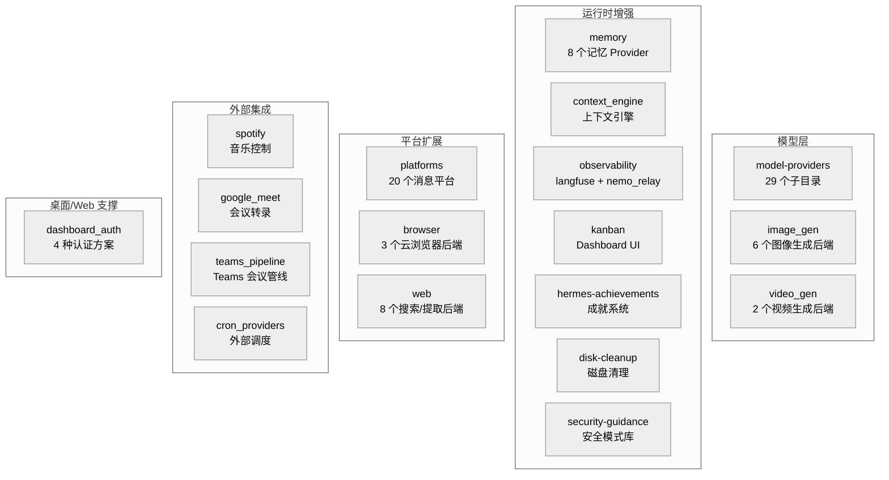

# 08-内置插件：18 个类别的能力扩展

中文 | [English](../en/08-builtin-plugins.md)

> **本章定位**：`plugins/` 目录（177 个 .py，104,721 行，18 个类别）。07 章讲了插件框架的 API 和机制，本章讲这些 API 的实际使用者——hermes-agent 自带的 18 类内置插件。
> **关键目录**：`plugins/platforms/`（20 个消息平台，59,000 行——v0.16-v0.18 平台大迁移后的主战场）、`plugins/memory/`（8 个记忆 Provider，18,597 行）、`plugins/model-providers/`（29 个子目录，1,595 行）。

> **本章基于 hermes-agent v0.18.2（tag [`v2026.7.7.2`](https://github.com/NousResearch/hermes-agent/releases/tag/v2026.7.7.2)，commit `9de9c25f6`，2026-07-07）**

---

## 这些插件解决什么问题？

07 章建立了插件的框架——PluginContext API、23 种钩子、五种 kind 类型。但框架本身不产生价值，使用框架的插件才产生价值。

hermes-agent 自带 18 个类别的内置插件，覆盖五个方向的扩展需求：



**图：18 个内置插件类别按扩展方向分组**

本章不逐个列举所有插件的代码——那是源码导览，不是分析文档。而是按扩展方向讲每组的**共性模式**，然后选典型插件深度拆解。本版本最大的叙事变化是**平台大迁移**：主流消息平台从 gateway 内建代码整体搬进了插件目录，先讲这个。

---

## 使用指南

### 基本用法

```bash
hermes plugins              # 交互式管理插件启用/禁用
hermes plugins list         # 列出所有发现的插件和状态
hermes plugins enable X     # 启用插件
hermes plugins disable X    # 禁用插件
```

### 配置

```yaml
# config.yaml
plugins:
  enabled:
    - observability/langfuse
    - spotify
  disabled: []

# 记忆插件通过独立 config key
memory:
  provider: "honcho"

# 上下文引擎插件
context:
  engine: "compressor"    # 默认内置压缩器

# 图像生成后端选择
image_gen:
  provider: "openai"      # openai / fal / xai / openai-codex / krea / openrouter
```

### 排错指引

| 问题 | 排查方向 |
|------|---------|
| 插件不加载 | `HERMES_PLUGINS_DEBUG=1` 查看完整发现/加载日志（stderr + agent.log） |
| backend 插件没自动加载 | 确认是 bundled 的（在 `<repo>/plugins/` 下）；非 bundled 需要 opt-in |
| 平台插件"看起来没加载" | 正常——bundled 平台插件是**延迟加载**的（`hermes plugins list` 里标 deferred），首次真正用到（gateway 启动/cron 投递/setup）才 import |
| 记忆插件无效果 | 确认 `memory.provider` 设置正确；检查 `is_available()` 是否返回 True |
| Langfuse 追踪不工作 | 检查 `HERMES_LANGFUSE_PUBLIC_KEY` 和 `HERMES_LANGFUSE_SECRET_KEY` 环境变量 |

> 📖 **延伸阅读（官方文档）：**
> - [内置插件](https://hermes-agent.nousresearch.com/docs/user-guide/features/built-in-plugins)
> - [记忆 Provider](https://hermes-agent.nousresearch.com/docs/user-guide/features/memory-providers)
> - [图像生成](https://hermes-agent.nousresearch.com/docs/user-guide/features/image-generation)

---

## 架构与实现

### 平台大迁移：从内建军团到插件生态

v0.14 时代，Telegram、Slack、飞书这些主流平台的适配器都是 `gateway/platforms/` 下的内建代码，插件平台只有 7 个边缘角色。到 v0.18.2，格局完全倒转：**20 个平台全部以插件形式住在 `plugins/platforms/`**（52 个 .py，59,000 行——占整个插件目录的一多半），gateway 只留 9 个内建适配器（第 05 章）。

迁移分三波完成：mattermost（`af973e407`）、homeassistant（`c37c6eaf2`）各自先行，最后 9 个（slack/dingtalk/whatsapp/matrix/feishu/telegram/wecom/email/sms，连同各自的卫星文件）在 commit `5600105` 一次搬完——commit message 自述"迁移最后 9 个内联消息适配器为自包含的 bundled 插件"。加上新增的 photon（iMessage）和 raft，7 + 11 + 2 = 20。

| 平台插件 | 行数 | 来源 |
|------|------|------|
| telegram | 9,089 | 迁入（最大平台，draft streaming 首发地） |
| discord | 8,763 | 原插件（语音、斜杠命令、角色授权、频道技能绑定） |
| feishu | 7,688 | 迁入（含评论/会议邀请卫星模块） |
| slack | 5,089 | 迁入 |
| matrix | 4,616 | 迁入（E2E 加密） |
| google_chat | 4,019 | 原插件 |
| photon | 3,285 | **新增**（iMessage / Photon Spectrum） |
| wecom | 2,471 | 迁入（企业微信，含回调加密卫星） |
| whatsapp | 1,769 | 迁入（bridge 版；Cloud API 版留在 gateway） |
| dingtalk / line / teams / simplex / mattermost / email | 1,710 / 1,655 / 1,454 / 1,316 / 1,284 / 1,276 | 迁入或原插件 |
| irc / raft / ntfy / homeassistant / sms | 974 / 853（**新增**）/ 596 / 580 / 513 | — |

**迁移改变了什么？**

1. **注册方式**：`gateway/run.py` 的硬编码初始化 → 每个插件调 `ctx.register_platform()` 进平台注册表（05 章）。gateway 的核心代码不再认识"telegram"这个名字
2. **依赖隔离 + 启动速度**：平台的重 SDK（slack_bolt、lark_oapi、discord.py）跟着插件走，且 bundled 平台插件**延迟加载**（07 章）——发现时只挂加载器，首次用到才 import。急加载 20 个平台曾给每次 `hermes` 启动加数秒
3. **行为不变**：每个随 Hermes 分发的平台仍开箱即用，`enabled: false` 显式禁用照常生效——用户视角零感知

### 模型层插件：给 Agent 换大脑

#### model-providers（29 个 Provider 子目录）

`plugins/model-providers/` 包含 29 个子目录（1,595 行），合计约 33 处 `register_provider()` 调用（多数一目录注册一个，个别如 minimax/gemini 注册多个变体）。这是 01 章提到的 `PROVIDER_REGISTRY` 自动扩展机制（`auth.py:447`）的具体实现——每个插件在加载时把自己的 `ProviderProfile` 注册进发现层。

共性模式：每个 model-provider 插件继承 `ProviderProfile`（描述一个 LLM 提供商的元数据——名称、认证方式、API 端点和模型列表获取方式的数据类）并调用 `register_provider()` 注册。核心字段包括 `name`、`aliases`、`env_vars`、`base_url`、`auth_type`、`api_mode`、`models_url` 等。

大多数简单 Provider（以 Alibaba 为例）只需声明字段——十几行代码。但复杂 Provider 需要覆写方法：以 DeepSeek 为例，它覆写了 `build_api_kwargs_extras()` 来处理 thinking mode 的请求格式（`reasoning_effort` + `extra_body.thinking`）；以 OpenRouter 为例，它覆写了 `build_extra_body()`、`fetch_models()` 来处理 OpenRouter 特有的路由参数。这是"声明式 + 可选扩展"的两层设计——简单场景声明即可，复杂场景覆写方法。

#### image_gen（6 个后端）与 video_gen（2 个后端）

图像生成后端通过 `ctx.register_image_gen_provider()` 注册，v0.18 扩到 6 个：OpenAI（gpt-image-2）、FAL、xAI、OpenAI-Codex，新增 **Krea** 和 **OpenRouter**（合计 2,987 行）。`image_generate` 工具根据 `image_gen.provider` 配置选择后端——对模型透明。视频生成（fal/xai，1,545 行）通过 `ctx.register_video_gen_provider()` 注册，模式相同。

### 运行时增强插件：改变 Agent 的工作方式

#### memory（8 个记忆 Provider，18,597 行）

记忆插件是所有插件中最复杂的——07 章已经讲了 `MemoryProvider` ABC 的 19 个方法、`_ProviderCollector` 独立发现路径、`MemoryManager` 只接受一个外部 provider。本节补充各个具体 provider 的差异。

| Provider | 核心能力 | 行数 |
|----------|---------|------|
| honcho | 跨会话用户建模、辩证 Q&A、语义搜索、持久结论 | 6,362 |
| openviking | OpenViking 记忆后端 | 3,725 |
| mem0 | Mem0 记忆 API | 1,990 |
| hindsight | Hindsight 客户端集成 | 1,968 |
| holographic | 全息记忆（向量 + 图谱） | 1,861 |
| supermemory | SuperMemory 集成 | 1,021 |
| retaindb | RetainDB 本地记忆 | 771 |
| byterover | ByteRover 记忆后端 | 449 |

Honcho 仍是最复杂的——07 章讲过它的开销感知机制（`context_cadence`/`dialectic_cadence` 控制调用频率、线性退避）。选择哪个 provider 取决于需求：Honcho 适合深度用户建模（辩证推理提取用户特征），Mem0 适合简单的事实记忆，holographic 适合需要图谱关系的场景。

#### observability：从单插件到双插件（2,099 行）

- **langfuse**——追踪对话、LLM 调用和工具使用，通过 `pre/post_api_request`、`pre/post_llm_call`、`pre/post_tool_call` 六个钩子采集，不侵入 Agent 核心。环境变量：`HERMES_LANGFUSE_PUBLIC_KEY/SECRET_KEY/BASE_URL`，可选 `HERMES_LANGFUSE_SAMPLE_RATE` 采样
- **nemo_relay**（v0.18 新增）——把遥测转发到 NVIDIA NeMo 侧的中继，钩子面宽得多：**15 种钩子**（六个 API/LLM/工具对 + 会话四件套 + 审批对 + subagent 起止 + api_request_error）——观测粒度覆盖了从会话生命周期到子代理的全谱

同一个钩子系统，两个插件按需取用不同的钩子子集——07 章"钩子是插件最强扩展面"的直接例证。

#### kanban（Dashboard 可视化，2,454 行）

`plugins/kanban/` **不是调度器**——它只包含 Kanban 系统的 Web Dashboard UI。真正的任务调度器已随 god-file 分解迁入 `gateway/kanban_watchers.py`（GatewayKanbanWatchersMixin，第 05/09 章），作为 Gateway 内嵌的 asyncio task 运行。详见第 09 章。

#### 其他运行时增强

- **hermes-achievements**（1,217 行）——游戏化成就系统，追踪用户和 Agent 的行为里程碑
- **disk-cleanup**（904 行）——`standalone` 类型插件，通过 `post_tool_call` 和 `on_session_end` 钩子追踪临时文件，提供 `/disk-cleanup` 斜杠命令
- **security-guidance**（627 行，v0.17 新增）——安全模式库（`patterns.py` 368 行），为 Agent 提供安全实践指引内容
- **context_engine**（285 行）——上下文引擎插件的发现入口（仍是单文件）；具体引擎按需以独立插件形式提供

### 平台扩展插件的邻居：browser 与 web

- **browser**（830 行，3 个后端：Browser Use、Browserbase、Firecrawl）——通过 `ctx.register_browser_provider()` 注册云浏览器服务，让浏览器工具用远程浏览器而非本地 Playwright，`browser.cloud_provider` 选择
- **web**（2,497 行，8 个后端：brave_free、ddgs、exa、firecrawl、parallel、searxng、tavily、xai）——通过 `ctx.register_web_search_provider()` 注册，`web_search`/`web_extract` 工具按 `web.search_backend`/`web.extract_backend` 选择

### 外部集成插件：连接真实世界的服务

#### spotify（音乐控制，955 行）

`plugins/spotify/` 注册了 7 个工具（`spotify_playback`、`spotify_devices`、`spotify_queue`、`spotify_search`、`spotify_playlists`、`spotify_albums`、`spotify_library`），通过 Spotify Web API + PKCE OAuth 实现。认证通过 `hermes auth spotify` 完成。这是 07 章"技能 vs 插件"对比中用过的例子——Spotify 需要一等工具（有 schema、类型化参数），不能用技能的沙箱脚本方式。

#### google_meet（会议转录，3,420 行）

插件注册了 5 个工具：`meet_join`、`meet_status`、`meet_transcript`、`meet_leave`、`meet_say`（依赖 v2 realtime 音频模式，默认配置下不可用）。v1 模式通过 Playwright 爬取 Meet 的 live captions 到 transcript 文件，Agent 通过 `meet_transcript` 读取——文件中转而非实时注入。

#### teams_pipeline（Teams 会议管线，2,443 行）

面向 Microsoft Teams 会议——但与 google_meet 不同，它只注册 CLI 命令（`hermes teams-pipeline`），不注册 Agent 工具。工作流程：获取会议录制 → 转录 → 辅助 LLM 生成摘要（含关键决策、行动项、风险评估）→ 写入多个 sink（Notion 数据库、Linear team、Teams channel）。LLM 摘要失败时有启发式 fallback。

#### cron_providers（外部调度，823 行，v0.17 新增类别）

`plugins/cron_providers/chronos/` 是第一个外部调度 Provider——把 cron 任务的"何时触发"托付给外部调度服务（chronos），本地只负责执行。对应第 11 章的 scheduler provider 接口：调度可插拔后，"没有常驻 Gateway 进程也能准点触发"成为可能。

### 桌面/Web 支撑：dashboard_auth（2,307 行，v0.17 新增类别）

桌面客户端（第 14 章）和 Web Dashboard 把"谁能打开这个界面"变成了一个真问题。`plugins/dashboard_auth/` 是多方案认证框架，四个子目录四种方案：

- `basic`——用户名密码
- `nous`——Nous Portal OAuth
- `drain`——drain 式令牌
- `self_hosted`——自托管场景

插件经 07 章新增的 `ctx.register_dashboard_auth_provider()` 注册，Dashboard 后端（`hermes_cli/web_server.py`）按配置选用。认证方案做成插件而不是写死在 web_server 里，第三方部署可以带自己的 SSO。

### 代码组织

```
plugins/
├── platforms/          — 20 个消息平台适配器（52 文件，59,000 行）★迁移主战场
├── memory/             — 8 个记忆 Provider（18,597 行）
├── google_meet/        — Google Meet 转录集成（3,420 行）
├── image_gen/          — 6 个图像生成后端（2,987 行）
├── web/                — 8 个搜索/提取后端（2,497 行）
├── kanban/             — Kanban Dashboard UI（2,454 行）
├── teams_pipeline/     — Teams 会议管线（2,443 行）
├── dashboard_auth/     — Dashboard 认证框架（2,307 行）★新
├── observability/      — langfuse + nemo_relay（2,099 行）
├── model-providers/    — 29 个 LLM Provider 声明（1,595 行）
├── video_gen/          — 2 个视频生成后端（1,545 行）
├── hermes-achievements/ — 成就系统（1,217 行）
├── spotify/            — Spotify 音乐控制（955 行）
├── disk-cleanup/       — 磁盘临时文件清理（904 行）
├── browser/            — 3 个云浏览器后端（830 行）
├── cron_providers/     — chronos 外部调度（823 行）★新
├── security-guidance/  — 安全模式库（627 行）★新
└── context_engine/     — 上下文引擎插件入口（285 行）
```

### 设计决策

#### 为什么 model-providers 这么简洁？

每个 model-provider 插件平均只有几十行——因为大多数只声明元数据（Provider 名称、认证方式、API Key 环境变量），不实现任何逻辑。实际的认证流程、API 调用、Transport 适配全部由核心系统（`auth.py`、`runtime_provider.py`、`agent/transports/`）统一处理。这是"声明式插件"的典型模式——插件只说"我是谁"，框架负责"怎么用"。

#### 为什么把主流平台也搬进插件？

v0.14 的立场是"核心平台内建、边缘平台走插件"。v0.16-v0.18 推翻了这个二分法：**所有平台一视同仁走插件**。动机有三层：依赖隔离（每个平台的重 SDK 不再是核心代码的负担）、启动速度（配合延迟加载，不用 gateway 的用户不为 20 个平台的 import 买单）、演化速度（加平台/改平台不再动 gateway 核心，`gateway/config.py`、`hermes_cli/setup.py` 里的 per-platform 特判也随迁移被剥离）。gateway 留下的 9 个内建适配器要么依赖太特殊（weixin/yuanbao/qqbot 的国内生态）、要么本身是协议入口（api_server/webhook）——不是"更核心"，只是"暂未迁"。

---

## 与其他章节的关系

| 关联章节 | 关系 |
|---------|------|
| 01 — 基础设施层 | model-providers 通过 `auth.py:447` 自动扩展 PROVIDER_REGISTRY；平台插件延迟加载在插件发现五分支里 |
| 02 — Agent 核心 | 记忆插件通过 MemoryManager 注入会话流 |
| 05 — 网关层 | 平台插件经 `ctx.register_platform()` 进平台注册表；gateway 留守 9 个内建适配器 |
| 07 — 插件框架 | 本章所有插件都基于 07 章的 PluginContext API |
| 09 — Kanban 系统 | kanban 插件提供 Dashboard UI；调度器在 gateway/kanban_watchers.py |
| 11 — Cron 调度 | cron_providers 对接 scheduler provider 接口 |
| 14 — 桌面应用 | dashboard_auth 为桌面/Web 界面提供认证方案 |

---

*本文基于 hermes-agent v0.18.2 源码分析。所有代码引用均经过独立验证。*
