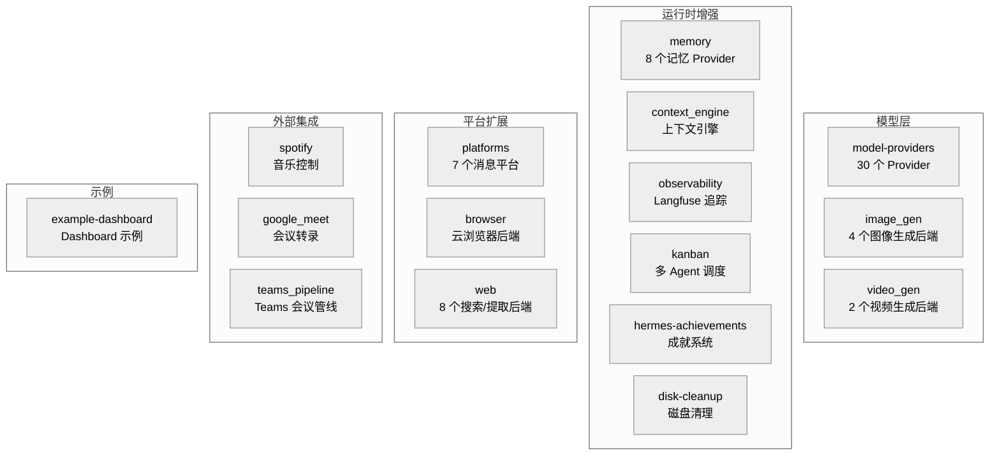

# 08-内置插件：16 个类别的能力扩展

中文 | [English](../en/08-builtin-plugins.md)

> **本章定位**：`plugins/` 目录（122 个 .py，46,477 行，16 个类别）。07 章讲了插件框架的 API 和机制，本章讲这些 API 的实际使用者——hermes-agent 自带的 16 类内置插件。
> **关键目录**：`plugins/memory/`（8 个记忆 Provider，11,647 行）、`plugins/model-providers/`（30 个 Provider，1,199 行）、`plugins/platforms/`（7 个消息平台，15,326 行）。

> **本章基于 hermes-agent commit [`3bace071b`](https://github.com/NousResearch/hermes-agent/commit/3bace071b)（2026-05-24）**

---

## 这些插件解决什么问题？

07 章建立了插件的框架——PluginContext API、17 种钩子、五种 kind 类型。但框架本身不产生价值，使用框架的插件才产生价值。

hermes-agent 自带 16 个类别的内置插件，覆盖五个方向的扩展需求：



**图：16 个内置插件类别按扩展方向分组**

本章不逐个列举所有插件的代码——那是源码导览，不是分析文档。而是按扩展方向讲每组的**共性模式**，然后选典型插件深度拆解。

---

## 使用指南

### 基本用法

```bash
hermes plugins              # 交互式管理插件启用/禁用
hermes plugins list         # 列出所有发现的插件和状态
hermes plugins enable X     # 启用插件
hermes plugins disable X    # 禁用插件
```

### 配置

```yaml
# config.yaml
plugins:
  enabled:
    - observability/langfuse
    - spotify
  disabled: []

# 记忆插件通过独立 config key
memory:
  provider: "honcho"

# 上下文引擎插件
context:
  engine: "compressor"    # 默认内置压缩器

# 图像生成后端选择
image_gen:
  provider: "openai"      # openai / fal / xai / openai-codex
```

### 排错指引

| 问题 | 排查方向 |
|------|---------|
| 插件不加载 | `HERMES_PLUGINS_DEBUG=1` 查看完整发现/加载日志（stderr + agent.log） |
| backend 插件没自动加载 | 确认是 bundled 的（在 `<repo>/plugins/` 下）；非 bundled 需要 opt-in |
| 记忆插件无效果 | 确认 `memory.provider` 设置正确；检查 `is_available()` 是否返回 True |
| Langfuse 追踪不工作 | 检查 `HERMES_LANGFUSE_PUBLIC_KEY` 和 `HERMES_LANGFUSE_SECRET_KEY` 环境变量 |

> 📖 **延伸阅读（官方文档）：**
> - [内置插件](https://hermes-agent.nousresearch.com/docs/user-guide/features/built-in-plugins)
> - [记忆 Provider](https://hermes-agent.nousresearch.com/docs/user-guide/features/memory-providers)
> - [图像生成](https://hermes-agent.nousresearch.com/docs/user-guide/features/image-generation)

---

## 架构与实现

### 模型层插件：给 Agent 换大脑

#### model-providers（30 个 Provider）

`plugins/model-providers/` 包含 30 个子目录（1,199 行），每个实现一个 LLM Provider 的注册逻辑。这是 01 章提到的 `PROVIDER_REGISTRY` 自动扩展机制（`auth.py:459`）的具体实现——每个插件在加载时把自己的 `ProviderConfig` 注册到认证系统。

共性模式：每个 model-provider 插件继承 `ProviderProfile`（描述一个 LLM 提供商的元数据——名称、认证方式、API 端点和模型列表获取方式的数据类）并调用 `register_provider()` 注册。`ProviderProfile` 的核心字段包括 `name`、`aliases`、`env_vars`、`base_url`、`auth_type`、`api_mode`、`models_url` 等。

大多数简单 Provider（以 Alibaba 为例）只需声明字段——13 行代码，声明 `name`、`aliases`、`env_vars`、`base_url` 后调用 `register_provider()` 即可。但复杂 Provider 需要覆写方法：以 DeepSeek 为例（100 行），它覆写了 `build_api_kwargs_extras()` 来处理 thinking mode 的请求格式（`reasoning_effort` + `extra_body.thinking`），因为 DeepSeek V4 的 thinking-mode 需要特殊的 wire shape 才能避免 `reasoning_content must be passed back` 错误。以 OpenRouter 为例（115 行），它覆写了 `build_extra_body()`、`build_api_kwargs_extras()`、`fetch_models()` 来处理 OpenRouter 特有的路由参数。这是"声明式 + 可选扩展"的两层设计——简单场景声明即可，复杂场景覆写方法。

#### image_gen（4 个后端）

图像生成后端通过 `ctx.register_image_gen_provider()` 注册：OpenAI（gpt-image-2）、FAL、xAI、OpenAI-Codex。`image_generate` 工具根据 `image_gen.provider` 配置选择后端——对模型透明。

#### video_gen（2 个后端）

视频生成后端通过 `ctx.register_video_gen_provider()` 注册，模式和 image_gen 相同。

### 运行时增强插件：改变 Agent 的工作方式

#### memory（8 个记忆 Provider，11,647 行）

记忆插件是所有插件中最复杂的——07 章已经讲了 `MemoryProvider` ABC 的 18 个方法、`_ProviderCollector` 独立发现路径、`MemoryManager` 只接受一个外部 provider。本节补充各个具体 provider 的差异。

| Provider | 核心能力 | 行数 |
|----------|---------|------|
| honcho | 跨会话用户建模、辩证 Q&A、语义搜索、持久结论 | 4,817 |
| hindsight | Hindsight 客户端集成 | 1,757 |
| holographic | 全息记忆（向量 + 图谱） | 1,782 |
| mem0 | Mem0 记忆 API | 373 |
| openviking | OpenViking 记忆后端 | 978 |
| retaindb | RetainDB 本地记忆 | 766 |
| supermemory | SuperMemory 集成 | 791 |
| byterover | ByteRover 记忆后端 | 383 |

Honcho 是最复杂的——07 章已经讲过它的开销感知机制（`context_cadence`/`dialectic_cadence` 控制调用频率、线性退避）。其他 provider 更简洁，大多是对外部 API 的薄封装。

选择哪个 provider 取决于你的需求：Honcho 适合深度用户建模（辩证推理提取用户特征），Mem0 适合简单的事实记忆，holographic 适合需要图谱关系的场景。

#### observability（Langfuse 追踪，1,004 行）

`plugins/observability/langfuse/` 实现了对 Langfuse 的集成——追踪 Hermes 的对话、LLM 调用和工具使用。它通过 `post_api_request` 和 `post_tool_call` 钩子采集数据，不侵入 Agent 核心逻辑。

需要的环境变量：`HERMES_LANGFUSE_PUBLIC_KEY`、`HERMES_LANGFUSE_SECRET_KEY`、`HERMES_LANGFUSE_BASE_URL`。可选的 `HERMES_LANGFUSE_SAMPLE_RATE`（0.0-1.0）控制采样率——生产环境不需要追踪每一次调用。

#### kanban（Dashboard 可视化，2,217 行）

`plugins/kanban/` **不是调度器**——它只包含 Kanban 系统的 Web Dashboard UI（`dashboard/` 子目录，FastAPI 路由）。真正的任务调度器在 `gateway/run.py` 的 `_kanban_dispatcher_watcher()`（`run.py:5113`）中，作为 Gateway 内嵌的 asyncio task 运行，每 `dispatch_interval_seconds`（默认 60 秒）调用一次 `kanban_db.dispatch_once()`。配置项：`kanban.dispatch_in_gateway`（默认 true）、`kanban.max_spawn`。详见第 09 章。

#### 其他运行时增强

- **hermes-achievements**（1,217 行）——游戏化成就系统，追踪用户和 Agent 的行为里程碑
- **disk-cleanup**（812 行）——`standalone` 类型插件，通过 `post_tool_call` 和 `on_session_end` 钩子追踪临时文件，提供 `/disk-cleanup` 斜杠命令
- **context_engine**（219 行）——上下文引擎插件的发现入口，实际引擎实现（以 LCM 为例）放在这个目录下

### 平台扩展插件：接入新世界

#### platforms（7 个消息平台，15,326 行）

`plugins/platforms/` 包含 7 个通过插件注册的消息平台适配器——它们不在 `gateway/platforms/` 核心目录下，而是通过 `ctx.register_platform()` 注册。

| 平台 | 行数 | 特点 |
|------|------|------|
| Discord | 6,195 | 语音模式、斜杠命令、角色授权、线程、频道技能绑定 |
| Google Chat | 3,984 | Google Workspace 集成 |
| Teams | 1,200 | Microsoft Teams 集成 |
| IRC | 972 | 传统 IRC 协议 |
| Line | 1,641 | LINE 消息平台 |
| ntfy | 585 | ntfy.sh 推送通知 |
| Simplex | 749 | SimpleX Chat（隐私优先） |

Discord 是最大的——它不只是消息收发，还实现了 Discord 特有的能力（语音通道、斜杠命令注册、角色权限、频道级技能绑定）。其他平台相对简洁，主要是 `BasePlatformAdapter`（05 章定义的平台适配器基类）的标准实现。

#### browser（云浏览器后端，820 行）

通过 `ctx.register_browser_provider()` 注册云浏览器服务，让 Agent 的浏览器工具可以使用远程浏览器而非本地 Playwright。包含三个后端：Browser Use、Browserbase、Firecrawl，通过 `browser.cloud_provider` 配置选择。

#### web（搜索/提取后端，2,641 行，8 个后端）

通过 `ctx.register_web_search_provider()` 注册搜索和网页提取后端。包括 Firecrawl、Exa、Parallel Web、DuckDuckGo 等——`web_search` 和 `web_extract` 工具根据 `web.search_backend` 和 `web.extract_backend` 配置选择后端。

### 外部集成插件：连接真实世界的服务

#### spotify（音乐控制，955 行）

`plugins/spotify/` 注册了 7 个工具（`spotify_playback`、`spotify_devices`、`spotify_queue`、`spotify_search`、`spotify_playlists`、`spotify_albums`、`spotify_library`），通过 Spotify Web API + PKCE OAuth 实现。认证通过 `hermes auth spotify` 完成。

这是 07 章"技能 vs 插件"对比中用过的例子——Spotify 需要一等工具（有 schema、类型化参数），不能用技能的沙箱脚本方式。

#### google_meet（会议转录，3,412 行）

`plugins/google_meet/` 实现了 Google Meet 会议转录集成。插件注册了 5 个工具：`meet_join`（加入会议）、`meet_status`（查询会议状态）、`meet_transcript`（读取转录内容）、`meet_leave`（离开会议）、`meet_say`（在会议中发言——**依赖 v2 realtime 音频模式，默认配置下不可用**）。v1 模式通过 Playwright 爬取 Meet 的 live captions 到 transcript 文件，Agent 通过 `meet_transcript` 工具读取该文件——不是实时注入，而是文件中转模式。

#### teams_pipeline（Teams 会议管线，2,436 行）

面向 Microsoft Teams 会议——但与 google_meet 不同，它只注册 CLI 命令（`hermes teams-pipeline`），不注册 Agent 工具。工作流程：获取会议录制 → 转录 → 辅助 LLM 生成摘要（含关键决策、行动项、风险评估）→ 写入多个 sink（Notion 数据库、Linear team、Teams channel）。LLM 摘要失败时有启发式 fallback。

### 代码组织

```
plugins/
├── model-providers/    — 30 个 LLM Provider 声明（1,199 行）
├── platforms/          — 7 个消息平台适配器（15,326 行）
├── memory/             — 8 个记忆 Provider（11,647 行）
├── web/                — 8 个搜索/提取后端（2,641 行）
├── google_meet/        — Google Meet 转录集成（3,412 行）
├── teams_pipeline/     — Teams 会议管线（2,436 行）
├── kanban/             — Kanban Dashboard UI（2,217 行）
├── hermes-achievements/ — 成就系统（1,217 行）
├── image_gen/          — 4 个图像生成后端（1,179 行）
├── observability/      — Langfuse 追踪（1,004 行）
├── video_gen/          — 2 个视频生成后端（968 行）
├── spotify/            — Spotify 音乐控制（955 行）
├── browser/            — 云浏览器后端（820 行）
├── disk-cleanup/       — 磁盘临时文件清理（812 行）
├── context_engine/     — 上下文引擎插件入口（219 行）
└── example-dashboard/  — Dashboard 插件示例（17 行）
```

### 设计决策

#### 为什么 model-providers 这么简洁？

每个 model-provider 插件平均只有约 40 行——因为大多数只声明元数据（Provider 名称、认证方式、API Key 环境变量），不实现任何逻辑。实际的认证流程、API 调用、Transport 适配全部由核心系统（`auth.py`、`runtime_provider.py`、`agent/transports/`）统一处理。这是"声明式插件"的典型模式——插件只说"我是谁"，框架负责"怎么用"。

#### 为什么平台插件不在 gateway/platforms/ 下？

核心平台（Telegram、Slack 等 16 个）直接在 `gateway/platforms/` 下，不需要插件机制。插件平台（Discord、Teams 等 7 个）走插件路径有两个原因：(1) 它们有额外的 pip 依赖（以 `discord.py` 为例），通过插件的 `pip_dependencies` 字段管理更干净；(2) 它们是后来添加的，插件路径让添加新平台不需要修改核心 gateway 代码。

---

## 与其他章节的关系

| 关联章节 | 关系 |
|---------|------|
| 01 — 基础设施层 | model-providers 通过 `auth.py:459` 自动扩展 PROVIDER_REGISTRY |
| 02 — Agent 核心 | 记忆插件通过 MemoryManager 注入会话流 |
| 05 — 网关层 | 平台插件通过 `ctx.register_platform()` 注册到 Gateway |
| 07 — 插件框架 | 本章所有插件都基于 07 章的 PluginContext API |
| 09 — Kanban 系统 | kanban 插件提供 Dashboard UI；真正的调度器在 `gateway/run.py:_kanban_dispatcher_watcher()` |

---

*本文基于 hermes-agent v0.14.0 源码分析。所有代码引用均经过独立验证。*
