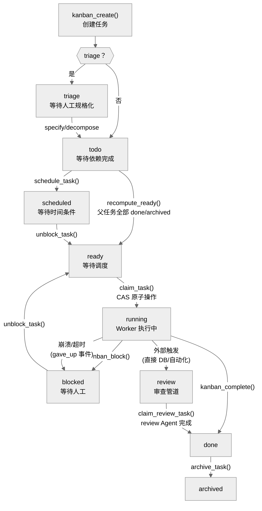

# 09-Kanban 系统：让多个 Agent 协作完成复杂任务

中文 | [English](../en/09-kanban.md)

> **本章定位**：`hermes_cli/kanban_db.py`（8,723 行）+ `hermes_cli/kanban.py`（2,845 行）+ `tools/kanban_tools.py`（1,672 行）+ `gateway/kanban_watchers.py`（1,286 行，dispatcher/notifier 所在的 GatewayKanbanWatchersMixin）+ `plugins/kanban/`（Dashboard 插件）。总计约 14,500 行核心代码。
> **关键类**：`Task`（`kanban_db.py:839`）、`Run`（`kanban_db.py:1005`）、`dispatch_once()`（`kanban_db.py:6932`）、`_default_spawn()`（`kanban_db.py:7662`）。

> **本章基于 hermes-agent v0.18.2（tag [`v2026.7.7.2`](https://github.com/NousResearch/hermes-agent/releases/tag/v2026.7.7.2)，commit `9de9c25f6`，2026-07-07）**

---

## 为什么需要 Kanban？

单个 Agent 能完成的任务有上限——上下文窗口有限、单线程执行、一个模型不擅长所有事。当任务复杂到需要"一个 Agent 负责前端代码、一个负责后端 API、一个负责测试验证"时——这是单个 Agent 的上下文窗口和执行模式无法胜任的，你需要**多个 Agent 各司其职、协调工作**。

hermes-agent 的 Kanban 系统就是为此设计的。它不是简单的任务队列——它是一个完整的项目管理系统，支持任务依赖、自动调度、失败恢复、审查流程和多租户隔离。一个编排者 Agent 把大任务拆成子任务卡片，分配给不同 Profile 的 Worker Agent，Dispatcher 自动在后台调度执行。

这和 02 章讲的 `delegate_task` 子 Agent 有本质区别：`delegate_task` 是同步的（父 Agent 等待子 Agent 完成），Kanban 是异步的（任务创建后立即返回，Worker 在后台独立执行）。`delegate_task` 适合简单的"帮我查个东西"，Kanban 适合"帮我完成一个需要多人协作的项目"。

---

## 使用指南

### 基本用法

```bash
# 初始化看板
hermes kanban init

# 创建任务
hermes kanban create --title "实现用户登录 API" --assignee backend-dev

# 查看看板
hermes kanban list
hermes kanban show t_abc123

# 手动完成/阻塞
hermes kanban complete t_abc123 --summary "API 已实现并通过测试"
hermes kanban block t_abc123 --reason "需要数据库 schema 确认"
```

在对话中，Agent 通过 `kanban_*` 工具操作看板：

```
kanban_create(title="...", assignee="backend-dev", body="任务规格...")
kanban_show(task_id="t_abc123")
kanban_complete(task_id="t_abc123", summary="...", metadata={...})
```

### 配置

```yaml
# config.yaml
kanban:
  dispatch_in_gateway: true              # 在 Gateway 进程内运行调度器（默认）
  dispatch_interval_seconds: 60          # 调度间隔（秒，最小 1.0）
  max_spawn: null                        # 并发 Worker 数上限（null = 不限）
  max_in_progress: null                  # 运行中任务上限（节流慢机器）
  failure_limit: 2                       # 连续失败 N 次后自动阻塞
  dispatch_stale_timeout_seconds: 0      # 检测无心跳的僵死 Worker（0 = 禁用）
```

### 常见场景

**场景一：编排者拆分任务。** 一个配置了 `toolsets: [kanban]` 的 Profile 充当编排者——它用 `kanban_create` 创建子任务，用 `parents=[...]` 设置依赖关系，Dispatcher 自动按依赖顺序调度。编排者不执行工作，只负责拆分和分配。

**场景二：Worker 执行并交接。** Dispatcher 为每个 ready 任务 spawn 一个 Worker Agent（`hermes -p <assignee> chat -q "work kanban task <id>"`）。Worker 调用 `kanban_show` 读取任务上下文（包含前次尝试的 summary、comment 线程、父任务结果），执行工作，然后 `kanban_complete` 交出结果。

**场景三：阻塞与恢复。** Worker 遇到需要人工决策的情况（以"数据库 schema 需要确认"为例），调用 `kanban_block(reason="...")`。任务暂停，等待人类通过 Dashboard 或 CLI `kanban unblock` 恢复。恢复后 Dispatcher 重新 spawn 同一 Profile 的 Worker，新 Worker 能看到完整的 comment 线程了解上下文。

### 排错指引

| 问题 | 排查方向 |
|------|---------|
| 任务一直停在 todo | 检查是否有未完成的父任务（`kanban show` 看 parents）；`recompute_ready()` 只有父任务全部 done 或 archived 才提升 |
| 任务在 ready 但不 spawn | ① `hermes kanban tail <id>` 看是否有 `respawn_guarded` 事件——三种原因：`blocker_auth`（API 限额）、`recent_success`（1h 内已完成）、`active_pr`（24h 内有 PR） ② 确认 assignee 是有效 Profile（`hermes profile list`） ③ 检查 `dispatch_in_gateway: true` |
| Worker 反复失败 | 检查 `consecutive_failures` 和 `last_failure_error`（`kanban show`）；超过 `failure_limit`（默认 2）会自动阻塞（`gave_up` 事件，非 sticky） |
| blocked 后不自动恢复 | 查 `task_events` 最近的事件：如果是 `blocked`（Worker 主动阻塞），需手动 `kanban unblock`；如果是 `gave_up`（自动阻塞），应该在父任务完成后自动恢复 |
| 任务卡在 running | Worker 可能崩溃但 PID 还在——`kanban reclaim` 强制释放；或等 `detect_crashed_workers()` 自动检测 |
| kanban_complete 失败 | 检查 `created_cards` 参数——如果声明的 task_id 不存在或非本 Worker 创建，触发 `HallucinatedCardsError` |
| Worker 输出在哪 | `hermes kanban log <task_id>` 或直接看 `<board-root>/logs/<task_id>.log` |

> 📖 **延伸阅读（官方文档）：**
> - [Kanban 系统](https://hermes-agent.nousresearch.com/docs/user-guide/features/kanban)
> - [委派模式（多 Agent 协作）](https://hermes-agent.nousresearch.com/docs/guides/delegation-patterns)

---

## 架构与实现

### 一个任务的完整旅程



**图：Kanban 任务状态机（9 种状态）**

任务的 9 种状态（`kanban_db.py:102`）：

- **triage** — 待规格化，用 `kanban specify` 或 `kanban decompose` 充实后进入 todo
- **todo** — 有未完成的父任务依赖，`recompute_ready()` 在父任务全部 done 或 archived 时提升到 ready
- **scheduled** — 时间驱动的等待（对应 Cron 调度，见 11 章）。和 `blocked` 的区别：blocked 等人工干预，scheduled 等时间条件。**不被 `recompute_ready()` 处理**——需要外部触发 `unblock_task()`（`kanban_db.py:4827`）退出
- **ready** — 可调度，Dispatcher 下一轮 tick 会尝试 spawn
- **running** — Worker 正在执行
- **blocked** — 分两种（见下方详解）：Worker 主动阻塞（sticky）和 Dispatcher 自动阻塞（非 sticky）
- **review** — 审查管道。**不是 Worker 通过工具触发的**——Worker 应使用 `kanban_block(reason="review-required: ...")` 请求审查。`review` 状态需要通过直接数据库操作或外部自动化设置（代码中没有 Python API 将任务转为 review），Dispatcher 为 review Worker 强制加载 `sdlc-review` 技能
- **done** — 完成
- **archived** — 归档（scratch workspace 会被清理）

**两种 blocked 的关键区别**（`_has_sticky_block()`，`kanban_db.py:3243`）：

| 类型 | 触发方式 | 事件类型 | 恢复方式 |
|------|---------|---------|---------|
| Sticky block | Worker/人工调用 `kanban_block()` | `"blocked"` | 只有 `kanban_unblock` 能恢复 |
| 自动阻塞 | `consecutive_failures ≥ failure_limit` | `"gave_up"` | 非 sticky——`recompute_ready()` 在父任务完成后**自动恢复** |

这个区别直接影响诊断：如果任务 blocked 后父任务完成却没自动变 ready，查 `task_events` 里最近的事件是 `blocked`（sticky，需手动 unblock）还是 `gave_up`（非 sticky，应该自动恢复，如果没恢复说明有其他问题）。

### Dispatcher：调度引擎

Dispatcher 是 Kanban 系统的心脏，嵌入在 Gateway 进程内作为 asyncio task 运行——v0.17 随 god-file 分解迁入 `gateway/kanban_watchers.py`（`_kanban_dispatcher_watcher()`，`kanban_watchers.py:744`，GatewayKanbanWatchersMixin 的一部分，见 05 章）。每隔 `dispatch_interval_seconds`（默认 60 秒）执行一次 `dispatch_once()`。

**每一轮 dispatch_once()（`kanban_db.py:6932`）做七件事：**

1. **收割僵尸子进程**（Unix only，`os.waitpid(-1, WNOHANG)`）——清理已退出但未被 wait 的 Worker 进程
2. **释放过期 claim**（`release_stale_claims()`）——claim TTL 过期的任务回到 ready
3. **检测无心跳的 Worker**（`detect_stale_running()`）——长时间未发心跳的任务回到 ready
4. **检测崩溃的 Worker**（`detect_crashed_workers()`）——PID 已不存在的任务自动阻塞
5. **超时强制终止**（`enforce_max_runtime()`）——超过 `max_runtime_seconds` 的 Worker 收到 SIGTERM
6. **提升就绪任务**（`recompute_ready()`）——父任务全部 done 或 archived 时，todo → ready
7. **调度 ready 任务**——按 `priority DESC, created_at ASC` 排序，对每个 ready 任务执行五步管道：
   - ① **Profile 存在性检查**——assignee 不是真实 Hermes Profile 的任务跳过（`skipped_nonspawnable`），支持外部 Agent（以 Claude Code 为例）通过 `claim_task()` 手动认领
   - ② **Respawn Guard**（`check_respawn_guard()`，`kanban_db.py:6758`）——三条防抖规则，**任何一条触发都跳过本轮 spawn**，写入 `respawn_guarded` 事件：
     - `blocker_auth`：`last_failure_error` 包含 `quota`/`rate_limit`/`429`/`403`/`auth` 等关键词——API 限额/认证问题不应反复重试
     - `recent_success`：1 小时内（`_RESPAWN_GUARD_SUCCESS_WINDOW = 3600`）有 completed run——防止已完成任务被重复 spawn
     - `active_pr`：24 小时内（`_RESPAWN_GUARD_PR_WINDOW = 86400`）comment 中出现 GitHub PR URL——防止重复创建 PR
   - ③ **claim_task()**——CAS 原子操作（ready → running）
   - ④ **resolve_workspace()**——根据 `workspace_kind` 创建临时目录/持久目录/git worktree
   - ⑤ **_default_spawn()**——fork Worker 子进程

第 7 步还有一个 **review lane**：status=review 的任务也会被调度，Dispatcher 为 review Worker 强制加载 `sdlc-review` 技能。

**与 Dispatcher 并行的 Notifier**：Gateway 还运行 `_kanban_notifier_watcher()`（`kanban_watchers.py:115`），每 5 秒轮询 `kanban_notify_subs` 表，把任务的 terminal 事件（completed/blocked/crashed 等）通过平台 adapter 推送给原始请求者（以 Telegram/Slack 为例）。这是 human-in-the-loop 闭环的关键——Worker 完成后怎么通知用户？Dashboard 的 WebSocket 用于浏览器，Notifier 用于消息平台。

**Spawn Worker 的具体命令**（`_default_spawn()`，`kanban_db.py:7662`）：

```bash
hermes -p <assignee> --accept-hooks --skills kanban-worker [--skills ...] [-m model] chat -q "work kanban task <task_id>"
```

Dispatcher 为 Worker 注入完整的环境变量（`kanban_db.py:7702` 起，`HERMES_HOME` 在 :7702）：

| 环境变量 | 用途 |
|---------|------|
| `HERMES_KANBAN_TASK` | 任务 ID（Worker 模式的标识） |
| `HERMES_KANBAN_WORKSPACE` | 工作目录 |
| `HERMES_KANBAN_RUN_ID` | 当前 run 编号 |
| `HERMES_KANBAN_CLAIM_LOCK` | claim 标识 |
| `HERMES_KANBAN_DB` | 数据库路径 |
| `HERMES_KANBAN_BOARD` | Board slug |
| `HERMES_KANBAN_WORKSPACES_ROOT` | workspace 基目录 |
| `HERMES_KANBAN_BRANCH` | git 分支名（仅 worktree 类型） |
| `HERMES_PROFILE` | Worker 的 Profile 名 |
| `HERMES_HOME` | Profile-scoped 配置目录 |
| `HERMES_TENANT` | 多租户命名空间 |
| `TERMINAL_TIMEOUT` | 从 `max_runtime_seconds - 30s` 计算的终端超时 |

**Worker 日志**：Worker 的 stdout/stderr 写入 `<board-root>/logs/<task_id>.log`（append 模式，re-run 不覆盖）。默认 2MiB 轮转，保留 1 个备份。通过 `hermes kanban log <task_id>` 查看。

### Task 数据结构

`Task`（`kanban_db.py:839` 起）是一个 **35 个字段**的 dataclass（AST 数注解字段；v0.14 时 30 个）。核心字段：

| 字段 | 用途 |
|------|------|
| `id` | 唯一标识（`t_<hex>` 格式） |
| `title` / `body` | 任务标题和规格描述 |
| `assignee` | 指定执行的 Profile 名 |
| `status` | 9 种状态之一 |
| `priority` | 调度优先级（越大越优先） |
| `workspace_kind` | `scratch`（临时目录，归档时清理）/ `dir`（持久目录）/ `worktree`（git worktree） |
| `claim_lock` / `claim_expires` | CAS 锁和 TTL（默认 15 分钟） |
| `consecutive_failures` | 连续失败计数（spawn 失败/超时/崩溃统一计数） |
| `worker_pid` | Worker 进程 PID（用于崩溃检测） |
| `current_run_id` | 指向当前 `task_runs` 行 |
| `skills` | 强制加载的技能列表 |
| `model_override` | 单任务 LLM 模型覆盖 |

v0.16-v0.18 新增的字段组（30→35 的增量方向）：

| 新字段 | 用途 |
|--------|------|
| `goal_mode` / `goal_max_turns`（`:900-903`） | Worker 以 Ralph 目标循环运行：每轮后 judge 模型评估"目标达成了吗"，未达成就继续（对接 `hermes_cli/goals.py`，第 01 章） |
| `block_kind` / `block_recurrences`（`:913-917`） | 类型化阻塞 + 解锁循环熔断（见下"两种 blocked"的升级版） |
| `session_id` | 任务创建自哪个 agent 会话——客户端可按会话渲染专属看板 |
| `project_id` | 多项目隔离，子任务继承 |
| `idempotency_key` | 幂等创建——重复提交同 key 不产生重复任务 |
| `max_retries` | 任务级覆盖调度器全局 `failure_limit` |
| `result` | 结构化结果载荷 |
| `workflow_template_id` / `current_step_key` | 模板化工作流的位置指针 |

**类型化阻塞**值得展开（`VALID_BLOCK_KINDS`，`kanban_db.py:125`）：`blocked` 不再是一个笼统状态，而是分四类——`dependency`（等别的任务）、`needs_input`（等人）、`capability`（缺能力，等人）、`transient`（瞬时，可自动重试）。前两类"真阻塞"配了**解锁循环熔断**：cron 反复解锁、Worker 又为同一原因重新阻塞，重复超过 `BLOCK_RECURRENCE_LIMIT = 2`（`:134`）后不再送回 `blocked` 而是升到 `triage`——强制人类决策，打断"解锁↔再阻塞"的死循环（注释明说这是对 cron 无脑解锁的防御）。

另有两处调度语义变化：**per-profile 并发上限**——`dispatch_once()` 新增 `max_in_progress_per_profile`（`:6944`），同一 Profile 超限的任务标记 `skipped_per_profile_capped` 跳过本轮；**workspace 继承**——子任务默认继承父任务的 workspace（`kanban_tools.py:859-898`，v0.14 时默认各开 scratch），协作链上的 Worker 天然共享工作目录。数据库也从 6 张表扩到 **7 张**：新增 `task_attachments` 附件表（建表 `kanban_db.py:1239`）。

### Run：每次尝试的记录

每次 Worker 被 dispatch 执行一个任务，都会创建一条 `Run` 记录（`kanban_db.py:1005` 起，16 个字段）。Run 的 `outcome` 字段记录结果：`completed`（成功）、`blocked`（主动阻塞）、`timed_out`（超时）、`crashed`（崩溃）、`spawn_failed`（spawn 失败）、`reclaimed`（被强制释放）。

Run 的 `summary`（1-3 句话描述做了什么）和 `metadata`（结构化数据，如 `changed_files`、`tests_run`）是**跨 run 上下文传递的核心机制**——下一个 Worker 通过 `build_worker_context()` 看到前次 run 的 summary 和 metadata，能接续工作。

DB 侧函数是 `complete_task()`（`kanban_db.py:3978`；LLM 侧的 `kanban_complete` 工具最终调用它），它的完整执行链不只是"状态变 done"：

1. **created_cards 幻觉验证**——如果 Worker 在 `created_cards` 参数中声明创建了某些 task_id，系统验证这些 ID 真实存在且由该 Worker 创建。虚假引用触发 `HallucinatedCardsError`，**阻止完成**
2. **DB 事务**（原子 `write_txn`）——status=done、关闭 run
3. **散文幻觉扫描**——扫描 summary 和 result 中的 `t_<hex>` 引用，不存在的发出 `suspected_hallucinated_references` 事件（advisory，不阻塞）
4. **重置失败计数 + 提升就绪任务**——`_clear_failure_counter()`（重置 `consecutive_failures`）和 `recompute_ready()`（触发子任务 todo → ready）都在**主事务之外、散文扫描之后**执行（`_clear_failure_counter` 定义在 `kanban_db.py:6736`，`recompute_ready` 在 `:3281`），所以完成本身已经先 durable
5. **Workspace 清理**——scratch 类型的工作目录 + tmux session 被清理

### 数据库：SQLite + WAL

Kanban 数据存储在 SQLite 数据库中，使用 WAL 模式允许 Dispatcher 写入时 Dashboard 仍可读取。`default` board 的数据库在 `~/.hermes/kanban.db`（向后兼容，不在 boards 子目录下），其他 board 在 `~/.hermes/kanban/boards/<slug>/kanban.db`。数据库路径解析优先级（`current_board_path()` 等解析函数在 `kanban_db.py:404` 附近）：`HERMES_KANBAN_DB` 环境变量（最高，直接 pin 路径）> `board=` 参数 > `HERMES_KANBAN_BOARD` 环境变量 > `~/.hermes/kanban/current` 文本文件（由 `hermes kanban boards switch` 写入，内容为 board slug；`current_board_path()` 返回 `kanban_home()/"kanban"/"current"`，而 `kanban_home()` 解析到 `<root>`=`~/.hermes`，故只有一层 `kanban`）。

6 张表：

| 表 | 用途 |
|-----|------|
| `tasks` | 任务主表 |
| `task_runs` | 每次执行尝试的历史 |
| `task_links` | 父→子依赖关系（复合主键：parent_id, child_id）|
| `task_comments` | 评论线程（作者从 `HERMES_PROFILE` 取） |
| `task_events` | 追加式审计日志（Dashboard WebSocket 尾随此表） |
| `kanban_notify_subs` | 通知订阅 |

### Worker 上下文：build_worker_context()

当 Worker 调用 `kanban_show()` 时，`build_worker_context()`（`kanban_db.py:7898`）构建一个格式化的文本块，包含：

- 任务的 title、body、assignee、status
- 父任务的最新 summary（Worker 能看到上游任务的结果）
- 前 N 次 Run 的 summary、metadata、error（最多 10 次，`_CTX_MAX_PRIOR_ATTEMPTS`）
- 评论线程（最多 30 条，`_CTX_MAX_COMMENTS`）
- 各字段有大小上限（body 8KB、summary/metadata 4KB、comment 2KB）防止上下文爆炸

这是 Kanban 异步协作的关键设计——Worker 不需要和编排者对话，所有上下文通过数据库传递。

### 工具权限：Worker vs 编排者

`kanban_tools.py` 通过两个检查函数区分 Worker 和编排者的权限：

- **Worker 模式**（`_check_kanban_mode()`）：`HERMES_KANBAN_TASK` 环境变量存在（Dispatcher spawn 的）。Worker 只能操作自己的任务——`_enforce_worker_task_ownership()` 确保 Worker 不能篡改其他任务
- **编排者模式**（`_check_kanban_orchestrator_mode()`）：Profile 的 `toolsets` 包含 `kanban`，但没有 `HERMES_KANBAN_TASK`。编排者能用 `kanban_list`（Worker 不能）和 `kanban_unblock`

| 工具 | check_fn | Worker | 编排者 | 备注 |
|------|---------|--------|--------|------|
| `kanban_show` | kanban_mode | ✅（任意任务） | ✅（任意任务） | 只读，无 ownership 限制（`_handle_show` 不调 `_enforce_worker_task_ownership`） |
| `kanban_complete` | kanban_mode | ✅ | ✅ | Worker 有 ownership 限制 |
| `kanban_block` | kanban_mode | ✅ | ✅ | Worker 有 ownership 限制 |
| `kanban_heartbeat` | kanban_mode | ✅ | ✅ | Worker 有 ownership 限制 |
| `kanban_comment` | kanban_mode | ✅ | ✅ | |
| `kanban_create` | kanban_mode | ✅（创建子任务） | ✅ | |
| `kanban_link` | kanban_mode | ✅ | ✅ | 添加父→子依赖 |
| `kanban_list` | orchestrator_only | ❌ | ✅ | |
| `kanban_unblock` | orchestrator_only | ❌ | ✅ | |

`kanban_mode` 对 Worker 和编排者都返回 True，但 Worker 受 `_enforce_worker_task_ownership()` 限制——只能操作自己的任务（`HERMES_KANBAN_TASK`）。编排者（没有 `HERMES_KANBAN_TASK`）不受 ownership 限制。`orchestrator_only` 则完全排除 Worker。

### 技能引导

Dispatcher 为每个 Worker 自动加载 `kanban-worker` 技能（`skills/devops/kanban-worker/SKILL.md`），引导 Worker 正确使用 workspace、写好 summary、处理心跳、避免常见陷阱。编排者使用 `kanban-orchestrator` 技能（`skills/devops/kanban-orchestrator/SKILL.md`），引导分解策略和"不要自己动手"的原则。

Review 任务的 Worker 还会额外加载 `sdlc-review` 技能。

### Dashboard 插件

`plugins/kanban/` 提供 Web Dashboard UI（08 章已经讲过它不是调度器）。Dashboard 通过 FastAPI 路由挂载在 `/api/plugins/kanban/`，使用 session token 认证。核心能力：

- 看板视图（8 列：triage → done，archived 可选显示）
- WebSocket 实时更新（尾随 `task_events` 表）
- 任务详情抽屉（runs 历史、评论线程、事件日志）
- WAL 模式允许 Dashboard 在 Dispatcher 写入时并发读取

### 代码组织

```
hermes_cli/kanban_db.py       — 核心数据库层（Task/Run/Comment/Event + dispatch_once）（6,579 行）
hermes_cli/kanban.py          — CLI 命令入口（init/create/list/show/complete/block 等 25+ 子命令）（2,845 行）
hermes_cli/kanban_diagnostics.py — 诊断工具（1,058 行）
hermes_cli/kanban_decompose.py — 任务分解工具（477 行）
hermes_cli/kanban_swarm.py    — Swarm 编排辅助（279 行）
hermes_cli/kanban_specify.py  — 任务规格化工具（271 行）
tools/kanban_tools.py         — Agent 工具接口（9 个工具）（1,672 行）
gateway/run.py                — Dispatcher watcher（嵌入在 Gateway 的 asyncio task）
plugins/kanban/               — Dashboard 插件（Web UI + FastAPI 路由）
skills/devops/kanban-worker/  — Worker 行为指南技能
skills/devops/kanban-orchestrator/ — 编排者分解策略技能
```

### 设计决策

#### 为什么嵌入 Gateway 而不是独立守护进程？

Dispatcher 嵌入 Gateway 进程（`dispatch_in_gateway: true`）而不是独立运行，是因为 Gateway 已经是一个长期运行的进程——不需要用户额外管理一个守护进程。但如果你不用 Gateway（以纯 CLI 场景为例），可以用 `hermes kanban daemon` 或 systemd service（`plugins/kanban/systemd/hermes-kanban-dispatcher.service`）独立运行。

#### 为什么用 SQLite 而不是 Redis/PostgreSQL？

零依赖。Kanban 系统的用户是个人开发者和小团队——不需要分布式数据库。SQLite + WAL 模式在单机上提供了足够的并发能力（一个 Dispatcher 写 + Dashboard 读 + Worker 读写），且数据库文件可以直接复制备份。

#### CAS 和 claim TTL 解决了什么问题？

`claim_task()` 使用 CAS（Compare-And-Swap）原子操作确保同一任务不会被两个 Dispatcher tick 同时认领。`claim_expires`（默认 15 分钟）是安全网——如果 Worker 进程崩溃且 PID 检测失败（以容器化环境为例），TTL 过期后任务自动释放回 ready。

---

## 与其他章节的关系

| 关联章节 | 关系 |
|---------|------|
| 01 — 基础设施层 | `hermes_cli/kanban.py` 是 CLI 子命令 |
| 02 — Agent 核心 | Worker 是完整的 `AIAgent` 实例，有独立的对话循环 |
| 04 — 技能系统 | `kanban-worker` / `kanban-orchestrator` 技能引导 Agent 行为 |
| 05 — 网关层 | Dispatcher 嵌入 Gateway 的 asyncio 事件循环 |
| 08 — 内置插件 | Dashboard 是插件，提供 Web UI |

---

*本文基于 hermes-agent v0.18.2 源码分析。所有代码引用均经过独立验证。*
