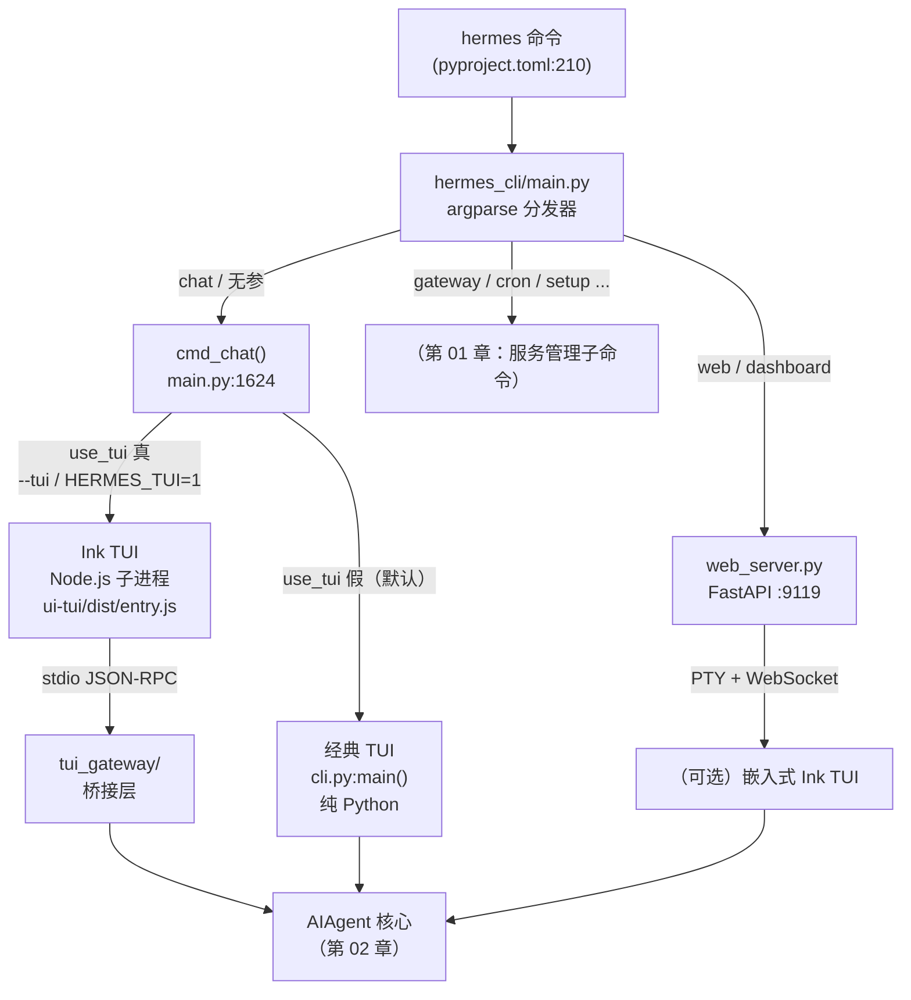
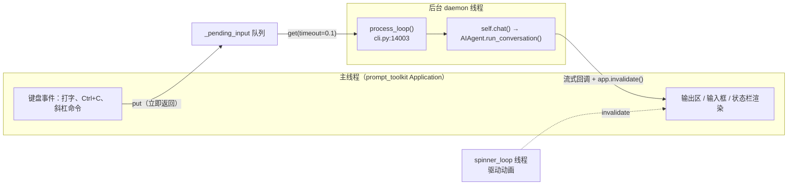
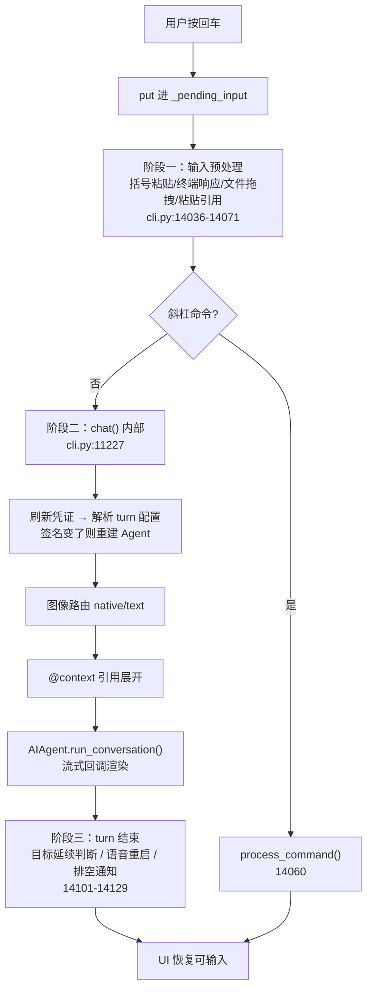
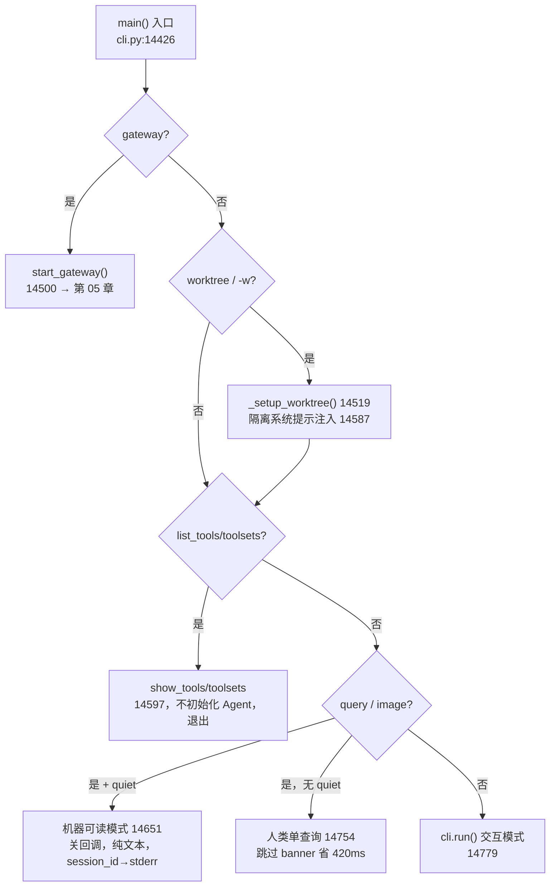
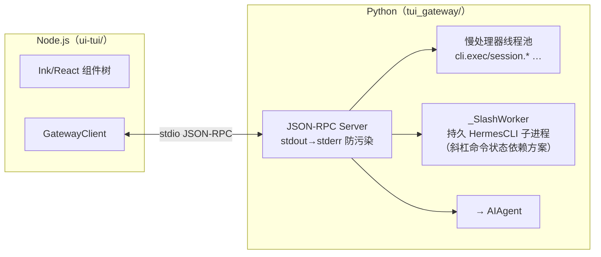

# 10-同一个 Agent，三种面孔与六种跑法

中文 | [English](../en/10-interfaces-and-run-modes.md)

> **本章定位**：交互界面层与运行模式分发——经典 prompt_toolkit TUI（`cli.py`，14,785 行）、现代 Ink TUI（`ui-tui/` Node.js + `tui_gateway/` 8 文件桥接层）、Web Dashboard（`hermes_cli/web_server.py`，4,671 行 + `web/` Vite/React SPA）。
> **关键类/函数**：`main()`（`cli.py:14426`，运行模式分发）、`HermesCLI.run()`（`cli.py:12092`）、`process_loop()`（`cli.py:14003`，REPL 线程模型）、`_render_final_assistant_content()`（`cli.py:1858`，渲染管线）、`SkinConfig`（`hermes_cli/skin_engine.py:129`）、`cmd_chat()`（`hermes_cli/main.py:1624`，界面分流）。

> **本章基于 hermes-agent commit [`3bace071b`](https://github.com/NousResearch/hermes-agent/commit/3bace071b)（2026-05-24）**

---

## 你敲下 `hermes`，然后呢？

你在终端敲下 `hermes` 回车，半秒后一个金色的 caduceus banner 浮现，下面是一个固定在屏幕底部的输入框。你打字、回车，上方滚出 Agent 的回复——markdown 被渲染成漂亮的排版，工具调用带着 emoji 一行行冒出来，一个 kawaii 表情在思考时卖萌。这看起来就是个普通的聊天 REPL。但这半秒里发生的事，决定了这一章存在的理由：`hermes` 这个命令先经过一个 13,847 行的 argparse 分发器，判断你想要的是经典界面、现代 Ink 界面、还是 Web 仪表盘；选定经典界面后，它没有用最朴素的「读一行→跑 Agent→打印→再读一行」阻塞循环，而是把渲染和输入交给一个事件循环占据主线程，把 Agent 扔进后台线程，两者用一个队列通信——**正因为如此，你才能在 Agent 还在跑的时候继续打字、甚至打断它**。而当你换个场景——想在 shell 脚本里一次性问一句、把答案管道给 `jq`——同一个 `cli.py` 又会切换成一套完全不打印 banner、不渲染、只吐纯文本的「机器可读」模式。

这一章回答几个问题：**`hermes` 这一个命令凭什么能变出三种界面？为什么交互界面要用「主线程跑 UI、后台线程跑 Agent」这种看似复杂的结构？六种运行模式分别在什么场景用、它们的本质区别是什么？终端里那些 markdown、diff、中文表格、spinner、皮肤是怎么渲染出来的，能不能配？** 读完你应该能：按场景选对运行模式、把 Hermes 嵌进自动化脚本、定制自己的皮肤、并在界面卡住时知道该查哪里。

> **边界说明**：第 01 章讲的是 `hermes_cli` 的子命令体系（`gateway`/`setup`/`cron`/`config` 等服务管理命令）和配置/认证基础设施；本章只接手「`hermes` 进入聊天后」的部分——界面分流、交互循环、渲染。第 05 章讲 gateway 如何把消息异步投递到 Telegram/Discord 等平台；本章讲的是**本地终端的同步渲染**。批量运行（`batch_runner.py`）和 SWE 评测（`mini_swe_runner.py`）这两种「非交互的大规模跑法」留给第 12 章。

---

## 使用指南

### 基本用法：六种跑法

Hermes 的入口是一个命令 `hermes`，但它的行为由参数决定。下面是日常会用到的几种：

```bash
# 1. 交互模式（默认）——进入经典 prompt_toolkit TUI
hermes
hermes chat                       # 等价

# 2. 现代 Ink TUI（推荐的交互方式）——模态浮层、鼠标选择、非阻塞输入
hermes --tui
export HERMES_TUI=1 && hermes      # 用环境变量让 --tui 成为默认

# 3. 单查询模式——执行一次就退出，适合快速一问一答
hermes -q "用一句话解释 CAP 定理"
hermes chat -q "open a draft PR"

# 4. 机器可读模式——给脚本/管道用，不打印 banner、不渲染、只吐纯文本
hermes -q "列出当前目录的 Python 文件" --quiet | jq -R .
#   （session_id 会打到 stderr，stdout 只有最终回复，保持干净）

# 5. worktree 隔离模式——在独立 git worktree 里跑，多 Agent 并行不打架
hermes -w
hermes -w -q "Fix issue #123"

# 6. 恢复历史会话
hermes --continue                 # 恢复最近一次会话（-c）
hermes --resume 20260225_143052_a1b2c3   # 按 ID 恢复（-r）
hermes -c "refactoring auth"      # 按标题恢复
```

还有两个常用辅助：

```bash
hermes -s hermes-agent-dev,github-auth   # 启动时预加载技能
hermes --list-tools                       # 列出工具后退出（脚本里探测可用工具）
```

> **经典 CLI vs 现代 TUI 该用哪个？** 官方推荐现代 Ink TUI（`hermes --tui`）作为日常交互方式——它有模态浮层（模型选择器、会话选择器、审批框都是浮窗而非内联流）、鼠标拖选、alternate-screen 无闪烁渲染、退出后不留滚屏垃圾。经典 CLI 是默认值，启动最快（纯 Python，无 Node 子进程），脚本和管道场景下也是它在工作。两者共享同一套会话（都写 `~/.hermes/state.db`），可以在一个界面开始、在另一个界面 `--continue`。

### 配置

界面与渲染相关的配置都在 `config.yaml` 的 `display:` 段下。最常用的几个：

```yaml
# ~/.hermes/config.yaml
display:
  skin: default              # 皮肤：default/ares/mono/slate/daylight/poseidon/sisyphus/charizard/warm-lightmode 或自定义
  personality: helpful       # 性格（影响语气，与皮肤正交）
  busy_input_mode: interrupt # Agent 忙时按回车：interrupt（立即打断）/ queue（排队等下轮）/ steer（注入当前轮不打断）
  tool_preview_length: 0     # 工具预览行最多显示几个字符（0=不限）
  tui_status_indicator: kaomoji   # Ink TUI 状态栏忙碌指示器：kaomoji/emoji/unicode/ascii
  details_mode: collapsed    # Ink TUI 折叠面板全局默认：hidden/collapsed/expanded
```

三个值得专门说的：

- **`busy_input_mode`**——决定「Agent 还在干活时你按回车」会发生什么。`interrupt`（默认）立即打断当前操作处理你的新消息；`queue` 把消息悄悄排队、等这一轮结束再发；`steer` 把消息在下一次工具调用后注入当前运行（不打断、不开新轮），适合「顺便也看下测试」这种中途追加指示（`cli.md` 文档；`steer` 在 Agent 没启动或带图片时自动回退到 `queue`）。
- **`tui_status_indicator`**——Ink TUI 状态栏那个忙碌动画，默认每 2.5 秒轮换一组 kawaii 脸。可以换成 emoji/unicode/ascii，也可以运行时 `/indicator emoji`。
- **`mouse_tracking`**（Ink TUI）——`off`/`wheel`/`buttons`/`all`。在 tmux 里建议设 `wheel`，避免 hover 事件让 tmux 在输入行刷 "No image in clipboard"。

皮肤可以运行时切换并实时重绘：`/skin ares`、`/personality pirate`。运行时切换是会话级的；要永久生效写进 `config.yaml`。

### 常见场景

**场景 1：把 Hermes 嵌进 shell 脚本** —— 用 `--quiet` 拿到干净的机器可读输出。

```bash
#!/bin/bash
# stdout 只有最终回复；session_id、错误都走 stderr，不污染管道
ANSWER=$(hermes -q "总结 /var/log/syslog 今天的报错" --quiet 2>/dev/null)
echo "$ANSWER" | tee report.txt
```

预期：没有 banner、没有 spinner、没有「Hermes」回复框，stdout 就是纯文本答案；退出码非 0 表示这一轮失败（`cli.py:14750`）。

**场景 2：多个 Agent 并行改同一个 repo** —— 用 `-w` 让每个 Agent 在独立 git worktree 分支里工作，互不干扰。

```bash
hermes -w -q "把 auth 模块迁移到新 API" &
hermes -w -q "给 payment 模块补单测" &
```

预期：每个实例创建一个独立 worktree 分支，改动隔离；系统提示里会注入一段说明告诉 Agent 它在隔离环境、记得提交并开 PR（`cli.py:14587`）。崩溃残留的 worktree 会在下次启动时被自动清理（`cli.py:14518 _prune_stale_worktrees`）。

**场景 3：从远程 SSH 断线后接回会话** —— Ink TUI 的自动恢复。

```bash
export HERMES_TUI_RESUME=1     # 自动接回最近一次 TUI 会话
hermes --tui
```

预期：SSH 断线重连后，`hermes --tui` 直接接回上次的会话状态，而不是开新会话。

### 排错指引

| 现象 | 原因 | 解决 |
|------|------|------|
| `hermes --tui` 起不来，回退到经典界面 | 没装 Node ≥20 / TUI bundle 缺失 / 不是 TTY | 跑 `hermes doctor` 查 Node；Hermes 会打印诊断并自动回退而非卡死（`tui.md`） |
| `Shift+Enter` 不换行反而发送 | 多数终端不区分 `Enter`/`Shift+Enter` 的字节序列 | 用 `Alt+Enter` 或 `Ctrl+J`（到处都管用）；或开启终端的 Kitty 键盘协议 |
| `--quiet` 还是打印了一堆东西？ | 混淆了两个「quiet」概念（见下方注解） | 机器可读要的是 `--quiet`/`-Q`；「默认 quiet 模式」是另一回事，指默认就抑制冗余工具日志 |
| 中文/日文表格在终端里错位 | 模型输出的表格按字符数而非显示宽度对齐 | Hermes 已内置 CJK 宽度纠正（`agent/markdown_tables.py`），若仍错位多半是终端字体等宽问题 |
| 窗口 resize 后输出错乱/旧内容重新刷一遍 | 终端重绘后需要重放历史 | 这是正常的 resize 恢复（`cli.py:1949 _replay_output_history`），重放最近 200 行 |
| Windows 上 `Alt+Enter` 不换行 | 被 Windows Terminal 截获（切全屏） | 用 `Ctrl+Enter`（送达为 `Ctrl+J`）或直接 `Ctrl+J` |
| 手动 `export HERMES_TUI_RESUME=xxx` 却没生效 | Python 每次启动主动清除该变量（防 shell 遗留导致 TUI 尝试恢复不存在的会话） | 用 `--resume <id>` 显式指定；自动恢复请按 `tui.md` 的方式设置 |
| Ink TUI 突然退出，只看到一堆 Node 堆栈 | TUI 子进程非零退出时 Python 层只透传退出码、不加诊断 | 看 `~/.hermes/logs/tui_gateway_crash.log`（panic hook 记录的完整栈）+ TUI Activity 面板的 `[gateway-crash]` 摘要 |

> ⚠️ **「quiet」的两个含义——最容易踩的坑**：`cli.md` 文档里有一节叫「Quiet Mode」，说"CLI 默认就运行在 quiet 模式"，指的是**抑制工具的冗余日志、启用 kawaii 动画反馈**（相对于 `--verbose`）。但命令行的 `--quiet`/`-Q` 标志完全是另一回事——它是**机器可读模式**，连 banner、spinner、流式渲染回调全部关掉，只吐最终回复（`cli.py:14651`）。两者同名但不同层：一个是「日志安静」，一个是「输出干净到能喂给管道」。

> 📖 **延伸阅读（官方文档）：**
> - [TUI（现代界面）](https://hermes-agent.nousresearch.com/docs/user-guide/tui)
> - [CLI Interface（经典界面：键位/斜杠命令/中断）](https://hermes-agent.nousresearch.com/docs/user-guide/cli)
> - [Skins & Themes（皮肤定制）](https://hermes-agent.nousresearch.com/docs/user-guide/features/skins)
> - [Slash Commands Reference](https://hermes-agent.nousresearch.com/docs/reference/slash-commands)

---

## 架构与实现

### 一个命令，三种面孔：界面是怎么分流的

为什么 `hermes`、`hermes --tui`、`hermes web` 能进入三个看起来完全不同的界面，背后却是同一个 Agent 核心？关键在于：**界面只是 Agent 的「前端」，分流发生在入口处，而不是在 Agent 内部**。

`hermes` 命令在 `pyproject.toml:210` 注册到 `hermes_cli.main:main`——一个 13,847 行的 argparse 分发器（第 01 章详述了它的子命令体系）。当你跑 `hermes` 或 `hermes chat` 时，控制权进入 `cmd_chat()`（`hermes_cli/main.py:1624`）。它做的第一件事就是决定走哪条界面路径（`main.py:1626`）：

```python
def cmd_chat(args):
    use_tui = getattr(args, "tui", False) or os.environ.get("HERMES_TUI") == "1"
```

- **`use_tui` 为真** → 启动现代 Ink TUI。它把一堆运行参数塞进 `HERMES_TUI_*` 环境变量（`main.py:1477-1565`，model/provider/toolsets/skills/resume 等），构建/复用 `ui-tui/dist/entry.js`（`main.py:1123`），然后 spawn 一个 Node.js 子进程跑它。
- **`use_tui` 为假** → `from cli import main as cli_main`（`main.py:1778`），直接调用经典界面的 `cli.py:main()`，纯 Python 函数调用，无子进程。

而 `hermes web` / `hermes dashboard` 是另一条子命令路径，起的是 FastAPI 服务（`hermes_cli/web_server.py`）。

`cmd_chat()` 在分流之前还做了几件预处理，它们解释了一些入口行为：

- **`--continue`/`-c` 的双来源解析**（`main.py:1628-1651`）：`-c` 带字符串时按标题/ID 查会话；不带参数时先按当前界面来源查（`source="tui"` 或 `"cli"`），**TUI 模式查不到会回退去查 CLI 会话**（`main.py:1644`）——这样你用经典 CLI 开的会话也能被 `hermes --tui -c` 接上。
- **首次运行守卫**（`main.py:1686-1715`）：没有配置任何 provider 时拦截并提示 `hermes setup`；在非交互 TTY（管道/CI）里直接 `sys.exit(1)` 而非卡在交互提示。
- **`--yolo`**：设 `HERMES_YOLO_MODE=1`，绕过所有危险命令审批（状态栏和 banner 会显眼地打 `⚠ YOLO` 警告，让你不会忘了自己在自动批准模式）。

**图：一个 `hermes` 命令如何分流到三种界面——分流发生在入口处，三者最终都连到同一个 AIAgent**



这个设计的代价是：经典 TUI 和 Ink TUI 是两套独立的渲染实现（Python 一套、TypeScript/React 一套），很多界面逻辑要维护两遍。但收益是各取所长——经典 TUI 启动最快、零额外依赖，适合脚本和「就想快点问一句」；Ink TUI UI 能力强，适合长时间交互。共享会话存储（`~/.hermes/state.db`）让两者无缝衔接，缓解了「两套实现」带来的割裂感。

### 经典 TUI 为什么要用「主线程跑 UI、后台跑 Agent」

最朴素的聊天 REPL 是这样的：读一行 → 跑 Agent → 打印结果 → 再读一行。一个 `while True` 循环就够了。但 Hermes 偏不这么做。为什么？

因为朴素循环有个致命缺陷：**Agent 跑的时候，整个程序是阻塞的**。你不能在它思考时继续打字、不能预先排队下一条消息、按 `Ctrl+C` 也只能等当前 `input()` 返回才生效。对一个动辄跑几十秒、几分钟的 Agent 来说，这种「打字就得等」的体验无法接受。

这和所有 GUI 框架的解法是同一个套路：**把渲染（主线程）和耗时计算（后台线程）分离**——Electron、Qt、Swing 都这么干，Hermes 只是在终端里又实现了一遍。具体拆成两个线程：

- **主线程**：被 `prompt_toolkit` 的 `Application` 事件循环占据，负责渲染输出区、底部输入框、状态栏，以及响应键盘事件。`run()`（`cli.py:12092`）搭建这个 Application。
- **后台 daemon 线程**：跑 `process_loop()`（`cli.py:14003`），它不停地从一个队列 `self._pending_input` 里取用户输入，取到就跑 Agent。

两者通过队列通信。你在输入框打字回车，主线程只是把内容 `put` 进队列就立刻返回——UI 一刻不卡。后台线程在 0.1 秒超时的轮询里取到它（`cli.py:14008`），然后调 `self.chat()` 跑 Agent（`cli.py:14085`）：

```python
def process_loop():
    while not self._should_exit:
        try:
            user_input = self._pending_input.get(timeout=0.1)
        except queue.Empty:
            if not self._agent_running:
                self._check_config_mcp_changes()        # 空闲时顺带做的事
                # 排空后台进程的完成通知……
            continue
        ...
        self._agent_running = True
        app.invalidate()   # 刷新状态栏
        try:
            self.chat(user_input, images=submit_images or None)
        finally:
            self._agent_running = False
```

**这就是「非阻塞输入」的根因**——主线程从不被 Agent 占用，所以你随时能打字。还有第三个 daemon 线程跑 `spinner_loop`（`cli.py:13999`）专门驱动那个卖萌的 spinner 动画。

队列模型还顺手解决了一串别的需求：空闲时（队列取超时）后台线程会去检查 MCP 配置变更、排空后台任务（`/background`）的完成通知，把它们当成合成输入再 `put` 回队列（`cli.py:14017`）；一轮结束后还会跑「目标延续」判断、连续语音的自动重启（`cli.py:14102-14120`）。所有这些「事件」都统一成「往队列里塞东西」，用一个循环消费，不需要为每种事件单开机制。

**图：经典 TUI 的双线程模型——主线程跑 UI 永不阻塞，Agent 在后台线程消费输入队列**



失败模式：`process_loop` 整体包在 try/except 里，单条消息处理出错只记一条 warning（`cli.py:14132`，"msg may be lost"），不会让循环崩掉——后台线程死掉等于整个交互界面失去响应，这个兜底很关键。

### 一次完整 turn 的生命周期：从按回车到 UI 恢复

上面的双线程模型是骨架，但「取到输入 → 跑 Agent」这一步实际上是一条相当长的流水线。完整走一遍，能解释一些初看像 bug 的现象（「为什么我打的和发出去的不一样」「为什么切 model 后第一条消息变慢」「为什么 Agent 自己又发了一条」）。

**阶段一：输入预处理**（`process_loop` 内，`cli.py:14036-14071`）。取到的原始输入在进入 Agent 前要过四道静默清洗：
1. 剥离泄露的括号粘贴包装（`_strip_leaked_bracketed_paste_wrappers`，`14036`）——终端括号粘贴模式（`\x1b[?2004h`）混进提交内容时去掉。
2. 剥离泄露的终端响应（`14037`）——鼠标事件应答混进来时去掉，并触发输入模式恢复。
3. 文件拖拽检测（`_detect_file_drop`，`14043`）——拖进来的是图片就自动附图，是文件就把输入改写成 `[User attached file: ...]`。
4. 粘贴引用展开（`_expand_paste_references`，`14071`）——把 `[Pasted text #N: M lines → 文件名]` 这种占位还原成完整内容。

这四步都不会给用户任何可见提示——如果发现「发出去的消息和打的不一样」，原因多半就在这里。排查方式：开启 `/verbose`，剥离动作会在调试日志里可见。

**阶段二：`chat()` 内部**（`cli.py:11227`）。注意这里用了一个**独立的 `_interrupt_queue`**（区别于 `_pending_input`）：空闲时打字进 `_pending_input`，Agent 跑的时候打字进 `_interrupt_queue`，避免 process_loop 和中断监控之间的竞态（`cli.py:11234-11237`）。然后：
1. 刷新 provider 凭证（处理 key 轮换，`11257`）。
2. **按当前消息重新解析 agent 配置**（`_resolve_turn_agent_config`，`11260`）：某些技能要求特定 model/runtime，如果本轮签名和当前 agent 不一致，就把 `self.agent` 置空重新初始化（`11261-11272`）——**这就是「切 model 后第一条消息慢」的原因**，因为在重建 Agent。
3. **图像路由**（`11280-11329`）：`decide_image_input_mode()` 判断走 native（视觉模型，像素作为 content parts）还是 text（非视觉模型，先用 `vision_analyze` 把图转成文字描述）。
4. **@context 引用展开**（`11331+`）：`@file:main.py`、`@diff`、`@folder:src/` 这类引用在这里读取并按上下文长度预算展开。

**阶段三：turn 结束后**（`process_loop` 的 finally，`cli.py:14101-14129`）：
1. **目标延续**（`_maybe_continue_goal_after_turn`，`14102`）：如果有 standing goal，让裁判判断这一轮是否达成；没达成且没有真实用户输入排队时，把延续 prompt 再 `put` 回队列——**这就是「Agent 自己又发了一条」的来源**。
2. 连续语音模式下自动重启录音（`14110`）。
3. 再次排空后台进程通知，push 进队列（`14124`）。

**图：经典 TUI 一次完整 turn 的生命周期**



### 输入框的另一面：模态状态机

经典 TUI 的底部输入框看着只是「打消息的地方」，其实它是个**模态状态机**——根据 Agent 的需要，同一个输入框会切换成选择题、密码输入、命令审批等不同形态。`run()` 在启动时初始化了五组模态状态（`cli.py:12228-12259`），每组都带一个 `response_queue`（把用户的回答送回等待中的工具线程）和一个 `deadline`（超时时间戳）。

为什么不直接用最朴素的 `input()` 来问？因为 `input()` 会阻塞，在 prompt_toolkit 的事件循环里直接调用会破坏 UI、Enter 还可能把整个应用 EOF 掉。模态状态机让这些「向用户提问」的交互复用同一个底部输入框：process_loop 检查到某个模态状态非空，就把输入框渲染成对应形态，用户回答后通过 `response_queue` 把结果送回阻塞等待的工具线程。每个模态都有 `deadline` 超时——避免 Agent 在无人值守时永远卡在一个等待密码的工具调用上。

五种模态如下：

| 模态状态 | 触发场景 | 行号 | 特点 |
|----------|----------|------|------|
| `_clarify_state` | 工具调用 clarify，向用户提选择题 | 12231 | 支持「其他」选项进自由文本（`_clarify_freetext`） |
| `_sudo_state` | 需要 sudo 密码 | 12236 | 密码输入，带超时 |
| `_approval_state` | 危险命令审批 | 12241 | 带 `_approval_lock` 串行化并发审批（delegation race 修复） |
| `_slash_confirm_state` | `/new`、`/clear`、`/undo` 等破坏性命令确认 | 12249 | 走 composer 而非 raw `input()`，避免选项标签丢失、Enter 把整个 app EOF 掉 |
| `_secret_state` | 技能 setup 安全采集密钥 | 12257 | 敏感值采集 |

### 退出、信号与清理：为什么 SSH 断线不该留下僵尸进程

交互模式下，Hermes 被 SIGTERM/SIGHUP 终止（典型场景：SSH 断线、`kill`、systemd 停服）时，光让主线程退出是不够的——Agent 为工具 spawn 的子进程是用 `os.setsid` 开了独立进程组的，主线程一死，它们会被 init 收养成 PPID=1 的孤儿继续跑。`run()` 装的信号处理器（`cli.py:14142-14210`）专门解决这个，分三步：

1. **先 `agent.interrupt()`**（`14177`）：给 daemon 线程设置每线程中断标志，让它在下一次 200ms 轮询时去 `_kill_process`（对进程组发 SIGTERM，等 1 秒再 SIGKILL）。
2. **等一个宽限窗口**（`HERMES_SIGTERM_GRACE`，默认 1.5s，`14179`）：`time.sleep` 会释放 GIL，让 daemon 线程真的有机会在窗口内跑完清理。
3. **用 `app.exit()` 而不是 `raise KeyboardInterrupt()`**（`14200-14210`）：这是踩坑后的选择。在信号处理器里直接 raise KBI 会 unwind 到 prompt_toolkit 事件循环正在跑的协程里（通常是 `_poll_output_size` 的 `asyncio.sleep`），变成一个 Task 异常，触发「Unhandled exception in event loop」并把终端卡在「Press ENTER to continue」（issue #13710）。改成用 `loop.call_soon_threadsafe(app.exit)` 调度，事件循环就能正常 unwind。

信号处理器里还埋着一个更隐蔽的陷阱。`logger.debug` 被裹在 `try/except` 里（`14171-14174`）——看起来像多余的防御性编程，实则是踩过真实崩溃后留下的疤痕。因为 CPython 的 `logging` 不可重入——`Logger.isEnabledFor` 把级别结果缓存在 `Logger._cache`，shutdown 竞争时缓存可能正被清理或处于半改状态，信号此刻触发就会抛 `KeyError: 10`（DEBUG 的整数值）。这个 KeyError 会在 `raise KeyboardInterrupt()` 之前逃逸，绕过 prompt_toolkit 的正常中断流程，表现为 #13710 的 EIO 级联——极难定位，所以宁可让日志静默失败。

`run()` 正常结束后还有一段清理序列：关语音录音器、注销 sudo/approval/secret 回调、关 SQLite session。这解释了「Hermes 退出后进程还在」的排查方向——多半是某个工具的子进程组没被 `_kill_process` 收走。

### 六种跑法在 `main()` 里如何分发

界面分流之后，进入经典 `cli.py:main()`（`cli.py:14426`）的还要再分一次——这次分的是「运行模式」。`main()` 用 Python Fire 暴露（`cli.py:14785 fire.Fire(main)`），所以函数签名里的每个参数都自动变成一个命令行标志。分发逻辑是一串带早退的 `if`：

```python
def main(query=None, q=None, quiet=False, gateway=False, worktree=False, w=False,
         list_tools=False, list_toolsets=False, resume=None, ...):
    os.environ["HERMES_INTERACTIVE"] = "1"

    if gateway:                          # ① gateway 入口
        asyncio.run(start_gateway()); return
    if not list_tools and not list_toolsets:
        if worktree or w or ...:         # ② worktree 隔离
            wt_info = _setup_worktree()
    ...
    if list_tools:                       # ③ list 模式（不初始化 Agent）
        cli.show_banner(); cli.show_tools(); sys.exit(0)
    if query or image:                   # ④/⑤ 单查询
        if quiet:                        #    ⑤ 机器可读：关 banner/spinner/流式回调
            cli.agent.stream_delta_callback = None
            ... print(response); print(f"session_id: ...", file=sys.stderr)
        else:                            #    ④ 人类单查询：跳过 banner（省 ~420ms）
            cli.chat(query, ...); cli._print_exit_summary()
        return
    cli.run()                            # ⑥ 默认：交互模式
```

**图：`cli.py:main()` 的运行模式决策树（带行号）**



几个值得注意的设计点：

- **机器可读模式（⑤）的关键动作是「拆掉流式回调」**：`cli.agent.stream_delta_callback = None`、`tool_gen_callback = None`（`cli.py:14717`），让 stdout 不再有任何样式化输出，最终回复只 `print` 一次。`session_id` 故意打到 stderr（`cli.py:14747`），这样自动化脚本管道里的 stdout 始终干净——这是为「Hermes 当成 Unix 工具用」专门设计的。
- **人类单查询（④）跳过 banner 是为了快**：构建欢迎 banner 要 ~420ms（其中 ~200ms 是版本更新检查），对一次性查询毫无价值（`cli.py:14755` 注释），所以直接省掉。
- **单查询模式额外装了 SIGTERM/SIGHUP 信号处理**（`cli.py:14625`）：交互模式的信号处理在 `run()` 里注册，但 `-q` 模式直接调 `run_conversation()`，而 Agent 会为工具 spawn 工作线程。如果不处理，SIGTERM 只 unwind 主线程，子进程（用 `os.setsid` 开了独立进程组）会被 init 收养成孤儿进程继续跑。解法是把信号路由到 `agent.interrupt()`，给工作线程一个宽限窗口去 kill 子进程组，再抛 `KeyboardInterrupt`。

### 流式渲染管线：从 token 流到终端排版

Agent 吐出的是一串 token；终端里看到的是带 markdown 排版、语法高亮、对齐表格的回复。中间这段转换就是渲染管线。

核心是 `_render_final_assistant_content()`（`cli.py:1858`），它有三种模式：

```python
def _render_final_assistant_content(text, mode="render"):
    if normalized_mode == "strip":     # 剥掉 markdown 标记，纯文本（再对齐表格）
        return _RichText(realign_markdown_tables(_strip_markdown_syntax(text), panel_width))
    if normalized_mode == "raw":       # 原样输出（处理 ANSI 转义）
        return _rich_text_from_ansi(text or "")
    # render 模式：Rich 的 Markdown 渲染器（内部用 wcwidth 处理 CJK 宽度）
    plain = realign_markdown_tables(plain, panel_width)
    return Markdown(plain)
```

- **`render`**（默认）：交给 Rich 的 `Markdown` 渲染器，代码块、列表、语法高亮都由 Rich 处理。
- **`strip`**：剥掉最啰嗦的 markdown 围栏和 `**bold**`/`*italic*` 标记，让最终回复在终端里读起来像散文而非源码（`cli.md` 提到这只作用于**最终回复**，不影响 gateway 平台和工具结果）。
- **`raw`**：原样，只安全处理 ANSI 转义。

**CJK 表格对齐**是个专门解决的痛点：模型输出表格时往往按「字符数」对齐，但中文/日文字符在终端里占两个显示宽度，于是表格会错位。`realign_markdown_tables()`（`agent/markdown_tables.py`，309 行）用 `wcwidth` 按真实显示宽度重排列宽，纠正模型欠填充的列。

另一个细节是**窗口 resize 恢复**。终端重绘（resize、focus 切换）后，prompt_toolkit 可能清屏，导致上方输出丢失。Hermes 维护一个最近 200 行的输出历史（`cli.py:1900 _OUTPUT_HISTORY`），resize 后用 `_replay_output_history()`（`cli.py:1949`）把它们一次性重放上去——而且是拼成一个 ANSI 负载一次性 print，而非逐行（`cli.py:1975`），否则用户会看到旧输出像瀑布一样一行行刷，体验很差。

### Ink TUI 与 tui_gateway：Node.js 怎么调 Python Agent

Ink TUI（`hermes --tui`）是个基于 React/Ink 的 Node.js 应用（`ui-tui/`）。Ink 是「React for CLI」——用组件模型构建终端 UI。但 Agent 核心是 Python 写的，Node.js 怎么调它？

答案是 `tui_gateway/`——一个 Python 侧的 JSON-RPC 服务器，作为桥接层。Node.js 侧 spawn 它作为子进程，两者通过 stdio 交换 JSON-RPC 帧。这个桥接层有几个精心设计的点（都在 `tui_gateway/server.py`）：

- **stdout 被让给协议，Python 的 print 重定向到 stderr**（`server.py:175`：`sys.stdout = sys.stderr`）。因为真实 stdout 是 JSON-RPC 的通道，任何库或工具不小心 `print` 一句都会污染协议、让前端解析崩溃。把 stdout 改道到 stderr，杂散输出就变成无害的日志。这就像快递分拣传送带——只有 JSON-RPC 帧能上传送带，其余一律分流到 stderr 这条旁路，扫描机才不会被一包垃圾搞崩。
- **慢处理器路由到线程池**（`server.py:146-168`）：`cli.exec`、`session.branch`、`session.compress`、`slash.exec` 等处理器可能阻塞几秒到几分钟。如果它们占着 RPC 分发循环，期间到达的 `approval.respond`、`session.interrupt` 就会卡在 stdin 管道里读不到——用户连 Ctrl+C 打断都按不动。解法是只把这些慢处理器扔进一个小线程池，快路径仍在主线程保证顺序。
- **`_SlashWorker`：持久化的 HermesCLI 子进程**（`server.py:183`）专门执行斜杠命令。因为很多斜杠命令（`/model`、`/tools`）深度依赖 `HermesCLI` 的内部状态，与其在 tui_gateway 里重新实现，不如直接维护一个真实的 HermesCLI 子进程来跑它们。
- **崩溃取证：panic hook**（`server.py:37-107`）。跨进程架构带来一个棘手的 debug 问题——tui_gateway 崩溃后**什么都查不到**：真实 stdout 是 JSON-RPC 管道（TUI 只解析不记录原始内容），根日志只捕获受控的 warning，子进程往往在 stderr 事件泵刷出前就退出了。三个原因叠加，崩溃现场无影无踪（这个洞最初是语音模式在 TTS 中途退出 gateway 时暴露的）。解法是挂两个钩子：`sys.excepthook = _panic_hook`（`server.py:75`，捕获主线程未处理异常）和 `threading.excepthook = _thread_panic_hook`（`server.py:107`，捕获工作线程异常）。两者都把完整栈追加到 `~/.hermes/logs/tui_gateway_crash.log`，并向 stderr 打一行 `[gateway-crash] <类型>: <首行>` 摘要——这行会经 stderr 事件泵显示在 TUI 的 Activity 面板，用户不打开日志文件就能看到崩溃原因。**排查 Ink TUI 莫名退出，第一站就是这个崩溃日志。**

**图：Ink TUI 通过 stdio JSON-RPC 桥接 Python Agent**



### Web Dashboard：浏览器里的完整终端体验

Web Dashboard（`hermes web`，FastAPI，默认 `http://127.0.0.1:9119`，`web_server.py:8`）走得更远：它的 Chat 页面在浏览器里嵌入完整终端体验——浏览器 xterm.js ←WebSocket← FastAPI PtyBridge ←PTY← 真实的 Ink TUI ←→ tui_gateway ←→ AIAgent。也就是说，「一个 gateway，多个客户端」——TUI、Web Dashboard、消息平台可以同时连同一个长驻 gateway，共享状态（`tui.md` 的「Attaching to a running gateway」）。Web Dashboard 的安全机制：每次启动生成 ephemeral session token（`web_server.py:125 _has_valid_session_token`、`146` 校验，401 拒绝）、CORS 仅 localhost、Host 头校验防 DNS rebinding（`web_server.py:151-177`）。

### 皮肤系统：跨界面统一的视觉主题

三种界面需要统一的视觉风格——你在 CLI 里设了暗色主题，不该在 Web Dashboard 里变回亮色。皮肤系统负责这件事。

`SkinConfig`（`hermes_cli/skin_engine.py:129`）是一个 dataclass，装着一套皮肤的全部配置：

```python
@dataclass
class SkinConfig:
    name: str
    description: str = ""         # /skin 列表里显示的简介
    colors: Dict[str, str]       # 25+ 色槽：banner_border / ui_ok / status_bar_bg /
                                 #   selection_bg（鼠标选区）/ completion_menu_* / voice_status_bg …
    spinner: Dict[str, Any]      # waiting_faces / thinking_faces / thinking_verbs / wings（[左,右] 装饰对）
    branding: Dict[str, str]     # agent_name / welcome / goodbye / prompt_symbol …
    tool_prefix: str = "┊"
    tool_emojis: Dict[str, str]  # 每个工具的 emoji 覆盖
    banner_logo: str = ""        # Rich-markup ASCII art logo（替换默认 banner）
    banner_hero: str = ""        # Rich-markup hero art（替换默认 caduceus 大图）
```

色槽不止于视觉装饰——几个关键槽直接决定交互组件的观感：`selection_bg` 控制鼠标划选时的高亮色，`completion_menu_*`（一组前缀色槽）决定斜杠命令补全菜单的配色，`voice_status_bg` 决定语音状态徽标的底色。换皮肤时这些交互元素的颜色也会跟着同步变化。

内置 **9 套皮肤**（`skin_engine.py:164-645` 的 `_BUILTIN_SKINS` 字典）：`default`（金色 kawaii）、`ares`（战神红铜）、`mono`（灰度）、`slate`（冷蓝）、`daylight`（亮色）、`warm-lightmode`（暖亮色）、`poseidon`（海神蓝绿）、`sisyphus`（西西弗斯灰）、`charizard`（火焰橙）。用户自定义皮肤放 `~/.hermes/skins/<name>.yaml`，缺失的键自动从 `default` 继承——`_build_skin_config()`（`skin_engine.py:689`）先以 `default` 的色槽为底（`692`：`default = _BUILTIN_SKINS["default"]`），再用皮肤自己的值覆盖，所以自定义皮肤只需写差异。

最有辨识度的视觉元素是 `KawaiiSpinner`（`agent/display.py:559`，驱动状态栏所有动画效果的核心类）：9 种动画风格（dots/bounce/grow/arrows/star/moon/pulse/brain/sparkle）、一组 kawaii 等待脸（如 `(｡◕‿◕｡)`）和思考脸（如 `(◔_◔)`）、15 个思考动词。皮肤可以覆盖这些——`get_waiting_faces()`（`display.py:591`）先看当前皮肤有没有定义，没有才回退到硬编码默认值。皮肤变更会同步到 Ink TUI（通过 tui_gateway 推送皮肤事件，`ui-tui/src/theme.ts` 镜像了 Python 的色槽定义）。

### 代码组织

```
cli.py                          — 经典 prompt_toolkit TUI（14,785 行）
├── main()              :14426  — 运行模式分发（Fire 入口）
├── HermesCLI.run()     :12092  — 搭建 prompt_toolkit Application
├── process_loop()      :14003  — REPL 后台线程（队列消费）
├── chat()              :11227  — 后台跑 AIAgent，流式回调
├── _render_final_assistant_content() :1858 — 渲染管线（render/strip/raw）
└── _replay_output_history()    :1949  — resize 输出重放

hermes_cli/
├── main.py             :1624   — cmd_chat() 界面分流（13,847 行）
├── skin_engine.py      :129    — SkinConfig + 9 内置皮肤（926 行）
├── commands.py         :64     — COMMAND_REGISTRY 斜杠命令注册表（1,819 行；第 01 章）
└── web_server.py               — Web Dashboard FastAPI 后端（4,671 行）

agent/
├── display.py          :559    — KawaiiSpinner（1,037 行）
└── markdown_tables.py          — CJK 表格对齐（309 行）

tui_gateway/                    — Ink TUI ↔ Python 桥接（8 文件）
├── server.py                   — JSON-RPC 服务器 + 线程池 + _SlashWorker
├── entry.py                    — 子进程入口
└── render.py / transport.py / ws.py …

ui-tui/                         — Ink TUI（Node.js/React/TypeScript）
web/                            — Web Dashboard 前端（Vite/React SPA）
```

### 设计决策汇总

| 决策 | 原因 | 代价 | 替代方案 |
|------|------|------|----------|
| 三套界面共享一个 Agent 核心 | 各取所长（经典快、Ink 强、Web 远程） | 渲染逻辑维护多遍 | 只做一套——失去快/强/远程其一 |
| 经典 TUI 用主线程 UI + 后台线程 Agent + 队列 | 非阻塞输入、可中途打断、统一事件源 | 多线程复杂度、需 invalidate 协调 | 朴素阻塞 REPL——打字必须等 Agent |
| 机器可读模式拆掉流式回调 | stdout 干净到能喂管道 | 失去实时反馈 | 加 `--json` 解析——脆弱 |
| tui_gateway 把 stdout 让给协议 | 防杂散 print 污染 JSON-RPC | print 调试得看 stderr | 用独立 fd——跨平台麻烦 |
| 慢 RPC 处理器进线程池 | 保证 approval/interrupt 始终可响应 | 并发写需加锁 | 全主线程——长命令时按不动 Ctrl+C |
| 皮肤缺失键继承 default | 自定义皮肤只需写差异 | 继承链需维护 | 必须写全部键——门槛高 |

### 扩展点

- **自定义皮肤**：`~/.hermes/skins/<name>.yaml`，只写要改的键，`/skin <name>` 激活。
- **自定义性格**：`config.yaml` 的 `personalities:` 段。
- **快捷命令**：`config.yaml` 的 `quick_commands:`，定义不调 LLM 直接跑 shell 的斜杠命令（CLI 和消息平台通用）。
- **外部预构建 Ink bundle**：`HERMES_TUI_DIR=/path/to/prebuilt/ui-tui`（须含 `dist/entry.js`），供 Nix/系统包分发。
- **附着到已有 gateway**：`HERMES_TUI_GATEWAY_URL=ws://...`，让 TUI 变成共享同一 gateway 的瘦客户端。

---

## 与其他章节的关系

- **第 01 章（基础设施层）**：本章的入口 `hermes_cli/main.py` 的子命令体系、`COMMAND_REGISTRY` 斜杠命令注册表、配置/认证加载，都属于 01 章。本章只接手「进入聊天后」的界面与渲染。
- **第 02 章（Agent 核心）**：三种界面最终都调 `AIAgent.run_conversation()`。流式回调（`stream_delta_callback`）是界面层与 Agent 核心的接口——机器可读模式正是通过把它置空来静默输出。
- **第 05 章（网关层）**：`hermes --gateway` 进入的就是 gateway；Ink TUI/Web Dashboard 可以附着到长驻 gateway 共享状态。gateway 负责异步投递到外部平台，本章负责本地终端同步渲染。
- **第 12 章（批量运行与 RL）**：`batch_runner.py`、`mini_swe_runner.py` 这两种非交互的大规模运行模式留给 12 章。

---

*本文基于 hermes-agent v0.14.0 源码分析。所有代码引用均经过独立验证。*
