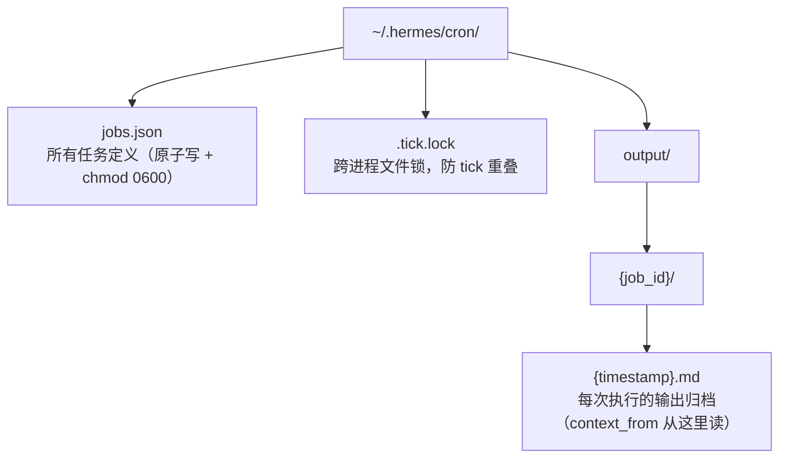
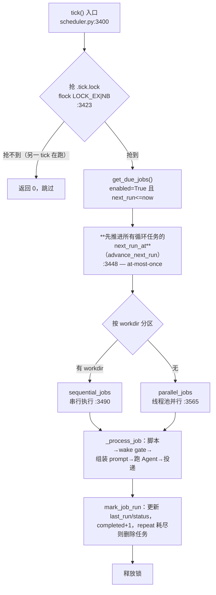
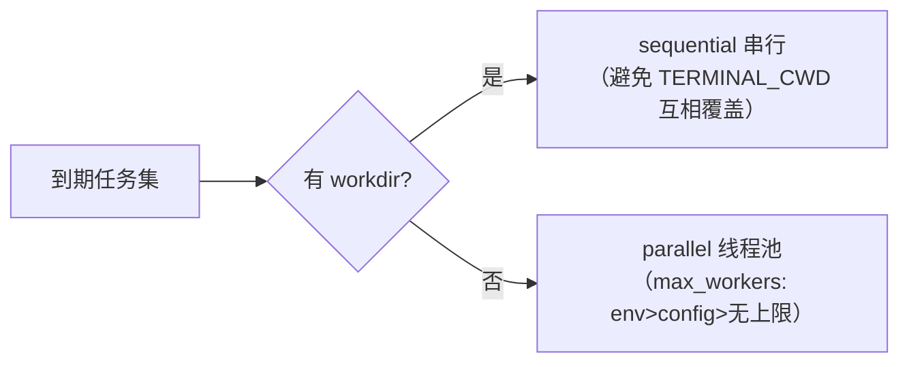

# 11-让 Agent 在你不说话时也能干活

中文 | [English](../en/11-cron-scheduling.md)

> **本章定位**：Cron 调度子系统——`cron/jobs.py`（2,033 行，Job 模型与调度解析）、`cron/scheduler.py`（3,638 行，tick 执行引擎）、`tools/cronjob_tools.py`（1,137 行，Agent 侧 `cronjob` 工具与注入扫描）、`hermes_cli/cron.py`（456 行）+ `cron/scheduler_provider.py`/`blueprint_catalog.py`/`suggestions.py`/`lifecycle_guard.py`（v0.17-v0.18 新成员）。
> **关键函数**：`tick()`（`cron/scheduler.py:3400`，执行引擎）、`parse_schedule()`（`cron/jobs.py:362`）、`compute_next_run()`（`cron/jobs.py:565`）、`_compute_grace_seconds()`（`cron/jobs.py:533`）、gateway 侧 60 秒驱动（`gateway/run.py:19989` 附近，原 `_start_cron_ticker` 已变为兼容 shim）。

> **本章基于 hermes-agent v0.18.2（tag [`v2026.7.7.2`](https://github.com/NousResearch/hermes-agent/releases/tag/v2026.7.7.2)，commit `9de9c25f6`，2026-07-07）**

---

## Agent 不该只在你说话时才工作

到目前为止，每一章讲的都是「用户说话 → Agent 回应」。但很多任务根本不需要人来触发：每天早上九点把 Hacker News 的 AI 新闻汇总到 Telegram、每五分钟检查一次内存够不够、每周生成一份 PR 健康度报告。这些任务的共同点是——**它们应该在没有人盯着的时候自己醒来、自己干完、把结果送到该去的地方**。

传统做法是写个 shell 脚本丢进系统 crontab，但系统 cron 不认识自然语言（任务是「总结新闻」而不是 `curl | jq`）、给不了完整的 Agent 环境（工具、技能、记忆、模型回退）、也送不了消息到 Telegram（更别说端到端加密）——Hermes 只好自己实现一套。

于是 Hermes 自己实现了一套**纯应用层的 cron**（`cron/` 目录），不依赖系统 crontab、不需要 root。但它远不止「定时跑个 prompt」这么简单——这一章会看到它如何用「先推进再执行」保证崩溃后不重复跑、如何用 grace window 避免宕机重启后任务雪崩、如何让一个脚本在 `$0` 成本下决定「这次要不要唤醒 LLM」、如何把多个任务串成流水线、以及为什么带工作目录的任务必须串行执行。

读完你应该能：用自然语言或 cron 表达式排定任务、给任务挂技能、把监控脚本做成「只在出事时才说话」的看门狗、把任务串成多级流水线，并在任务没按时跑时知道该查哪里。

> **边界说明**：第 05 章讲 gateway 网关如何收发消息——cron 的 tick 正是由 gateway 后台线程驱动的，但本章聚焦调度逻辑本身。第 09 章 Kanban 有个 `scheduled` 状态会和 cron 集成，那是 Kanban 卡片的定时触发；本章讲的是通用的 cron 任务系统。v1 曾把 cron 和 ACP/MCP serve 合在一章，v2 已把后两者归入第 06 章（协议适配层），所以本章可以专心把 cron 讲透。

---

## 使用指南

### 基本用法：三种创建方式

cron 任务可以从三个入口创建，对应三种使用习惯：

```bash
# 1. 聊天里用 /cron（最顺手）
/cron add 30m "提醒我看一下构建结果"
/cron add "every 2h" "检查服务器状态"
/cron add "0 9 * * *" "汇总新的订阅内容" --skill blogwatcher

# 2. 独立 CLI（脚本化/无聊天环境）
hermes cron create "every 2h" "检查服务器状态"
hermes cron create "0 9 * * *" "汇总今天的 AI 新闻发到 Telegram" \
  --skill blogwatcher --name "晨间简报"

# 3. 直接用自然语言说（Agent 识别意图后自己调 cronjob 工具）
#   "每天早上九点查一下 Hacker News 的 AI 新闻，总结后发我 Telegram"
```

三个入口最终都落到同一个工具 `cronjob`（`tools/cronjob_tools.py`）和同一份存储 `~/.hermes/cron/jobs.json`。

**调度表达式有四种格式**（`cron/jobs.py:362 parse_schedule`）：

| 输入 | 类型 | 含义 |
|------|------|------|
| `"30m"` / `"2h"` / `"1d"` | once | 相对延迟，X 时间后跑一次 |
| `"every 30m"` / `"every 2h"` | interval | 每隔 X 时间循环 |
| `"0 9 * * *"` | cron | 标准 5 字段 cron 表达式（依赖 `croniter` 库） |
| `"2026-03-15T09:00:00"` | once | ISO 时间戳，指定时刻跑一次 |

### 配置

cron 相关的全局配置在 `config.yaml` 的 `cron:` 段下，最常用的三个：

```yaml
# ~/.hermes/config.yaml
cron:
  wrap_response: true            # 投递时是否加「这是定时任务的输出」头尾包装（默认 true）
  script_timeout_seconds: 3600   # 预运行脚本超时（默认 3600s = 1 小时）
```

```yaml
# 任务默认用哪些工具集——在 hermes tools 的 curses UI 里选 "cron" 平台配置
# 也可在单个任务上用 enabled_toolsets 精确控制（见下）
```

> **省钱要点**：cron 任务每次都是全新会话，工具 schema 会随每次 LLM 调用发送。给「取个新闻」这种小任务带上 `moa`/`browser`/`delegation` 全套工具，等于每次都为没用到的工具付 token。用 `enabled_toolsets=["web", "file"]` 把任务限制到真正需要的工具集（`cron/jobs.py` 的 job 字段，官方文档 `cron.md`）。

### 常见场景

**场景 1：看门狗——只在出事时才说话**。用 no-agent 脚本模式 + `[SILENT]` 语义，零 LLM 成本地监控。

```bash
hermes cron create "every 5m" --no-agent \
  --script memory-watchdog.sh --deliver telegram --name "内存告警"
```

预期：脚本每 5 分钟跑一次，stdout 直接当消息投递；**stdout 为空 → 这次静默不投递**（这就是看门狗模式——没事就不出声）；脚本非零退出或超时 → 投递一条错误告警（坏掉的看门狗不能无声无息）。整个过程不碰推理层，不花 token（官方文档 `cron-script-only`）。

**场景 2：多级流水线——一个任务的输出喂给下一个**。用 `context_from` 把任务串起来。

```python
# 任务1：早 7 点抓新闻存文件
cronjob(action="create", schedule="0 7 * * *", name="抓新闻",
        prompt="抓 Hacker News 前 10 条 AI 新闻，存到 ~/.hermes/data/raw.md")
# 任务2：早 7 点半，接收任务1的输出做筛选
cronjob(action="create", schedule="30 7 * * *", name="筛新闻",
        context_from="<任务1的ID>",
        prompt="读上面的新闻，按价值打分，挑出前 5 条")
```

（任务1 的 ID 可用 `hermes cron list` 查，或创建后从返回里拿；在聊天里直接说「把刚才的抓新闻任务接到筛新闻任务」，Agent 会自己解析 ID。）

预期：任务2 触发时，Hermes 自动把任务1 最近一次的输出（从 `~/.hermes/cron/output/<任务1ID>/*.md` 读取）拼到任务2 的 prompt 前面。任务2 不需要硬编码「去读那个文件」，它直接拿到内容。链可以任意长。

**场景 3：高频轮询只在数据变了才唤醒 LLM**。用 pre-check 脚本的 wake gate。

```python
# ~/.hermes/scripts/check.py —— 最后一行输出 JSON 决定要不要唤醒
import json, sys
if fetch_latest() == read_last_state():
    print(json.dumps({"wakeAgent": False}))   # 没变化 → 跳过这次 agent 运行
else:
    print(json.dumps({"wakeAgent": True}))
```

预期：脚本最后一行是 `{"wakeAgent": false}` 时，cron 跳过整个 agent 运行（`cron/scheduler.py` 的 wake gate）。适合「每 1-5 分钟轮询，但只在状态真变了才花钱唤醒 LLM」。

### 排错指引

| 现象 | 原因 | 解决 |
|------|------|------|
| 任务没按时跑 | gateway 没在跑（cron 由 gateway 后台线程驱动） | `hermes cron status` 看 gateway 状态；用 `hermes gateway install` 装成服务 |
| 宕机重启后错过的任务没补跑 | 超出 grace window 被静默快进 | 这是设计行为（见下文 grace window）；想立即跑用 `hermes cron run <id>` |
| 任务跑了但没收到消息 | 回复中含 `[SILENT]`（子串匹配、不区分大小写）被抑制投递 | 检查 prompt 是否让模型在「没事」时回 `[SILENT]`；失败的任务永远投递不受此影响 |
| 创建任务报「injection blocked」 | prompt 命中注入/外泄扫描 | 检查是否有不可见 Unicode、`curl` 带密钥、`authorized_keys` 等模式（`cronjob_tools.py`） |
| 任务说「找不到文件/不知道上下文」 | cron 是全新会话，没有历史记忆 | prompt 必须自包含——把 SSH 地址、命令、判据全写进去 |
| `croniter` 报错 | 用了 cron 表达式但没装 croniter | `pip install croniter`（现为核心依赖，`jobs.py:401-404` 报错分支） |
| 两个带 workdir 的任务互相干扰 | workdir 任务并行会污染彼此的 cwd | 这是为何 workdir 任务强制串行（见下文） |
| 任务 `enabled=true` 却一直不跑 | 循环任务算不出 next_run（多半 gateway 没装 croniter），被置 `state=error` | `hermes cron list --all` 看该任务的 `last_status`/`last_error`（无 `cron get` 子命令）；装 `croniter` |
| 任务跑起来了但很久没结果 | API 调用卡死/工具悬挂，触发活性超时 | 查日志 `Job '...' idle for Xs`（默认 600s 无活动）；`HERMES_CRON_TIMEOUT` 可调 |
| `last_status=ok` 但没收到消息 | 执行成功、投递失败（两个独立字段） | `hermes cron list --all` 看该任务的 `last_delivery_error`（无 `cron get` 子命令） |

> 📖 **延伸阅读（官方文档）：**
> - [Scheduled Tasks (Cron)](https://hermes-agent.nousresearch.com/docs/user-guide/features/cron)
> - [Automate with Cron（实战指南）](https://hermes-agent.nousresearch.com/docs/guides/automate-with-cron)
> - [Script-Only Cron Jobs（看门狗模式）](https://hermes-agent.nousresearch.com/docs/guides/cron-script-only)
> - [Cron Internals（开发者视角）](https://hermes-agent.nousresearch.com/docs/developer-guide/cron-internals)

---

## 架构与实现

### 数据驱动：jobs.json 是唯一的真相源

整个 cron 系统是**文件驱动**的——没有数据库、没有常驻进程持有状态，所有任务定义都在一个 JSON 文件 `~/.hermes/cron/jobs.json` 里。这是个刻意的选择：任务定义要能被 CLI、Agent 工具、gateway 三个不同进程读写，用一个文件做真相源比用数据库轻得多，也方便用户直接查看/备份。

每个 job 是一个字典（`cron/jobs.py`），核心字段：

```python
{
  "id": "a1b2c3d4e5f6",          # uuid4().hex 前 12 位
  "prompt": "...",               # 自然语言指令（no_agent 时可空）
  "schedule": {"kind": "cron", "expr": "0 9 * * *", ...},
  "skills": ["blogwatcher"],     # 运行前注入的技能（按序）
  "deliver": "telegram:123",     # 投递目标
  "repeat": {"times": null, "completed": 42},  # null=永远；记录已完成次数
  "enabled": true,               # 暂停时与 state 一起置 false（两套独立门控）
  "state": "scheduled",          # scheduled/paused/completed/error
  "next_run_at": "...",          # 下次运行时刻（崩溃恢复的锚点）
  "last_run_at": "...", "last_status": "ok",
  "last_error": null,
  "last_delivery_error": null,   # 投递失败单独记录（独立于 last_status）
  "context_from": ["job_id"],    # 链接前置任务的输出
  "no_agent": false,             # true=纯脚本，不碰 LLM
  "workdir": null, "enabled_toolsets": null,  # 隔离/控成本（注：profile 字段 v0.17-v0.18 已移除）
  "model": null, "provider": null,  # 留空则运行时从全局配置解析
}
```

`state` 有四个值，其中 `error` 和「完成」的处理藏着两个反直觉点。第一，循环任务（cron/interval）算不出 `next_run_at` 时（典型是 gateway 的 Python 环境没装 `croniter`），`mark_job_run`（`jobs.py:1331` 起；error 保 enabled 的分支在 `:1396`）**故意把 `state` 置 `error` 而保持 `enabled=true`**，而不是置 `completed`——因为静默把「缺依赖」变成「任务完成」会让用户的定时任务无声无息地停掉（#16265）。第二，循环任务的 `repeat.times` 次数用尽时，任务是被**直接删除**的（`mark_job_run` 里的 `jobs.pop(i)`，`jobs.py:1384`；另一处 `:1461` 的 pop 只处理 `kind=="once"` 的一次性任务派发认领，不是循环任务这条路径），不会留一个 `completed` 记录在那里。

还有一个排错高频陷阱——`last_status` 和 `last_delivery_error` 是两个独立字段：任务可能 `last_status=ok` 但 `last_delivery_error` 非空（执行成功、投递失败）。只看 `last_status` 会以为一切正常，消息其实没发出去。

文件用**原子写入**（`cron/jobs.py:754 save_jobs`）：先写临时文件、`fsync`、再 `atomic_replace` 重命名、最后 `chmod 0600`。这样即使写到一半进程被杀，也不会留下半个损坏的 JSON——要么是旧的完整文件，要么是新的完整文件。进程内锁与**跨进程 flock**（`jobs.py:153-194`，v0.18 强化）共同保护「load → 改 → save」这个读改写循环。

存储和并发安全解决了，但每个 job 里的 `next_run_at` 究竟是怎么算出来的？这要看调度解析层。

**图：Cron 数据目录结构——jobs.json 存定义，.tick.lock 防并发，output/ 按 job 归档每次执行**



### 调度解析：四种格式如何算出「下次什么时候跑」

`parse_schedule()`（`cron/jobs.py:362`）把用户输入的字符串解析成一个带 `kind` 的字典；`compute_next_run()`（`jobs.py:565`）再据此算出 `next_run_at`：

- **once**（`30m` 或 ISO 时间戳）：算出一个绝对时刻，跑过就完了。
- **interval**（`every 2h`）：`last_run_at + 间隔`；没有 `last_run_at` 时用 `now + 间隔`。
- **cron**（`0 9 * * *`）：用 `croniter` 库计算下一个匹配时刻。

cron 模式有个关键细节：算下次时间时，**优先以 `last_run_at` 而非 `now` 作为 croniter 的基准**（`jobs.py:601-606`）。为什么？因为这样在崩溃恢复时，时间锚定在「上次实际跑的时刻」上，而不是「重启的时刻」，周期不会因为重启而漂移。

### tick 执行引擎：四个机制保证「不多跑、不漏跑、不空跑」

cron 的心脏是 `tick()`（`cron/scheduler.py:3400`）。Hermes 的消息网关（gateway，第 05 章）启动一个后台 ticker 线程（gateway/run.py:19989 附近；原 `_start_cron_ticker` 已退化为兼容 shim），**每 60 秒**调一次 `tick()`。v0.18 起心跳来源不再唯一：桌面/Web 后端（web_server.py，第 10 章）自带内嵌 ticker，外部调度 Provider（见下"调度器 Provider"）也能当触发源——但"没有任何 ticker 在跑就没人触发"这个前提不变。一次 tick 的完整流程：

**图：一次 tick 的完整流程——加锁、提前推进、分区执行、投递、更新状态**



四个值得细看的机制，每个都从不同角度保障正确性：

**① At-most-once（至多执行一次）**。tick 在执行任何任务**之前**，先把所有循环任务的 `next_run_at` 推进到下一个周期（`scheduler.py:3448` 调 `advance_next_run`）。顺序是「先推进、再执行」而非「先执行、再推进」。为什么？因为如果任务执行到一半 gateway 崩溃重启，`next_run_at` 已经是未来的值了，下次 tick 不会重复执行同一个任务。代价是崩溃的那一次任务**不会自动重试**（循环任务等下个周期，一次性任务保持原值允许重试）——这是「宁可漏跑一次也不重复跑」的权衡，对「发消息」「改数据」这类有副作用的任务，重复执行比漏跑危险得多。

**② Grace window（宽限窗口）**。如果 gateway 宕机 6 小时再重启，会发现一堆任务的 `next_run_at` 都是过去的时间。要不要把这 6 小时错过的全部补跑？不——那会造成雪崩（想象每 5 分钟一次的任务积压了 72 次）。grace window 给每个任务算一个容忍窗口（`_compute_grace_seconds`，`jobs.py:533`）：

```
grace = max(120s, min(周期/2, 7200s))
```

即下限 2 分钟、上限 2 小时、典型取周期的一半。错过时间超过这个窗口的任务被**静默快进**到下一个未来周期，不补跑（`jobs.py` 的 `get_due_jobs` 快进逻辑）。举例：每日任务的周期是 86400s，周期一半远超 2 小时上限，所以容忍窗口是 2 小时——宕机超过 2 小时后重启，今天这次就跳过，等明天。

**③ Wake gate（唤醒门控）**。任务可以挂一个 pre-check 脚本（`script` 字段）。脚本在 agent 运行前先跑，如果它最后一行输出 `{"wakeAgent": false}`，cron 就跳过整个 agent 运行（`cron/scheduler.py` 的 `_parse_wake_gate`（`scheduler.py:2041`））。这是个 `$0` 成本的「要不要花钱」开关——高频轮询任务（每 1-5 分钟）只在状态真变了才唤醒 LLM，否则连模型都不碰。脚本想把数据交给 agent 不必用特殊字段：它的**整段 stdout 都会被注入 prompt**（包进代码块，`scheduler.py:2101/2112`），直接打印即可。注意 `_parse_wake_gate`（`scheduler.py:2041`） 只解析 `wakeAgent` 这一个键并返回布尔值，JSON 里的其他键（如 `context`）不会被特殊处理——数据是靠整段 stdout 传递的，不是靠某个约定字段。

**④ `[SILENT]` 抑制投递**。agent 的最终回复被判定为「沉默信号」时（`_is_cron_silence_response()`，`scheduler.py:257`，调用点 `:3349`；标记 `SILENT_MARKER` 定义在 `:245`），输出仍存到本地 `output/` 但**不投递**到聊天。判定规则是精确的行级匹配而非子串匹配：整条回复恰好是标记、标记独占首行或末行（如 `2 deals filtered\n\n[SILENT]`）、或带方括号的 `[SILENT]` 作同行前缀（文档化写法 `[SILENT] No changes detected`）才算沉默；大小写不敏感，且容忍模型丢括号的 `SILENT`/`NO_REPLY` 变体——但**埋在句子中间的标记按真实内容照常投递**。这套规则是 2026-06-25（`f284d85ef`）重写的：旧实现是 `SILENT_MARKER in ...upper()` 子串匹配，既漏判无括号变体、又把「正文里只是引用了一下 `[SILENT]` 的真实报告」误吞（#51438、#46917）。这让监控任务可以「健康时闭嘴、出事才喊」。注意：**失败的任务永远投递**，不受 `[SILENT]` 影响——否则坏掉的监控会无声无息。

①②是「时间正确性」（不多跑、不在错误的时间批量补跑），③④是「成本/噪音正确性」（不空跑、不刷屏）。

四个机制保证了每次 tick 跑什么、什么时候跑——接下来的问题是：同时到期的多个任务，能不能一起跑？

### 并发：为什么有的任务能并行、有的必须串行

一次 tick 可能有多个任务同时到期。能不能全部并行跑？大部分可以——tick 用一个线程池并行执行（`scheduler.py:3565`，`max_workers` 取「环境变量 > config > 无上限」）。但**带 `workdir` 的任务**被强制拎出来**串行**执行（`scheduler.py:3490` 的分区判据只看 `workdir` 这一个字段）：`workdir` 通过进程级的 `TERMINAL_CWD` 环境变量生效，两个 workdir 任务并行会互相覆盖对方的工作目录。此外还有一把 `_terminal_cwd_lock` 读写锁专门防止"没有 workdir 的并行任务"读到"有 workdir 任务"临时设置的 `TERMINAL_CWD`。

所以判据很清晰：**改了进程级 cwd 的任务必须串行，其余并行**。这也解释了一个使用层的现象——给任务设了 `workdir` 后它就不在并行池里了。（注：早期版本 `profile` 也是串行判据之一，但 v0.17-v0.18 起 `profile` 已不再是 per-job 字段，Profile 隔离改由 per-profile 的 `HERMES_HOME` 和各自独立的 `jobs.json` 承担，见下文"扩容"一节。）

**图：tick 的并发分区——进程级全局状态（cwd/HERMES_HOME）的任务串行，其余并行**



但「串行化进程级状态」只解决了 cwd/HERMES_HOME 这类 `os.environ` 全局态。还有一类状态——**投递目标**——也是每个任务不同的，并行时同样不能互相覆盖。这里用的是另一层机制：**ContextVar**（Python 标准库的协程/线程局部变量，类似 `threading.local` 但协程安全，`scheduler.py:2597` 起）。每个任务的会话/投递状态走 ContextVar 而非 `os.environ`，并行执行时每个任务在自己 `contextvars.copy_context()` 的副本里跑，互不串味。

一个相关的、容易忽略的设计：cron 执行时**故意把 `HERMES_SESSION_*` 清空**（platform/chat_id 置空，`scheduler.py:2603-2611`），改用 `HERMES_CRON_AUTO_DELIVER_*` 传投递目标。为什么？因为 cron 不是「真实用户从某个聊天发来的消息」，但好几个工具会读 `HERMES_SESSION_PLATFORM` 做运行时决策——terminal_tool 的后台进程通知路由、tts_tool 选 Opus 还是 MP3、skills_tool 的按平台禁用列表、send_message_tool 的 mirror 标签——如果不清空，它们会误以为有个来自 origin 聊天的用户在驱动 agent，行为全错。投递本身从 `job["origin"]` 直接读，不依赖这些 session 变量，所以清空不影响投递。

所以并发安全有三层：**①串行隔离进程级全局态（cwd/HERMES_HOME）②ContextVar 隔离每任务投递/会话态 ③跨进程 `.tick.lock` 文件锁**（`scheduler.py:3423`，Unix `fcntl.flock`、Windows `msvcrt.locking`）——第三层防的是 gateway 内置 ticker 和用户手动 `hermes cron tick` 同时跑导致同一批任务双执行，抢不到锁的 tick 直接返回 0。（想完全回到旧的串行行为可设 `HERMES_CRON_MAX_PARALLEL=1`。）

### 单个任务怎么跑：从脚本到投递

`_process_job` → `run_job` 是单个任务的执行主线，几个关键阶段：

0. **热加载 + 配置读取**：每次运行前先 `reset_secret_source_cache()` 再 `load_hermes_dotenv(~/.hermes/.env)`（注意**不是**裸 `load_dotenv`，`scheduler.py:2680`）——这样改了 provider key 不用重启 gateway 就对新任务生效。先重置 secret 源缓存这一步是必需的：否则托管在 Bitwarden/BSM 里的密钥不会被重新解析，只会套用 .env 里的占位符，导致 cron 任务拿旧占位符去请求而 401（#33465）。`max_turns`（默认 90）、`reasoning_effort` 等 agent 参数也是每次从 `config.yaml` 读，而非存在 job 里。
1. **预运行脚本**（如果有 `script`）：先跑脚本，解析 wake gate。脚本超时默认 **3600s（1 小时）**（`_DEFAULT_SCRIPT_TIMEOUT`，`scheduler.py:1879`），可通过 `cron.script_timeout_seconds` 或 `HERMES_CRON_SCRIPT_TIMEOUT` 调整（解析优先级：测试用 module 级覆盖 → env → config → 默认 3600s）。
2. **组装 prompt**：注入技能内容（按 `skills` 顺序）、拼接 `context_from` 引用的前置任务输出、附上脚本输出。带 `workdir` 时还会注入该目录的 `AGENTS.md`/`CLAUDE.md`/`.cursorrules`（`scheduler.py:2632` 起）——`workdir` 不只是设 cwd，更让任务拥有项目级上下文。
3. **运行时注入扫描**（`scheduler.py:2085/2187`）：对**组装后的完整 prompt**（用户 prompt + 技能内容）再扫一次注入——这堵住了一个 v1 没堵的漏洞（#3968）：恶意技能可能在运行时才注入 payload，只在创建时扫描 prompt 抓不到。
4. **全新会话跑 Agent，带活性超时**：每个任务都是干净的 `AIAgent` 会话，无历史记忆，`cronjob`、`messaging`、`clarify` 三个工具集被禁用（`scheduler.py` 的工具集禁用段）——禁 `cronjob` 是递归守卫（防止任务里再创建任务造成调度爆炸），禁 `messaging`/`clarify` 是因为 cron 没有交互对端可以发消息或提问。任务继承用户配置的 fallback providers 和凭证池，所以高频任务遇到限流能回退/轮换 key。运行用一个**基于活性的超时**包着（活性监控段，轮询 `agent.get_activity_summary()`，`scheduler.py:3025` 起）：任务可以跑几个小时——只要它在持续调工具/收 token；但如果 API 调用卡死、某个工具悬挂，**默认 600 秒无活动**就判超时并 `interrupt`（`HERMES_CRON_TIMEOUT` 可调，`0`=无限）。注意是「无活动时长」而非「总运行时长」——它轮询 `agent.get_activity_summary()` 而非掐总时间，这样长任务不会被误杀，但真卡住的任务也跑不掉。
5. **投递**：根据 `deliver` 字段投递结果（详见下一节「投递：live adapter 优先，HTTP 回退」）。
6. **清理（finally）**：恢复 `TERMINAL_CWD`、清 ContextVar、关 session_db、`agent.close()` + `cleanup_stale_async_clients()`。最后这步是必须的——gateway 每分钟 tick，如果不释放，文件描述符会一路泄漏到 EMFILE（#10200）。

`no_agent=True` 的任务跳过 2-4 步，直接把脚本 stdout 当消息投递。

每个任务还会建一个 `SessionDB` 会话记录，让 cron 跑出来的内容能被 `session_search` 检索到——**默认**这些消息不镜像进 gateway 的会话历史，避免污染目标聊天的消息序列；但存在开关——全局 `cron.mirror_delivery`（`config.yaml`）或逐 job 的 `attach_to_session` 字段打开后，cron 输出会以不破坏对话交替的方式镜像回源会话。

### 投递：live adapter 优先，HTTP 回退

结果投递到 `deliver` 指定的目标，支持单个、多个（逗号分隔）、以及路由令牌 `all`（fire 时展开为所有配好 home channel 的平台）。投递走两条路（`cron/scheduler.py` 的 `_deliver_result`）：

- **优先用 gateway 正在运行的 live adapter**：对需要端到端加密的平台（如 Matrix）这是必须的——只有已建立的加密 session 才能发消息。
- **gateway 没在跑时，回退到 standalone HTTP 客户端**：用 `asyncio.run()` 在独立事件循环里发。如果当前线程已有运行中的事件循环导致 `asyncio.run()` 抛 `RuntimeError`，再退一步——丢到一个 `ThreadPoolExecutor` 新线程里跑（30s 超时兜底），避免「已有事件循环」直接让投递失败。

投递目标的语法（官方文档 `cron.md`）：`origin`（回创建处）、`local`（只存文件）、`telegram:123`（指定 chat）、`telegram:-100:17585`（指定话题 thread）、`discord:#eng`（频道名）、`all`（全部）、`origin,all`（回源 + 全部，按 `(平台,chat,thread)` 去重）。

默认投递会包一层头尾（「这是定时任务的输出，agent 看不到本消息」），可用 `cron.wrap_response: false` 关掉。

### 安全：两道注入扫描 + 脚本路径沙箱

cron 任务的 prompt 是会被自动执行的，且常带凭证访问外部——这是攻击面。Hermes 设了两道注入扫描（`tools/cronjob_tools.py` 的 `_scan_cron_prompt`）：

- **创建/更新时扫 prompt**：检测不可见 Unicode（零宽空格、双向覆盖等）、prompt injection（「忽略之前的指令」）、数据外泄（`curl` URL/header/body 里嵌密钥变量）、SSH 后门（`authorized_keys`）、`/etc/sudoers`、`rm -rf /` 等。
- **运行时扫组装后的完整 prompt**（`scheduler.py:2085`）：见上文 #3968，堵恶意技能运行时注入。

脚本路径被限制在 `~/.hermes/scripts/` 内（`cronjob_tools.py` 的 `_validate_cron_script_path`）：拒绝绝对路径、`~` 展开、以及通过 `../` 穿越逃逸目录。

### v0.17-v0.18 的扩容：从内置调度器到调度平台

cron 子系统在 v0.17-v0.18 间近乎翻倍（3,217 → 7,402 行），核心增量是六个方向：

**① 调度器 Provider 接口**（`cron/scheduler_provider.py`，194 行）。"何时触发"从内置 ticker 解耦成可插拔接口——`run_one_job()`（`scheduler.py:3253`）被提取为共享执行体，内置 ticker 和外部 Provider（`plugins/cron_providers/chronos`，第 08 章）都调它。外部调度意味着不跑常驻 gateway 也能准点触发。

**② 自动化蓝图**（`cron/blueprint_catalog.py`，713 行）。参数化的任务模板目录（CATALOG 单一真相源），同一份蓝图渲染到多个表面：Dashboard 表单、CLI、Agent 工具、deep-link。加上 **consent-first 的建议系统**（`cron/suggestions.py`，260 行 + `suggestion_catalog.py`）——Hermes 可以主动建议"要不要来个每日摘要任务"，但创建永远等用户点头。

**③ 任务快照防漂移**（`jobs.py:864` 起，#44585）。任务创建时锁定 resolved 的 `provider_snapshot`/`model_snapshot`——之后你切换全局默认模型，已有定时任务的行为不会跟着漂。

**④ 并发安全从三层扩到五层**。原有的串行隔离/ContextVar/tick 文件锁之外：jobs.json 的读改写现在有**跨进程 flock**（`jobs.py:153-194`——多进程同时改任务列表不再互相覆盖）；一次性任务加了 **run claim**（拦截判断在 `jobs.py:1613-1629`、戳记在 `:1786-1800`，TTL 计算 `:108`，#59229）——mid-run 的重复触发被 claim 挡住。

**⑤ ticker 心跳自检**（`TICKER_HEARTBEAT_FILE`，`jobs.py:72/651/675`，#32612）。ticker 每轮写心跳文件，诊断工具据此区分"gateway 活着但 ticker 线程死了"——这类半死状态过去只能靠"任务莫名不跑"倒推。

**⑥ 网关生命周期守卫**（`cron/lifecycle_guard.py`，141 行，#30719）。拦截 cron 任务在自己体内执行 `hermes gateway restart` 之类的操作——任务重启 gateway → gateway 重启杀掉任务 → 下次 tick 再跑再重启的死循环，从此有闸。

**Job 字段也换了一批**：删除 `profile`（Profile 隔离改由 per-profile HERMES_HOME 动态解析承担，#4707）；新增 `attach_to_session`（配合 **mirror delivery**——cron 输出以不破坏对话交替的方式镜像回源会话）、`paused_at/paused_reason`（可暂停）、`schedule_display`、`fire_claim/run_claim`、双快照字段。

### 代码组织

```
cron/
├── jobs.py          — Job 模型/CRUD/调度解析/grace/投递目标解析（2,033 行）
│   ├── parse_schedule()        :362   — 四种格式解析
│   ├── compute_next_run()      :565   — 算下次运行时刻
│   ├── _compute_grace_seconds():533   — 宽限窗口公式
│   ├── advance_next_run()             — at-most-once 提前推进
│   └── save_jobs()             :433   — 原子写
├── scheduler.py     — tick 引擎/单任务执行/注入扫描/投递（3,638 行）
│   ├── tick()                  :3400  — 执行引擎主循环
│   ├── run_one_job()           :3253  — 单任务执行体（Provider 共享）
│   ├── SILENT_MARKER           :245
│   └── 并发分区 sequential/parallel :3550/:3565
└── __init__.py      — 导出接口（42 行）

tools/cronjob_tools.py  — Agent 侧 cronjob 工具 + 注入扫描（:229）+ 路径沙箱（:528）（1,137 行）
hermes_cli/cron.py      — hermes cron 子命令（456 行；解析器已拆至 subcommands/cron.py）
gateway/run.py:19989    — _start_cron_ticker（现为兼容 shim，实际转调 InProcessCronScheduler）；真正的 60s 驱动线程名 cron-scheduler
```

### 设计决策汇总

| 决策 | 原因 | 代价 | 替代方案 |
|------|------|------|----------|
| 纯应用层 cron，不用系统 crontab | 需要完整 Agent 环境 + 自然语言 + 平台投递 | 自己实现调度/恢复 | 系统 crontab——给不了 Agent 环境 |
| jobs.json 单文件真相源 | CLI/工具/gateway 三进程共享，轻量可备份 | 并发需文件锁 | 数据库——重，难直接查看 |
| 先推进 next_run 再执行（at-most-once） | 崩溃不重复跑有副作用的任务 | 崩溃那次不自动重试 | 先执行再推进——崩溃会双跑 |
| grace window 静默快进 | 宕机重启不雪崩补跑 | 错过的任务被跳过 | 全部补跑——积压爆炸 |
| workdir 任务串行 | cwd 是进程级全局态 | 这类任务无并发 | 全并行——互相污染 |
| 运行时再扫一次组装 prompt | 堵恶意技能运行时注入（#3968） | 多一次扫描开销 | 只创建时扫——技能注入漏网 |
| 全新会话 + 禁 cronjob 工具 | 自包含、防递归调度爆炸 | prompt 必须自包含 | 带历史——递归创建任务风险 |
| 活性超时（无活动 600s）而非总时长超时 | 长任务持续干活不被误杀，卡死任务也跑不掉 | 需轮询活性摘要 | 总时长超时——会误杀正常长任务 |
| ContextVar 隔离 + 清空 HERMES_SESSION_* | 并行任务投递目标不串味；工具不误判为真实用户消息 | 多一层状态管理 | 用 os.environ——并行互相覆盖 |
| 算不出 next_run 的循环任务置 error 非 completed | 缺依赖不静默停掉用户的定时任务（#16265） | 需用户查 state | 置 completed——任务无声消失 |

### 扩展点

- **挂技能**：`skills=[...]`，运行前按序注入技能内容，复用经过测试的工作流。
- **pre-check 脚本 + wake gate**：`script=` + 脚本输出 `{"wakeAgent": false}`，$0 成本决定是否唤醒 LLM。
- **任务链**：`context_from=[job_id, ...]`，把前置任务输出注入当前 prompt，做多级流水线。
- **per-job 隔离**：`workdir`（注入 AGENTS.md/CLAUDE.md + 设 cwd）、`enabled_toolsets`（控成本）。Profile 隔离已不走 per-job 字段——每个 Profile 有独立的 `~/.hermes/profiles/<name>/cron/jobs.json`。
- **投递插件平台**：平台适配器可自注册 cron 投递目标。

---

## 与其他章节的关系

- **第 05 章（网关层）**：cron 的 tick 由 gateway 的 `cron-scheduler` 后台线程每 60 秒驱动（`_start_cron_ticker` 现已退化为兼容 shim，实际实现是 `InProcessCronScheduler`）；投递优先复用 gateway 的 live adapter。没有 gateway 在跑，cron 任务不会自动触发（CLI 模式只在跑 `hermes cron` 命令时才 tick）。顺带一提，gateway 的周期性维护（每 5 分钟刷频道目录、每小时清图片/paste 缓存、每小时触发技能 Curator）**已经从 cron ticker 里拆出去**，跑在另一个独立线程 `gateway-housekeeping`（`_start_gateway_housekeeping`，`gateway/run.py:19900`）——cron 调度和 gateway 维护现在是两个各管各的线程。
- **第 02 章（Agent 核心）**：每个任务跑一个全新的 `AIAgent.run_conversation()`，继承 fallback providers 和凭证池（第 02 章详述）。
- **第 04 章（技能系统）**：任务可挂技能，运行前注入 SKILL.md 内容；Curator 合并/弃用技能时会自动修复 cron 任务里的技能引用。
- **第 09 章（Kanban）**：Kanban 的 `scheduled` 状态与 cron 集成，用于卡片的定时触发。
- **第 12 章（批量运行与轨迹生成）**：cron 是「定时自驱动」的单任务调度；批量运行是「一次性大规模并行」，两者都让 Agent 脱离交互式运行，但场景正交。

---

*本文基于 hermes-agent v0.18.2 源码分析。所有代码引用均经过独立验证。*
