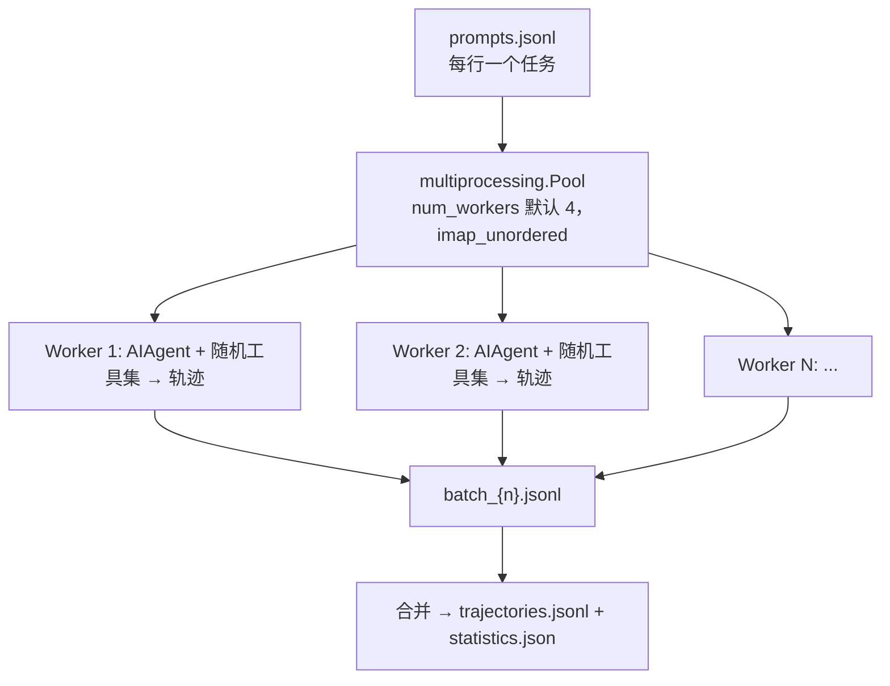
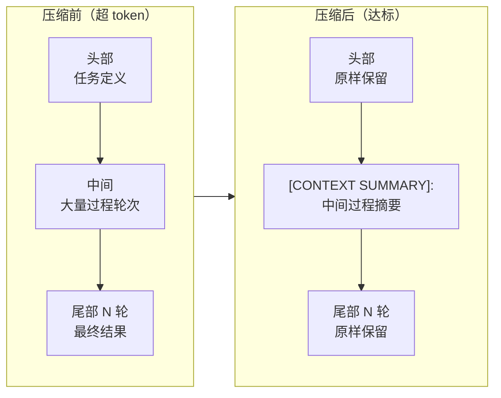

# 12-Agent 不只是产品，也是数据工厂

中文 | [English](../en/12-batch-and-trajectories.md)

> **本章定位**：训练数据生成管线——`batch_runner.py`（1,321 行，批量轨迹生成）、`trajectory_compressor.py`（1,574 行，轨迹压缩）、`mini_swe_runner.py`（735 行，SWE 任务 runner）、`toolset_distributions.py`（358 行，工具集随机化）、`datagen-config-examples/`（配置模板）。
> **关键类/函数**：`BatchRunner`（`batch_runner.py:527`）、`CompressionConfig`（`trajectory_compressor.py:83`）、`compress_trajectory()`（`trajectory_compressor.py:743`；异步版 `compress_trajectory_async()` `:879`）、`sample_toolsets_from_distribution()`（`toolset_distributions.py:241`）。

> **本章基于 hermes-agent v0.18.2（tag [`v2026.7.7.2`](https://github.com/NousResearch/hermes-agent/releases/tag/v2026.7.7.2)，commit `9de9c25f6`，2026-07-07）**

---

## Agent 跑过的每一步，都可能成为下一代模型的教材

Nous Research 做 Hermes Agent，不只是为了卖一个 AI 助手——他们是做模型的公司。Agent 每次干活都会留下一条**轨迹**（trajectory）：用户给个任务、模型思考、调工具、看结果、再调、最终完成。这条轨迹本身就是高质量的**训练数据**——它示范了「一个会用工具的模型在真实任务里该怎么一步步推进」。把成千上万条这样的轨迹收集、清洗、压缩，就能拿去微调（SFT）或强化学习（RL）训练下一代工具调用模型。

这章讲的就是这条**数据工厂流水线**：怎么大规模批量跑 Agent 产出轨迹（`batch_runner.py`）、怎么把跑出来的长轨迹压缩到能塞进训练窗口（`trajectory_compressor.py`）、怎么让训练数据覆盖多样的工具组合（`toolset_distributions.py`）、以及轨迹本身长什么样（ShareGPT 格式——一种被训练框架广泛支持的对话序列 JSON 约定）。

读完你应该能：用自己的 prompt 数据集批量生成轨迹、理解为什么要做工具集随机化和推理过滤、把超长轨迹压缩到目标 token、并读懂产出的 ShareGPT 轨迹文件喂给 HuggingFace datasets。

> **关于「RL」的说明**：本章原名「批量运行与 RL」。在 v0.11.0 时，主仓里还有一整套 RL 训练环境（`environments/` 的 Atropos 适配、`rl_cli.py`、`tool_call_parsers/`）。但到 v0.14.0，**这套 RL 训练基础设施已经被移出主仓**（很可能挪到了独立的训练仓库——产品仓与训练仓分离是常见做法）。所以本章聚焦**实际留在仓里的数据生成侧**：产出训练数据的工厂还在，把数据装进 RL 环境跑训练的那套设备搬走了。RL 在这里只作为「这些数据为谁而生」的背景出现。

> **边界说明**：第 11 章（Cron）讲的是「定时自驱动的单任务」；本章讲的是「一次性大规模并行跑成百上千个任务」。两者都让 Agent 脱离交互式运行，但目的正交——cron 是为了自动化日常，batch 是为了量产数据。第 02 章的 `save_trajectories`、第 03 章的工具系统，都是本章的上游。

---

## 使用指南

### 基本用法：批量生成轨迹

输入是一个 JSONL 数据集，每行一个任务（`prompt` 字段必填，`image`/`cwd` 可选）：

```jsonl
{"prompt": "写一个找最长回文子串的 Python 函数"}
{"prompt": "用 Flask 写一个用户认证的 REST 端点"}
{"prompt": "安装 numpy 并算一个 3x3 矩阵的特征值", "image": "python:3.11-slim"}
```

然后跑 `batch_runner.py`（用 Python Fire，所以函数参数即命令行标志）：

```bash
# 基本批量运行
python batch_runner.py \
    --dataset_file=data/prompts.jsonl \
    --batch_size=10 \
    --run_name=my_run \
    --model=anthropic/claude-sonnet-4.6 \
    --num_workers=4

# 中断后续传
python batch_runner.py --dataset_file=data/prompts.jsonl --batch_size=10 \
    --run_name=my_run --resume

# 列出所有工具集分布
python batch_runner.py --list_distributions
```

产出全部落在 `data/<run_name>/`：

```
data/my_run/
├── trajectories.jsonl   # 最终合并输出（所有批次）
├── batch_0.jsonl        # 单批次结果
├── batch_1.jsonl
├── checkpoint.json      # 续传检查点
└── statistics.json      # 工具使用聚合统计
```

### 配置

最常用的几个参数（完整见官方文档）：

| 参数 | 默认 | 作用 |
|------|------|------|
| `--dataset_file` | 必填 | JSONL 数据集路径 |
| `--batch_size` | 必填 | 每批多少个 prompt |
| `--run_name` | 必填 | 运行名（输出目录 + 续传用） |
| `--distribution` | `default` | 采样哪个工具集分布 |
| `--model` | `anthropic/claude-sonnet-4.6` | 用哪个模型（这是 CLI 入口默认值，含 `anthropic/` 供应商前缀，`batch_runner.py:1152`；用 Python API 直接构造 `BatchRunner()` 时类默认是 opus，注意区别） |
| `--num_workers` | 4 | 并行 worker 进程数 |
| `--max_turns` | 10 | 每个 prompt 最多几轮工具调用 |
| `--resume` | false | 从检查点续传 |
| `--max_samples` | 全部 | 只处理前 N 条 |

### 常见场景

**场景 1：为微调量产编码轨迹**。多 worker + 大 batch，用默认分布拿到全工具覆盖。

```bash
python batch_runner.py --dataset_file=data/coding.jsonl --batch_size=20 \
    --run_name=coding_v1 --model=anthropic/claude-sonnet-4.6 \
    --num_workers=8 --distribution=default --max_turns=15
```

预期：8 个进程并行跑，每条轨迹随机激活一组工具集，零推理的轨迹被自动丢弃，最终合并成一个 `trajectories.jsonl`，可直接 `load_dataset("json", ...)` 喂 HuggingFace。

**场景 2：把超长轨迹压缩到训练窗口**。一条 50K token 的轨迹塞不进 15K 的训练窗口，用压缩器。

```bash
python trajectory_compressor.py --input=data/my_run/trajectories.jsonl \
    --output=data/compressed.jsonl --target_max_tokens=16000
```

预期：每条轨迹的头尾被保护、中间过程被摘要成一条 `[CONTEXT SUMMARY]:` 消息，整条压到目标 token 以下。50 路并发，单条 300s 超时。

**场景 3：每个任务用不同的容器镜像**（benchmark 场景）。在 JSONL 里给每行指定 `image`。

```jsonl
{"prompt": "编译并运行这个 Rust 程序", "image": "rust:1.75"}
{"prompt": "起一个 Node Express 服务", "image": "node:20-alpine", "cwd": "/app"}
```

预期：在 `TERMINAL_ENV=docker` 下，batch runner 跑每个 prompt 前会先验证镜像可达（查本地缓存、再尝试 pull，`batch_runner.py:272`）；Modal 环境则跳过本地校验（由 Modal 服务端 pull），local 环境不涉及。

### 排错指引

| 现象 | 原因 | 解决 |
|------|------|------|
| 续传后又重跑了已完成的任务 | 数据集的 prompt 文本被改动过 | 续传按**内容匹配**，prompt 文本变了就认不出是同一条；保持 prompt 文本稳定 |
| 大量轨迹被丢弃 | 推理过滤：零推理轨迹被自动丢 | 检查模型是否启用了推理；纯无推理的对话对训练价值有限，被设计性丢弃 |
| HuggingFace 加载报 schema 不一致 | 不同轨迹的工具统计列对不齐 | 正常情况下 batch runner 已补零对齐；若手动拼接了多个 run 的输出需自行对齐 |
| 压缩后轨迹还是超 token | 轨迹太短，头尾保护区之间没有可压缩空间 | 调大 `target_max_tokens` 或减少 `protect_last_n_turns`（短轨迹本就压不动） |
| 续传时想重跑被丢弃的零推理 prompt 却没跑 | 丢弃的轨迹也被标记为已完成，`--resume` 不会重试 | 换一个 `--run_name` 重新跑，不能靠续传 |
| 镜像任务失败 | Docker 镜像不可达 | batch runner 跑前会校验镜像；确认本地能 `docker pull` |

> 📖 **延伸阅读（官方文档）：**
> - [Batch Processing](https://hermes-agent.nousresearch.com/docs/user-guide/features/batch-processing)
> - [Trajectory Format](https://hermes-agent.nousresearch.com/docs/developer-guide/trajectory-format)

---

## 架构与实现

### 轨迹格式：训练数据长什么样

要理解这条流水线，得先知道它产出什么——格式决定了下游能用什么工具消费，也决定了为什么流水线里有那么多「归一化」步骤。Hermes 用的是 **ShareGPT 兼容的 JSONL 格式**（官方文档 `trajectory-format.md`）：一个 `conversations` 数组，每个元素是一个 `{from, value}` 对，`from` 把 API 角色映射成 ShareGPT 约定：

| API 角色 | ShareGPT `from` |
|----------|-----------------|
| system | `system` |
| user | `human` |
| assistant | `gpt` |
| tool | `tool` |

每种角色的 `value` 有严格约定：

- **system**：函数调用协议说明 + `<tools>` XML 块（工具的 JSON 定义）。这条是**保存时生成**的，不是从对话里取的。
- **gpt**：必须含一个 `<think>...</think>` 块（**即使没推理也插一个空块** `<think>\n</think>`，保证训练格式一致），后面跟 `<tool_call>\n{JSON}\n</tool_call>`。
- **tool**：`<tool_response>\n{JSON}\n</tool_response>`，多个响应用换行拼成一条。

这套格式有几个刻意的归一化（`trajectory-format.md` 的 Normalization Rules，转换在 `agent/agent_runtime_helpers.py`）：

- **推理统一成 `<think>`**：不管模型原生用 thinking token（Anthropic/OpenAI o 系）还是被系统提示要求用 `<REASONING_SCRATCHPAD>` XML，最后都转成 `<think>`。训练数据要格式一致，模型看到的「推理放哪」必须是同一个标记。
- **多个 tool 响应合并成一条 `tool` 消息**：一个 gpt 轮里若有多个并发 tool_call，所有响应被 `\n` 拼成**单条** tool 消息（而 API 里是每个 call 一条），按位置与父 gpt 的 tool_calls 对应。
- **多模态消息瘦身**：带图片的 tool 消息里的 base64 大块会被替换成 `text_summary`，避免每条轨迹拖着约 1MB 的 base64。
- **prefill 不入轨迹**：`--prefill_messages_file` 的 few-shot 引导只在 API 调用时注入，不写进 `conversations`——所以轨迹里看不到 prefill 内容。

为什么这么多归一化？因为这些轨迹要当训练数据用，格式上任何不一致（推理标记不同、tool 响应一条还是多条、图片塞不塞 base64）都会变成训练噪音或体积灾难。

**图：一条 ShareGPT 轨迹的角色序列——system 定义工具，human 提任务，gpt 思考+调用，tool 回结果，gpt 收尾**


### BatchRunner：多进程轨迹工厂

`BatchRunner`（`batch_runner.py:527`）是数据工厂的主体。它从 JSONL 逐行读任务，用 `multiprocessing.Pool` 起 `num_workers` 个进程（默认 4），用 `pool.imap_unordered()`（`batch_runner.py:959`）无序并行——谁先跑完先收，吞吐更高。每批结果先落 `batch_{n}.jsonl`，最后合并成 `trajectories.jsonl`。

**注意并行是「批级」而非「prompt 级」**：`Pool` 的每个 task 是一整个 batch，worker 内部对 batch 里的 prompt 是**顺序处理**的（`batch_runner.py:442`：「Process each prompt sequentially in this batch」）。所以 `num_workers=4, batch_size=10` 同时在跑的 Agent 是 **4 个**（每个 worker 跑自己 batch 的当前 prompt），不是 40 个——这对估算吞吐和成本很关键。每个 prompt 跑的是一个 `AIAgent` 会话，且强制 `skip_context_files=True`、`skip_memory=True`（`batch_runner.py:344`）——不加载 SOUL.md/AGENTS.md、不用持久记忆，免得轨迹被环境上下文污染。

合并阶段还有一道**幻觉工具过滤**（`batch_runner.py:1028` 起）：检查每条轨迹的工具名是否都在合法工具全集里，含有模型幻觉出来的工具名的轨迹会被丢弃，不进最终 `trajectories.jsonl`——所以合并后的条数可能比批次文件里的少。轨迹还带一个 `partial` 字段：`true` 表示「因无效工具调用提前停止」，区别于正常完成和模型主动收尾。

**图：BatchRunner 多进程并行——JSONL 经 N 个 worker 各跑一个 Agent 会话，分批落盘再合并**



四个为「数据质量」服务的设计，每个都解决一个训练数据特有的问题：

**① 工具集随机化**。如果每条轨迹都开全套工具，训练数据会缺乏多样性——真实用户用的工具组合千差万别。每个 prompt 跑之前，`sample_toolsets_from_distribution()`（`toolset_distributions.py:247`）按一个**分布**随机采样一组工具集。这让训练数据覆盖各种工具组合（详见下一节）。

**② 内容匹配的断点续传**。批量跑动辄几小时，中途挂了不能从头再来。`--resume` 时，runner 扫描已有的 `batch_*.jsonl`，把里面每条已完成轨迹的 human 消息文本提取出来放进一个 set（`_scan_completed_prompts_by_content`），再用它过滤数据集——**按 prompt 文本内容匹配，而不是行号**。为什么？因为基于行号的续传一旦数据集中间插入/删除了行就全乱套；按内容匹配能容忍数据集顺序变化，也只跳过**成功**的（失败的下次会重试）。

**③ 推理过滤**。「零推理」的精确定义是：**所有** assistant 轮次都既没有 `<REASONING_SCRATCHPAD>`、也没有非空的原生 `reasoning` 字段（`_extract_reasoning_stats`，`batch_runner.py:208`）。只要有任意一轮带其一，轨迹就保留；全程无推理才丢弃（`batch_runner.py:455` 附近）。对训练工具调用模型来说，没有推理过程的轨迹价值有限——你想教模型「先想再做」，一堆「不想就做」的样本是污染。

> **排错陷阱**：被丢弃的轨迹也会被标记为「已完成」（`completed_in_batch`，`batch_runner.py:459`），所以 `--resume` 不会重跑它们——想换个 reasoning 配置重试这些 prompt，得新开一个 `--run_name`，不能靠续传。

**④ 工具统计补零**。每条轨迹自动提取每个工具的 count/success/failure 统计，并且**对所有可能的工具名补零值**（`_normalize_tool_stats`，工具全集来自 `model_tools.TOOL_TO_TOOLSET_MAP`）。为什么要给没用到的工具也填个 0？因为下游用 HuggingFace datasets 加载时，Arrow/Parquet 要求每行的列一致——如果轨迹 A 有 `terminal` 列、轨迹 B 没有，schema 就对不齐、加载报错。补零保证所有轨迹的 schema 完全一致。

前两个（工具集随机化 + 续传）守的是「数据的多样性与可靠性」，后两个（推理过滤 + 补零）守的是「数据的质量与格式一致性」。四者合起来，保证进入训练管线的轨迹是多样、可续、干净、齐整的。

### 工具集分布：让数据覆盖多样的工具组合

`toolset_distributions.py` 定义了 **17 种分布**（`DISTRIBUTIONS` 字典，`toolset_distributions.py:29`，AST 数键恰 17）。**v0.18 的一处叙事级变化：moa 工具集从全部 8 个含它的分布里删除了**——moa 工具本身已重构为 Agent 循环层的 MoA 模式（第 02 章），不再占工具位。现在的典型几个（只摘前两高概率项）：`default`（所有工具 100%）、`research`（web 90 + browser 70，另含 vision 50/terminal 10，`:55-62`）、`development`（terminal/file 各 80 + web 30/vision 10，`:79-87`）、`reasoning`（描述从 "Heavy mixture of agents" 改为 "Heavy research/reasoning"：web 90/file 60/terminal 20，`:151-158`）、`browser_only`（只浏览器）、`safe`（无终端模式）。

数据结构是「每个工具集一个独立概率」：

```python
"research": {
    "description": "...",
    "toolsets": {"web": 90, "browser": 70, ...}  # 各自 0-100 的概率
}
```

采样时（`sample_toolsets_from_distribution`，`toolset_distributions.py:247`），对分布里的**每个工具集独立掷一次骰子**（`random.random()*100 < 概率`）——所以多个工具集可以同时被选中，模拟真实的多工具组合。最后有个保底：如果一个都没选中，强制选概率最高的那个，避免出现「没有任何工具」的空轨迹。

> 这和「手写一张预制组合表」不同（官方文档 `batch-processing.md` 特别澄清了这点）：不是从 N 个预定义组合里挑一个，而是每个工具集独立翻硬币——N 枚硬币能翻出 2ᴺ 种组合（而「从预定义表里挑一个」永远只有表里那几种），多样性自然高出一个数量级。

### 轨迹压缩：保头保尾压中间

模型的训练窗口有限——一条 50K token 的轨迹塞不进 15K 的窗口。`trajectory_compressor.py` 负责把长轨迹压到目标 token。

压缩策略（`compress_trajectory()`，`trajectory_compressor.py:743`）遵循一个清晰原则——**保头保尾压中间**：

1. **保护头部**：开头的 system/human/gpt/tool 消息不动——它们包含任务定义和初始上下文，模型得知道「要做什么」。
2. **保护尾部**：最后 N 轮不动（`protect_last_n_turns` 默认 4，`trajectory_compressor.py:98`）——尾部是最终结果和成功/失败状态，是训练信号的核心。
3. **压缩中间**：用摘要模型（默认 `google/gemini-3-flash-preview`，`:101`）把中间过程生成一段摘要。
4. **替换**：用单条 `from="human"`、以 `[CONTEXT SUMMARY]:` 开头的消息替换被压缩的区间（`trajectory_compressor.py:808`；前缀强制，模型不输出就自动补）。

**图：轨迹压缩——头尾保护，中间过程摘要成一条 [CONTEXT SUMMARY] 消息**



为什么保头保尾压中间，而不是简单截断？因为头（要做什么）和尾（做成了没）是训练信号最密集的地方，中间「怎么做到的」过程信息密度低、可摘要。简单截断会丢掉尾部的成败信号，那恰恰是最该保留的。

压缩配置在 `CompressionConfig`（`trajectory_compressor.py:83`）：目标 token `target_max_tokens=15250`、摘要预算 `summary_target_tokens=750`、尾部保护 `protect_last_n_turns=4`。压缩是**异步并行**的——`asyncio.Semaphore(max_concurrent_requests=50)` 控制并发 API 调用，单条轨迹 `per_trajectory_timeout=300`s 超时。已经在目标以下的轨迹默认直接跳过不处理（`skip_under_target=True`）。

**token 怎么数的**：压缩的 token 计数用的是 `moonshotai/Kimi-K2-Thinking` tokenizer（`trajectory_compressor.py:86`，`trust_remote_code=True`），不是某个通用计数器——这个选择意味着「15250 token」是按 Kimi 的分词规则算的。如果你要训练的是别的模型，实际 token 数会有系统性偏差，最好用目标模型的 tokenizer 重新校验目标值。首次运行需要下载这个 HuggingFace tokenizer。

> **注意**：tokenizer 初始化失败会直接 `RuntimeError`（无软降级）；单条编码异常时有个 `len(text)//4` 的粗略回退，但对中文等多字节字符精度很差。

**压多少是按需算的**，不是把整个中间区间全压掉。算法（`trajectory_compressor.py:759` 起）先算「要省多少」：`需压缩 token = 当前总量 − 目标 + 摘要预算`（加摘要预算是因为摘要本身也占 token），再从压缩区起点往后**累积轮次直到省够就停**。所以压缩是**最小化的**——尽可能少压、保留更多中间过程。实现上，「头部」和「可压区」的分界点是轨迹中线（`n//2`）而非固定消息数（`_find_protected_indices`，`trajectory_compressor.py:482`）——这是个简洁但有边界情况的选择：当轨迹很短时，中线左侧就是被保护的头部、中线右侧直接是被保护的尾部，中间无可压空间，压缩器只能原样返回，轨迹仍然超 token。这才是「压缩后还超 token」的真正机制。

### mini_swe_runner：SWE 任务的轨迹生成

这条数据工厂流水线还有一条专用支线——`mini_swe_runner.py`（735 行），专门面向 SWE（软件工程）任务。它不共用主线的执行设备（BatchRunner），但**输出同样的 Hermes 轨迹格式**，产物能无缝并入同一条压缩管线。它的特点是用 Hermes 自带的执行环境（local/docker/modal，`create_environment()` 工厂）跑命令——可以在本地、Docker 容器、或 Modal 云沙箱里执行。支持单任务（`--task "..."`）和批量（`--prompts_file tasks.jsonl`）两种模式。

```bash
python mini_swe_runner.py --task "建一个 hello.py" --env docker --image python:3.11-slim
python mini_swe_runner.py --prompts_file tasks.jsonl --output_file out.jsonl --env docker
```

它和 batch_runner 有个**根本架构区别**：mini_swe_runner **不用 `AIAgent`**，而是自己实现了一套精简的工具调用循环，且只挂一种工具——terminal（`TERMINAL_TOOL_DEFINITION`，`mini_swe_runner.py:72`），不支持 web/file 等多工具。任务完成的判定也不一样：由于它不使用 AIAgent 的会话层、无法依赖模型「主动结束对话」，于是改用哨兵字符串：模型在 terminal 里执行 `echo "MINI_SWE_AGENT_FINAL_OUTPUT"`（哨兵定义在 `mini_swe_runner.py:97`，检测在 `:535`）作为「我做完了」的信号。**排错要点**：如果模型一直不 echo 这个字符串，任务会一路跑到 `max_iterations`（默认 15）才停——任务「不结束」多半就是这个信号没出现。

所以分工是：batch_runner 是通用的大规模轨迹工厂（用完整 AIAgent、多工具）；mini_swe_runner 针对「在隔离环境里反复跑 shell 命令直到任务完成」的 SWE 类任务（精简循环、单 terminal 工具、echo 信号收尾），输出格式兼容，方便进同一条压缩管线。

### 代码组织

```
batch_runner.py              — 批量轨迹工厂（1,321 行）
├── BatchRunner          :527  — 主类（num_workers 默认 4）
├── run()                :810  — 多进程主循环
├── _scan_completed_prompts_by_content  — 内容匹配续传
├── _normalize_tool_stats           — 工具统计补零
└── main() + fire.Fire   :1147/:1320  — Fire CLI 入口

trajectory_compressor.py     — 轨迹压缩（1,508 行）
├── CompressionConfig    :83   — 配置（target 15250 / 摘要 750 / 尾部 4 / gemini-flash / 并发 50）
├── compress_trajectory():743  — 保头保尾压中间（异步版 :879）
└── _snap_boundary()           — 压缩边界对齐到消息边界（v0.18 新增，:539 起）

mini_swe_runner.py           — SWE runner（735 行，local/docker/modal）
toolset_distributions.py     — 17 种工具集分布 + 独立概率采样（358 行；moa 项已全数移除）
datagen-config-examples/     — trajectory_compression.yaml / web_research.yaml / 示例数据集
```

### 设计决策汇总

| 决策 | 原因 | 代价 | 替代方案 |
|------|------|------|----------|
| multiprocessing.Pool + imap_unordered | 真并行（绕开 GIL）、高吞吐 | 进程间不共享状态、闭包不可 pickle | 线程池——受 GIL 限制 |
| 内容匹配续传（非行号） | 容忍数据集顺序/插删变化 | 需扫已完成文件提取文本 | 行号续传——数据集一动就错位 |
| 推理过滤丢弃零推理轨迹 | 训练「先想再做」不被无推理样本污染 | 丢掉部分数据 | 全保留——污染训练信号 |
| 工具统计补零对齐 | HuggingFace Arrow schema 一致 | 每行带全工具列（稀疏） | 不补——加载时 schema mismatch |
| 保头保尾压中间 | 头尾是训练信号核心，中间可摘要 | 中间过程信息损失 | 简单截断——丢掉成败信号 |
| 工具集独立概率采样 | 组合空间指数级，多样性高 | 不能精确控制组合 | 预制组合表——多样性受限 |

### 扩展点

- **自定义工具集分布**：在 `toolset_distributions.py` 的 `DISTRIBUTIONS` 加一个主题分布，用 `--distribution=<name>` 选用。
- **datagen 配置模板**：`datagen-config-examples/` 提供 `trajectory_compression.yaml`、`web_research.yaml` 等，改改就能用。
- **per-prompt 环境**：JSONL 每行可带 `image`/`cwd`，为不同任务指定不同容器/工作目录。
- **prefill 少样本**：`--prefill_messages_file` 注入 few-shot 引导消息。

---

## 与其他章节的关系

- **第 02 章（Agent 核心）**：每个 worker 跑的就是一个 `AIAgent.run_conversation()`；`save_trajectories` 参数（config.yaml 的 `agent.save_trajectories`）控制交互式 CLI 是否也存轨迹，batch runner 则永远存（这是它的本职）。
- **第 03 章（工具系统）**：工具集随机化采样的就是第 03 章定义的工具集；mini_swe_runner 用的 local/docker/modal 执行环境就是第 03 章 Computer Use 的执行后端。
- **第 11 章（Cron）**：cron 是定时单任务自驱动，batch 是一次性大规模并行——都让 Agent 脱离交互，目的正交。
- **RL 训练（已移出主仓）**：本章产出的 ShareGPT 轨迹是 SFT/RL 训练的输入。v0.14.0 起，把这些数据装进 RL 环境跑训练的代码（Atropos 环境、rl_cli、tool_call_parsers）已移出主仓，预期由独立的训练系统消费这些数据。

---

*本文基于 hermes-agent v0.18.2 源码分析。所有代码引用均经过独立验证。*
