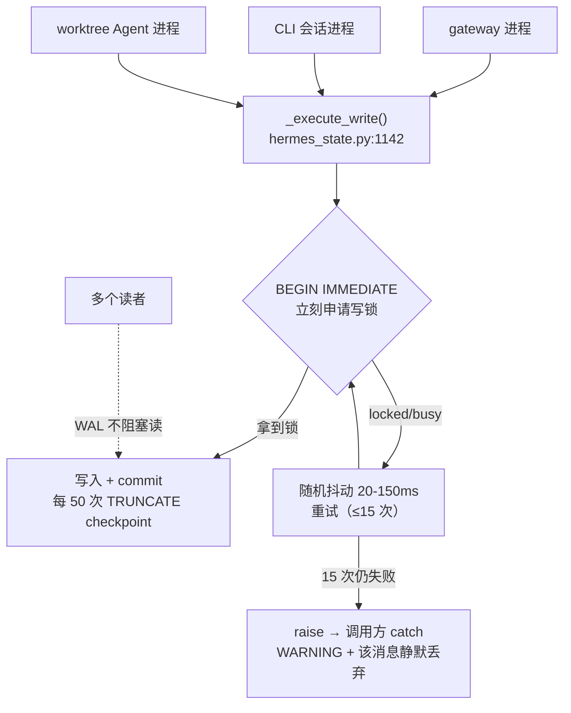
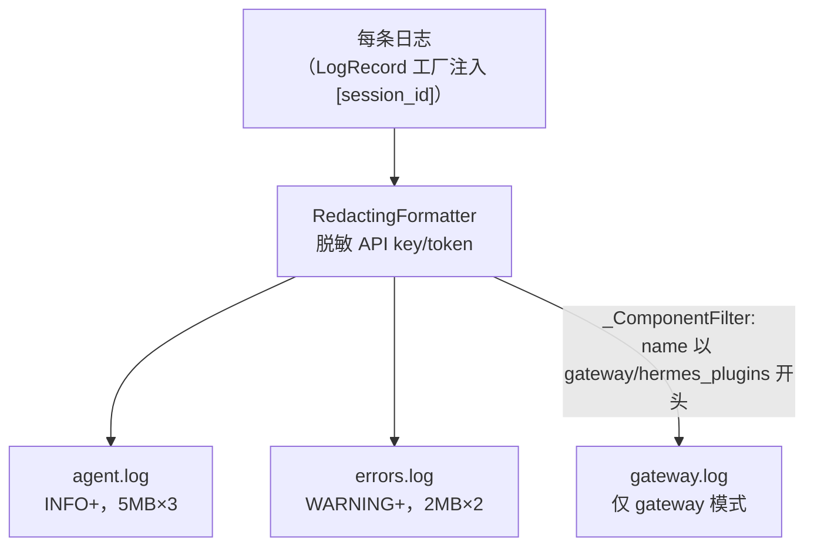
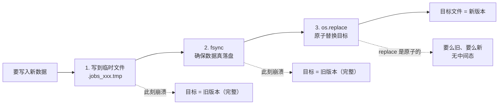

# 13-把一个 60 万行的项目稳住的那些「不性感」的代码

中文 | [English](../en/13-engineering-practices.md)

> **本章定位**：跨模块的工程基础设施——`hermes_state.py`（6,409 行，SQLite 会话存储）、`hermes_logging.py`（789 行，日志系统）、`utils.py`（546 行，原子写入）、`tests/`（2,017 个 .py，其中 test_*.py 1,960 个）、`pyproject.toml`（依赖与供应链）、`CONTRIBUTING.md`/`SECURITY.md`/`AGENTS.md`。
> **关键类/函数**：`SessionDB`（`hermes_state.py:871`）、`_execute_write()`（`hermes_state.py:1142`）、`_reconcile_columns()`（`hermes_state.py:1301`）、`atomic_json_write()`（`utils.py:139`）、`_ComponentFilter`（`hermes_logging.py:219`）。

> **本章基于 hermes-agent v0.18.2（tag [`v2026.7.7.2`](https://github.com/NousResearch/hermes-agent/releases/tag/v2026.7.7.2)，commit `9de9c25f6`，2026-07-07）**

---

## 让 Agent 跑得动的，和让项目活得久的

前面十二章讲的都是 Hermes「能做什么」——怎么调工具、怎么管会话、怎么定时、怎么量产数据。但一个几十万行、上万次提交、二十多个平台适配的项目，光「功能能跑」是活不久的。真正决定它能不能被持续维护的，是另一批**不性感**的代码：会话存到哪、并发写会不会冲突、日志怎么不泄密、配置写一半崩了会不会损坏、改了 schema 老用户的数据库怎么办、一个被投毒的 PyPI 包会不会顺着依赖链溜进来。

这章讲的就是这批基础设施。它们的共同特点是：**平时你感觉不到它们存在，一旦缺了就是灾难**。会话存储用 SQLite 但要扛住多进程并发写；日志要四路分发还要自动脱敏 API key；配置文件要原子写入——写一半崩溃也不能损坏；schema 要能自动迁移——老用户升级不用手动跑脚本；依赖要精确钉版——防的是真实发生过的供应链投毒。

读完你会理解 Hermes 在这些「地基」上的工程选择，以及背后的权衡。最后，作为全系列的收尾，我们回头看一眼这个项目整体。

---

## 使用指南

这一章的内容多是「系统替你做好的」，使用层面的接触点不多，但有几个值得知道：

### 查会话、搜历史

所有会话都存在 `~/.hermes/state.db`（SQLite）。常用操作：

```bash
hermes sessions list                 # 列出会话
hermes --resume <session_id>         # 恢复某个会话
hermes --continue                    # 恢复最近一次
```

会话里支持全文搜索（包括中文）——`/session_search docker 部署` 能搜到历史对话里的内容。

### 看日志排错

日志在 `~/.hermes/logs/`，三个文件各有分工：

```bash
tail -f ~/.hermes/logs/agent.log     # 全量活动日志（INFO+），日常排错主力
tail -f ~/.hermes/logs/errors.log    # 只有 WARNING+，快速定位问题
tail -f ~/.hermes/logs/gateway.log   # gateway 组件专属（gateway 模式才有）
```

多会话并发时，每行日志带 `[session_id]` 标签，方便 grep 出某次对话的全部日志。日志里的 API key/token 会被自动脱敏，可以放心分享。

### 依赖与供应链

```bash
hermes doctor                        # 检查环境，含供应链顾问（已知投毒版本告警）
hermes doctor --ack <advisory-id>    # 确认并永久消除某条供应链告警
```

### 排错指引

| 现象 | 原因 | 解决 |
|------|------|------|
| `database is locked` 报错 | 多进程同时写 state.db 且重试耗尽 | 通常自愈（应用层重试 15 次）；若持续，检查是否在 NFS 上（见下文 WAL 降级） |
| 中文搜不到结果 | 搜索词太短（trigram 需 ≥3 字） | 1-2 个汉字会降级到 LIKE，仍能搜但慢；用更长的词 |
| 升级后数据库报缺列 | 极少见——声明式列协调应自动补 | 看 `agent.log` 的 `ALTER TABLE` 行；正常情况无感升级 |
| `jobs.json` 损坏 | 几乎不可能——用了原子写入 | 原子写入保证要么旧版本要么新版本，不会半损坏 |
| 部分对话历史丢失 | state.db 写重试 15 次全部撞锁、消息被静默丢弃 | 搜 `agent.log` 的 `Session DB append_message failed`；该消息未落盘（内存中还在，重启/resume 后不可见） |
| `state.db` 报 schema malformed | sqlite_master 损坏或 FTS 写损坏 | 系统会自动三级修复（FTS rebuild→去重→丢弃重建）并先备份到 `state.db.malformed-backup-<时间戳>`；修复失败才需手动介入 |
| `tail -f` 日志突然不更新 | 被外部工具（logrotate/脚本）轮转导致 inode 不匹配 | Hermes 会靠 inode 比对自动重开；排查可确认 `agent.log` 的 inode 是否变了 |
| `hermes doctor` 报供应链告警 | venv 里有已知投毒版本的包 | 按提示升级；确认无误后 `--ack` 消除 |
| 某功能报 `FeatureUnavailable` | 可选依赖没装，或懒安装被关 | 检查网络；或 `security.allow_lazy_installs` 是否设了 `false`（受限环境下需手动 `pip install`） |

> 📖 **延伸阅读（官方文档）：**
> - [Session Storage（会话存储内部）](https://hermes-agent.nousresearch.com/docs/developer-guide/session-storage)
> - [Sessions（会话管理）](https://hermes-agent.nousresearch.com/docs/user-guide/sessions)
> - [Security（安全模型）](https://hermes-agent.nousresearch.com/docs/user-guide/security)
> - [Architecture（架构总览）](https://hermes-agent.nousresearch.com/docs/developer-guide/architecture)

---

## 架构与实现

在进入实现细节前，先交代一个章节边界：第 03 章已经详细讲了具体的安全守卫（危险命令审批、路径安全、SSRF、Tirith 扫描）；本章不重复枚举它们，而是讲**安全模型本身**——信任边界划在哪、哪些是「真边界」哪些只是「启发式防误触」、以及供应链这一层的硬化。

### SQLite 会话存储：单机数据库怎么扛多进程并发写

所有对话历史、token 账本、会话检索都落在一个 SQLite 文件 `~/.hermes/state.db`（`SessionDB`，`hermes_state.py:871`）。为什么是 SQLite 而不是 PostgreSQL？因为 Hermes 定位是单用户/单机部署——SQLite 零配置、零网络、零进程管理，`pip install` 完就能用。代价是 SQLite 的并发写能力弱，而 Hermes 偏偏有多进程并发写的需求：gateway、多个 CLI 会话、worktree 里的并行 Agent，可能同时写同一个 `state.db`。

这就是本节的核心张力——**怎么用一个「单写者」的数据库扛住多个进程同时写**。Hermes 的应对（`_execute_write()`，`hermes_state.py:1142`）有四件事配合：

1. **WAL 模式**：Write-Ahead Logging 允许「多读 + 单写」并发，读者不被写者阻塞。
2. **短超时 + 应用层重试**：若直接落在 SQLite 内置 busy handler 上干等，最长可达 30 秒（源码注释）；Hermes 把超时压到 **1 秒**（`timeout=1.0`），然后在应用层自己重试——最多 15 次（`_WRITE_MAX_RETRIES=15`），每次等一个 **20–150ms 的随机抖动**（`_WRITE_RETRY_MIN_S=0.020`/`_MAX_S=0.150`）。
3. **`BEGIN IMMEDIATE`**：事务一开始就申请写锁，而不是等到 commit 才申请。这让锁冲突**在事务开头立刻暴露**，触发应用层重试，而不是写了一半才发现拿不到锁。
4. **周期性 WAL checkpoint**：每 50 次成功写入做一次 checkpoint（`_CHECKPOINT_EVERY_N_WRITES=50`），v0.18 起从 PASSIVE 升级为 **TRUNCATE**（`hermes_state.py:1197-1209`）——不只把 WAL 内容合并回主库，还把 WAL 文件截断回收，防止长驻 gateway 的 WAL 无限膨胀。另每 1,000 次写做一次 `PRAGMA optimize`（`_OPTIMIZE_EVERY_N_WRITES`，`:1230` 附近），维持 FTS 段健康。

这里还有个前提条件容易被忽略：连接是用 `isolation_level=None`（autocommit）打开的。Python 的 `sqlite3` 默认会在 DML 前自动开一个普通事务，那会和手写的 `BEGIN IMMEDIATE` 打架。设成 `None` 等于把事务边界完全交给应用自己控制，`BEGIN IMMEDIATE` 才能正常工作。

为什么重试要用**随机**抖动而不是固定间隔？这和 API 重试的理由一样，是为了避免一种叫做「**车队效应**（convoy effect）」的问题——如果所有竞争者都按确定性的间隔退避，它们会像绿灯亮了同时起步的车群：同时碰壁、同时退避、同时再试，每一轮都撞在一起，永远散不开。随机抖动把它们打散，让冲突自然错开（这点 `session-storage.md` 官方文档专门点出）。

**图：state.db 多进程并发写——WAL 允许多读单写，写者用 BEGIN IMMEDIATE 立刻暴露冲突 + 随机抖动重试打散车队效应**



**NFS 兼容性降级**：WAL 模式依赖共享内存，在 NFS/SMB 网络文件系统上会失败。Hermes 检测到失败时降级到 `journal_mode=DELETE`（并发性下降但可用），并且对每个数据库每个进程只警告一次，不刷屏。配套有一条**诊断链路**：DB 初始化失败的原因会被记到模块级的 `_last_init_error`，当 `/resume`、`/title`、`/history`、`/branch` 这些命令发现 `state.db` 不可用时，会把这个原因（通常是 NFS/SMB 的 "locking protocol" 错误）格式化进给用户的提示里——而不是甩一句干巴巴的「Session database not available」。把「底层为什么挂」一直传到「用户看到的错误」，是这个项目对可排查性的一贯讲究。

**重试耗尽后会怎样？** 15 次抖动重试若全部撞锁，`_execute_write()` 直接 `raise`（`hermes_state.py:1191`）——异常一路冒到调用方。以最高频的写入点为例，`run_agent.py` 的 `append_message()` 外层是 `try/except: logger.warning("Session DB append_message failed: %s", e)`（`:1885`）：**这条消息被静默丢弃，不进持久化历史，但对话在内存里照常继续，用户毫无察觉**。这是一个必须知道的失败终态——"聊天记录莫名少了一段"的根因排查路径就是搜 `agent.log` 里这行 warning（丢的消息内存里还在，重启/`/resume` 后就找不到了）。

**会话压缩锁：同一套并发机制的第二个案例**。`state.db` 里有一张 `compression_locks` 表（`hermes_state.py:783`），解决的是另一个并发竞态：父会话和它派生的后台 review 子会话，可能几乎同时决定压缩同一个 `session_id`，各自 rotate 出一个新会话，结果一个父会话冒出两个孤儿子会话。锁的实现是一个 **TTL 租约式跨进程互斥**：`try_acquire_compression_lock()`（`:2230`）在同一个事务里做「DELETE 过期锁 + INSERT OR IGNORE + SELECT 校验持有者」三步——靠的正是上面 `_execute_write` 的 `BEGIN IMMEDIATE` 让这三步原子化；`refresh_compression_lock()`（`:2201`）续租，`release_compression_lock()`（`:2292`）按 holder 校验后释放、天然幂等；锁默认 300 秒 TTL，过期自动被下一个尝试者回收，压缩进程崩了也不会把会话永久卡死。还有个关键的失败语义——**fail-open**：锁子系统本身出错时 `try_acquire` 返回 `False`（`:2288` 附近），让调用方跳过这次压缩，而不是假装拿到了锁去压——宁可不压，也不冒双重压缩的险。

**数据库损坏时的三级自愈**。SQLite 文件也会坏——`sqlite_master` 出现重复对象定义、或 FTS 索引写损坏（读正常、但一旦写触发 FTS 触发器就失败，#50502）。`SessionDB.__init__` 外层包了一层 `try/except sqlite3.DatabaseError`（`hermes_state.py:952`），捕获到 `is_malformed_db_error()`（`:449`）判定的损坏时，触发 `repair_state_db_schema()`（`:556`）自愈：先用 `_claim_repair_attempt()` 保证每进程只修一次，再对文件做带时间戳的原始字节备份 `state.db.malformed-backup-<时间戳>`（连 `-wal`/`-shm` 一起备份，`_backup_db_file`，`:476`），然后按「破坏最小优先」三级升级：① FTS `'rebuild'` 命令原地重建索引（保住 schema）→ ② 去重 `sqlite_master`（每个对象保留最小 rowid）→ ③ 整体丢弃 FTS schema 再 `VACUUM`，下次 `SessionDB()` 启动时重建索引。自愈过程在 `agent.log` 打 `state.db schema is malformed (...) — attempting automatic repair...`（`:967`）。"数据库报 malformed"先别慌，多半已经自愈了，修复前的原始数据就在那个 `malformed-backup` 文件里。

### 声明式 schema 演化：老用户升级不用跑迁移脚本

软件会迭代，数据库 schema 会变。传统做法是写一串「版本迁移块」：v5 加这个列、v6 加那个列，每次升级按版本号依次执行。Hermes 早期也是这样（当前 `SCHEMA_VERSION=19`，`hermes_state.py:125`）。但加列这种最常见的操作，写迁移块太啰嗦了。

Hermes 现行（`SCHEMA_VERSION` 当前为 19）采用**声明式列协调**。v0.14→v0.18 的版本链自身就是"加列归声明式、复杂变更归版本链"的新例证：v14/15/17/19 全是声明式补列扛的，只有 v16（`_delegate_from` 子代理级联删除标记，联动 02 章）和 v18（gateway 元数据从 sessions.json 回填 state.db，联动 06 章的索引迁移）需要真正的迁移代码：你只要在 `SCHEMA_SQL`（建表语句）里加一个列，下次启动时它会自动出现在数据库里——不需要写任何迁移代码。机制是（`hermes_state.py:1259` 起）：`_parse_schema_columns()` 用一个**内存 SQLite** 解析建表语句，得到「每张表应该有哪些列」——为什么不用正则？因为 DDL 里有带逗号的 DEFAULT 表达式、行内 REFERENCES、CHECK 约束，正则解析全是边界 bug；让 SQLite 自己解析、再 `PRAGMA table_info` 读列，零正则边界。

拿到「应该有哪些列」之后，`_reconcile_columns()`（`:1301`）和实际数据库的列做 diff，对缺的列自动执行 `ALTER TABLE ... ADD COLUMN`（，幂等，包在 try/except 里处理「列已存在」）。

```python
# hermes_state.py:1301 起 — 声明式补列，无需版本迁移块
ALTER TABLE "{table_name}" ADD COLUMN "{safe_name}" {col_type}
```

这套声明式协调有个由 SQLite 决定的约束：`ALTER TABLE ADD COLUMN` 加不了「`NOT NULL` 且无默认值」的列——所以新列必须有默认值或允许 NULL，这反过来约束了 `SCHEMA_SQL` 的设计（加了不合规的列会在 reconcile 时静默失败、只记 DEBUG 日志）。另外，依赖「待补列」的索引（比如部分索引的 WHERE 子句引用了某个新列）不能写在 `SCHEMA_SQL` 里——否则老库还没那列时建表就报错——而要放到 `_reconcile_columns` 之后单独创建。

那版本号迁移链还留着干嘛？留给**加列以外**的变更——数据回填、索引/FTS 重建这些没法声明式表达的。比如 v10 加 trigram FTS 表并回填所有历史消息、v11 重建 FTS 索引让它覆盖工具名。**加列归声明式、复杂变更归版本链**——这个分工让日常的 schema 演化几乎零成本，又保留了处理复杂迁移的能力。所有这些都是无停机、无手动脚本的：用户升级 Hermes，下次启动数据库自动对齐。

### 全文搜索：让中文也能搜

`/session_search` 背后是 SQLite 的 FTS5 全文索引。但有个坑：FTS5 默认的 `unicode61` 分词器是为西文设计的，按空格/标点分词。中文没有空格，`unicode61` 会把「大别山项目」拆成单字「大 别 山 项 目」，搜索时变成「大 AND 别 AND 山 AND 项 AND 目」——既有假阳性，又匹配不了短语。

Hermes 的解法是建**两个** FTS5 虚拟表（`hermes_state.py` 的 schema）：`messages_fts`（`unicode61`，西文）和 `messages_fts_trigram`（`trigram` 分词器，三字符滑动窗口，适合 CJK 子串搜索）。搜索时按查询内容**路由**：CJK 字符 ≥3 个走 trigram 索引；1-2 个汉字（trigram 需要 ≥9 个 UTF-8 字节）降级到 `LIKE`（慢但能搜）。路由还有个更细的坑（#20494）：是按**每个词**而不只是总数判断——像「广西 OR 桂林 OR 漓江」总 CJK 字符有 6 个（≥3），但每个词只有 2 个汉字，trigram 会返回 0 个结果，所以只要**任一非操作符的 CJK 词 < 3 字**就整体降级到 LIKE。很多项目会忽略 CJK 搜索这个需求，Hermes 不仅处理了，还把这种短词组合的边界情况堵上了。

存储和搜索之外，还有一类基础设施藏得更深——日志。

### 日志：四路分发 + 自动脱敏 + 会话标签

日志看似简单，但 Hermes 的 `hermes_logging.py`（789 行）解决了几个实际问题：

**① 四路分发**，避免「所有东西混在一个文件里」：
- `agent.log`（INFO+，5MB×3 轮转）——全量活动，日常排错主力。
- `errors.log`（WARNING+，2MB×2 轮转）——只记问题，快速定位。
- `gateway.log`（仅 gateway 模式）——通过 `_ComponentFilter`（`hermes_logging.py:219`）只放行 logger 名以 `gateway`/`hermes_plugins` 开头的记录；v0.18 起前缀名单加了 `plugins.platforms`（#41112）——平台插件迁移后它们的日志仍归 gateway 路
- `gui.log`（`MODE=gui`，10 MiB×5 轮转）——v0.18 新增的第四路，分流 web_server/pty_bridge/tui_gateway/uvicorn 的桌面侧记录（联动第 10/14 章）

**图：日志四路分发——按级别和组件分流，全部经脱敏，带会话标签**



**② 会话标签注入**：多会话并发时，怎么知道某行日志属于哪次对话？Hermes 用一个 thread-local 存当前 `session_id`，并替换全局的 `LogRecord` 工厂（`_install_session_record_factory`）——每条日志被创建时自动带上 ` [session_id]` 标签。这样在 `run_conversation()` 周期内的所有日志都打上同一个会话标签，grep 一下就能拎出某次对话的全部日志。

**③ 自动脱敏**：所有 handler 都套了 `RedactingFormatter`（背后是 811 行的 `agent/redact.py`），把 API key、token 这类 secret 在写入日志前替换掉——日志文件可以安全分享。它有两条互补的识别策略：对**有已知厂商前缀**的密钥（OpenAI `sk-`、GitHub `ghp_`、Slack `xox`、AWS、Stripe、HuggingFace 等二十多种）走正则前缀匹配；对**没有前缀的不透明 token**，按 query 参数名/JSON body key 名做**精确匹配**（`_SENSITIVE_QUERY_PARAMS`/`_SENSITIVE_BODY_KEYS`，`redact.py:20/42`——精确而非子串，所以 `token_count`/`session_id` 这种名字不会被误伤）。掩码是部分的：短 token（<18 字符）全遮，长 token 保留前 6 后 4 位，兼顾"看不出原值"和"日志里还能对上是哪个 key"的可调试性。最讲究的一处是**防注入**——`_REDACT_ENABLED` 在模块 import 时就从环境变量快照下来（`redact.py:68`），注释写明原因：防止一个被越狱的 Agent 自己 `export HERMES_REDACT_SECRETS=false` 在会话中途关掉脱敏来偷偷泄露凭证（#17691）；要真想关只能改 config 或 `.env`，且启动时会打一条降级警告让运维看见。另外一堆吵闹的第三方库（openai、httpx、urllib3 等）被强制压到 WARNING 级别，免得淹没真正有用的日志。

**④ 异步队列：日志系统自己不能拖垮主流程**。这是四路分发能在高并发下不崩的隐藏支柱。跨进程日志轮转用了跨进程文件锁（`concurrent-log-handler`/`portalocker`）——如果发日志的线程恰好是 asyncio 事件循环线程，`emit()` 阻塞在这个跨进程锁上会**冻结整个事件循环、掉 WebSocket 连接**。解法是所有文件 handler 都不直接挂 root logger，而是经一个共享的 `queue.SimpleQueue` + 单独工作线程的 `QueueListener` 异步消费（`_register_queued_handler`，`hermes_logging.py:615`）：发日志的线程只做一次非阻塞入队，真正的写文件+轮转都在那个后台线程里发生。配套的 `_NonFormattingQueueHandler.prepare()`（`:575`）刻意对 record 做**浅拷贝**（避免跨线程并发 mutate 同一个 record 对象）；关停时有两个取舍不同的排空函数——`flush_log_queue()`（`:647`，测试用，stop+start 阻塞排空、一条不丢）和 `drain_log_queue(timeout=1.0)`（`:666`，硬退出路径用，**有超时上限、放弃最后几条日志换进程能干净退出**）。

**⑤ 外部轮转自愈**：`_ManagedRotatingFileHandler`（`hermes_logging.py:415`）除了轮转保属主，还盯着一件事——`logrotate`、手动 `mv`、或另一个进程抢先轮转，会让自己持有的 fd 指向一个已被改名的 inode，导致"日志静默丢失、后续全写进了 `gateway.log.1`"。每次 `emit()` 前它 `stat` 一次文件、和内存里记的 `(st_dev, st_ino)` 比对（`_reopen_if_externally_rotated`，`:465`），对不上就重新打开真实文件。"`tail -f agent.log` 突然不出新行了"多半就是这个——inode 变了、Hermes 会自动重开。

### 原子写入：写一半崩溃也不损坏

`utils.py` 546 行，这套原子写原语被整个系统依赖——底层是 `atomic_replace()`（临时文件 → fsync → 原子 rename），其上有 `atomic_json_write()`（`utils.py:139`）、`atomic_yaml_write()` 等封装。v0.18 给这层加了三处硬化：`atomic_json_write` 新增 `mode` 参数（`fchmod` 在落盘前原子设权限——密钥文件不再有"先写后 chmod"的裸奔窗口，`:175` 起）；跨设备/bind-mount 场景 rename 抛 `EXDEV/EBUSY` 时回退 copy 路径（`:104-117`）；替换时保留并恢复原文件属主（`_preserve/_restore_file_owner`，`:46-57`，Docker/NAS 里 root 进程改用户文件不再改变归属）。具体到各处：Cron 的 `jobs.json`、OAuth 凭证直接走底层 `atomic_replace`（`cron/jobs.py:442`、`auth.py:1054/1944`），批量运行的 checkpoint 走 `atomic_json_write`，用户 `config.yaml` 走 `atomic_roundtrip_yaml_update`——但它们落盘那一刻的崩溃安全保证是同一套。

「原子写入」的含义是：先写到**临时文件** → `fsync` 确保数据真落盘 → `os.replace` 原子替换目标文件。如果写到一半进程崩了，目标文件要么是旧版本（replace 前崩）、要么是新版本（replace 后崩），**绝不会是半写的损坏状态**。想象 Cron 的 tick 写 `jobs.json` 写到一半断电——如果不是原子写入，重启后 `jobs.json` 损坏，所有定时任务就全丢了。

**图：原子写入的崩溃安全——任何时刻崩溃，目标文件要么是完整旧版本、要么是完整新版本，永不半损坏**



不过"绝不半损坏"这个绝对表述有一个**例外分支**要诚实标注：当 `os.replace` 抛 `EXDEV`/`EBUSY`（临时文件和目标不在同一文件系统——bind-mount、NFS 跨设备、忙文件）时，`atomic_replace` 回退到 `shutil.copyfile` 直接覆盖目标（`utils.py:125`），这一步**不经过临时文件+rename、不是原子的**：如果进程恰在这次 copy 中途被 SIGKILL，目标文件会处于半写状态。触发条件很窄（多数部署临时文件与目标同盘），是一个已知的、影响面很小的权衡——但既然本节的卖点是"崩溃安全"，这条边界就得写明。

一个容易忽略的细节：`os.replace` 在**符号链接**上会替换链接本身，而非链接指向的目标。托管部署常把 `config.yaml`/`SOUL.md` 用符号链接指向 git 管理的 profile 包，直接 replace 会把符号链接冲掉。所以 Hermes 的 `atomic_replace`（`utils.py`，#16743）先解析符号链接的真实路径，再替换真实文件，保住链接结构。写入还会保留并恢复原文件的权限位。

其实原子写入有**三个**函数，对应三种场景（`utils.py`）：`atomic_json_write`（JSON 文件）、`atomic_yaml_write`（程序生成的 YAML）、以及 `atomic_roundtrip_yaml_update`。第三个专门用于**用户手工编辑的 `config.yaml`**：它用 `ruamel.yaml` 的 roundtrip（往返）模式——把 YAML 解析成可修改的语法树、只改一个点分键、写回时原样还原注释/缩进/引号/Unicode，而非像普通 `yaml.dump` 那样重新序列化整个文件。为什么不直接用 `atomic_yaml_write`？因为 `yaml.dump` 会把所有注释清掉——对用户辛苦标注的 config 文件做一次普通 dump，等于把注释全删了。所以「改一个配置项」走的是 roundtrip 版本。

### 测试：1,208 个文件，但真正的功夫在隔离

`tests/` 有 1,208 个 `.py` 文件（其中 `test_*.py` 1,167 个，其余是 conftest 等夹具）。但数量不是重点，**测试隔离**才是。`tests/conftest.py` 开头就声明了一组「hermetic（密封）不变量」——hermetic 字面意思是气密，在测试里指每个测试都跑在一个与外部隔绝的气泡里：不被环境污染、跑完不留痕迹。强制规则如下：

- **清空所有凭证 env var**（`*_API_KEY`/`*_TOKEN`/`*_SECRET` 等）——本地开发的密钥不可能泄进测试。
- **隔离 `HERMES_HOME`**——指向 per-test 临时目录，测试读 `~/.hermes/*` 看不到真实目录。
- **确定性运行时**——`TZ=UTC`、`LANG=C.UTF-8`、`PYTHONHASHSEED=0`，消除环境差异导致的偶发失败。
- **不继承 gateway 会话**——当前 `HERMES_SESSION_*` 不泄进测试。

更狠的是执行策略：**每个测试文件起一个独立子进程**（独立 Python 解释器），而不是用 `pytest-xdist` 的持久 worker。为什么？因为持久 worker 会跨文件泄漏状态——模块级字典、ContextVar、各种缓存，一个文件污染了下一个文件就偶发失败。文件级子进程隔离从根上消除了这类泄漏。CI 里用可配的分片矩阵并行跑（`tests.yml`，`slice_count` 默认 **8**，v0.18 从硬编码 6 路改为 workflow_call 可复用参数；依赖安装用 `uv sync --locked`），按缓存的历史时长分片，兼顾隔离和速度。子进程隔离的代价有了实测注脚：约 1.7 万个测试若共享进程约 70 分钟 CPU，xdist+分片后墙钟约 3.5 分钟。

隔离还有第二道防线：一个 `autouse` 的 `_live_system_guard`（`conftest.py:523`）。它拦截 `os.kill`、`os.killpg`、`subprocess.*`、`os.system` 等原语，防止某个测试忘了 mock 就真的向测试进程子树**之外**的进程发信号——尤其是开发者本机正在跑的 `hermes-gateway`。少了这道防线，一个写漏的测试可能在跑测试时把你的 gateway 给 SIGTERM 了。从测试文件名能看出关注点的优先级：`test_concurrent_*`（并发竞争）、`test_*_wal_*`（WAL/NFS 降级）、`test_*_injection*`（注入）、`test_*_compression*`（会话切分不丢消息）——安全和并发是一等公民。

### 供应链硬化：防的是真实发生过的投毒

这是 v0.14 立下、延续至今的一个很「时代性」的部分。`pyproject.toml` 里的直接依赖**绝大多数精确钉版** `==X.Y.Z`（30 个依赖里 5 个基础设施包如 urllib3/fastapi 例外地用范围——注释的"全部钉版"口号与现实有轻微漂移，第 00 章）。注释（`pyproject.toml:25-38`）讲了原因，而且是个真实事件：

> 范围允许 PyPI 在任何时候推一个新版本，而我们这边没有代码审查。精确钉版意味着新版本只能通过我们主动升级（改这里的钉版 + 重新生成 uv.lock）才能到达用户。这是 2026-05-12 针对 Mini Shai-Hulud worm 投毒 PyPI 上 `mistralai 2.4.6` 之后收紧的——如果当时是 `mistralai>=2.3.0,<3` 而非精确钉版，在该版本被隔离前的几小时内，每一次安装都会拉到它。

配套的还有两招：

- **可选依赖懒安装**（`tools/lazy_deps.py`，`security.md`）：Mistral TTS、ElevenLabs、Bedrock 等不是每个人都需要的依赖，不在 `[all]` 里一次装全，而是首次用到才装。好处是「爆炸半径」小——一个可选依赖被投毒/下架，不会连累其它十个无关功能。懒安装有硬约束：只在当前 venv 装、只按包名从 PyPI 装（不接受 `--index-url`/`git+https`/本地路径，防止恶意 config 重定向安装源）、只装在内置 `LAZY_DEPS` 白名单里的包。
- **供应链顾问扫描**（`hermes_cli/security_advisories.py`）：每次启动用 stdlib 查一遍 venv 里的包有没有命中已知投毒版本目录，命中就在 banner/`hermes doctor`/gateway 日志告警。旧告警**故意不删**——防止私有镜像里还缓存着历史投毒版本。

### 发布工程：CalVer + 免密钥发布 + 供应链签名

供应链硬化防的是"别人的坏包溜进来"；它的另一半是"防止 Hermes 自己发布的包被冒充或篡改"——这就是发布流水线。`scripts/release.py`（`--publish`）生成 changelog、按 **CalVer**（日历版本，如 `v2026.7.7.2`，同日多次发布加后缀）打 tag、建 GitHub Release。tag push 触发 `.github/workflows/upload_to_pypi.yml`：`build` job 先构建 web dashboard + TUI bundle 再打包 wheel/sdist，`publish` job 用 **OIDC trusted publishing** 发到 PyPI（`id-token: write` + `pypa/gh-action-pypi-publish`）——**CI 里不存任何长期存活的 PyPI token**，凭证是 GitHub 和 PyPI 之间即时协商的短时令牌，从根上消除了"CI secret 里的 PyPI token 泄露"这一整类风险。最后 `sign` job 用 **Sigstore** 对构建产物签名（`sigstore/gh-action-sigstore-python`）并把 `.sigstore.json` 附到 GitHub Release，用户可以验证拿到的包确实由这条流水线产出、未被中途替换。CalVer + OIDC 免密钥 + Sigstore 签名，正好和"供应链硬化"首尾呼应：一个防坏包进来，一个防自己的包被冒充。

### 安全模型：哪些是「真边界」，哪些只是「防手滑」

供应链守的是门外——防止有问题的包进来。进了门之后，守卫换成另一套逻辑：哪些操作能做、哪些必须拦。第 03 章讲了一堆这样的安全守卫（审批、路径、SSRF、Tirith）。但 `SECURITY.md` 讲了一件更根本的事——**这些守卫里，哪些是真正的安全边界，哪些只是启发式的「防误触」**。这个区分至关重要，因为把「防手滑」当「真边界」用会出事。

Hermes 的信任模型是**单租户个人 Agent**：你信任自己运行的这个 Agent，多用户隔离由 OS 层负责。在这个前提下：

- **真边界（load-bearing）**：终端后端隔离（用 Docker/Modal/沙箱跑 LLM 生成的 shell 命令）、整进程包装（把整个 Agent 进程树塞进 Hermes 自己的 Docker image 或 NVIDIA OpenShell 这类 per-session 沙箱 + 文件/网络/syscall 策略）。这些是真正挡住「Agent 跑飞了能造成多大破坏」的墙。
- **启发式（不是边界）**：危险命令审批、输出脱敏、Skills Guard。它们是**防误触、防意外**的，不是防一个铁了心要绕过的攻击者的。比如审批能拦住「不小心 `rm -rf`」，但拦不住一个能写 Python 代码绕过 shell 的对手。

所以官方文档明确：Hermes **没有 bug bounty 项目**，而且 prompt injection 本身、启发式被绕过，**不在漏洞受理范围内**（§3.2 Out of Scope）；而沙箱逃逸、未授权访问、凭证泄漏、违反信任模型文档，是受理范围内（in-scope）的。这种「诚实地说清楚什么挡得住什么挡不住」的态度，本身就是一种工程成熟度——比起堆一堆「看起来很安全」的功能然后假装它们是铁壁，划清边界更负责任。（不过 `--yolo` 之下还有一条永远生效的 hardline 黑名单——`rm -rf /`、fork bomb、`dd` 写裸盘这类不可逆操作，连「always allow」都绕不过，详见第 03 章。）

### 代码组织

```
hermes_state.py        — SQLite 会话存储（6,409 行，SCHEMA_VERSION=19）
├── SessionDB           :871  — 主类（线程安全 + WAL）
├── _execute_write()    :1142 — BEGIN IMMEDIATE + 抖动重试 + TRUNCATE checkpoint
├── _parse_schema_columns() :1259 / _reconcile_columns() :1301 — 声明式列协调
├── compression_locks 表 :783 — 会话压缩并发锁（TTL 租约 fail-open）
├── try_acquire_compression_lock() :2230 — DELETE 过期 + INSERT OR IGNORE + SELECT
├── is_malformed_db_error() :449 / repair_state_db_schema() :556 — 损坏三级自愈 + 备份
├── MAX_FTS5_QUERY_CHARS :130 — FTS 查询长度上限 2048
└── search_messages()          — FTS5 双层路由（unicode61 + trigram）

hermes_logging.py      — 四路日志（789 行，+gui.log）
├── _ComponentFilter    :219  — gateway.*/plugins.platforms 路由
├── _ManagedRotatingFileHandler :415 — 保属主 + 外部轮转 inode 自愈（:465）
├── _register_queued_handler() :615 — QueueHandler/Listener 异步队列（防阻塞事件循环）
├── flush_log_queue() :647 / drain_log_queue() :666 — 阻塞排空 vs 限时排空
└── _install_session_record_factory  — session_tag 注入

agent/redact.py        — secret 脱敏（811 行，前缀正则 + 键名精确匹配 + import 期快照防注入）

utils.py               — 原子写入（546 行）
├── atomic_json_write() :139
└── atomic_replace() :91       — 符号链接保留（#16743）；EXDEV/EBUSY 回退 copy（非原子，:125）

scripts/release.py + .github/workflows/upload_to_pypi.yml
                       — CalVer 发布 + OIDC 免密钥 PyPI + Sigstore 签名

tests/                 — 1,208 文件，conftest hermetic 隔离 + per-file 子进程
pyproject.toml         — 精确钉版（供应链）+ 懒安装可选依赖
CONTRIBUTING.md / SECURITY.md / AGENTS.md  — 协作契约 / 安全模型 / AI 编码指引
```

### 设计决策汇总

| 决策 | 原因 | 代价 | 替代方案 |
|------|------|------|----------|
| SQLite 而非 PostgreSQL | 单机零配置，pip 装完即用 | 并发写弱，需自己扛 | PG——要装/配/管进程 |
| BEGIN IMMEDIATE + 随机抖动重试 | 立刻暴露冲突 + 打散车队效应 | 写路径复杂 | 默认锁等待——车队效应 + 长阻塞 |
| 声明式列协调 | 加列零成本、无停机升级 | 复杂变更仍需版本链 | 全靠版本迁移块——加列也啰嗦 |
| 双 FTS5（unicode61 + trigram） | 中文也能搜 | 双份索引开销 | 只 unicode61——CJK 搜不准 |
| 原子写入（temp+fsync+replace） | 崩溃不留损坏文件 | 多一次写+rename | 直接写——半写损坏丢数据 |
| 测试 per-file 子进程 | 杜绝跨文件状态泄漏 | 比 xdist 慢 | xdist 持久 worker——偶发污染 |
| 依赖精确钉版 | 新版本只能主动引入 | 升级要手动 bump | 范围——投毒版本自动溜入 |
| compression_locks TTL 租约 + fail-open | 防父/子会话双重压缩；锁坏了宁可不压 | 多一张表 + 一次事务 | 无锁——孤儿子会话 |
| OIDC + Sigstore 发布 | CI 无长期 PyPI token；产物可验签 | 依赖 GitHub/PyPI OIDC 生态 | 存 API token——泄露风险 |

### 扩展点

- **MemoryProvider / ModelProvider / 平台适配器**：都是 pip entry point 插件（第 07/08 章），新增不改主仓。
- **贡献优先级**（`CONTRIBUTING.md`）：bug fix > 跨平台 > 安全 > 性能 > 技能 > 工具 > 文档；新功能优先做成 Skill 而非 Tool，控制 `tools/` 膨胀。
- **`AGENTS.md`**：给 AI 编码助手的开发指引（环境、文件依赖链、AIAgent 签名等）——这个项目自己也用 Agent 开发，所以专门为 AI 协作者写了一份地图。

---

## 与其他章节的关系

- **第 02 章（Agent 核心）**：`run_conversation()` 周期内的所有日志带 `[session_id]` 标签靠本章的会话上下文注入；会话历史落 `state.db`。
- **第 03 章（工具系统）**：本章只讲安全**模型**（信任边界、heuristics 非边界）；具体守卫（审批/路径/SSRF/Tirith/hardline 黑名单）在第 03 章。
- **第 05 章（网关层）**：`gateway.log` 的组件路由、多进程并发写 `state.db` 都源于 gateway 多平台运行。
- **第 11 章（Cron）/ 第 12 章（批量运行）**：`jobs.json`、checkpoint 都靠本章的原子写入保证不损坏。

---

## 结语：一个野心很大、根基很稳的项目

十三章走完，从「敲下 `hermes` 发生了什么」到「一个被投毒的 PyPI 包怎么被挡在门外」，我们把这个项目的源码翻了一遍。回头看，Hermes Agent 同时是好几样东西：一个能用的 AI 助手产品、一个支持二十多个平台的消息网关、一套定时自动化系统、一个训练数据工厂。这么大的野心摊开来，很容易变成一堆勉强粘在一起、谁也不敢动的代码。

但它没有。让它没有散架的，恰恰是这最后一章讲的这些「不性感」的东西：会话存储扛得住并发、配置写入不会损坏、schema 能自动迁移、日志不泄密、依赖防得住投毒、测试隔离得干净、安全边界划得诚实。这些地基决定了上面那些功能能不能持续生长——工程里的很多失败，不是因为顶层太弱，而是因为地基没打实。

第 00 章分析过，这个项目相当大比例的代码是 AI 辅助生成的。但通读下来——从 Agent 核心那 14 步生命周期里对 prompt caching、凭证池、fallback 的精细处理，到 cron 的 at-most-once 语义、轨迹压缩的保头保尾、再到本章 SQLite 并发写的 convoy 避免——架构的一致性和工程的严谨度表明，**人工把控的质量门槛并没有因为用了 AI 而降低**。这或许才是 Hermes Agent 作为一个「研究就绪」项目最值得借鉴的地方：它不只是展示了 Agent 能做什么，也示范了一个 Agent 时代的项目该怎么被认真地工程化——而这，或许就是读完这套源码最值得带走的东西。

至此，这套源码的故事讲完了。

---

*本文基于 hermes-agent v0.18.2 源码分析。所有代码引用均经过独立验证。*
